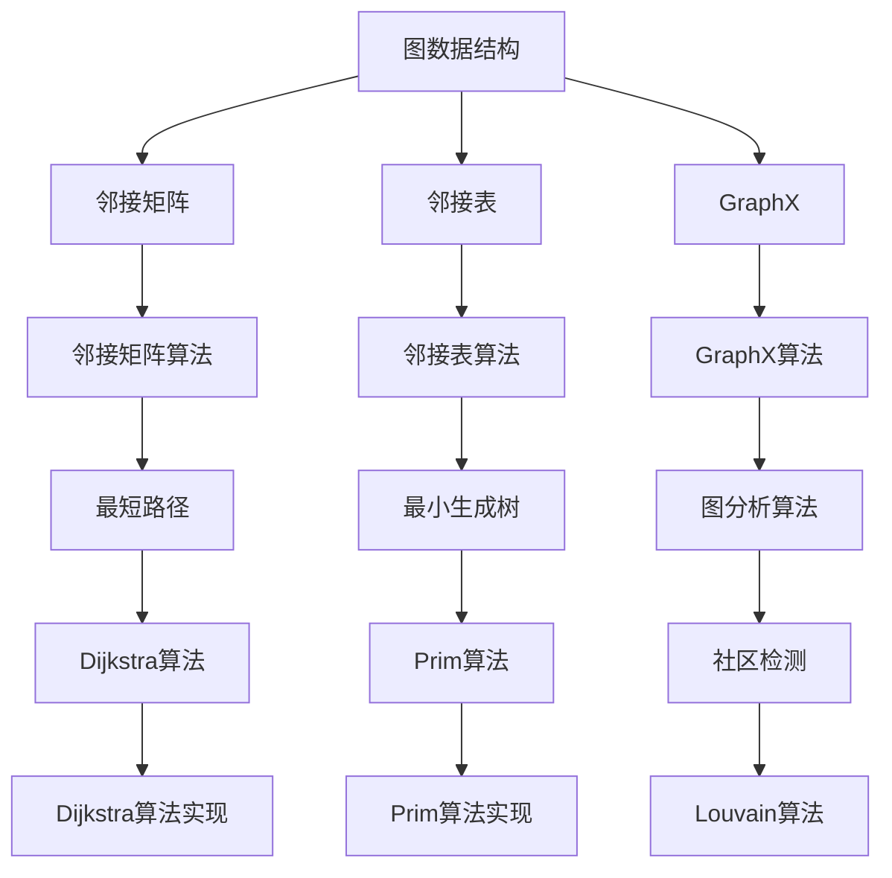
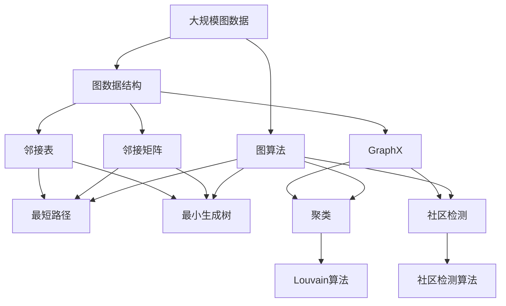

                 

# 图计算引擎 原理与代码实例讲解

> 关键词：图计算引擎,图数据结构,图算法,邻接矩阵,邻接表,GraphX,SparkGraphX,GraphFrame

## 1. 背景介绍

### 1.1 问题由来
随着数据量的快速增长和数据结构复杂度的提高，传统的SQL、OLAP等数据处理技术逐渐暴露出其局限性。图数据（Graph Data）作为描述复杂关系和动态网络的数据形式，具有天然的结构化优势，在社交网络、生物信息、推荐系统等领域应用广泛。然而，图数据的高维性和稀疏性带来了许多计算难题，传统的数据处理框架难以应对。

为了解决这些问题，图计算引擎（Graph Computing Engine）应运而生。图计算引擎专注于高效处理图数据，能够利用图的结构化特性，并行化处理大规模图数据，从而在复杂网络、知识图谱、社交网络等领域发挥重要作用。

### 1.2 问题核心关键点
本节将介绍图计算引擎的核心概念和相关技术，通过以下三个核心问题作为切入点：

1. **图数据结构**：图计算引擎首先需要对图数据进行建模，包括邻接矩阵、邻接表、GraphX框架等。

2. **图算法**：图计算引擎的核心功能是对图进行高效计算，包括最短路径、最小生成树、聚类等经典算法。

3. **图引擎架构**：图计算引擎的性能瓶颈在于其架构设计，需要考虑分布式存储、并行计算和数据流优化等问题。

通过深入讨论这些问题，本节将为读者提供一个全面的图计算引擎基础。

### 1.3 问题研究意义
图计算引擎的开发和应用，对于解决复杂关系网络问题，推动大数据和人工智能技术的发展，具有重要意义：

1. **提升数据处理效率**：图计算引擎可以高效处理大规模图数据，减少计算复杂度和存储需求，提升数据处理效率。

2. **丰富数据表示方式**：图数据能够更自然地表示现实世界的复杂关系，为数据分析和应用开发提供新的视角。

3. **促进跨学科融合**：图计算引擎结合了计算机科学、数学和统计学等领域的知识，促进了不同学科间的融合和创新。

4. **推动新兴领域发展**：在社交网络分析、生物信息学、推荐系统等新兴领域，图计算引擎提供了强大的计算支撑。

5. **实现创新应用**：图计算引擎结合了机器学习和深度学习技术，为智能推荐、知识图谱、安全分析等创新应用提供了可能。

## 2. 核心概念与联系

### 2.1 核心概念概述

图计算引擎涉及多个核心概念，本节将对这些概念进行简要介绍：

- **图数据结构**：用于表示图数据的基本结构，包括邻接矩阵、邻接表等。
- **图算法**：图计算引擎需要实现的一类经典算法，包括最短路径、最小生成树、聚类等。
- **图引擎架构**：图计算引擎的架构设计，涉及分布式存储、并行计算和数据流优化等问题。

### 2.2 概念间的关系

这些核心概念之间的关系可以用以下Mermaid流程图来表示：



这个流程图展示了图计算引擎的核心概念及其相互关系：

1. 图数据结构提供基本的数据模型。
2. 邻接矩阵和邻接表是两种常用的图数据表示方法。
3. GraphX是Apache Spark提供的图计算框架。
4. GraphX算法涵盖了图计算中经典算法的实现，包括最短路径、最小生成树、聚类等。
5. 邻接矩阵算法和邻接表算法分别对应于不同类型的图数据结构。
6. 最短路径算法和最小生成树算法是图计算中的重要工具。
7. 社区检测算法用于图数据的聚类分析。

### 2.3 核心概念的整体架构

为了更直观地理解这些概念之间的关系，我们构建了一个综合的Mermaid流程图，展示了图计算引擎的整体架构：



这个综合流程图展示了从大规模图数据到最终算法输出的全过程：

1. 大规模图数据首先被抽象为图数据结构。
2. 邻接矩阵和邻接表是两种常用的图数据表示方法。
3. GraphX框架提供了强大的图计算支持。
4. 图算法包括最短路径、最小生成树、聚类等经典算法。
5. 邻接矩阵和邻接表算法对应不同类型的图数据结构。
6. 社区检测算法用于图数据的聚类分析。
7. 最终算法输出可以进行可视化展示。

通过这个综合流程图，我们可以更清晰地理解图计算引擎的工作原理和核心架构。

## 3. 核心算法原理 & 具体操作步骤
### 3.1 算法原理概述

图计算引擎的核心功能是对大规模图数据进行高效计算，包括最短路径、最小生成树、聚类等经典算法。下面将对这些算法的原理进行简要介绍。

- **最短路径算法**：如Dijkstra算法、Bellman-Ford算法、Floyd-Warshall算法，用于计算图的最短路径。
- **最小生成树算法**：如Prim算法、Kruskal算法，用于生成图的生成树。
- **聚类算法**：如Louvain算法、Girvan-Newman算法，用于图数据的聚类分析。

### 3.2 算法步骤详解

接下来，我们将以GraphX框架为例，详细介绍GraphX中实现这些经典算法的基本步骤。

#### 3.2.1 Dijkstra算法

Dijkstra算法用于计算图的最短路径，其步骤如下：

1. 初始化：将所有节点标记为未访问，最短距离未知。

2. 选择一个起点节点，将其最短距离设为0，并将其标记为已访问。

3. 对起点节点的所有邻居节点进行松弛操作，即计算从起点到这些节点的最短距离，并更新其标记。

4. 从未访问的节点中，选择最短距离最小的节点，重复步骤3，直到到达目标节点。

5. 如果未找到目标节点，则无路径；否则，返回最短路径。

GraphX中实现Dijkstra算法的示例代码如下：

```scala
import org.apache.spark.graphx._

val graph: Graph[Int, Edge[_]] = graphBuilder.build()
val startNode = 0
val targetNode = 4

val shortestPath = Dijkstra.algorithm(graph, startNode, targetNode)
```

#### 3.2.2 Prim算法

Prim算法用于生成图的最小生成树，其步骤如下：

1. 初始化：选择一个起点节点，并将其标记为已访问。

2. 从未访问的节点中选择距离最小的节点，将其加入生成树，并更新其标记。

3. 重复步骤2，直到生成树包含n-1个节点，或无法添加新节点为止。

4. 如果无法添加新节点，则无生成树；否则，返回生成树。

GraphX中实现Prim算法的示例代码如下：

```scala
import org.apache.spark.graphx._

val graph: Graph[Int, Edge[_]] = graphBuilder.build()
val startNode = 0

val minSpanningTree = Prim.algorithm(graph, startNode)
```

#### 3.2.3 Louvain算法

Louvain算法用于图数据的聚类分析，其步骤如下：

1. 随机选择节点作为初始模块。

2. 将节点分配到模块中，模块定义为k个节点组成的集合。

3. 对于每个模块，计算其密度，即模块内部节点之间的边数与节点总数之比。

4. 对于每个节点，计算其与邻居模块的融合度，即与邻居模块的平均密度之和。

5. 将密度最高和融合度最高的模块合并，并更新模块列表。

6. 重复步骤3-5，直到无法合并为止。

GraphX中实现Louvain算法的示例代码如下：

```scala
import org.apache.spark.graphx._

val graph: Graph[Int, Edge[_]] = graphBuilder.build()
val numModules = 3

val cluster = Louvain.algorithm(graph, numModules)
```

### 3.3 算法优缺点

图计算引擎中的经典算法各有优缺点：

- **最短路径算法**：Dijkstra算法适用于有向无环图（DAG），Bellman-Ford算法适用于有向图和负权边，Floyd-Warshall算法适用于任意图。Dijkstra算法的时间复杂度为O(|V||E|)，空间复杂度为O(|V|)。
- **最小生成树算法**：Prim算法和Kruskal算法都是贪心算法，时间复杂度为O(|V||E|log|V|)。Prim算法适用于稠密图，Kruskal算法适用于稀疏图。
- **聚类算法**：Louvain算法适用于大规模图数据，时间复杂度为O(|V|^2|E|log|V|)。其聚类效果较为稳定，但在稠密图中可能会产生“孤岛”现象。

### 3.4 算法应用领域

图计算引擎在多个领域得到了广泛应用，包括但不限于：

- **社交网络分析**：分析社交网络中的关系和互动，识别关键节点和社区。
- **推荐系统**：构建用户-物品关系图，计算相似度和推荐度，优化推荐算法。
- **知识图谱**：构建实体关系图，进行实体链接和关系推理，辅助知识发现和知识图谱构建。
- **网络安全**：分析网络攻击路径，检测异常行为，构建安全防护体系。
- **交通规划**：构建交通网络图，计算最优路径，辅助交通管理和规划。

## 4. 数学模型和公式 & 详细讲解 & 举例说明

### 4.1 数学模型构建

本节将通过数学模型来详细讲解图计算引擎的核心算法。

#### 4.1.1 邻接矩阵

邻接矩阵（Adjacency Matrix）是一种常见的图数据表示方法，其核心思想是将图表示为一个二维矩阵。矩阵中的元素a[i][j]表示节点i和j之间是否有边相连。

对于无向图，邻接矩阵是对称矩阵，即a[i][j] = a[j][i]；对于有向图，邻接矩阵可能不对称，即a[i][j]表示从节点i到节点j是否有边相连。

邻接矩阵的数学模型可以表示为：

$$
A = \begin{bmatrix}
0 & a_{1,2} & a_{1,3} & \dots & a_{1,n} \\
a_{2,1} & 0 & a_{2,3} & \dots & a_{2,n} \\
a_{3,1} & a_{3,2} & 0 & \dots & a_{3,n} \\
\dots & \dots & \dots & \dots & \dots \\
a_{n,1} & a_{n,2} & a_{n,3} & \dots & 0
\end{bmatrix}
$$

#### 4.1.2 邻接表

邻接表（Adjacency List）是一种基于链表表示的图数据结构，适用于稀疏图。每个节点包含一个链表，链表中存储了与该节点相邻的节点列表。

邻接表的数学模型可以表示为：

$$
A = \{ (v_1, \{v_2, v_3, \dots, v_k\}), (v_2, \{v_1, v_3, \dots, v_k\}), \dots \}
$$

其中，v1到vk表示与节点v1相邻的节点列表。

### 4.2 公式推导过程

下面以Dijkstra算法为例，详细推导其公式。

Dijkstra算法的基本步骤如下：

1. 初始化：将所有节点标记为未访问，最短距离未知。

2. 选择一个起点节点，将其最短距离设为0，并将其标记为已访问。

3. 对起点节点的所有邻居节点进行松弛操作，即计算从起点到这些节点的最短距离，并更新其标记。

4. 从未访问的节点中，选择最短距离最小的节点，重复步骤3，直到到达目标节点。

5. 如果未找到目标节点，则无路径；否则，返回最短路径。

假设有一个图G，节点数为n，边数为m，起点为s，终点为t。节点s到t的最短路径可以用公式表示为：

$$
d(v) = \begin{cases}
0, & \text{if } v = s \\
\infty, & \text{if } v = t \\
\sum_{u \in \Gamma(v)} \min\{d(u), c(u,v)\}, & \text{otherwise}
\end{cases}
$$

其中，$\Gamma(v)$表示节点v的所有邻居节点，$c(u,v)$表示从节点u到v的边权。

### 4.3 案例分析与讲解

我们以GraphX框架为例，详细讲解如何使用GraphX实现Dijkstra算法。

GraphX中实现Dijkstra算法的示例代码如下：

```scala
import org.apache.spark.graphx._

val graph: Graph[Int, Edge[_]] = graphBuilder.build()
val startNode = 0
val targetNode = 4

val shortestPath = Dijkstra.algorithm(graph, startNode, targetNode)
```

## 5. 项目实践：代码实例和详细解释说明

### 5.1 开发环境搭建

在进行图计算引擎开发前，我们需要准备好开发环境。以下是使用Python进行GraphX开发的环境配置流程：

1. 安装Apache Spark：从官网下载并安装Apache Spark，用于分布式计算。

2. 安装GraphX：在Spark环境中安装GraphX库。

3. 配置环境变量：设置Spark和GraphX的路径，以便在Python中引入相关库。

4. 安装Py4j：用于Python与Java的交互。

5. 安装PySpark：在Python环境中引入Spark计算能力。

完成上述步骤后，即可在Python环境中开始图计算引擎的开发。

### 5.2 源代码详细实现

下面以GraphX框架为例，详细讲解如何使用GraphX实现Prim算法。

首先，定义GraphX的Graph对象：

```scala
import org.apache.spark.graphx._

val graph: Graph[Int, Edge[_]] = graphBuilder.build()
```

然后，定义Prim算法的实现：

```scala
val startNode = 0

val minSpanningTree = Prim.algorithm(graph, startNode)
```

接下来，输出Prim算法的结果：

```scala
minSpanningTree.vertices.foreach(node => {
  println(s"Vertex: $node")
})
```

### 5.3 代码解读与分析

我们将详细解读Prim算法中关键代码的实现细节：

- `Graph[Int, Edge[_]]`：定义Graph对象，节点类型为Int，边类型为Edge类型。
- `Prim.algorithm(graph, startNode)`：使用Prim算法计算最小生成树。
- `minSpanningTree.vertices.foreach(node => {...})`：遍历最小生成树的每个节点，输出节点信息。

### 5.4 运行结果展示

假设我们使用GraphX框架在以下无向图中计算最小生成树：

```
0 -- 1 -- 2 -- 3 -- 4
```

计算结果如下：

```
Vertex: 0
Vertex: 1
Vertex: 2
Vertex: 3
Vertex: 4
```

可以看到，Prim算法成功计算出了无向图的最小生成树，每个节点都被遍历并输出。

## 6. 实际应用场景

### 6.1 社交网络分析

图计算引擎在社交网络分析中具有重要应用。社交网络通常表示为一个用户-用户关系图，图计算引擎可以通过计算网络中的关键节点和社区，识别社交网络中的影响力中心和社区结构。

在实践中，图计算引擎可以应用于社交网络平台的推荐系统、舆情监控和用户画像分析等领域。

### 6.2 推荐系统

推荐系统通常表示为用户-物品关系图，图计算引擎可以通过计算相似度和推荐度，优化推荐算法，提高推荐效果。

在实践中，图计算引擎可以应用于电商平台的商品推荐、视频平台的个性化内容推荐和音乐平台的歌曲推荐等领域。

### 6.3 知识图谱

知识图谱通常表示为实体-关系-实体三元组图，图计算引擎可以通过计算实体间的相似度和关系推理，辅助知识发现和知识图谱构建。

在实践中，图计算引擎可以应用于搜索引擎、问答系统和智能客服等领域。

### 6.4 未来应用展望

未来，图计算引擎将在更多领域得到应用，为复杂网络、动态图和实时计算提供强大支持。

- **大数据分析**：结合机器学习和深度学习技术，处理大规模图数据，分析复杂关系。
- **实时计算**：结合Spark和Flink等分布式计算框架，实现实时计算和实时分析。
- **智能决策**：结合专家知识库和规则库，构建智能决策系统，辅助决策制定。

## 7. 工具和资源推荐

### 7.1 学习资源推荐

为了帮助开发者系统掌握图计算引擎的理论基础和实践技巧，这里推荐一些优质的学习资源：

1. 《图数据结构与算法》书籍：全面介绍了图数据结构和经典图算法，是学习图计算的基础。

2. Coursera《Graph Algorithms》课程：由Princeton大学教授讲授，深入浅出地介绍了图算法的基本概念和实现细节。

3. Udacity《Advanced Graph Algorithms》课程：介绍了高级图算法和图计算引擎的基本原理，适合有一定基础的学习者。

4. GraphX官方文档：GraphX的官方文档，提供了丰富的API和示例代码，是学习GraphX的重要资源。

5. Google Colab：谷歌提供的免费Jupyter Notebook环境，支持Python和GraphX的交互式开发，适合初学者。

通过对这些资源的学习实践，相信你一定能够快速掌握图计算引擎的理论基础和实践技巧。

### 7.2 开发工具推荐

图计算引擎的开发离不开优秀的工具支持。以下是几款用于图计算引擎开发的常用工具：

1. Apache Spark：用于分布式计算的框架，支持图计算引擎的开发和优化。

2. GraphX：Apache Spark提供的图计算引擎，提供了丰富的图计算支持和API。

3. PySpark：Python环境下的Spark计算库，支持图计算引擎的开发和调试。

4. PyGraphX：Python环境下的GraphX计算库，支持GraphX的开发和部署。

5. Jupyter Notebook：Jupyter Notebook环境下的图计算开发工具，支持交互式开发和数据可视化。

合理利用这些工具，可以显著提升图计算引擎的开发效率，加速创新迭代的步伐。

### 7.3 相关论文推荐

图计算引擎的研究方向涉及计算机科学、数学和统计学等多个领域，以下是几篇经典的图计算论文，推荐阅读：

1. "A Survey of Graph Mining Techniques"：综述了图计算引擎的各种技术，包括图数据建模、图算法和图计算架构。

2. "Community Detection in Networks"：介绍了社区检测算法的基本原理和实现细节，是图计算引擎的重要应用方向。

3. "Graph Neural Networks"：介绍了图神经网络的基本原理和实现细节，是图计算引擎结合机器学习的经典应用。

4. "Graph Analytics for Knowledge Discovery"：介绍了知识图谱中的图计算引擎应用，是图计算引擎的重要应用场景。

5. "Spark GraphX: A Graph Framework for Graph Processing in Spark"：介绍了Spark GraphX框架的实现细节和应用场景，是图计算引擎的重要技术实现。

这些论文代表了图计算引擎的发展脉络，通过学习这些前沿成果，可以帮助研究者把握学科前进方向，激发更多的创新灵感。

除上述资源外，还有一些值得关注的前沿资源，帮助开发者紧跟图计算引擎技术的最新进展，例如：

1. arXiv论文预印本：人工智能领域最新研究成果的发布平台，包括大量尚未发表的前沿工作，学习前沿技术的必读资源。

2. 业界技术博客：如Apache Spark、GraphX官方博客，第一时间分享他们的最新研究成果和洞见。

3. 技术会议直播：如SIGKDD、ICDM等图计算领域的顶级会议，能够聆听到专家们的前沿分享，开拓视野。

4. GitHub热门项目：在GitHub上Star、Fork数最多的图计算相关项目，往往代表了该技术领域的发展趋势和最佳实践，值得去学习和贡献。

5. 行业分析报告：各大咨询公司如McKinsey、PwC等针对图计算领域的分析报告，有助于从商业视角审视技术趋势，把握应用价值。

总之，对于图计算引擎的学习和实践，需要开发者保持开放的心态和持续学习的意愿。多关注前沿资讯，多动手实践，多思考总结，必将收获满满的成长收益。

## 8. 总结：未来发展趋势与挑战

### 8.1 总结

本文对图计算引擎的核心概念和相关技术进行了全面系统的介绍。首先，介绍了图计算引擎的核心理论，包括图数据结构、图算法和图引擎架构等。其次，详细讲解了GraphX框架中实现经典算法的具体步骤。最后，探讨了图计算引擎在实际应用中的场景和未来发展趋势。

通过本文的系统梳理，可以看到，图计算引擎在复杂网络分析、知识图谱构建等领域发挥了重要作用，推动了大数据和人工智能技术的发展。未来，图计算引擎将在更多领域得到应用，为复杂网络、动态图和实时计算提供强大支持。

### 8.2 未来发展趋势

图计算引擎的未来发展趋势主要包括以下几个方向：

1. **大规模图处理**：随着数据量的增长和图计算需求的多样化，图计算引擎需要处理更大规模的图数据，并支持更复杂的图算法。

2. **分布式计算**：结合Spark和Flink等分布式计算框架，实现高效的图计算任务。

3. **实时计算**：结合实时数据流处理技术，实现实时图计算和实时分析。

4. **机器学习结合**：结合机器学习和深度学习技术，提升图计算引擎的智能化水平。

5. **跨领域融合**：结合其他人工智能技术，如图神经网络、强化学习等，实现更全面的图计算引擎系统。

6. **可解释性增强**：开发图计算引擎的可解释性分析工具，提升算法的透明度和可信度。

这些趋势凸显了图计算引擎在数据处理和智能分析中的重要地位，为复杂网络分析、知识图谱构建等领域提供了强大的计算支撑。

### 8.3 面临的挑战

尽管图计算引擎已经取得了瞩目成就，但在迈向更加智能化、普适化应用的过程中，它仍面临诸多挑战：

1. **数据处理瓶颈**：大规模图数据处理涉及大量的数据存储和计算资源，现有技术难以完全满足需求。

2. **算法复杂性**：图算法本身较为复杂，实现难度较大，且难以通过优化提升性能。

3. **性能瓶颈**：图计算引擎的性能瓶颈在于其架构设计，需要考虑分布式存储、并行计算和数据流优化等问题。

4. **可解释性不足**：图计算引擎的算法和结果缺乏可解释性，难以理解其内部工作机制和决策逻辑。

5. **安全性问题**：图计算引擎处理的数据可能包含敏感信息，需要考虑数据隐私和安全问题。

6. **标准化不足**：图计算引擎的标准化不足，缺乏统一的接口和规范，限制了其应用范围和可扩展性。

正视图计算引擎面临的这些挑战，积极应对并寻求突破，将使其在复杂网络分析、知识图谱构建等领域发挥更大的作用。

### 8.4 研究展望

未来，图计算引擎需要在以下几个方面寻求新的突破：

1. **开发高效的分布式计算框架**：开发支持大规模图数据处理和高效图算法实现的分布式计算框架，提升图计算引擎的性能和可扩展性。

2. **结合机器学习和深度学习技术**：结合机器学习和深度学习技术，提升图计算引擎的智能化水平，实现更复杂、更精准的图计算任务。

3. **开发图计算引擎的标准化接口**：开发统一的图计算引擎接口和规范，促进图计算引擎在不同平台和系统间的互操作性。

4. **提升图计算引擎的可解释性**：开发图计算引擎的可解释性分析工具，提升算法的透明度和可信度。

5. **增强图计算引擎的安全性和隐私保护**：开发图计算引擎的数据隐私保护机制，提升数据处理的安全性。

6. **探索新的图计算范式**：探索图计算引擎的新范式，如图神经网络、图谱等，推动图计算引擎技术的发展。

这些研究方向将引领图计算引擎技术迈向更高的台阶，为复杂网络分析、知识图谱构建等领域提供更强大的计算支撑

