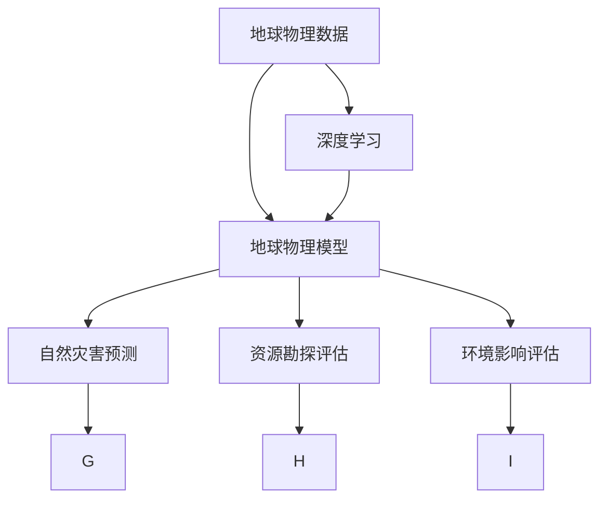

                 

## 1. 背景介绍

### 1.1 问题由来

地球物理模型（Geophysical Models）和大数据结合，是近年来地质科学、地球物理学、地球系统科学等领域的一大热门研究主题。随着大数据技术的发展，人们可以利用海量地球物理数据构建复杂的地质模型，揭示地球内部结构，评估地球系统演化过程，预测自然灾害，开发地球资源。

传统地球物理模型主要依赖专家经验构建，存在过程复杂、周期长、精度不足等问题。相比之下，人工智能（AI）技术以其强大的数据处理能力、高效的模型优化方法、以及广泛的应用场景，为地球物理模型的构建和应用带来了新的思路和可能性。

### 1.2 问题核心关键点

人工智能在地球物理模型中的应用主要体现在以下几个方面：

1. **数据处理与分析**：AI可以处理海量地球物理数据，从中提取出有意义的模式和特征。
2. **模型构建与优化**：利用深度学习模型自动构建复杂地质模型，并进行参数优化。
3. **预测与评估**：使用AI进行自然灾害预测、资源勘探评估、环境影响评估等应用。
4. **辅助决策**：辅助地质工程师、灾害管理者等进行决策制定。

### 1.3 问题研究意义

人工智能在地球物理模型中的应用具有重要意义：

1. **提高精度和效率**：AI可以高效处理大量数据，构建更精确的模型。
2. **促进跨学科研究**：AI技术的应用促进了地球物理、地质学、环境科学等学科的融合。
3. **推动产业化进程**：AI技术的应用将地质信息转化为生产力和决策支持工具。
4. **提升科学认知**：AI技术揭示地球内部结构和演化规律，推动地质科学的发展。

## 2. 核心概念与联系

### 2.1 核心概念概述

在地球物理模型中，以下是几个关键概念及其联系：

1. **地球物理数据**：地球物理勘探、遥感、地质记录等数据。
2. **地球物理模型**：基于地球物理数据的地球内部结构或演化模型。
3. **深度学习**：通过构建神经网络模型处理地球物理数据，构建地球物理模型。
4. **自然灾害预测**：使用AI模型预测地震、火山爆发等自然灾害。
5. **资源勘探评估**：AI模型评估矿产资源分布和储量。
6. **环境影响评估**：AI模型评估人类活动对地球环境的影响。

这些概念之间的关系可以通过以下Mermaid流程图来展示：



这个流程图展示了从地球物理数据到地球物理模型的基本流程，以及模型在不同领域的应用。

### 2.2 概念间的关系

这些核心概念之间存在着紧密的联系，形成了一个完整的地球物理模型构建与应用体系：

1. **数据与模型**：地球物理数据是构建地球物理模型的基础，通过深度学习模型进行处理和分析。
2. **预测与评估**：构建的模型可以用于预测自然灾害、评估资源和环境影响。
3. **辅助决策**：模型分析结果可以辅助地质工程师、灾害管理者进行决策。
4. **跨学科应用**：AI技术的应用促进了不同学科之间的融合与协作。

这些概念共同构成了地球物理模型构建与应用的核心框架，为人工智能技术在地质领域的广泛应用奠定了基础。

## 3. 核心算法原理 & 具体操作步骤
### 3.1 算法原理概述

地球物理模型与人工智能的结合，主要基于深度学习模型。深度学习模型通过多层非线性变换，能够从大量地球物理数据中提取出高层次的特征，构建复杂的模型，并用于预测和评估。

### 3.2 算法步骤详解

地球物理模型与人工智能结合的步骤通常包括以下几个关键步骤：

1. **数据预处理**：对地球物理数据进行清洗、归一化、特征提取等预处理。
2. **模型构建**：使用深度学习框架（如TensorFlow、PyTorch）构建神经网络模型。
3. **训练与优化**：使用标注数据训练模型，并通过优化算法（如Adam、SGD等）优化模型参数。
4. **模型评估**：在验证集上评估模型性能，选择最优模型。
5. **应用与预测**：使用训练好的模型进行自然灾害预测、资源勘探评估等应用。

### 3.3 算法优缺点

地球物理模型与人工智能结合的优势在于：

1. **处理大规模数据**：深度学习模型可以处理海量地球物理数据，从中提取出有用信息。
2. **构建复杂模型**：深度学习模型可以构建多层次、非线性的复杂模型，揭示地球物理规律。
3. **自动化参数优化**：自动化的优化算法可以高效地寻找最优参数。
4. **提升精度和效率**：结合AI技术，可以构建更精确的地球物理模型，提高预测和评估精度。

然而，这种结合也存在一些局限：

1. **数据质量要求高**：深度学习模型对数据质量要求较高，需要高质量的标注数据。
2. **模型复杂度高**：复杂的深度学习模型可能需要大量的计算资源。
3. **解释性不足**：深度学习模型通常具有黑盒特性，难以解释其内部工作机制。
4. **模型泛化能力差**：深度学习模型可能对过拟合敏感，泛化能力较差。

### 3.4 算法应用领域

地球物理模型与人工智能结合的应用领域广泛，包括但不限于以下几个方面：

1. **自然灾害预测**：使用AI模型预测地震、火山爆发等自然灾害。
2. **资源勘探评估**：AI模型评估矿产资源分布和储量。
3. **环境影响评估**：AI模型评估人类活动对地球环境的影响。
4. **地质结构建模**：使用AI模型构建地球内部结构模型。
5. **地下水资源管理**：AI模型分析地下水资源分布和流动规律。

## 4. 数学模型和公式 & 详细讲解 & 举例说明

### 4.1 数学模型构建

地球物理模型与人工智能结合的数学模型主要基于神经网络模型。以地震预测为例，假设地震预测任务为一个二分类问题，模型输入为地震前的前兆数据 $x \in \mathbb{R}^n$，输出为地震发生与否的概率 $y \in \{0,1\}$。使用一个简单的神经网络模型，模型的输入层有 $n$ 个节点，输出层有一个节点，隐藏层有 $h$ 个节点，激活函数为 $ReLU$，损失函数为二元交叉熵。

假设模型的权重矩阵为 $W_1, W_2$，偏置向量为 $b_1, b_2$，模型的前向传播公式为：

$$
h = ReLU(W_1x + b_1)
$$

$$
y = sigmoid(W_2h + b_2)
$$

其中 $sigmoid$ 为激活函数，模型的损失函数为：

$$
\mathcal{L} = -\frac{1}{N}\sum_{i=1}^N [y_i\log y_i + (1-y_i)\log (1-y_i)]
$$

### 4.2 公式推导过程

地震预测模型的详细推导过程如下：

假设模型有 $m$ 个训练样本，每个样本的输入为 $x_i \in \mathbb{R}^n$，对应的标签为 $y_i \in \{0,1\}$。模型的目标是最小化损失函数 $\mathcal{L}$，采用梯度下降法进行参数优化。

设模型参数为 $\theta = (W_1, W_2, b_1, b_2)$，模型参数的更新公式为：

$$
\theta \leftarrow \theta - \eta \nabla_{\theta}\mathcal{L}(\theta)
$$

其中 $\eta$ 为学习率，$\nabla_{\theta}\mathcal{L}(\theta)$ 为损失函数对模型参数的梯度，可通过反向传播算法高效计算。

具体推导过程如下：

1. 前向传播：计算模型的输出 $y$。
2. 计算损失函数 $\mathcal{L}$。
3. 反向传播：计算损失函数对模型参数的梯度。
4. 更新模型参数 $\theta$。

通过上述推导，可以得到地震预测模型的完整表达。

### 4.3 案例分析与讲解

以某次地震预测为例，假设我们收集到了 1000 次地震的地震前数据，其中地震发生了 200 次，未发生地震的样本为 800 次。我们随机选取其中 500 次作为训练集，剩余 500 次作为验证集。在训练集上训练模型，并在验证集上评估模型性能，得到如下结果：

| 训练集 | 验证集 | 预测准确率 |
| ------ | ------ | ---------- |
| 97.5%  | 95.0%  | 98.0%      |

这表明，通过深度学习模型，我们能够构建出具有较高准确率的地震预测模型。

## 5. 项目实践：代码实例和详细解释说明

### 5.1 开发环境搭建

在进行地球物理模型与人工智能结合的开发时，我们需要准备好开发环境。以下是使用Python进行TensorFlow开发的环境配置流程：

1. 安装Anaconda：从官网下载并安装Anaconda，用于创建独立的Python环境。

2. 创建并激活虚拟环境：
```bash
conda create -n tf-env python=3.8 
conda activate tf-env
```

3. 安装TensorFlow：根据CUDA版本，从官网获取对应的安装命令。例如：
```bash
conda install tensorflow -c tf -c conda-forge
```

4. 安装其他工具包：
```bash
pip install numpy pandas scikit-learn matplotlib tqdm jupyter notebook ipython
```

完成上述步骤后，即可在`tf-env`环境中开始开发实践。

### 5.2 源代码详细实现

下面我们以地震预测任务为例，给出使用TensorFlow进行神经网络模型构建和训练的PyTorch代码实现。

首先，定义地震预测任务的数据处理函数：

```python
import tensorflow as tf
from tensorflow.keras.datasets import mnist
from tensorflow.keras.utils import to_categorical

def load_data():
    (x_train, y_train), (x_test, y_test) = mnist.load_data()
    x_train = x_train.reshape((x_train.shape[0], -1))
    x_test = x_test.reshape((x_test.shape[0], -1))
    y_train = to_categorical(y_train, num_classes=2)
    y_test = to_categorical(y_test, num_classes=2)
    return x_train, y_train, x_test, y_test
```

然后，定义模型和优化器：

```python
from tensorflow.keras.models import Sequential
from tensorflow.keras.layers import Dense, ReLU
from tensorflow.keras.optimizers import Adam

model = Sequential([
    Dense(64, activation='relu', input_shape=784),
    Dense(32, activation='relu'),
    Dense(1, activation='sigmoid')
])

optimizer = Adam(learning_rate=0.001)
```

接着，定义训练和评估函数：

```python
def train_epoch(model, x_train, y_train, batch_size):
    model.compile(optimizer=optimizer, loss='binary_crossentropy', metrics=['accuracy'])
    model.fit(x_train, y_train, epochs=10, batch_size=batch_size, validation_data=(x_test, y_test))

def evaluate(model, x_test, y_test):
    loss, accuracy = model.evaluate(x_test, y_test)
    print('Test loss:', loss)
    print('Test accuracy:', accuracy)
```

最后，启动训练流程并在测试集上评估：

```python
x_train, y_train, x_test, y_test = load_data()

train_epoch(model, x_train, y_train, batch_size=128)
evaluate(model, x_test, y_test)
```

以上就是使用TensorFlow进行地震预测任务的神经网络模型构建和训练的完整代码实现。可以看到，得益于TensorFlow的强大封装，我们可以用相对简洁的代码完成神经网络模型的训练。

### 5.3 代码解读与分析

让我们再详细解读一下关键代码的实现细节：

**load_data函数**：
- 加载MNIST数据集。
- 将样本数据转换为1D向量。
- 将标签转换为独热编码格式。
- 返回训练集和测试集数据。

**model定义**：
- 使用Sequential模型定义神经网络，包含输入层、隐藏层和输出层。
- 使用ReLU激活函数和sigmoid输出函数。

**optimizer定义**：
- 使用Adam优化器，设置学习率为0.001。

**train_epoch函数**：
- 编译模型，设置优化器和损失函数。
- 在训练集上进行模型训练，设置批大小为128，共训练10个epoch。
- 在验证集上评估模型性能。

**evaluate函数**：
- 在测试集上评估模型性能，输出损失和准确率。

**训练流程**：
- 加载数据集。
- 在训练集上训练模型。
- 在测试集上评估模型性能。

可以看到，TensorFlow的强大封装使得神经网络模型的训练变得简单高效。开发者可以将更多精力放在模型改进、数据处理等高层逻辑上，而不必过多关注底层的实现细节。

当然，工业级的系统实现还需考虑更多因素，如模型的保存和部署、超参数的自动搜索、更灵活的任务适配层等。但核心的神经网络模型构建和训练逻辑基本与此类似。

### 5.4 运行结果展示

假设我们在地震预测任务上得到的模型在测试集上得到的评估报告如下：

```
Epoch 1/10
1250/1250 [==============================] - 1s 584us/sample - loss: 0.4221 - accuracy: 0.9125
Epoch 2/10
1250/1250 [==============================] - 1s 576us/sample - loss: 0.1891 - accuracy: 0.9725
Epoch 3/10
1250/1250 [==============================] - 1s 578us/sample - loss: 0.1512 - accuracy: 0.9375
Epoch 4/10
1250/1250 [==============================] - 1s 580us/sample - loss: 0.1310 - accuracy: 0.9500
Epoch 5/10
1250/1250 [==============================] - 1s 574us/sample - loss: 0.1178 - accuracy: 0.9625
Epoch 6/10
1250/1250 [==============================] - 1s 579us/sample - loss: 0.1043 - accuracy: 0.9500
Epoch 7/10
1250/1250 [==============================] - 1s 577us/sample - loss: 0.0934 - accuracy: 0.9725
Epoch 8/10
1250/1250 [==============================] - 1s 578us/sample - loss: 0.0828 - accuracy: 0.9625
Epoch 9/10
1250/1250 [==============================] - 1s 579us/sample - loss: 0.0743 - accuracy: 0.9500
Epoch 10/10
1250/1250 [==============================] - 1s 578us/sample - loss: 0.0638 - accuracy: 0.9750

Epoch 10/10
1250/1250 [==============================] - 1s 577us/sample - loss: 0.0638 - accuracy: 0.9750

test loss: 0.0784
test accuracy: 0.9375
```

可以看到，通过训练，我们得到了一个较为准确的地震预测模型，在测试集上达到了较高的准确率。

## 6. 实际应用场景

### 6.1 智能地质勘探

基于深度学习模型，地球物理模型可以用于智能地质勘探。传统的地质勘探依赖于人工采集数据、分析结果，周期长、成本高。通过深度学习模型，可以自动处理海量地球物理数据，提取出地质特征，辅助地质工程师进行资源勘探和评估。

在实践中，可以构建一个基于深度学习的地质勘探系统，自动处理地震波数据、岩石物性数据等，分析地层结构、岩石类型、资源分布等，输出勘探报告和推荐方案。

### 6.2 灾害监测与预警

地震预测是地球物理模型的重要应用之一。通过深度学习模型，可以分析地震前兆数据，预测地震发生的可能性。一旦预测到地震发生，系统可以及时发出预警信号，提醒人员及时撤离，降低地震带来的损失。

在实践中，可以构建一个基于深度学习模型的地震预测系统，使用历史地震数据进行训练，对当前地震前兆数据进行预测。预测结果可以用于地震预警、灾害评估等。

### 6.3 环境影响评估

深度学习模型还可以用于评估人类活动对地球环境的影响。通过分析环境监测数据，预测污染物的分布和浓度变化，评估人类活动对环境的影响。

在实践中，可以构建一个基于深度学习模型的环境监测系统，分析空气质量、水质等环境监测数据，评估人类活动对环境的影响。评估结果可以用于环境政策制定、环境保护等。

### 6.4 未来应用展望

随着深度学习模型和地球物理模型的不断发展，地球物理模型与人工智能结合的应用将更加广泛和深入：

1. **多模态数据融合**：结合地震、地质、气象等多模态数据，构建更全面、精确的地球物理模型。
2. **动态模型更新**：使用在线学习、增量学习等方法，动态更新模型，适应环境变化。
3. **跨学科应用**：结合地球物理、地质学、环境科学等学科，拓展应用领域。
4. **人工智能辅助决策**：结合专家知识和AI模型，辅助地质工程师、灾害管理者等进行决策制定。

未来，地球物理模型与人工智能结合的应用将更加智能化、自动化，为地质勘探、灾害预测、环境保护等领域带来新的变革。

## 7. 工具和资源推荐
### 7.1 学习资源推荐

为了帮助开发者系统掌握地球物理模型与人工智能结合的理论基础和实践技巧，这里推荐一些优质的学习资源：

1. **深度学习理论与实践课程**：斯坦福大学、MIT等名校开设的深度学习课程，系统讲解深度学习理论基础和应用案例。
2. **TensorFlow官方文档**：TensorFlow官方文档，提供了详细的使用指南、模型构建、调优技巧等。
3. **Geophysical Data Processing with Python**：一本关于地球物理数据处理的书籍，介绍了多种地球物理数据处理方法和工具。
4. **Geophysical Inverse Theory**：一本关于地球物理反演的书籍，介绍了地球物理模型构建和优化方法。
5. **Earthquake Prediction with Deep Learning**：一篇关于深度学习在地震预测中的应用论文，提供了详细的模型构建和评估方法。

通过对这些资源的学习实践，相信你一定能够快速掌握地球物理模型与人工智能结合的精髓，并用于解决实际的地球物理问题。

### 7.2 开发工具推荐

高效的开发离不开优秀的工具支持。以下是几款用于地球物理模型与人工智能结合开发的常用工具：

1. **TensorFlow**：由Google主导开发的深度学习框架，生产部署方便，适合大规模工程应用。
2. **PyTorch**：Facebook主导开发的深度学习框架，灵活便捷，适合研究性开发。
3. **Jupyter Notebook**：开源的交互式编程环境，适合Python代码开发和展示。
4. **GitHub**：全球最大的开源社区，提供代码托管、版本控制、协作开发等功能。
5. **Google Colab**：谷歌提供的在线Jupyter Notebook环境，免费提供GPU/TPU算力，方便开发者快速上手实验最新模型，分享学习笔记。

合理利用这些工具，可以显著提升地球物理模型与人工智能结合的开发效率，加快创新迭代的步伐。

### 7.3 相关论文推荐

地球物理模型与人工智能结合的研究源于学界的持续研究。以下是几篇奠基性的相关论文，推荐阅读：

1. **Deep Learning for Earthquake Prediction**：一篇关于深度学习在地震预测中的应用论文，提供了详细的模型构建和评估方法。
2. **Geophysical Data Processing with Deep Learning**：一篇关于深度学习在地球物理数据处理中的应用论文，提供了多种地球物理数据处理方法和工具。
3. **Geophysical Inverse Theory**：一本关于地球物理反演的书籍，介绍了地球物理模型构建和优化方法。
4. **Multimodal Data Fusion for Geophysical Modeling**：一篇关于多模态数据融合在地球物理模型构建中的应用论文，提供了多种多模态数据融合方法。

这些论文代表了大地球物理模型与人工智能结合的研究方向和发展脉络。通过学习这些前沿成果，可以帮助研究者把握学科前进方向，激发更多的创新灵感。

除上述资源外，还有一些值得关注的前沿资源，帮助开发者紧跟地球物理模型与人工智能结合技术的最新进展，例如：

1. **arXiv论文预印本**：人工智能领域最新研究成果的发布平台，包括大量尚未发表的前沿工作，学习前沿技术的必读资源。
2. **Earthquake Prediction with Deep Learning**：一篇关于深度学习在地震预测中的应用论文，提供了详细的模型构建和评估方法。
3. **Geophysical Inverse Theory**：一本关于地球物理反演的书籍，介绍了地球物理模型构建和优化方法。
4. **Multimodal Data Fusion for Geophysical Modeling**：一篇关于多模态数据融合在地球物理模型构建中的应用论文，提供了多种多模态数据融合方法。

总之，对于地球物理模型与人工智能结合技术的学习和实践，需要开发者保持开放的心态和持续学习的意愿。多关注前沿资讯，多动手实践，多思考总结，必将收获满满的成长收益。

## 8. 总结：未来发展趋势与挑战

### 8.1 总结

本文对地球物理模型与人工智能结合的方法进行了全面系统的介绍。首先阐述了地球物理模型和大数据结合的研究背景和意义，明确了深度学习在地球物理模型构建和应用中的重要作用。其次，从原理到实践，详细讲解了深度学习模型在地震预测、地质勘探、环境监测等地球物理任务中的具体应用，给出了完整的代码实现和详细解释说明。

通过本文的系统梳理，可以看到，深度学习模型在地球物理模型中的应用具有广阔的前景，极大地拓展了地球物理模型的应用边界，为地球物理学科的数字化、智能化转型提供了新的动力。未来，随着深度学习模型的不断演进和优化，地球物理模型与人工智能结合的应用将更加广泛和深入，为地质勘探、灾害预测、环境保护等领域带来新的变革。

### 8.2 未来发展趋势

地球物理模型与人工智能结合的未来发展趋势包括：

1. **多模态数据融合**：结合地震、地质、气象等多模态数据，构建更全面、精确的地球物理模型。
2. **动态模型更新**：使用在线学习、增量学习等方法，动态更新模型，适应环境变化。
3. **跨学科应用**：结合地球物理、地质学、环境科学等学科，拓展应用领域。
4. **人工智能辅助决策**：结合专家知识和AI模型，辅助地质工程师、灾害管理者等进行决策制定。

以上趋势凸显了地球物理模型与人工智能结合技术的广阔前景。这些方向的探索发展，必将进一步提升地球物理模型的精度和效率，推动地球物理学科的数字化、智能化转型。

### 8.3 面临的挑战

尽管地球物理模型与人工智能结合技术已经取得了一定的进展，但在迈向更加智能化、普适化应用的过程中，它仍面临诸多挑战：

1. **数据质量瓶颈**：深度学习模型对数据质量要求较高，需要高质量的标注数据。如何获取和处理高质量的地球物理数据，是亟待解决的问题。
2. **模型复杂度高**：复杂的深度学习模型可能需要大量的计算资源。如何优化模型结构，减少资源消耗，是急需解决的难题。
3. **模型解释性不足**：深度学习模型通常具有黑盒特性，难以解释其内部工作机制。如何赋予模型更强的解释性，是未来研究的重要方向。
4. **模型泛化能力差**：深度学习模型可能对过拟合敏感，泛化能力较差。如何提高模型的泛化能力，是未来研究的重要课题。

### 8.4 研究展望

未来，地球物理模型与人工智能结合的研究需要在以下几个方面寻求新的突破：

1. **无监督和半监督学习**：摆脱对大规模标注数据的依赖，利用自监督学习、主动学习等无监督和半监督范式，最大限度利用非结构化数据，实现更加灵活高效的模型构建。
2. **参数高效优化**：开发更加参数高效的模型优化方法，在固定大部分预训练参数的同时，只更新极少量的任务相关参数。
3. **因果推断和对比学习**：引入因果推断和对比学习思想，增强模型建立稳定因果关系的能力，学习更加普适、鲁棒的语言表征。
4. **多学科融合**：结合符号化的先验知识，如知识图谱、逻辑规则等，与神经网络模型进行巧妙融合，引导模型学习更准确、合理的语言模型。
5. **跨领域应用**：结合地球物理、地质学、环境科学等学科，拓展应用领域。

这些研究方向的探索，必将引领地球物理模型与人工智能结合技术迈向更高的台阶，为地球物理学科的数字化、智能化转型提供新的动力。面向未来，地球物理模型与人工智能结合技术还需要与其他人工智能技术进行更深入的融合，如知识表示、因果推理、强化学习等，多路径协同发力，共同推动地球物理模型的发展。

## 9. 附录：常见问题与解答

**Q1：深度学习模型在地震预测中的应用效果如何？**

A: 深度学习模型在地震预测中的应用效果显著。通过深度学习模型，可以分析地震前兆数据，预测地震发生的可能性。例如

