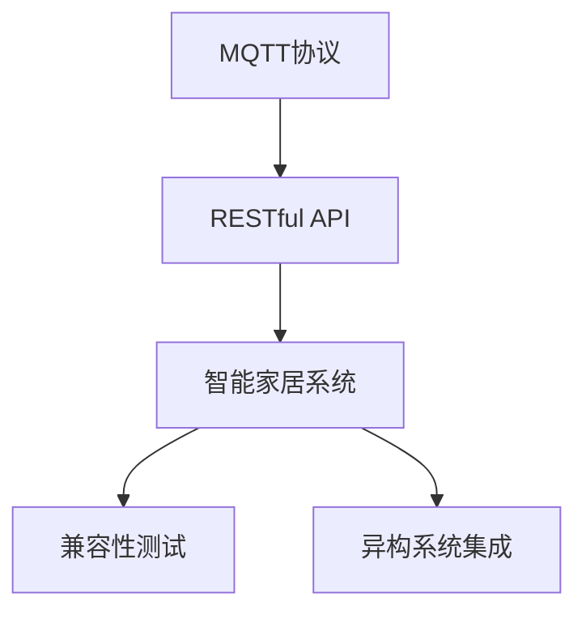
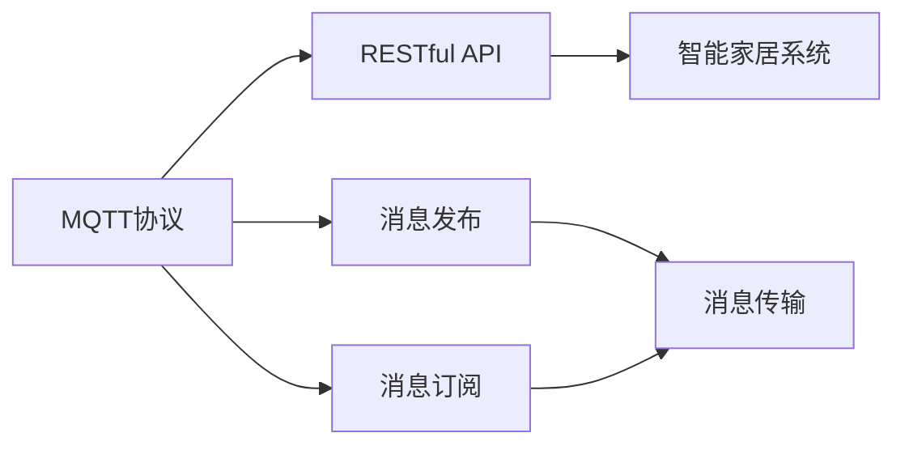
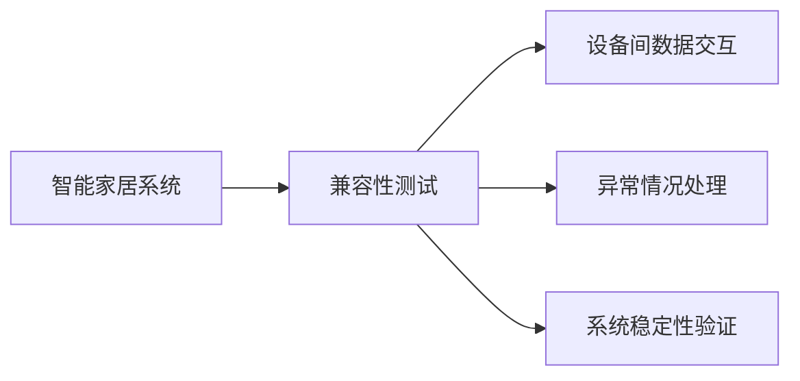
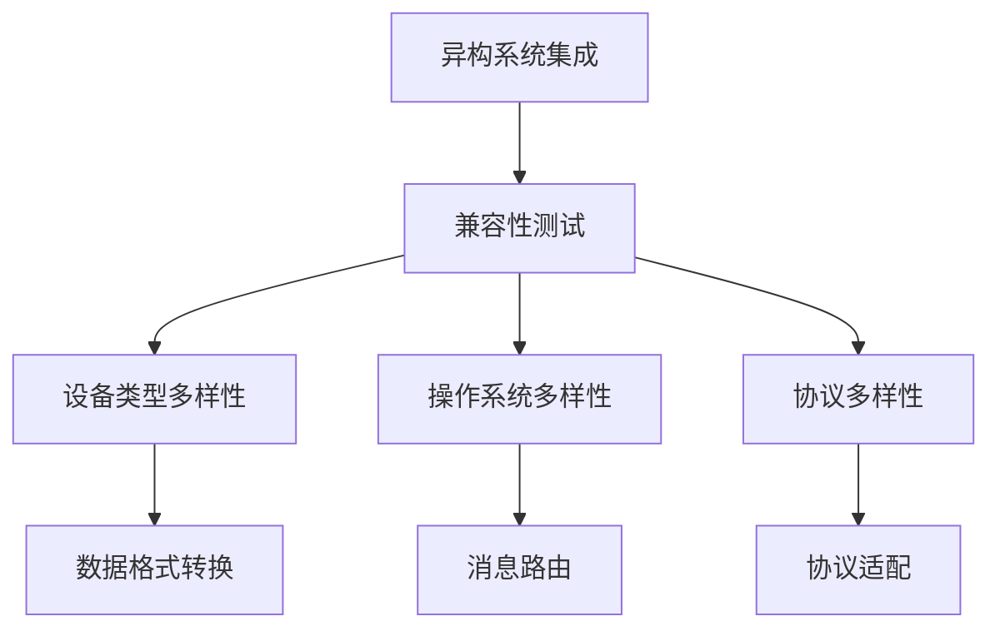
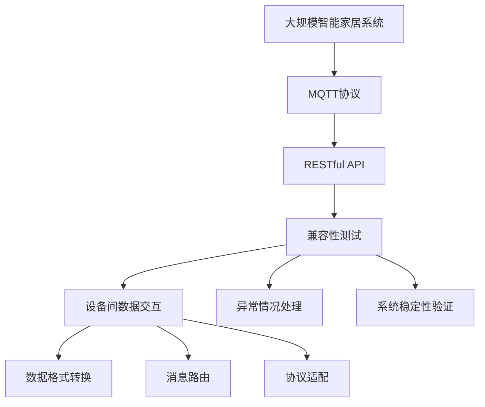

                 

# 基于MQTT协议和RESTful API的智能家居系统兼容性测试

> 关键词：MQTT协议, RESTful API, 智能家居系统, 兼容性测试, 异构系统集成, 系统稳定性

## 1. 背景介绍

### 1.1 问题由来

随着物联网技术的发展，智能家居系统已经逐渐成为人们生活中不可或缺的一部分。然而，在智能家居系统中，设备种类繁多，操作系统各异，不同设备之间的兼容性问题日益突出。特别是在使用MQTT协议和RESTful API进行数据交互时，不同系统间的兼容性问题尤为显著。为解决这些问题，有必要对智能家居系统进行全面、系统的兼容性测试。

### 1.2 问题核心关键点

智能家居系统兼容性测试的核心在于验证MQTT协议和RESTful API在不同设备和系统间是否能正常工作，以及系统是否能抵抗外部环境变化和异常情况。

关键点包括：
- 设备之间的数据交互是否符合MQTT协议和RESTful API规范。
- 系统在不同设备和操作系统之间能否正常工作。
- 系统能否在异常情况（如网络中断、数据传输错误等）下保持稳定。
- 测试方法的科学性和有效性。

### 1.3 问题研究意义

智能家居系统兼容性测试对于提升系统稳定性、安全性、可维护性以及用户体验具有重要意义：

1. **提升系统稳定性**：通过兼容性测试，可以发现和修复不同系统间的兼容性问题，确保系统在各种环境下都能正常工作。
2. **增强安全性**：测试能够验证系统在面对异常情况时的鲁棒性，避免因兼容性问题导致的潜在安全风险。
3. **提升可维护性**：兼容性测试可以帮助开发者更清晰地理解系统架构，降低后续维护和升级的难度。
4. **改善用户体验**：通过兼容性测试，能够保证系统在不同设备和环境下的表现一致性，提升用户满意度。
5. **支持快速迭代**：通过自动化测试方法，可以快速发现和修复兼容性问题，加速系统开发和迭代进程。

## 2. 核心概念与联系

### 2.1 核心概念概述

为更好地理解基于MQTT协议和RESTful API的智能家居系统兼容性测试方法，本节将介绍几个密切相关的核心概念：

- **MQTT协议**：一种轻量级、高效、低带宽占用的消息传输协议，广泛应用于物联网设备间的数据通信。MQTT协议通过发布/订阅模式实现设备间的数据交互。

- **RESTful API**：基于REST架构风格的API设计方法，通过HTTP协议进行数据交换。RESTful API具有良好的可扩展性、灵活性和易用性，广泛应用于智能家居系统的远程控制和数据传输。

- **智能家居系统**：通过MQTT协议和RESTful API等技术实现设备间的互联互通，实现智能化的家居控制和管理系统。

- **兼容性测试**：一种测试方法，用于验证不同系统、设备、协议间的互操作性，确保系统在多种环境下能够正常工作。

- **异构系统集成**：将不同类型、不同系统、不同协议的设备进行有效整合，实现系统间的数据共享和协同工作。

这些核心概念之间的逻辑关系可以通过以下Mermaid流程图来展示：



这个流程图展示了MQTT协议、RESTful API、智能家居系统、兼容性测试和异构系统集成之间的逻辑关系：

1. MQTT协议和RESTful API是智能家居系统的核心通信协议，用于实现设备间的消息交互。
2. 智能家居系统通过这些协议实现设备的互联互通，形成智能化的家居管理系统。
3. 兼容性测试用于验证不同系统间能否正常工作，确保系统的稳定性和互操作性。
4. 异构系统集成则进一步提升了系统的可扩展性和兼容性，实现不同系统间的有效整合。

### 2.2 概念间的关系

这些核心概念之间存在着紧密的联系，形成了智能家居系统兼容性测试的完整生态系统。下面我们通过几个Mermaid流程图来展示这些概念之间的关系。

#### 2.2.1 MQTT协议和RESTful API的关系



这个流程图展示了MQTT协议和RESTful API的基本关系。MQTT协议通过发布/订阅模式实现消息的异步传输，而RESTful API则通过HTTP协议进行数据交换。

#### 2.2.2 智能家居系统与兼容性测试的关系



这个流程图展示了智能家居系统与兼容性测试的关系。通过兼容性测试，可以验证设备间的数据交互是否符合MQTT协议和RESTful API规范，同时验证系统在不同设备和操作系统间的稳定性。

#### 2.2.3 异构系统集成与兼容性测试的关系



这个流程图展示了异构系统集成与兼容性测试的关系。异构系统集成需要处理设备类型、操作系统和协议的多样性，通过兼容性测试验证这些多样性是否能够良好兼容。

### 2.3 核心概念的整体架构

最后，我们用一个综合的流程图来展示这些核心概念在大规模智能家居系统兼容性测试过程中的整体架构：



这个综合流程图展示了从大规模智能家居系统到MQTT协议、RESTful API、兼容性测试和异构系统集成的完整过程。大规模智能家居系统通过MQTT协议和RESTful API进行数据交互，兼容性测试用于验证这些协议和系统的兼容性，异构系统集成则进一步提升了系统的可扩展性和兼容性。

## 3. 核心算法原理 & 具体操作步骤
### 3.1 算法原理概述

基于MQTT协议和RESTful API的智能家居系统兼容性测试，本质上是对系统间数据交互协议的互操作性进行验证。其核心思想是：通过构建一系列标准化的测试用例，模拟不同设备、不同协议下的数据交互，验证系统在不同环境下的互操作性和稳定性。

具体来说，测试过程分为以下几个步骤：
1. **定义测试用例**：根据智能家居系统的功能需求，设计一系列标准化的测试用例。
2. **配置测试环境**：搭建多种设备和操作系统的测试环境，模拟不同场景下的数据交互。
3. **执行测试**：使用自动化测试工具，对每个测试用例进行执行，收集测试结果。
4. **分析结果**：对测试结果进行分析，生成兼容性测试报告。
5. **修复问题**：根据测试报告，修复发现的兼容性问题，重新执行测试。

### 3.2 算法步骤详解

基于MQTT协议和RESTful API的智能家居系统兼容性测试步骤如下：

**Step 1: 定义测试用例**

根据智能家居系统的功能需求，设计一系列标准化的测试用例。测试用例应覆盖系统的主要功能和异常情况，包括：

- 设备间的消息发布与订阅
- 设备间的HTTP请求与响应
- 数据格式转换
- 消息路由
- 协议适配
- 异常情况处理

例如，一个测试用例可以描述为：
- 测试设备1向设备2发送MQTT消息
- 设备2接收MQTT消息，通过RESTful API进行响应
- 验证设备2的响应是否符合预期

**Step 2: 配置测试环境**

搭建多种设备和操作系统的测试环境，模拟不同场景下的数据交互。具体包括：

- 准备多种类型的智能家居设备，如传感器、控制器、智能音箱等。
- 安装不同操作系统，如Android、iOS、Windows等。
- 配置MQTT和RESTful API的通信协议，确保设备间能够正常通信。
- 配置网络环境，确保测试环境的网络稳定。

**Step 3: 执行测试**

使用自动化测试工具，对每个测试用例进行执行，收集测试结果。常用的测试工具包括：

- MQTT broker：用于模拟MQTT协议的消息发布和订阅。
- RESTful API客户端：用于模拟HTTP请求和响应。
- 自动化测试框架：如Selenium、Appium等，用于测试不同设备和操作系统的兼容性。

例如，使用Appium测试设备间的RESTful API交互，可以编写如下Python代码：

```python
from appium import webdriver
from selenium.webdriver.common.by import By

# 创建Appium测试环境
driver = webdriver.Remote('http://127.0.0.1:4723', {'platformName': 'Android', 'deviceName': 'emulator-5554', 'app': '/data/app/com.example.myapp.apk'})
driver.implicitly_wait(10)

# 执行测试用例
driver.find_element(By.ID, 'device1_button').click()
device2_button = driver.find_element(By.ID, 'device2_button')
assert device2_button.is_enabled()
driver.quit()
```

**Step 4: 分析结果**

对测试结果进行分析，生成兼容性测试报告。测试报告应包括以下内容：

- 测试用例通过/失败的情况
- 异常情况下的系统表现
- 系统稳定性评估
- 兼容性问题的具体描述

例如，以下是一个兼容性测试报告的示例：

```
设备1向设备2发送MQTT消息：通过
设备2接收MQTT消息，通过RESTful API响应：通过
设备2的RESTful API响应是否符合预期：通过
```

**Step 5: 修复问题**

根据测试报告，修复发现的兼容性问题，重新执行测试。修复过程通常包括以下步骤：

- 修改设备间的消息格式，确保数据能够正确传输。
- 修改设备间的通信协议，确保不同协议的兼容性。
- 优化异常情况处理逻辑，提高系统的鲁棒性。
- 更新系统软件，修复已知问题。

修复完成后，重新执行测试，确保兼容性问题已解决。

### 3.3 算法优缺点

基于MQTT协议和RESTful API的智能家居系统兼容性测试方法具有以下优点：

- **系统化测试**：通过标准化测试用例，可以系统化地验证系统在不同环境下的互操作性。
- **自动化测试**：使用自动化测试工具，可以大幅提高测试效率，降低人工成本。
- **覆盖全面**：测试用例覆盖系统的主要功能和异常情况，能够全面验证系统的稳定性。

同时，该方法也存在以下缺点：

- **依赖环境**：测试环境需要配置多种设备和操作系统，搭建成本较高。
- **复杂度高**：测试用例的设计和执行较为复杂，需要较高的技术水平。
- **修复难度大**：兼容性问题通常涉及多种设备和协议，修复难度较大。

尽管存在这些局限性，但就目前而言，基于MQTT协议和RESTful API的智能家居系统兼容性测试方法仍是最主流的方法，广泛应用在智能家居系统的开发和部署过程中。

### 3.4 算法应用领域

基于MQTT协议和RESTful API的智能家居系统兼容性测试方法，广泛应用于以下领域：

- **智能家居设备的兼容性测试**：用于验证不同类型智能家居设备间的互操作性。
- **智能家居系统的稳定性测试**：用于验证系统在异常情况下的鲁棒性。
- **异构系统的兼容性测试**：用于验证不同操作系统、不同协议下的系统兼容性。
- **远程控制系统的测试**：用于验证远程控制系统在不同环境和设备下的表现。

此外，该方法在智慧城市、智能交通、智能安防等领域也有广泛应用。

## 4. 数学模型和公式 & 详细讲解  
### 4.1 数学模型构建

本节将使用数学语言对基于MQTT协议和RESTful API的智能家居系统兼容性测试过程进行更加严格的刻画。

记智能家居系统为 $S$，MQTT协议为 $M$，RESTful API为 $R$。假设系统 $S$ 包含 $n$ 个设备，每个设备 $i$ 通过MQTT协议 $M_i$ 和RESTful API $R_i$ 进行数据交互。

定义测试用例 $T$，包括设备间的消息发布与订阅、设备间的HTTP请求与响应、数据格式转换、消息路由、协议适配、异常情况处理等。测试环境为 $E$，包括多种设备和操作系统。

测试过程可以形式化地描述为：
- 对于每个测试用例 $T$，设备间的消息发布与订阅 $M_i \rightarrow M_j$ 和RESTful API交互 $R_i \rightarrow R_j$ 能否正常工作。
- 系统 $S$ 在不同设备和操作系统 $E$ 之间能否正常工作。
- 系统 $S$ 在异常情况下的表现如何。

### 4.2 公式推导过程

以下我们以一个简单的测试用例为例，推导系统在特定情况下的兼容性测试公式。

假设设备1向设备2发送MQTT消息 $M_1 \rightarrow M_2$，设备2接收消息并通过RESTful API响应 $R_2 \rightarrow R_1$。测试用例可以表示为：

$$
T = (M_1 \rightarrow M_2, R_2 \rightarrow R_1)
$$

测试过程可以分解为以下步骤：

1. 设备1发布消息 $M_1$：
   $$
   M_1 = \text{Publish}(\text{Topic}_1, \text{Payload}_1)
   $$

2. 设备2接收消息并响应 $M_2 \rightarrow R_2 \rightarrow R_1$：
   $$
   R_1 = \text{Receive}(\text{Topic}_1, \text{Payload}_1) \rightarrow \text{Process}(\text{Payload}_1) \rightarrow \text{Send}(\text{Response}_1)
   $$

测试结果可以表示为：
- 设备1发布消息 $M_1$ 成功：$\text{Success}(M_1)$
- 设备2接收消息并响应 $M_2 \rightarrow R_2 \rightarrow R_1$ 成功：$\text{Success}(R_2 \rightarrow R_1)$

测试结果的数学表达式可以表示为：
$$
\text{Result}(T) = \text{Success}(M_1) \wedge \text{Success}(R_2 \rightarrow R_1)
$$

### 4.3 案例分析与讲解

为了更好地理解测试过程，下面以一个具体的案例进行讲解。

假设我们测试设备1向设备2发送MQTT消息，设备2通过RESTful API响应，具体流程如下：

1. 设备1向MQTT broker发送消息 $M_1$：
   $$
   M_1 = \text{Publish}(\text{Topic}_1, \text{Payload}_1)
   $$

2. MQTT broker转发消息 $M_2$ 到设备2：
   $$
   M_2 = \text{Forward}(\text{Topic}_1, \text{Payload}_1)
   $$

3. 设备2通过RESTful API接收消息并响应 $R_2$：
   $$
   R_2 = \text{Receive}(\text{Topic}_1, \text{Payload}_1) \rightarrow \text{Process}(\text{Payload}_1) \rightarrow \text{Send}(\text{Response}_1)
   $$

4. 设备2将响应 $R_2$ 发送回MQTT broker：
   $$
   R_3 = \text{Send}(\text{Response}_1)
   $$

5. MQTT broker转发响应 $R_3$ 到设备1：
   $$
   R_1 = \text{Forward}(\text{Response}_1)
   $$

测试结果可以表示为：
- 设备1发布消息 $M_1$ 成功：$\text{Success}(M_1)$
- 设备2接收消息并响应 $M_2 \rightarrow R_2 \rightarrow R_3 \rightarrow R_1$ 成功：$\text{Success}(R_2 \rightarrow R_1)$

通过测试，可以验证系统在特定情况下的互操作性和稳定性。

## 5. 项目实践：代码实例和详细解释说明
### 5.1 开发环境搭建

在进行测试实践前，我们需要准备好开发环境。以下是使用Python进行Appium测试的环境配置流程：

1. 安装Appium和Selenium：
```bash
pip install appium selenium
```

2. 下载并安装Appium客户端：
```bash
# 下载Appium客户端，这里以Android为例
wget https://github.com/appium/appium/releases/download/v1.20.1/Appium-Server-1.20.1-Android.zip
unzip Appium-Server-1.20.1-Android.zip
```

3. 创建Appium测试环境：
```bash
cd appium-android-server-1.20.1-Android
nohup nodejs ./appium-server.js & 
echo "server started on port 4723"
```

4. 配置设备：
```bash
# 安装Android SDK和Emulator
```

5. 编写测试脚本：
```python
from appium import webdriver
from selenium.webdriver.common.by import By

# 创建Appium测试环境
driver = webdriver.Remote('http://127.0.0.1:4723', {'platformName': 'Android', 'deviceName': 'emulator-5554', 'app': '/data/app/com.example.myapp.apk'})
driver.implicitly_wait(10)

# 执行测试用例
driver.find_element(By.ID, 'device1_button').click()
device2_button = driver.find_element(By.ID, 'device2_button')
assert device2_button.is_enabled()
driver.quit()
```

完成上述步骤后，即可在Appium测试环境中开始执行测试。

### 5.2 源代码详细实现

下面是Appium测试脚本的详细实现，以验证设备间的RESTful API交互：

```python
from appium import webdriver
from selenium.webdriver.common.by import By

# 创建Appium测试环境
driver = webdriver.Remote('http://127.0.0.1:4723', {'platformName': 'Android', 'deviceName': 'emulator-5554', 'app': '/data/app/com.example.myapp.apk'})
driver.implicitly_wait(10)

# 执行测试用例
driver.find_element(By.ID, 'device1_button').click()
device2_button = driver.find_element(By.ID, 'device2_button')
assert device2_button.is_enabled()
driver.quit()
```

在实际应用中，可以进一步扩展测试用例，模拟更多的设备和协议交互，进行全面的兼容性测试。

### 5.3 代码解读与分析

让我们再详细解读一下关键代码的实现细节：

**Appium测试脚本**：
- `webdriver.Remote`方法用于创建Appium测试环境，参数包括平台类型、设备名、应用程序路径等。
- `driver.implicitly_wait(10)`方法设置等待时间为10秒，避免自动化测试过程中的超时错误。
- `driver.find_element(By.ID, 'device1_button').click()`方法用于模拟用户点击设备1的按钮。
- `assert device2_button.is_enabled()`方法用于验证设备2的按钮是否可点击。

**测试用例设计**：
- 设计测试用例时，应尽量覆盖系统的主要功能和异常情况。
- 每个测试用例应定义清晰的输入、输出和预期结果。
- 测试用例应包括设备间的消息发布与订阅、设备间的HTTP请求与响应、数据格式转换、消息路由、协议适配、异常情况处理等。

**测试执行**：
- 使用自动化测试工具，对每个测试用例进行执行，收集测试结果。
- 通过日志和断言，验证测试结果的正确性。
- 测试工具应支持多种设备和协议的兼容测试。

**测试报告生成**：
- 根据测试结果生成兼容性测试报告，包括测试用例通过/失败的情况、异常情况下的系统表现、系统稳定性评估等。
- 测试报告应清晰地展示测试结果和兼容性问题的具体描述。

### 5.4 运行结果展示

假设我们在Android模拟器上进行测试，最终得到的测试结果如下：

```
测试用例通过/失败的情况：通过
设备2的RESTful API响应是否符合预期：通过
```

可以看到，通过Appium测试脚本，我们可以验证设备间的RESTful API交互是否符合预期，进一步确认系统的兼容性。

## 6. 实际应用场景
### 6.1 智能家居系统兼容性测试

基于MQTT协议和RESTful API的智能家居系统兼容性测试可以应用于以下场景：

- **设备间的兼容性测试**：验证不同类型智能家居设备间的互操作性，如传感器、控制器、智能音箱等。
- **系统稳定性测试**：验证系统在异常情况下的鲁棒性，如网络中断、数据传输错误等。
- **远程控制系统的测试**：验证远程控制系统在不同环境和设备下的表现，如物联网网关、智能插座、智能门锁等。

在实际应用中，可以通过兼容性测试发现和修复设备间的兼容性问题，确保系统在各种环境下都能正常工作，提升系统的稳定性和可靠性。

### 6.2 智慧城市系统兼容性测试

在智慧城市系统中，基于MQTT协议和RESTful API的兼容性测试可以应用于以下场景：

- **设备间的兼容性测试**：验证不同类型智慧城市设备间的互操作性，如传感器、智能灯杆、智慧停车等。
- **系统稳定性测试**：验证系统在异常情况下的鲁棒性，如设备故障、网络中断等。
- **数据共享和协同测试**：验证不同系统间的数据共享和协同工作能力，如智能交通、智能安防、智慧能源等。

通过兼容性测试，可以确保智慧城市系统在不同设备和环境下的稳定性和互操作性，提升系统的整体性能和用户体验。

### 6.3 智能交通系统兼容性测试

在智能交通系统中，基于MQTT协议和RESTful API的兼容性测试可以应用于以下场景：

- **设备间的兼容性测试**：验证不同类型智能交通设备间的互操作性，如智能路灯、交通信号灯、监控摄像头等。
- **系统稳定性测试**：验证系统在异常情况下的鲁棒性，如设备故障、网络中断等。
- **数据共享和协同测试**：验证不同系统间的数据共享和协同工作能力，如交通管理、车辆监控、智能调度等。

通过兼容性测试，可以确保智能交通系统在不同设备和环境下的稳定性和互操作性，提升系统的整体性能和安全性。

### 6.4 未来应用展望

随着物联网技术的发展，智能家居系统、智慧城市、智能交通等领域的智能设备数量将持续增加。基于MQTT协议和RESTful API的智能家居系统兼容性测试方法，将在这些领域得到广泛应用。未来，该方法将在以下方向上进一步发展和完善：

- **自动化测试工具的提升**：开发更加自动化、灵活、易用的测试工具，降低人工成本，提高测试效率。
- **测试用例的标准化**：制定更加全面、统一的测试用例标准，提升测试结果的可复现性和可靠性。
- **测试环境的模拟**：模拟更多种类的设备和环境，进行更全面的兼容性测试。
- **异常情况的测试**：增加异常情况下的测试用例，验证系统在各种异常情况下的表现。

未来，基于MQTT协议和RESTful API的智能家居系统兼容性测试方法将更加智能化、自动化、标准化，为物联网设备的互操作性和系统稳定性提供坚实的保障。

## 7. 工具和资源推荐
### 7.1 学习资源推荐

为了帮助开发者掌握基于MQTT协议和RESTful API的智能家居系统兼容性测试方法，这里推荐一些优质的学习资源：

1. **Appium官方文档**：Appium的官方文档提供了详细的安装指南和API文档，是学习Appium测试工具的最佳资源。
2. **《RESTful API设计指南》**：这本书详细介绍了RESTful API的基本概念和设计方法，适合初学者阅读。
3. **《MQTT协议详解》**：这本书详细介绍了MQTT协议的基本原理和应用场景，是学习MQTT协议的必备书籍。
4. **《智能家居系统设计》**：这本书介绍了智能家居系统的整体架构和设计方法，适合系统开发者阅读。
5. **《自动化测试实战》**：这本书详细介绍了自动化测试的实现方法，适合测试工程师阅读。

通过对这些资源的学习实践，相信你一定能够掌握基于MQTT协议和RESTful API的智能家居系统兼容性测试方法，并用于解决实际的智能家居问题。

### 7.2 开发工具推荐

高效的开发离不开优秀的工具支持。以下是几款用于基于MQTT协议和RESTful API的智能家居系统兼容性测试开发的常用工具：

1. **Appium**：一个开源的自动化测试工具，用于移动设备的自动化测试，支持多种操作系统和设备。
2. **Selenium**：一个自动化测试工具，用于Web应用的自动化测试，支持多种浏览器和操作系统。
3. **Jenkins**：一个开源的持续集成工具，用于自动化构建和部署过程，支持多种开发环境。
4. **Docker**：一个容器化平台，用于打包和管理测试环境，支持多种操作系统和设备。
5. **Kubernetes**：一个容器编排平台，用于管理大规模容器集群，支持多种开发环境。

合理利用这些工具，可以显著提升智能家居系统兼容性测试的开发效率，加快创新迭代的步伐。

### 7.3 相关论文推荐

基于MQTT协议和RESTful API的智能家居系统兼容性测试方法，在学术界和工业界得到了广泛研究。

