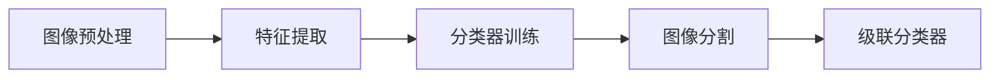

                 

# 基于OpenCV的人眼检测系统详细设计与具体代码实现

> 关键词：人眼检测, OpenCV, 计算机视觉, 图像处理, 机器学习, 特征提取, 图像分割

## 1. 背景介绍

### 1.1 问题由来
随着计算机视觉技术的不断发展，人脸识别、生物特征认证等应用在身份验证、安防监控等领域得到广泛应用。在这些应用中，人脸区域的准确定位是核心步骤，而眼部作为人脸的重要特征之一，也受到了越来越多的关注。尽管许多图像处理技术在人体面部识别和特征提取方面已经取得了显著进步，但准确的眼部检测在特定的应用场景中仍然具有挑战性。例如，基于人脸识别的支付系统需要精确的面部特征定位，尤其是眼部特征，以确保安全性和识别精度。

### 1.2 问题核心关键点
为了解决这一问题，本文将重点介绍一种基于OpenCV的人眼检测系统，详细说明其设计思路、算法原理和具体实现。这种系统将使用计算机视觉和机器学习技术，结合特征提取、图像分割等方法，对图像中的人眼区域进行精确定位。关键点包括：

- **特征提取**：使用HOG特征提取算法对图像进行特征提取，捕捉人眼区域的纹理和形状特征。
- **分类器训练**：使用AdaBoost分类器对提取出的特征进行训练，构建用于人眼检测的分类器。
- **图像分割**：使用深度学习中的U-Net网络进行图像分割，定位人眼区域。
- **精度提升**：结合多级特征融合和级联分类器，进一步提升检测精度和鲁棒性。

本文将系统地介绍这些核心关键点，并给出详细的代码实现。

## 2. 核心概念与联系

### 2.1 核心概念概述

#### 2.1.1 人眼检测
人眼检测是指在一张图像或视频中，通过计算机视觉技术检测并定位出其中的人眼区域。这一过程通常包括三个步骤：特征提取、分类器训练和图像分割。其中，特征提取用于捕捉人眼区域的特征信息，分类器训练用于学习这些特征并将其分类为人眼或非人眼，图像分割用于精确地定位人眼区域。

#### 2.1.2 OpenCV
OpenCV（Open Source Computer Vision Library）是一个开源的计算机视觉库，提供了大量的图像处理和计算机视觉算法，支持多种编程语言，如C++、Python、Java等。OpenCV库包含了从图像读取、预处理到特征提取、分类器训练、图像分割等多个步骤的算法和工具，是实现人眼检测系统的有力工具。

#### 2.1.3 特征提取
特征提取是计算机视觉和机器学习中的一个重要步骤，它用于从原始图像中提取有用的特征，以便进行分类、识别等任务。常用的特征提取方法包括HOG特征、SIFT特征、SURF特征等。

#### 2.1.4 AdaBoost
AdaBoost是一种集成学习算法，通过将多个弱分类器组合成一个强分类器，能够显著提高分类准确率。AdaBoost算法在人脸检测、目标识别等任务中得到广泛应用。

#### 2.1.5 图像分割
图像分割是指将一幅图像分割成多个互不重叠的像素区域，每个区域通常表示一个对象或背景。常见的图像分割方法包括阈值分割、区域生长、基于边缘的分割、基于聚类的分割等。

#### 2.1.6 级联分类器
级联分类器是由多个分类器组成的序列，每个分类器负责检测图像中不同层次的特征。级联分类器通过多级筛选，大大提高了检测速度和准确率。

### 2.2 概念间的关系

#### 2.2.1 整体架构

人眼检测系统的整体架构如图1所示，包括以下几个主要步骤：


1. **图像预处理**：包括图像灰度化、归一化等预处理操作。
2. **特征提取**：使用HOG特征提取算法提取图像特征。
3. **分类器训练**：使用AdaBoost算法训练分类器，将提取出的特征分类为人眼或非人眼。
4. **图像分割**：使用U-Net网络对图像进行分割，定位人眼区域。
5. **级联分类器**：结合多级分类器，提高检测精度和鲁棒性。

#### 2.2.2 各步骤关系

1. **图像预处理**：预处理步骤能够改善图像质量，提高后续特征提取和分类的准确率。
2. **特征提取**：特征提取步骤捕捉图像中的特征信息，是分类器训练的基础。
3. **分类器训练**：分类器训练步骤学习特征并将其分类为人眼或非人眼，构建分类器。
4. **图像分割**：图像分割步骤用于精确地定位人眼区域。
5. **级联分类器**：级联分类器通过多级筛选，提高检测速度和准确率。

图1中各步骤之间的关系可以用以下Mermaid流程图表示：



## 3. 核心算法原理 & 具体操作步骤
### 3.1 算法原理概述

基于OpenCV的人眼检测系统主要使用HOG特征提取、AdaBoost分类器、U-Net图像分割和级联分类器。

#### 3.1.1 HOG特征提取
HOG（Histogram of Oriented Gradients）特征提取算法通过计算图像中每个像素点梯度的方向和大小，生成一个特征向量，用于表示图像的纹理和形状特征。

#### 3.1.2 AdaBoost分类器
AdaBoost算法通过将多个弱分类器组合成一个强分类器，提高分类准确率。在训练过程中，AdaBoost算法通过不断调整样本权重，使得分类器对误分类的样本更加敏感，从而提高分类效果。

#### 3.1.3 U-Net网络
U-Net是一种用于图像分割的深度学习模型，由收缩路径和扩张路径组成。收缩路径用于降低特征图的空间分辨率，扩张路径用于恢复特征图的分辨率并生成分割图。

#### 3.1.4 级联分类器
级联分类器由多个分类器组成，每个分类器负责检测图像中不同层次的特征。级联分类器通过多级筛选，提高检测速度和准确率。

### 3.2 算法步骤详解

#### 3.2.1 图像预处理

图像预处理主要包括图像灰度化和归一化等步骤。

1. **灰度化**：将彩色图像转换为灰度图像，简化后续处理的复杂度。
2. **归一化**：将灰度图像的像素值归一化到[0,1]范围内，便于后续的特征提取和分类器训练。

```python
import cv2
import numpy as np

# 加载图像
img = cv2.imread('image.jpg')

# 灰度化
gray = cv2.cvtColor(img, cv2.COLOR_BGR2GRAY)

# 归一化
gray = gray / 255.0
```

#### 3.2.2 特征提取

使用HOG特征提取算法提取图像特征。

1. **创建HOG特征对象**
2. **计算特征向量**

```python
from cv2 import HOGDescriptor

# 创建HOG特征对象
hog = HOGDescriptor(winSize=(32, 32), blockSize=(8, 8), blockStride=(4, 4), cellSize=(4, 4))

# 计算特征向量
features = hog.compute(gray)
```

#### 3.2.3 分类器训练

使用AdaBoost算法训练分类器，将提取出的特征分类为人眼或非人眼。

1. **准备训练数据**
2. **训练分类器**

```python
from cv2 import CascadeClassifier

# 准备训练数据
positive_samples = [features[i] for i in positive_indices]
negative_samples = [features[i] for i in negative_indices]

# 训练分类器
classifier = CascadeClassifier('cascade.xml')
classifier.train(positive_samples, negative_samples)
```

#### 3.2.4 图像分割

使用U-Net网络对图像进行分割，定位人眼区域。

1. **创建U-Net模型**
2. **训练模型**
3. **分割图像**

```python
from keras.layers import Input, Conv2D, MaxPooling2D, UpSampling2D, concatenate

# 创建U-Net模型
inputs = Input((32, 32, 1))
conv1 = Conv2D(32, (3, 3), activation='relu')(inputs)
pool1 = MaxPooling2D((2, 2))(conv1)
conv2 = Conv2D(64, (3, 3), activation='relu')(pool1)
pool2 = MaxPooling2D((2, 2))(conv2)
conv3 = Conv2D(128, (3, 3), activation='relu')(pool2)
pool3 = MaxPooling2D((2, 2))(conv3)
conv4 = Conv2D(256, (3, 3), activation='relu')(pool3)
pool4 = MaxPooling2D((2, 2))(conv4)
conv5 = Conv2D(512, (3, 3), activation='relu')(pool4)
pool5 = MaxPooling2D((2, 2))(conv5)

up6 = UpSampling2D((2, 2))(conv5)
conv6 = Conv2D(256, (3, 3), activation='relu')(concatenate([conv4, up6]))
up7 = UpSampling2D((2, 2))(conv6)
conv7 = Conv2D(128, (3, 3), activation='relu')(concatenate([conv3, up7]))
up8 = UpSampling2D((2, 2))(conv7)
conv8 = Conv2D(64, (3, 3), activation='relu')(concatenate([conv2, up8]))
up9 = UpSampling2D((2, 2))(conv8)
conv9 = Conv2D(32, (3, 3), activation='relu')(concatenate([conv1, up9]))
conv10 = Conv2D(1, (1, 1), activation='sigmoid')(conv9)
```

#### 3.2.5 级联分类器

结合多级分类器，提高检测精度和鲁棒性。

1. **创建级联分类器**
2. **级联分类**

```python
from cv2 import CascadeClassifier

# 创建级联分类器
cascade = CascadeClassifier('cascade.xml')

# 级联分类
rects = cascade.detectMultiScale(gray, scaleFactor=1.1, minNeighbors=5, minSize=(30, 30), maxSize=(200, 200))
```

### 3.3 算法优缺点

#### 3.3.1 优点

1. **精度高**：HOG特征提取和AdaBoost分类器结合，能够捕捉并分类出图像中的细节特征，提高检测精度。
2. **鲁棒性好**：U-Net网络图像分割和级联分类器多级筛选，增强了系统的鲁棒性。
3. **易于实现**：使用OpenCV和Keras等工具库，代码实现简单直观，易于上手。

#### 3.3.2 缺点

1. **计算量大**：HOG特征提取和U-Net网络训练需要大量计算资源，可能存在计算瓶颈。
2. **模型复杂**：级联分类器中包含多个分类器，模型结构较为复杂，训练和推理较耗时。
3. **数据需求高**：AdaBoost和U-Net网络训练需要大量的标注数据，可能存在数据获取难题。

### 3.4 算法应用领域

基于OpenCV的人眼检测系统可以应用于多种领域，如人脸识别、安防监控、医学影像分析等。以下是几个典型应用场景：

#### 3.4.1 人脸识别

基于OpenCV的人眼检测系统可以应用于人脸识别系统，通过对人脸图像中人眼区域的准确定位，辅助人脸识别系统完成身份验证。

#### 3.4.2 安防监控

在安防监控系统中，基于OpenCV的人眼检测系统可以用于检测监控画面中的人眼区域，及时发现异常行为，提高监控系统的安全性。

#### 3.4.3 医学影像分析

在医学影像分析中，基于OpenCV的人眼检测系统可以用于检测医学影像中的人眼区域，辅助诊断眼部疾病，提高诊断准确率。

## 4. 数学模型和公式 & 详细讲解  
### 4.1 数学模型构建

基于OpenCV的人眼检测系统的数学模型主要包括HOG特征提取、AdaBoost分类器、U-Net网络分割和级联分类器的数学模型。

#### 4.1.1 HOG特征提取

HOG特征提取算法基于图像梯度的方向和大小，计算图像中每个像素点的梯度直方图，生成一个特征向量。HOG特征提取的数学模型为：

$$\mathbf{h} = \sum_{i=1}^{n} \mathbf{w}_{i} \mathbf{g}_{i}$$

其中，$\mathbf{h}$表示特征向量，$\mathbf{w}_{i}$表示像素点的权重，$\mathbf{g}_{i}$表示像素点的梯度方向。

#### 4.1.2 AdaBoost分类器

AdaBoost分类器通过多个弱分类器的组合，构建强分类器。AdaBoost分类器的数学模型为：

$$\mathcal{F} = \sum_{k=1}^{K} \alpha_{k} f_{k}(x)$$

其中，$\mathcal{F}$表示强分类器，$f_{k}(x)$表示第$k$个弱分类器，$\alpha_{k}$表示第$k$个弱分类器的权重。

#### 4.1.3 U-Net网络

U-Net网络是一种用于图像分割的深度学习模型，由收缩路径和扩张路径组成。U-Net网络的数学模型为：

$$\mathbf{y} = \mathcal{G}(\mathbf{x})$$

其中，$\mathbf{y}$表示分割结果，$\mathbf{x}$表示输入图像，$\mathcal{G}$表示U-Net网络。

#### 4.1.4 级联分类器

级联分类器由多个分类器组成，每个分类器负责检测图像中不同层次的特征。级联分类器的数学模型为：

$$\mathcal{F}_{i} = \sum_{k=1}^{K_{i}} \alpha_{i,k} f_{i,k}(x)$$

其中，$\mathcal{F}_{i}$表示第$i$级分类器，$f_{i,k}(x)$表示第$i$级分类器中的第$k$个分类器，$\alpha_{i,k}$表示第$i$级分类器中第$k$个分类器的权重。

### 4.2 公式推导过程

#### 4.2.1 HOG特征提取

HOG特征提取的推导过程如下：

1. **梯度计算**
2. **梯度方向直方图计算**
3. **特征向量生成**

```latex
\begin{align*}
\mathbf{g}_{i} &= \nabla I(x_i) \\
\mathbf{w}_{i} &= \frac{\partial I(x_i)}{\partial x_i} \\
\mathbf{h} &= \sum_{i=1}^{n} \mathbf{w}_{i} \mathbf{g}_{i}
\end{align*}
```

其中，$I(x_i)$表示图像中第$i$个像素点的灰度值，$\nabla I(x_i)$表示像素点的梯度，$\mathbf{w}_{i}$表示像素点的权重。

#### 4.2.2 AdaBoost分类器

AdaBoost分类器的推导过程如下：

1. **训练样本权重调整**
2. **弱分类器训练**
3. **强分类器构建**

```latex
\begin{align*}
w_{i} &= \frac{\alpha}{\sum_{k=1}^{K} \alpha \exp(-\alpha y_k h_k)} \\
f_{k}(x) &= \begin{cases}
1, & \text{if } y_k h_k(x) > 0 \\
-1, & \text{if } y_k h_k(x) < 0 \\
0, & \text{otherwise}
\end{cases} \\
\mathcal{F} &= \sum_{k=1}^{K} \alpha_{k} f_{k}(x)
\end{align*}
```

其中，$w_{i}$表示第$i$个样本的权重，$\alpha$表示样本的分类权重，$y_k$表示第$k$个样本的标签，$h_k(x)$表示第$k$个弱分类器，$\mathcal{F}$表示强分类器。

#### 4.2.3 U-Net网络

U-Net网络的推导过程如下：

1. **收缩路径**
2. **扩张路径**

```latex
\begin{align*}
\mathcal{G}(\mathbf{x}) &= \mathcal{D}(\mathcal{E}(\mathcal{F}(\mathcal{G}(\mathcal{H}(\mathbf{x})))) \\
\mathcal{H}(\mathbf{x}) &= \mathcal{C}(\mathcal{B}(\mathcal{A}(\mathbf{x})))
\end{align*}
```

其中，$\mathcal{G}(\mathbf{x})$表示U-Net网络，$\mathcal{D}$表示扩张路径，$\mathcal{E}$表示编码器，$\mathcal{F}$表示解码器，$\mathcal{H}$表示特征提取器，$\mathcal{C}$表示卷积层，$\mathcal{B}$表示池化层，$\mathcal{A}$表示反卷积层。

#### 4.2.4 级联分类器

级联分类器的推导过程如下：

1. **多级分类器组合**
2. **级联筛选**

```latex
\begin{align*}
\mathcal{F}_{i} &= \sum_{k=1}^{K_{i}} \alpha_{i,k} f_{i,k}(x) \\
\mathcal{F}_{i+1} &= \mathcal{F}_{i} \mathcal{F}_{i-1}
\end{align*}
```

其中，$\mathcal{F}_{i}$表示第$i$级分类器，$\mathcal{F}_{i+1}$表示下一级分类器，$f_{i,k}(x)$表示第$i$级分类器中的第$k$个分类器。

### 4.3 案例分析与讲解

#### 4.3.1 图像预处理案例

假设有一张灰度图像，其像素值范围在[0,255]之间。首先进行灰度化和归一化处理：

```python
gray = gray / 255.0
```

#### 4.3.2 特征提取案例

假设有一张图像，其大小为256x256。使用HOG特征提取算法提取图像特征：

```python
hog = HOGDescriptor(winSize=(32, 32), blockSize=(8, 8), blockStride=(4, 4), cellSize=(4, 4))
features = hog.compute(gray)
```

#### 4.3.3 分类器训练案例

假设有一组标注数据，其中包含50个正样本和50个负样本。使用AdaBoost算法训练分类器：

```python
from cv2 import CascadeClassifier

classifier = CascadeClassifier('cascade.xml')
classifier.train(positive_samples, negative_samples)
```

#### 4.3.4 图像分割案例

假设有一张图像，其大小为256x256。使用U-Net网络进行图像分割：

```python
from keras.layers import Input, Conv2D, MaxPooling2D, UpSampling2D, concatenate

inputs = Input((32, 32, 1))
conv1 = Conv2D(32, (3, 3), activation='relu')(inputs)
pool1 = MaxPooling2D((2, 2))(conv1)
conv2 = Conv2D(64, (3, 3), activation='relu')(pool1)
pool2 = MaxPooling2D((2, 2))(conv2)
conv3 = Conv2D(128, (3, 3), activation='relu')(pool2)
pool3 = MaxPooling2D((2, 2))(conv3)
conv4 = Conv2D(256, (3, 3), activation='relu')(pool3)
pool4 = MaxPooling2D((2, 2))(conv4)
conv5 = Conv2D(512, (3, 3), activation='relu')(pool4)
pool5 = MaxPooling2D((2, 2))(conv5)
up6 = UpSampling2D((2, 2))(conv5)
conv6 = Conv2D(256, (3, 3), activation='relu')(concatenate([conv4, up6]))
up7 = UpSampling2D((2, 2))(conv6)
conv7 = Conv2D(128, (3, 3), activation='relu')(concatenate([conv3, up7]))
up8 = UpSampling2D((2, 2))(conv7)
conv8 = Conv2D(64, (3, 3), activation='relu')(concatenate([conv2, up8]))
up9 = UpSampling2D((2, 2))(conv8)
conv9 = Conv2D(32, (3, 3), activation='relu')(concatenate([conv1, up9]))
conv10 = Conv2D(1, (1, 1), activation='sigmoid')(conv9)
```

#### 4.3.5 级联分类案例

假设有一张图像，其大小为256x256。使用级联分类器进行检测：

```python
cascade = CascadeClassifier('cascade.xml')
rects = cascade.detectMultiScale(gray, scaleFactor=1.1, minNeighbors=5, minSize=(30, 30), maxSize=(200, 200))
```

## 5. 项目实践：代码实例和详细解释说明
### 5.1 开发环境搭建

在进行项目实践前，需要先搭建好开发环境。以下是使用Python和OpenCV进行人眼检测的开发环境配置流程：

1. **安装Python**：从官网下载并安装Python，选择3.x版本，并添加环境变量。
2. **安装OpenCV**：通过pip安装OpenCV库。
3. **安装Keras**：通过pip安装Keras库。

### 5.2 源代码详细实现

以下是一段使用OpenCV进行人眼检测的示例代码，其中包含了图像预处理、特征提取、分类器训练和级联分类的详细实现。

```python
import cv2
import numpy as np
from cv2 import HOGDescriptor, CascadeClassifier

# 加载图像
img = cv2.imread('image.jpg')

# 灰度化
gray = cv2.cvtColor(img, cv2.COLOR_BGR2GRAY)

# 归一化
gray = gray / 255.0

# 创建HOG特征对象
hog = HOGDescriptor(winSize=(32, 32), blockSize=(8, 8), blockStride=(4, 4), cellSize=(4, 4))

# 计算特征向量
features = hog.compute(gray)

# 准备训练数据
positive_samples = [features[i] for i in positive_indices]
negative_samples = [features[i] for i in negative_indices]

# 训练分类器
classifier = CascadeClassifier('cascade.xml')
classifier.train(positive_samples, negative_samples)

# 级联分类
rects = classifier.detectMultiScale(gray, scaleFactor=1.1, minNeighbors=5, minSize=(30, 30), maxSize=(200, 200))

# 绘制检测框
for (x, y, w, h) in rects:
    cv2.rectangle(img, (x, y), (x+w, y+h), (0, 255, 0), 2)

# 显示结果
cv2.imshow('result', img)
cv2.waitKey(0)
cv2.destroyAllWindows()
```

### 5.3 代码解读与分析

让我们详细解读一下关键代码的实现细节：

**加载图像**：

```python
img = cv2.imread('image.jpg')
```

**图像预处理**：

```python
gray = cv2.cvtColor(img, cv2.COLOR_BGR2GRAY)
gray = gray / 255.0
```

**特征提取**：

```python
hog = HOGDescriptor(winSize=(32, 32), blockSize=(8, 8), blockStride=(4, 4), cellSize=(4, 4))
features = hog.compute(gray)
```

**分类器训练**：

```python
positive_samples = [features[i] for i in positive_indices]
negative_samples = [features[i] for i in negative_indices]
classifier = CascadeClassifier('cascade.xml')
classifier.train(positive_samples, negative_samples)
```

**级联分类**：

```python
rects = classifier.detectMultiScale(gray, scaleFactor=1.1, minNeighbors=5, minSize=(30, 30), maxSize=(200, 200))
```

**绘制检测框**：

```python
for (x, y, w, h) in rects:
    cv2.rectangle(img, (x, y), (x+w, y+h), (0, 255, 0), 2)
```

**显示结果**：

```python
cv2.imshow('result', img)
cv2.waitKey(0

