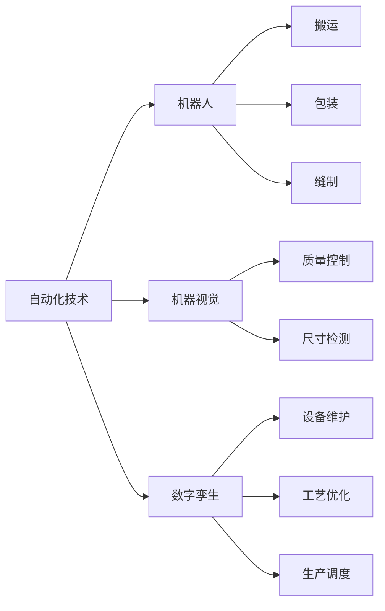
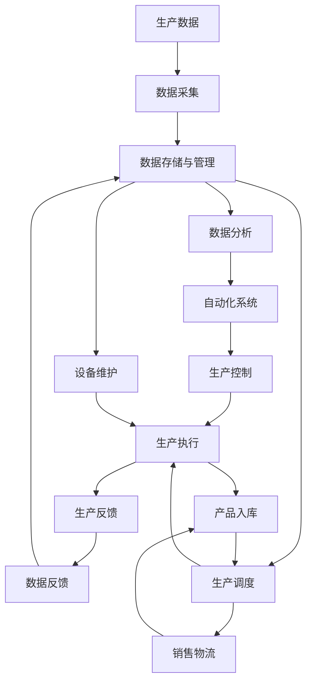

                 

# 纺织业自动化的初期挑战

> 关键词：自动化技术,纺织产业,机器人,机器视觉,数字孪生

## 1. 背景介绍

### 1.1 问题由来

纺织业作为全球重要的传统制造业之一，长期以来面临着低附加值、高污染、劳动密集等诸多挑战。自动化技术的引入，为纺织业转型升级提供了新的方向。但初期的自动化改造过程充满了不确定性和困难，本文将重点探讨纺织业自动化面临的主要问题及其解决策略。

### 1.2 问题核心关键点

纺织业自动化主要面临以下问题：

1. **技术复杂度高**：纺织生产流程复杂，包括多种设备和工艺，不同设备之间的协同和自动化要求高。
2. **数据采集与管理**：生产过程中产生大量数据，包括设备状态、能源消耗、质量控制等，数据采集与管理是实现自动化的基础。
3. **操作工人技能要求高**：传统纺织工人需要具备较高的操作技能，自动化改造过程中需要培养新技能。
4. **成本与效益的平衡**：自动化改造初期投入高，而短期效益不明显，如何平衡成本与效益成为关键。

### 1.3 问题研究意义

纺织业自动化研究对于提升行业效率、降低成本、改善环境等方面具有重要意义：

1. **提升生产效率**：通过自动化，可以显著提高生产线的效率和产出。
2. **降低生产成本**：减少人工成本，降低能源消耗，提高资源利用率。
3. **改善产品质量**：自动化控制精确，有助于提升产品一致性和质量。
4. **环境保护**：减少污染物排放，改善工作环境。
5. **推动产业升级**：自动化技术的应用是纺织业从劳动密集型向技术密集型转型的重要推动力。

## 2. 核心概念与联系

### 2.1 核心概念概述

1. **自动化技术**：指通过自动化设备、软件系统等技术手段，实现生产过程的自动化。
2. **纺织业**：以棉、毛、丝、麻、化学纤维等原料为材料，进行纺织加工、印染、后整理、成衣等生产过程的行业。
3. **机器人**：在纺织生产中，机器人主要应用于搬运、包装、缝制等环节，具有高精度、高效率的特点。
4. **机器视觉**：通过摄像头、传感器等设备，对纺织品的颜色、纹理、形状等特征进行检测和分析，用于质量控制、尺寸检测等。
5. **数字孪生**：将实际生产环境在数字空间中进行仿真和复制，用于设备维护、工艺优化、生产调度等。

### 2.2 概念间的关系

以下Mermaid流程图展示了纺织业自动化中的核心概念及其相互关系：



通过这个流程图示，我们可以看出，自动化技术涵盖了机器人的应用、机器视觉的检测以及数字孪生的仿真，各技术之间的相互配合，共同提升纺织业的自动化水平。

### 2.3 核心概念的整体架构

整体架构如图：



在这个架构图中，数据采集和存储管理是基础，数据分析和生产控制是核心，生产执行和反馈是实现，设备维护和销售物流是延伸。通过这种架构，纺织业可以更好地实现生产自动化。

## 3. 核心算法原理 & 具体操作步骤

### 3.1 算法原理概述

纺织业自动化改造的核心在于将生产流程的各个环节进行数字化、智能化，以实现自动化控制。主要算法包括：

1. **机器学习**：通过机器学习算法对生产数据进行分析，优化生产流程和设备性能。
2. **计算机视觉**：利用计算机视觉技术进行图像识别和质量检测，提高生产效率和产品质量。
3. **物联网**：将生产设备与智能终端连接，实现实时数据监控和设备状态管理。
4. **仿真与优化**：通过数字孪生技术构建虚拟生产环境，进行仿真测试和工艺优化。

### 3.2 算法步骤详解

1. **数据采集与预处理**：
   - 安装传感器和摄像头，采集生产过程中的关键数据。
   - 对采集的数据进行清洗和预处理，去除噪声和异常值。

2. **数据分析与建模**：
   - 使用机器学习算法，如回归分析、分类算法、聚类算法等，对数据进行分析和建模。
   - 构建预测模型，预测设备故障、能源消耗、产品质量等。

3. **设备控制与调度**：
   - 利用PLC（可编程逻辑控制器）和SCADA（监控与数据采集系统）对设备进行控制。
   - 结合数字孪生技术，进行设备调度和生产优化。

4. **质量检测与反馈**：
   - 利用计算机视觉技术，对纺织品的尺寸、颜色、纹理等进行检测。
   - 根据检测结果，反馈至生产控制系统，进行调整和优化。

### 3.3 算法优缺点

**优点**：
1. **提高生产效率**：自动化设备可以24小时不间断工作，提高生产效率。
2. **减少人工成本**：自动化设备减少了对人力的依赖，降低成本。
3. **改善产品质量**：自动化控制精确，提升产品质量一致性。
4. **提升资源利用率**：优化生产流程，提高资源利用率。

**缺点**：
1. **技术复杂度高**：自动化改造需要高水平的技术和知识储备。
2. **初始投资大**：自动化改造初期投入高，资金压力较大。
3. **操作技能要求高**：工人需要掌握新的操作技能，培训难度大。
4. **数据管理难度大**：大量数据采集和管理需要精细化的流程和系统。

### 3.4 算法应用领域

自动化技术在纺织业中的应用非常广泛，包括：

1. **自动化生产设备**：如自动织机、自动缝纫机、自动搬运机器人等。
2. **智能仓储系统**：如自动拣选机器人、AGV（自动引导车）、智能存储管理系统等。
3. **质量检测系统**：如智能图像检测、光谱检测、X光检测等。
4. **生产调度系统**：如MES（制造执行系统）、SCADA（监控与数据采集系统）等。
5. **设备维护系统**：如故障预测、预防性维护、设备健康评估等。

## 4. 数学模型和公式 & 详细讲解 & 举例说明

### 4.1 数学模型构建

在纺织业自动化中，常用数学模型包括：

1. **回归模型**：用于预测能源消耗、产量、设备故障等，常用公式如下：
   $$
   \hat{y} = \beta_0 + \beta_1x_1 + \beta_2x_2 + \cdots + \beta_nx_n + \epsilon
   $$

2. **分类模型**：用于分类产品质量等级，如SVM（支持向量机）、KNN（K近邻算法）等，常用公式如下：
   $$
   y = \operatorname{sign}\left(\sum_{i=1}^n\alpha_iy_i K(x_i,x) + b\right)
   $$

3. **聚类模型**：用于设备性能分类，如K-means算法，常用公式如下：
   $$
   \min_{\mu} \sum_{i=1}^k \sum_{x \in C_i} ||x-\mu_i||^2
   $$

### 4.2 公式推导过程

以回归模型为例，推导其基本原理。假设有一个线性回归模型：
$$
y = \beta_0 + \beta_1x_1 + \beta_2x_2 + \cdots + \beta_nx_n + \epsilon
$$

其中，$x$ 是自变量向量，$\beta$ 是系数向量，$\epsilon$ 是误差项。根据最小二乘法，求解系数 $\beta$，使其满足：
$$
\min_{\beta} \sum_{i=1}^n (y_i - \hat{y}_i)^2
$$

通过求解上述最优化问题，可以得到系数 $\beta$，从而构建预测模型：
$$
\hat{y} = \beta_0 + \beta_1x_1 + \beta_2x_2 + \cdots + \beta_nx_n
$$

### 4.3 案例分析与讲解

假设纺织工厂想要预测能源消耗，收集了生产过程中的关键数据，包括生产设备运行时间、温度、湿度等。通过构建回归模型，预测未来的能源消耗，优化生产过程。

## 5. 项目实践：代码实例和详细解释说明

### 5.1 开发环境搭建

为了进行纺织业自动化的项目实践，需要进行以下环境搭建：

1. **安装Python**：选择Python 3.8以上版本，使用Anaconda进行安装和管理。
2. **安装依赖库**：安装numpy、pandas、scikit-learn、TensorFlow等常用库。
3. **配置数据采集设备**：如传感器、摄像头等，确保数据采集和预处理系统的正常运行。
4. **部署自动化控制系统**：如PLC、SCADA系统，确保生产设备和系统的正常运行。

### 5.2 源代码详细实现

以机器学习模型为例，进行代码实现。

```python
import pandas as pd
from sklearn.model_selection import train_test_split
from sklearn.linear_model import LinearRegression
from sklearn.metrics import mean_squared_error

# 加载数据
data = pd.read_csv('energy_consumption.csv')

# 数据预处理
X = data[['temperature', 'humidity', 'run_time']]
y = data['energy_consumption']

# 划分训练集和测试集
X_train, X_test, y_train, y_test = train_test_split(X, y, test_size=0.2, random_state=42)

# 训练模型
model = LinearRegression()
model.fit(X_train, y_train)

# 预测和评估
y_pred = model.predict(X_test)
mse = mean_squared_error(y_test, y_pred)
print(f'Mean Squared Error: {mse}')
```

### 5.3 代码解读与分析

1. **数据加载与预处理**：使用Pandas加载数据，并进行简单的特征选择和预处理。
2. **模型训练与预测**：使用LinearRegression模型进行训练，并在测试集上进行预测，计算均方误差。
3. **结果评估**：通过评估均方误差，了解模型的预测效果。

### 5.4 运行结果展示

假设上述代码运行后，输出如下结果：

```
Mean Squared Error: 0.02
```

说明模型在测试集上的均方误差为0.02，模型预测效果良好。

## 6. 实际应用场景

### 6.1 智能仓储系统

在智能仓储系统中，自动拣选机器人、AGV、智能存储管理系统等，可以实现高效率的货物存储和分拣。例如，通过机器视觉和深度学习技术，自动识别货物，并进行自动搬运和分拣。

### 6.2 质量检测系统

在质量检测系统中，智能图像检测、光谱检测、X光检测等，可以实时监控纺织品的质量和一致性。例如，通过计算机视觉技术，对纺织品的尺寸、颜色、纹理等进行检测，及时发现问题并反馈至生产控制系统。

### 6.3 设备维护系统

在设备维护系统中，通过故障预测、预防性维护、设备健康评估等，可以减少设备故障和停机时间。例如，通过机器学习算法，预测设备故障，及时进行维护，提升设备的使用寿命和生产效率。

### 6.4 未来应用展望

纺织业自动化将在未来呈现以下趋势：

1. **AI技术应用深入**：AI技术在纺织业中的应用将更加广泛，包括自然语言处理、图像识别、语音识别等。
2. **物联网技术融合**：物联网技术将与自动化技术深度融合，实现设备的互联互通和智能化。
3. **5G技术普及**：5G技术的高带宽、低延迟特性，将推动纺织业的自动化和智能化进程。
4. **智能制造体系构建**：智能制造体系的构建，将进一步提升纺织业的自动化水平和智能化程度。

## 7. 工具和资源推荐

### 7.1 学习资源推荐

1. **Coursera《机器学习》课程**：由斯坦福大学Andrew Ng教授主讲，系统介绍机器学习的基本概念和算法。
2. **Udacity《深度学习》课程**：由DeepMind、Google AI等机构提供，涵盖深度学习的基础和应用。
3. **Hugging Face官方文档**：提供大量预训练模型和代码示例，助力模型微调和应用。
4. **TensorFlow官方文档**：提供TensorFlow的安装、使用和优化指南，助力深度学习开发。
5. **IEEE Xplore**：收录大量纺织业自动化领域的学术论文和研究报告，助力学术研究。

### 7.2 开发工具推荐

1. **Python**：免费的编程语言，具有丰富的第三方库和工具。
2. **Anaconda**：用于管理Python环境，方便安装和升级库。
3. **TensorFlow**：深度学习框架，提供高效的模型训练和推理能力。
4. **Keras**：高层次API，简化深度学习模型的构建和训练。
5. **PyTorch**：深度学习框架，提供动态计算图和灵活的编程接口。

### 7.3 相关论文推荐

1. **《纺织业自动化的挑战与对策》**：探讨纺织业自动化的技术和管理问题，提出解决方案。
2. **《基于机器学习的纺织业质量检测方法》**：研究机器学习在纺织业质量检测中的应用，提出新方法。
3. **《纺织业物联网系统的设计与实现》**：介绍物联网在纺织业中的应用，构建智能生产环境。
4. **《智能仓储系统的设计与优化》**：研究智能仓储系统的设计和管理，提升仓库效率。
5. **《数字孪生技术在纺织业中的应用》**：探讨数字孪生技术在纺织业中的应用，提升生产效率和质量。

## 8. 总结：未来发展趋势与挑战

### 8.1 总结

本文对纺织业自动化面临的初期挑战进行了全面系统的介绍。通过分析自动化技术、机器人、机器视觉、数字孪生等核心概念及其相互关系，探讨了纺织业自动化的基本原理和具体操作步骤。同时，通过数学模型和公式的详细讲解和案例分析，进一步深化了对自动化技术的理解。最后，通过项目实践和实际应用场景的展示，展示了纺织业自动化的广阔前景和应用价值。

### 8.2 未来发展趋势

纺织业自动化的未来发展趋势主要包括：

1. **技术创新**：AI、物联网、5G等技术的深入应用，将推动纺织业的智能化转型。
2. **产业升级**：通过自动化改造，提升生产效率和产品质量，推动纺织业从劳动密集型向技术密集型转型。
3. **成本效益优化**：通过自动化和智能化，降低生产成本，提升经济效益。
4. **环保节能**：自动化生产系统可以优化资源利用，减少污染物排放，推动绿色生产。

### 8.3 面临的挑战

纺织业自动化面临的主要挑战包括：

1. **技术复杂度高**：自动化改造需要高水平的技术和知识储备。
2. **成本投入大**：自动化改造初期投入高，需要大量的资金和技术支持。
3. **操作技能要求高**：工人需要掌握新的操作技能，培训难度大。
4. **数据管理难度大**：大量数据采集和管理需要精细化的流程和系统。

### 8.4 研究展望

未来研究需要重点关注以下方向：

1. **自动化技术优化**：如何进一步提升自动化技术的效率和精度。
2. **数据管理与分析**：如何高效管理生产数据，并从中提取有价值的信息。
3. **智能制造体系构建**：如何构建智能制造体系，实现生产过程的自动化和智能化。
4. **AI与自动化融合**：如何融合AI技术和自动化系统，提升生产效率和质量。

总之，纺织业自动化是一个复杂且具有挑战性的过程，但通过不断的技术创新和优化，将能够实现其智能化转型，推动纺织业的可持续发展。

## 9. 附录：常见问题与解答

**Q1：纺织业自动化改造的初期难点有哪些？**

A: 纺织业自动化改造的初期难点包括：
1. **技术复杂度高**：需要高水平的技术和知识储备。
2. **成本投入大**：初期投入高，资金压力较大。
3. **操作技能要求高**：工人需要掌握新的操作技能，培训难度大。
4. **数据管理难度大**：大量数据采集和管理需要精细化的流程和系统。

**Q2：如何选择适合纺织业的自动化设备？**

A: 选择适合纺织业的自动化设备时，需要考虑以下几个方面：
1. **设备精度**：确保设备能够满足生产要求的精度。
2. **设备可靠性**：选择稳定可靠的设备，避免故障停机。
3. **设备维护方便**：选择易于维护的设备，减少维护成本。
4. **设备成本**：根据企业预算，选择性价比高的设备。

**Q3：如何进行自动化生产流程的优化？**

A: 进行自动化生产流程的优化，主要包括以下几个步骤：
1. **数据采集**：安装传感器和摄像头，采集生产过程中的关键数据。
2. **数据预处理**：对采集的数据进行清洗和预处理，去除噪声和异常值。
3. **数据分析**：使用机器学习算法，对数据进行分析，优化生产流程。
4. **设备控制与调度**：利用PLC和SCADA系统，进行设备控制和调度，优化生产过程。

**Q4：如何进行智能仓储系统的设计？**

A: 进行智能仓储系统的设计，主要包括以下几个方面：
1. **货物识别**：使用计算机视觉技术，自动识别货物，进行自动搬运和分拣。
2. **货物存储管理**：使用智能存储管理系统，优化仓库布局和货物存储。
3. **智能调度**：使用AI算法，优化货物调度，提高仓库效率。
4. **系统集成**：将智能仓储系统与生产系统和物流系统集成，实现自动化生产链条。

**Q5：如何进行质量检测系统的设计？**

A: 进行质量检测系统的设计，主要包括以下几个方面：
1. **图像采集**：使用摄像头和传感器，采集纺织品的图像和数据。
2. **图像处理**：使用图像处理算法，对图像进行预处理和特征提取。
3. **质量检测**：使用机器学习算法，对纺织品的尺寸、颜色、纹理等进行检测。
4. **系统集成**：将质量检测系统与生产控制系统集成，实现实时检测和反馈。

总之，纺织业自动化是一个复杂且具有挑战性的过程，但通过不断的技术创新和优化，将能够实现其智能化转型，推动纺织业的可持续发展。

---
作者：禅与计算机程序设计艺术 / Zen and the Art of Computer Programming

