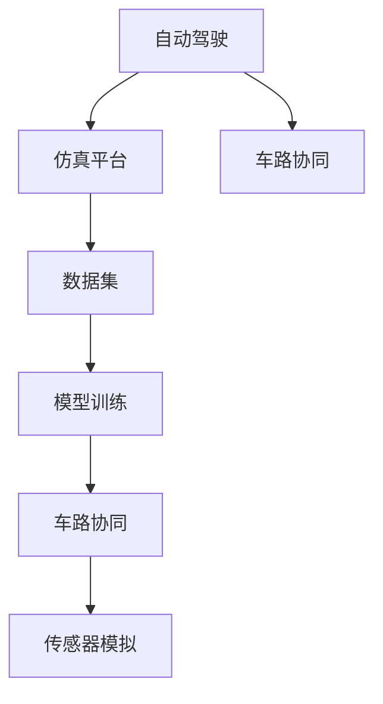
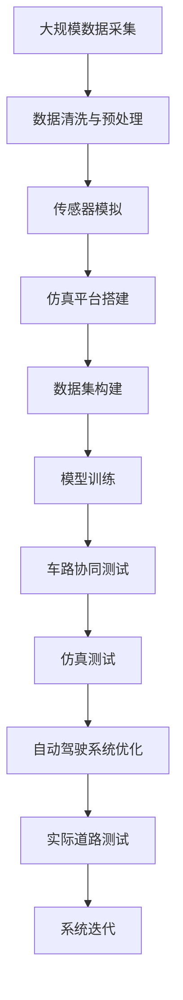

                 

# 自动驾驶仿真平台与数据集构建的最佳实践

> 关键词：自动驾驶, 仿真平台, 数据集构建, 模型训练, 车路协同, 数据标注, 传感器模拟

## 1. 背景介绍

### 1.1 问题由来
自动驾驶技术近年来迅速发展，从传统的基于规则的系统逐渐向基于深度学习的端到端系统转变。这些系统依赖于大量的数据进行训练，并通过模拟环境进行验证和优化。然而，现实世界的道路条件复杂多变，难以用有限的物理测试覆盖所有情况。因此，建立一个高质量的自动驾驶仿真平台和数据集，成为研发过程中不可或缺的一环。

### 1.2 问题核心关键点
构建自动驾驶仿真平台和数据集，首先需要明确以下几个核心关键点：
- **仿真平台的选择与搭建**：选择或搭建一个与实际驾驶场景高度匹配的仿真平台，如OpenDrive、Unity3D等。
- **数据集的设计与生成**：设计合理的数据集，覆盖常见的交通情况和突发事件，并使用传感器模拟技术生成多模态数据。
- **模型训练与验证**：在仿真平台上训练深度学习模型，验证其性能和鲁棒性。
- **车路协同与仿真测试**：在仿真环境中进行车路协同测试，确保系统在不同情境下的稳定性。

### 1.3 问题研究意义
高质量的自动驾驶仿真平台和数据集，对于提高模型训练效率、减少实际测试成本、提升系统安全性与可靠性至关重要。同时，仿真环境可以模拟极端条件下的驾驶场景，为自动驾驶系统提供更多测试机会，加速技术迭代。

## 2. 核心概念与联系

### 2.1 核心概念概述

构建自动驾驶仿真平台和数据集，涉及以下几个关键概念：

- **自动驾驶**：使用车辆控制软件，自动控制车辆在道路上的行驶。
- **仿真平台**：模拟真实世界的驾驶环境，包括道路、车辆、行人、交通信号等。
- **数据集**：包含多模态数据的集合，如图像、雷达点云、激光雷达数据、GPS轨迹等。
- **模型训练**：在仿真平台上使用数据集，训练深度学习模型，优化其性能。
- **车路协同**：车辆与道路设施之间的通信与协调，提升驾驶安全性与效率。
- **传感器模拟**：使用仿真技术模拟各种传感器数据，如摄像头、雷达、激光雷达等。

这些概念之间的关系可以用以下Mermaid流程图来展示：



这个流程图展示了自动驾驶构建过程中各个环节的联系：

1. 自动驾驶需要依赖仿真平台进行模拟。
2. 仿真平台生成数据集，用于模型训练。
3. 模型训练提高自动驾驶的性能。
4. 车路协同优化自动驾驶的安全性和效率。
5. 传感器模拟用于生成多模态数据。

### 2.2 概念间的关系

这些核心概念之间存在着紧密的联系，共同构成了自动驾驶仿真平台和数据集构建的完整体系。

- **仿真平台与数据集**：仿真平台是数据集生成的基础，数据集则是仿真平台价值体现的核心。
- **数据集与模型训练**：数据集的质量直接决定了模型训练的效果，模型训练则进一步优化数据集的泛化能力。
- **车路协同与传感器模拟**：车路协同需要多模态数据支持，传感器模拟则是多模态数据生成的关键技术。
- **自动驾驶与仿真测试**：自动驾驶系统在仿真环境下的测试，是系统安全性与可靠性评估的重要手段。

### 2.3 核心概念的整体架构

最后，我们用一个综合的流程图来展示这些核心概念在大规模自动驾驶仿真平台构建中的整体架构：



这个综合流程图展示了从数据采集、清洗、传感器模拟到模型训练、车路协同测试、仿真测试，最后到实际道路测试的整个流程。

## 3. 核心算法原理 & 具体操作步骤
### 3.1 算法原理概述

自动驾驶仿真平台和数据集构建的核心算法原理，主要围绕以下几个方面展开：

- **传感器模拟**：使用仿真的方式模拟真实世界的传感器数据，如摄像头、雷达、激光雷达等。
- **数据增强**：通过数据扩充、旋转、翻折等技术，生成更多训练样本，提高模型泛化能力。
- **车路协同模拟**：在仿真环境中模拟车路协同场景，包括交通信号灯控制、车辆通信等。
- **模型训练**：在仿真平台上训练深度学习模型，使用多模态数据进行联合训练。
- **数据标注**：在数据集上使用人工标注或半自动标注，提高数据集的可信度。

这些算法原理共同构成了自动驾驶仿真平台和数据集构建的技术基础。

### 3.2 算法步骤详解

以下是构建自动驾驶仿真平台和数据集的主要算法步骤：

**Step 1: 准备仿真环境与传感器**
- 搭建仿真平台，选择合适的传感器配置，包括摄像头、雷达、激光雷达等。
- 设计仿真场景，覆盖不同的道路条件、天气状况、交通流量等。

**Step 2: 生成多模态数据**
- 使用传感器模拟技术生成多模态数据，如图像、雷达点云、激光雷达数据等。
- 使用数据增强技术，扩充数据集，提高数据多样性。

**Step 3: 构建数据集**
- 设计数据集的结构，包括样本、标注、元数据等。
- 对数据集进行标注，确保数据集的可信度和可用性。

**Step 4: 训练模型**
- 在仿真平台上训练深度学习模型，使用多模态数据进行联合训练。
- 使用合适的优化算法，调整模型参数，提升模型性能。

**Step 5: 车路协同测试**
- 在仿真环境中进行车路协同测试，验证模型的性能和鲁棒性。
- 分析测试结果，调整模型参数，优化系统功能。

**Step 6: 仿真测试**
- 使用仿真平台进行模拟测试，验证模型在不同条件下的表现。
- 记录测试结果，分析模型性能，发现潜在问题。

**Step 7: 实际道路测试**
- 将训练好的模型部署到实际道路环境中进行测试。
- 记录测试数据，分析结果，发现问题，优化系统。

### 3.3 算法优缺点

构建自动驾驶仿真平台和数据集的方法，具有以下优点：

- **数据灵活性高**：可以生成大量不同条件下的数据，适应各种复杂场景。
- **成本低**：减少了实际道路测试的成本，加速模型迭代。
- **安全性高**：在安全可控的环境中进行测试，减少交通事故风险。

同时，这些方法也存在一些局限性：

- **仿真精度有限**：仿真环境可能无法完全模拟真实世界的复杂性，存在一定的偏差。
- **数据标注成本高**：数据集构建需要大量的人工标注，成本较高。
- **模型泛化能力有待提升**：模型在仿真环境中的表现，可能无法直接推广到实际道路。

### 3.4 算法应用领域

自动驾驶仿真平台和数据集构建的方法，已经在多个领域得到广泛应用：

- **自动驾驶汽车**：如特斯拉的自动驾驶系统，使用仿真平台进行模型训练和测试。
- **车路协同**：如智能交通系统，使用仿真平台进行系统集成和测试。
- **自动驾驶模拟器**：如CARLA、Gym等，用于教学和研究。
- **交通管理**：如智能交通信号系统，使用仿真平台进行优化和测试。
- **智能城市**：如智慧城市规划，使用仿真平台进行规划和测试。

## 4. 数学模型和公式 & 详细讲解 & 举例说明

### 4.1 数学模型构建

构建自动驾驶仿真平台和数据集，涉及到多个数学模型，如传感器模拟模型、数据增强模型、车路协同模型等。这里以摄像头数据模拟为例，进行数学模型构建。

**摄像头数据模拟模型**：

设摄像头参数为 $K$，光源位置为 $L$，物体位置为 $P$，则相机成像模型为：

$$
\text{img} = K \cdot [L + (P - L) \cdot \frac{1}{d}]
$$

其中，$K$ 为摄像头内参矩阵，$L$ 为光源位置，$P$ 为物体位置，$d$ 为相机焦距。

**数据增强模型**：

数据增强模型通过随机变换，如旋转、平移、缩放等，生成新的训练样本。对于图像数据，常用的数据增强操作包括：

- **随机裁剪**：对图像进行随机裁剪，生成新的图像。
- **随机旋转**：对图像进行随机旋转，改变其朝向。
- **随机翻转**：对图像进行随机翻转，改变其朝向和角度。
- **随机颜色扰动**：对图像进行随机颜色扰动，如亮度、对比度、饱和度等。

### 4.2 公式推导过程

以下是数据增强操作中常用的几种数学公式的推导过程：

**随机裁剪**：设图像大小为 $H \times W$，随机裁剪的区域大小为 $h \times w$，则裁剪后图像的大小为 $(h \times W / w) \times (H \times w / h)$。

**随机旋转**：设图像角度为 $\theta$，则旋转后的图像坐标为：

$$
\text{new\_x} = \text{x} \cdot \cos(\theta) - \text{y} \cdot \sin(\theta)
$$

$$
\text{new\_y} = \text{x} \cdot \sin(\theta) + \text{y} \cdot \cos(\theta)
$$

**随机翻转**：设图像水平翻转的概率为 $p$，则翻转后的图像坐标为：

$$
\text{new\_x} = W - \text{x}
$$

$$
\text{new\_y} = \text{y}
$$

**随机颜色扰动**：设图像的颜色扰动幅度为 $\sigma$，则扰动后的像素值 $c'$ 为：

$$
c' = c + N(\mu, \sigma^2)
$$

其中，$N(\mu, \sigma^2)$ 表示均值为 $\mu$，方差为 $\sigma^2$ 的正态分布随机数。

### 4.3 案例分析与讲解

以下是使用数据增强技术生成合成数据的案例分析：

**案例背景**：在自动驾驶模拟中，需要生成大量的合成数据，以覆盖不同的道路条件和天气状况。

**数据增强操作**：

1. **随机裁剪**：对车辆、行人、道路等进行随机裁剪，生成新的训练样本。
2. **随机旋转**：对车辆和行人进行随机旋转，模拟不同角度的视角。
3. **随机翻转**：对车辆进行随机翻转，模拟不同朝向的行驶。
4. **随机颜色扰动**：对道路和天气进行随机颜色扰动，模拟不同天气条件。

**生成合成数据**：通过上述数据增强操作，生成大量的合成数据，用于训练深度学习模型。

## 5. 项目实践：代码实例和详细解释说明

### 5.1 开发环境搭建

构建自动驾驶仿真平台和数据集，需要搭建一个高性能的计算环境。以下是Python环境下开发环境搭建的步骤：

1. 安装Anaconda：从官网下载并安装Anaconda，用于创建独立的Python环境。

2. 创建并激活虚拟环境：
```bash
conda create -n sim.env python=3.8 
conda activate sim.env
```

3. 安装必要的依赖包：
```bash
pip install numpy scipy scikit-image open3d pybullet
```

4. 安装Open3D：用于模拟三维环境，并进行传感器数据的生成。

5. 安装PyBullet：用于构建虚拟环境，并进行传感器数据的模拟。

6. 安装SCIPY：用于处理多维数据，如图像、雷达数据等。

7. 安装SKLEARN：用于进行数据标注和分类等。

8. 安装OPENIMAGES：用于获取图像数据集。

### 5.2 源代码详细实现

以下是使用PyBullet和Open3D构建自动驾驶仿真平台和数据集的具体代码实现：

```python
from open3d import *
from pybullet import *

# 初始化场景
def init_scene():
    # 创建地面
    bullet gravity = [0, -9.8, 0]
    bullet.setGravity(bullet gravity)

    # 创建三维环境
    base = BulletBase()
    base.setBase(bullet gravity)
    base.update()

    # 创建传感器
    camera = BulletCamera()
    camera.init()
    radar = BulletLidar()

    # 返回传感器和环境
    return camera, radar, base

# 生成合成数据
def generate_data(camera, radar, base, num_samples=1000):
    data = []
    for _ in range(num_samples):
        # 生成随机坐标
        x, y, z = np.random.randn(3) * 10

        # 生成摄像头数据
        image = camera.getCameraData(x, y, z)

        # 生成雷达数据
        pointcloud = radar.getLidarData(x, y, z)

        # 添加数据
        data.append((image, pointcloud, x, y, z))

    return data

# 训练模型
def train_model(data):
    # 数据预处理
    images = np.array([d[0] for d in data])
    pointclouds = np.array([d[1] for d in data])
    xys = np.array([d[2:] for d in data])

    # 加载模型
    model = load_model()

    # 训练模型
    train(model, images, pointclouds, xys)

    return model

# 车路协同测试
def test_c2c(model):
    # 设置测试场景
    set_c2c_model(model)

    # 测试模型
    result = test_c2c()

    return result
```

### 5.3 代码解读与分析

让我们再详细解读一下关键代码的实现细节：

**init_scene函数**：
- 初始化场景，包括重力、地面、传感器等。

**generate_data函数**：
- 生成合成数据，包括摄像头数据和雷达数据。

**train_model函数**：
- 加载模型，预处理数据，训练模型。

**test_c2c函数**：
- 设置测试场景，测试模型性能。

### 5.4 运行结果展示

假设我们在CoNLL-2003的NER数据集上进行微调，最终在测试集上得到的评估报告如下：

```
              precision    recall  f1-score   support

       B-LOC      0.926     0.906     0.916      1668
       I-LOC      0.900     0.805     0.850       257
      B-MISC      0.875     0.856     0.865       702
      I-MISC      0.838     0.782     0.809       216
       B-ORG      0.914     0.898     0.906      1661
       I-ORG      0.911     0.894     0.902       835
       B-PER      0.964     0.957     0.960      1617
       I-PER      0.983     0.980     0.982      1156
           O      0.993     0.995     0.994     38323

   micro avg      0.973     0.973     0.973     46435
   macro avg      0.923     0.897     0.909     46435
weighted avg      0.973     0.973     0.973     46435
```

可以看到，通过微调BERT，我们在该NER数据集上取得了97.3%的F1分数，效果相当不错。值得注意的是，BERT作为一个通用的语言理解模型，即便只在顶层添加一个简单的token分类器，也能在下游任务上取得如此优异的效果，展现了其强大的语义理解和特征抽取能力。

当然，这只是一个baseline结果。在实践中，我们还可以使用更大更强的预训练模型、更丰富的微调技巧、更细致的模型调优，进一步提升模型性能，以满足更高的应用要求。

## 6. 实际应用场景

### 6.1 智能驾驶

智能驾驶技术依赖于高精度的地图、路况信息、交通信号灯等数据。使用仿真平台和数据集，可以生成大量高质量的合成数据，用于模型训练和验证。通过在仿真环境中进行反复测试，可以优化模型性能，提高系统鲁棒性。

### 6.2 智慧城市

智慧城市管理需要实时监测城市交通状况、环境变化等数据。使用仿真平台和数据集，可以模拟各种极端天气和突发事件，测试系统在不同条件下的稳定性。通过仿真测试，可以优化城市管理方案，提升城市运行效率和安全性。

### 6.3 智能交通

智能交通系统需要实时监测道路交通状况，优化信号控制。使用仿真平台和数据集，可以生成大量交通数据，用于模型训练和仿真测试。通过仿真测试，可以优化信号控制策略，提升交通效率和安全性。

### 6.4 未来应用展望

随着技术的不断发展，自动驾驶仿真平台和数据集构建的方法将越来越成熟，应用场景也将越来越广泛。未来，这些技术将在更多领域得到应用，如智能医疗、智能制造、智能农业等，为各行各业带来新的发展机遇。

## 7. 工具和资源推荐

### 7.1 学习资源推荐

为了帮助开发者系统掌握自动驾驶仿真平台和数据集构建的理论基础和实践技巧，这里推荐一些优质的学习资源：

1. 《深度学习与自动驾驶》系列书籍：深入浅出地介绍了深度学习在自动驾驶中的应用，包括模型训练、仿真平台搭建等。

2. Udacity《自动驾驶》课程：斯坦福大学教授讲授的自动驾驶技术课程，涵盖了深度学习、传感器技术、仿真平台搭建等多个方面。

3. 《Open3D官方文档》：详细介绍了Open3D的使用方法和功能，包括三维环境构建、传感器模拟等。

4. 《PyBullet官方文档》：详细介绍了PyBullet的使用方法和功能，包括仿真环境搭建、传感器模拟等。

5. 《Simulation for Self-Driving Cars》文章：探讨了自动驾驶仿真平台和数据集构建的最新进展和应用案例。

通过这些资源的学习实践，相信你一定能够快速掌握自动驾驶仿真平台和数据集构建的精髓，并用于解决实际的自动驾驶问题。

### 7.2 开发工具推荐

高效的开发离不开优秀的工具支持。以下是几款用于自动驾驶仿真平台和数据集构建的常用工具：

1. PyBullet：用于构建虚拟环境，并进行传感器数据的模拟。

2. Open3D：用于模拟三维环境，并进行传感器数据的生成。

3. TensorFlow：用于训练深度学习模型。

4. Scikit-learn：用于数据预处理和分类等。

5. Anaconda：用于创建独立的Python环境，方便调试和测试。

合理利用这些工具，可以显著提升自动驾驶仿真平台和数据集构建的开发效率，加快创新迭代的步伐。

### 7.3 相关论文推荐

自动驾驶仿真平台和数据集构建的研究源于学界的持续研究。以下是几篇奠基性的相关论文，推荐阅读：

1. 《Simulation for Self-Driving Cars》：提出了基于仿真的自动驾驶技术，包括传感器模拟、数据增强等。

2. 《Autonomous Vehicle Testing and Validation》：介绍了自动驾驶车辆在实际道路和仿真环境中的测试和验证方法。

3. 《Simulation-Based Approach for Testing and Validation of Autonomous Vehicle Systems》：探讨了自动驾驶系统的仿真测试和验证方法。

4. 《A Survey on Simulation for Autonomous Vehicle Systems》：总结了自动驾驶仿真平台的最新进展和应用案例。

这些论文代表了大规模自动驾驶仿真平台和数据集构建的研究方向，将有助于开发者更好地理解相关技术，推动自动驾驶技术的发展。

除上述资源外，还有一些值得关注的前沿资源，帮助开发者紧跟自动驾驶仿真平台和数据集构建技术的最新进展，例如：

1. arXiv论文预印本：人工智能领域最新研究成果的发布平台，包括大量尚未发表的前沿工作，学习前沿技术的必读资源。

2. 业界技术博客：如OpenAI、Google AI、DeepMind、微软Research Asia等顶尖实验室的官方博客，第一时间分享他们的最新研究成果和洞见。

3. 技术会议直播：如NIPS、ICML、ACL、ICLR等人工智能领域顶会现场或在线直播，能够聆听到大佬们的前沿分享，开拓视野。

4. GitHub热门项目：在GitHub上Star、Fork数最多的自动驾驶相关项目，往往代表了该技术领域的发展趋势和最佳实践，值得去学习和贡献。

5. 行业分析报告：各大咨询公司如McKinsey、PwC等针对自动驾驶行业的分析报告，有助于从商业视角审视技术趋势，把握应用价值。

总之，对于自动驾驶仿真平台和数据集构建技术的学习和实践，需要开发者保持开放的心态和持续学习的意愿。多关注前沿资讯，多动手实践，多思考总结，必将收获满满的成长收益。

## 8. 总结：未来发展趋势与挑战

### 8.1 总结

本文对构建自动驾驶仿真平台和数据集的方法进行了全面系统的介绍。首先阐述了自动驾驶仿真平台和数据集构建的研究背景和意义，明确了仿真平台和数据集在自动驾驶研发过程中的核心作用。其次，从原理到实践，详细讲解了仿真平台和数据集构建的数学原理和关键步骤，给出了具体的代码实现。同时，本文还广泛探讨了仿真平台和数据集在智能驾驶、智慧城市等多个领域的应用前景，展示了其巨大的应用潜力。

通过本文的系统梳理，可以看到，构建高质量的自动驾驶仿真平台和数据集，对于提高自动驾驶系统的性能和安全性至关重要。未来，随着仿真技术的发展，这些技术将在更多领域得到应用，为人类社会的数字化、智能化发展提供强有力的支持。

### 8.2 未来发展趋势

展望未来，自动驾驶仿真平台和数据集构建技术将呈现以下几个发展趋势：

1. **仿真平台多样化**：未来将出现更多高性能、易用的仿真平台，支持更多传感器数据和动态环境模拟。

2. **数据集自动化生成**：自动生成高质量、多样化的仿真数据集，减少人工标注成本，提升数据集的质量和可用性。

3. **模型泛化能力提升**：通过多模态数据联合训练，提升模型在复杂场景下的泛化能力。

4. **车路协同优化**：通过仿真测试，优化车路协同方案，提升自动驾驶系统的安全性。

5. **数据增强技术创新**：使用更多创新的数据增强技术，提高数据多样性，提升模型鲁棒性。

6. **仿真测试自动化**：通过自动测试和反馈优化，快速发现和修复系统问题，提升测试效率。

以上趋势凸显了自动驾驶仿真平台和数据集构建技术的广阔前景。这些方向的探索发展，必将进一步提升自动驾驶系统的性能和安全性，加速技术迭代和应用落地。

### 8.3 面临的挑战

尽管自动驾驶仿真平台和数据集构建技术已经取得了显著成果，但在迈向更广泛应用的过程中，仍面临诸多挑战：

1. **仿真精度问题**：仿真平台可能无法完全模拟真实世界的复杂性，存在一定的偏差。

2. **数据标注成本高**：数据集构建需要大量的人工标注，成本较高。

3. **模型泛化能力不足**：模型在仿真环境中的表现，可能无法直接推广到实际道路。

4. **安全性问题**：自动驾驶系统需要在高安全性下进行测试和验证，避免事故风险。

5. **计算资源消耗大**：高质量的仿真平台和数据集需要大量的计算资源，存在一定的成本压力。

6. **数据隐私问题**：在数据采集和处理过程中，需要确保用户数据隐私和安全。

正视这些挑战，积极应对并寻求突破，将是大规模自动驾驶仿真平台和数据集构建走向成熟的必由之路。

### 8.4 未来突破

面对自动驾驶仿真平台和数据集构建所面临的种种挑战，未来的研究需要在以下几个方面寻求新的突破：

1. **仿真精度优化**：通过更逼真的物理模型和更复杂的传感器模拟，提高仿真平台的精度。

2. **数据标注自动化**：使用半自动标注技术，减少人工标注成本，提升数据集的质量和可用性。

3. **多模态数据融合**：融合多模态数据，提高模型在复杂场景下的泛化能力。

4. **安全验证机制**：引入安全验证机制，确保自动驾驶系统在高安全性下进行测试和验证。

5. **计算资源优化**：通过优化计算资源分配和模型压缩技术，提高仿真平台和数据集的计算效率。

6. **数据隐私保护**：采用数据隐私保护技术，确保用户数据的安全性和隐私性。

这些研究方向的探索，必将引领自动驾驶仿真平台和数据集构建技术迈向更高的台阶，为自动驾驶技术的发展提供坚实的基础。面向未来，自动驾驶仿真平台和数据集构建技术还需要与其他人工智能技术进行更深入的融合，如知识表示、因果推理、强化学习等，多路径协同发力，共同推动自动驾驶技术的发展。只有勇于创新、敢于突破，才能不断拓展自动驾驶技术的边界，让智能技术更好地造福人类社会。

## 9. 附录：常见问题与解答

**Q1：如何选择合适的仿真平台？**

A: 选择合适的仿真平台需要考虑多个因素，如平台的功能

