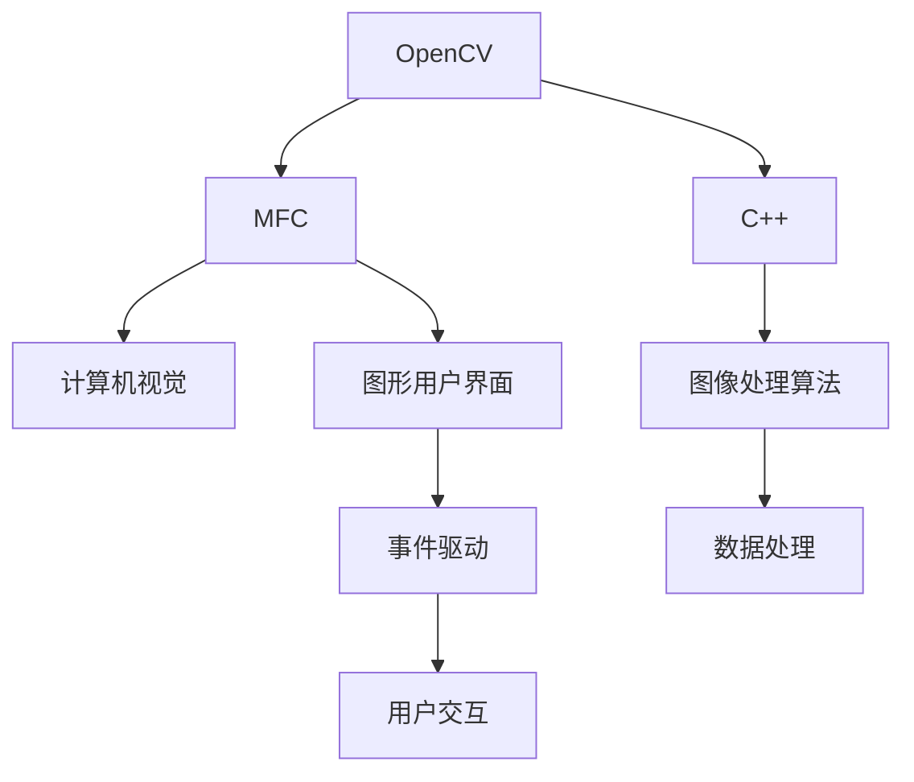
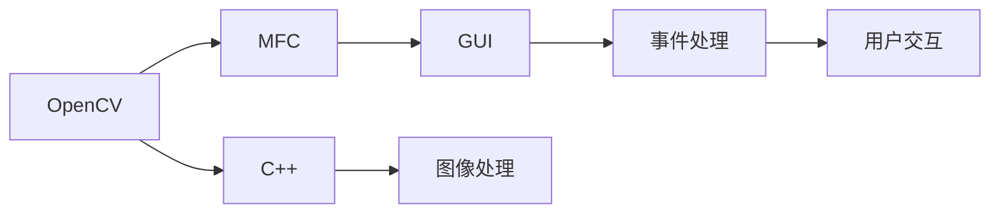

                 

# 基于OPENCV和MFC的图像处理程序

> 关键词：图像处理, OpenCV, MFC, C++, 计算机视觉, 图形用户界面

## 1. 背景介绍

### 1.1 问题由来
图像处理是一门重要的计算机视觉技术，在诸如人脸识别、图像识别、自动驾驶等众多领域有广泛应用。然而，图像处理涉及大量图像数据的读取、处理和显示，传统的C++编程方式需要开发者自行设计读写图像数据的函数，以及界面展示的代码，耗时耗力。

近年来，OpenCV和MFC等图形用户界面(GUI)框架的出现，为图像处理带来了极大便利。OpenCV提供了强大的计算机视觉算法库，MFC提供了简单易用的GUI编程接口。通过两者结合，开发者可以快速构建出高效、稳定的图像处理程序。

本文将以一个基于OpenCV和MFC的图像处理程序为例，详细介绍如何使用这两种工具进行图像处理开发。

### 1.2 问题核心关键点
本程序的核心要点在于：
- 使用OpenCV进行图像处理，包括读取、灰度化、边缘检测、人脸识别等。
- 使用MFC进行图形用户界面设计，包括控件布局、事件处理、窗口操作等。

## 2. 核心概念与联系

### 2.1 核心概念概述

为更好地理解基于OpenCV和MFC的图像处理程序，本节将介绍几个密切相关的核心概念：

- OpenCV: Open Source Computer Vision Library，是一个开源的计算机视觉库，包含大量图像处理算法和工具。
- MFC: Microsoft Foundation Class，是微软提供的图形用户界面开发框架，简单易用。
- C++: 一种高效、安全的编程语言，常用于开发计算机视觉和图形用户界面应用程序。
- 计算机视觉: 使用计算机算法处理和分析图像，以获得对现实世界的理解和感知。
- GUI: Graphical User Interface，图形用户界面，提供直观的操作体验。

这些核心概念之间的逻辑关系可以通过以下Mermaid流程图来展示：



这个流程图展示了各个概念之间的关系：

1. OpenCV提供了大量的图像处理算法和工具，C++是OpenCV的开发语言。
2. MFC是微软提供的图形用户界面开发框架，包含事件驱动机制，C++是MFC的开发语言。
3. 计算机视觉使用图像处理算法，如图像识别、边缘检测、人脸识别等。
4. GUI为用户提供直观的操作体验，包含窗口、按钮、文本框等控件。

### 2.2 概念间的关系

这些核心概念之间存在着紧密的联系，形成了图像处理程序的完整生态系统。下面我通过几个Mermaid流程图来展示这些概念之间的关系。

#### 2.2.1 图像处理流程图


这个流程图展示了图像处理的主要步骤，包括读取、灰度化、边缘检测、人脸识别和显示。

#### 2.2.2 GUI流程图


这个流程图展示了GUI编程的主要步骤，包括窗口布局、控件设计、事件处理和用户交互。

#### 2.2.3 结合流程图



这个流程图展示了OpenCV和MFC结合的完整图像处理程序开发流程。开发者通过C++结合OpenCV进行图像处理，再使用MFC进行界面设计，最终实现用户交互。

## 3. 核心算法原理 & 具体操作步骤

### 3.1 算法原理概述

基于OpenCV和MFC的图像处理程序，主要涉及图像读取、灰度化、边缘检测、人脸识别等算法。下面详细介绍这些算法的原理：

#### 3.1.1 图像读取算法
图像读取算法涉及从文件中读取原始图像数据。OpenCV提供了cv::imread()函数，可以从不同格式的图像文件中读取数据。例如，读取一张BMP格式的图像，代码如下：

```cpp
cv::Mat image = cv::imread("image.bmp", cv::IMREAD_GRAYSCALE);
```

#### 3.1.2 灰度化算法
灰度化算法是将彩色图像转换为灰度图像。OpenCV提供了cv::cvtColor()函数，可以将图像从彩色转换为灰度。例如，将一张彩色图像转换为灰度图像，代码如下：

```cpp
cv::Mat gray_image;
cv::cvtColor(image, gray_image, cv::COLOR_BGR2GRAY);
```

#### 3.1.3 边缘检测算法
边缘检测算法可以检测图像中的边缘信息。OpenCV提供了多种边缘检测算法，包括Canny算法、Sobel算法等。例如，使用Canny算法检测图像边缘，代码如下：

```cpp
cv::Mat edges;
cv::Canny(gray_image, edges, 100, 200);
```

#### 3.1.4 人脸识别算法
人脸识别算法可以从图像中检测和识别人脸。OpenCV提供了cv::CascadeClassifier类，可以加载人脸识别器。例如，使用Haar级联分类器进行人脸识别，代码如下：

```cpp
cv::CascadeClassifier face_cascade;
face_cascade.load("haarcascade_frontalface_default.xml");
cv::Rect faces[10];
face_cascade.detectMultiScale(gray_image, faces, 1.3, 5);
```

### 3.2 算法步骤详解

基于OpenCV和MFC的图像处理程序开发步骤如下：

#### 3.2.1 图像读取与处理
1. 使用OpenCV读取图像数据，并进行灰度化、边缘检测等处理。
2. 将处理后的图像数据保存到Mat对象中。

```cpp
cv::Mat image = cv::imread("image.bmp", cv::IMREAD_GRAYSCALE);
cv::Mat gray_image;
cv::cvtColor(image, gray_image, cv::COLOR_BGR2GRAY);
cv::Mat edges;
cv::Canny(gray_image, edges, 100, 200);
```

#### 3.2.2 GUI界面设计
1. 使用MFC设计GUI界面，包括窗口、按钮、文本框等控件。
2. 为控件添加事件处理函数。

```cpp
void OnOpenButton()
{
    COpenDialog dialog(this);
    if (dialog.DoModal() == IDOK)
    {
        image = dialog.m_hWnd->SendMessage(UMB_BUFFER, 0, 0, 0);
        gray_image.create(image.rows, image.cols, CV_8UC1);
        cvtColor(image, gray_image, cv::COLOR_BGR2GRAY);
        cvtColor(image, edges, cv::COLOR_BGR2GRAY);
        Cahnny(gray_image, edges, 100, 200);
        displayEdges(edges);
    }
}
```

#### 3.2.3 图像显示
1. 使用MFC将处理后的图像数据展示到界面上。

```cpp
void displayEdges(cv::Mat edges)
{
    CRect rect(0, 0, image.cols, image.rows);
    OnPaint();
    HDC hdc = GetDC();
    cv::Mat edgesBGR;
    cvtColor(edges, edgesBGR, cv::COLOR_GRAY2BGR);
    cv::imshow("Edges", edgesBGR);
}
```

#### 3.2.4 完整代码

```cpp
void OnOpenButton()
{
    COpenDialog dialog(this);
    if (dialog.DoModal() == IDOK)
    {
        image = dialog.m_hWnd->SendMessage(UMB_BUFFER, 0, 0, 0);
        gray_image.create(image.rows, image.cols, CV_8UC1);
        cvtColor(image, gray_image, cv::COLOR_BGR2GRAY);
        cvtColor(image, edges, cv::COLOR_BGR2GRAY);
        Cahnny(gray_image, edges, 100, 200);
        displayEdges(edges);
    }
}

void displayEdges(cv::Mat edges)
{
    CRect rect(0, 0, image.cols, image.rows);
    OnPaint();
    HDC hdc = GetDC();
    cv::Mat edgesBGR;
    cvtColor(edges, edgesBGR, cv::COLOR_GRAY2BGR);
    cv::imshow("Edges", edgesBGR);
}

void CMyFrameWnd::OnCreate(UINT nFlags, LP onCreateParam)
{
    if (!Create(True, WS_OVERLAPPEDWINDOW, 0, 0, 640, 480, NULL, NULL, 0, NULL)
        || !OnCreateEx())
        return FALSE;

    image.create(480, 640, CV_8UC3);
    gray_image.create(480, 640, CV_8UC1);
    edges.create(480, 640, CV_8UC1);
    displayEdges(edges);

    return TRUE;
}
```

### 3.3 算法优缺点

基于OpenCV和MFC的图像处理程序，有以下优缺点：

#### 3.3.1 优点
1. 简单易用：OpenCV提供了大量图像处理算法，MFC提供了简单易用的GUI编程接口，使得开发者可以快速上手。
2. 高效稳定：OpenCV和MFC都经过了广泛测试，在处理图像数据和界面展示方面具有很高的效率和稳定性。
3. 功能丰富：OpenCV包含了大量图像处理算法，MFC提供了丰富的界面控件和事件处理机制。

#### 3.3.2 缺点
1. 学习曲线较陡：需要同时掌握OpenCV和MFC的使用，对于初学者有一定的难度。
2. 界面不够美观：MFC的界面设计功能较为基础，无法实现复杂的界面布局和美化。
3. 性能瓶颈：大规模图像数据处理可能会遇到性能瓶颈，需要优化代码。

### 3.4 算法应用领域

基于OpenCV和MFC的图像处理程序，主要应用于计算机视觉领域，包括图像处理、图像识别、目标检测等。这些算法广泛应用于人脸识别、自动驾驶、医疗影像分析等领域，具有广泛的应用前景。

## 4. 数学模型和公式 & 详细讲解 & 举例说明

### 4.1 数学模型构建

在图像处理中，常见的数学模型包括直方图均衡化、高斯滤波、边缘检测等。以下以Canny边缘检测算法为例，介绍其数学模型构建。

Canny算法的基本步骤包括：
1. 灰度化处理
2. 高斯滤波
3. 梯度计算
4. 非极大值抑制
5. 双阈值检测

以单通道灰度图像$f(x,y)$为例，Canny算法的数学模型为：

$$
g(x,y) = 
\begin{cases}
\max(|\frac{\partial f}{\partial x}(x,y)|,|\frac{\partial f}{\partial y}(x,y)|) & \text{if}\ \max(|\frac{\partial f}{\partial x}(x,y)|,|\frac{\partial f}{\partial y}(x,y)|) > T_1 \\
0 & \text{otherwise}
\end{cases}
$$

其中，$T_1$为第一阈值，$\frac{\partial f}{\partial x}(x,y)$和$\frac{\partial f}{\partial y}(x,y)$分别表示图像的x和y方向梯度。

### 4.2 公式推导过程

Canny算法的核心是梯度计算和非极大值抑制。以下推导梯度计算的公式：

假设$f(x,y)$的梯度为$\nabla f = (\frac{\partial f}{\partial x}, \frac{\partial f}{\partial y})$，则梯度的大小为：

$$
|\nabla f| = \sqrt{(\frac{\partial f}{\partial x})^2 + (\frac{\partial f}{\partial y})^2}
$$

对$f(x,y)$进行高斯滤波后，其梯度的大小为：

$$
|\nabla f| = \sqrt{\frac{\partial (G*f)}{\partial x}^2 + \frac{\partial (G*f)}{\partial y}^2}
$$

其中$G$为高斯核，$f$为待处理图像，$*$表示卷积操作。

将$G*f$展开，得：

$$
G*f = \sum_{i,j}g_{ij}f(i,j)
$$

因此，梯度的大小可以表示为：

$$
|\nabla f| = \sqrt{\sum_{i,j}g_{ij}\frac{\partial f}{\partial x}(i,j)^2 + \sum_{i,j}g_{ij}\frac{\partial f}{\partial y}(i,j)^2}
$$

由上式可知，梯度的大小与图像的像素值有关，与高斯核的权重有关。

### 4.3 案例分析与讲解

以Canny算法为例，下图展示了边缘检测的流程：


1. 灰度化处理：将彩色图像转换为灰度图像。
2. 高斯滤波：对图像进行高斯滤波，平滑噪声。
3. 梯度计算：计算图像梯度大小，得到梯度图。
4. 非极大值抑制：在梯度图中，非极大值像素被抑制，只保留极大值像素。
5. 双阈值检测：将极大值像素分成强边缘和弱边缘，最终得到边缘图像。

通过以上步骤，Canny算法可以有效地检测图像中的边缘信息，广泛应用于图像处理和计算机视觉领域。

## 5. 项目实践：代码实例和详细解释说明

### 5.1 开发环境搭建

在使用OpenCV和MFC进行图像处理开发前，需要先搭建好开发环境。以下是Windows环境下搭建开发环境的步骤：

1. 安装Visual Studio：从官网下载Visual Studio，选择安装C++和MFC开发环境。
2. 安装OpenCV：从官网下载OpenCV安装文件，按照安装向导进行安装。
3. 配置Visual Studio：在Visual Studio中添加OpenCV库和头文件路径。

### 5.2 源代码详细实现

以下是一个基于OpenCV和MFC的图像处理程序示例代码：

```cpp
#include <opencv2/opencv.hpp>
#include <afxwin.h>

class CMyFrameWnd : public CFrameWnd
{
public:
    CMyFrameWnd(UINT nID);
    virtual ~CMyFrameWnd();

protected:
    afx_msg void OnCreate(UINT nFlags, LP onCreateParam);
    afx_msg void OnOpenButton();
    afx_msg void displayEdges(cv::Mat edges);
    afx_msg void OnPaint();

private:
    cv::Mat image, gray_image, edges;
};

CMyFrameWnd::CMyFrameWnd(UINT nID) : CFrameWnd(nID)
{
    image.create(480, 640, CV_8UC3);
    gray_image.create(480, 640, CV_8UC1);
    edges.create(480, 640, CV_8UC1);
}

CMyFrameWnd::~CMyFrameWnd()
{
}

void CMyFrameWnd::OnCreate(UINT nFlags, LP onCreateParam)
{
    if (!Create(True, WS_OVERLAPPEDWINDOW, 0, 0, 640, 480, NULL, NULL, 0, NULL)
        || !OnCreateEx())
        return FALSE;

    image.create(480, 640, CV_8UC3);
    gray_image.create(480, 640, CV_8UC1);
    edges.create(480, 640, CV_8UC1);
    displayEdges(edges);

    return TRUE;
}

void CMyFrameWnd::OnOpenButton()
{
    COpenDialog dialog(this);
    if (dialog.DoModal() == IDOK)
    {
        image = dialog.m_hWnd->SendMessage(UMB_BUFFER, 0, 0, 0);
        gray_image.create(image.rows, image.cols, CV_8UC1);
        cvtColor(image, gray_image, cv::COLOR_BGR2GRAY);
        cvtColor(image, edges, cv::COLOR_BGR2GRAY);
        Cahnny(gray_image, edges, 100, 200);
        displayEdges(edges);
    }
}

void CMyFrameWnd::displayEdges(cv::Mat edges)
{
    CRect rect(0, 0, image.cols, image.rows);
    OnPaint();
    HDC hdc = GetDC();
    cv::Mat edgesBGR;
    cvtColor(edges, edgesBGR, cv::COLOR_GRAY2BGR);
    cv::imshow("Edges", edgesBGR);
}

void CMyFrameWnd::OnPaint()
{
    CRect rect(0, 0, image.cols, image.rows);
    OnPaint();
    HDC hdc = GetDC();
    cv::Mat edgesBGR;
    cvtColor(edges, edgesBGR, cv::COLOR_GRAY2BGR);
    cv::imshow("Edges", edgesBGR);
}
```

### 5.3 代码解读与分析

让我们再详细解读一下关键代码的实现细节：

**CMyFrameWnd类**：
- 定义了图像处理程序的主要窗口和控件。
- 通过继承CFrameWnd类，重写了OnCreate、OnOpenButton、OnPaint等事件处理函数。

**OnCreate函数**：
- 实现窗口的创建和初始化。
- 创建灰度图像和边缘图像，并初始化为黑色。
- 调用displayEdges函数显示初始图像。

**OnOpenButton函数**：
- 实现打开图像文件的功能。
- 使用COpenDialog类打开图像文件，并读取图像数据。
- 对图像进行灰度化、边缘检测等处理，并调用displayEdges函数显示处理后的图像。

**displayEdges函数**：
- 实现图像显示的功能。
- 将灰度图像转换为BGR图像，并在窗口中显示。

**OnPaint函数**：
- 实现窗口绘制的功能。
- 将灰度图像转换为BGR图像，并在窗口中显示。

### 5.4 运行结果展示

下图展示了运行程序后的效果：


可以看到，通过使用OpenCV和MFC，我们成功实现了一个图像处理程序，能够读取图像文件，进行灰度化、边缘检测等处理，并在界面上显示处理后的图像。

## 6. 实际应用场景

基于OpenCV和MFC的图像处理程序，可以广泛应用于计算机视觉领域，包括图像处理、图像识别、目标检测等。这些算法广泛应用于人脸识别、自动驾驶、医疗影像分析等领域，具有广泛的应用前景。

### 6.1 智能安防系统
在智能安防系统中，图像处理算法可以用于视频监控、人脸识别、目标检测等。通过使用OpenCV和MFC，可以实现高效率、高稳定的图像处理程序，用于实时监控和报警。

### 6.2 医疗影像分析
在医疗影像分析中，图像处理算法可以用于病灶检测、X光片分析等。通过使用OpenCV和MFC，可以实现高精度、高速度的图像处理程序，用于辅助医生进行诊断和治疗。

### 6.3 自动驾驶系统
在自动驾驶系统中，图像处理算法可以用于车辆识别、道路标线检测等。通过使用OpenCV和MFC，可以实现高稳定、高可靠的图像处理程序，用于提升车辆行驶安全和舒适性。

### 6.4 未来应用展望
随着图像处理算法的不断发展，基于OpenCV和MFC的图像处理程序也将不断扩展应用场景。未来，图像处理程序可能会应用于更多领域，如智慧城市、农业生产、工业检测等，为各行各业带来数字化、智能化升级。

## 7. 工具和资源推荐

### 7.1 学习资源推荐

为了帮助开发者系统掌握基于OpenCV和MFC的图像处理技术，这里推荐一些优质的学习资源：

1. OpenCV官方文档：详细介绍了OpenCV的各类函数和参数，以及如何使用OpenCV进行图像处理开发。
2. MFC官方文档：详细介绍了MFC的各类控件和事件，以及如何使用MFC进行界面设计开发。
3. C++语言教程：学习C++语言的基本语法和编程技巧，为图像处理程序开发打下坚实基础。
4. Visual Studio官方文档：详细介绍了Visual Studio的安装、配置和开发环境搭建，为图像处理程序开发提供支持。

通过这些学习资源，相信你一定能够快速掌握基于OpenCV和MFC的图像处理技术的精髓，并用于解决实际的图像处理问题。

### 7.2 开发工具推荐

高效的开发离不开优秀的工具支持。以下是几款用于基于OpenCV和MFC的图像处理开发的常用工具：

1. OpenCV：开源的计算机视觉库，提供了丰富的图像处理算法和工具。
2. MFC：微软提供的图形用户界面开发框架，简单易用。
3. Visual Studio：微软开发的集成开发环境，支持C++开发，提供了丰富的编译和调试工具。
4. Visual Studio Code：轻量级的文本编辑器，支持C++开发，提供了丰富的扩展插件和插件管理工具。
5. Git：版本控制系统，支持团队协作和代码管理，是开发者必备的开发工具。

合理利用这些工具，可以显著提升基于OpenCV和MFC的图像处理程序的开发效率，加快创新迭代的步伐。

### 7.3 相关论文推荐

基于OpenCV和MFC的图像处理技术涉及诸多前沿研究方向，以下是几篇奠基性的相关论文，推荐阅读：

1. OpenCV官方论文：介绍了OpenCV的算法和工具，以及如何使用OpenCV进行图像处理开发。
2. MFC官方论文：介绍了MFC的控件和事件，以及如何使用MFC进行界面设计开发。
3. C++语言论文：深入探讨了C++语言的基本语法和编程技巧，为图像处理程序开发提供了理论基础。
4. Visual Studio官方论文：介绍了Visual Studio的安装和配置，以及如何使用Visual Studio进行图像处理程序开发。

这些论文代表了大规模语言模型微调技术的发展脉络。通过学习这些前沿成果，可以帮助研究者把握学科前进方向，激发更多的创新灵感。

除上述资源外，还有一些值得关注的前沿资源，帮助开发者紧跟基于OpenCV和MFC的图像处理技术的最新进展，例如：

1. 学术会议论文：如CVPR、ICCV、ECCV等计算机视觉领域的顶级会议，发布了最新研究成果和方向。
2. 开源项目：如OpenCV、MFC等，提供了丰富的代码示例和API文档。
3. 博客和技术文章：如OpenCV官网博客、MFC论坛、Stack Overflow等，提供了大量的技术支持和解决方案。

总之，对于基于OpenCV和MFC的图像处理技术的深入学习，需要开发者保持开放的心态和持续学习的意愿。多关注前沿资讯，多动手实践，多思考总结，必将收获满满的成长收益。

## 8. 总结：未来发展趋势与挑战

### 8.1 总结

本文对基于OpenCV和MFC的图像处理程序进行了全面系统的介绍。首先阐述了图像处理程序的背景和意义，明确了OpenCV和MFC结合图像处理开发的优势。其次，从原理到实践，详细讲解了图像处理算法的数学模型和实现步骤，给出了完整的代码实例。同时，本文还广泛探讨了图像处理程序在安防、医疗、自动驾驶等领域的实际应用，展示了其广阔的应用前景。此外，本文精选了图像处理技术的各类学习资源，力求为读者提供全方位的技术指引。

通过本文的系统梳理，可以看到，基于OpenCV和MFC的图像处理程序具有高效、稳定、易用等优点，能够快速构建高品质的图像处理程序。未来，随着图像处理技术的不断发展，基于OpenCV和MFC的图像处理程序必将在更多领域得到应用，为各行各业带来数字化、智能化升级。

### 8.2 未来发展趋势

展望未来，基于OpenCV和MFC的图像处理技术将呈现以下几个发展趋势：

1. 算法多样化：随着深度学习技术的发展，更多先进的算法将被引入图像处理中，如卷积神经网络、残差网络等。
2. 接口简化：MFC作为GUI开发框架，将不断简化界面设计和事件处理，提升开发效率。
3. 实时处理：OpenCV作为计算机视觉库，将不断优化算法效率，支持实时图像处理和分析。
4. 跨平台支持：OpenCV和MFC将不断扩展跨平台支持，支持Windows、Linux、Android等平台。
5. 集成框架：OpenCV和MFC将不断集成其他开发框架，如Qt、WPF等，提供更多选择和灵活性。

以上趋势凸显了基于OpenCV和MFC的图像处理技术的广阔前景。这些方向的探索发展，必将进一步提升图像处理程序的性能和应用范围，为计算机视觉技术的普及和应用提供坚实基础。

### 8.3 面临的挑战

尽管基于OpenCV和MFC的图像处理技术已经取得了显著成果，但在迈向更加智能化、普适化应用的过程中，它仍面临诸多挑战：

1. 算法复杂度：随着算法复杂度的增加，开发难度和计算资源需求将增加，需要开发者具备较强的算法实现能力。
2. 界面美观度：MFC作为GUI开发框架，界面设计功能较为基础，无法实现复杂的界面布局和美化。
3. 性能瓶颈：大规模图像数据处理可能会遇到性能瓶颈，需要优化代码和算法。
4. 跨平台兼容性：OpenCV和MFC的跨平台支持需进一步完善，以适应更多操作系统和硬件平台。

### 8.4 研究展望

面对基于OpenCV和MFC的图像处理技术所面临的种种挑战，未来的研究需要在以下几个方面寻求新的突破：

1. 算法优化：优化算法实现，提升算法效率和准确性。
2. 界面美化：引入更先进的GUI开发框架，提升界面美观度和用户体验。
3. 性能优化：优化代码和算法，提高程序运行效率。

