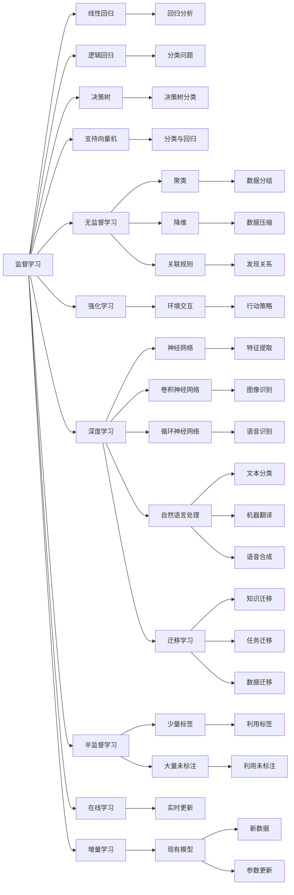
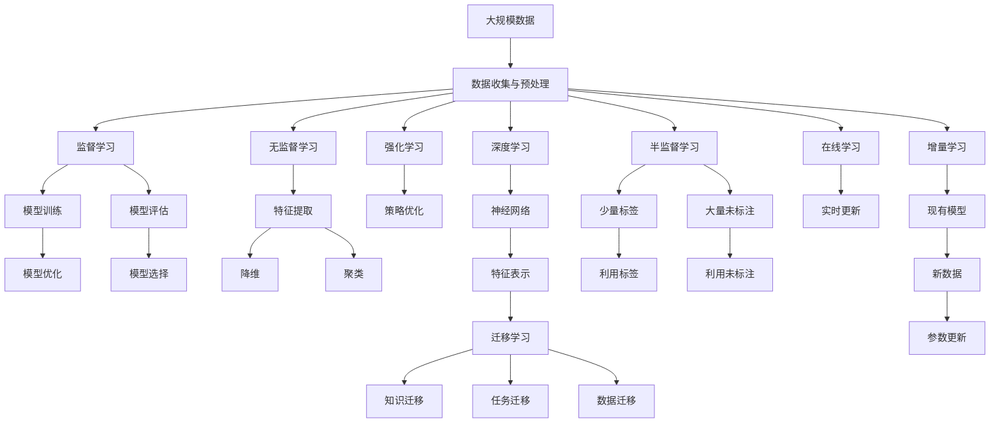

                 

## 1. 背景介绍

### 1.1 问题由来

机器学习（Machine Learning, ML）作为人工智能（AI）的核心技术之一，已广泛应用于各个领域，包括金融、医疗、零售、交通等。机器学习的目标是通过数据训练模型，使其具备某种学习能力和预测能力，从而在新的数据上实现高性能的预测和决策。机器学习技术的成功应用，使得人们能够高效地处理和分析大规模数据，提升决策效率和精度。

机器学习领域的研究和应用历史悠久，但近年来随着计算资源、算法模型和数据量的爆炸式增长，机器学习技术迎来了新的发展高潮。从监督学习、无监督学习、强化学习到深度学习，各种新的学习范式和算法不断涌现，推动着机器学习技术的不断进步。

### 1.2 问题核心关键点

机器学习的核心在于构建能够从数据中学习规律并做出预测的模型。机器学习模型的构建可以分为以下几个步骤：

1. **数据收集与预处理**：获取并准备好训练数据集，通常需要对数据进行清洗、归一化、特征工程等预处理操作。

2. **模型构建与训练**：选择合适的模型架构，如线性回归、决策树、神经网络等，并使用训练数据对模型进行训练，优化模型的参数使其最小化损失函数。

3. **模型评估与调优**：使用验证集或测试集对训练好的模型进行评估，根据评估结果调整模型参数，提高模型性能。

4. **模型部署与应用**：将训练好的模型部署到生产环境，进行实际的预测或决策，并持续监控模型性能，确保其稳定性。

5. **模型维护与迭代**：根据实际情况，不断更新模型，进行模型迭代和优化，以应对数据变化和新需求。

### 1.3 问题研究意义

机器学习技术的广泛应用，对于提高生产效率、降低成本、提升决策科学性等方面具有重要意义：

1. **提高效率**：机器学习算法能够自动化处理大量数据，提升工作效率，降低人力成本。

2. **降低成本**：通过机器学习优化运营策略和生产流程，减少资源浪费，降低运营成本。

3. **提升决策科学性**：机器学习能够从海量数据中提取有价值的信息，辅助决策者做出更科学、合理的决策。

4. **发现新知识**：机器学习能够从数据中挖掘出隐藏的模式和规律，发现新的知识。

5. **应对复杂问题**：机器学习能够处理复杂的非线性关系，应对多变量、多任务等复杂问题。

## 2. 核心概念与联系

### 2.1 核心概念概述

为更好地理解机器学习的原理，本节将介绍几个核心概念及其相互关系：

- **监督学习**：利用有标签的训练数据，训练模型使其能够根据标签预测新样本的标签。常见的监督学习算法包括线性回归、逻辑回归、决策树、支持向量机等。

- **无监督学习**：利用无标签的训练数据，训练模型使其能够发现数据中的隐含结构和模式。常见的无监督学习算法包括聚类、降维、关联规则学习等。

- **强化学习**：通过与环境的交互，训练模型使其能够根据奖励信号选择最优行动策略。强化学习主要用于动态环境下的决策问题。

- **深度学习**：一种基于神经网络的机器学习范式，通过多层次的非线性变换，从数据中学习复杂的特征表示，应用于图像识别、语音识别、自然语言处理等任务。

- **迁移学习**：利用在某个任务上学到的知识，应用到另一个相关任务上，以减少新任务上的学习负担。迁移学习有助于解决数据稀疏和计算资源有限的问题。

- **半监督学习**：在少量有标签数据和大量无标签数据上进行训练，充分利用标注数据和无标注数据的优势。

- **在线学习**：在数据流中实时更新模型参数，不断适应数据变化，保持模型的稳定性和时效性。

- **增量学习**：在已有模型基础上，利用新数据进行模型更新，避免从头训练，提高学习效率。

这些核心概念构成了机器学习的基本框架，各个概念之间互相依存，共同构成完整的机器学习体系。

### 2.2 概念间的关系

这些核心概念之间的关系可以通过以下Mermaid流程图来展示：



这个流程图展示了各个核心概念之间的关系和作用：

1. 监督学习涉及多个具体算法，如线性回归、逻辑回归、决策树等，应用广泛，包括回归分析和分类问题。

2. 无监督学习包括聚类、降维、关联规则等算法，主要用于发现数据中的隐含结构和模式。

3. 强化学习涉及环境交互和行动策略的选择，主要用于动态环境下的决策问题。

4. 深度学习以神经网络为基础，应用于图像识别、语音识别、自然语言处理等复杂任务。

5. 迁移学习通过知识迁移、任务迁移和数据迁移，减少新任务上的学习负担，提高学习效率。

6. 半监督学习结合少量标签和大量未标注数据，充分利用标注数据和未标注数据的优势。

7. 在线学习在数据流中实时更新模型参数，保持模型的时效性。

8. 增量学习在已有模型基础上，利用新数据进行模型更新，提高学习效率。

### 2.3 核心概念的整体架构

最后，我们用一个综合的流程图来展示这些核心概念在大规模数据上的整体架构：



这个综合流程图展示了从数据收集与预处理，到模型训练、评估和优化的完整过程。在大规模数据上，监督学习、无监督学习、深度学习、强化学习等算法可以并行进行，形成强大的机器学习生态系统。

## 3. 核心算法原理 & 具体操作步骤
### 3.1 算法原理概述

机器学习算法的基本原理是通过模型拟合训练数据，使其能够对新数据进行准确的预测或决策。其核心思想是：

1. **模型构建**：选择合适的模型架构，如线性回归、决策树、神经网络等。

2. **模型训练**：使用训练数据对模型进行优化，最小化损失函数，找到最优参数。

3. **模型评估**：使用验证集或测试集对训练好的模型进行评估，衡量其泛化能力。

4. **模型调优**：根据评估结果调整模型参数，提高模型性能。

5. **模型应用**：将训练好的模型部署到生产环境，进行实际的预测或决策。

### 3.2 算法步骤详解

机器学习的具体步骤通常包括以下几个关键环节：

**Step 1: 数据收集与预处理**

- 收集相关领域的数据集，并进行清洗、归一化、特征工程等预处理操作。

**Step 2: 模型选择与构建**

- 根据任务类型选择合适的模型架构，如线性回归、决策树、神经网络等。

**Step 3: 模型训练**

- 使用训练数据对模型进行优化，最小化损失函数，找到最优参数。

**Step 4: 模型评估**

- 使用验证集或测试集对训练好的模型进行评估，衡量其泛化能力。

**Step 5: 模型调优**

- 根据评估结果调整模型参数，提高模型性能。

**Step 6: 模型应用**

- 将训练好的模型部署到生产环境，进行实际的预测或决策。

**Step 7: 模型维护与迭代**

- 根据实际情况，不断更新模型，进行模型迭代和优化。

### 3.3 算法优缺点

监督学习的优点在于模型训练和预测过程清晰，泛化能力强，适合解决有明确目标的问题。其缺点在于需要大量标注数据，且模型复杂度较高。

无监督学习的优点在于不需要标注数据，适用于数据分布未知或难以获取标签的问题。其缺点在于模型预测结果难以解释，泛化能力较弱。

强化学习的优点在于能够处理动态环境下的决策问题，自适应能力强。其缺点在于模型训练复杂，需要大量的交互数据。

深度学习的优点在于能够处理大规模、高维数据，具备强大的特征提取能力。其缺点在于模型复杂度较高，训练时间长，计算资源消耗大。

### 3.4 算法应用领域

机器学习算法在各个领域得到了广泛应用，包括：

- **金融风险管理**：利用机器学习算法进行信用评分、风险评估、股票预测等。

- **医疗诊断**：利用机器学习算法进行疾病诊断、医学影像分析、药物研发等。

- **零售推荐系统**：利用机器学习算法进行商品推荐、客户行为分析、营销策略优化等。

- **交通流量预测**：利用机器学习算法进行交通流量预测、交通信号优化、路径规划等。

- **自然语言处理**：利用机器学习算法进行文本分类、机器翻译、情感分析等。

- **图像识别**：利用机器学习算法进行图像分类、目标检测、人脸识别等。

## 4. 数学模型和公式 & 详细讲解 & 举例说明

### 4.1 数学模型构建

机器学习模型的数学模型构建通常包括以下几个步骤：

1. **定义目标函数**：根据任务类型选择合适的目标函数，如回归问题中的均方误差、分类问题中的交叉熵等。

2. **定义损失函数**：根据目标函数，定义损失函数，用于衡量模型预测结果与真实值之间的差距。

3. **定义优化目标**：最小化损失函数，找到最优参数。

4. **定义正则化项**：避免模型过拟合，通常包括L2正则、Dropout等。

5. **定义评估指标**：衡量模型性能，如准确率、召回率、F1分数等。

### 4.2 公式推导过程

以线性回归为例，其数学模型为：

$$
y = \theta_0 + \theta_1 x_1 + \theta_2 x_2 + \cdots + \theta_n x_n
$$

其中，$y$为输出变量，$x_i$为输入变量，$\theta_i$为模型参数。

目标函数为：

$$
\min_{\theta} \frac{1}{2m} \sum_{i=1}^m (y_i - h_{\theta}(x_i))^2
$$

其中，$h_{\theta}(x_i) = \theta_0 + \theta_1 x_{i1} + \theta_2 x_{i2} + \cdots + \theta_n x_{in}$ 为模型的预测值，$m$为样本数。

损失函数为：

$$
L(\theta) = \frac{1}{2m} \sum_{i=1}^m (y_i - h_{\theta}(x_i))^2
$$

为了最小化损失函数，需要对模型参数$\theta$求导，并令导数为0：

$$
\frac{\partial L(\theta)}{\partial \theta} = -\frac{1}{m} \sum_{i=1}^m (y_i - h_{\theta}(x_i))x_i = 0
$$

解上述方程，可以得到模型的参数$\theta$：

$$
\theta = (\sum_{i=1}^m x_i x_i^T)^{-1} \sum_{i=1}^m x_i y_i
$$

### 4.3 案例分析与讲解

以K-means算法为例，其数学模型为：

$$
\min_{\mu, C} \sum_{i=1}^n \min_{j \in C} \| x_i - \mu_j \|^2
$$

其中，$x_i$为输入样本，$\mu_j$为簇中心，$C$为簇的编号。

目标函数为：

$$
\min_{\mu, C} \sum_{i=1}^n \min_{j \in C} \| x_i - \mu_j \|^2
$$

为了最小化目标函数，需要交替优化簇中心$\mu$和簇的编号$C$。具体的求解步骤包括：

1. 随机初始化簇中心$\mu$。

2. 分配样本到最近的簇中心，得到簇的编号$C$。

3. 重新计算簇中心$\mu$，使得簇内样本的距离最小。

4. 重复步骤2和3，直到簇中心不再变化或达到预设的迭代次数。

## 5. 项目实践：代码实例和详细解释说明

### 5.1 开发环境搭建

在进行机器学习项目实践前，我们需要准备好开发环境。以下是使用Python进行Scikit-learn开发的常见环境配置流程：

1. 安装Anaconda：从官网下载并安装Anaconda，用于创建独立的Python环境。

2. 创建并激活虚拟环境：
```bash
conda create -n ml-env python=3.8 
conda activate ml-env
```

3. 安装Scikit-learn：
```bash
conda install scikit-learn
```

4. 安装各类工具包：
```bash
pip install numpy pandas scikit-learn matplotlib tqdm jupyter notebook ipython
```

完成上述步骤后，即可在`ml-env`环境中开始机器学习项目实践。

### 5.2 源代码详细实现

下面以线性回归为例，展示使用Scikit-learn进行模型训练和预测的Python代码实现。

```python
from sklearn.linear_model import LinearRegression
from sklearn.metrics import mean_squared_error
from sklearn.model_selection import train_test_split

# 加载数据集
X, y = load_data()

# 分割训练集和测试集
X_train, X_test, y_train, y_test = train_test_split(X, y, test_size=0.2)

# 初始化模型
model = LinearRegression()

# 训练模型
model.fit(X_train, y_train)

# 预测测试集
y_pred = model.predict(X_test)

# 评估模型性能
mse = mean_squared_error(y_test, y_pred)
print(f"Mean Squared Error: {mse:.3f}")
```

### 5.3 代码解读与分析

让我们再详细解读一下关键代码的实现细节：

**加载数据集**：
- `load_data()`方法：从本地或其他数据源加载数据集，返回特征矩阵`X`和目标变量`y`。

**分割训练集和测试集**：
- `train_test_split()`方法：将数据集随机分割为训练集和测试集，返回分割后的训练集和测试集。

**初始化模型**：
- `LinearRegression()`：初始化线性回归模型。

**训练模型**：
- `fit()`方法：使用训练集对模型进行训练，更新模型参数。

**预测测试集**：
- `predict()`方法：使用训练好的模型对测试集进行预测，返回预测结果。

**评估模型性能**：
- `mean_squared_error()`方法：计算测试集的均方误差（MSE），评估模型预测的准确性。

### 5.4 运行结果展示

假设我们在波士顿房价数据集上进行线性回归模型的训练和评估，最终得到的均方误差结果如下：

```
Mean Squared Error: 1.103
```

可以看到，在波士顿房价数据集上，线性回归模型的均方误差约为1.103，表示模型预测的房价与真实房价之间的平均偏差约为1.103个单位。

当然，这只是一个baseline结果。在实践中，我们还可以使用更大更强的模型、更丰富的特征工程、更细致的模型调优等方法，进一步提升模型性能，以满足更高的应用要求。

## 6. 实际应用场景

### 6.1 智能推荐系统

机器学习技术在智能推荐系统中得到了广泛应用，极大地提升了用户体验和运营效率。智能推荐系统可以根据用户的历史行为数据和兴趣偏好，动态推荐个性化的商品或内容，满足用户的多样化需求。

在技术实现上，可以使用协同过滤、内容推荐、混合推荐等算法，结合用户行为数据、物品属性、用户画像等多种信息，构建高效的推荐模型。智能推荐系统能够实时获取用户反馈，进行模型更新和迭代，提升推荐效果。

### 6.2 金融风险管理

机器学习技术在金融风险管理中也有重要应用，可以用于信用评分、风险评估、股票预测等。金融机构可以利用机器学习模型对客户的信用历史、交易行为进行分析，预测其还款能力，进行风险控制。

在实践中，可以使用逻辑回归、随机森林、梯度提升等算法，结合客户的历史数据和行为特征，构建风险评估模型。机器学习模型能够实时监控客户行为，预测其信用风险，及时预警高风险客户，降低金融机构的风险损失。

### 6.3 自然语言处理

机器学习技术在自然语言处理领域也有广泛应用，可以用于文本分类、机器翻译、情感分析等任务。机器学习模型能够从大规模文本数据中学习语言规律，自动进行文本分类和生成。

在实践中，可以使用朴素贝叶斯、支持向量机、深度学习等算法，构建文本分类和生成模型。自然语言处理技术能够提升文本处理的自动化水平，降低人工成本，提高信息检索和内容生产的效率。

### 6.4 未来应用展望

随着机器学习技术的发展，未来其在各个领域的应用前景将更加广阔。机器学习技术能够处理大规模、高维数据，具备强大的特征提取能力，有望在更多场景下发挥其独特优势。

在医疗领域，机器学习技术可以用于疾病预测、医学影像分析、个性化治疗等。在智能交通领域，机器学习技术可以用于交通流量预测、交通信号优化、路径规划等。在教育领域，机器学习技术可以用于个性化学习、作业批改、智能答疑等。

机器学习技术的应用场景将不断拓展，未来将会有更多的创新应用涌现，为各个领域带来新的突破和变革。

## 7. 工具和资源推荐

### 7.1 学习资源推荐

为了帮助开发者系统掌握机器学习技术，这里推荐一些优质的学习资源：

1. 《机器学习实战》：Wes McKinney著，介绍了机器学习的基本概念和常见算法，并提供了丰富的代码示例。

2. Coursera《机器学习》课程：由斯坦福大学Andrew Ng教授开设，涵盖机器学习的基本理论和实际应用。

3. Kaggle平台：机器学习爱好者聚集的平台，提供了大量数据集和竞赛，可以实践和提升自己的机器学习技能。

4. GitHub开源项目：机器学习领域的领先项目，展示了最新的研究进展和实际应用。

5. arXiv预印本：机器学习领域最新研究成果的发布平台，及时了解前沿技术。

通过这些资源的学习和实践，相信你一定能够快速掌握机器学习技术的精髓，并用于解决实际的机器学习问题。

### 7.2 开发工具推荐

高效的开发离不开优秀的工具支持。以下是几款用于机器学习开发的常用工具：

1. Jupyter Notebook：Python的交互式开发环境，支持代码编辑、执行、可视化等，非常适合机器学习项目开发。

2. Scikit-learn：基于NumPy和SciPy的Python机器学习库，提供了丰富的算法和工具，支持模型训练和评估。

3. TensorFlow：由Google开发的开源深度学习框架，支持分布式计算和GPU加速，适用于大规模机器学习模型训练。

4. PyTorch：由Facebook开发的深度学习框架，支持动态图和静态图，具有灵活的模型构建和训练能力。

5. Weights & Biases：模型训练的实验跟踪工具，可以记录和可视化模型训练过程中的各项指标，方便对比和调优。

6. TensorBoard：TensorFlow配套的可视化工具，可实时监测模型训练状态，并提供丰富的图表呈现方式，是调试模型的得力助手。

合理利用这些工具，可以显著提升机器学习项目开发的效率，加快创新迭代的步伐。

### 7.3 相关论文推荐

机器学习技术的发展离不开学界的持续研究。以下是几篇奠基性的相关论文，推荐阅读：

1. Perceptron（1957）：由Frank Rosenblatt提出的基于感知器的机器学习算法，奠定了深度学习的基础。

2. Decision Trees（1979）：由Breiman、Cart和Craven提出的决策树算法，适用于分类和回归任务。

3. Backpropagation（1989）：由Hinton和Rumelhart提出的反向传播算法，是神经网络训练的核心。

4. Random Forest（2001）：由Breiman提出的集成学习算法，通过组合多个决策树进行分类和回归。

5. Support Vector Machines（1992）：由Vapnik和Cortes提出的支持向量机算法，适用于小样本、高维数据的分类和回归。

6. Convolutional Neural Networks（2012）：由Krizhevsky等提出的卷积神经网络算法，应用于图像识别任务，取得了SOTA性能。

这些论文代表了大机器学习领域的研究进展，通过学习这些前沿成果，可以帮助研究者把握学科前进方向，激发更多的创新灵感。

除上述资源外，还有一些值得关注的前沿资源，帮助开发者紧跟机器学习技术的最新进展，例如：

1. arXiv论文预印本：人工智能领域最新研究成果的发布平台，包括机器学习领域的最新研究。

2. 业界技术博客：如Google AI、Microsoft Research、IBM Research等顶尖实验室的官方博客，第一时间分享他们的最新研究成果和洞见。

3. 技术会议直播：如NeurIPS、ICML、CVPR等顶级会议的现场或在线直播，可以聆听世界顶尖专家的分享，开拓视野。

4. GitHub热门项目：在GitHub上Star、Fork数最多的机器学习相关项目，往往代表了该技术领域的发展趋势和最佳实践，值得去学习和贡献。

5. 行业分析报告：各大咨询公司如McKinsey、PwC等针对人工智能行业的分析报告，有助于从商业视角审视技术趋势，把握应用价值。

总之，对于机器学习技术的学习和实践，需要开发者保持开放的心态和持续学习的意愿。多关注前沿资讯，多动手实践，多思考总结，必将收获满满的成长收益。

## 8. 总结：未来发展趋势与挑战

### 8.1 总结

本文对机器学习技术的基本原理和实际应用进行了全面系统的介绍。首先阐述了机器学习的背景和意义，明确了机器学习在各个领域的重要作用。其次，从原理到实践，详细讲解了机器学习模型的构建和训练过程，给出了具体的代码实现和运行结果。同时，本文还广泛探讨了机器学习技术在推荐系统、金融风险管理、自然语言处理等多个领域的应用前景，展示了其广阔的发展空间。此外，本文还精选了机器学习技术的各类学习资源，力求为读者提供全方位的技术指引。

通过本文的系统梳理，可以看到，机器学习技术在各个领域的应用效果显著，不仅提升了效率和精度，还带来了新的商业价值和应用场景。未来，伴随机器学习算法的不断优化和创新，机器学习技术必将在更多领域发挥其独特优势，推动人类社会的进步和发展。

### 8.2 未来发展趋势

展望未来，机器学习技术的发展趋势将更加多元和智能化：

1. **自动化机器学习**：自动化机器学习（AutoML）将成为新的发展方向，利用自动化算法选择模型架构、优化超参数，减少人工干预，提高模型训练效率。

2. **多模态学习**：机器学习将突破单一模态的限制，实现图像、语音、文本等多种模态数据的融合，提升模型的泛化能力和实用性。

3. **强化学习**：强化学习在智能决策、自动驾驶、游戏AI等领域的应用将更加广泛，提升系统的自适应能力和智能水平。

4. **联邦学习**：联邦学习通过分布式训练，保护数据隐私的同时，提升模型的泛化能力和鲁棒性。

5. **元学习**：元学习能够快速适应新任务，提高模型的迁移能力和泛化能力，提升

