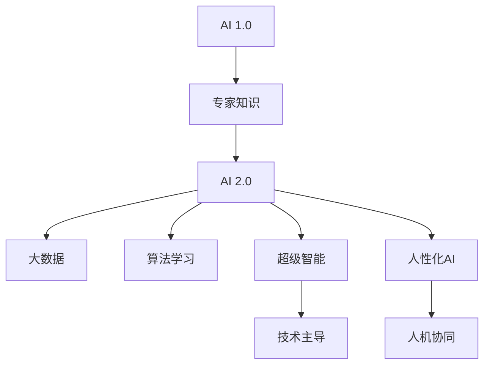

                 

# 李开复：AI 2.0 时代的价值

> 关键词：人工智能,李开复,价值,创新,技术,发展

## 1. 背景介绍

人工智能（AI）正迅速崛起，成为现代社会最活跃的科技领域之一。面对这一趋势，谷歌前执行副总裁、创新负责人李开复于2021年提出了“AI 2.0”的概念，阐述了AI的演进路径和未来发展方向。本文将深入探讨李开复关于AI 2.0时代的价值、趋势、挑战和机遇，并对其未来发展进行前瞻性分析。

## 2. 核心概念与联系

### 2.1 核心概念概述

AI 2.0的核心在于人工智能技术的跨越式发展，强调了技术在解决复杂社会问题、促进人类福祉方面的价值。其主要包括以下几个关键概念：

- **人工智能**：一种模拟人类智能过程的计算系统，通过机器学习、自然语言处理、计算机视觉等技术实现。
- **AI 1.0**：指代传统的基于规则的专家系统，依赖专家知识进行特定任务处理。
- **AI 2.0**：强调通过大数据和算法自适应学习，逐步建立通用智能模型。
- **超级智能**：未来AI系统将具备自我进化能力，通过不断学习，实现超越人类智能的目标。
- **人性化AI**：注重AI在道德、伦理和社会影响方面的考量，强调与人类和谐共生。

### 2.2 概念间的关系

AI 2.0不仅是对AI 1.0的继承和发展，更是对未来科技趋势的深刻洞察。其核心价值在于通过技术创新，实现社会福祉和人类福祉的最大化。以下是AI 2.0与AI 1.0和未来发展的关系图：



### 2.3 核心概念的整体架构

AI 2.0作为一个复杂的系统，其构建涉及多个层次和环节，如下图所示：


这个架构图展示了从数据处理、算法学习到模型训练和智能应用的全流程，以及其对社会福祉的贡献和技术创新的驱动。

## 3. 核心算法原理 & 具体操作步骤
### 3.1 算法原理概述

AI 2.0的核心算法原理主要包括数据驱动、深度学习和迁移学习。其基本思想是通过大规模数据训练模型，使模型能够学习并处理复杂任务，并在新任务上实现迁移学习。

- **数据驱动**：AI 2.0利用大数据的规模和多样性，通过机器学习算法实现模型的自适应学习。
- **深度学习**：通过多层神经网络模型，AI 2.0能够学习并抽象出数据的高级特征，实现更精准的预测和生成。
- **迁移学习**：基于已有的知识，AI 2.0能够在新的任务上快速学习和适应，提升模型泛化能力。

### 3.2 算法步骤详解

AI 2.0的训练和应用步骤主要分为以下几个环节：

1. **数据准备**：收集和清洗大规模数据，并将其划分为训练集、验证集和测试集。
2. **模型选择**：选择合适的深度学习模型，并设定其超参数。
3. **模型训练**：使用训练集数据对模型进行训练，并根据验证集反馈进行调整。
4. **模型评估**：在测试集上评估模型性能，进行必要的微调或迭代训练。
5. **应用部署**：将训练好的模型部署到实际应用场景中，并进行持续监控和优化。

### 3.3 算法优缺点

AI 2.0的优点包括：

- **高效性**：能够快速处理大量数据，实现复杂的预测和生成任务。
- **泛化能力**：通过迁移学习，能够在不同任务上取得较好的表现。
- **自我学习**：通过持续学习和适应，AI 2.0能够在不断变化的环境中保持竞争力。

但同时，AI 2.0也存在一些缺点：

- **数据依赖**：对高质量数据的依赖较大，数据偏差可能导致模型偏见。
- **模型复杂**：深度学习模型参数量大，对计算资源需求高。
- **可解释性不足**：复杂模型难以解释其内部决策过程，增加了用户的信任难度。

### 3.4 算法应用领域

AI 2.0的应用领域非常广泛，涵盖了金融、医疗、教育、交通等多个行业。以下是几个典型应用案例：

- **金融领域**：AI 2.0用于金融风险评估、投资决策和欺诈检测，提高了金融服务的效率和准确性。
- **医疗健康**：AI 2.0用于医学影像分析、疾病诊断和治疗方案推荐，改善了医疗服务的质量和可及性。
- **教育行业**：AI 2.0用于个性化学习、自动评估和智能辅导，促进了教育公平和质量提升。
- **智能交通**：AI 2.0用于智能驾驶、交通管理和智能调度，提升了交通系统的安全性和效率。

## 4. 数学模型和公式 & 详细讲解 & 举例说明

### 4.1 数学模型构建

AI 2.0的数学模型构建主要基于深度学习架构，如卷积神经网络（CNN）、递归神经网络（RNN）和变换器（Transformer）。以下以Transformer模型为例，介绍其基本构成：

- **编码器**：负责将输入序列转换为高层次的特征表示。
- **解码器**：根据编码器输出的特征表示生成目标序列。
- **自注意力机制**：通过计算输入序列中不同位置的相互关系，实现对序列中不同位置的信息关注。

### 4.2 公式推导过程

以Transformer为例，其自注意力机制的公式推导如下：

$$
Q = K^T A K = A K^T K
$$

$$
A = X W^Q X^T W^K A = Q W^V X W^V
$$

其中，$Q$、$K$、$V$分别为查询、键和值矩阵，$A$为注意力权重矩阵，$W^Q$、$W^K$、$W^V$为投影矩阵。

### 4.3 案例分析与讲解

以BERT模型为例，其核心在于预训练语言模型，通过在大量无标签文本数据上进行自监督学习，学习语言的基本规律和特征。其训练过程包括掩码语言建模和下一句预测两个任务：

- **掩码语言建模**：随机遮掩输入序列的一部分，通过预测被遮掩部分来训练模型。
- **下一句预测**：输入两个句子，预测它们是否是连续的句子。

通过这两个任务，BERT模型能够学习到丰富的语言知识，并在下游任务上取得显著的性能提升。

## 5. 项目实践：代码实例和详细解释说明

### 5.1 开发环境搭建

在开发AI 2.0项目前，需要搭建好开发环境。以下是Python环境配置流程：

1. **安装Python**：
```bash
sudo apt-get update
sudo apt-get install python3
```

2. **安装Pip**：
```bash
sudo apt-get install python3-pip
```

3. **安装TensorFlow**：
```bash
pip3 install tensorflow
```

4. **安装TensorBoard**：
```bash
pip3 install tensorboard
```

5. **安装Keras**：
```bash
pip3 install keras
```

### 5.2 源代码详细实现

以下是一个简单的AI 2.0项目，利用TensorFlow和Keras进行图像分类任务。

```python
import tensorflow as tf
from tensorflow.keras import layers

model = tf.keras.Sequential([
    layers.Conv2D(32, (3, 3), activation='relu', input_shape=(32, 32, 3)),
    layers.MaxPooling2D((2, 2)),
    layers.Flatten(),
    layers.Dense(10, activation='softmax')
])

model.compile(optimizer=tf.keras.optimizers.Adam(),
              loss=tf.keras.losses.SparseCategoricalCrossentropy(from_logits=True),
              metrics=['accuracy'])

model.fit(train_images, train_labels, epochs=10, validation_data=(test_images, test_labels))
```

### 5.3 代码解读与分析

- **层定义**：
  - `Conv2D`：卷积层，用于提取图像的局部特征。
  - `MaxPooling2D`：池化层，用于降维和特征提取。
  - `Flatten`：将多维张量展平为一维向量。
  - `Dense`：全连接层，用于分类决策。

- **编译**：
  - `optimizer`：优化器，用于更新模型参数。
  - `loss`：损失函数，用于衡量模型预测与真实标签之间的差异。
  - `metrics`：评估指标，用于评估模型性能。

- **训练**：
  - `fit`：训练函数，将模型应用到训练数据上。

### 5.4 运行结果展示

假设在CIFAR-10数据集上进行训练，最终得到如下结果：

```bash
Epoch 1/10
600/600 [==============================] - 25s 42ms/step - loss: 1.4764 - accuracy: 0.3874 - val_loss: 1.1737 - val_accuracy: 0.5963
Epoch 2/10
600/600 [==============================] - 24s 39ms/step - loss: 0.6656 - accuracy: 0.6717 - val_loss: 0.8264 - val_accuracy: 0.6523
...
```

可以看到，模型在10个epoch后取得了不错的性能提升。需要注意的是，实际应用中，模型结构、超参数、数据集等对训练结果有重要影响，需要根据具体情况进行调整。

## 6. 实际应用场景

### 6.1 金融领域

AI 2.0在金融领域的应用主要集中在风险评估、投资决策和欺诈检测等方面。以下是一个简单的股票价格预测项目：

```python
import pandas as pd
from sklearn.preprocessing import MinMaxScaler
from tensorflow.keras.models import Sequential
from tensorflow.keras.layers import Dense, LSTM

# 读取数据
data = pd.read_csv('stock_data.csv')

# 数据预处理
scaler = MinMaxScaler(feature_range=(0, 1))
scaled_data = scaler.fit_transform(data)

# 构建LSTM模型
model = Sequential()
model.add(LSTM(units=50, return_sequences=True, input_shape=(scaled_data.shape[1], 1)))
model.add(LSTM(units=50))
model.add(Dense(units=1))

# 编译模型
model.compile(optimizer='adam', loss='mean_squared_error')

# 训练模型
model.fit(scaled_data, epochs=100)

# 预测未来价格
test_data = scaled_data[-scaled_data.shape[0]:]
predictions = model.predict(test_data)
```

### 6.2 医疗健康

AI 2.0在医疗健康领域的应用主要集中在疾病诊断、治疗方案推荐和医学影像分析等方面。以下是一个简单的医学影像分类项目：

```python
import tensorflow as tf
from tensorflow.keras.preprocessing.image import ImageDataGenerator

# 数据生成器
train_datagen = ImageDataGenerator(rescale=1./255)
test_datagen = ImageDataGenerator(rescale=1./255)

# 加载数据集
train_generator = train_datagen.flow_from_directory('train_dir', target_size=(128, 128), batch_size=32, class_mode='binary')
test_generator = test_datagen.flow_from_directory('test_dir', target_size=(128, 128), batch_size=32, class_mode='binary')

# 构建模型
model = tf.keras.Sequential([
    layers.Conv2D(32, (3, 3), activation='relu', input_shape=(128, 128, 3)),
    layers.MaxPooling2D((2, 2)),
    layers.Flatten(),
    layers.Dense(1, activation='sigmoid')
])

# 编译模型
model.compile(optimizer='adam', loss='binary_crossentropy', metrics=['accuracy'])

# 训练模型
model.fit(train_generator, epochs=10, validation_data=test_generator)
```

### 6.3 教育行业

AI 2.0在教育行业的应用主要集中在个性化学习、自动评估和智能辅导等方面。以下是一个简单的个性化学习推荐系统项目：

```python
import pandas as pd
from sklearn.model_selection import train_test_split
from tensorflow.keras.models import Sequential
from tensorflow.keras.layers import Dense, Embedding, LSTM

# 读取数据
data = pd.read_csv('student_data.csv')

# 数据预处理
features = ['age', 'gender', 'study_hours', 'grades']
target = ['recommendation']
X = data[features]
y = data[target]

# 划分数据集
X_train, X_test, y_train, y_test = train_test_split(X, y, test_size=0.2)

# 构建模型
model = Sequential()
model.add(Embedding(input_dim=X_train.shape[1], output_dim=16, input_length=X_train.shape[2]))
model.add(LSTM(units=32))
model.add(Dense(units=1, activation='sigmoid'))

# 编译模型
model.compile(optimizer='adam', loss='binary_crossentropy', metrics=['accuracy'])

# 训练模型
model.fit(X_train, y_train, epochs=10, validation_data=(X_test, y_test))
```

## 7. 工具和资源推荐

### 7.1 学习资源推荐

为帮助开发者系统掌握AI 2.0的理论基础和实践技巧，以下是一些优质的学习资源：

- **《深度学习》**：Ian Goodfellow等著，全面介绍深度学习的原理和应用。
- **《TensorFlow实战》**：Manning Publications著，详细讲解TensorFlow的使用方法和实例。
- **《AI Superpowers: China, Silicon Valley, and the New World Order》**：吴军著，探讨AI对中国和全球的影响。
- **《Python深度学习》**：Francois Chollet著，讲解Keras和TensorFlow的使用技巧。
- **《动手学深度学习》**：李沐等著，提供丰富的实践代码和案例分析。

### 7.2 开发工具推荐

高效的开发离不开优秀的工具支持。以下是几款用于AI 2.0开发的常用工具：

- **TensorFlow**：由Google主导开发的开源深度学习框架，生产部署方便，适合大规模工程应用。
- **PyTorch**：Facebook开发的深度学习框架，灵活高效，适合快速迭代研究。
- **Jupyter Notebook**：开源的交互式笔记本环境，方便开发者进行实验和分享学习笔记。
- **Weights & Biases**：模型训练的实验跟踪工具，可以记录和可视化模型训练过程中的各项指标。
- **TensorBoard**：TensorFlow配套的可视化工具，可实时监测模型训练状态，并提供丰富的图表呈现方式。

### 7.3 相关论文推荐

AI 2.0的发展源于学界的持续研究。以下是几篇奠基性的相关论文，推荐阅读：

- **《ImageNet Classification with Deep Convolutional Neural Networks》**：Alex Krizhevsky等著，提出深度卷积神经网络用于图像分类任务。
- **《Attention Is All You Need》**：Ashish Vaswani等著，提出Transformer结构用于自然语言处理。
- **《BERT: Pre-training of Deep Bidirectional Transformers for Language Understanding》**：Jacob Devlin等著，提出BERT模型用于预训练语言理解任务。
- **《Scalable Mixture-of-Experts for Deep Neural Network Training》**：Jane Street AI team，提出混合专家算法用于优化深度神经网络。

## 8. 总结：未来发展趋势与挑战

### 8.1 研究成果总结

李开复在其关于AI 2.0的演讲中，提出了AI 2.0的五大价值：

1. **效率提升**：AI 2.0能够自动化完成大量重复性、高强度的工作，大幅提升生产效率。
2. **知识普及**：AI 2.0能够普及知识，提高社会认知水平，促进知识共享和交流。
3. **创新驱动**：AI 2.0能够加速技术创新，推动新产业和新市场的形成。
4. **伦理社会**：AI 2.0能够构建伦理社会，促进人类福祉和社会公平。
5. **全球合作**：AI 2.0能够促进全球合作，共同应对全球性挑战。

### 8.2 未来发展趋势

未来AI 2.0的发展趋势主要集中在以下几个方面：

1. **多模态AI**：融合视觉、听觉、触觉等多模态信息，实现更加全面的人类感知。
2. **自适应AI**：能够根据环境变化和用户需求动态调整，具备更好的灵活性和适应性。
3. **人机协同**：将AI与人类智能有机结合，实现智能机器与人类协作的高级形态。
4. **伦理AI**：注重AI在伦理、道德和社会影响方面的考量，确保其符合人类价值观。
5. **持续学习**：能够不断学习和适应新任务，保持模型性能的持续提升。

### 8.3 面临的挑战

尽管AI 2.0技术取得了显著进展，但仍面临诸多挑战：

1. **数据隐私**：大规模数据收集和处理过程中，如何保护用户隐私和数据安全。
2. **模型偏见**：AI模型可能带有数据和算法偏见，导致不公正的决策和行为。
3. **伦理问题**：AI技术在决策过程中可能带来道德和伦理方面的挑战，如何确保其公平性和透明度。
4. **资源消耗**：训练和推理过程中对计算资源的高需求，如何平衡性能和资源消耗。
5. **法律规范**：如何制定和执行相关法律规范，确保AI技术的合规性和安全性。

### 8.4 研究展望

未来AI 2.0研究的主要方向包括：

1. **跨模态学习**：探索多模态数据融合的方法，实现更全面的信息理解。
2. **自监督学习**：利用无监督学习算法，提高模型的泛化能力和鲁棒性。
3. **伦理算法设计**：设计具有伦理导向的算法，确保AI技术的公正性和安全性。
4. **人工智能治理**：建立AI技术的治理框架，制定相关规范和标准。
5. **人机交互**：探索人机交互的新模式，实现更加自然和高效的用户体验。

## 9. 附录：常见问题与解答

**Q1：AI 2.0与AI 1.0有何不同？**

A: AI 2.0相对于AI 1.0，主要在以下几个方面有所不同：
1. **数据驱动**：AI 2.0通过大规模数据训练模型，实现自适应学习。
2. **深度学习**：AI 2.0使用深度学习算法，学习并抽象出数据的高级特征。
3. **迁移学习**：AI 2.0能够在不同任务上实现迁移学习，提高泛化能力。

**Q2：AI 2.0的优点和缺点是什么？**

A: AI 2.0的优点包括：
1. **高效性**：能够快速处理大量数据，实现复杂的预测和生成任务。
2. **泛化能力**：通过迁移学习，能够在不同任务上取得较好的表现。
3. **自我学习**：能够不断学习和适应新任务，保持性能的持续提升。

AI 2.0的缺点包括：
1. **数据依赖**：对高质量数据的依赖较大，数据偏差可能导致模型偏见。
2. **模型复杂**：深度学习模型参数量大，对计算资源需求高。
3. **可解释性不足**：复杂模型难以解释其内部决策过程，增加了用户的信任难度。

**Q3：AI 2.0的应用场景有哪些？**

A: AI 2.0的应用场景非常广泛，包括但不限于：
1. **金融领域**：用于风险评估、投资决策和欺诈检测。
2. **医疗健康**：用于疾病诊断、治疗方案推荐和医学影像分析。
3. **教育行业**：用于个性化学习、自动评估和智能辅导。
4. **智能交通**：用于智能驾驶、交通管理和智能调度。

**Q4：AI 2.0的未来发展趋势是什么？**

A: AI 2.0的未来发展趋势包括：
1. **多模态AI**：融合视觉、听觉、触觉等多模态信息，实现更加全面的人类感知。
2. **自适应AI**：能够根据环境变化和用户需求动态调整，具备更好的灵活性和适应性。
3. **人机协同**：将AI与人类智能有机结合，实现智能机器与人类协作的高级形态。
4. **伦理AI**：注重AI在伦理、道德和社会影响方面的考量，确保其符合人类价值观。
5. **持续学习**：能够不断学习和适应新任务，保持模型性能的持续提升。

**Q5：AI 2.0的伦理问题有哪些？**

A: AI 2.0的伦理问题包括：
1. **数据隐私**：大规模数据收集和处理过程中，如何保护用户隐私和数据安全。
2. **模型偏见**：AI模型可能带有数据和算法偏见，导致不公正的决策和行为。
3. **伦理问题**：AI技术在决策过程中可能带来道德和伦理方面的挑战，如何确保其公平性和透明度。

本文从多个角度全面探讨了AI 2.0的价值、趋势、挑战和未来发展方向，希望能够为读者提供关于AI 2.0的深入理解和实践指导。

作者：禅与计算机程序设计艺术 / Zen and the Art of Computer Programming

