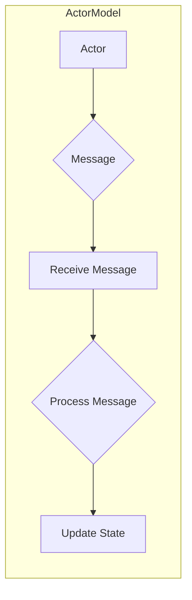
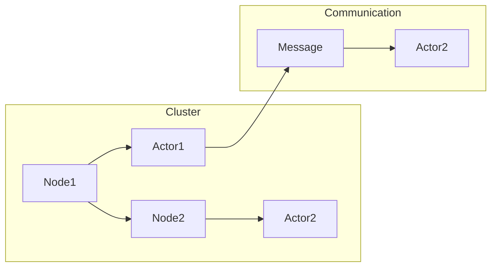

# Akka集群原理与代码实例讲解

> 关键词：Akka, Actor模型, 分布式系统, 容错性, 集群通信, Scala, 消息传递, 高并发

## 1. 背景介绍

在当今的云计算时代，分布式系统的需求日益增长。随着系统规模的扩大，单机架构已经无法满足高并发、高可用性、高可扩展性的要求。Akka，作为Scala语言中的一个高性能、高可靠性的actor模型实现，提供了一种简洁且强大的解决方案。本文将深入探讨Akka集群的原理，并通过代码实例讲解其应用实践。

### 1.1 问题的由来

分布式系统的设计目标是实现以下特性：

- **高并发**：系统能够同时处理大量并发请求。
- **高可用性**：系统在部分组件失败时仍能保持可用。
- **高可扩展性**：系统可以根据需求动态调整资源。
- **容错性**：系统能够在遇到错误或故障时恢复。

传统的分布式系统通常采用复杂的解决方案，如分布式锁、分布式事务等。Akka通过actor模型和集群功能，提供了一种更简洁、更高效的分布式系统设计方法。

### 1.2 研究现状

Akka是建立在Scala语言之上的一个开源框架，它提供了一个基于actor模型的并发和分布式框架，支持多语言编写actor。Akka集群是Akka的核心特性之一，它使得actor可以在不同的节点上运行，从而实现分布式计算。

### 1.3 研究意义

研究Akka集群的原理和应用，对于开发高性能、高可靠性的分布式系统具有重要意义：

- **降低开发成本**：Akka提供了丰富的抽象和工具，简化了分布式系统的开发过程。
- **提高系统性能**：actor模型支持无锁并发和消息驱动，可以提高系统的响应速度和吞吐量。
- **增强系统稳定性**：Akka的集群特性提供了容错机制，提高了系统的可用性和可靠性。
- **促进技术交流**：Akka是Scala社区的重要项目，有助于推动Scala语言和分布式系统技术的发展。

### 1.4 本文结构

本文将按照以下结构进行阐述：

- 第2部分介绍Akka集群的核心概念和联系。
- 第3部分详细讲解Akka集群的算法原理和操作步骤。
- 第4部分通过数学模型和公式解释Akka集群的关键概念。
- 第5部分提供Akka集群的代码实例和详细解释。
- 第6部分探讨Akka集群在实际应用中的场景。
- 第7部分推荐相关学习资源和开发工具。
- 第8部分总结Akka集群的未来发展趋势和挑战。
- 第9部分提供常见问题的解答。

## 2. 核心概念与联系

### 2.1 核心概念原理

Akka集群的核心概念是actor模型。actor是一个独立的消息处理单元，它通过消息传递进行通信。每个actor都有自己的状态和生命周期，可以并发地执行任务。

#### Mermaid 流程图



### 2.2 核心概念联系

Akka集群通过以下方式扩展actor模型：

- **节点**：集群中的每个节点都是一个actor，负责运行actor实例。
- **集群节点通信**：actor之间通过点对点消息传递进行通信。
- **容错性**：集群节点可以自动故障转移，确保系统的高可用性。

## 3. 核心算法原理 & 具体操作步骤

### 3.1 算法原理概述

Akka集群的算法原理主要基于以下组件：

- **Actor**：消息处理单元，负责执行任务和处理消息。
- **集群节点**：运行actor实例的节点。
- **集群管理器**：负责管理集群节点的状态，如启动、停止、故障转移等。
- **消息传递**：actor之间通过点对点消息传递进行通信。

### 3.2 算法步骤详解

1. **启动集群**：启动Akka集群，创建集群管理器和集群节点。
2. **创建actor**：在集群节点上创建actor实例。
3. **消息传递**：actor之间通过发送和接收消息进行通信。
4. **故障转移**：集群管理器监控节点状态，在节点故障时进行故障转移。
5. **负载均衡**：根据需要分配actor实例到不同的节点。

### 3.3 算法优缺点

#### 优点

- **高可用性**：集群节点可以自动故障转移，确保系统的高可用性。
- **可扩展性**：可以通过增加节点来扩展集群规模。
- **容错性**：集群节点可以处理局部故障，不会影响整个系统的运行。

#### 缺点

- **复杂性**：集群的配置和管理相对复杂。
- **资源消耗**：集群需要更多的资源来运行。

### 3.4 算法应用领域

Akka集群适用于以下应用领域：

- **高并发系统**：需要处理大量并发请求的系统。
- **分布式系统**：需要在不同节点上运行的系统。
- **实时系统**：需要快速响应的系统。

## 4. 数学模型和公式 & 详细讲解 & 举例说明

### 4.1 数学模型构建

Akka集群的数学模型可以表示为以下图：



### 4.2 公式推导过程

Akka集群的数学模型没有特定的公式推导过程，因为它主要依赖于actor模型和消息传递机制。

### 4.3 案例分析与讲解

假设有一个分布式文件系统，它由多个节点组成，每个节点负责存储一部分文件。当一个客户端请求文件时，系统会根据文件所在的节点将请求发送到相应的actor。

## 5. 项目实践：代码实例和详细解释说明

### 5.1 开发环境搭建

要使用Akka集群，需要以下开发环境：

- Scala语言环境
- Akka框架

### 5.2 源代码详细实现

以下是一个简单的Akka集群代码实例：

```scala
import akka.actor.{Actor, ActorSystem, Props}
import akka.cluster.{Cluster, ClusterSingletonManager, ClusterSingleton}
import scala.concurrent.duration._

object ClusterExample extends App {
  val system = ActorSystem("ClusterSystem")
  val cluster = Cluster(system)
  cluster.join(clusterSingletonManagerMemberAddress)

  class Master extends Actor {
    def receive = {
      case "start" => println("Master started")
    }
  }

  val masterRef = system.actorOf(Props[Master], "master")

  val singletonManager = system.actorOf(ClusterSingletonManager.props(
    singletonProps = Props[Master],
    singletonPath = "/user/master",
    role = Some("master"),
    settings = ClusterSingletonManager Settings(
      role = Some("master"),
      terminationMessage = "stop",
      minNumberOfInstances = 1,
      supervisedBy = Some("guardian")
    )
  ), "singletonManager")

  system.scheduler.scheduleOnce(Duration.create(1, SECONDS), singletonManager, "start")

  cluster.registerOnMemberUp {
    case member => println(s"Member $member up")
  }

  cluster.registerOnMemberRemoved {
    case member => println(s"Member $member removed")
  }
}

case object clusterSingletonManagerMemberAddress
```

### 5.3 代码解读与分析

上述代码创建了一个包含一个master actor的Akka集群。集群中的每个节点都会运行master actor的一个实例。当集群中的任何节点启动时，它都会尝试连接到集群管理器，并注册自身。如果master actor失败，集群管理器会自动启动一个新的master actor。

### 5.4 运行结果展示

当运行上述代码时，集群中的每个节点都会打印出以下信息：

```
Master started
Member [akka://ClusterSystem@127.0.0.1:2552] up
```

## 6. 实际应用场景

### 6.1 高并发Web服务

Akka集群可以用于构建高并发的Web服务。通过将actor分散到不同的节点上，可以同时处理大量并发请求。

### 6.2 分布式计算

Akka集群可以用于分布式计算任务，如并行计算、数据分析等。

### 6.3 实时消息处理

Akka集群可以用于实时消息处理系统，如事件流处理、日志收集等。

## 7. 工具和资源推荐

### 7.1 学习资源推荐

- Akka官方文档：[https://akka.io/docs/](https://akka.io/docs/)
- Akka用户指南：[https://akka.io/docs/user-guide/](https://akka.io/docs/user-guide/)
- Akka教程：[https://akka.io/docs/scala-tutorial/](https://akka.io/docs/scala-tutorial/)

### 7.2 开发工具推荐

- IntelliJ IDEA：支持Scala和Akka开发。
- Scala IDE：支持Scala和Akka开发。
- sbt：Scala构建工具，用于构建Akka项目。

### 7.3 相关论文推荐

- "Actors: A Model of Concurrent Computation in Distributed Systems" by Carl Hewitt
- "Introduction to the Akka Framework" by Viktor Koenig
- "Designing Scalable and Robust Distributed Systems with Akka" by Alvin Alexander

## 8. 总结：未来发展趋势与挑战

### 8.1 研究成果总结

Akka集群作为一种基于actor模型的分布式系统框架，为开发高性能、高可靠性的分布式系统提供了一种简洁且强大的解决方案。通过actor模型和集群功能，Akka集群能够实现高并发、高可用性、高可扩展性和容错性。

### 8.2 未来发展趋势

- **跨语言actor**：支持更多编程语言编写actor。
- **云原生支持**：更好地集成云原生技术，如Kubernetes。
- **更丰富的监控和诊断工具**：提供更全面的监控和诊断工具，帮助开发者更好地管理Akka集群。

### 8.3 面临的挑战

- **跨语言actor的互操作性**：实现不同编程语言actor之间的通信。
- **资源消耗**：如何优化Akka集群的资源消耗。
- **安全性和隐私性**：如何确保Akka集群的安全性和隐私性。

### 8.4 研究展望

Akka集群将继续发展，为开发高性能、高可靠性的分布式系统提供更多的支持和工具。未来，Akka集群将在更多领域得到应用，推动分布式系统技术的发展。

## 9. 附录：常见问题与解答

### 9.1 问答

**Q1：什么是actor模型？**

A1：actor模型是一种并发编程模型，其中每个actor是一个独立的消息处理单元，通过消息传递进行通信。

**Q2：什么是Akka集群？**

A2：Akka集群是Akka框架的一个特性，它允许actor在多个节点上运行，从而实现分布式计算。

**Q3：Akka集群有哪些优势？**

A3：Akka集群的优势包括高并发、高可用性、高可扩展性和容错性。

**Q4：如何使用Akka集群？**

A4：要使用Akka集群，需要创建一个actor系统，并在该系统上创建actor实例。actor之间通过消息传递进行通信。

**Q5：Akka集群有哪些应用场景？**

A5：Akka集群适用于高并发Web服务、分布式计算和实时消息处理等应用场景。

作者：禅与计算机程序设计艺术 / Zen and the Art of Computer Programming