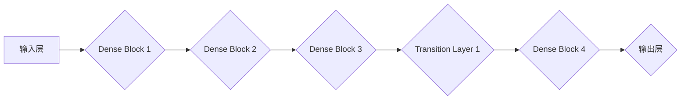

# DenseNet原理与代码实例讲解

> 关键词：深度学习，DenseNet，残差连接，特征复用，网络设计，图像识别，卷积神经网络，PyTorch

## 1. 背景介绍

随着深度学习技术的快速发展，卷积神经网络（CNN）在图像识别、物体检测等领域取得了显著的成果。然而，传统的CNN架构在深度增加时，往往面临着梯度消失或梯度爆炸的问题，难以进一步扩大网络深度。为了解决这一问题，DenseNet（Densely Connected Convolutional Networks）应运而生。DenseNet通过引入密集连接的思想，实现了特征的重用和信息的有效传播，使得网络能够更高效地学习到更深层的特征表示。本文将详细介绍DenseNet的原理、算法步骤、数学模型以及代码实现，并探讨其在实际应用场景中的表现和未来发展趋势。

## 2. 核心概念与联系

### 2.1 DenseNet的概念

DenseNet的核心思想是网络中的每个层都直接连接到前面的所有层，而不是像传统网络那样逐层连接。这种密集连接使得每个节点都能直接从前面的所有层接收输入，从而实现了特征的重用和信息的高效传播。

### 2.2 DenseNet的架构

DenseNet的架构主要由以下几个部分组成：

1. **输入层**：输入原始图像数据。
2. **多个Dense Block**：每个Dense Block包含多个密集连接的层，每个层都接收前面所有层的输出作为输入。
3. **Transition Layer**：用于连接相邻的Dense Block，可以选择性地减少通道数或特征图大小，降低计算复杂度。
4. **输出层**：通常是一个全连接层，用于输出最终分类结果。

### 2.3 Mermaid流程图



## 3. 核心算法原理 & 具体操作步骤

### 3.1 算法原理概述

DenseNet通过以下原理解决了传统CNN的梯度消失和梯度爆炸问题：

1. **特征复用**：每个Dense Block的层都直接连接到前面的所有层，使得每个节点都能从前面的层获取有用的特征信息，从而缓解了梯度消失和梯度爆炸问题。
2. **信息传播**：由于信息传播路径增加，DenseNet能够更有效地传播梯度，使得网络能够学习到更深层的特征表示。
3. **减少参数数量**：DenseNet通过复用特征，减少了模型参数的数量，降低了过拟合的风险。

### 3.2 算法步骤详解

1. **输入层**：将原始图像数据输入到网络中。
2. **Dense Block**：每个Dense Block包含多个密集连接的层，每个层都接收前面所有层的输出作为输入。
3. **Transition Layer**：在Dense Block之间插入Transition Layer，可以选择性地减少通道数或特征图大小，降低计算复杂度。
4. **输出层**：将最后一个Dense Block的输出输入到全连接层，输出最终分类结果。

### 3.3 算法优缺点

**优点**：

- 能够有效缓解梯度消失和梯度爆炸问题。
- 参数数量少，降低了过拟合的风险。
- 信息传播路径增加，能够学习到更深层的特征表示。

**缺点**：

- 计算复杂度较高。
- 对于深度较大的网络，性能提升有限。

### 3.4 算法应用领域

DenseNet在图像识别、物体检测、语义分割等领域都有广泛的应用，特别是在数据量较小的场景下，DenseNet能够取得更好的性能。

## 4. 数学模型和公式 & 详细讲解 & 举例说明

### 4.1 数学模型构建

DenseNet的数学模型可以通过以下公式表示：

$$
\mathbf{h}^{(l)} = f(\mathbf{h}^{(l-1)} + \mathbf{F}(\mathbf{h}^{(l-1)}))
$$

其中，$\mathbf{h}^{(l)}$ 表示第 $l$ 层的输出，$\mathbf{h}^{(l-1)}$ 表示第 $l-1$ 层的输出，$\mathbf{F}(\cdot)$ 表示第 $l$ 层的卷积操作。

### 4.2 公式推导过程

DenseNet的公式推导过程如下：

1. 将第 $l-1$ 层的输出 $\mathbf{h}^{(l-1)}$ 输入到第 $l$ 层的每个节点。
2. 对每个节点执行卷积操作 $\mathbf{F}(\cdot)$。
3. 将所有节点的输出相加，得到第 $l$ 层的输出 $\mathbf{h}^{(l)}$。

### 4.3 案例分析与讲解

以DenseNet-121为例，其结构如下：

- 输入层：使用3x3的卷积核，输出32个通道。
- Dense Block 1：包含6个重复的层，每个层使用3x3的卷积核，输出64个通道。
- Transition Layer 1：使用1x1的卷积核，减少通道数为128。
- Dense Block 2：包含12个重复的层，每个层使用3x3的卷积核，输出128个通道。
- Transition Layer 2：使用1x1的卷积核，减少通道数为256。
- Dense Block 3：包含24个重复的层，每个层使用3x3的卷积核，输出256个通道。
- 输出层：使用全局平均池化和softmax操作，输出1000个通道。

## 5. 项目实践：代码实例和详细解释说明

### 5.1 开发环境搭建

1. 安装PyTorch库：
```bash
pip install torch torchvision
```

2. 安装DenseNet库：
```bash
pip install densenet
```

### 5.2 源代码详细实现

以下是一个使用DenseNet-121进行图像分类的示例代码：

```python
import torch
import torch.nn as nn
from densenet import DenseNet121

# 加载预训练的DenseNet-121模型
model = DenseNet121(pretrained=True)

# 损失函数和优化器
criterion = nn.CrossEntropyLoss()
optimizer = torch.optim.Adam(model.parameters(), lr=0.001)

# 训练模型
def train(model, train_loader, criterion, optimizer, epochs):
    model.train()
    for epoch in range(epochs):
        running_loss = 0.0
        for inputs, labels in train_loader:
            optimizer.zero_grad()
            outputs = model(inputs)
            loss = criterion(outputs, labels)
            loss.backward()
            optimizer.step()
            running_loss += loss.item()
        print(f"Epoch {epoch+1}, Loss: {running_loss/len(train_loader)}")

# 评估模型
def evaluate(model, test_loader):
    model.eval()
    correct = 0
    total = 0
    with torch.no_grad():
        for inputs, labels in test_loader:
            outputs = model(inputs)
            _, predicted = torch.max(outputs.data, 1)
            total += labels.size(0)
            correct += (predicted == labels).sum().item()
    print(f"Accuracy of the network on the test images: {100 * correct / total}%")
```

### 5.3 代码解读与分析

1. **模型加载**：使用`DenseNet121(pretrained=True)`加载预训练的DenseNet-121模型。
2. **损失函数和优化器**：使用`nn.CrossEntropyLoss()`定义交叉熵损失函数，使用`torch.optim.Adam()`定义Adam优化器。
3. **训练函数**：`train`函数用于训练模型，包括前向传播、反向传播和参数更新。
4. **评估函数**：`evaluate`函数用于评估模型的准确率。

### 5.4 运行结果展示

假设我们已经准备好了训练集和测试集，运行以下代码即可训练和评估模型：

```python
train(model, train_loader, criterion, optimizer, epochs=10)
evaluate(model, test_loader)
```

## 6. 实际应用场景

DenseNet在以下实际应用场景中表现出色：

- 图像分类：DenseNet在ImageNet等图像分类竞赛中取得了优异的成绩。
- 物体检测：DenseNet可以与其他物体检测方法（如Faster R-CNN、SSD等）结合，提高检测精度。
- 语义分割：DenseNet在Cityscapes等语义分割数据集上取得了较好的效果。
- 图像生成：DenseNet可以用于生成新的图像，如风格迁移、图像超分辨率等。

## 7. 工具和资源推荐

### 7.1 学习资源推荐

1. 《深度学习》系列书籍：介绍深度学习的基本概念、算法和技术。
2. PyTorch官方文档：提供PyTorch库的详细文档和示例代码。
3. Densenet库GitHub页面：提供DenseNet库的源代码和示例。

### 7.2 开发工具推荐

1. PyTorch：开源的深度学习框架，支持多种深度学习算法。
2. Jupyter Notebook：支持交互式编程的Web应用程序，便于实验和调试。

### 7.3 相关论文推荐

1. "Densely Connected Convolutional Networks"：介绍了DenseNet的原理和架构。
2. "Bottleneck Networks"：提出了Bottleneck结构，对DenseNet的设计产生了重要影响。

## 8. 总结：未来发展趋势与挑战

### 8.1 研究成果总结

DenseNet通过密集连接的思想，有效地解决了传统CNN的梯度消失和梯度爆炸问题，在图像分类、物体检测、语义分割等领域取得了显著的成绩。DenseNet的成功也启示了深度学习网络设计的新思路，即通过网络结构的创新来提高模型的性能。

### 8.2 未来发展趋势

1. DenseNet与其他网络结构的结合：将DenseNet与其他网络结构（如ResNet、SENet等）结合，探索更有效的网络设计。
2. DenseNet在更多领域的应用：将DenseNet应用于更多领域，如自然语言处理、语音识别等。
3. DenseNet的轻量化设计：设计更轻量级的DenseNet，以适应移动设备和边缘计算场景。

### 8.3 面临的挑战

1. 模型复杂度：随着网络深度的增加，DenseNet的计算复杂度也会增加，需要寻找更高效的计算方法。
2. 模型可解释性：DenseNet的内部结构较为复杂，如何解释模型的决策过程仍然是一个挑战。
3. 模型泛化能力：如何提高DenseNet在不同数据集和场景下的泛化能力，是一个需要解决的问题。

### 8.4 研究展望

DenseNet作为一种高效的网络结构，将在未来深度学习领域发挥重要作用。通过不断探索和创新，DenseNet有望在更多领域取得突破性的成果。

## 9. 附录：常见问题与解答

**Q1：DenseNet与传统CNN相比有什么优势？**

A: DenseNet相比传统CNN的主要优势在于：
- 有效缓解梯度消失和梯度爆炸问题。
- 参数数量少，降低了过拟合的风险。
- 信息传播路径增加，能够学习到更深层的特征表示。

**Q2：DenseNet是否可以应用于其他领域？**

A: DenseNet可以应用于图像识别、物体检测、语义分割、自然语言处理、语音识别等众多领域。

**Q3：如何优化DenseNet的性能？**

A: 优化DenseNet性能的方法包括：
- 尝试不同的网络结构和参数设置。
- 使用数据增强技术。
- 使用迁移学习。
- 使用更高效的优化器。

**Q4：DenseNet的缺点是什么？**

A: DenseNet的缺点包括：
- 计算复杂度较高。
- 难以解释模型的决策过程。
- 模型泛化能力有限。

作者：禅与计算机程序设计艺术 / Zen and the Art of Computer Programming