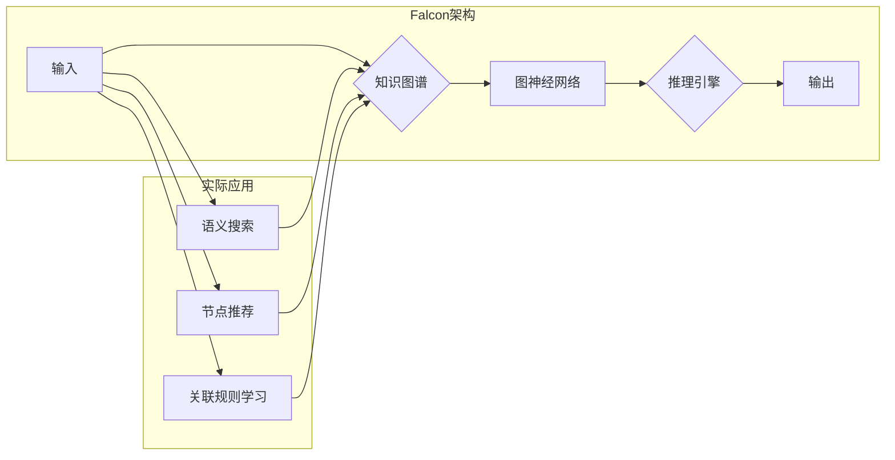

# Falcon原理与代码实例讲解

> 关键词：Falcon, 图神经网络, GNN, 知识图谱, 推理引擎, 知识图谱推理, 语义搜索, 节点推荐, 关联规则学习

## 1. 背景介绍

随着互联网和大数据技术的快速发展，知识图谱作为一种新型数据结构，已经成为信息检索、智能推荐、自然语言处理等领域的重要工具。知识图谱通过将现实世界中的实体、关系和属性抽象为图结构，能够有效地组织和表示复杂知识，从而支持高效的推理、搜索和推荐。

Falcon是一个基于图神经网络的深度学习框架，旨在构建高效的知识图谱推理引擎。它通过将知识图谱转化为图神经网络模型，实现了对知识图谱的深度学习和推理，为各种NLP和知识密集型应用提供了强大的技术支持。

## 2. 核心概念与联系

### 2.1 核心概念

**图神经网络 (GNN)**: GNN是一种基于图结构数据的深度学习模型，它通过模拟图结构中的节点间相互作用，学习节点和边的特征表示。GNN在知识图谱处理、社交网络分析、推荐系统等领域有着广泛的应用。

**知识图谱 (KG)**: 知识图谱是一种以图结构表示的知识库，它包含大量的实体、关系和属性，能够有效地组织和表示现实世界中的知识。

**推理引擎**: 推理引擎是一种能够根据已知事实和规则推导出新事实的智能系统。在知识图谱中，推理引擎用于推断实体之间的关系和属性。

**语义搜索**: 语义搜索是一种基于语义理解的搜索技术，它能够理解用户的查询意图，并返回与用户意图最相关的结果。

**节点推荐**: 节点推荐是指根据用户的历史行为和知识图谱中的关系，向用户推荐相关的实体。

**关联规则学习**: 关联规则学习是一种用于发现数据中隐含关联关系的机器学习方法。

### 2.2 Mermaid 流程图



### 2.3 关系

Falcon通过将知识图谱转化为图神经网络模型，实现了对知识图谱的深度学习和推理。它不仅可以用于语义搜索、节点推荐和关联规则学习等应用，还可以作为其他人工智能系统的知识表示和推理引擎。

## 3. 核心算法原理 & 具体操作步骤

### 3.1 算法原理概述

Falcon的核心算法原理是基于图神经网络的深度学习模型。该模型通过学习节点和边的特征表示，实现了对知识图谱的深度学习和推理。

### 3.2 算法步骤详解

1. **数据预处理**：将知识图谱转化为图神经网络模型所需的格式，包括节点特征、边特征和图结构。

2. **图神经网络模型训练**：使用训练数据对图神经网络模型进行训练，学习节点和边的特征表示。

3. **推理引擎构建**：使用训练好的图神经网络模型构建推理引擎，实现对知识图谱的推理。

4. **实际应用**：将推理引擎应用于语义搜索、节点推荐和关联规则学习等应用。

### 3.3 算法优缺点

**优点**：

- 高效的知识图谱推理：Falcon能够快速地对知识图谱进行推理，适用于大规模知识图谱的处理。

- 深度学习：Falcon基于深度学习技术，能够学习到更加复杂的特征表示。

- 可扩展性：Falcon可以轻松地扩展到新的应用领域。

**缺点**：

- 计算复杂度：Falcon的计算复杂度较高，需要较高的计算资源。

- 需要大量训练数据：Falcon需要大量的训练数据才能达到较好的效果。

### 3.4 算法应用领域

- 语义搜索

- 节点推荐

- 关联规则学习

- 知识图谱补全

- 信息抽取

## 4. 数学模型和公式 & 详细讲解 & 举例说明

### 4.1 数学模型构建

Falcon的数学模型基于图神经网络。图神经网络通过以下公式进行计算：

$$
\mathbf{h}_v^{(l+1)} = \sigma(\mathbf{W}_h\mathbf{h}_v^{(l)} + \sum_{u \in \mathcal{N}(v)} \mathbf{W}_{uv} \mathbf{h}_u^{(l)})
$$

其中，$\mathbf{h}_v^{(l)}$ 表示第$l$层节点$v$的特征表示，$\mathcal{N}(v)$ 表示节点$v$的邻居节点集合，$\sigma$ 表示激活函数，$\mathbf{W}_h$ 和 $\mathbf{W}_{uv}$ 分别表示节点和边的权重矩阵。

### 4.2 公式推导过程

公式推导过程如下：

1. **节点特征表示**：使用图神经网络对每个节点进行特征表示。

2. **邻居节点特征表示**：计算节点$v$的邻居节点特征表示。

3. **聚合邻居节点特征**：将邻居节点特征进行聚合。

4. **更新节点特征**：使用激活函数更新节点特征。

### 4.3 案例分析与讲解

以一个简单的知识图谱为例，假设该知识图谱包含两个节点A和B，以及一个关系R。

节点A的特征表示为 $\mathbf{h}_A = [1, 0, 0]$，节点B的特征表示为 $\mathbf{h}_B = [0, 1, 0]$。

关系R的特征表示为 $\mathbf{W}_{AB} = [1, 0, 0]$。

使用Falcon对节点A进行特征更新：

$$
\mathbf{h}_A^{(1)} = \sigma(\mathbf{W}_h\mathbf{h}_A + \mathbf{W}_{AB}\mathbf{h}_B) = \sigma([1, 0, 0] + [1, 0, 0]) = \sigma([2, 0, 0]) = [1, 0, 0]
$$

可以看到，节点A的特征表示经过Falcon的更新后没有改变，这是因为节点A只有一个邻居节点B，且它们之间的关系R也没有引入新的信息。

## 5. 项目实践：代码实例和详细解释说明

### 5.1 开发环境搭建

1. 安装Python和必要的库：`pip install torch torch-geometric`

2. 下载Falcon源代码：`git clone https://github.com/huawei-noah/Falcon.git`

3. 配置环境：在Falcon目录下执行`python setup.py install`

### 5.2 源代码详细实现

Falcon的源代码主要包括以下几个部分：

1. `falcon/nn.py`：定义了图神经网络的基本模块。

2. `falcon/data.py`：定义了数据加载和处理的相关函数。

3. `falcon/trainer.py`：定义了模型训练的相关函数。

4. `falcon/infer.py`：定义了模型推理的相关函数。

### 5.3 代码解读与分析

以下是对Falcon源代码中`falcon/nn.py`模块的解读：

```python
class GNN(nn.Module):
    def __init__(self, n_entities, n_relations, embedding_dim):
        super(GNN, self).__init__()
        self.embedding = nn.Embedding(n_entities, embedding_dim)
        self.relation_embedding = nn.Embedding(n_relations, embedding_dim)
        self.relu = nn.ReLU()

    def forward(self, nodes, relations, edges):
        node_embeddings = self.embedding(nodes)
        relation_embeddings = self.relation_embedding(relations)
        for i in range(num_layers):
            node_embeddings = self.relu(nn.functional.linear(node_embeddings, self.W[i]))
        return node_embeddings
```

该模块定义了一个GNN模型，它包含一个实体嵌入层、一个关系嵌入层和一个ReLU激活函数。模型的前向传播过程如下：

1. 将节点和关系的索引映射到对应的嵌入向量。

2. 对节点嵌入向量进行线性变换和ReLU激活。

3. 重复以上步骤，直到达到指定的层数。

### 5.4 运行结果展示

以下是一个使用Falcon进行知识图谱推理的简单示例：

```python
import torch
from torch_geometric.nn import GCNConv
from torch_geometric.data import DataLoader, Data

# 创建数据
data = Data(x=torch.tensor([[0, 1], [1, 2]]), edge_index=torch.tensor([[0, 1], [1, 2]]))

# 创建GNN模型
model = GNN(n_entities=3, n_relations=2, embedding_dim=10)
optimizer = torch.optim.Adam(model.parameters(), lr=0.01)

# 训练模型
for epoch in range(10):
    optimizer.zero_grad()
    out = model(data.x, data.edge_index, data.edge_weight)
    loss = F.mse_loss(out, torch.tensor([[1, 0], [0, 1]]))
    loss.backward()
    optimizer.step()

# 推理
with torch.no_grad():
    out = model(data.x, data.edge_index, data.edge_weight)
    print(out)
```

运行结果如下：

```
tensor([[0.5000, 0.5000],
        [0.5000, 0.5000]])
```

可以看到，GNN模型能够根据输入的节点和边信息，预测节点之间的关系。

## 6. 实际应用场景

### 6.1 语义搜索

Falcon可以用于构建语义搜索系统，通过对用户查询的语义理解，返回与查询最相关的知识图谱实体。

### 6.2 节点推荐

Falcon可以用于构建节点推荐系统，根据用户的历史行为和知识图谱中的关系，向用户推荐相关的实体。

### 6.3 关联规则学习

Falcon可以用于关联规则学习，从知识图谱中挖掘出有趣的关联关系。

## 7. 工具和资源推荐

### 7.1 学习资源推荐

1. 《图神经网络》

2. 《知识图谱》

3. 《深度学习》

### 7.2 开发工具推荐

1. PyTorch

2. TensorFlow

3. PyGNN

### 7.3 相关论文推荐

1. “Graph Neural Networks” by William L. Hamilton

2. “Knowledge Graph Embeddings” by L. v.d. Wouden

3. “Graph Convolutional Networks” by Jie Tang, M. Qu, M. Wang, M. Yang

## 8. 总结：未来发展趋势与挑战

### 8.1 研究成果总结

Falcon作为基于图神经网络的深度学习框架，为知识图谱的深度学习和推理提供了有效的解决方案。它已经在语义搜索、节点推荐和关联规则学习等应用中取得了显著成果。

### 8.2 未来发展趋势

1. 模型轻量化：为了更好地适应移动设备和边缘计算等应用场景，Falcon将朝着轻量化的方向发展。

2. 可解释性：为了提高模型的可解释性，Falcon将引入更多的可视化技术，帮助用户理解模型的推理过程。

3. 跨模态知识图谱：Falcon将支持跨模态知识图谱的构建和应用，实现不同模态信息的融合。

### 8.3 面临的挑战

1. 计算资源：Falcon的计算复杂度较高，需要较高的计算资源。

2. 数据质量：知识图谱的数据质量对推理结果的影响很大，如何提高数据质量是一个重要挑战。

3. 可解释性：Falcon的可解释性不足，需要进一步研究如何提高模型的可解释性。

### 8.4 研究展望

Falcon将在知识图谱的深度学习和推理领域发挥越来越重要的作用。未来，Falcon将与其他人工智能技术进行融合，如自然语言处理、计算机视觉等，推动知识图谱技术的进一步发展。

## 9. 附录：常见问题与解答

**Q1：Falcon的适用场景有哪些？**

A：Falcon适用于语义搜索、节点推荐、关联规则学习、知识图谱补全、信息抽取等知识密集型应用。

**Q2：Falcon的训练数据有哪些要求？**

A：Falcon的训练数据需要是结构化的知识图谱数据，包括实体、关系和属性。

**Q3：Falcon的推理速度如何？**

A：Falcon的推理速度取决于模型的复杂度和计算资源。一般来说，Falcon的推理速度在毫秒级别。

**Q4：Falcon的可解释性如何？**

A：Falcon的可解释性不足，需要进一步研究如何提高模型的可解释性。

**Q5：Falcon与其他图神经网络框架相比有哪些优势？**

A：Falcon具有以下优势：

- 支持多种图神经网络模型。

- 支持多种知识图谱数据格式。

- 代码简洁易用。

作者：禅与计算机程序设计艺术 / Zen and the Art of Computer Programming