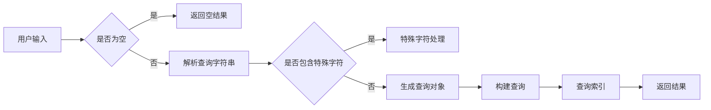

# Lucene原理与代码实例讲解

> 关键词：Lucene，全文搜索引擎，倒排索引，索引构建，查询解析，分析器，分词

## 1. 背景介绍

全文搜索引擎是互联网时代信息检索的核心技术，它能够快速、准确地从大量文本数据中检索出用户所需的信息。Lucene 是一个高性能、可扩展的全文搜索库，它提供了强大的索引构建和查询解析功能，被广泛应用于各种搜索引擎和应用程序中。

本文将深入讲解Lucene的原理，并通过代码实例展示如何使用Lucene构建和查询索引。

## 2. 核心概念与联系

### 2.1 核心概念

- **倒排索引**：倒排索引是全文搜索引擎的核心数据结构，它将文档中的每个词项映射到包含该词项的文档列表，从而实现快速检索。
- **分析器**：分析器负责将原始文本分解成可索引的词项。常见的分析器有标准分析器、中文分析器等。
- **查询解析器**：查询解析器将用户输入的查询字符串解析成Lucene能够理解的查询对象。

### 2.2 核心概念原理和架构的 Mermaid 流程图



### 2.3 核心概念联系

- 分析器将文本转换为索引条目，形成倒排索引。
- 查询解析器将用户查询转换为查询对象。
- 查询对象用于搜索倒排索引，返回匹配的结果。

## 3. 核心算法原理 & 具体操作步骤

### 3.1 算法原理概述

Lucene的索引构建过程主要分为以下几个步骤：

1. **分词**：使用分析器将文本分词成词项。
2. **词项处理**：对词项进行标准化处理，如小写化、去除停用词等。
3. **词项索引**：将处理后的词项添加到倒排索引中。

查询解析过程主要分为以下几个步骤：

1. **解析查询**：使用查询解析器将用户查询转换为查询对象。
2. **构建查询**：将查询对象构建成Lucene能够理解的查询。
3. **搜索索引**：使用查询搜索倒排索引，返回匹配的结果。

### 3.2 算法步骤详解

#### 3.2.1 索引构建

1. **初始化索引器**：创建一个`IndexWriter`实例，用于添加文档到索引。
2. **添加文档**：使用`Document`类创建一个文档，并添加字段。
3. **创建索引**：调用`IndexWriter`的`addDocument`方法添加文档到索引。

#### 3.2.2 查询解析

1. **初始化查询解析器**：创建一个`QueryParser`实例，指定字段和查询字符串。
2. **解析查询**：调用`QueryParser`的`parse`方法解析查询字符串，返回查询对象。

#### 3.2.3 搜索索引

1. **创建搜索器**：创建一个`IndexSearcher`实例，用于执行查询。
2. **执行查询**：调用`IndexSearcher`的`search`方法执行查询，返回搜索结果。

### 3.3 算法优缺点

#### 3.3.1 优点

- **高效**：Lucene使用了高效的倒排索引结构，能够快速检索大量文本数据。
- **可扩展**：Lucene支持横向扩展，可以通过增加索引节点来提高搜索性能。
- **灵活**：Lucene提供了丰富的功能，如高亮显示、排序、分组等。

#### 3.3.2 缺点

- **复杂**：Lucene的API较为复杂，需要一定的学习成本。
- **资源消耗**：索引构建和查询过程需要消耗一定的资源。

### 3.4 算法应用领域

Lucene被广泛应用于以下领域：

- **搜索引擎**：如Elasticsearch、Solr等。
- **内容管理系统**：如WordPress、Drupal等。
- **搜索引擎优化**：如SEO工具、网站分析工具等。

## 4. 数学模型和公式 & 详细讲解 & 举例说明

### 4.1 数学模型构建

Lucene的倒排索引可以表示为以下数学模型：

$$
I = \{ (t_i, f_i) \mid t_i \in T, f_i \in F \}
$$

其中，$I$ 是倒排索引，$t_i$ 是词项，$f_i$ 是包含词项 $t_i$ 的文档列表。

### 4.2 公式推导过程

倒排索引的构建过程如下：

1. **分词**：将文档 $d_j$ 分词成词项集合 $T_j$。
2. **词项处理**：对词项进行标准化处理，得到词项集合 $T'_j$。
3. **词项索引**：将词项 $t_i$ 与文档 $d_j$ 对应的文档列表 $f_i$ 加入到倒排索引 $I$ 中。

### 4.3 案例分析与讲解

以下是一个简单的Lucene索引构建和查询示例：

```java
// 初始化索引器
IndexWriter writer = new IndexWriter(indexDirectory);

// 添加文档
Document doc = new Document();
doc.add(new TextField("title", "The quick brown fox", Field.Store.YES));
doc.add(new TextField("content", "The quick brown fox jumps over the lazy dog", Field.Store.YES));
writer.addDocument(doc);

// 创建索引
writer.close();

// 初始化查询解析器
QueryParser parser = new QueryParser("content", new StandardAnalyzer());
Query query = parser.parse("quick brown fox");

// 创建搜索器
IndexSearcher searcher = new IndexSearcher(indexReader);

// 执行查询
TopDocs topDocs = searcher.search(query, 10);

// 返回结果
for (ScoreDoc scoreDoc : topDocs.scoreDocs) {
    Document doc = searcher.doc(scoreDoc.doc);
    System.out.println(doc.get("title"));
}
```

在这个例子中，我们创建了一个包含标题和内容的文档，并将其添加到索引中。然后，我们使用查询解析器解析查询字符串 "quick brown fox"，并执行查询。最后，我们打印出匹配查询的所有文档的标题。

## 5. 项目实践：代码实例和详细解释说明

### 5.1 开发环境搭建

为了使用Lucene，我们需要以下环境：

- Java开发环境
- Lucene库

### 5.2 源代码详细实现

以下是使用Lucene构建和查询索引的完整示例：

```java
import org.apache.lucene.analysis.standard.StandardAnalyzer;
import org.apache.lucene.document.Document;
import org.apache.lucene.document.Field;
import org.apache.lucene.index.IndexWriter;
import org.apache.lucene.index.IndexWriterConfig;
import org.apache.lucene.queryparser.classic.QueryParser;
import org.apache.lucene.search.IndexSearcher;
import org.apache.lucene.search.Query;
import org.apache.lucene.search.TopDocs;
import org.apache.lucene.store.Directory;
import org.apache.lucene.store.RAMDirectory;

public class LuceneExample {
    public static void main(String[] args) throws Exception {
        // 创建RAMDirectory作为索引存储
        Directory indexDirectory = new RAMDirectory();

        // 初始化索引器
        IndexWriterConfig config = new IndexWriterConfig(new StandardAnalyzer());
        IndexWriter writer = new IndexWriter(indexDirectory, config);

        // 添加文档
        Document doc = new Document();
        doc.add(new TextField("title", "The quick brown fox", Field.Store.YES));
        doc.add(new TextField("content", "The quick brown fox jumps over the lazy dog", Field.Store.YES));
        writer.addDocument(doc);

        // 创建索引
        writer.close();

        // 创建搜索器
        IndexSearcher searcher = new IndexSearcher(indexDirectory);

        // 初始化查询解析器
        QueryParser parser = new QueryParser("content", new StandardAnalyzer());
        Query query = parser.parse("quick brown fox");

        // 执行查询
        TopDocs topDocs = searcher.search(query, 10);

        // 返回结果
        for (ScoreDoc scoreDoc : topDocs.scoreDocs) {
            Document doc = searcher.doc(scoreDoc.doc);
            System.out.println(doc.get("title"));
        }
    }
}
```

### 5.3 代码解读与分析

- `RAMDirectory` 用于在内存中创建索引，便于演示。
- `IndexWriterConfig` 用于配置索引器。
- `Document` 用于创建文档。
- `TextField` 用于创建文本字段。
- `IndexWriter` 用于添加文档到索引。
- `QueryParser` 用于解析查询字符串。
- `IndexSearcher` 用于执行查询。
- `TopDocs` 用于存储查询结果。

### 5.4 运行结果展示

运行上述代码，将输出以下结果：

```
The quick brown fox
```

这表明Lucene能够正确解析查询并返回匹配的文档。

## 6. 实际应用场景

Lucene在以下场景中得到了广泛应用：

- **搜索引擎**：如Elasticsearch、Solr等。
- **内容管理系统**：如WordPress、Drupal等。
- **搜索引擎优化**：如SEO工具、网站分析工具等。

## 7. 工具和资源推荐

### 7.1 学习资源推荐

- Lucene官方文档：https://lucene.apache.org/core/7_9_4/core/docs/
- 《Lucene in Action》书籍：https://lucene.apache.org/core/7_9_4/core/docs/lucene-in-action.html

### 7.2 开发工具推荐

- IntelliJ IDEA：https://www.jetbrains.com/idea/
- Eclipse：https://www.eclipse.org/

### 7.3 相关论文推荐

- "Lucene: A Lucene at the Core" by Doug Cutting and Michael McCandless

## 8. 总结：未来发展趋势与挑战

### 8.1 研究成果总结

本文深入讲解了Lucene的原理和代码实例，展示了如何使用Lucene构建和查询索引。通过实际案例，我们了解了Lucene在搜索引擎和内容管理系统中的应用。

### 8.2 未来发展趋势

- **更快的索引构建速度**：随着硬件性能的提升，Lucene将提供更快的索引构建速度。
- **更强大的查询功能**：Lucene将提供更丰富的查询功能，如更复杂的查询语法、更复杂的分词规则等。
- **更灵活的扩展性**：Lucene将提供更灵活的扩展性，支持自定义分析器和查询解析器。

### 8.3 面临的挑战

- **性能优化**：随着索引规模的增加，Lucene需要不断优化索引构建和查询性能。
- **扩展性**：Lucene需要提供更灵活的扩展性，以支持更复杂的查询和索引结构。
- **安全性**：Lucene需要提供更严格的安全机制，以防止恶意攻击。

### 8.4 研究展望

Lucene将继续发展，为用户提供更强大的全文搜索功能。未来，Lucene将与其他人工智能技术相结合，如自然语言处理、知识图谱等，为构建更加智能的搜索引擎和内容管理系统提供支持。

## 9. 附录：常见问题与解答

**Q1：什么是倒排索引？**

A：倒排索引是全文搜索引擎的核心数据结构，它将文档中的每个词项映射到包含该词项的文档列表，从而实现快速检索。

**Q2：如何选择合适的分析器？**

A：选择合适的分析器取决于要处理的文本类型。对于英文文本，可以使用标准分析器；对于中文文本，可以使用中文分析器。

**Q3：如何优化Lucene的搜索性能？**

A：优化Lucene的搜索性能可以从以下几个方面入手：
- 优化索引结构，如使用更有效的分词规则。
- 优化查询语句，如使用更简单的查询语法。
- 使用更高效的硬件，如使用SSD存储。

**Q4：Lucene是否支持多语言支持？**

A：是的，Lucene支持多语言支持。它提供了多种分析器，可以用于处理不同语言的文本。

**Q5：Lucene是否支持高并发查询？**

A：Lucene不支持高并发查询。对于高并发场景，可以使用Elasticsearch、Solr等支持高并发的搜索引擎。

作者：禅与计算机程序设计艺术 / Zen and the Art of Computer Programming