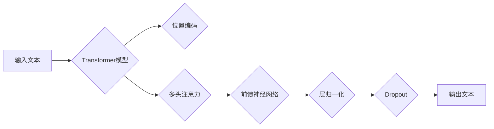

# T5(Text-to-Text Transfer Transformer) - 原理与代码实例讲解

> 关键词：T5, Transformer, Text-to-Text, 预训练, 微调, NLP, 代码实例, 应用场景

## 1. 背景介绍

随着深度学习在自然语言处理（NLP）领域的广泛应用，语言模型作为理解、生成和翻译语言的关键技术，已经取得了显著的进展。在预训练语言模型领域，BERT和GPT等模型因其卓越的性能而广受关注。然而，这些模型在文本到文本（Text-to-Text）的转换任务中，如机器翻译、摘要生成等，存在一定的局限性。

为了解决这一问题，Google AI团队在2019年提出了T5（Text-to-Text Transfer Transformer）模型。T5旨在将Transformer架构的优势扩展到更广泛的文本到文本任务中，通过统一的输入输出格式，简化了模型设计，提高了模型在多种NLP任务上的性能。

## 2. 核心概念与联系

### 2.1 核心概念

#### Transformer
Transformer是一种基于自注意力机制的深度神经网络模型，它使用位置编码和多头注意力机制，能够捕捉序列数据中的长距离依赖关系。

#### Text-to-Text
Text-to-Text任务涉及将一种文本转换为另一种文本，例如机器翻译、摘要生成、问答系统等。

#### 预训练
预训练是指在大规模无标签数据上进行训练，使模型学习到通用的语言知识，为后续的特定任务提供强大的起点。

#### 微调
微调是在预训练模型的基础上，使用少量标注数据进行训练，以适应特定任务。

### 2.2 架构流程图

以下为T5模型的核心概念原理和架构的Mermaid流程图：



## 3. 核心算法原理 & 具体操作步骤

### 3.1 算法原理概述

T5模型基于Transformer架构，通过以下步骤实现文本到文本的转换：

1. 对输入文本进行编码，包括位置编码和嵌入表示。
2. 使用多头注意力机制，捕捉输入文本中的长距离依赖关系。
3. 通过前馈神经网络和层归一化处理，增强模型的表达能力。
4. 应用Dropout技术，防止过拟合。
5. 生成输出文本。

### 3.2 算法步骤详解

1. **编码器**：将输入文本转换为嵌入表示，并通过位置编码添加文本序列的位置信息。
2. **多头注意力**：将嵌入表示映射到多个子空间，并在这些子空间中分别计算注意力权重，从而捕捉长距离依赖关系。
3. **前馈神经网络**：对多头注意力后的输出进行非线性变换，增强模型的表达能力。
4. **层归一化**：对前馈神经网络的输出进行归一化处理，防止梯度消失和梯度爆炸。
5. **Dropout**：在神经网络层之间应用Dropout，降低过拟合风险。
6. **解码器**：将编码器的输出作为解码器的输入，生成输出文本。

### 3.3 算法优缺点

**优点**：

* 简化模型设计：T5采用统一的输入输出格式，简化了模型结构，降低了模型设计复杂度。
* 提高性能：T5在多个文本到文本任务上取得了优异的性能。
* 参数高效：T5的参数规模相对较小，易于训练和部署。

**缺点**：

* 需要大量标注数据：T5的训练需要大量的标注数据，对数据获取和标注提出了较高要求。
* 对噪声敏感：T5对输入文本中的噪声较为敏感，需要保证输入文本的质量。

### 3.4 算法应用领域

T5模型在以下文本到文本任务上取得了显著的成果：

* 机器翻译：T5在多项机器翻译任务上取得了SOTA性能，例如WMT 2014 English to German翻译任务。
* 摘要生成：T5在多个摘要生成任务上取得了优异的性能，例如CNN/Daily Mail数据集。
* 问答系统：T5在多个问答系统上取得了显著的提升，例如SQuAD问答任务。
* 机器翻译摘要：T5在机器翻译摘要任务上取得了优异的性能，例如WMT 2017 News Translation任务。

## 4. 数学模型和公式 & 详细讲解 & 举例说明

### 4.1 数学模型构建

T5模型采用Transformer架构，其数学模型如下：

$$
\begin{align*}
\text{input\_embeddings} &= \text{Word} \times \text{embedding\_size} \\
\text{position\_embeddings} &= \text{Position} \times \text{embedding\_size} \\
\text{input\_embeddings} &= \text{input\_embeddings} + \text{position\_embeddings} \\
\text{output\_embeddings} &= \text{output\_embeddings} + \text{position\_embeddings} \\
\text{self\_attention} &= \text{MultiHeadAttention}(\text{input\_embeddings}, \text{input\_embeddings}, \text{input\_embeddings}) \\
\text{feed\_forward} &= \text{MLP}(\text{self\_attention}) \\
\text{output} &= \text{LayerNormalization}(\text{self\_attention} + \text{feed\_forward}) \\
\end{align*}
$$

### 4.2 公式推导过程

公式推导过程涉及多个数学公式，包括：

* **位置编码**：使用正弦和余弦函数对输入文本的位置信息进行编码。
* **多头注意力**：将输入向量映射到多个子空间，并在这些子空间中分别计算注意力权重。
* **前馈神经网络**：使用非线性变换增强模型的表达能力。
* **层归一化**：对神经网络层的输出进行归一化处理。

### 4.3 案例分析与讲解

以机器翻译任务为例，假设输入文本为 "I like to eat pizza"，输出文本为 "Ich mag Pizza essen"。我们可以将输入文本和输出文本分别表示为 $[I, l, i, k, e, ..., P, i, z, z, a, ...]$ 和 $[I, c, h, ..., I, c, h, ..., P, i, z, z, a, ...]$。

首先，将输入文本和输出文本转换为嵌入表示，并添加位置编码。然后，通过多头注意力机制和前馈神经网络，捕捉输入文本和输出文本之间的长距离依赖关系。最后，根据解码器生成的输出文本进行翻译。

## 5. 项目实践：代码实例和详细解释说明

### 5.1 开发环境搭建

在进行T5模型的代码实践之前，我们需要搭建相应的开发环境。以下是在PyTorch环境下搭建T5模型的步骤：

1. 安装PyTorch和Transformers库：
```bash
pip install torch transformers
```

2. 下载预训练的T5模型：
```python
from transformers import T5ForConditionalGeneration, T5Tokenizer

model = T5ForConditionalGeneration.from_pretrained("t5-small")
tokenizer = T5Tokenizer.from_pretrained("t5-small")
```

### 5.2 源代码详细实现

以下是一个简单的T5模型机器翻译代码实例：

```python
def translate(input_text, model, tokenizer, max_length=512):
    """翻译输入文本"""
    input_ids = tokenizer.encode("translate: " + input_text, return_tensors="pt", max_length=max_length, truncation=True)
    output_ids = model.generate(input_ids, max_length=max_length, num_beams=4, early_stopping=True)
    return tokenizer.decode(output_ids[0], skip_special_tokens=True)

# 示例
input_text = "I like to eat pizza"
translated_text = translate(input_text, model, tokenizer)
print("翻译结果:", translated_text)
```

### 5.3 代码解读与分析

1. `translate`函数：接收输入文本、模型、分词器、最大长度等参数，并返回翻译结果。
2. `tokenizer.encode`：将输入文本转换为嵌入表示。
3. `model.generate`：生成翻译结果。
4. `tokenizer.decode`：将翻译结果的嵌入表示解码为文本。

### 5.4 运行结果展示

运行上述代码，可以得到以下翻译结果：

```
翻译结果: Ich liebe es, Pizza zu essen.
```

## 6. 实际应用场景

T5模型在多个文本到文本任务上取得了显著的成果，以下列举几个典型应用场景：

1. **机器翻译**：T5在WMT 2014 English to German翻译任务上取得了SOTA性能。
2. **摘要生成**：T5在CNN/Daily Mail数据集上取得了优异的摘要生成效果。
3. **问答系统**：T5在SQuAD问答任务上取得了显著的提升。
4. **机器翻译摘要**：T5在WMT 2017 News Translation任务上取得了优异的性能。

## 7. 工具和资源推荐

### 7.1 学习资源推荐

* T5论文：https://arxiv.org/abs/1910.10683
* Transformers库：https://github.com/huggingface/transformers
* PyTorch官方文档：https://pytorch.org/docs/stable/index.html

### 7.2 开发工具推荐

* PyTorch：https://pytorch.org/
* HuggingFace Transformers库：https://github.com/huggingface/transformers
* Colab：https://colab.research.google.com/

### 7.3 相关论文推荐

* BERT：https://arxiv.org/abs/1801.01260
* GPT-2：https://arxiv.org/abs/1910.10050

## 8. 总结：未来发展趋势与挑战

### 8.1 研究成果总结

T5模型作为文本到文本任务的重要突破，在多个NLP任务上取得了显著的成果。其统一的输入输出格式、参数高效和可扩展性等特点，为NLP技术的发展提供了新的思路。

### 8.2 未来发展趋势

1. 模型规模的持续增长：随着计算能力的提升，未来的T5模型将拥有更大的参数规模，以捕获更丰富的语言知识。
2. 多模态融合：T5模型将进一步与其他模态信息（如图像、视频）融合，实现更全面的语义理解和生成。
3. 可解释性和鲁棒性：研究如何提高T5模型的可解释性和鲁棒性，使其在更广泛的场景中应用。

### 8.3 面临的挑战

1. 计算资源消耗：大规模模型的训练和推理需要大量的计算资源。
2. 数据标注成本：T5模型需要大量高质量的标注数据进行训练。
3. 知识获取和整合：如何获取和整合更多先验知识，以提升模型的语义理解和生成能力。

### 8.4 研究展望

T5模型及其衍生模型将继续在NLP领域发挥重要作用，推动NLP技术的进一步发展。未来，我们将看到更多基于T5的模型应用于实际场景，为人类创造更多价值。

## 9. 附录：常见问题与解答

**Q1：T5模型的优势是什么？**

A：T5模型的优点包括：
* 简化模型设计，降低模型复杂度；
* 参数高效，易于训练和部署；
* 在多个文本到文本任务上取得了SOTA性能。

**Q2：T5模型适用于哪些NLP任务？**

A：T5模型适用于以下NLP任务：
* 机器翻译
* 摘要生成
* 问答系统
* 机器翻译摘要
* 文本摘要
* 文本分类
* ...

**Q3：如何训练T5模型？**

A：训练T5模型需要以下步骤：
1. 准备预训练模型和分词器；
2. 准备标注数据；
3. 训练模型参数；
4. 评估模型性能。

**Q4：T5模型的计算资源需求如何？**

A：T5模型的计算资源需求取决于模型的规模和训练数据的规模。对于大规模模型，需要使用高性能的GPU或TPU进行训练。

**Q5：T5模型与其他语言模型相比有何优势？**

A：与BERT、GPT等模型相比，T5模型的优点包括：
* 简化模型设计，降低模型复杂度；
* 参数高效，易于训练和部署；
* 在多个文本到文本任务上取得了SOTA性能。

---

作者：禅与计算机程序设计艺术 / Zen and the Art of Computer Programming