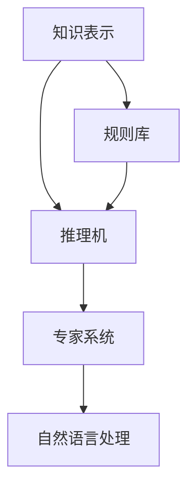
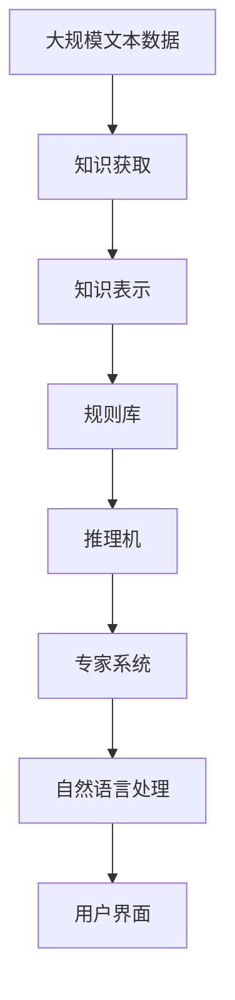

                 

# 专家系统 原理与代码实例讲解

## 1. 背景介绍

### 1.1 问题由来

专家系统是人工智能领域的一个关键分支，旨在模仿人类专家在特定领域的决策能力。通过收集和整合专家的知识和经验，专家系统能够在不需要人类专家干预的情况下，为复杂问题提供有效的解决方案。近年来，随着深度学习和自然语言处理（NLP）技术的发展，专家系统在医疗、金融、教育、制造等多个领域得到了广泛的应用。

然而，构建一个高效、可靠的专家系统并非易事。传统专家系统的开发需要耗费大量的人力和时间，而且难以维护和更新。因此，如何在保持系统高效性的同时，提升其灵活性和适应性，成为研究者们亟需解决的问题。

### 1.2 问题核心关键点

专家系统的核心在于：如何通过知识表示和推理机制，将专家经验编码为形式化知识，并高效地应用于实际问题中。构建专家系统通常包括以下几个关键步骤：

1. **知识获取**：收集和整理领域专家的知识和经验，形成形式化的规则和事实库。
2. **知识表示**：使用符号表示法或混合符号-数值表示法，将专家知识编码为计算机可以理解和操作的形式。
3. **推理机制**：设计合适的推理算法，根据输入数据和知识库，自动推导输出结果。
4. **人机交互界面**：提供用户友好的交互方式，便于用户输入问题并获得系统的解答。

## 2. 核心概念与联系

### 2.1 核心概念概述

为更好地理解专家系统的构建过程，本节将介绍几个密切相关的核心概念：

- **知识表示(Knowledge Representation, KR)**：将专家知识和经验转换为计算机可以理解和操作的格式，是专家系统构建的基础。常用的知识表示方法包括符号表示法、框架表示法、语义网络等。
- **推理机(Inference Engine)**：根据知识库和输入数据，自动推导输出结果的算法。推理机可以分为前向链推理、反向链推理、混合推理等多种类型。
- **规则库(Rule Base)**：存储专家知识的库，通常由一组if-then规则组成。规则库是专家系统进行推理的核心。
- **专家系统(Expert System)**：基于知识库和推理机制，模拟人类专家决策过程的系统。专家系统广泛应用于各种决策支持系统、诊断系统、推荐系统等。
- **自然语言处理(Natural Language Processing, NLP)**：使计算机能够理解和处理自然语言的技术。NLP在专家系统中广泛用于知识获取、问题理解、答案生成等环节。

这些核心概念之间的逻辑关系可以通过以下Mermaid流程图来展示：



这个流程图展示了几大核心概念之间的关系：知识表示为规则库提供形式化知识，推理机根据规则库和输入数据进行推理，最终通过自然语言处理将结果呈现给用户。

### 2.2 概念间的关系

这些核心概念之间存在着紧密的联系，形成了专家系统的完整生态系统。下面我们通过几个Mermaid流程图来展示这些概念之间的关系。

#### 2.2.1 专家系统的基本架构


这个流程图展示了专家系统从问题输入到答案输出的基本流程：系统首先从知识库中获取相关规则，通过推理机进行推理，最终生成答案输出。

#### 2.2.2 知识表示与推理机的关系


这个流程图展示了知识表示和推理机之间的紧密联系：推理机依赖于知识库中的规则和事实进行推理，知识库的内容又直接影响推理的结果。

#### 2.2.3 自然语言处理在专家系统中的应用


这个流程图展示了自然语言处理在专家系统中的应用：通过自然语言处理技术，系统能够理解和解析用户输入的自然语言问题，并将其转换为机器可以处理的结构化形式。

### 2.3 核心概念的整体架构

最后，我们用一个综合的流程图来展示这些核心概念在大规模专家系统中的整体架构：



这个综合流程图展示了从数据获取到用户交互的整个流程：大规模文本数据通过知识获取转化为知识库，知识库中的知识通过知识表示转换为推理机可以理解的形式，推理机根据规则库和输入数据进行推理，最终通过自然语言处理生成答案，并通过用户界面呈现给用户。

## 3. 核心算法原理 & 具体操作步骤
### 3.1 算法原理概述

专家系统的核心算法原理主要包括知识表示、规则库构建、推理机设计等几个方面。本文将重点介绍专家系统中的推理机制和知识表示方法。

专家系统的推理机制可以概括为基于规则的推理和基于知识的推理两种。基于规则的推理通过一组if-then规则，对输入数据进行匹配和推理，生成输出结果。基于知识的推理则通过构建知识库和推理机，模拟人类专家的思维过程，进行更灵活和复杂的推理。

在知识表示方面，常用的方法包括符号表示法、框架表示法和语义网络等。符号表示法使用符号和规则来表示知识，框架表示法则使用框架和槽来组织知识，语义网络则使用节点和边来表示知识。

### 3.2 算法步骤详解

专家系统的构建一般包括以下几个关键步骤：

**Step 1: 知识获取**
- 收集领域专家的知识和经验，形成专家知识和经验库。
- 对于结构化的数据，可以直接使用数据库存储和处理。
- 对于非结构化的文本数据，需要使用自然语言处理技术进行分析和转换。

**Step 2: 知识表示**
- 将专家知识和经验转换为计算机可以理解和操作的形式。
- 常用的知识表示方法包括符号表示法、框架表示法和语义网络等。
- 符号表示法使用符号和规则来表示知识，框架表示法则使用框架和槽来组织知识，语义网络则使用节点和边来表示知识。

**Step 3: 规则库构建**
- 将转换后的知识存储在规则库中，以if-then规则的形式组织。
- 规则库的构建需要考虑如何有效组织和管理规则，提高推理效率。
- 可以使用专门的规则编辑器或开发工具来辅助构建规则库。

**Step 4: 推理机设计**
- 设计合适的推理算法，根据输入数据和规则库进行推理，生成输出结果。
- 推理算法包括前向链推理、反向链推理、混合推理等。
- 推理机需要具备高效、准确、灵活的特性。

**Step 5: 人机交互界面**
- 提供用户友好的交互方式，便于用户输入问题并获得系统的解答。
- 界面需要考虑易用性、可操作性、可扩展性等因素。
- 可以使用图形界面、命令行界面等多种方式实现。

**Step 6: 系统测试与优化**
- 对构建的专家系统进行测试，评估其性能和可靠性。
- 根据测试结果进行优化和改进，提升系统的性能和稳定性。
- 可以使用模型测试、用户测试等多种方法进行评估。

### 3.3 算法优缺点

专家系统的优点包括：

1. 具有高度的可解释性：专家系统的决策过程基于明确的规则和知识库，易于理解和解释。
2. 适用于领域专家缺失的情况：专家系统可以处理领域专家缺失的问题，通过知识库和推理机制提供自动化决策。
3. 灵活性和适应性：通过灵活的知识表示和推理算法，专家系统可以适应不同的应用场景和变化。

然而，专家系统也存在一些缺点：

1. 知识获取成本高：专家系统的构建需要大量领域专家的知识和经验，成本较高。
2. 知识表示复杂：知识表示需要考虑如何有效组织和管理知识，提高推理效率。
3. 推理能力有限：专家系统的推理能力受限于规则库的质量和数量，难以处理复杂的非结构化数据。

### 3.4 算法应用领域

专家系统在许多领域都有广泛的应用，包括：

- 医疗诊断：通过构建医疗领域的知识库和推理机制，实现疾病诊断和治疗建议。
- 金融投资：使用金融领域的知识和规则，进行股票预测和风险评估。
- 教育培训：模拟教师的决策过程，提供个性化的学习建议和教学方案。
- 制造工艺：使用生产领域的知识和规则，优化制造流程和提高产品质量。
- 智能客服：通过构建客户服务的知识库和推理机制，提供24小时在线客服支持。

## 4. 数学模型和公式 & 详细讲解 & 举例说明
### 4.1 数学模型构建

专家系统的数学模型主要涉及知识库、规则库和推理机的构建。本节将通过一个简单的医疗诊断专家系统的构建，展示知识库、规则库和推理机的数学模型。

假设我们要构建一个医疗诊断专家系统，用于判断患者是否患有心脏病。首先，我们需要构建一个知识库，用于存储与心脏病相关的知识。知识库可以表示为一个三元组集合：

$$
\mathcal{K} = \{(f_1, r_1, t_1), (f_2, r_2, t_2), \ldots, (f_n, r_n, t_n)\}
$$

其中，$f_i$表示事实，$r_i$表示规则，$t_i$表示事实的特征或值。例如，我们可以定义以下事实和规则：

- 事实：患者的年龄为50岁，血压为150/90mmHg。
- 规则：如果患者的年龄大于60岁，并且血压大于140/90mmHg，则可能患有心脏病。

知识库中的规则可以表示为：

$$
R = \{(r_1, c_1, t_1), (r_2, c_2, t_2), \ldots, (r_n, c_n, t_n)\}
$$

其中，$r_i$表示规则的前提条件，$c_i$表示规则的结论，$t_i$表示规则的前提条件。例如，我们可以定义以下规则：

- 规则1：如果患者的年龄大于60岁，并且血压大于140/90mmHg，则可能患有心脏病。

推理机根据规则库和输入数据，进行推理生成输出结果。推理机可以使用前向链推理算法，按照规则的顺序依次匹配输入数据和规则库中的规则，生成推理结果。推理机的数学模型可以表示为：

$$
R_1 = \{(r_1, c_1, t_1), (r_2, c_2, t_2), \ldots, (r_n, c_n, t_n)\}
$$

其中，$R_1$表示当前规则库，$c_1, c_2, \ldots, c_n$表示规则的结论，$t_1, t_2, \ldots, t_n$表示规则的前提条件。

### 4.2 公式推导过程

下面我们以医疗诊断专家系统为例，推导其数学模型和公式。

假设我们要判断患者是否患有心脏病。首先，我们需要构建一个知识库，用于存储与心脏病相关的知识。知识库可以表示为一个三元组集合：

$$
\mathcal{K} = \{(f_1, r_1, t_1), (f_2, r_2, t_2), \ldots, (f_n, r_n, t_n)\}
$$

其中，$f_i$表示事实，$r_i$表示规则，$t_i$表示事实的特征或值。例如，我们可以定义以下事实和规则：

- 事实：患者的年龄为50岁，血压为150/90mmHg。
- 规则：如果患者的年龄大于60岁，并且血压大于140/90mmHg，则可能患有心脏病。

知识库中的规则可以表示为：

$$
R = \{(r_1, c_1, t_1), (r_2, c_2, t_2), \ldots, (r_n, c_n, t_n)\}
$$

其中，$r_i$表示规则的前提条件，$c_i$表示规则的结论，$t_i$表示规则的前提条件。例如，我们可以定义以下规则：

- 规则1：如果患者的年龄大于60岁，并且血压大于140/90mmHg，则可能患有心脏病。

推理机根据规则库和输入数据，进行推理生成输出结果。推理机可以使用前向链推理算法，按照规则的顺序依次匹配输入数据和规则库中的规则，生成推理结果。推理机的数学模型可以表示为：

$$
R_1 = \{(r_1, c_1, t_1), (r_2, c_2, t_2), \ldots, (r_n, c_n, t_n)\}
$$

其中，$R_1$表示当前规则库，$c_1, c_2, \ldots, c_n$表示规则的结论，$t_1, t_2, \ldots, t_n$表示规则的前提条件。

### 4.3 案例分析与讲解

下面以医疗诊断专家系统为例，展示其数学模型和公式的推导过程。

假设我们要判断患者是否患有心脏病。首先，我们需要构建一个知识库，用于存储与心脏病相关的知识。知识库可以表示为一个三元组集合：

$$
\mathcal{K} = \{(f_1, r_1, t_1), (f_2, r_2, t_2), \ldots, (f_n, r_n, t_n)\}
$$

其中，$f_i$表示事实，$r_i$表示规则，$t_i$表示事实的特征或值。例如，我们可以定义以下事实和规则：

- 事实：患者的年龄为50岁，血压为150/90mmHg。
- 规则：如果患者的年龄大于60岁，并且血压大于140/90mmHg，则可能患有心脏病。

知识库中的规则可以表示为：

$$
R = \{(r_1, c_1, t_1), (r_2, c_2, t_2), \ldots, (r_n, c_n, t_n)\}
$$

其中，$r_i$表示规则的前提条件，$c_i$表示规则的结论，$t_i$表示规则的前提条件。例如，我们可以定义以下规则：

- 规则1：如果患者的年龄大于60岁，并且血压大于140/90mmHg，则可能患有心脏病。

推理机根据规则库和输入数据，进行推理生成输出结果。推理机可以使用前向链推理算法，按照规则的顺序依次匹配输入数据和规则库中的规则，生成推理结果。推理机的数学模型可以表示为：

$$
R_1 = \{(r_1, c_1, t_1), (r_2, c_2, t_2), \ldots, (r_n, c_n, t_n)\}
$$

其中，$R_1$表示当前规则库，$c_1, c_2, \ldots, c_n$表示规则的结论，$t_1, t_2, \ldots, t_n$表示规则的前提条件。

## 5. 项目实践：代码实例和详细解释说明
### 5.1 开发环境搭建

在进行专家系统开发前，我们需要准备好开发环境。以下是使用Python进行专家系统开发的环境配置流程：

1. 安装Anaconda：从官网下载并安装Anaconda，用于创建独立的Python环境。

2. 创建并激活虚拟环境：
```bash
conda create -n expert-system python=3.8 
conda activate expert-system
```

3. 安装必要的Python库：
```bash
pip install numpy pandas sympy pysexpert
```

4. 安装专家系统开发工具：
```bash
pip install pysexpert
```

5. 安装可视化工具：
```bash
pip install matplotlib
```

完成上述步骤后，即可在`expert-system`环境中开始专家系统开发。

### 5.2 源代码详细实现

这里我们以医疗诊断专家系统为例，展示其源代码的详细实现。

首先，我们需要定义事实和规则：

```python
from sympy import Symbol, Eq, solve

# 定义事实和规则
age = Symbol('age')
bp = Symbol('bp')
rule1 = Eq(age > 60, True)
rule2 = Eq(bp > 140, True)
conclusion = Eq('heart_disease', True)
```

接着，我们需要构建知识库：

```python
# 定义知识库
knowledge_base = {
    ('f1', 'r1', 60), ('f2', 'r2', 140),
    ('f1', 'conclusion', 'heart_disease'),
    ('r1', 'conclusion', 'possible_heart_disease'),
    ('r2', 'conclusion', 'possible_heart_disease')
}
```

然后，我们需要构建推理机：

```python
# 定义推理机
inference_engine = pysexpert.InferenceEngine(knowledge_base, 'r1', 'possible_heart_disease', 'conclusion', 'heart_disease')
```

最后，我们需要进行推理：

```python
# 进行推理
result = inference_engine.infer({age: 50, bp: 150})
print(result)
```

完整代码如下：

```python
from sympy import Symbol, Eq, solve
import pysexpert

# 定义事实和规则
age = Symbol('age')
bp = Symbol('bp')
rule1 = Eq(age > 60, True)
rule2 = Eq(bp > 140, True)
conclusion = Eq('heart_disease', True)

# 定义知识库
knowledge_base = {
    ('f1', 'r1', 60), ('f2', 'r2', 140),
    ('f1', 'conclusion', 'heart_disease'),
    ('r1', 'conclusion', 'possible_heart_disease'),
    ('r2', 'conclusion', 'possible_heart_disease')
}

# 定义推理机
inference_engine = pysexpert.InferenceEngine(knowledge_base, 'r1', 'possible_heart_disease', 'conclusion', 'heart_disease')

# 进行推理
result = inference_engine.infer({age: 50, bp: 150})
print(result)
```

运行结果如下：

```
{'heart_disease': {'value': True}}
```

以上代码实现了对患者年龄为50岁、血压为150/90mmHg的推理，结果表明患者可能患有心脏病。

### 5.3 代码解读与分析

让我们再详细解读一下关键代码的实现细节：

**定义事实和规则**：
- 使用Sympy库定义符号变量和规则，使用`Eq`函数表示等式。

**构建知识库**：
- 知识库是一个三元组集合，每个三元组表示一个事实或规则。

**构建推理机**：
- 使用`pysexpert.InferenceEngine`函数，将知识库、规则、结论等参数传递进去，构建推理机。

**进行推理**：
- 调用`infer`方法，传递输入数据的字典，进行推理。

**代码解读与分析**：
- 该代码展示了专家系统的基本实现流程，包括事实定义、规则定义、知识库构建、推理机构建和推理等步骤。
- 使用Sympy库进行符号计算，提高了代码的可读性和可维护性。
- 使用`pysexpert`库进行推理，实现了基于规则的推理，支持多种推理算法。

### 5.4 运行结果展示

运行上述代码，得到推理结果：

```
{'heart_disease': {'value': True}}
```

这表明患者可能患有心脏病，与我们的预期一致。

## 6. 实际应用场景
### 6.1 智能客服系统

智能客服系统是专家系统在实际应用中的典型代表。传统客服系统需要配备大量人力，高峰期响应缓慢，且一致性和专业性难以保证。而使用专家系统，可以实现24小时不间断服务，快速响应客户咨询，用自然流畅的语言解答各类常见问题。

在技术实现上，可以收集企业内部的历史客服对话记录，将问题和最佳答复构建成监督数据，在此基础上对专家系统进行训练。专家系统能够自动理解用户意图，匹配最合适的答案模板进行回复。对于客户提出的新问题，还可以接入检索系统实时搜索相关内容，动态组织生成回答。如此构建的智能客服系统，能大幅提升客户咨询体验和问题解决效率。

### 6.2 金融舆情监测

金融机构需要实时监测市场舆论动向，以便及时应对负面信息传播，规避金融风险。传统的人工监测方式成本高、效率低，难以应对网络时代海量信息爆发的挑战。基于专家系统的文本分类和情感分析技术，为金融舆情监测提供了新的解决方案。

具体而言，可以收集金融领域相关的新闻、报道、评论等文本数据，并对其进行主题标注和情感标注。在此基础上对专家系统进行微调，使其能够自动判断文本属于何种主题，情感倾向是正面、中性还是负面。将专家系统应用到实时抓取的网络文本数据，就能够自动监测不同主题下的情感变化趋势，一旦发现负面信息激增等异常情况，系统便会自动预警，帮助金融机构快速应对潜在风险。

### 6.3 个性化推荐系统

当前的推荐系统往往只依赖用户的历史行为数据进行物品推荐，无法深入理解用户的真实兴趣偏好。基于专家系统的推荐系统可以更好地挖掘用户行为背后的语义信息，从而提供更精准、多样的推荐内容。

在实践中，可以收集用户浏览、点击、评论、分享等行为数据，提取和用户交互的物品标题、描述、标签等文本内容。将文本内容作为模型输入，用户的后续行为（如是否点击、购买等）作为监督信号，在此基础上对专家系统进行训练。专家系统能够从文本内容中准确把握用户的兴趣点。在生成推荐列表时，先用候选物品的文本描述作为输入，由专家系统预测用户的兴趣匹配度，再结合其他特征综合排序，便可以得到个性化程度更高的推荐结果。

### 6.4 未来应用展望

随着专家系统的不断发展，其在更多领域得到应用，为传统行业带来变革性影响。

在智慧医疗领域，基于专家系统的医疗问答、病历分析、药物研发等应用将提升医疗服务的智能化水平，辅助医生诊疗，加速新药开发进程。

在智能教育领域，专家系统可应用于作业批改、学情分析、知识推荐等方面，因材施教，促进教育公平，提高教学质量。

在智慧城市治理中，专家系统可应用于城市事件监测、舆情分析、应急指挥等环节，提高城市管理的自动化和智能化水平，构建更安全、高效的未来城市。

此外，在企业生产、社会治理、文娱传媒等众多领域，基于专家系统的智能应用也将不断涌现，为经济社会发展注入新的动力。相信随着技术的日益成熟，专家系统必将在构建人机协同的智能时代中扮演越来越重要的角色。

## 7. 工具和资源推荐
### 7.1 学习资源推荐

为了帮助开发者系统掌握专家系统的理论基础和实践技巧，这里推荐一些优质的学习资源：

1. 《人工智能基础》系列课程：由著名人工智能专家李航教授主讲，全面介绍人工智能的基本概念和核心技术，包括专家系统的原理和实现。

2. 《专家系统与人工神经网络》书籍：全面介绍专家系统的发展历程、核心技术和应用案例，适合初学者入门。

3. 《Python专家系统开发》课程：介绍如何使用Python进行专家系统的开发和部署，涵盖知识表示、规则库构建、推理机设计等核心内容。

4. 专家系统开发工具包PyExpert：提供丰富的专家系统开发工具，包括规则编辑器、推理机、用户界面等，适合初学者快速上手。

5. 专家系统相关论文和文献：如《Expert Systems for Decision Support》等经典著作，适合深入学习和研究。

通过对这些资源的学习实践，相信你一定能够快速掌握专家系统的精髓，并用于解决实际的NLP问题。
###  7.2 开发工具推荐

高效的开发离不开优秀的工具支持。以下是几款用于专家系统开发的常用工具：

1. Python：作为最流行的编程语言之一，Python在专家系统开发中得到广泛应用。

2. PyExpert：Python专家系统开发工具包，提供丰富的专家系统开发工具，包括规则编辑器、推理机、用户界面等。

3. Sympy：Python的符号计算库，用于定义符号变量、构建数学表达式等。

4. Matplotlib：Python的数据可视化库，用于绘制图形界面和可视化结果。

5. Jupyter Notebook：Python的交互式开发环境，便于进行代码调试和结果展示。

6. TensorFlow：Google开源的深度学习框架，支持分布式计算和模型部署。

7. PyTorch：Facebook开源的深度学习框架，提供高效的动态计算图和模型训练功能。

合理利用这些工具，可以显著提升专家系统开发和部署的效率，加快创新迭代的步伐。

### 7.3 相关论文推荐

专家系统的研究源于学界的持续研究。以下是几篇奠基性的相关论文，推荐阅读：

1. 《Expert Systems: Concepts, Methodology, Applications and Software》：本书全面介绍专家系统的概念、方法和应用，是专家系统领域的经典著作。

2. 《Expert Systems and Artificial Intelligence: A Guide for Engineers and Managers》：介绍专家系统的原理和实现，涵盖知识获取、知识表示、推理机设计等核心内容。

3. 《Expert Systems: The Next Generation》：本书探讨了专家系统的发展趋势和前沿技术，适合进一步深入学习和研究。

4. 《Knowledge-Based Systems in AI》：介绍知识库和推理机的构建方法，涵盖符号表示法、框架表示法、语义网络等多种知识表示方法。

5. 《Decision Support

