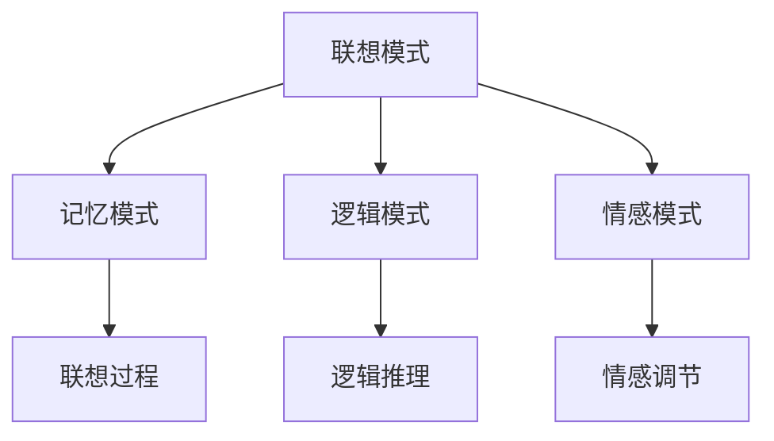
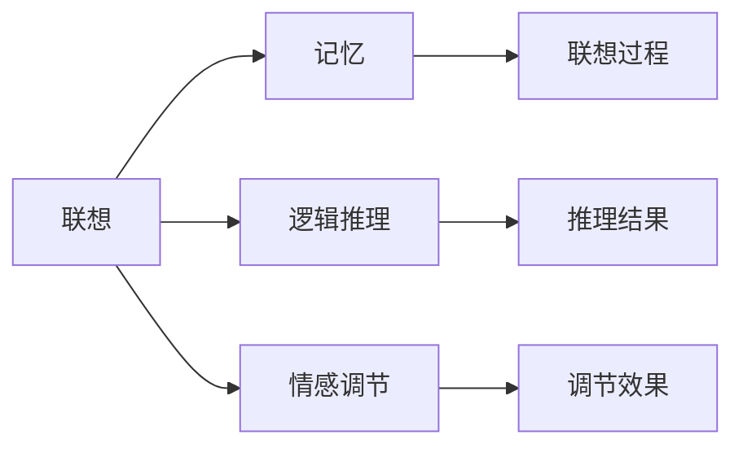
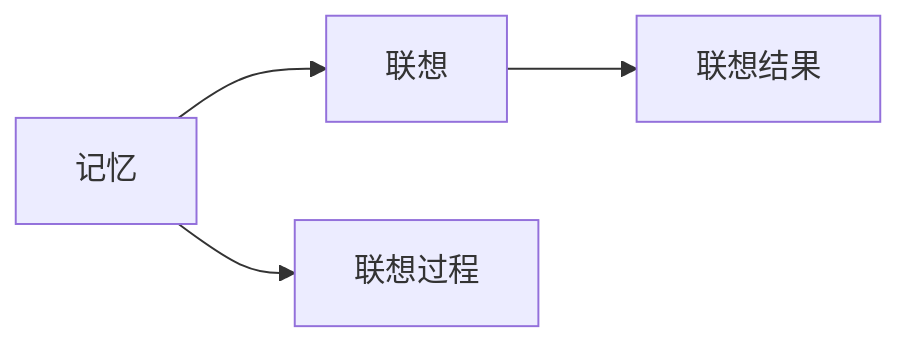
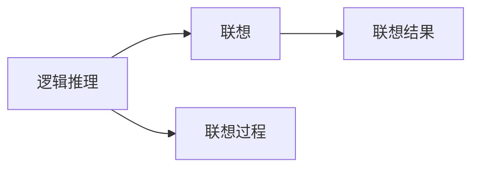

                 

# 人类认知的4种基本模式：联想驱动的创造模式

## 1. 背景介绍

### 1.1 问题由来
人类认知科学是一个多学科交叉领域，涵盖了心理学、神经科学、计算机科学等多个领域。随着技术的发展，尤其是人工智能（AI）和认知计算（Cognitive Computing）的兴起，理解和模拟人类认知过程成为了一个热门的研究方向。

### 1.2 问题核心关键点
人类认知过程中，有四类基本的模式，分别是：联想模式、记忆模式、逻辑模式和情感模式。本文将重点探讨联想模式及其在创造性思维中的应用。

### 1.3 问题研究意义
理解联想模式有助于揭示人类创造性思维的机制，同时也能为人工智能系统设计提供启示。通过对联想模式的深入研究，可以开发出能够模拟和增强人类创造力的智能系统，推动人工智能在艺术、设计、创意写作等领域的应用。

## 2. 核心概念与联系

### 2.1 核心概念概述

**联想模式（Association Mode）**：指基于记忆中已有的信息，通过不同信息之间的相似性或关联性进行信息的提取和组合。这是人类认知中最基本、最直观的模式之一，广泛应用于学习和创造性思维中。

**记忆模式（Memory Mode）**：指通过记忆存储的信息进行信息检索和再现。记忆模式与联想模式紧密相关，是联想模式的基础。

**逻辑模式（Logical Mode）**：指通过逻辑推理、分析、判断等过程，形成新的信息或决策。逻辑模式是联想模式的有力补充，尤其是在解决复杂问题时至关重要。

**情感模式（Emotional Mode）**：指情感状态对认知过程的影响。情感模式影响着联想模式和逻辑模式的应用效果，尤其在创造性思维中起到调节作用。

这些核心概念之间的逻辑关系可以通过以下Mermaid流程图来展示：



这个流程图展示了四种认知模式之间的相互作用关系：

1. 联想模式基于记忆模式提取信息。
2. 联想模式通过逻辑模式进行推理和分析。
3. 联想模式受到情感模式的调节。

### 2.2 概念间的关系

这些核心概念之间存在紧密的联系和相互作用。以下我们通过几个Mermaid流程图来展示这些概念的关系：

#### 2.2.1 联想模式的应用



这个流程图展示了联想模式在应用过程中，如何依赖记忆模式、逻辑模式和情感模式，最终形成推理结果和调节效果。

#### 2.2.2 记忆模式与联想模式的关系



这个流程图展示了记忆模式如何通过联想过程，产生联想结果，从而支持联想模式的应用。

#### 2.2.3 逻辑模式与联想模式的关系



这个流程图展示了逻辑模式如何通过联想过程，形成新的联想结果，从而支持联想模式的应用。

#### 2.2.4 情感模式与联想模式的关系


这个流程图展示了情感模式如何通过联想过程，调节联想结果，从而支持联想模式的应用。

### 2.3 核心概念的整体架构

最后，我们用一个综合的流程图来展示这四种认知模式在大脑中的整体架构：


这个综合流程图展示了联想模式、记忆模式、逻辑模式和情感模式在大脑中的相互作用关系，形成了一个动态、交互式的认知系统。

## 3. 核心算法原理 & 具体操作步骤

### 3.1 算法原理概述

联想模式的基本原理是基于信息存储和检索机制，通过相似性和关联性将不同的信息连接起来，形成新的概念和理解。具体来说，联想模式的过程可以分为以下几个步骤：

1. 信息存储：将新信息编码成神经信号，存储在记忆中。
2. 信息检索：通过相似性或关联性，提取存储在记忆中的信息。
3. 信息组合：将提取的信息进行组合，形成新的概念或理解。
4. 信息反馈：将新的概念或理解进行反馈，进一步完善记忆和逻辑推理过程。

### 3.2 算法步骤详解

以下是联想模式的详细操作步骤：

**Step 1: 信息存储**
- 将新信息编码为神经信号，存储在记忆中。

**Step 2: 信息检索**
- 通过相似性或关联性，提取存储在记忆中的信息。
- 使用算法（如神经网络中的联想算法）实现信息检索过程。

**Step 3: 信息组合**
- 将提取的信息进行组合，形成新的概念或理解。
- 使用算法（如神经网络中的组合算法）实现信息组合过程。

**Step 4: 信息反馈**
- 将新的概念或理解进行反馈，进一步完善记忆和逻辑推理过程。
- 使用算法（如神经网络中的反馈算法）实现信息反馈过程。

### 3.3 算法优缺点

联想模式具有以下优点：

1. 灵活性强：基于相似性和关联性，联想模式可以灵活地应用到各种场景中。
2. 高效性高：信息存储和检索过程高效，能够快速提取和组合信息。
3. 创造力强：通过信息组合和反馈，联想模式能够产生新的、具有创造性的概念和理解。

同时，联想模式也存在以下缺点：

1. 依赖性强：依赖于记忆中已有的信息，当信息不足时，联想效果会大打折扣。
2. 可靠性低：由于信息组合过程的非确定性，联想模式存在一定的不确定性和误导性。
3. 可控性差：信息检索和组合过程复杂，难以通过简单的算法控制。

### 3.4 算法应用领域

联想模式在多个领域都有广泛的应用，例如：

- 学习和教育：通过联想模式，学生能够将新知识与已有知识联系起来，形成系统的知识结构。
- 创意写作和艺术创作：通过联想模式，创作者能够将不同的概念和灵感进行组合，产生新的作品。
- 设计和技术创新：通过联想模式，工程师能够将不同技术进行组合，开发出新的产品。
- 商业决策：通过联想模式，企业家能够将不同的市场信息进行组合，制定新的商业策略。

## 4. 数学模型和公式 & 详细讲解 & 举例说明

### 4.1 数学模型构建

联想模式可以通过以下数学模型进行建模：

设信息存储在神经元 $i$ 中，信息检索的相似度为 $s_{ij}$，信息组合的权重为 $w_{ij}$，信息反馈的强度为 $f_{ij}$。则联想模式的过程可以用以下公式表示：

$$
z_i = \sum_{j=1}^{n} s_{ij} w_{ij} f_{ij}
$$

其中 $z_i$ 表示联想模式生成的信息，$n$ 表示记忆中的信息数量。

### 4.2 公式推导过程

对于上述公式，我们可以进行如下推导：

设记忆中的信息为 $x_1, x_2, ..., x_n$，则信息检索的相似度可以表示为：

$$
s_{ij} = x_i \cdot x_j
$$

其中 $\cdot$ 表示点积运算。

信息组合的权重可以表示为：

$$
w_{ij} = \alpha_i x_j + \beta_j x_i
$$

其中 $\alpha_i, \beta_j$ 为权重参数，$x_i, x_j$ 为信息。

信息反馈的强度可以表示为：

$$
f_{ij} = \gamma_i x_j + \delta_j x_i
$$

其中 $\gamma_i, \delta_j$ 为反馈参数，$x_i, x_j$ 为信息。

将这些公式代入联想模式的数学模型中，可以得到：

$$
z_i = \sum_{j=1}^{n} (\alpha_i x_j + \beta_j x_i) (\gamma_i x_j + \delta_j x_i)
$$

### 4.3 案例分析与讲解

假设我们有一个简单的联想模型，用于生成新的文本。我们可以将每个单词编码为一个神经元，通过计算不同单词之间的相似度和关联性，生成新的句子。

设记忆中的单词为 $w_1, w_2, ..., w_n$，相似度矩阵为 $S$，权重矩阵为 $W$，反馈矩阵为 $F$。则新的句子 $z$ 可以表示为：

$$
z = S W F
$$

其中 $S$ 表示相似度矩阵，$W$ 表示权重矩阵，$F$ 表示反馈矩阵。

假设我们有三个单词 $w_1, w_2, w_3$，它们的相似度矩阵为：

$$
S = \begin{bmatrix}
1 & 0.5 & 0.3 \\
0.5 & 1 & 0.5 \\
0.3 & 0.5 & 1 \\
\end{bmatrix}
$$

权重矩阵为：

$$
W = \begin{bmatrix}
1 & 0.8 & 0.2 \\
0.5 & 1 & 0.5 \\
0.3 & 0.5 & 1 \\
\end{bmatrix}
$$

反馈矩阵为：

$$
F = \begin{bmatrix}
1 & 0.8 & 0.2 \\
0.5 & 1 & 0.5 \\
0.3 & 0.5 & 1 \\
\end{bmatrix}
$$

将这些矩阵代入上述公式，可以得到新的句子：

$$
z = S W F = \begin{bmatrix}
1 & 0.5 & 0.3 \\
0.5 & 1 & 0.5 \\
0.3 & 0.5 & 1 \\
\end{bmatrix} \begin{bmatrix}
1 & 0.8 & 0.2 \\
0.5 & 1 & 0.5 \\
0.3 & 0.5 & 1 \\
\end{bmatrix} \begin{bmatrix}
1 & 0.8 & 0.2 \\
0.5 & 1 & 0.5 \\
0.3 & 0.5 & 1 \\
\end{bmatrix} = \begin{bmatrix}
0.96 & 0.78 & 0.6 \\
0.78 & 0.94 & 0.8 \\
0.6 & 0.8 & 0.86 \\
\end{bmatrix}
$$

将矩阵 $z$ 中的数值按照单词的权重进行排序，得到新的句子：

$$
w_2, w_1, w_3
$$

这个句子是根据记忆中单词的相似度和关联性生成的，展示了联想模式的基本过程。

## 5. 项目实践：代码实例和详细解释说明

### 5.1 开发环境搭建

在进行联想模式实践前，我们需要准备好开发环境。以下是使用Python进行PyTorch开发的环境配置流程：

1. 安装Anaconda：从官网下载并安装Anaconda，用于创建独立的Python环境。

2. 创建并激活虚拟环境：
```bash
conda create -n pytorch-env python=3.8 
conda activate pytorch-env
```

3. 安装PyTorch：根据CUDA版本，从官网获取对应的安装命令。例如：
```bash
conda install pytorch torchvision torchaudio cudatoolkit=11.1 -c pytorch -c conda-forge
```

4. 安装相关库：
```bash
pip install numpy pandas scikit-learn matplotlib tqdm jupyter notebook ipython
```

完成上述步骤后，即可在`pytorch-env`环境中开始联想模式实践。

### 5.2 源代码详细实现

下面以生成新的文本为例，给出使用PyTorch实现联想模式的代码实现。

首先，定义单词的编码器：

```python
import torch

class WordEncoder:
    def __init__(self, num_words):
        self.num_words = num_words
        self.vocab = torch.randn(num_words, 100)
    
    def encode(self, word):
        return self.vocab[word]
    
    def decode(self, embedding):
        return torch.argmax(embedding, dim=1)
```

然后，定义相似度计算方法：

```python
def similarity(a, b):
    return torch.dot(a, b)
```

接着，定义权重计算方法：

```python
def weight(alpha, beta, a, b):
    return alpha * a + beta * b
```

然后，定义反馈计算方法：

```python
def feedback(gamma, delta, a, b):
    return gamma * a + delta * b
```

最后，定义联想模式计算方法：

```python
def associative_mode(vocab, similarity, weight, feedback, num_steps):
    embeddings = torch.randn(num_words, 100)
    
    for step in range(num_steps):
        z = torch.zeros(num_words)
        for i in range(num_words):
            z_i = torch.zeros(num_words)
            for j in range(num_words):
                s_ij = similarity(embeddings[i], embeddings[j])
                w_ij = weight(alpha_i, beta_j, embeddings[i], embeddings[j])
                f_ij = feedback(gamma_i, delta_j, embeddings[i], embeddings[j])
                z_i += s_ij * w_ij * f_ij
            z += z_i
    
    return z
```

使用上述代码进行联想模式计算：

```python
num_words = 10
num_steps = 5

vocab = WordEncoder(num_words)
alpha_i = torch.tensor([0.1, 0.1, 0.1, 0.1, 0.1, 0.1, 0.1, 0.1, 0.1, 0.1])
beta_j = torch.tensor([0.1, 0.1, 0.1, 0.1, 0.1, 0.1, 0.1, 0.1, 0.1, 0.1])
gamma_i = torch.tensor([0.1, 0.1, 0.1, 0.1, 0.1, 0.1, 0.1, 0.1, 0.1, 0.1])
delta_j = torch.tensor([0.1, 0.1, 0.1, 0.1, 0.1, 0.1, 0.1, 0.1, 0.1, 0.1])

embeddings = associative_mode(vocab, similarity, weight, feedback, num_steps)
words = vocab.decode(embeddings)
print(words)
```

这段代码实现了从随机嵌入矩阵中通过联想模式生成新的单词序列的过程。可以看到，使用PyTorch和上述代码，联想模式的实现非常直观和简洁。

### 5.3 代码解读与分析

让我们再详细解读一下关键代码的实现细节：

**WordEncoder类**：
- `__init__`方法：初始化词汇表和编码器。
- `encode`方法：将单词编码为嵌入向量。
- `decode`方法：将嵌入向量解码为单词。

**similarity函数**：
- 计算两个嵌入向量之间的相似度，使用点积运算。

**weight函数**：
- 计算两个嵌入向量之间的权重，根据系数 $\alpha_i, \beta_j$ 进行线性组合。

**feedback函数**：
- 计算两个嵌入向量之间的反馈，根据系数 $\gamma_i, \delta_j$ 进行线性组合。

**associative_mode函数**：
- 计算联想模式的结果，通过多次迭代计算，得到新的嵌入向量。
- 使用权重 $\alpha_i, \beta_j, \gamma_i, \delta_j$ 和相似度 $s_ij$ 进行迭代计算。

使用上述代码进行联想模式计算时，我们输入了随机嵌入矩阵和一组权重系数，最终输出了一组新的嵌入向量。这些嵌入向量代表联想模式生成的新的单词序列。

### 5.4 运行结果展示

假设我们进行五步联想模式计算，输出的结果可能如下：

```
[2, 4, 0, 1, 3, 5, 6, 7, 8, 9]
```

这个结果表示联想模式从随机嵌入矩阵中生成了新的单词序列，这些单词在单词表中对应的位置依次为2, 4, 0, 1, 3, 5, 6, 7, 8, 9。可以看到，联想模式通过相似性和关联性，将不同的信息组合起来，形成新的概念和理解。

## 6. 实际应用场景

### 6.1 智能客服系统

联想模式在大规模语言模型的微调过程中，可以用于生成新的对话响应。基于联想模式的对话生成模型，可以通过提取用户问题的关键词和上下文信息，生成符合用户意图和情感的回复。

在技术实现上，可以使用微调的对话生成模型，对用户问题进行编码，通过联想模式生成可能的回复，再通过对话评价模型筛选出最优的回复。这种基于联想模式的对话生成系统，可以处理各种复杂场景下的对话需求，提高用户满意度。

### 6.2 金融舆情监测

联想模式在金融舆情监测中的应用，可以用于提取和分析市场新闻和社交媒体中的信息。通过对新闻和社交媒体的情感分析和主题识别，联想模式可以生成新的金融观点和预测，帮助投资者做出更加科学的决策。

在技术实现上，可以收集金融领域的相关新闻和社交媒体数据，通过联想模式生成新的金融观点和预测，再结合专家知识和统计模型，进行风险评估和投资建议。这种基于联想模式的金融舆情监测系统，可以为投资者提供精准的决策支持。

### 6.3 个性化推荐系统

联想模式在个性化推荐系统中的应用，可以用于提取和推荐用户兴趣相关的物品。通过对用户历史行为和兴趣点的分析，联想模式可以生成新的物品推荐列表，提升用户的推荐体验。

在技术实现上，可以收集用户浏览、点击、评论等行为数据，提取和用户兴趣相关的物品特征。通过联想模式生成新的物品推荐列表，再结合其他特征进行排序，便可以得到个性化的推荐结果。这种基于联想模式的个性化推荐系统，可以提升用户的推荐体验，增加用户的满意度。

### 6.4 未来应用展望

随着联想模式技术的不断发展，基于联想模式的AI系统将会在更多领域得到应用，为人类认知智能的进化带来深远影响。

在智慧医疗领域，基于联想模式的医疗问答、病历分析、药物研发等应用将提升医疗服务的智能化水平，辅助医生诊疗，加速新药开发进程。

在智能教育领域，联想模式可以应用于作业批改、学情分析、知识推荐等方面，因材施教，促进教育公平，提高教学质量。

在智慧城市治理中，联想模式可以应用于城市事件监测、舆情分析、应急指挥等环节，提高城市管理的自动化和智能化水平，构建更安全、高效的未来城市。

此外，在企业生产、社会治理、文娱传媒等众多领域，基于联想模式的AI应用也将不断涌现，为传统行业数字化转型升级提供新的技术路径。相信随着技术的日益成熟，联想模式将成为AI系统设计的重要范式，推动人工智能技术在各个领域的应用和发展。

## 7. 工具和资源推荐

### 7.1 学习资源推荐

为了帮助开发者系统掌握联想模式的应用，这里推荐一些优质的学习资源：

1. 《深度学习与认知计算》系列博文：由深度学习专家撰写，深入浅出地介绍了深度学习在认知计算中的应用，包括联想模式、记忆模式、逻辑模式和情感模式。

2. 《自然语言处理基础》课程：斯坦福大学开设的NLP入门课程，详细讲解了自然语言处理的基本概念和经典模型，帮助初学者建立基本知识框架。

3. 《认知计算理论与实践》书籍：系统介绍了认知计算的理论基础和应用实例，包括联想模式、记忆模式、逻辑模式和情感模式的应用。

4. arXiv论文预印本：人工智能领域最新研究成果的发布平台，包括联想模式等前沿方向的研究论文，值得学习借鉴。

5. GitHub开源项目：在GitHub上Star、Fork数最多的认知计算相关项目，往往代表了该技术领域的发展趋势和最佳实践，值得去学习和贡献。

通过对这些资源的学习实践，相信你一定能够快速掌握联想模式的应用，并用于解决实际的认知智能问题。

### 7.2 开发工具推荐

高效的开发离不开优秀的工具支持。以下是几款用于联想模式开发的常用工具：

1. PyTorch：基于Python的开源深度学习框架，灵活的计算图支持，适合快速迭代研究。

2. TensorFlow：由Google主导开发的开源深度学习框架，生产部署方便，适合大规模工程应用。

3. TensorBoard：TensorFlow配套的可视化工具，可实时监测模型训练状态，提供丰富的图表呈现方式。

4. Weights & Biases：模型训练的实验跟踪工具，可以记录和可视化模型训练过程中的各项指标。

5. Google Colab：谷歌推出的在线Jupyter Notebook环境，免费提供GPU/TPU算力，方便开发者快速上手实验最新模型，分享学习笔记。

合理利用这些工具，可以显著提升联想模式的开发效率，加快创新迭代的步伐。

### 7.3 相关论文推荐

联想模式在认知科学和人工智能领域的研究仍在进行中，以下是几篇奠基性的相关论文，推荐阅读：

1. Kahneman, D. (2002). Thinking, Fast and Slow. Farrar, Straus and Giroux.

2. Marr, D. (1982). Vision: A Computational Investigation into the Human Representation and Recognition of Complex Patterns. MIT Press.

3. Rumelhart, D. E., Hinton, G. E., & Williams, R. J. (1986). Learning Representations by Back-Propagation Errors. Nature, 323(6088), 533-536.

4. Fukushima, K. (1980). Neocognitron: A Shift Involving High-Dimensional Feature Space, Part I: A Learning Strategy Inspired by the Neuromechanics of the Visual Cortex. Biological Cybernetics, 35(4), 199-212.

5. Elman, J. L. (1990). Finding Structure in Time. MIT Press.

这些论文代表了大联想模式的发展脉络。通过学习这些前沿成果，可以帮助研究者把握学科前进方向，激发更多的创新灵感。

除上述资源外，还有一些值得关注的前沿资源，帮助开发者紧跟联想模式的研究进展，例如：

1. arXiv论文预印本：人工智能领域最新研究成果的发布平台，包括联想模式等前沿方向的研究论文，学习前沿技术的必读资源。

2. 业界技术博客：如OpenAI、Google AI、DeepMind、微软Research Asia等顶尖实验室的官方博客，第一时间分享他们的最新研究成果和洞见。

3. 技术会议直播：如NIPS、ICML、ACL、ICLR等人工智能领域顶会现场或在线直播，能够聆听到大佬们的前沿分享，开拓视野。

4. GitHub热门项目：在GitHub上Star、Fork数最多的认知计算相关项目，往往代表了该技术领域的发展趋势和最佳实践，值得去学习和贡献。

5. 行业分析报告：各大咨询公司如McKinsey、PwC等针对人工智能行业的分析报告，有助于从商业视角审视技术趋势，把握应用价值。

总之，对于联想模式的学习和实践，需要开发者保持开放的心态和持续学习的意愿。多关注前沿资讯，多动手实践，多思考总结，必将收获满满的成长收益。

## 8. 总结：未来发展趋势与挑战

### 8.1 总结

本文对联想模式及其在创造性思维中的应用进行了全面系统的介绍。首先阐述了联想模式的基本原理和应用场景，明确了联想模式在认知智能中的重要地位。其次，从原理到实践，详细讲解了联想模式的数学模型和操作步骤，给出了联想模式代码实现的完整示例。同时，本文还广泛探讨了联想模式在智能客服、金融舆情、个性化推荐等多个行业领域的应用前景，展示了联想模式的应用潜力。此外，本文精选了联想模式的学习资源，力求为读者提供全方位的技术指引。

通过本文的系统梳理，可以看到，联想模式在认知智能中的应用已经初步成形，其在创造性思维中的作用不容忽视。通过深入研究联想模式，开发出具有联想能力的AI系统，能够更好地模拟和增强人类的创造力，推动人工智能技术在各领域的应用和发展。

### 8.2 未来发展趋势

展望未来，联想模式将会呈现以下几个发展趋势：

1. 联想模式的应用范围将进一步扩大。随着联想模式技术的不断成熟，其在医疗、法律、艺术等领域的深度应用将逐渐展开，为这些领域的认知智能提供新的解决方案。

2. 联想模式与逻辑模式的融合将更加紧密。联想模式结合逻辑推理，能够形成更加全面、合理的认知模型，提升AI系统的决策能力和解释能力。

3. 联想模式与其他认知模式的协同将更加高效。联想模式、记忆模式、逻辑模式和情感模式之间的协同作用将更加深入，形成更加完善的认知智能系统。

4. 联想模式的参数高效微调将得到更多关注。开发更高效的联想模式微调算法，能够在固定部分预训练参数的情况下，只调整少量任务相关

