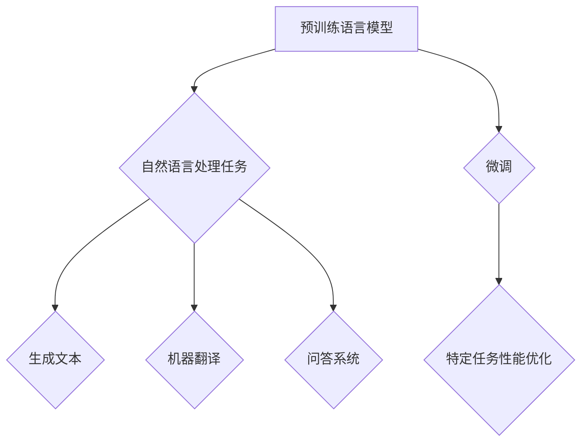

> - Andrej Karpathy
> - 人工智能
> - 深度学习
> - 自然语言处理
> - 机器学习
> - 人工智能伦理

# Andrej Karpathy：人工智能的未来变革

在人工智能领域，Andrej Karpathy是一位广受尊敬的专家，他的工作深刻影响了自然语言处理（NLP）和机器学习（ML）的发展。本文将深入探讨Andrej Karpathy的研究成果，分析他在人工智能领域的贡献，并展望其未来变革。

## 1. 背景介绍

Andrej Karpathy是一位俄罗斯出生的计算机科学家和工程师，目前是OpenAI的首席人工智能科学家。他在机器学习，特别是自然语言处理领域有着深厚的造诣。Karpathy以其对深度学习模型，特别是RNN和Transformer模型的贡献而闻名。

### 1.1 问题的由来

随着互联网的普及和数据的爆炸性增长，人工智能开始从理论走向实践。Karpathy的研究主要集中在如何利用深度学习技术解决实际问题，特别是在NLP领域。

### 1.2 研究现状

Karpathy的研究工作推动了NLP领域的多项进展，包括神经网络语言模型的构建和优化，以及这些模型在现实世界中的应用。

### 1.3 研究意义

Karpathy的研究对于推动人工智能技术的发展具有重要意义，他的工作不仅提高了NLP任务的性能，也为人工智能的伦理和未来发展提供了宝贵的见解。

### 1.4 本文结构

本文将分为以下几个部分：
- 介绍Andrej Karpathy的核心概念和联系。
- 分析其核心算法原理和操作步骤。
- 探讨数学模型和公式。
- 展示项目实践中的代码实例。
- 讨论实际应用场景和未来应用展望。
- 推荐相关工具和资源。
- 总结未来发展趋势与挑战。

## 2. 核心概念与联系

### 2.1 核心概念

Karpathy的核心概念包括：

- **神经网络语言模型**：用于生成文本、翻译、问答等任务。
- **Transformer模型**：一种基于自注意力机制的深度学习模型，用于NLP任务。
- **预训练**：在大量无标注数据上进行训练，以学习通用语言表示。
- **微调**：在特定任务上有标签数据上进行训练，以优化模型在特定任务上的性能。

### 2.2 Mermaid 流程图



## 3. 核心算法原理 & 具体操作步骤

### 3.1 算法原理概述

Karpathy的核心算法原理是基于深度学习模型，特别是RNN和Transformer，进行预训练和微调。

### 3.2 算法步骤详解

1. **预训练**：在大量无标注数据上进行预训练，学习通用语言表示。
2. **微调**：在特定任务上有标签数据上进行微调，优化模型在特定任务上的性能。
3. **评估**：在测试集上评估模型性能，调整超参数，重复步骤2和3。

### 3.3 算法优缺点

**优点**：
- **强大的语言理解能力**：预训练模型可以理解复杂的语言结构和上下文。
- **高性能**：在多种NLP任务上取得了SOTA性能。

**缺点**：
- **计算资源需求高**：预训练和微调需要大量的计算资源。
- **数据依赖性**：模型的性能高度依赖于训练数据的质量。

### 3.4 算法应用领域

Karpathy的算法在以下领域得到应用：

- 文本生成
- 机器翻译
- 问答系统
- 命名实体识别
- 情感分析

## 4. 数学模型和公式 & 详细讲解 & 举例说明

### 4.1 数学模型构建

Karpathy的数学模型基于深度学习，特别是神经网络。

### 4.2 公式推导过程

假设我们有一个输入序列 $X = (x_1, x_2, ..., x_T)$，其中 $x_t$ 是一个词汇的索引。模型的目标是预测下一个词汇 $y_{t+1}$。

$$
P(y_{t+1} | x_1, x_2, ..., x_t) = \sigma(W(y_{t+1}|x_1, x_2, ..., x_t))
$$

其中 $W(y_{t+1}|x_1, x_2, ..., x_t)$ 是一个权重矩阵，$\sigma$ 是一个非线性激活函数。

### 4.3 案例分析与讲解

Karpathy在论文《The Unreasonable Effectiveness of Recurrent Neural Networks》中，分析了RNN在语言模型中的应用。他展示了如何使用RNN生成文本，并探讨了RNN的局限性。

## 5. 项目实践：代码实例和详细解释说明

### 5.1 开发环境搭建

为了进行项目实践，你需要安装以下工具：

- Python 3.x
- TensorFlow或PyTorch
- NumPy

### 5.2 源代码详细实现

以下是一个使用PyTorch实现的简单的语言模型：

```python
import torch
import torch.nn as nn

class LanguageModel(nn.Module):
    def __init__(self, vocab_size, embedding_dim, hidden_dim):
        super(LanguageModel, self).__init__()
        self.embedding = nn.Embedding(vocab_size, embedding_dim)
        self.rnn = nn.LSTM(embedding_dim, hidden_dim)
        self.fc = nn.Linear(hidden_dim, vocab_size)
    
    def forward(self, x):
        x = self.embedding(x)
        output, _ = self.rnn(x)
        output = self.fc(output[-1])
        return output

# 实例化模型
model = LanguageModel(vocab_size=10000, embedding_dim=256, hidden_dim=512)
```

### 5.3 代码解读与分析

这个简单的语言模型使用了嵌入层、LSTM层和全连接层。嵌入层将词汇索引转换为嵌入向量，LSTM层处理序列数据，全连接层输出预测的词汇概率。

### 5.4 运行结果展示

为了展示模型的运行结果，我们可以生成一些文本：

```python
def sample(model, length, start_string):
    model.eval()
    with torch.no_grad():
        inputs = torch.tensor(start_string, dtype=torch.long).unsqueeze(0)
        for i in range(length):
            outputs = model(inputs)
            _, next_word = torch.max(outputs, dim=1)
            next_word = next_word.item()
            inputs = torch.cat((inputs, torch.tensor([next_word], dtype=torch.long)), dim=1)
            print(next_word)

sample(model, length=100, start_string="The ")
```

## 6. 实际应用场景

Karpathy的算法在以下实际应用场景中得到应用：

- **文本生成**：用于生成新闻、故事、诗歌等。
- **机器翻译**：将一种语言翻译成另一种语言。
- **问答系统**：回答用户提出的问题。
- **命名实体识别**：识别文本中的实体，如人名、地点等。
- **情感分析**：分析文本的情感倾向。

## 7. 工具和资源推荐

### 7.1 学习资源推荐

- 《Deep Learning》[Goodfellow, Bengio, Courville]
- 《Natural Language Processing with Python》[Bird, Klein, Loper]
- 《The Unreasonable Effectiveness of Recurrent Neural Networks》[Karpathy]

### 7.2 开发工具推荐

- TensorFlow
- PyTorch
- Hugging Face Transformers

### 7.3 相关论文推荐

- "The Unreasonable Effectiveness of Recurrent Neural Networks"[Karpathy]
- "Attention is All You Need"[Vaswani et al.]
- "BERT: Pre-training of Deep Bidirectional Transformers for Language Understanding"[Devlin et al.]

## 8. 总结：未来发展趋势与挑战

### 8.1 研究成果总结

Karpathy的研究推动了NLP和机器学习领域的发展，他的工作对于理解和使用深度学习模型具有重要意义。

### 8.2 未来发展趋势

- **更强大的模型**：随着计算能力的提升，未来可能会出现更强大的模型。
- **更有效的训练方法**：研究新的训练方法，以提高模型的效率和性能。
- **更广泛的应用**：将人工智能技术应用于更多领域。

### 8.3 面临的挑战

- **数据隐私**：如何处理和保护数据隐私是一个重要挑战。
- **伦理问题**：人工智能的决策过程可能存在偏见，需要解决伦理问题。
- **可解释性**：如何提高模型的可解释性是一个挑战。

### 8.4 研究展望

Karpathy的工作为人工智能的未来发展提供了宝贵的见解，他的研究成果将继续推动人工智能技术的发展。

## 9. 附录：常见问题与解答

**Q1：Andrej Karpathy的主要研究领域是什么？**

A: Andrej Karpathy的主要研究领域是自然语言处理（NLP）和机器学习（ML），特别是在深度学习模型的应用方面。

**Q2：Karpathy的工作如何影响人工智能的发展？**

A: Karpathy的工作推动了NLP和机器学习领域的发展，他的研究成果对于理解和使用深度学习模型具有重要意义。

**Q3：如何开始学习人工智能？**

A: 学习人工智能可以从学习Python编程语言开始，然后学习机器学习和深度学习的概念，并实践相关项目。

作者：禅与计算机程序设计艺术 / Zen and the Art of Computer Programming