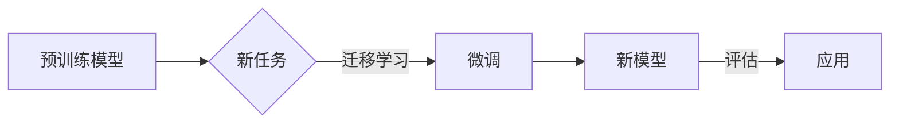

> 关键词：Python深度学习，迁移学习，模型效能，预训练模型，神经网络，卷积神经网络，循环神经网络，神经网络架构搜索，模型压缩，量化

# Python深度学习实践：运用迁移学习提升模型效能

深度学习技术在近年来取得了巨大的进步，它在图像识别、自然语言处理、语音识别等领域都展现出了惊人的能力。然而，深度学习模型的训练通常需要大量的数据和高性能计算资源。迁移学习（Transfer Learning）作为一种有效的深度学习技术，通过利用现有模型的知识来提升新模型在特定任务上的效能，从而降低了训练成本，提高了模型效率。本文将深入探讨Python深度学习中迁移学习的实践方法，包括核心概念、算法原理、项目实践以及未来发展趋势。

## 1. 背景介绍

### 1.1 问题的由来

随着深度学习模型的复杂度不断提高，训练这些模型所需的数据量和计算资源也随之增加。对于许多研究者和小型团队来说，收集和标注大量数据以及拥有强大的计算资源是一项巨大的挑战。为了解决这个问题，迁移学习应运而生。

### 1.2 研究现状

迁移学习通过将预训练模型的知识迁移到新的任务中，大大减少了训练所需的数据量和计算资源。目前，迁移学习已经在多个领域得到了广泛的应用，如计算机视觉、自然语言处理和语音识别等。

### 1.3 研究意义

迁移学习对于以下方面具有重要意义：

- **降低训练成本**：通过复用预训练模型的知识，减少了对大量标注数据的依赖。
- **提高模型效率**：预训练模型已经学习到了丰富的特征表示，可以直接应用于新的任务，从而加速训练过程。
- **拓展应用领域**：即使是资源有限的小团队或研究者，也可以利用迁移学习开发高性能的深度学习模型。

### 1.4 本文结构

本文将按照以下结构展开：

- 介绍迁移学习的核心概念和联系。
- 解释迁移学习算法的原理和具体操作步骤。
- 通过数学模型和公式详细讲解迁移学习的基本概念。
- 提供一个基于Python的迁移学习项目实践实例。
- 探讨迁移学习在实际应用场景中的应用。
- 展望迁移学习的未来发展趋势和挑战。
- 推荐相关的学习资源、开发工具和参考文献。
- 总结研究成果，并展望未来的研究方向。

## 2. 核心概念与联系

### 2.1 核心概念

#### 预训练模型

预训练模型是在大规模数据集上预先训练好的深度学习模型，它已经学习到了一些通用的特征表示。预训练模型可以是卷积神经网络（CNN）、循环神经网络（RNN）或Transformer等。

#### 迁移学习

迁移学习是一种利用预训练模型的知识来加速新模型训练的技术。它将预训练模型迁移到新的任务上，通过在新的数据集上微调模型，使其适应新的任务。

#### 微调

微调是迁移学习的一个重要步骤，它是指在预训练模型的基础上，针对新的任务进行参数优化，以适应新的数据分布和任务需求。

### 2.2 架构的 Mermaid 流程图



## 3. 核心算法原理 & 具体操作步骤

### 3.1 算法原理概述

迁移学习的基本原理是利用预训练模型中已经学习到的特征表示来加速新模型的训练。预训练模型通常在大规模数据集上进行训练，从而学习到了丰富的特征表示，这些特征表示可以用于新的任务。

### 3.2 算法步骤详解

迁移学习的具体步骤如下：

1. **选择预训练模型**：根据新任务的特点选择合适的预训练模型。
2. **数据预处理**：对新数据进行预处理，使其与预训练模型的输入格式兼容。
3. **模型微调**：在预训练模型的基础上进行微调，以适应新的任务。
4. **模型评估**：在新数据集上评估模型的性能。
5. **模型应用**：将微调后的模型应用于实际任务。

### 3.3 算法优缺点

#### 优点

- 降低训练成本：无需从头开始训练，只需在新数据集上微调预训练模型。
- 提高模型效率：预训练模型已经学习到了丰富的特征表示，可以直接应用于新的任务。
- 拓展应用领域：即使是资源有限的小团队或研究者，也可以利用迁移学习开发高性能的深度学习模型。

#### 缺点

- 预训练模型的泛化能力有限：预训练模型是在特定数据集上训练的，可能无法适应所有任务。
- 模型参数的迁移效率：并非所有预训练模型的参数都适合迁移到新任务。
- 微调过程中的过拟合风险：如果新数据集与预训练数据集差异较大，模型可能会过拟合新数据集。

### 3.4 算法应用领域

迁移学习可以应用于以下领域：

- 计算机视觉：图像分类、目标检测、人脸识别等。
- 自然语言处理：文本分类、情感分析、机器翻译等。
- 语音识别：语音识别、语音合成等。

## 4. 数学模型和公式 & 详细讲解 & 举例说明

### 4.1 数学模型构建

迁移学习中的数学模型通常包含以下部分：

- 预训练模型：通常是一个深层神经网络，其输入为原始数据，输出为特征表示。
- 微调层：在预训练模型的基础上添加的新层，用于适应新的任务。
- 损失函数：用于衡量模型预测结果与真实标签之间的差异。

### 4.2 公式推导过程

以下是一个简单的迁移学习模型的数学模型构建示例：

$$
\hat{y} = f(W_{\text{micro}} \cdot \phi(x))
$$

其中，$\hat{y}$ 是模型的预测输出，$x$ 是输入数据，$\phi(x)$ 是预训练模型输出的特征表示，$W_{\text{micro}}$ 是微调层的权重。

### 4.3 案例分析与讲解

以下是一个基于Python的迁移学习案例，使用预训练的CNN模型进行图像分类：

```python
import torch
import torch.nn as nn
from torchvision.models import resnet50
from torch.utils.data import DataLoader
from torchvision import datasets, transforms

# 加载预训练的ResNet50模型
model = resnet50(pretrained=True)

# 修改模型结构，去掉最后的全连接层
num_classes = 10  # 假设有10个类别
model.fc = nn.Linear(model.fc.in_features, num_classes)

# 定义损失函数和优化器
criterion = nn.CrossEntropyLoss()
optimizer = torch.optim.Adam(model.parameters(), lr=0.001)

# 加载训练数据
transform = transforms.Compose([
    transforms.Resize((224, 224)),
    transforms.ToTensor()
])

train_dataset = datasets.CIFAR10(root='./data', train=True, download=True, transform=transform)
train_loader = DataLoader(train_dataset, batch_size=32, shuffle=True)

# 训练模型
for epoch in range(10):
    for data, target in train_loader:
        optimizer.zero_grad()
        output = model(data)
        loss = criterion(output, target)
        loss.backward()
        optimizer.step()
```

## 5. 项目实践：代码实例和详细解释说明

### 5.1 开发环境搭建

为了运行上述代码实例，你需要以下开发环境：

- Python 3.6+
- PyTorch 1.5+
- torchvision

### 5.2 源代码详细实现

以下是上述代码实例的详细解释：

- 首先，我们导入了必要的库，包括torch、torch.nn、torchvision.models、torchvision.datasets和torchvision.transforms。
- 然后，我们加载了预训练的ResNet50模型。
- 接下来，我们修改了模型的最后一层，以适应CIFAR-10数据集的10个类别。
- 我们定义了损失函数和优化器。
- 最后，我们加载了CIFAR-10数据集，并开始训练模型。

### 5.3 代码解读与分析

在这个代码实例中，我们使用了PyTorch框架来构建和训练一个迁移学习模型。首先，我们加载了一个预训练的ResNet50模型，它是一个在ImageNet数据集上预训练的卷积神经网络。然后，我们修改了模型的最后一层，以适应CIFAR-10数据集的10个类别。这是因为预训练模型通常是在不同的数据集上训练的，其最后一层的输出类别数可能与新任务的需求不符。

我们使用交叉熵损失函数作为损失函数，它是分类任务中常用的损失函数。优化器使用的是Adam，它是一种自适应学习率优化器。

最后，我们加载了CIFAR-10数据集，并开始训练模型。在训练过程中，我们使用DataLoader来批量加载数据，这样可以提高训练效率。

### 5.4 运行结果展示

在训练完成后，我们可以在验证集上评估模型的性能。以下是一个简单的评估代码：

```python
# 评估模型
correct = 0
total = 0
with torch.no_grad():
    for data, target in test_loader:
        outputs = model(data)
        _, predicted = torch.max(outputs.data, 1)
        total += target.size(0)
        correct += (predicted == target).sum().item()

print(f'Accuracy of the network on the 10000 test images: {100 * correct // total}%')
```

## 6. 实际应用场景

迁移学习在实际应用场景中具有广泛的应用，以下是一些常见的应用场景：

- **图像识别**：使用预训练的CNN模型进行物体识别、场景识别等。
- **自然语言处理**：使用预训练的语言模型进行文本分类、情感分析、机器翻译等。
- **语音识别**：使用预训练的语音识别模型进行语音转文字、语音合成等。
- **医疗诊断**：使用预训练的医学图像分析模型进行疾病检测、病变识别等。

## 7. 工具和资源推荐

### 7.1 学习资源推荐

- 《深度学习》 [Goodfellow, Ian; Bengio, Yoshua; Courville, Aaron]
- 《Python深度学习》 [Goodfellow, Ian; Bengio, Yoshua; Courville, Aaron]
- PyTorch官方文档：https://pytorch.org/docs/stable/index.html

### 7.2 开发工具推荐

- PyTorch：https://pytorch.org/
- TensorFlow：https://www.tensorflow.org/
- Keras：https://keras.io/

### 7.3 相关论文推荐

- "Deep Learning for Image Recognition: A Review" [Deng, J., Dong, W., Socher, R., Li, L. J., Li, K., & Li, F. F.]
- "A Survey on Transfer Learning" [Pan, S. J., & Yang, Q.]
- "Bengio, Y., Courville, A., & Bengio, Y. (2009). Representation learning: A review and new perspectives." [Bengio, Y., Courville, A., & Bengio, Y.]

## 8. 总结：未来发展趋势与挑战

### 8.1 研究成果总结

迁移学习作为一种有效的深度学习技术，在多个领域都取得了显著的应用成果。通过复用预训练模型的知识，迁移学习降低了训练成本，提高了模型效率，并拓展了应用领域。

### 8.2 未来发展趋势

- **更强大的预训练模型**：随着计算能力的提升，未来可能会有更强大的预训练模型出现，它们将包含更多的知识，并能够处理更复杂的任务。
- **更有效的迁移学习策略**：研究更有效的迁移学习策略，以更好地利用预训练模型的知识，并减少对新数据的依赖。
- **多模态迁移学习**：将迁移学习扩展到多模态数据，如文本、图像和语音，以处理更复杂的问题。

### 8.3 面临的挑战

- **数据不匹配**：预训练模型通常是在大规模数据集上训练的，而新任务的数据集可能与预训练数据集不完全匹配，这可能导致迁移效果不佳。
- **模型泛化能力**：迁移学习模型的泛化能力有限，可能无法适应所有新任务。
- **模型解释性**：迁移学习模型的内部工作机制难以解释，这可能会影响其在某些领域的应用。

### 8.4 研究展望

未来的研究将集中在以下方面：

- 开发更有效的迁移学习算法，以更好地利用预训练模型的知识。
- 研究如何提高迁移学习模型的泛化能力。
- 开发可解释的迁移学习模型，以提高其在关键领域的应用信心。

## 9. 附录：常见问题与解答

**Q1：迁移学习是否适用于所有深度学习任务？**

A1：迁移学习适用于大多数深度学习任务，特别是那些数据量较小的任务。然而，对于一些需要特定领域知识的任务，可能需要额外的领域知识或专门的预训练模型。

**Q2：如何选择合适的预训练模型？**

A2：选择合适的预训练模型取决于新任务的特点。例如，对于图像识别任务，可以使用预训练的CNN模型；对于自然语言处理任务，可以使用预训练的语言模型。

**Q3：如何评估迁移学习的效果？**

A3：评估迁移学习的效果可以通过比较新模型在特定任务上的性能和从头开始训练的模型在相同任务上的性能来完成。

**Q4：迁移学习是否可以与其他深度学习技术结合使用？**

A4：是的，迁移学习可以与其他深度学习技术结合使用，如模型压缩、量化、神经网络架构搜索等，以进一步提高模型性能和效率。

**Q5：迁移学习是否可以应用于无监督学习任务？**

A5：迁移学习通常用于监督学习任务，但在某些情况下，也可以应用于无监督学习任务，如自编码器和生成对抗网络。

作者：禅与计算机程序设计艺术 / Zen and the Art of Computer Programming