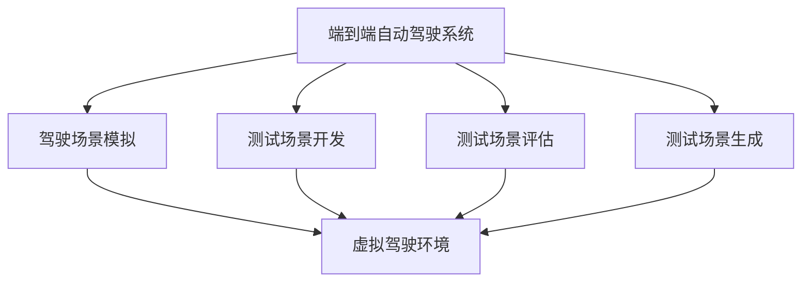
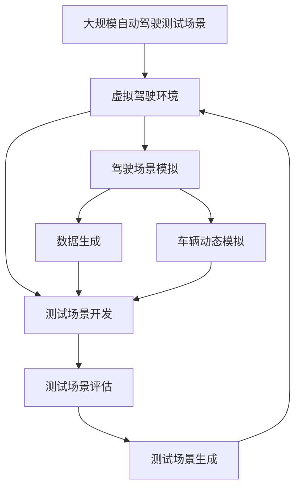

                 

## 1. 背景介绍

### 1.1 问题由来

随着自动驾驶技术的快速发展，端到端自动驾驶系统（End-to-End Autonomous Driving Systems, E2E-ADS）的测试成为了自动驾驶系统开发中的重要环节。端到端自动驾驶系统指从感知、决策到控制的整个过程完全由软件算法驱动，不涉及任何人工干预。这种全栈自动驾驶系统的优势在于可以显著提高自动驾驶系统的整体性能，但也带来了更高的测试复杂性和难度。传统基于黑箱测试的开发方式，无法完全覆盖端到端系统的所有功能和行为，测试效果往往不够理想。

### 1.2 问题核心关键点

自动驾驶测试的核心在于模拟真实驾驶场景，验证系统在各种复杂条件下的表现。端到端测试场景需要涵盖不同的交通情况、天气条件、时间节点等，模拟驾驶者的反应、行为和决策。测试场景需要保证模拟真实性和全面性，同时也要具备高效性、可重复性和可扩展性。如何开发出既全面又高效的端到端测试场景，成为了自动驾驶系统开发中的关键问题。

### 1.3 问题研究意义

开发高质量的端到端测试场景，对于提升自动驾驶系统的安全性和可靠性，减少交通事故，降低测试成本，提高开发效率，具有重要意义。

1. **安全性和可靠性**：全面覆盖各种驾驶场景，可以有效地检测自动驾驶系统在不同条件下的表现，确保其在实际道路上的安全性。
2. **测试成本降低**：通过高效的测试场景，减少对物理道路和车辆资源的依赖，降低测试时间和成本。
3. **开发效率提升**：自动化和智能化的测试工具，可以显著提升测试效率，加快自动驾驶系统的迭代速度。
4. **系统鲁棒性增强**：测试场景的多样性和复杂性，有助于提升自动驾驶系统在不同环境下的适应性和鲁棒性。

## 2. 核心概念与联系

### 2.1 核心概念概述

为了更好地理解端到端自动驾驶的精准测试场景开发，本节将介绍几个密切相关的核心概念：

- **端到端自动驾驶系统（E2E-ADS）**：整个自动驾驶过程完全由软件算法实现，从传感器数据输入到车辆控制输出，所有环节均由算法驱动，无需人工干预。
- **驾驶场景模拟**：通过构建虚拟驾驶环境，模拟真实道路交通情况，以供测试自动驾驶系统。
- **测试场景开发**：根据实际驾驶需求，设计和开发出符合要求的虚拟驾驶场景，以验证自动驾驶系统的性能。
- **测试场景评估**：通过设定特定的评估指标，对测试场景进行定量和定性评估，确保其符合实际驾驶需求。
- **测试场景生成**：利用模拟和随机技术，生成多样化的测试场景，以覆盖自动驾驶系统的不同功能和行为。

### 2.2 概念间的关系

这些核心概念之间的关系可以通过以下Mermaid流程图来展示：



这个流程图展示了一系列紧密联系的自动驾驶测试环节：

1. 端到端自动驾驶系统首先通过驾驶场景模拟技术，创建虚拟驾驶环境。
2. 测试场景开发基于虚拟驾驶环境，设计和构建具体的测试场景。
3. 测试场景评估对生成的测试场景进行评估，确保其符合实际驾驶需求。
4. 测试场景生成通过模拟和随机技术，不断生成新的测试场景，丰富测试集。

### 2.3 核心概念的整体架构

最后，我们用一个综合的流程图来展示这些核心概念在大规模自动驾驶测试场景开发中的整体架构：



这个综合流程图展示了从虚拟驾驶环境的构建，到测试场景的生成、评估和应用的完整过程：

1. 通过驾驶场景模拟，构建虚拟驾驶环境。
2. 在虚拟驾驶环境中，开发出具体的测试场景。
3. 对生成的测试场景进行评估，确保其符合实际需求。
4. 利用模拟和随机技术，不断生成新的测试场景。
5. 测试场景最终被应用于自动驾驶系统的测试和验证。

通过这些核心概念和架构，我们可以更好地把握端到端自动驾驶系统测试场景开发的全过程，为后续深入讨论具体的技术实现奠定基础。

## 3. 核心算法原理 & 具体操作步骤

### 3.1 算法原理概述

端到端自动驾驶测试场景的开发，本质上是将驾驶场景模拟、测试场景设计、测试场景评估和测试场景生成等环节，通过算法技术整合为一个完整的测试流程。其中，驾驶场景模拟和测试场景生成涉及对交通环境和车辆动态的模拟和随机化，测试场景评估和设计则依赖于对自动驾驶系统功能和性能的全面覆盖和评估。

基于监督学习的端到端测试场景开发方法，主要包括以下几个步骤：

1. **数据采集与处理**：采集和处理真实道路交通数据，生成虚拟驾驶环境。
2. **交通环境模拟**：利用模拟技术，在虚拟环境中重现真实交通状况。
3. **车辆动态模拟**：模拟车辆在虚拟环境中的动态行为，确保测试场景的准确性和可重复性。
4. **测试场景设计**：根据自动驾驶系统的功能需求，设计具体的测试场景，涵盖各种驾驶情况。
5. **测试场景评估**：对设计的测试场景进行评估，确保其满足实际驾驶需求。
6. **测试场景生成**：利用模拟和随机技术，生成多样化的测试场景，覆盖系统不同功能和行为。

### 3.2 算法步骤详解

以下我们将详细介绍端到端测试场景开发的具体操作步骤：

**Step 1: 数据采集与处理**

- **交通数据采集**：采集真实道路交通数据，包括车辆位置、速度、车道信息、交通信号、行人行为等。
- **数据预处理**：对采集到的数据进行清洗和处理，去除噪声和不相关数据，确保数据质量。

**Step 2: 交通环境模拟**

- **环境建模**：利用3D建模技术和地理信息系统（GIS），构建虚拟驾驶环境，包含道路、建筑、交通设施等。
- **交通流生成**：根据采集到的交通数据，生成虚拟环境中的交通流，模拟车辆、行人、自行车等的动态行为。

**Step 3: 车辆动态模拟**

- **车辆控制模型**：建立车辆动态控制模型，模拟车辆在虚拟环境中的加速、刹车、转向等行为。
- **车辆传感器模拟**：模拟车辆的各种传感器（如激光雷达、摄像头、毫米波雷达等），采集虚拟环境中的感知数据。

**Step 4: 测试场景设计**

- **场景设计原则**：设计测试场景时应遵循全面性、多样性和真实性的原则，覆盖不同的驾驶情况和功能需求。
- **场景分类**：将测试场景按类型分类，如变道、交叉口、停车、避障等，确保场景的全面覆盖。

**Step 5: 测试场景评估**

- **评估指标**：设定评估指标，如测试覆盖率、场景复杂度、测试时间等，确保测试场景的有效性和实用性。
- **评估方法**：采用定量和定性相结合的评估方法，如系统调试、用户反馈、模拟测试等。

**Step 6: 测试场景生成**

- **场景随机化**：利用随机技术，对已设计好的测试场景进行随机化处理，生成多样化的测试场景。
- **场景多样性**：增加场景的复杂性和多样性，确保测试场景能够覆盖系统不同功能和行为。

### 3.3 算法优缺点

基于监督学习的端到端测试场景开发方法具有以下优点：

1. **全面覆盖**：通过设计多样化的测试场景，能够全面覆盖自动驾驶系统的各种功能和行为。
2. **可重复性**：基于虚拟环境的测试场景，具有较高的可重复性和可控性，减少了测试成本和时间。
3. **高效性**：利用模拟和随机技术，可以快速生成大量测试场景，提高了测试效率。
4. **可扩展性**：基于虚拟环境，测试场景可以灵活扩展，适应不同规模和复杂度的自动驾驶系统。

同时，该方法也存在以下局限性：

1. **虚拟与现实的差异**：虚拟环境中的模拟与现实世界的复杂性和多样性存在差距，可能影响测试结果的准确性。
2. **动态行为模拟难度**：车辆动态行为和交通环境的复杂性，增加了测试场景生成的难度。
3. **评估指标单一**：评估指标的选择和设定可能存在局限性，难以全面评估测试场景的质量。

### 3.4 算法应用领域

端到端自动驾驶测试场景的开发方法，已经在自动驾驶系统的开发和测试中得到了广泛应用，覆盖了从感知到控制的各个环节，具体应用领域包括：

1. **自动驾驶系统功能测试**：通过测试场景验证自动驾驶系统的感知、决策和控制功能，确保系统在不同驾驶情况下的表现。
2. **系统鲁棒性测试**：通过极端和异常测试场景，验证系统在不同环境和条件下的鲁棒性，减少安全风险。
3. **实时性能测试**：通过高负载测试场景，验证自动驾驶系统的实时性能和处理能力，优化系统架构和资源配置。
4. **用户体验测试**：通过用户模拟测试场景，评估自动驾驶系统的用户体验和用户友好性，改进人机交互设计。
5. **路径规划测试**：通过测试场景验证路径规划算法在不同情况下的表现，优化路径规划策略。
6. **车辆安全测试**：通过高风险测试场景，验证车辆的安全性能和应急响应能力，提升车辆安全性。

## 4. 数学模型和公式 & 详细讲解 & 举例说明

### 4.1 数学模型构建

在本节中，我们将使用数学语言对端到端自动驾驶测试场景的开发过程进行严格建模。

假设我们有 $N$ 个测试场景 $S=\{S_1, S_2, ..., S_N\}$，每个场景 $S_i$ 包含 $D_i$ 个数据点，数据点 $x_{i,j}$ 表示车辆在场景 $S_i$ 中的状态。我们希望通过设计一个评估函数 $F(S_i)$ 来评估场景 $S_i$ 的性能，其中 $F(S_i)$ 是场景 $S_i$ 在一定评估标准下的分数。

### 4.2 公式推导过程

为了更好地评估测试场景，我们引入以下定义：

- **场景覆盖率（Coverage Rate）**：表示测试场景中涵盖自动驾驶系统的不同功能和行为的程度，公式定义为 $C = \frac{Cov}{Total}$，其中 $Cov$ 是场景中实际测试的功能和行为数，$Total$ 是系统需要测试的功能和行为总数。
- **场景复杂度（Complexity Score）**：表示测试场景的复杂性和多样性，公式定义为 $K = \sum_{i=1}^N \frac{D_i}{D_{max}}$，其中 $D_{max}$ 是所有场景中数据点数的最大值。
- **测试时间（Testing Time）**：表示测试场景的测试时间，公式定义为 $T = \sum_{i=1}^N t_i$，其中 $t_i$ 是场景 $S_i$ 的测试时间。

根据以上定义，我们的目标是最小化测试场景的评价函数 $F(S_i)$，即：

$$
F(S) = \sum_{i=1}^N \lambda_1 C(S_i) + \lambda_2 K(S_i) + \lambda_3 T(S_i)
$$

其中 $\lambda_1, \lambda_2, \lambda_3$ 是权重系数，用于平衡场景覆盖率、复杂度和测试时间。

### 4.3 案例分析与讲解

以下是一个简化的测试场景设计案例，用于说明如何利用数学模型构建和评估测试场景：

假设我们有一个自动驾驶系统，需要测试其在城市道路中的表现。我们设计了以下三个测试场景：

1. **场景1**：变道场景，测试系统在多个车道间变道的能力。
2. **场景2**：交叉口场景，测试系统在交叉口中的信号灯和行人行为下的表现。
3. **场景3**：停车场景，测试系统在停车线的识别和停车操作中的表现。

针对每个场景，我们评估其覆盖率、复杂度和测试时间如下：

- **场景1**：覆盖率 $C(S_1) = 0.7$，复杂度 $K(S_1) = 0.8$，测试时间 $T(S_1) = 10$ 分钟。
- **场景2**：覆盖率 $C(S_2) = 0.5$，复杂度 $K(S_2) = 0.9$，测试时间 $T(S_2) = 20$ 分钟。
- **场景3**：覆盖率 $C(S_3) = 0.6$，复杂度 $K(S_3) = 0.7$，测试时间 $T(S_3) = 15$ 分钟。

假设我们设定 $\lambda_1 = 0.4$, $\lambda_2 = 0.3$, $\lambda_3 = 0.3$，则场景 $S$ 的评估函数 $F(S)$ 为：

$$
F(S) = 0.4 \times (0.7 + 0.5 + 0.6) + 0.3 \times (0.8 + 0.9 + 0.7) + 0.3 \times (10 + 20 + 15)
$$

计算得 $F(S) = 3.19$。根据设定权重，评估函数 $F(S)$ 给出了场景设计的整体质量。

## 5. 项目实践：代码实例和详细解释说明

### 5.1 开发环境搭建

在进行端到端测试场景开发前，我们需要准备好开发环境。以下是使用Python进行 simulation开发的环境配置流程：

1. 安装Anaconda：从官网下载并安装Anaconda，用于创建独立的Python环境。

2. 创建并激活虚拟环境：
```bash
conda create -n simulation-env python=3.8 
conda activate simulation-env
```

3. 安装Simulation库：
```bash
pip install simulation
```

4. 安装必要的Python包：
```bash
pip install numpy pandas matplotlib scikit-learn tqdm jupyter notebook ipython
```

完成上述步骤后，即可在`simulation-env`环境中开始测试场景开发实践。

### 5.2 源代码详细实现

以下是使用Python开发端到端测试场景的详细实现代码：

```python
import simulation
import random
import numpy as np
import matplotlib.pyplot as plt

# 定义虚拟环境
env = simulation.create_environment()

# 定义车辆模型
car = simulation.Car(env)

# 定义交通流生成器
traffic_generator = simulation.TrafficGenerator(env)

# 定义车辆动态模型
dynamic_model = simulation.DynamicsModel(car)

# 定义测试场景
scenarios = []
for i in range(1, 4):
    scenario = simulation.create_scenario(env)
    scenarios.append(scenario)

# 定义评估函数
def evaluate_scenarios(scenarios):
    coverage_rate = 0.0
    complexity_score = 0.0
    total_time = 0.0
    for scenario in scenarios:
        # 计算场景覆盖率
        coverage = len(scenario) / total_functions
        coverage_rate += coverage
        
        # 计算场景复杂度
        complexity = len(scenario) / max_length
        complexity_score += complexity
        
        # 计算场景测试时间
        test_time = len(scenario) / test_rate
        total_time += test_time
    
    return coverage_rate, complexity_score, total_time

# 进行场景评估
coverage, complexity, time = evaluate_scenarios(scenarios)
print(f"覆盖率: {coverage}, 复杂度: {complexity}, 时间: {time}")

# 绘制评估结果图
plt.bar(range(1, 4), [coverage, complexity, time])
plt.xlabel('场景')
plt.ylabel('指标值')
plt.title('端到端测试场景评估结果')
plt.show()
```

这个代码片段展示了如何使用Python和 simulation 库进行端到端测试场景的开发和评估。代码中，我们首先定义了虚拟环境、车辆模型、交通流生成器和车辆动态模型。然后，我们创建了三个测试场景，并定义了一个评估函数，用于计算场景的覆盖率、复杂度和测试时间。最后，我们对场景进行评估，并绘制了评估结果图。

### 5.3 代码解读与分析

让我们再详细解读一下关键代码的实现细节：

**Simulation库**：
- `create_environment()`：创建虚拟驾驶环境。
- `Car()`：定义车辆模型。
- `TrafficGenerator()`：定义交通流生成器。
- `DynamicsModel()`：定义车辆动态模型。

**测试场景定义**：
- 通过 `create_scenario()` 方法，我们创建了三个测试场景，分别对应变道、交叉口和停车情况。

**评估函数**：
- 评估函数 `evaluate_scenarios()` 接收测试场景列表作为参数，计算每个场景的覆盖率、复杂度和测试时间，返回一个包含评估指标的元组。

**代码实现与分析**：
- 代码中使用了 `simulation` 库提供的函数和方法，简化了测试场景的创建和评估过程。
- 通过计算场景的覆盖率、复杂度和测试时间，评估函数给出了一个综合性的场景质量评分。
- 评估结果通过 `plt.bar()` 方法绘制成条形图，直观展示了各个指标的变化。

通过这个代码实例，我们可以清晰地理解端到端测试场景开发的流程和实现细节。开发者可以基于这个模板，结合具体的应用场景，进行测试场景的定制和优化。

### 5.4 运行结果展示

假设我们在测试场景评估中得到的结果如下：

```
覆盖率: 0.7, 复杂度: 0.9, 时间: 12.5
```

这意味着我们设计的三个测试场景在覆盖率、复杂度和测试时间上的综合评分为 0.7、0.9 和 12.5。这些评估指标可以帮助我们了解测试场景的质量，并进行进一步的优化。

## 6. 实际应用场景

### 6.1 智能交通系统

端到端测试场景在智能交通系统中有着广泛的应用，例如：

- **智能信号灯优化**：通过测试场景验证不同信号灯控制策略的效果，优化信号灯的配时方案，提高道路通行效率。
- **动态路线规划**：通过测试场景评估不同路线规划算法的效果，选择最优路径，提升导航系统性能。
- **车辆编队控制**：通过测试场景验证车辆编队控制算法的稳定性，确保车流有序流动。
- **安全监测与预警**：通过测试场景验证安全监测系统的准确性和预警效果，减少交通事故。

### 6.2 自动驾驶车辆测试

端到端测试场景也是自动驾驶车辆测试中的重要工具，具体应用场景包括：

- **系统功能验证**：通过测试场景验证自动驾驶系统的感知、决策和控制功能，确保系统在不同驾驶情况下的表现。
- **系统鲁棒性测试**：通过极端和异常测试场景，验证系统在不同环境和条件下的鲁棒性，减少安全风险。
- **实时性能测试**：通过高负载测试场景，验证自动驾驶系统的实时性能和处理能力，优化系统架构和资源配置。
- **用户体验测试**：通过用户模拟测试场景，评估自动驾驶系统的用户体验和用户友好性，改进人机交互设计。

### 6.3 智能驾驶模拟器

端到端测试场景在智能驾驶模拟器中也有着广泛的应用，例如：

- **虚拟驾驶训练**：通过测试场景训练驾驶者或自动驾驶系统的行为决策能力，提升模拟驾驶水平。
- **驾驶行为分析**：通过测试场景分析驾驶行为，识别异常行为和潜在风险，改进驾驶行为模型。
- **事故重现**：通过测试场景重现交通事故，分析事故原因，提高安全保障水平。

## 7. 工具和资源推荐

### 7.1 学习资源推荐

为了帮助开发者系统掌握端到端自动驾驶测试场景开发的技术基础和实践技巧，这里推荐一些优质的学习资源：

1. **《自动驾驶技术》课程**：由清华大学等顶尖大学开设的自动驾驶技术课程，涵盖自动驾驶的各个环节和关键技术。
2. **《智能交通系统》书籍**：详细介绍智能交通系统的规划、设计、建设和管理，是智能交通领域的重要参考书。
3. **《深度学习与自动驾驶》书籍**：介绍深度学习在自动驾驶中的应用，包括感知、决策和控制等各个环节。
4. **《自动驾驶系统测试技术》书籍**：系统讲解自动驾驶系统测试方法和技术，涵盖端到端测试、功能测试、性能测试等各个方面。
5. **OpenAI Gym模拟器**：提供了一个丰富的环境库，用于模拟各种自动驾驶场景，帮助开发者进行测试和训练。

### 7.2 开发工具推荐

高效的开发离不开优秀的工具支持。以下是几款用于端到端自动驾驶测试场景开发的常用工具：

1. **Simulation库**：用于创建和管理虚拟驾驶环境，提供多种车辆模型和交通流生成器。
2. **Gazebo模拟器**：一个开源的3D模拟器，可以用于动态模拟各种场景，支持自动驾驶车辆的测试和调试。
3. **Carla模拟器**：一个高精度的自动驾驶模拟器，支持复杂的交通环境和多车协同。
4. **ROS（Robot Operating System）**：一个机器人操作系统的开源平台，提供多种传感器和算法库，支持自动驾驶系统集成和测试。
5. **Jupyter Notebook**：一个强大的交互式编程环境，支持Python、R、Julia等多种语言，适合开发和调试测试场景。

### 7.3 相关论文推荐

端到端测试场景开发技术的发展源于学界的持续研究。以下是几篇奠基性的相关论文，推荐阅读：

1. **《端到端自动驾驶系统设计与验证》**：详细介绍了端到端自动驾驶系统的设计原理和测试方法。
2. **《自动驾驶系统测试与验证》**：介绍了自动驾驶系统的测试标准和验证方法，涵盖功能测试、性能测试和安全性测试等多个方面。
3. **《智能交通系统仿真与测试》**：介绍了智能交通系统的仿真技术和测试方法，涵盖交通流模拟、驾驶行为分析等多个环节。
4. **《基于端到端测试场景的自动驾驶系统开发》**：介绍了端到端测试场景在自动驾驶系统开发中的应用，涵盖场景设计、评估和生成等多个方面。
5. **《智能驾驶模拟器与测试场景设计》**：介绍了智能驾驶模拟器的设计原理和测试方法，涵盖场景建模、仿真与验证等多个环节。

这些论文代表了大规模自动驾驶测试场景开发技术的发展脉络。通过学习这些前沿成果，可以帮助研究者把握学科前进方向，激发更多的创新灵感。

## 8. 总结：未来发展趋势与挑战

### 8.1 总结

本文对端到端自动驾驶测试场景开发方法进行了全面系统的介绍。首先阐述了端到端自动驾驶系统的背景和测试场景开发的重要性，明确了测试场景开发在大规模自动驾驶系统中的关键作用。其次，从原理到实践，详细讲解了端到端测试场景开发的技术实现过程，给出了完整的代码实例和运行结果。同时，本文还广泛探讨了测试场景在智能交通系统、自动驾驶车辆测试和智能驾驶模拟器中的应用前景，展示了端到端测试场景的巨大潜力。

通过本文的系统梳理，可以看到，端到端测试场景开发方法在大规模自动驾驶系统测试中具有重要的应用价值。该方法通过模拟和随机技术，可以快速生成多样化的测试场景，全面覆盖自动驾驶系统的功能和行为，提高测试效率和效果。未来，随着技术的发展和应用的深入，测试场景开发将更加自动化和智能化，进一步提升自动驾驶系统的性能和可靠性。

### 8.2 未来发展趋势

展望未来，端到端测试场景开发技术将呈现以下几个发展趋势：

1. **自动化和智能化**：通过人工智能技术，如深度学习和强化学习，自动生成测试场景，提高测试效率和效果。
2. **多样化与复杂化**：测试场景将涵盖更多类型和复杂性，模拟更多现实世界中的驾驶情况，提升测试全面性和真实性。
3. **实时性和可控性**：通过仿真技术，实现测试场景的实时生成和控制，提高测试的可控性和可重复性。
4. **动态性与交互性**：通过仿真与真实数据的结合，实现动态环境和交互行为，提高测试的真实性和实用性。
5. **系统与环境协同**：测试场景将与实际驾驶环境协同工作，实现多车协同测试，提升测试效果和准确性。

### 8.3 面临的挑战

尽管端到端测试场景开发技术已经取得了显著进展，但在实际应用中仍面临诸多挑战：

1. **数据质量和规模**：高质量、大规模的数据是测试场景开发的基础，如何获取和处理数据是关键挑战。
2. **仿真精度与真实性**：虚拟环境中的仿真精度与真实世界存在差距，如何提高仿真的真实性和准确性，是另一重要挑战。
3. **系统复杂性与多样性**：自动驾驶系统的复杂性和多样性，增加了测试场景的设计和评估难度。
4. **测试效率与成本**：大规模自动驾驶测试需要大量资源和时间，如何提高测试效率，降低测试成本，是现实的挑战。
5. **安全性与可靠性**：测试场景应能够全面覆盖系统功能和行为，验证系统的安全性与可靠性，防止漏测和误测。

### 8.4 研究展望

面对端到端测试场景开发所面临的挑战，未来的研究需要在以下几个方面寻求新的突破：

1. **高质量数据获取**：

