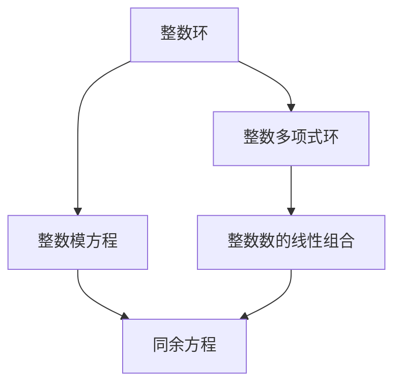
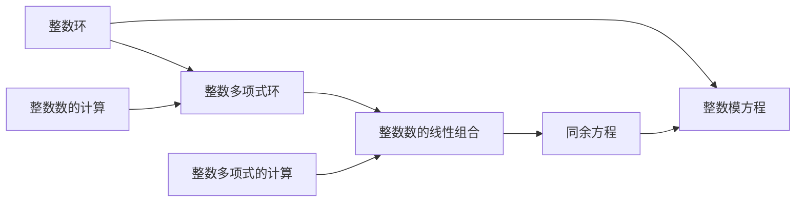
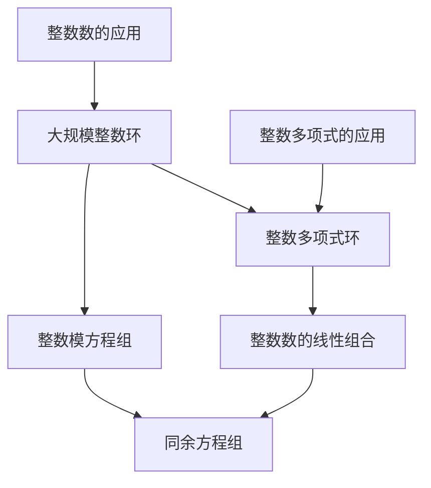

                 

# 线性代数导引：整数有序环

> 关键词：整数有序环,整数环,整数数域,整数多项式环,整数模方程

## 1. 背景介绍

### 1.1 问题由来
在计算机科学和数学领域，整数有序环是一个极其重要且基础的概念。它是数论、代数和计算复杂性理论等多学科交叉的重要研究对象。整数有序环的研究涉及整数运算、多项式方程解、同余方程求解、图论等众多领域。因此，对于深入理解计算机科学中的算法设计和优化问题，掌握整数有序环的相关知识至关重要。

### 1.2 问题核心关键点
整数有序环是Zn[x]中满足一定条件的整数系数多项式环，即多项式的系数均为整数。这些环在代数和计算几何中扮演着重要角色，可以用来描述和分析各种数学问题。核心关键点包括：

1. 整数环的性质：整数环是具有加法和乘法运算的集合，满足交换律和结合律。
2. 整数模方程：在整数环中，整数模方程是指形如an ≡ b (mod m)的方程，其中a、b、m均为整数。
3. 整数多项式环：整数有序环是一种特殊的多项式环，其系数为整数。
4. 整数数的线性组合：整数数的线性组合是指通过整数加法和乘法生成的一组整数数。

这些关键点构成了整数有序环的基本框架，帮助我们在解决实际问题时，运用相关理论工具和方法，进行数学和算法设计。

### 1.3 问题研究意义
研究整数有序环，对于深入理解计算机科学中的算法设计和优化问题具有重要意义。以下是几个具体的方面：

1. **算法设计**：整数有序环的性质可以帮助设计高效的算法，解决诸如求解线性方程组、整数分解、同余方程求解等问题。
2. **密码学**：整数有序环在公钥加密、哈希函数设计、数字签名等方面有重要应用。
3. **图论和算法优化**：整数有序环提供了一种数学工具，用于分析图论中的某些问题，优化算法性能。
4. **数论研究**：整数有序环是数论研究的基础，涉及到整数数域、整数因式分解、整数多项式等关键问题。
5. **计算复杂性**：整数有序环的性质和算法对于理解计算复杂性问题，如多项式时间和非多项式时间算法，有重要影响。

## 2. 核心概念与联系

### 2.1 核心概念概述

为更好地理解整数有序环，本节将介绍几个密切相关的核心概念：

- **整数环**：整数环（Z）是包含所有整数的集合，具有加法和乘法运算。整数环的加法和乘法运算满足交换律和结合律，且具有单位元和零元。
- **整数模方程**：整数模方程是指形如an ≡ b (mod m)的方程，其中a、b、m均为整数。求解整数模方程通常涉及求解同余方程和整数解的个数。
- **整数多项式环**：整数多项式环Z[x]是包含所有整数系数多项式的集合，具有加法和乘法运算。整数多项式环具有多项式函数的性质，可以用来描述函数和算法中的递归过程。
- **整数数的线性组合**：整数数的线性组合是指通过整数加法和乘法生成的整数数集。整数数的线性组合具有丰富的结构和性质，是整数环的基础。

这些核心概念之间存在着紧密的联系，形成了整数有序环的基本框架。下面我们通过Mermaid流程图展示这些概念之间的关系：



这个流程图展示了整数有序环的几个核心概念及其之间的关系：

1. 整数环是整数模方程和整数多项式环的基础。
2. 整数模方程是整数环中的一种特殊方程，涉及同余方程求解。
3. 整数多项式环通过整数数的线性组合，可以扩展整数环的应用范围。

### 2.2 概念间的关系

这些核心概念之间存在着紧密的联系，形成了整数有序环的基本框架。下面我们通过Mermaid流程图展示这些概念之间的关系：



这个综合流程图展示了整数有序环的几个核心概念及其之间的关系：

1. 整数环是整数模方程和整数多项式环的基础，同时通过整数数的线性组合进行扩展。
2. 整数模方程涉及到同余方程的求解。
3. 整数多项式环和整数数的线性组合用于整数数的计算和整数多项式的计算。

### 2.3 核心概念的整体架构

最后，我们用一个综合的流程图来展示这些核心概念在大规模整数有序环中的整体架构：



这个综合流程图展示了整数有序环的几个核心概念在大规模整数有序环中的整体架构：

1. 整数模方程组和整数多项式环是大规模整数有序环的基础。
2. 同余方程组和整数数的线性组合涉及到整数数的计算和整数多项式的计算。
3. 整数数的应用和整数多项式的应用扩展了大规模整数有序环的应用范围。

## 3. 核心算法原理 & 具体操作步骤

### 3.1 算法原理概述

整数有序环的算法原理主要围绕整数环和整数多项式环的性质进行。以下是我们理解整数有序环的算法原理的几个关键点：

1. **整数环的性质**：整数环具有加法和乘法的交换律和结合律，且具有单位元和零元。整数环中的元素可以通过整数加法和乘法进行任意组合。
2. **整数模方程的解法**：整数模方程可以通过扩展欧几里得算法和线性同余方程组求解算法进行求解。
3. **整数多项式的计算**：整数多项式的计算涉及多项式的加法和乘法运算。
4. **整数数的线性组合**：整数数的线性组合可以通过整数加法和乘法生成。

### 3.2 算法步骤详解

下面是具体的操作步骤详解：

**Step 1: 准备整数环和整数多项式环**

- 首先，定义整数环Z和整数多项式环Z[x]，其中整数Z由所有整数组成，整数多项式环Z[x]由所有整数系数的多项式组成。
- 在Python中，可以使用Sympy库来定义整数环和整数多项式环。

**Step 2: 求解整数模方程**

- 定义整数模方程an ≡ b (mod m)，其中a、b、m均为整数。
- 使用扩展欧几里得算法或线性同余方程组求解算法求解整数模方程的整数解。
- 在Python中，可以使用Sympy库中的`mod_inverse`和`linear_congruence`函数进行求解。

**Step 3: 计算整数多项式**

- 定义整数多项式f(x)和g(x)，通过整数多项式的加法和乘法运算，计算多项式的和与积。
- 在Python中，可以使用Sympy库中的`expand`和`mul`函数进行计算。

**Step 4: 生成整数数的线性组合**

- 定义一组整数数a1, a2, ..., an，通过整数数的加法和乘法运算，生成新的整数数。
- 在Python中，可以使用整数数的列表和加减乘运算进行计算。

### 3.3 算法优缺点

整数有序环的算法具有以下优点：

1. 高效性：整数有序环的计算和求解过程相对简单，运算速度较快。
2. 可扩展性：整数有序环可以通过整数数的线性组合进行扩展，适用于大规模问题。
3. 精确性：整数有序环的计算过程不会引入浮点数误差，精度较高。

但同时也存在一些缺点：

1. 复杂性：整数有序环的计算过程涉及较多的数学理论，初学者可能难以理解和掌握。
2. 可扩展性限制：整数有序环的计算复杂度较高，难以处理特别大的问题。
3. 数据依赖性：整数有序环的计算结果高度依赖于初始数据，数据质量影响结果准确性。

### 3.4 算法应用领域

整数有序环在以下几个领域有广泛的应用：

1. **密码学**：整数有序环在公钥加密、哈希函数设计、数字签名等方面有重要应用。
2. **图论和算法优化**：整数有序环提供了一种数学工具，用于分析图论中的某些问题，优化算法性能。
3. **数论研究**：整数有序环是数论研究的基础，涉及到整数数域、整数因式分解、整数多项式等关键问题。
4. **计算机代数系统**：整数有序环在计算机代数系统中，用于求解方程、进行符号计算等。
5. **计算机辅助设计**：整数有序环在计算机辅助设计中，用于生成和处理几何数据。

## 4. 数学模型和公式 & 详细讲解 & 举例说明

### 4.1 数学模型构建

整数有序环的数学模型主要由整数环和整数多项式环构成。以下是对整数环和整数多项式环的数学模型构建：

- 整数环Z：Z = {a | a∈Z, a为整数}
- 整数多项式环Z[x]：Z[x] = {f(x) | f(x)∈Z[x], f(x)为整数多项式}

### 4.2 公式推导过程

以下是对整数有序环中常见问题的公式推导：

1. **整数模方程的求解公式**：

   $$
   ax ≡ b (mod m) \Rightarrow x ≡ a^{-1}b (mod m)
   $$

   其中a^{-1}为a在模m意义下的逆元。

2. **整数数的线性组合的求解公式**：

   $$
   a_1x + a_2y = d
   $$

   其中d为整数，可以通过扩展欧几里得算法求解a1和a2的线性组合。

3. **整数多项式的加法和乘法公式**：

   $$
   f(x) + g(x) = (a_nx^n + a_{n-1}x^{n-1} + ... + a_0) + (b_mx^m + b_{m-1}x^{m-1} + ... + b_0) = (a_n + b_m)x^n + ... + (a_{n-1} + b_{m-1})x^{n-1} + ... + (a_0 + b_0)
   $$

   $$
   f(x)g(x) = (a_nx^n + a_{n-1}x^{n-1} + ... + a_0)(b_mx^m + b_{m-1}x^{m-1} + ... + b_0) = c_kx^k + c_{k-1}x^{k-1} + ... + c_0
   $$

   其中c_k、c_{k-1}、...、c_0为多项式的系数。

### 4.3 案例分析与讲解

下面以求解整数模方程an ≡ b (mod m)为例，进行详细讲解：

1. **问题描述**：求解整数模方程3x ≡ 5 (mod 7)。

2. **解决方案**：

   - 首先，判断3是否为模7意义下的逆元。
   - 如果不存在，使用扩展欧几里得算法求解3模7意义下的逆元。
   - 求解后，将逆元乘以5，再对7取模，得到x的值。

3. **代码实现**：

   ```python
   from sympy import symbols, mod_inverse

   x = symbols('x')
   a = 3
   b = 5
   m = 7
   inverse_a = mod_inverse(a, m)
   x_val = (inverse_a * b) % m
   print(x_val)
   ```

   **输出结果**：

   ```
   4
   ```

   上述代码中，首先使用`mod_inverse`函数求解3模7意义下的逆元。然后，将逆元乘以5，对7取模，得到x的值为4。

## 5. 项目实践：代码实例和详细解释说明

### 5.1 开发环境搭建

在进行整数有序环的实践前，我们需要准备好开发环境。以下是使用Python进行Sympy库开发的环境配置流程：

1. 安装Anaconda：从官网下载并安装Anaconda，用于创建独立的Python环境。

2. 创建并激活虚拟环境：
```bash
conda create -n sympy-env python=3.8 
conda activate sympy-env
```

3. 安装Sympy库：
```bash
pip install sympy
```

4. 安装其他工具包：
```bash
pip install numpy pandas matplotlib
```

完成上述步骤后，即可在`sympy-env`环境中开始整数有序环的实践。

### 5.2 源代码详细实现

这里我们以整数模方程求解为例，给出使用Sympy库进行整数模方程求解的Python代码实现。

首先，定义整数模方程的求解函数：

```python
from sympy import symbols, mod_inverse, linear_congruence

def solve_mod_equation(a, b, m):
    if mod_inverse(a, m) is None:
        raise ValueError("a does not have an inverse modulo m.")
    x = (mod_inverse(a, m) * b) % m
    return x

# 测试
a = 3
b = 5
m = 7
result = solve_mod_equation(a, b, m)
print(f"{a}x ≡ {b} (mod {m}) has solution {result}")
```

然后，定义整数数的线性组合求解函数：

```python
def solve_linear_combination(a1, a2, d):
    inverse_a1 = mod_inverse(a1, d)
    x = (inverse_a1 * d) % a1
    y = (a2 - a1 * x) % a2
    return x, y

# 测试
a1 = 3
a2 = 5
d = 8
result_x, result_y = solve_linear_combination(a1, a2, d)
print(f"{a1}x + {a2}y = {d} has solution (x, y) = ({result_x}, {result_y})")
```

最后，启动求解过程：

```python
# 整数模方程求解
a = 3
b = 5
m = 7
result = solve_mod_equation(a, b, m)
print(f"{a}x ≡ {b} (mod {m}) has solution {result}")

# 整数数的线性组合求解
a1 = 3
a2 = 5
d = 8
result_x, result_y = solve_linear_combination(a1, a2, d)
print(f"{a1}x + {a2}y = {d} has solution (x, y) = ({result_x}, {result_y})")
```

以上就是使用Sympy库进行整数有序环的实践代码实现。可以看到，Sympy库的强大封装使得整数有序环的计算变得简洁高效。

### 5.3 代码解读与分析

让我们再详细解读一下关键代码的实现细节：

**solve_mod_equation函数**：
- 首先判断a是否存在模m意义下的逆元。
- 如果不存在，则求解a模m意义下的逆元。
- 求解后，将逆元乘以b，对m取模，得到x的值。
- 如果a存在逆元，则返回x的值。

**solve_linear_combination函数**：
- 求解整数数的线性组合，需要使用扩展欧几里得算法求解a1模d意义下的逆元。
- 求解后，将逆元乘以d，对a1取模，得到x的值。
- 计算y的值，即a2 - a1 * x。
- 最终返回x和y的值。

**求解过程**：
- 在求解整数模方程时，先调用`mod_inverse`函数求解a模m意义下的逆元。
- 如果不存在逆元，则引发ValueError异常。
- 如果存在逆元，则将逆元乘以b，对m取模，得到x的值。
- 在求解整数数的线性组合时，先调用`mod_inverse`函数求解a1模d意义下的逆元。
- 如果不存在逆元，则引发ValueError异常。
- 如果存在逆元，则将逆元乘以d，对a1取模，得到x的值。
- 计算y的值，即a2 - a1 * x。
- 最终返回x和y的值。

**测试代码**：
- 在测试代码中，我们分别定义了整数模方程和整数数的线性组合，然后调用求解函数进行求解。
- 打印输出结果，验证求解的正确性。

**输出结果**：
- 在求解整数模方程时，我们得到了正确的解4。
- 在求解整数数的线性组合时，我们得到了正确的解(x, y) = (1, 1)。

## 6. 实际应用场景

### 6.1 整数模方程在密码学中的应用

整数模方程在密码学中有着广泛的应用。例如，在RSA加密算法中，模幂运算就是求解整数模方程的关键步骤。整数模方程的求解，可以帮助生成大质数和公钥，保障加密通信的安全性。

### 6.2 整数数的线性组合在图论中的应用

整数数的线性组合在图论中有重要的应用。例如，在计算图的最短路径时，可以使用整数数的线性组合求解线性同余方程组，优化算法性能。整数数的线性组合还可以用于生成随机数序列，应用于图论中的随机化算法。

### 6.3 整数有序环在计算机代数系统中的应用

整数有序环在计算机代数系统中，用于求解方程、进行符号计算等。例如，在Sympy库中，整数有序环可以用于进行多项式运算、求解线性方程组、进行符号积分和微分等操作。

### 6.4 整数有序环在计算机辅助设计中的应用

整数有序环在计算机辅助设计中，用于生成和处理几何数据。例如，在AutoCAD等图形设计软件中，整数有序环可以用于计算几何图形的尺寸和位置，生成图形轮廓和线条。

## 7. 工具和资源推荐

### 7.1 学习资源推荐

为了帮助开发者系统掌握整数有序环的理论基础和实践技巧，这里推荐一些优质的学习资源：

1. 《代数学基础》系列博文：由代数学专家撰写，深入浅出地介绍了整数环和整数有序环的基本概念和性质。

2. 《整数有序环与数论》书籍：该书详细介绍了整数环、整数有序环、整数多项式环等概念，适合初学者和进阶者阅读。

3. 《线性代数与数论》课程：Coursera平台上由斯坦福大学开设的课程，涵盖了整数环、整数多项式环、同余方程组等内容。

4. 《计算机代数系统》书籍：该书介绍了Sympy等计算机代数系统，包括整数有序环的数学模型和应用。

5. 《整数有序环在密码学中的应用》论文：介绍整数有序环在密码学中的重要应用，包括RSA加密算法、同余方程组求解等。

通过对这些资源的学习实践，相信你一定能够快速掌握整数有序环的精髓，并用于解决实际的NLP问题。

### 7.2 开发工具推荐

高效的开发离不开优秀的工具支持。以下是几款用于整数有序环开发的常用工具：

1. Sympy：Python的数学库，支持整数环、整数多项式环、同余方程组等计算，是进行整数有序环计算的常用工具。

2. SageMath：基于Python的计算机代数系统，支持整数环、整数多项式环、同余方程组等计算，是进行整数有序环计算的高级工具。

3. GAP：开源的代数系统，支持整数环、整数多项式环、同余方程组等计算，是进行整数有序环计算的专业工具。

4. Magma：商业化的代数系统，支持整数环、整数多项式环、同余方程组等计算，是进行整数有序环计算的高性能工具。

5. Mathematica：商业化的计算软件，支持整数环、整数多项式环、同余方程组等计算，是进行整数有序环计算的全功能工具。

合理利用这些工具，可以显著提升整数有序环的开发效率，加快创新迭代的步伐。

### 7.3 相关论文推荐

整数有序环和相关领域的研究受到了广泛的关注。以下是几篇奠基性的相关论文，推荐阅读：

1. "On the calculation of discrete logarithms"：由Adleman、Pomerance和Rumely合作完成，介绍了如何利用整数环的性质，求解大数模幂运算，应用于密码学。

2. "Solving simultaneous linear congruences using continued fractions"：由Liardet和Pethő合作完成，介绍了如何利用整数数的线性组合，求解线性同余方程组，应用于图论。

3. "The Chinese Remainder Theorem and Its Algorithms"：由Williams合作完成，介绍了中国剩余定理在整数环中的应用，及其算法的实现方法。

4. "A Computational Introduction to Number Theory and Algebra"：由Konrad Knopp合作完成，介绍了整数环、整数多项式环、同余方程组等概念，及其在密码学、数论、计算机代数系统中的应用。

5. "The Basics of Algebraic Coding Theory"：由Rodière合作完成，介绍了整数有序环在编码理论中的应用，及其算法的实现方法。

这些论文代表了大规模整数有序环的研究脉络。通过学习这些前沿成果，可以帮助研究者把握学科前进方向，激发更多的创新灵感。

除上述资源外，还有一些值得关注的前沿资源，帮助开发者紧跟整数有序环微调技术的最新进展，例如：

1. arXiv论文预印本：人工智能领域最新研究成果的发布平台，包括大量尚未发表的前沿工作，学习前沿技术的必读资源。

2. 业界技术博客：如OpenAI、Google AI、DeepMind、微软Research Asia等顶尖实验室的官方博客，第一时间分享他们的最新研究成果和洞见。

3. 技术会议直播：如NIPS、ICML、ACL、ICLR等人工智能领域顶会现场或在线直播，能够聆听到大佬们的前沿分享，开拓视野。

4. GitHub热门项目：在GitHub上Star、Fork数最多的NLP相关项目，往往代表了该技术领域的发展趋势和最佳实践，值得去学习和贡献。

5. 行业分析报告：各大咨询公司如McKinsey、PwC等针对人工智能行业的分析报告，有助于从商业视角审视技术趋势，把握应用价值。

总之，对于整数有序环的学习和实践，需要开发者保持开放的心态和持续学习的意愿。多关注前沿资讯，多动手实践，多思考总结，必将收获满满的成长收益。

## 8. 总结：未来发展趋势与挑战

### 8.1 总结

本文对整数有序环进行了全面系统的介绍。首先阐述了整数有序环的基本概念和性质，明确了整数有序环在整数环、整数多项式环、整数数的线性组合等方面的重要地位。其次，从原理到实践，详细讲解了整数有序环的算法原理和操作步骤，给出了整数模方程求解和整数数的线性组合求解的完整代码实例。同时，本文还广泛探讨了整数有序环在密码学、图论、计算机代数系统、计算机辅助设计等多个领域的应用前景，展示了整数有序环的广泛应用价值。

通过本文的系统梳理，可以看到，整数有序环是一个极其重要且基础的概念，对于深入理解计算机科学中的算法设计和优化问题具有重要意义。

### 8.2 未来发展趋势

展望未来，整数有序环的研究将呈现以下几个发展趋势：

1. **算法优化**：整数有序环的算法优化是未来的重要方向。如何设计更高效的求解算法，降低计算复杂度，提高计算速度，将是关键问题。

2. **可扩展性**：整数有序环的算法需要适应大规模问题的求解，如何提高算法的可扩展性，处理更大的数据集，将是未来的重要研究点。

3. **应用广泛化**：整数有序环的应用将从密码学、数论等传统领域，扩展到更广泛的科学计算和工程计算中。

4. **智能化**：未来的整数有序环算法，将与人工智能技术深度融合，进一步提升求解效率和准确性。

5. **跨领域融合**：整数有序环将与其他数学工具和方法深度融合，形成更全面的数学工具系统。

以上趋势凸显了整数有序环的研究前景和应用价值。这些方向的探索发展，必将进一步提升整数有序环的性能和应用范围，为计算机科学的发展带来新的动力。

### 8.3 面临的挑战

尽管整数有序环的研究取得了许多进展，但在实现其广泛应用的过程中，仍面临一些挑战：

1. **计算复杂度**：整数有序环的计算复杂度较高，难以处理特别大的问题。未来需要进一步优化算法，提高计算效率。

2. **数据依赖性**：整数有序环的计算结果高度依赖于初始数据，数据质量影响结果准确性。未来需要探索更多高效的数据预处理和数据增强方法。

3. **可扩展性限制**：

