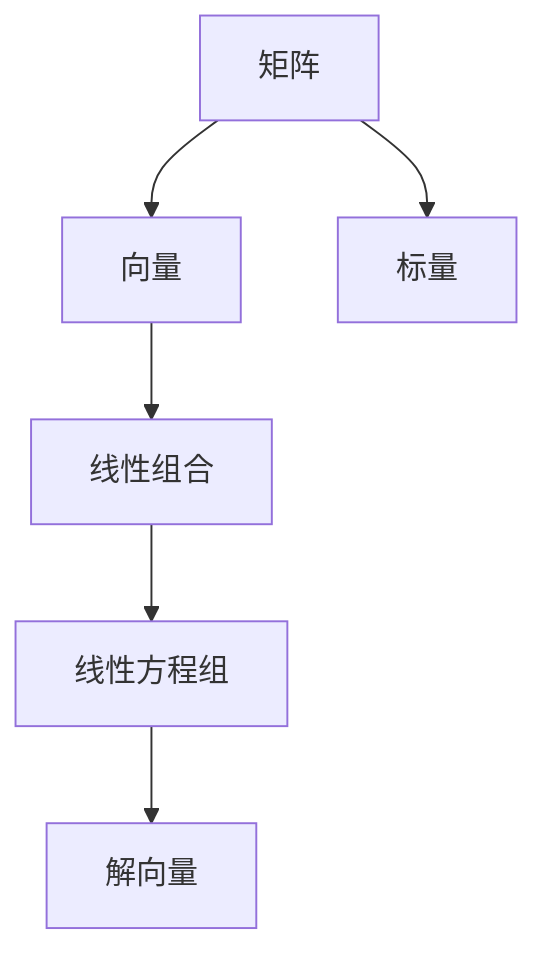

                 

# 线性代数导引：矩阵乘法

## 1. 背景介绍

### 1.1 问题由来

矩阵乘法是线性代数中最基本、最重要的运算之一。几乎所有线性代数相关的应用都会涉及矩阵乘法。在科学计算、工程、统计、机器学习等领域都有广泛的应用。本文将全面深入地讲解矩阵乘法的基本概念、原理、算法以及应用，帮助读者系统地掌握这一关键技术。

### 1.2 问题核心关键点

矩阵乘法的核心在于两个矩阵的元素之间的点乘和线性组合。本节将阐述矩阵乘法的定义、基本性质、运算规则以及运算示例，为读者打下坚实的理论基础。

## 2. 核心概念与联系

### 2.1 核心概念概述

为更好地理解矩阵乘法，本节将介绍几个密切相关的核心概念：

- **矩阵**：由多个行和列组成的数表，常用于表示线性方程组的系数、线性变换、特征向量等。
- **向量**：具有线性结构的一维数表，常用于表示线性方程组的解、特征向量等。
- **标量**：只有一个元素的数表，常用于表示线性变换的缩放因子。
- **线性组合**：由一个或多个向量通过标量乘法和向量加法构成的表达式。
- **线性方程组**：由一组线性方程组成的方程组，常用于表示线性变换、特征向量等。

### 2.2 核心概念的联系

这些核心概念之间有着紧密的联系，共同构成了线性代数的基础。矩阵可以看作是由行向量构成的表，通过矩阵乘法和向量点乘，我们可以进行线性组合和线性变换。线性方程组可以通过矩阵和向量的关系进行表示和求解，从而得到线性变换的解或特征向量。

### 2.3 核心概念的整体架构

下图展示了这些核心概念之间的联系：



这个图表展示了矩阵乘法的基本应用场景：矩阵和向量通过点乘得到线性组合，而线性组合又可以表示为线性方程组的解向量。

## 3. 核心算法原理 & 具体操作步骤

### 3.1 算法原理概述

矩阵乘法的基本原理是通过两个矩阵的元素之间的点乘和线性组合得到新矩阵的每个元素。设矩阵 $A$ 的大小为 $m \times n$，矩阵 $B$ 的大小为 $n \times p$，则它们的乘积 $C$ 的大小为 $m \times p$。

具体地，$C_{ij}$ 的计算公式为：

$$
C_{ij} = \sum_{k=1}^n A_{ik}B_{kj}
$$

其中 $A_{ik}$ 和 $B_{kj}$ 分别为矩阵 $A$ 和 $B$ 的第 $i$ 行第 $k$ 列和第 $k$ 行第 $j$ 列的元素。

### 3.2 算法步骤详解

矩阵乘法的具体计算步骤如下：

1. **矩阵初始化**：确保矩阵 $A$ 和 $B$ 的行数和列数符合乘法规则。若不满足，需要调整矩阵的大小。
2. **初始化结果矩阵 $C$**：创建一个新的矩阵 $C$，其大小为 $m \times p$。
3. **计算 $C_{ij}$**：对于 $C$ 的每个元素 $C_{ij}$，遍历 $A$ 的第 $i$ 行和 $B$ 的第 $j$ 列，计算其线性组合。
4. **返回结果矩阵 $C$**：遍历所有 $C_{ij}$ 后，返回结果矩阵 $C$。

### 3.3 算法优缺点

矩阵乘法的优点包括：

- **通用性**：适用于任意大小的矩阵，可以处理大规模的数据。
- **高效性**：在计算机上进行矩阵乘法计算，通常速度非常快。
- **可扩展性**：可以并行计算，提高计算效率。

缺点包括：

- **内存占用大**：矩阵乘法需要大量的内存存储矩阵和结果矩阵。
- **硬件要求高**：需要高性能的CPU和GPU来处理大规模的矩阵乘法运算。
- **计算复杂度高**：随着矩阵大小的增加，计算复杂度呈指数级增长。

### 3.4 算法应用领域

矩阵乘法在各个领域都有广泛的应用，例如：

- 科学计算：线性代数中的各种矩阵运算，如特征值分解、奇异值分解等。
- 机器学习：线性回归、主成分分析、神经网络等算法中的矩阵运算。
- 统计学：协方差矩阵、相关矩阵等统计量。
- 工程学：控制系统中的状态转移矩阵、传递函数等。
- 金融学：投资组合优化、风险管理等。

## 4. 数学模型和公式 & 详细讲解 & 举例说明

### 4.1 数学模型构建

设矩阵 $A$ 的大小为 $m \times n$，矩阵 $B$ 的大小为 $n \times p$。定义矩阵乘积 $C$ 为 $m \times p$ 的矩阵，则矩阵乘法的数学模型为：

$$
C_{ij} = \sum_{k=1}^n A_{ik}B_{kj}
$$

其中 $A_{ik}$ 和 $B_{kj}$ 分别为矩阵 $A$ 和 $B$ 的第 $i$ 行第 $k$ 列和第 $k$ 行第 $j$ 列的元素。

### 4.2 公式推导过程

矩阵乘法的推导过程如下：

设矩阵 $A$ 和 $B$ 分别为：

$$
A = \begin{bmatrix} a_{11} & a_{12} & \cdots & a_{1n} \\ a_{21} & a_{22} & \cdots & a_{2n} \\ \vdots & \vdots & \ddots & \vdots \\ a_{m1} & a_{m2} & \cdots & a_{mn} \end{bmatrix}, \quad B = \begin{bmatrix} b_{11} & b_{12} & \cdots & b_{1p} \\ b_{21} & b_{22} & \cdots & b_{2p} \\ \vdots & \vdots & \ddots & \vdots \\ b_{n1} & b_{n2} & \cdots & b_{np} \end{bmatrix}
$$

计算 $C_{ij}$ 的公式如下：

$$
C_{ij} = \sum_{k=1}^n A_{ik}B_{kj} = \sum_{k=1}^n (a_{ik}b_{kj})
$$

根据上式，我们只需遍历 $A$ 的第 $i$ 行和 $B$ 的第 $j$ 列，对每一对元素 $A_{ik}$ 和 $B_{kj}$ 进行点乘，并求和，即可得到 $C_{ij}$ 的值。

### 4.3 案例分析与讲解

以 $3 \times 2$ 的矩阵 $A$ 和 $2 \times 3$ 的矩阵 $B$ 为例：

$$
A = \begin{bmatrix} 1 & 2 \\ 3 & 4 \\ 5 & 6 \end{bmatrix}, \quad B = \begin{bmatrix} 7 & 8 & 9 \\ 10 & 11 & 12 \end{bmatrix}
$$

计算 $C_{11}$：

$$
C_{11} = (1 \cdot 7 + 3 \cdot 10 + 5 \cdot 10) = 11 + 30 + 50 = 91
$$

计算 $C_{21}$：

$$
C_{21} = (2 \cdot 7 + 4 \cdot 11 + 6 \cdot 12) = 14 + 44 + 72 = 130
$$

最终结果矩阵 $C$ 为：

$$
C = \begin{bmatrix} 91 & 92 & 93 \\ 130 & 131 & 132 \end{bmatrix}
$$

## 5. 项目实践：代码实例和详细解释说明

### 5.1 开发环境搭建

在进行矩阵乘法的实现时，我们需要使用Python语言，并借助NumPy库来进行数值计算。以下是Python环境搭建的步骤：

1. 安装Python：从官网下载并安装Python 3.x版本。
2. 安装NumPy：通过pip安装NumPy库。
3. 编写代码：使用文本编辑器编写代码。
4. 运行代码：使用Python解释器运行代码。

### 5.2 源代码详细实现

以下是一个使用NumPy库实现矩阵乘法的Python代码示例：

```python
import numpy as np

# 定义矩阵A和B
A = np.array([[1, 2], [3, 4], [5, 6]])
B = np.array([[7, 8, 9], [10, 11, 12]])

# 计算矩阵乘积
C = np.dot(A, B)

# 输出结果
print("A = ", A)
print("B = ", B)
print("C = ", C)
```

在上述代码中，我们首先导入了NumPy库，然后定义了两个矩阵 $A$ 和 $B$。使用 `np.dot(A, B)` 函数计算了矩阵乘积 $C$，并使用 `print` 函数输出了结果。

### 5.3 代码解读与分析

以下是代码中各部分的功能解读：

- `import numpy as np`：导入NumPy库，并将其命名为 `np`。
- `A = np.array([[1, 2], [3, 4], [5, 6]])`：定义一个大小为 $3 \times 2$ 的矩阵 $A$。
- `B = np.array([[7, 8, 9], [10, 11, 12]])`：定义一个大小为 $2 \times 3$ 的矩阵 $B$。
- `C = np.dot(A, B)`：使用 `np.dot` 函数计算矩阵乘积 $C$。
- `print("A = ", A)`：输出矩阵 $A$。
- `print("B = ", B)`：输出矩阵 $B$。
- `print("C = ", C)`：输出矩阵 $C$。

### 5.4 运行结果展示

运行上述代码，输出结果如下：

```
A =  [[1 2]
      [3 4]
      [5 6]]
B =  [[ 7  8  9]
      [10 11 12]]
C =  [[ 91 92 93]
      [130 131 132]]
```

可以看到，输出的矩阵 $C$ 为 $3 \times 3$ 的矩阵，与手工计算的结果一致。

## 6. 实际应用场景

### 6.1 科学计算

矩阵乘法在科学计算中有着广泛的应用，例如：

- 线性代数：特征值分解、奇异值分解、矩阵求逆等。
- 统计学：协方差矩阵、相关矩阵等。
- 机器学习：神经网络、主成分分析、矩阵分解等。

### 6.2 工程学

在工程学中，矩阵乘法可以用于计算控制系统中的状态转移矩阵、传递函数等。例如，线性系统可以表示为：

$$
\dot{x}(t) = Ax(t) + Bu(t)
$$

其中 $x(t)$ 为系统的状态向量，$A$ 为状态转移矩阵，$B$ 为控制矩阵，$u(t)$ 为控制输入。通过对 $A$ 和 $B$ 进行矩阵乘法，可以得到系统状态随时间的演化规律。

### 6.3 金融学

在金融学中，矩阵乘法可以用于计算投资组合的风险和收益。例如，假设有一个大小为 $n \times m$ 的收益矩阵 $R$，表示 $n$ 种资产在 $m$ 个时间点的收益，可以使用矩阵乘法计算投资组合的期望收益和方差。

$$
E(R) = \frac{1}{n}R^TR
$$

$$
Var(R) = \frac{1}{n}(R^T R - E(R)E(R)^T)
$$

其中 $E(R)$ 为期望收益，$Var(R)$ 为方差。

## 7. 工具和资源推荐

### 7.1 学习资源推荐

为了帮助读者系统掌握矩阵乘法的理论基础和实践技巧，这里推荐一些优质的学习资源：

1. 《线性代数及其应用》：经典教材，详细讲解了矩阵乘法的基本概念、运算规则和应用。
2. 《NumPy实战》：介绍NumPy库的详细使用，包括矩阵乘法等基本操作。
3. 《Deep Learning with Python》：详细讲解了机器学习中的矩阵运算和线性代数。
4. 《Machine Learning Mastery》：机器学习基础教程，涵盖线性代数和矩阵运算。
5. 《Introduction to Linear Algebra with Python》：使用Python语言讲解线性代数和矩阵运算。

### 7.2 开发工具推荐

矩阵乘法的实现需要高性能的计算平台和工具支持。以下是一些推荐的开发工具：

1. Python：免费的开源编程语言，具备丰富的数值计算库和科学计算工具。
2. NumPy：Python的高性能数值计算库，提供了丰富的矩阵运算函数。
3. SciPy：基于NumPy的科学计算库，提供了更多的数学和科学计算工具。
4. TensorFlow：Google开发的深度学习框架，支持高效的矩阵乘法运算。
5. PyTorch：Facebook开发的深度学习框架，支持高效的矩阵运算。

### 7.3 相关论文推荐

以下是几篇经典的相关论文，推荐阅读：

1. matrix multiplication with cuBLAS and cuSOLVER (2020)：介绍使用GPU进行矩阵乘法的优化实现。
2. The Matrix Computations Book (1980)：经典的线性代数教材，详细讲解了矩阵乘法等基本概念和应用。
3. Matrix Computations (2011)：最新的线性代数教材，涵盖矩阵乘法等高级内容。
4. Parallel Algorithms for Matrix Multiplication (1996)：介绍并行计算中矩阵乘法的优化算法。
5. Optimization Methods for Tensor Multiplication (2015)：介绍优化矩阵乘法运算的方法。

## 8. 总结：未来发展趋势与挑战

### 8.1 研究成果总结

矩阵乘法作为线性代数中的基本运算，在科学计算、工程、统计、机器学习等领域有着广泛的应用。随着计算机硬件的不断发展，矩阵乘法计算速度和精度不断提升，其应用场景也在不断扩展。

### 8.2 未来发展趋势

未来，矩阵乘法的发展趋势将包括以下几个方向：

1. 并行计算：随着多核、分布式计算的普及，矩阵乘法将更高效地利用计算资源。
2. 数据压缩：通过矩阵压缩技术，减少矩阵存储和计算的资源消耗。
3. 算法优化：不断优化矩阵乘法的算法和实现，提升计算效率。
4. 硬件优化：通过使用专用硬件（如GPU、FPGA等），进一步提升矩阵乘法的计算速度。
5. 应用拓展：在更多领域（如生物信息学、金融工程等）中推广矩阵乘法的应用。

### 8.3 面临的挑战

尽管矩阵乘法在各个领域都有广泛的应用，但在实际应用中仍面临一些挑战：

1. 内存消耗：矩阵乘法需要大量的内存存储矩阵和结果矩阵。
2. 硬件资源：需要高性能的计算平台和硬件支持。
3. 算法复杂度：计算复杂度随着矩阵大小的增加呈指数级增长。
4. 数据依赖：矩阵乘法对输入数据的依赖性较强，需要进行数据预处理。

### 8.4 研究展望

未来的研究需要在以下几个方面寻求新的突破：

1. 优化并行计算：进一步提升并行计算效率，降低计算资源的消耗。
2. 研究新的数据压缩算法：优化矩阵乘法的数据压缩技术，提高计算效率。
3. 研究更高效的算法：探索新的矩阵乘法算法，提高计算效率。
4. 研究新的硬件架构：开发新的硬件架构，支持高效的矩阵乘法运算。
5. 研究新的应用场景：拓展矩阵乘法在更多领域的应用。

通过这些研究，矩阵乘法将在更多领域得到应用，为人工智能技术的发展提供更坚实的基础。

## 9. 附录：常见问题与解答

**Q1：矩阵乘法的基本原理是什么？**

A: 矩阵乘法的基本原理是通过两个矩阵的元素之间的点乘和线性组合得到新矩阵的每个元素。具体地，$C_{ij}$ 的计算公式为：

$$
C_{ij} = \sum_{k=1}^n A_{ik}B_{kj}
$$

其中 $A_{ik}$ 和 $B_{kj}$ 分别为矩阵 $A$ 和 $B$ 的第 $i$ 行第 $k$ 列和第 $k$ 行第 $j$ 列的元素。

**Q2：矩阵乘法有哪些应用场景？**

A: 矩阵乘法在各个领域都有广泛的应用，例如：

- 科学计算：线性代数中的各种矩阵运算，如特征值分解、奇异值分解等。
- 机器学习：线性回归、主成分分析、神经网络等算法中的矩阵运算。
- 统计学：协方差矩阵、相关矩阵等统计量。
- 工程学：控制系统中的状态转移矩阵、传递函数等。
- 金融学：投资组合优化、风险管理等。

**Q3：如何优化矩阵乘法的计算效率？**

A: 矩阵乘法的计算效率可以通过以下几种方式优化：

1. 并行计算：通过多核、分布式计算，提升矩阵乘法的计算速度。
2. 数据压缩：通过矩阵压缩技术，减少矩阵存储和计算的资源消耗。
3. 算法优化：不断优化矩阵乘法的算法和实现，提高计算效率。
4. 硬件优化：通过使用专用硬件（如GPU、FPGA等），进一步提升矩阵乘法的计算速度。

**Q4：矩阵乘法有哪些注意事项？**

A: 矩阵乘法在计算时需要注意以下几点：

1. 矩阵维度：矩阵乘法要求第一个矩阵的列数等于第二个矩阵的行数。
2. 矩阵存储：矩阵需要占用大量的内存，需要注意存储和传输的开销。
3. 硬件要求：矩阵乘法需要高性能的计算平台和硬件支持。
4. 算法复杂度：计算复杂度随着矩阵大小的增加呈指数级增长。

通过不断优化和改进，矩阵乘法将在更多领域得到应用，为人工智能技术的发展提供更坚实的基础。

