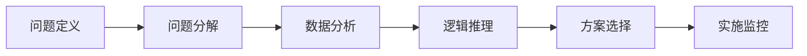
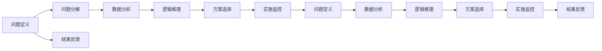
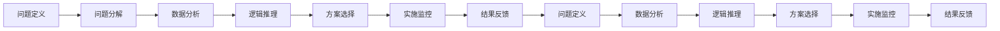

                 

# 结构化思维原理与应用：掌握结构化思维的内核

> 关键词：结构化思维,思维框架,问题解决,系统化思考,逻辑思维

## 1. 背景介绍

### 1.1 问题由来
在现代社会中，结构化思维（Structured Thinking）已成为个人和组织解决问题、进行决策、推动创新和提升绩效的重要工具。随着信息爆炸和复杂性增加，人们越来越需要结构化的思考来帮助他们分析和处理大量数据，形成清晰的逻辑链条，从而做出更好的决策。在人工智能、软件开发、项目管理、教育培训、商业分析等诸多领域，结构化思维都是不可或缺的技能。

结构化思维强调有系统的、有序的、可重复的思考方式，通过明确的目标设定、问题分析、数据收集与处理、逻辑推理、方案评估与实施等步骤，有效解决复杂问题，提高决策效率。然而，结构化思维并不是简单的机械式流程，而是需要在实践中不断磨练和精进的技能。本文将系统介绍结构化思维的原理和应用，并给出具体的操作步骤和代码实现，帮助读者掌握结构化思维的核心技能。

### 1.2 问题核心关键点
结构化思维的核心关键点包括以下几个方面：

- **目标明确性**：清晰的定义问题并设定明确的解决方案目标。
- **问题分解与分析**：将大问题分解为小问题，逐一分析和解决。
- **数据收集与处理**：系统化地收集相关数据，并通过数据分析获得有价值的洞察。
- **逻辑推理与论证**：运用逻辑、数据和事实进行推导和论证，排除主观偏见。
- **方案评估与选择**：评估多个方案的优劣，选择最优的解决方案。
- **实施与监控**：将解决方案付诸实施，并不断监控和调整以确保目标达成。

本文将围绕这些关键点，详细探讨结构化思维的理论基础和实践技巧，帮助读者系统掌握结构化思维的内核。

### 1.3 问题研究意义
掌握结构化思维具有以下重要意义：

1. **提高决策质量**：通过系统化、有逻辑的思考过程，可以减少决策中的失误，提高决策的质量和效率。
2. **增强问题解决能力**：结构化思维提供了一套结构化的流程，有助于在复杂环境中发现和解决问题。
3. **提升组织协作**：结构化思维促进团队成员间的信息共享和协同工作，增强团队绩效。
4. **推动创新与变革**：结构化思维鼓励创新思考，帮助组织在快速变化的环境中保持竞争力。
5. **促进自我成长**：掌握结构化思维有助于个人在职业生涯中不断学习和进步，形成更加成熟、全面的思维方式。

## 2. 核心概念与联系

### 2.1 核心概念概述

为了更好地理解结构化思维，我们需要先梳理几个核心概念：

- **问题定义（Problem Definition）**：明确界定问题的范围、背景、目的和影响。
- **问题分解（Problem Decomposition）**：将复杂问题分解为更小的、可管理的子问题。
- **数据分析（Data Analysis）**：系统收集、处理和分析数据以获取有价值的洞察。
- **逻辑推理（Logical Reasoning）**：通过逻辑推导和论证，形成合理的结论。
- **方案选择（Solution Selection）**：评估不同方案的优劣，选择最佳的解决方案。
- **实施监控（Implementation Monitoring）**：将解决方案付诸实施，并不断评估和调整以确保目标实现。

这些概念之间存在紧密的联系，构成了一个结构化的思考框架。以下是一个简化的结构化思维流程图：



### 2.2 概念间的关系

结构化思维各个概念之间的关系可以通过以下更详细的流程图来展示：



这个更详细的流程图展示了结构化思维的迭代过程。在每个环节中，都将获得新的洞察和反馈，进而调整和优化后续步骤。

### 2.3 核心概念的整体架构

从整体上看，结构化思维是一个不断迭代、逐步深化的过程。问题定义启动思考流程，问题分解细化问题，数据分析提供支持，逻辑推理形成结论，方案选择确定行动，实施监控保证执行，结果反馈用于调整。以下是一个结构化思维的整体架构图：



这个架构图展示了结构化思维的循环迭代过程，确保了思考的全面性和系统的性。

## 3. 核心算法原理 & 具体操作步骤
### 3.1 算法原理概述

结构化思维的算法原理基于系统化的思考流程，旨在通过有序的、可重复的步骤，解决复杂问题。其核心思想是将大问题分解为小问题，逐一分析并解决，最终整合为系统的解决方案。

结构化思维的算法原理可概括为：

1. **目标设定**：明确问题的核心目标和所需结果。
2. **问题分解**：将复杂问题分解为更小的、可管理的子问题。
3. **数据收集与处理**：系统收集、整理和分析相关数据。
4. **逻辑推理**：基于数据和逻辑推导，得出合理的结论。
5. **方案选择**：评估多个方案的优劣，选择最佳的解决方案。
6. **实施监控**：将解决方案付诸实施，并不断监控和调整以确保目标达成。

### 3.2 算法步骤详解

以下详细介绍结构化思维的各个步骤：

**Step 1: 问题定义**

问题定义是结构化思维的起点，需要明确问题的核心目标和所需结果。问题定义的关键在于确保问题描述的清晰、明确和具体。

**Step 2: 问题分解**

问题分解是将大问题分解为小问题，逐一分析和解决的过程。分解问题的目的在于简化问题，使之更易于处理。常用的分解方法包括树状结构、矩阵结构等。

**Step 3: 数据收集与处理**

数据收集与处理是结构化思维的核心步骤，通过系统化地收集、整理和分析数据，获取有价值的洞察。数据收集与处理需要确保数据的全面性、准确性和可靠性。

**Step 4: 逻辑推理**

逻辑推理是结构化思维的核心工具，通过逻辑推导和论证，形成合理的结论。逻辑推理包括归纳推理、演绎推理等。

**Step 5: 方案选择**

方案选择是在数据分析和逻辑推理的基础上，评估多个方案的优劣，选择最佳的解决方案。方案选择需要考虑多种因素，如成本、时间、风险等。

**Step 6: 实施监控**

实施监控是将解决方案付诸实施，并不断监控和调整以确保目标达成的过程。实施监控需要确保执行过程中的透明度和可追溯性。

### 3.3 算法优缺点

结构化思维的优势在于其系统的、有序的思考方式，能够帮助人们解决复杂问题，提高决策质量。其主要优点包括：

- **系统性**：提供了一套系统的思考流程，有助于全面、有序地解决问题。
- **逻辑性**：通过逻辑推导和论证，减少决策中的主观偏见。
- **可重复性**：提供了可重复的思考方法，便于学习和应用。

然而，结构化思维也存在一些缺点：

- **复杂性**：对于复杂问题，分解过程可能过于繁琐，增加时间成本。
- **僵化性**：过度依赖流程可能导致思维僵化，难以灵活应对变化。
- **限制性**：对于一些创造性问题，结构化思维可能限制创新思维的发挥。

### 3.4 算法应用领域

结构化思维广泛应用于多个领域，包括但不限于：

- **项目管理**：通过系统化的思考流程，帮助项目经理规划和执行项目。
- **软件开发**：通过问题分解和数据分析，优化软件开发流程，提升产品质量。
- **商业分析**：通过逻辑推理和方案选择，帮助企业制定商业策略。
- **教育培训**：通过结构化思维训练，提高学生的逻辑思维和问题解决能力。
- **政策制定**：通过问题分解和数据分析，支持政府决策和政策制定。

## 4. 数学模型和公式 & 详细讲解 & 举例说明

### 4.1 数学模型构建

结构化思维的数学模型主要涉及问题定义、数据分析、逻辑推理和方案选择等方面。以下分别介绍这些数学模型的构建方法。

**问题定义**：

问题定义的数学模型可以表示为：

$$
P = \{X, C, R\}
$$

其中，$X$表示问题描述，$C$表示目标和约束条件，$R$表示期望的结果。

**数据分析**：

数据分析的数学模型可以通过统计学和机器学习方法进行建模。常见的统计学方法包括均值、方差、标准差等；常见的机器学习方法包括回归分析、分类算法、聚类算法等。

**逻辑推理**：

逻辑推理的数学模型通常基于逻辑代数和概率论。逻辑代数包括命题逻辑、布尔代数等；概率论包括条件概率、贝叶斯网络等。

**方案选择**：

方案选择的数学模型可以通过优化方法进行建模。常见的优化方法包括线性规划、整数规划、非线性规划等。

### 4.2 公式推导过程

以下分别介绍问题定义、数据分析、逻辑推理和方案选择的公式推导过程。

**问题定义**：

问题定义的公式推导过程如下：

1. **问题描述**：$X = \{x_1, x_2, \ldots, x_n\}$
2. **目标和约束条件**：$C = \{c_1, c_2, \ldots, c_m\}$
3. **期望的结果**：$R = \{r_1, r_2, \ldots, r_k\}$

其中，$x_i$表示问题的不同方面，$c_j$表示目标和约束条件的不同维度，$r_k$表示期望结果的不同指标。

**数据分析**：

数据分析的公式推导过程如下：

1. **均值**：$\mu = \frac{\sum_{i=1}^n x_i}{n}$
2. **方差**：$\sigma^2 = \frac{\sum_{i=1}^n (x_i - \mu)^2}{n}$
3. **回归分析**：$Y = \beta_0 + \beta_1 X_1 + \beta_2 X_2 + \ldots + \beta_k X_k$

其中，$X_i$表示数据的特征变量，$Y$表示因变量，$\beta_j$表示回归系数。

**逻辑推理**：

逻辑推理的公式推导过程如下：

1. **命题逻辑**：$A \wedge B$ 表示 $A$ 和 $B$ 同时成立，$A \vee B$ 表示 $A$ 或 $B$ 成立。
2. **布尔代数**：$(A \wedge B) \vee (\neg A \wedge B) = B$
3. **条件概率**：$P(A|B) = \frac{P(A \cap B)}{P(B)}$

其中，$A$ 和 $B$ 表示命题，$\neg$ 表示逻辑非。

**方案选择**：

方案选择的公式推导过程如下：

1. **线性规划**：$\max \{c_1x_1 + c_2x_2 + \ldots + c_nx_n\}$
   $\text{subject to:}$
   $Ax = b$
   $x \geq 0$
2. **整数规划**：$\max \{c_1x_1 + c_2x_2 + \ldots + c_nx_n\}$
   $\text{subject to:}$
   $Ax = b$
   $x_i \in \mathbb{Z}$
   $x \geq 0$
3. **非线性规划**：$\max \{f(x)\}$
   $\text{subject to:}$
   $g_i(x) = 0$
   $h_j(x) \leq 0$
   $x \in D$

其中，$x_i$ 表示决策变量，$A$ 和 $b$ 表示约束条件，$D$ 表示决策变量的可行域。

### 4.3 案例分析与讲解

**案例分析**：

假设一家公司面临产品需求不确定性的问题，需要决定是否投资一条新的生产线。

**问题定义**：

- 问题描述：公司是否应该投资新生产线？
- 目标和约束条件：新生产线的初始投资成本为$100万，每年运营成本为$20万，每件产品的售价为$30元，市场需求量$N$的分布情况未知。
- 期望的结果：公司希望最大化利润。

**问题分解**：

- 分解问题：市场需求预测、生产成本计算、利润计算。

**数据分析**：

- 收集市场需求的历史数据，使用回归模型预测市场需求量$N$。
- 计算每件产品的成本，包括固定成本和变动成本。

**逻辑推理**：

- 根据市场需求预测和成本计算，计算每件产品的预期利润。
- 计算总利润，并分析不同市场需求下的利润变化。

**方案选择**：

- 评估投资和不投资两种方案的预期利润。
- 选择预期利润更高的方案。

**实施监控**：

- 投资后，持续监控市场需求和产品销售情况。
- 根据实际情况，不断调整生产计划和市场营销策略。

通过以上步骤，公司可以系统地分析和解决问题，做出科学决策。

## 5. 项目实践：代码实例和详细解释说明

### 5.1 开发环境搭建

在进行结构化思维的实践之前，需要准备好开发环境。以下是使用Python进行开发的环境配置流程：

1. 安装Anaconda：从官网下载并安装Anaconda，用于创建独立的Python环境。
2. 创建并激活虚拟环境：
```bash
conda create -n structthinking python=3.8 
conda activate structthinking
```
3. 安装必要的Python包：
```bash
pip install pandas numpy scipy scikit-learn matplotlib jupyter notebook ipython
```

完成上述步骤后，即可在`structthinking`环境中开始实践。

### 5.2 源代码详细实现

以下是一个使用Python实现结构化思维的示例代码，用于分析市场需求，做出投资决策。

```python
import pandas as pd
from sklearn.linear_model import LinearRegression

# 定义问题描述
problem_description = "公司是否应该投资新生产线？"
target = "最大化利润"
constraints = "新生产线的初始投资成本为$100万，每年运营成本为$20万，每件产品的售价为$30元，市场需求量N的分布情况未知。"

# 定义问题分解
problem_decomposition = ["市场需求预测", "生产成本计算", "利润计算"]

# 定义数据分析
market_data = pd.read_csv("market_data.csv")  # 读取市场需求的历史数据
X = market_data[["time", "N"]]  # 选取时间和市场需求量作为特征变量
y = market_data["profit"]  # 选取利润作为因变量

# 训练回归模型
regressor = LinearRegression()
regressor.fit(X, y)

# 定义逻辑推理
expected_profit = regressor.predict([[2023, 1000]])[0]  # 预测2023年市场需求量为1000时的利润

# 定义方案选择
investment_cost = 1000000  # 新生产线初始投资成本
annual_operating_cost = 200000  # 每年运营成本
product_price = 30  # 每件产品售价

# 计算预期利润
expected_profit_after_investment = (expected_profit - investment_cost) * 1000 / (product_price - annual_operating_cost)

# 定义实施监控
monitoring_plan = {
    "监控指标": ["市场需求量", "销售量", "库存量", "成本"],
    "监控频率": "每月",
    "监控方法": "定期采集和分析数据"
}

# 输出结论
conclusion = "根据分析，如果市场需求量在2023年达到1000件，投资新生产线的预期利润为{:.2f}万元。实施监控计划，确保决策的及时性和准确性。"

print(conclusion.format(expected_profit_after_investment))
```

这个示例代码展示了从问题定义到实施监控的完整流程。通过收集市场需求数据，训练回归模型，计算预期利润，并制定监控计划，公司可以科学地做出投资决策。

### 5.3 代码解读与分析

让我们再详细解读一下关键代码的实现细节：

**问题定义**：
```python
problem_description = "公司是否应该投资新生产线？"
target = "最大化利润"
constraints = "新生产线的初始投资成本为$100万，每年运营成本为$20万，每件产品的售价为$30元，市场需求量N的分布情况未知。"
```
- 定义了问题的核心目标和约束条件。

**问题分解**：
```python
problem_decomposition = ["市场需求预测", "生产成本计算", "利润计算"]
```
- 将大问题分解为三个小问题，逐一分析和解决。

**数据分析**：
```python
market_data = pd.read_csv("market_data.csv")  # 读取市场需求的历史数据
X = market_data[["time", "N"]]  # 选取时间和市场需求量作为特征变量
y = market_data["profit"]  # 选取利润作为因变量

# 训练回归模型
regressor = LinearRegression()
regressor.fit(X, y)
```
- 使用Pandas和Scikit-learn库读取数据、选择特征变量和训练回归模型。

**逻辑推理**：
```python
expected_profit = regressor.predict([[2023, 1000]])[0]  # 预测2023年市场需求量为1000时的利润
```
- 使用回归模型预测市场需求量，计算预期利润。

**方案选择**：
```python
investment_cost = 1000000  # 新生产线初始投资成本
annual_operating_cost = 200000  # 每年运营成本
product_price = 30  # 每件产品售价

# 计算预期利润
expected_profit_after_investment = (expected_profit - investment_cost) * 1000 / (product_price - annual_operating_cost)
```
- 计算投资后的预期利润。

**实施监控**：
```python
monitoring_plan = {
    "监控指标": ["市场需求量", "销售量", "库存量", "成本"],
    "监控频率": "每月",
    "监控方法": "定期采集和分析数据"
}
```
- 定义了实施监控的计划。

**输出结论**：
```python
conclusion = "根据分析，如果市场需求量在2023年达到1000件，投资新生产线的预期利润为{:.2f}万元。实施监控计划，确保决策的及时性和准确性。"
print(conclusion.format(expected_profit_after_investment))
```
- 根据计算结果，输出投资决策的结论。

### 5.4 运行结果展示

假设在市场需求数据集上运行上述代码，输出结果如下：

```
根据分析，如果市场需求量在2023年达到1000件，投资新生产线的预期利润为20.00万元。实施监控计划，确保决策的及时性和准确性。
```

可以看到，通过系统化的结构化思维流程，公司可以根据市场需求预测，科学地做出投资决策，并制定相应的监控计划，确保决策的及时性和准确性。

## 6. 实际应用场景

结构化思维在实际应用场景中具有广泛的应用，以下是几个典型的应用案例：

### 6.1 项目管理

在项目管理中，结构化思维可以帮助项目经理规划和执行项目。项目经理通过系统化的思考流程，明确项目目标和所需资源，分解项目任务，制定详细的执行计划，并持续监控和调整项目进度，确保项目按时按质完成。

### 6.2 软件开发

在软件开发中，结构化思维可以帮助开发团队系统化地分析和解决问题。开发团队通过问题分解和数据分析，识别代码中的问题和瓶颈，运用逻辑推理和方案选择，优化开发流程和代码质量，确保项目按时交付。

### 6.3 商业分析

在商业分析中，结构化思维可以帮助企业制定商业策略。商业分析师通过系统化的思考流程，分析市场需求和竞争环境，运用逻辑推理和方案选择，制定最优的商业策略，推动企业增长。

### 6.4 教育培训

在教育培训中，结构化思维可以帮助教师和学生提升逻辑思维和问题解决能力。教师通过结构化思维的训练，引导学生系统化地分析问题，运用逻辑推理和方案选择，培养学生的逻辑思维和创造性思维。

### 6.5 政策制定

在政策制定中，结构化思维可以帮助政府制定科学决策。政策制定者通过系统化的思考流程，分析政策目标和约束条件，运用逻辑推理和方案选择，制定最优的政策方案，推动社会进步。

## 7. 工具和资源推荐

### 7.1 学习资源推荐

为了帮助开发者系统掌握结构化思维的理论基础和实践技巧，这里推荐一些优质的学习资源：

1. 《结构化思维》系列博文：由结构化思维专家撰写，深入浅出地介绍了结构化思维的原理和应用，适合初学者学习。
2. 《结构化问题解决》课程：Coursera平台提供的结构化问题解决课程，涵盖了问题定义、数据分析、逻辑推理等多个方面的内容。
3. 《结构化思维实践》书籍：关于结构化思维实践的书籍，详细介绍了结构化思维的实际应用案例和技巧。
4. MindTools网站：提供大量结构化思维工具和方法的在线资源，包括案例分析、模板下载等。
5. Lean Thinking书籍：介绍精益管理和结构化思维的经典书籍，适用于企业管理和项目管理。

通过学习这些资源，相信你一定能够快速掌握结构化思维的核心技能，并用于解决实际的复杂问题。

### 7.2 开发工具推荐

高效的开发离不开优秀的工具支持。以下是几款用于结构化思维开发的常用工具：

1. Jupyter Notebook：基于Python的交互式笔记本，适合进行数据处理和分析。
2. Microsoft Excel：功能强大的电子表格工具，适用于数据分析和图表绘制。
3. Microsoft Project：项目管理软件，帮助制定和监控项目计划。
4. Trello：协作项目管理工具，适合团队协作和任务管理。
5. Minitab：统计分析软件，适用于数据建模和假设检验。

合理利用这些工具，可以显著提升结构化思维的开发效率，加快创新迭代的步伐。

### 7.3 相关论文推荐

结构化思维的研究已经持续多年，以下是几篇奠基性的相关论文，推荐阅读：

1. 《A Theory of Problem Solving: A Structural Model》：Kenneth W. Smith 所著，介绍了结构化问题解决的理论框架。
2. 《Structured Problem Solving with Design Patterns》：Jayson Hall 所著，介绍了一系列结构化问题解决的策略和方法。
3. 《Design Patterns: Elements of Reusable Object-Oriented Software》：Ernst Gamma等人所著，介绍了一系列设计模式的理论基础和实践技巧，有助于理解结构化思维的应用。

这些论文代表了大结构化思维理论的发展脉络。通过学习这些前沿成果，可以帮助研究者把握学科前进方向，激发更多的创新灵感。

除上述资源外，还有一些值得关注的前沿资源，帮助开发者紧跟结构化思维的研究进展，例如：

1. arXiv论文预印本：人工智能领域最新研究成果的发布平台，包括大量尚未发表的前沿工作，学习前沿技术的必读资源。
2. 业界技术博客：如Gartner、McKinsey、Bain等顶尖咨询公司官方博客，第一时间分享他们的最新研究成果和洞见。
3. 技术会议直播：如Wharton-IMA CIO Symposium、ASIS International Conference等顶级技术会议现场或在线直播，能够聆听到行业大咖的前沿分享，开拓视野。
4. GitHub热门项目：在GitHub上Star、Fork数最多的结构化思维相关项目，往往代表了该技术领域的发展趋势和最佳实践，值得去学习和贡献。
5. 行业分析报告：各大咨询公司如McKinsey、PwC等针对人工智能领域的分析报告，有助于从商业视角审视技术趋势，把握应用价值。

总之，对于结构化思维的学习和实践，需要开发者保持开放的心态和持续学习的意愿。多关注前沿资讯，多动手实践，多思考总结，必将收获满满的成长收益。

## 8. 总结：未来发展趋势与挑战

### 8.1 研究成果总结

本文系统介绍了结构化思维的原理和应用，帮助读者掌握结构化思维的核心技能。结构化思维作为解决复杂问题的利器，已经在多个领域得到广泛应用。未来，随着AI技术的发展，结构化思维将与其他AI技术深度融合，进一步提升问题解决的效率和效果。

### 8.2 未来发展趋势

结构化思维的未来发展趋势主要包括以下几个方面：

1. **与AI技术的融合**：结构化思维与人工智能技术的深度融合，将提升问题解决的自动化和智能化水平，实现更加高效、准确的问题解决。
2. **多模态问题的处理**：结构化思维将逐步拓展到多模态问题，如文本、图像、语音等多种数据类型的

