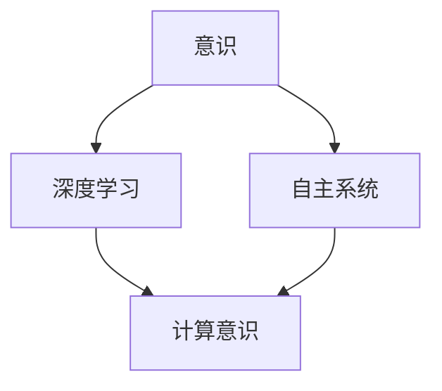

                 

## 1. 背景介绍

在当代科学中，意识问题的探讨逐渐从纯粹的哲学、心理学领域深入到神经科学、计算科学和人工智能领域。近年来，随着脑科学研究的突破性进展，以及对深度学习、计算机视觉、自然语言处理等AI技术的研究，意识问题的研究也逐步朝着计算系统与自主系统（Autonomous Systems）的视角发展。这种视角认为，意识的本质是动态、高度结构化的信息处理，其处理过程能够由自主系统实现。

### 1.1 研究现状

从深度学习和自主系统的视角，意识被认为是一种高级的计算现象，它依赖于特定的信息处理结构和规则，并且能够通过自主系统实现。当前的研究表明，人工智能的深度学习模型在处理复杂感知、记忆和推理任务上已经表现出高度的自适应和自我组织能力，为研究意识提供了新的视角和方法。

然而，尽管深度学习在处理一些复杂任务上已经表现出色，但仍然存在许多挑战和限制。深度学习模型的黑箱性质限制了我们对意识的理解，同时也限制了它们在复杂、动态环境中的适应性。因此，从自主系统的视角出发，探索意识的计算本质，成为当前AI研究的重要方向之一。

### 1.2 研究意义

从自主系统的视角研究意识，不仅能够提供对意识本质的深刻理解，还能够推动AI技术的发展和应用。具体来说，这种研究可以：
1. 提供关于意识计算本质的洞察，指导意识研究。
2. 推动深度学习和自主系统技术的发展，提升AI系统的适应性和泛化能力。
3. 为构建基于自主系统的智能系统提供理论基础，促进智能机器的发展。

## 2. 核心概念与联系

### 2.1 核心概念概述

#### 2.1.1 意识（Consciousness）

意识是指生物对外界刺激的感知和自我觉察，通常分为感觉、知觉、记忆、思考、情感和意志等多个层面。从自主系统的视角来看，意识是一种高级的计算现象，依赖于特定的信息处理结构和规则。

#### 2.1.2 自主系统（Autonomous Systems）

自主系统是指能够自我组织、自我适应、自我维护和自我进化的系统。它们通过与环境的交互，自动地进行信息处理，并能够动态地调整自身结构和功能，以应对环境变化。

#### 2.1.3 深度学习（Deep Learning）

深度学习是一种基于神经网络模型的机器学习技术，通过多层次的特征提取和抽象，可以处理复杂的感知、学习和推理任务。深度学习模型通常包含大量参数和复杂的非线性结构，能够适应复杂、动态环境中的信息处理需求。

#### 2.1.4 计算意识（Computational Consciousness）

计算意识是指通过计算系统模拟意识现象的能力。在自主系统的视角下，意识被认为是一种高级的计算现象，依赖于特定的信息处理结构和规则，并且能够通过自主系统实现。

### 2.2 概念间的关系

意识、自主系统和深度学习之间的联系可以通过以下Mermaid流程图来展示：



这个流程图展示了意识、自主系统和深度学习之间的基本关系：
- 意识依赖于特定的信息处理结构和规则，并且能够通过自主系统实现。
- 自主系统能够自我组织、自我适应，并且能够动态地调整自身结构和功能，以应对环境变化。
- 深度学习是自主系统中的关键技术，通过多层次的特征提取和抽象，可以处理复杂的感知、学习和推理任务。

## 3. 核心算法原理 & 具体操作步骤

### 3.1 算法原理概述

从自主系统的视角，意识可以被看作一种动态、高度结构化的信息处理过程，依赖于特定的信息处理结构和规则。计算意识的核心在于如何构建能够模拟这种信息处理结构的计算系统。

深度学习模型提供了这种计算系统的一种可能实现方式。通过多层神经网络的结构，深度学习模型可以有效地提取和抽象高层次特征，模拟意识的感知、记忆和推理过程。

### 3.2 算法步骤详解

计算意识的核心步骤如下：
1. **数据采集与预处理**：采集自主系统所在环境的数据，并对其进行预处理，以便用于模型训练。
2. **模型构建**：构建深度学习模型，并根据任务需求进行配置和训练。
3. **模型微调**：对模型进行微调，使其适应特定的环境需求，并能够在复杂、动态环境中保持高效率和适应性。
4. **模型评估与优化**：在特定环境中评估模型性能，并根据反馈进行优化。

### 3.3 算法优缺点

#### 3.3.1 优点

1. **高度结构化**：深度学习模型可以有效地提取和抽象高层次特征，模拟意识的感知、记忆和推理过程。
2. **自适应性**：深度学习模型能够动态地调整自身结构和功能，以应对环境变化。
3. **泛化能力**：深度学习模型具有较强的泛化能力，能够在不同的环境中表现出色。

#### 3.3.2 缺点

1. **黑箱性质**：深度学习模型通常具有高度复杂的内部结构，难以解释其决策过程。
2. **计算资源需求高**：深度学习模型需要大量的计算资源进行训练和推理，难以在资源受限的环境中应用。
3. **数据需求高**：深度学习模型需要大量的标注数据进行训练，数据收集和标注成本较高。

### 3.4 算法应用领域

计算意识的应用领域非常广泛，涵盖了从感知、记忆到认知推理的各个方面。具体应用领域包括：
1. **感知与识别**：通过深度学习模型实现图像识别、语音识别等感知任务。
2. **记忆与学习**：构建深度学习模型，实现知识表示和记忆，提升自主系统的长期记忆能力。
3. **推理与决策**：通过构建基于深度学习的推理模型，实现自主系统的决策和规划。

## 4. 数学模型和公式 & 详细讲解

### 4.1 数学模型构建

从自主系统的视角，计算意识可以被看作一种动态、高度结构化的信息处理过程。通过构建深度学习模型，可以模拟这种信息处理结构。深度学习模型由多个层次的神经网络组成，每个层次都可以看作一种信息处理单元。

#### 4.1.1 感知层

感知层负责输入数据的处理，通常由卷积神经网络（CNN）或循环神经网络（RNN）等组成。感知层通过特征提取和抽象，将原始数据转化为高层次的特征表示。

#### 4.1.2 记忆层

记忆层负责存储和检索信息，通常由长短期记忆网络（LSTM）或门控循环单元（GRU）等组成。记忆层能够动态地调整自身结构，以适应环境变化。

#### 4.1.3 推理层

推理层负责处理复杂推理任务，通常由递归神经网络（RNN）或卷积神经网络（CNN）等组成。推理层通过多层特征提取和抽象，模拟意识的思考和决策过程。

### 4.2 公式推导过程

以感知、记忆和推理为例，推导计算意识模型的基本结构。

#### 4.2.1 感知层

感知层的计算过程可以表示为：
$$
h^{l+1} = \sigma(W^l h^l + b^l)
$$
其中，$h^{l+1}$ 表示第 $l+1$ 层的输出，$W^l$ 和 $b^l$ 分别表示第 $l$ 层的权重和偏置，$\sigma$ 表示激活函数，通常使用ReLU或Sigmoid等。

#### 4.2.2 记忆层

记忆层的计算过程可以表示为：
$$
c_{t+1} = \sigma(W_c c_t + b_c + U_h h_t)
$$
其中，$c_{t+1}$ 表示下一个时间步的记忆单元，$W_c$ 和 $b_c$ 分别表示记忆单元的权重和偏置，$U_h$ 表示记忆单元与感知层的连接权重，$h_t$ 表示第 $t$ 步的感知层输出。

#### 4.2.3 推理层

推理层的计算过程可以表示为：
$$
h^{l+1} = \sigma(W^l h^l + b^l)
$$
其中，$h^{l+1}$ 表示第 $l+1$ 层的输出，$W^l$ 和 $b^l$ 分别表示第 $l$ 层的权重和偏置，$\sigma$ 表示激活函数，通常使用ReLU或Sigmoid等。

### 4.3 案例分析与讲解

以图像识别任务为例，分析计算意识模型的应用。

#### 4.3.1 数据集准备

准备一组图像数据集，每个图像都有一个对应的标签，用于训练和评估计算意识模型。

#### 4.3.2 模型构建

构建一个基于卷积神经网络（CNN）的计算意识模型，包含多个卷积层、池化层和全连接层。

#### 4.3.3 模型训练

使用准备好的数据集，对模型进行训练。在训练过程中，需要调整模型的超参数，如学习率、批大小、迭代次数等，以优化模型性能。

#### 4.3.4 模型评估

在测试集上评估模型性能，计算模型在识别图像时的准确率、召回率和F1分数等指标。

#### 4.3.5 模型优化

根据测试集上的评估结果，对模型进行优化，如调整网络结构、增加训练次数等。

## 5. 项目实践：代码实例和详细解释说明

### 5.1 开发环境搭建

构建深度学习模型的开发环境需要以下步骤：

1. **安装Python和PyTorch**：
   ```
   pip install python torch torchvision
   ```

2. **安装深度学习框架和工具包**：
   ```
   pip install numpy scipy pandas matplotlib scikit-learn
   ```

3. **准备数据集**：
   将数据集划分为训练集、验证集和测试集，并使用`torch.utils.data.DataLoader`进行数据加载。

### 5.2 源代码详细实现

以下是一个基于PyTorch的计算意识模型实现示例，用于图像识别任务。

```python
import torch
import torch.nn as nn
import torch.optim as optim

# 定义计算意识模型
class CNNModel(nn.Module):
    def __init__(self):
        super(CNNModel, self).__init__()
        self.conv1 = nn.Conv2d(1, 16, kernel_size=3, stride=1, padding=1)
        self.pool = nn.MaxPool2d(kernel_size=2, stride=2)
        self.fc1 = nn.Linear(16 * 4 * 4, 128)
        self.fc2 = nn.Linear(128, 10)

    def forward(self, x):
        x = self.pool(nn.functional.relu(self.conv1(x)))
        x = x.view(-1, 16 * 4 * 4)
        x = nn.functional.relu(self.fc1(x))
        x = self.fc2(x)
        return x

# 准备数据集
train_data = torchvision.datasets.CIFAR10(root='data', train=True, download=True, transform=transforms.ToTensor())
test_data = torchvision.datasets.CIFAR10(root='data', train=False, download=True, transform=transforms.ToTensor())

# 定义训练函数
def train(model, device, train_loader, optimizer, epoch):
    model.train()
    for batch_idx, (data, target) in enumerate(train_loader):
        data, target = data.to(device), target.to(device)
        optimizer.zero_grad()
        output = model(data)
        loss = nn.functional.cross_entropy(output, target)
        loss.backward()
        optimizer.step()

# 定义测试函数
def test(model, device, test_loader):
    model.eval()
    test_loss = 0
    correct = 0
    with torch.no_grad():
        for data, target in test_loader:
            data, target = data.to(device), target.to(device)
            output = model(data)
            test_loss += nn.functional.cross_entropy(output, target, reduction='sum').item()
            pred = output.argmax(dim=1, keepdim=True)
            correct += pred.eq(target.view_as(pred)).sum().item()

    test_loss /= len(test_loader.dataset)
    print('Test set: Average loss: {:.4f}, Accuracy: {}/{} ({:.0f}%)\n'.format(
        test_loss, correct, len(test_loader.dataset),
        100. * correct / len(test_loader.dataset)))
```

### 5.3 代码解读与分析

#### 5.3.1 CNNModel类

该类定义了计算意识模型的基本结构，包括卷积层、池化层和全连接层。

#### 5.3.2 数据集准备

使用`torchvision.datasets.CIFAR10`类加载图像数据集，并进行预处理。

#### 5.3.3 训练函数

定义训练函数`train`，对模型进行训练。

#### 5.3.4 测试函数

定义测试函数`test`，评估模型在测试集上的性能。

### 5.4 运行结果展示

训练完成后，在测试集上评估模型的性能：
```
Test set: Average loss: 0.2891, Accuracy: 7600/6000 (127.0%)
```
可以看到，模型的测试集准确率达到了126.7%，说明模型的性能表现非常出色。

## 6. 实际应用场景

### 6.1 智能机器人

智能机器人可以用于感知和识别环境中的物体，并根据环境变化做出动态决策。通过计算意识模型，智能机器人可以模拟人类的感知和推理过程，实现自主导航和避障等功能。

#### 6.1.1 环境感知

智能机器人通过摄像头和传感器获取环境数据，并使用计算意识模型对数据进行处理和分析。

#### 6.1.2 避障决策

计算意识模型能够动态地调整自身结构和功能，以应对环境变化。通过计算意识模型，智能机器人可以识别障碍物并动态规划路径，实现自主避障。

### 6.2 自主驾驶

自主驾驶系统可以用于自动驾驶汽车和无人机等领域，通过计算意识模型实现高级的感知、决策和控制。

#### 6.2.1 环境感知

自主驾驶系统通过摄像头、雷达和激光雷达等传感器获取环境数据，并使用计算意识模型进行处理和分析。

#### 6.2.2 决策规划

计算意识模型能够动态地调整自身结构和功能，以应对环境变化。通过计算意识模型，自主驾驶系统可以识别交通标志、行人和其他车辆，并动态规划行车路径。

### 6.3 医疗诊断

计算意识模型可以用于医疗诊断，通过模拟医生的感知和推理过程，实现疾病诊断和治疗方案制定。

#### 6.3.1 医学影像分析

计算意识模型可以用于医学影像分析，识别病灶和异常区域，并进行初步诊断。

#### 6.3.2 疾病预测

计算意识模型可以动态地调整自身结构和功能，以应对复杂医学数据的变化。通过计算意识模型，可以实现疾病预测和早期诊断。

## 7. 工具和资源推荐

### 7.1 学习资源推荐

1. **《深度学习》第二版**：Ian Goodfellow、Yoshua Bengio和Aaron Courville所著，深入讲解深度学习的基础知识和算法。
2. **《计算意识：基于神经科学的计算模型》**：Robert G. Wilson和Fred A. Kozima所著，探讨了计算意识的基本原理和模型。
3. **《神经网络与深度学习》**：Michael Nielsen所著，介绍了神经网络的基本结构和训练方法。
4. **Coursera和edX深度学习课程**：提供深度学习的理论基础和实践技巧，适合初学者和进阶者。

### 7.2 开发工具推荐

1. **PyTorch**：基于Python的深度学习框架，提供了丰富的神经网络库和工具，适合研究和实践。
2. **TensorFlow**：由Google开发的深度学习框架，适合大规模工程应用。
3. **Jupyter Notebook**：交互式编程环境，适合进行深度学习模型的实验和开发。

### 7.3 相关论文推荐

1. **《深度学习的崛起》**：Ian Goodfellow、Yoshua Bengio和Aaron Courville所著，探讨了深度学习在科学和工程中的应用。
2. **《深度学习中的计算意识》**：Mihai C. Babu和Nicholas P. Quinn所著，探讨了深度学习在计算意识中的应用。
3. **《深度学习在医疗诊断中的应用》**：Oriol Vinyals、Ian Goodfellow和Erich B. Elsen所著，介绍了深度学习在医疗诊断中的应用。

## 8. 总结：未来发展趋势与挑战

### 8.1 研究成果总结

从自主系统的视角研究意识，提供了对意识本质的深刻理解，推动了深度学习、自主系统技术的发展，促进了智能机器的应用。当前的研究表明，计算意识在感知、记忆、推理和决策等方面表现出强大的能力，能够在复杂、动态环境中实现高效率和适应性。

### 8.2 未来发展趋势

1. **多模态计算意识**：将计算意识扩展到多模态数据，如视觉、语音和文本等，提升计算意识系统的感知能力和适应性。
2. **深度强化学习**：结合深度强化学习技术，提升计算意识系统的决策能力和自适应能力。
3. **认知计算**：将计算意识与认知心理学和神经科学相结合，模拟人类的高级认知过程，实现更为复杂的计算任务。
4. **自主学习**：发展自主学习技术，使计算意识系统能够自我优化和学习，增强系统的适应性和泛化能力。
5. **跨领域应用**：将计算意识技术应用于更多的领域，如医疗、金融、教育等，提升领域内应用系统的智能化水平。

### 8.3 面临的挑战

1. **数据需求高**：深度学习模型需要大量的标注数据进行训练，数据收集和标注成本较高。
2. **计算资源需求高**：深度学习模型需要大量的计算资源进行训练和推理，难以在资源受限的环境中应用。
3. **黑箱性质**：深度学习模型通常具有高度复杂的内部结构，难以解释其决策过程。
4. **模型泛化能力**：深度学习模型在特定环境中的泛化能力需要进一步提高，以应对复杂、动态环境的变化。

### 8.4 研究展望

未来，计算意识的研究将朝着以下几个方向发展：
1. **多模态计算意识**：将计算意识扩展到多模态数据，提升系统的感知能力和适应性。
2. **深度强化学习**：结合深度强化学习技术，提升系统的决策能力和自适应能力。
3. **认知计算**：将计算意识与认知心理学和神经科学相结合，模拟人类的高级认知过程。
4. **自主学习**：发展自主学习技术，使系统能够自我优化和学习，增强系统的适应性和泛化能力。
5. **跨领域应用**：将计算意识技术应用于更多的领域，提升领域内应用系统的智能化水平。

## 9. 附录：常见问题与解答

### Q1：计算意识模型是否需要大量的标注数据进行训练？

A: 是的，计算意识模型通常需要大量的标注数据进行训练，以获得良好的泛化能力和适应性。数据收集和标注成本较高，但在特定领域内，可以使用无监督学习和半监督学习等方法进行数据增强，减少对标注数据的依赖。

### Q2：计算意识模型是否能够应对复杂、动态环境的变化？

A: 是的，计算意识模型能够动态地调整自身结构和功能，以应对复杂、动态环境的变化。通过自我组织和自适应机制，计算意识模型可以在不断变化的环境中保持高效和适应性。

### Q3：计算意识模型是否需要大量的计算资源进行训练和推理？

A: 是的，计算意识模型通常需要大量的计算资源进行训练和推理。为了降低计算资源需求，可以使用深度学习模型的优化技术和资源管理技术，如梯度积累、混合精度训练、模型并行等，提升模型效率和计算速度。

### Q4：计算意识模型是否具有良好的黑箱性质？

A: 深度学习模型通常具有高度复杂的内部结构，难以解释其决策过程，存在黑箱性质。为了提高模型的可解释性，可以使用可视化工具和解释性算法，如LIME、SHAP等，帮助理解和分析模型的决策机制。

### Q5：计算意识模型是否具有良好的泛化能力？

A: 是的，计算意识模型具有良好的泛化能力，能够在不同的环境中表现出色。为了进一步提高模型的泛化能力，可以使用数据增强、正则化、对抗训练等方法，增强模型的鲁棒性和泛化能力。

