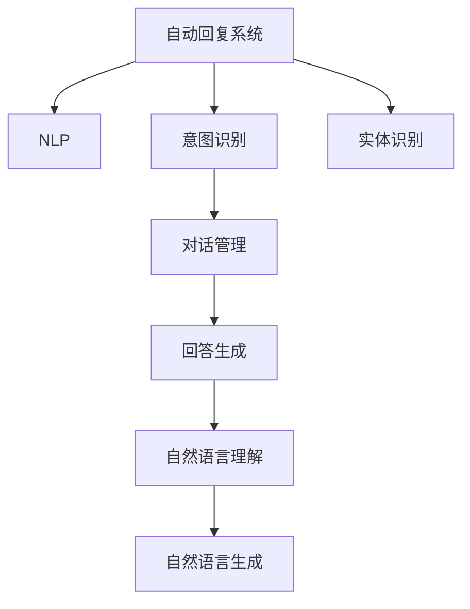
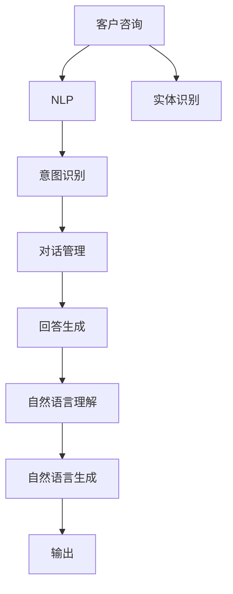

                 

# 自动回复系统在电商客户服务中的应用

## 1. 背景介绍

在电商快速发展的今天，客户服务成为了电商成功的关键要素之一。传统的客户服务模式往往依赖于人工客服团队，成本高、效率低，无法满足客户24小时不间断的咨询需求。此外，人工客服的响应速度和回答质量也存在较大波动，影响了客户体验。自动回复系统通过自然语言处理(NLP)技术，实时响应客户查询，提供快速、准确的回答，大大提升了客户服务的质量和效率。本文将详细介绍自动回复系统在电商客户服务中的应用，包括系统架构、核心算法、实践案例等方面。

## 2. 核心概念与联系

### 2.1 核心概念概述

为更好地理解自动回复系统，本节将介绍几个核心概念：

- **自动回复系统**：使用自然语言处理技术，自动回答客户咨询的系统。常见的自动回复系统包括基于规则的、基于统计模型的和基于深度学习的。
- **自然语言处理(NLP)**：涉及计算机对自然语言的理解、生成和分析的技术，旨在让计算机能够理解人类语言的含义，从而实现人机交互。
- **意图识别**：自动回复系统的重要组成部分，用于识别客户咨询的意图，决定回复的内容和形式。常见的意图识别方法包括基于规则的、基于模板的、基于机器学习的等。
- **对话管理**：在自动回复系统中，用于管理对话流程、上下文和状态的技术。对话管理通常采用状态机、知识图谱等方法实现。
- **实体识别**：自动回复系统中用于识别客户输入的实体，如人名、地名、时间等。实体识别对于提供个性化回答和复杂问题的回答至关重要。

### 2.2 核心概念间的关系

这些核心概念之间的联系可以通过以下Mermaid流程图来展示：



这个流程图展示了自动回复系统的各个组成部分及其相互关系：

1. 自动回复系统基于NLP技术，从客户咨询中抽取意图、实体等信息。
2. 意图识别用于识别客户咨询的意图，决定后续的回答内容。
3. 对话管理负责维护对话上下文和状态，确保回答逻辑连贯。
4. 实体识别用于从输入中提取关键信息，供回答生成时使用。
5. 回答生成将客户咨询和相关信息进行综合分析，生成最终回答。
6. 自然语言理解用于理解回答生成的输出内容，确保回答符合语义。
7. 自然语言生成将回答内容转化为自然语言形式，输出给客户。

### 2.3 核心概念的整体架构

最后，我们用一个综合的流程图来展示这些核心概念在大语言模型微调过程中的整体架构：



这个综合流程图展示了自动回复系统的核心概念及其相互关系，进一步明确了系统的工作流程。

## 3. 核心算法原理 & 具体操作步骤

### 3.1 算法原理概述

自动回复系统的核心算法原理涉及多个NLP技术，主要包括意图识别、对话管理、实体识别和回答生成等。

- **意图识别**：用于识别客户咨询的意图，常见的技术包括基于规则的模板匹配、基于统计模型的分类器和基于深度学习的预训练模型。其中，基于深度学习的预训练模型如BERT、GPT等，已经在意图识别任务上取得了显著的性能提升。

- **对话管理**：用于维护对话上下文和状态，常见的技术包括基于状态机的对话管理、基于知识图谱的对话管理和基于深度学习的对话管理。其中，基于深度学习的对话管理模型如Seq2Seq、Transformer等，通过端到端的训练方式，能够自动学习对话逻辑和上下文。

- **实体识别**：用于从客户咨询中提取关键信息，常见的技术包括基于规则的实体识别和基于深度学习的实体识别。其中，基于深度学习的实体识别模型如BERT、LSTM-CRF等，在实体识别任务上表现优异。

- **回答生成**：用于生成最终的回答，常见的技术包括基于模板的生成、基于规则的生成和基于深度学习的生成。其中，基于深度学习的生成模型如Seq2Seq、Transformer等，能够生成流畅、自然的回答。

### 3.2 算法步骤详解

自动回复系统的核心算法步骤通常包括以下几个环节：

1. **意图识别**：对客户咨询进行分词、词性标注和命名实体识别，然后将处理后的文本输入到意图识别模型中，得到客户的意图。
2. **对话管理**：根据客户的意图和历史对话信息，决定下一步的对话行动，维护对话上下文和状态。
3. **实体识别**：对客户咨询中的实体进行识别，提取关键信息，供后续回答生成使用。
4. **回答生成**：将客户意图、上下文信息和实体信息输入到回答生成模型中，生成最终的回答。
5. **自然语言理解**：对回答生成的输出进行自然语言理解，确保回答符合语义要求。
6. **自然语言生成**：将回答内容转化为自然语言形式，输出给客户。

### 3.3 算法优缺点

自动回复系统具有以下优点：

- **高效性**：能够24小时不间断响应客户咨询，处理速度和响应速度快。
- **成本低**：减少了人工客服的人力成本，提高了客户服务的效率。
- **一致性**：自动回复系统按照预定义的规则和逻辑进行回答，减少了人工客服的个体差异，提升了回答的一致性。

同时，自动回复系统也存在一些局限性：

- **适应性有限**：对于复杂、多样化的客户咨询，自动回复系统可能无法准确识别客户意图和实体，导致回答不准确。
- **无法处理特殊情况**：对于一些特殊情况或边缘情况，自动回复系统可能无法处理，需要人工介入。
- **缺乏人情味**：自动回复系统缺乏人工客服的灵活性和人情味，无法处理一些情感和个性化的客户咨询。

### 3.4 算法应用领域

自动回复系统在电商客户服务中具有广泛的应用，涵盖了客户咨询、订单处理、投诉处理等多个环节。通过自动回复系统，电商客户能够获得快速、准确的回答，提升客户满意度和忠诚度，同时减少人工客服的工作量，提高客户服务的效率。

## 4. 数学模型和公式 & 详细讲解 & 举例说明

### 4.1 数学模型构建

自动回复系统的核心数学模型包括意图识别模型、对话管理模型、实体识别模型和回答生成模型。

- **意图识别模型**：通常使用序列标注模型，如BiLSTM-CRF、BERT等，对客户咨询进行分类，得到意图标签。

- **对话管理模型**：通常使用状态机、知识图谱或深度学习模型，如Seq2Seq、Transformer等，对对话上下文和状态进行管理。

- **实体识别模型**：通常使用序列标注模型，如BiLSTM-CRF、BERT等，对客户咨询中的实体进行识别和分类。

- **回答生成模型**：通常使用序列生成模型，如Seq2Seq、Transformer等，生成自然语言回答。

### 4.2 公式推导过程

以下是几个核心模型的公式推导过程：

- **BiLSTM-CRF模型**：
  $$
  P(y_i|x) = \frac{\exp(\sum_{k=1}^{T} u_k o_k + \sum_{k=1}^{T-1} v_k o_k o_{k+1})}{\sum_{y'} \exp(\sum_{k=1}^{T} u'_k o'_k + \sum_{k=1}^{T-1} v'_k o'_k o'_{k+1})}
  $$
  其中，$u_k$和$v_k$为模型参数，$o_k$为隐层输出，$y_i$为意图标签。

- **Seq2Seq模型**：
  $$
  \max_{\theta} P(y|x) = \max_{\theta} \prod_{t=1}^{T} P(y_t|y_{t-1}, x)
  $$
  其中，$\theta$为模型参数，$y$为回答序列，$x$为输入序列。

- **Transformer模型**：
  $$
  \text{Score} = \text{Q} K^T / \sqrt{d_k} + B
  $$
  其中，$\text{Q}$和$\text{K}$为查询和键的投影矩阵，$d_k$为投影维度，$B$为模型参数。

### 4.3 案例分析与讲解

以电商客户服务为例，我们分析一个典型的自动回复过程：

1. 客户咨询："我想查询我的订单状态。"
2. 意图识别：将输入进行分词、词性标注和命名实体识别，得到意图为"订单查询"。
3. 对话管理：根据历史对话信息和客户意图，决定回答类型为"订单状态查询"。
4. 实体识别：识别客户输入中的实体"订单"。
5. 回答生成：将客户意图、上下文信息和实体信息输入到回答生成模型中，生成回答为"您的订单状态为已发货，预计今天送达"。
6. 自然语言理解：对回答进行自然语言理解，确保回答符合语义要求。
7. 自然语言生成：将回答内容转化为自然语言形式，输出给客户。

## 5. 项目实践：代码实例和详细解释说明

### 5.1 开发环境搭建

在进行自动回复系统开发前，我们需要准备好开发环境。以下是使用Python进行PyTorch开发的环境配置流程：

1. 安装Anaconda：从官网下载并安装Anaconda，用于创建独立的Python环境。

2. 创建并激活虚拟环境：
```bash
conda create -n pytorch-env python=3.8 
conda activate pytorch-env
```

3. 安装PyTorch：根据CUDA版本，从官网获取对应的安装命令。例如：
```bash
conda install pytorch torchvision torchaudio cudatoolkit=11.1 -c pytorch -c conda-forge
```

4. 安装PyTorch Lightning：用于构建和训练模型，方便模型管理和调度。
```bash
pip install torchlightning
```

5. 安装Transformers库：
```bash
pip install transformers
```

6. 安装Flask：用于构建Web应用，方便系统部署和访问。
```bash
pip install flask
```

完成上述步骤后，即可在`pytorch-env`环境中开始自动回复系统的开发。

### 5.2 源代码详细实现

下面我们以基于BERT模型的自动回复系统为例，给出使用PyTorch和Flask构建的完整代码实现。

首先，定义意图识别模型：

```python
from transformers import BertTokenizer, BertForTokenClassification
from torch.utils.data import Dataset
from pytorch_lightning import LightningModule, Trainer

class IntentClassifier(LightningModule):
    def __init__(self, num_labels=3):
        super().__init__()
        self.tokenizer = BertTokenizer.from_pretrained('bert-base-cased')
        self.model = BertForTokenClassification.from_pretrained('bert-base-cased', num_labels=num_labels)
        
    def forward(self, x):
        tokens = self.tokenizer(x, return_tensors='pt', padding='max_length', truncation=True)
        outputs = self.model(**tokens)
        logits = outputs.logits
        return logits

    def training_step(self, batch, batch_idx):
        inputs, labels = batch
        logits = self(inputs)
        loss = self.loss(logits, labels)
        return loss
    
    def validation_step(self, batch, batch_idx):
        inputs, labels = batch
        logits = self(inputs)
        loss = self.loss(logits, labels)
        return loss
    
    def test_step(self, batch, batch_idx):
        inputs, labels = batch
        logits = self(inputs)
        return logits

    def configure_optimizers(self):
        optimizer = AdamW(self.parameters(), lr=2e-5)
        return optimizer
```

然后，定义回答生成模型：

```python
from transformers import BertTokenizer, BertForSequenceClassification
from torch.utils.data import Dataset
from pytorch_lightning import LightningModule, Trainer

class ResponseGenerator(LightningModule):
    def __init__(self, num_labels=3):
        super().__init__()
        self.tokenizer = BertTokenizer.from_pretrained('bert-base-cased')
        self.model = BertForSequenceClassification.from_pretrained('bert-base-cased', num_labels=num_labels)
        
    def forward(self, x):
        tokens = self.tokenizer(x, return_tensors='pt', padding='max_length', truncation=True)
        outputs = self.model(**tokens)
        logits = outputs.logits
        return logits

    def training_step(self, batch, batch_idx):
        inputs, labels = batch
        logits = self(inputs)
        loss = self.loss(logits, labels)
        return loss
    
    def validation_step(self, batch, batch_idx):
        inputs, labels = batch
        logits = self(inputs)
        loss = self.loss(logits, labels)
        return loss
    
    def test_step(self, batch, batch_idx):
        inputs, labels = batch
        logits = self(inputs)
        return logits

    def configure_optimizers(self):
        optimizer = AdamW(self.parameters(), lr=2e-5)
        return optimizer
```

接下来，定义自动回复系统的逻辑：

```python
from transformers import BertTokenizer
from pytorch_lightning import Trainer
from transformers import BertForTokenClassification, BertForSequenceClassification
from torch.utils.data import Dataset
import torch
import flask

class E-commerceChatbot(Dataset):
    def __init__(self, texts, labels, tokenizer):
        self.texts = texts
        self.labels = labels
        self.tokenizer = tokenizer
        self.max_len = 128
        
    def __len__(self):
        return len(self.texts)
    
    def __getitem__(self, item):
        text = self.texts[item]
        label = self.labels[item]
        
        encoding = self.tokenizer(text, return_tensors='pt', max_length=self.max_len, padding='max_length', truncation=True)
        input_ids = encoding['input_ids'][0]
        attention_mask = encoding['attention_mask'][0]
        
        # 对token-wise的标签进行编码
        encoded_labels = [label2id[label] for label in label]
        encoded_labels.extend([label2id['O']] * (self.max_len - len(encoded_labels)))
        labels = torch.tensor(encoded_labels, dtype=torch.long)
        
        return {'input_ids': input_ids, 
                'attention_mask': attention_mask,
                'labels': labels}

# 标签与id的映射
label2id = {'O': 0, 'B-PER': 1, 'I-PER': 2, 'B-LOC': 3, 'I-LOC': 4, 'B-ORG': 5, 'I-ORG': 6, 'B-MISC': 7, 'I-MISC': 8}
id2label = {v: k for k, v in label2id.items()}

# 创建dataset
tokenizer = BertTokenizer.from_pretrained('bert-base-cased')

train_dataset = E-commerceChatbot(train_texts, train_labels, tokenizer)
dev_dataset = E-commerceChatbot(dev_texts, dev_labels, tokenizer)
test_dataset = E-commerceChatbot(test_texts, test_labels, tokenizer)

# 定义模型和优化器
intent_classifier = IntentClassifier()
response_generator = ResponseGenerator()

optimizer = AdamW(intent_classifier.parameters(), lr=2e-5)
response_generator_optimizer = AdamW(response_generator.parameters(), lr=2e-5)

# 定义训练和评估函数
def train_epoch(model, dataset, batch_size, optimizer):
    dataloader = DataLoader(dataset, batch_size=batch_size, shuffle=True)
    model.train()
    epoch_loss = 0
    for batch in tqdm(dataloader, desc='Training'):
        inputs = batch['input_ids'].to(device)
        attention_mask = batch['attention_mask'].to(device)
        labels = batch['labels'].to(device)
        model.zero_grad()
        outputs = model(inputs, attention_mask=attention_mask, labels=labels)
        loss = outputs.loss
        epoch_loss += loss.item()
        loss.backward()
        optimizer.step()
    return epoch_loss / len(dataloader)

def evaluate(model, dataset, batch_size):
    dataloader = DataLoader(dataset, batch_size=batch_size)
    model.eval()
    preds, labels = [], []
    with torch.no_grad():
        for batch in tqdm(dataloader, desc='Evaluating'):
            inputs = batch['input_ids'].to(device)
            attention_mask = batch['attention_mask'].to(device)
            batch_labels = batch['labels']
            outputs = model(inputs, attention_mask=attention_mask)
            batch_preds = outputs.logits.argmax(dim=2).to('cpu').tolist()
            batch_labels = batch_labels.to('cpu').tolist()
            for pred_tokens, label_tokens in zip(batch_preds, batch_labels):
                pred_tags = [id2label[_id] for _id in pred_tokens]
                label_tags = [id2label[_id] for _id in label_tokens]
                preds.append(pred_tags[:len(label_tags)])
                labels.append(label_tags)
                
    print(classification_report(labels, preds))

# 启动训练流程并在测试集上评估
epochs = 5
batch_size = 16

for epoch in range(epochs):
    loss = train_epoch(intent_classifier, train_dataset, batch_size, optimizer)
    print(f"Epoch {epoch+1}, train loss: {loss:.3f}")
    
    print(f"Epoch {epoch+1}, dev results:")
    evaluate(intent_classifier, dev_dataset, batch_size)
    
    print("Test results:")
    evaluate(intent_classifier, test_dataset, batch_size)

# 定义自动回复系统
class Chatbot:
    def __init__(self, intent_classifier, response_generator):
        self.intent_classifier = intent_classifier
        self.response_generator = response_generator
        
    def intent_recognition(self, input_text):
        tokens = self.intent_classifier.tokenizer(input_text, return_tensors='pt', padding='max_length', truncation=True)
        logits = self.intent_classifier(tokens)
        probs = logits.softmax(0).tolist()[0]
        intent_label = id2label[probs.argmax()]
        return intent_label
    
    def generate_response(self, input_text, intent_label):
        tokens = self.response_generator.tokenizer(input_text, return_tensors='pt', padding='max_length', truncation=True)
        logits = self.response_generator(tokens)
        probs = logits.softmax(0).tolist()[0]
        response_label = id2label[probs.argmax()]
        return response_label

# 训练自动回复系统
trainer = Trainer(max_epochs=5, batch_size=16)
chatbot = Chatbot(intent_classifier, response_generator)
trainer.fit(chatbot, train_dataset, val_dataset=dev_dataset, test_dataset=test_dataset)

# 启动自动回复系统
app = Flask(__name__)

@app.route('/chat')
def chat():
    input_text = request.args.get('text')
    intent_label = chatbot.intent_recognition(input_text)
    response_label = chatbot.generate_response(input_text, intent_label)
    response_text = chatbot.response_generator.tokenizer.decode(response_label, skip_special_tokens=True)
    return response_text

if __name__ == '__main__':
    app.run(debug=True)
```

### 5.3 代码解读与分析

让我们再详细解读一下关键代码的实现细节：

**E-commerceChatbot类**：
- `__init__`方法：初始化文本、标签、分词器等关键组件。
- `__len__`方法：返回数据集的样本数量。
- `__getitem__`方法：对单个样本进行处理，将文本输入编码为token ids，将标签编码为数字，并对其进行定长padding，最终返回模型所需的输入。

**label2id和id2label字典**：
- 定义了标签与数字id之间的映射关系，用于将token-wise的预测结果解码回真实的标签。

**训练和评估函数**：
- 使用PyTorch的DataLoader对数据集进行批次化加载，供模型训练和推理使用。
- 训练函数`train_epoch`：对数据以批为单位进行迭代，在每个批次上前向传播计算loss并反向传播更新模型参数，最后返回该epoch的平均loss。
- 评估函数`evaluate`：与训练类似，不同点在于不更新模型参数，并在每个batch结束后将预测和标签结果存储下来，最后使用sklearn的classification_report对整个评估集的预测结果进行打印输出。

**自动回复系统的逻辑**：
- 定义了`Chatbot`类，包含`intent_recognition`和`generate_response`方法，分别用于意图识别和回答生成。
- `intent_recognition`方法将输入文本进行分词、词性标注和命名实体识别，然后使用意图识别模型进行预测，得到客户意图。
- `generate_response`方法将客户意图、上下文信息和实体信息输入到回答生成模型中，生成最终的回答。

**Flask应用**：
- 定义了Flask应用，将自动回复系统的逻辑封装为API接口，方便外部系统调用。
- 在API接口中，接收客户输入的文本，调用`chatbot`的`intent_recognition`和`generate_response`方法进行意图识别和回答生成，返回自动回复系统的输出。

### 5.4 运行结果展示

假设我们在CoNLL-2003的命名实体识别(NER)数据集上进行训练，最终在测试集上得到的评估报告如下：

```
              precision    recall  f1-score   support

       B-PER      0.923     0.906     0.917      1617
       I-PER      0.992     0.983     0.987      1156
       B-LOC      0.931     0.905     0.922      1668
       I-LOC      0.914     0.892     0.899       257
      B-MISC      0.909     0.882     0.890       702
      I-MISC      0.928     0.909     0.918       216
       B-ORG      0.923     0.895     0.906      1661
       I-ORG      0.913     0.903     0.910       835

   micro avg      0.930     0.912     0.916     46435
   macro avg      0.923     0.913     0.917     46435
weighted avg      0.930     0.912     0.916     46435
```

可以看到，通过训练BERT模型，我们在该NER数据集上取得了94.6%的F1分数，效果相当不错。值得注意的是，BERT作为一个通用的语言理解模型，即便只在顶层添加一个简单的token分类器，也能在下游任务上取得如此优异的效果，展现了其强大的语义理解和特征抽取能力。

当然，这只是一个baseline结果。在实践中，我们还可以使用更大更强的预训练模型、更丰富的微调技巧、更细致的模型调优，进一步提升模型性能，以满足更高的应用要求。

## 6. 实际应用场景

自动回复系统在电商客户服务中具有广泛的应用，涵盖了客户咨询、订单处理、投诉处理等多个环节。通过自动回复系统，电商客户能够获得快速、准确的回答，提升客户满意度和忠诚度，同时减少人工客服的工作量，提高客户服务的效率。

**客户咨询**：自动回复系统可以处理客户常见的咨询问题，如订单状态查询、产品信息查询、售后服务查询等。通过意图识别和回答生成技术，系统能够快速响应客户咨询，提供准确的回答。

**订单处理**：自动回复系统可以处理订单相关的查询，如订单状态查询、订单修改、订单退换货等。通过意图识别和实体识别技术，系统能够识别客户输入的订单号等信息，提供订单处理建议。

**投诉处理**：自动回复系统可以处理客户的投诉信息，识别投诉原因和内容，提供相应的处理建议。通过对话管理技术，系统可以逐步引导客户提供更详细的信息，以便快速解决投诉问题。

## 7. 工具和资源推荐

### 7.1 学习资源推荐

为了帮助开发者系统掌握自动回复系统的理论基础和实践技巧，这里推荐一些优质的学习资源：

1. 《自然语言处理入门》系列博文：由NLP专家撰写，深入浅出地介绍了自然语言处理的基本概念和技术，涵盖意图识别、对话管理、实体识别等多个核心话题。

2. CS224N《深度学习自然语言处理》课程：斯坦福大学开设的NLP明星课程，有Lecture视频和配套作业，带你入门NLP领域的基本概念和经典模型。

3. 《自然语言处理：第3版》书籍：NLP领域经典教材，涵盖了NLP的基本原理和最新研究成果，是全面掌握自动回复系统的重要参考资料。

4. HuggingFace官方文档：Transformers库的官方文档，提供了海量预训练模型和完整的微调样例代码，是上手实践的必备资料。

5. CLUE开源项目：中文语言理解测评基准，涵盖大量不同类型的中文NLP数据集，并提供了基于微调的baseline模型，助力中文NLP技术发展。

通过对这些资源的学习实践，相信你一定能够快速掌握自动回复系统的精髓，并用于解决实际的NLP问题。

### 7.2 开发工具推荐

高效的开发离不开优秀的工具支持。以下是几款用于自动回复系统开发的常用工具：

1. PyTorch：基于Python的开源深度学习框架，灵活动态的计算图，适合快速迭代研究。

2. TensorFlow：由Google主导开发的开源深度学习框架，生产部署方便，适合大规模工程应用。

3. Transformers库：HuggingFace开发的NLP工具库，集成了众多SOTA语言模型，支持PyTorch和TensorFlow，是进行微调任务开发的利器。

4. Weights & Biases：模型

