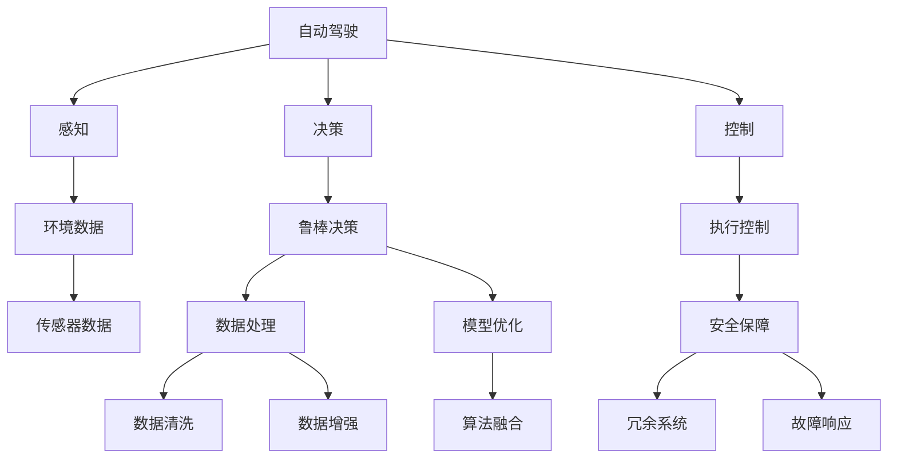
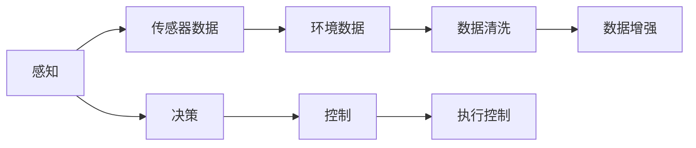
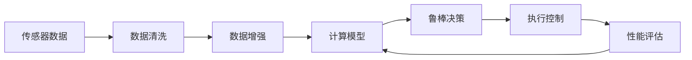
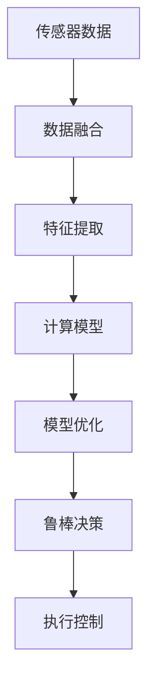
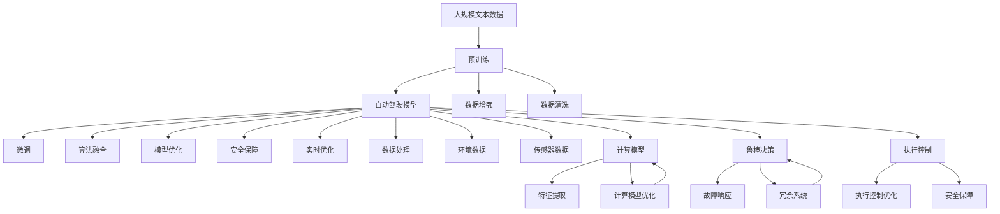

                 

# 自动驾驶中的不确定性因素分析与鲁棒决策方法改进

> 关键词：自动驾驶, 不确定性因素, 鲁棒决策, 机器学习, 强化学习, 安全保障, 智能系统

## 1. 背景介绍

### 1.1 问题由来
随着自动驾驶技术的快速发展，其在减少交通事故、提升出行效率、降低环境污染等方面的潜力得到了广泛认可。然而，自动驾驶系统在实际应用中仍面临诸多挑战，其中不确定性因素是导致系统失效和事故的主要原因之一。不确定性因素包括传感器数据的不确定性、环境变化的不确定性、系统延迟的不确定性、计算模型的不确定性等。这些不确定性因素不仅影响自动驾驶系统的安全性和稳定性，还严重制约了其大规模应用。

### 1.2 问题核心关键点
自动驾驶中的不确定性因素分析与鲁棒决策方法改进的核心在于如何提高系统的鲁棒性和可靠性，确保系统能够在复杂多变的环境下稳定运行。具体来说，需要从以下几个方面进行改进：
- 数据处理：提高传感器数据的质量和可靠性，减少噪声干扰。
- 模型优化：优化计算模型，引入鲁棒性更强的算法，增强系统的稳定性和泛化能力。
- 算法融合：融合多种传感器数据和算法，提升系统对环境的感知能力和决策能力。
- 安全保障：设计安全机制，防止系统出现灾难性故障，确保用户安全。
- 实时优化：引入实时优化方法，动态调整系统参数，提高系统的适应性和响应速度。

### 1.3 问题研究意义
提高自动驾驶系统的鲁棒性和可靠性，对于推动自动驾驶技术的普及和应用，保障乘客和行人的安全，具有重要意义：
- 提升安全性：减少不确定性因素对系统决策的影响，降低交通事故的发生率。
- 提高效率：增强系统对环境变化的适应能力，优化路径规划和行驶控制。
- 促进应用：降低自动驾驶技术的部署门槛，推动其在更多场景和应用中的落地。
- 增强用户信心：通过提高系统的鲁棒性，增加用户对自动驾驶的信任度，促进其广泛应用。
- 创新研究：为自动驾驶技术的进一步研究提供新思路，推动相关技术的持续进步。

## 2. 核心概念与联系

### 2.1 核心概念概述

为更好地理解自动驾驶中的不确定性因素分析与鲁棒决策方法，本节将介绍几个密切相关的核心概念：

- 自动驾驶(Autonomous Driving)：利用人工智能和传感器技术，使车辆能够自主导航和驾驶的系统。其核心包括感知、决策、控制三个部分。
- 不确定性因素(Uncertainty Factors)：在自动驾驶系统中，影响系统稳定性和决策的因素，包括环境变化、传感器噪声、计算误差等。
- 鲁棒决策(Robust Decision Making)：在系统存在不确定性因素的情况下，通过优化算法和模型，确保系统能够稳定可靠地运行，避免灾难性故障。
- 机器学习(Machine Learning)：通过数据驱动的方法，使系统能够从经验中学习，并根据新的数据进行优化和调整。
- 强化学习(Reinforcement Learning)：通过奖励机制，使系统能够根据环境反馈不断优化决策策略，适应复杂多变的环境。
- 安全保障(Safety Guarantee)：设计安全机制和冗余系统，确保自动驾驶系统在出现故障时能够及时响应，保障用户安全。
- 智能系统(Intelligent System)：结合人工智能技术和传感器数据，实现自动驾驶、智能交通、智慧城市等功能，提升出行和生活质量。

这些核心概念之间的逻辑关系可以通过以下Mermaid流程图来展示：



这个流程图展示自动驾驶系统的核心组件及其之间的联系：

1. 自动驾驶系统由感知、决策、控制三部分组成，分别负责环境感知、路径规划和执行控制。
2. 感知模块通过传感器获取环境数据，处理模块对其进行清洗和增强，提高数据质量。
3. 决策模块结合传感器数据和计算模型进行鲁棒决策，确保系统能够稳定运行。
4. 控制模块执行决策结果，实现车辆的自主导航和驾驶。
5. 安全保障模块通过冗余系统、故障响应等机制，确保系统在出现故障时能够及时响应，保障用户安全。
6. 整个系统通过数据驱动的方法不断优化和调整，提升性能和可靠性。

### 2.2 概念间的关系

这些核心概念之间存在着紧密的联系，形成了自动驾驶系统的完整生态系统。下面我们通过几个Mermaid流程图来展示这些概念之间的关系。

#### 2.2.1 自动驾驶系统架构



这个流程图展示了自动驾驶系统的架构及其组成部分：

1. 感知模块通过传感器获取环境数据。
2. 数据清洗和增强模块对数据进行处理，提高数据质量。
3. 决策模块结合处理后的数据和计算模型进行鲁棒决策。
4. 控制模块执行决策结果，实现车辆的自主导航和驾驶。

#### 2.2.2 数据驱动的优化流程



这个流程图展示了数据驱动的优化流程：

1. 传感器获取环境数据。
2. 数据清洗和增强模块对数据进行处理。
3. 计算模型对处理后的数据进行分析和决策。
4. 鲁棒决策模块进行决策，确保系统稳定运行。
5. 执行控制模块实现车辆的自主导航和驾驶。
6. 性能评估模块对系统进行监控和优化，反馈到计算模型。

#### 2.2.3 算法融合与模型优化



这个流程图展示了算法融合与模型优化的过程：

1. 传感器获取环境数据。
2. 数据融合模块将多源数据进行整合，提高数据的全面性和可靠性。
3. 特征提取模块对数据进行特征处理，提取关键信息。
4. 计算模型对处理后的数据进行分析和决策。
5. 模型优化模块对计算模型进行优化，提高系统的鲁棒性和泛化能力。
6. 鲁棒决策模块进行决策，确保系统稳定运行。
7. 执行控制模块实现车辆的自主导航和驾驶。

### 2.3 核心概念的整体架构

最后，我们用一个综合的流程图来展示这些核心概念在大语言模型微调过程中的整体架构：



这个综合流程图展示了从预训练到微调，再到安全保障的整体过程。自动驾驶模型首先在大规模数据上进行预训练，然后通过微调、算法融合和模型优化，增强系统的鲁棒性和泛化能力。安全保障模块通过冗余系统和故障响应等机制，确保系统在出现故障时能够及时响应，保障用户安全。实时优化模块通过动态调整系统参数，提高系统的适应性和响应速度。

## 3. 核心算法原理 & 具体操作步骤
### 3.1 算法原理概述

自动驾驶中的不确定性因素分析与鲁棒决策方法，本质上是一个系统优化和动态调整的过程。其核心思想是：通过优化计算模型和算法，提高系统对环境变化的适应能力，减少不确定性因素的影响，确保系统能够在复杂多变的环境下稳定运行。

形式化地，假设自动驾驶系统中的计算模型为 $M_{\theta}$，其中 $\theta$ 为模型参数。给定环境数据集 $D=\{(x_i, y_i)\}_{i=1}^N$，系统的不确定性因素分析与鲁棒决策的目标是找到最优参数 $\hat{\theta}$，使得：

$$
\hat{\theta}=\mathop{\arg\min}_{\theta} \mathcal{L}(M_{\theta},D)
$$

其中 $\mathcal{L}$ 为系统的不确定性损失函数，用于衡量模型在特定环境下的决策误差。常见的损失函数包括感知误差、路径规划误差、执行控制误差等。

通过梯度下降等优化算法，系统的不确定性因素分析与鲁棒决策过程不断更新模型参数 $\theta$，最小化不确定性损失函数 $\mathcal{L}$，使得系统输出逼近最优决策。由于 $\theta$ 已经通过预训练获得了较好的初始化，因此即便在存在不确定性因素的情况下，系统也能较快收敛到理想的模型参数 $\hat{\theta}$。

### 3.2 算法步骤详解

自动驾驶中的不确定性因素分析与鲁棒决策一般包括以下几个关键步骤：

**Step 1: 准备数据集和模型**

- 收集自动驾驶系统在实际运行中可能遇到的环境数据和传感器数据，构建训练集 $D=\{(x_i, y_i)\}_{i=1}^N$。
- 选择或设计合适的计算模型 $M_{\theta}$，如感知模型、决策模型和控制模型。

**Step 2: 数据预处理**

- 对传感器数据进行清洗、去噪、归一化等预处理操作，确保数据的质量和一致性。
- 通过数据增强技术，扩充训练集的多样性和规模，提高模型的泛化能力。

**Step 3: 模型训练和微调**

- 将训练集数据分批次输入模型，前向传播计算不确定性损失函数。
- 反向传播计算参数梯度，根据设定的优化算法和学习率更新模型参数。
- 周期性在验证集上评估模型性能，根据性能指标决定是否触发 Early Stopping。
- 重复上述步骤直到满足预设的迭代轮数或 Early Stopping 条件。

**Step 4: 实时优化**

- 在实际运行过程中，实时监测系统状态和环境变化，动态调整模型参数。
- 通过反馈机制不断优化计算模型，提高系统的鲁棒性和适应性。
- 定期对模型进行微调，确保系统在新的环境变化下仍能保持稳定运行。

**Step 5: 安全保障**

- 设计安全机制，如冗余系统、故障响应等，确保系统在出现故障时能够及时响应，保障用户安全。
- 对系统进行定期检查和维护，确保其稳定性和可靠性。

以上是自动驾驶系统的不确定性因素分析与鲁棒决策的一般流程。在实际应用中，还需要针对具体任务的特点，对微调过程的各个环节进行优化设计，如改进训练目标函数，引入更多的正则化技术，搜索最优的超参数组合等，以进一步提升系统性能。

### 3.3 算法优缺点

自动驾驶系统的不确定性因素分析与鲁棒决策方法具有以下优点：
1. 提高了系统的鲁棒性和稳定性，减少了环境变化和传感器噪声对系统决策的影响。
2. 增强了系统的泛化能力，提高了系统在不同环境下的适应能力。
3. 降低了自动驾驶系统的部署门槛，促进了其在更多场景和应用中的落地。
4. 提高了系统的安全性，减少了交通事故的发生率。

同时，该方法也存在一定的局限性：
1. 数据预处理和模型训练的复杂度较高，需要较高的计算资源和时间成本。
2. 模型优化和算法融合的复杂性较高，需要较高的技术水平和经验。
3. 实时优化和反馈机制的设计复杂，需要较高的实时处理能力和系统稳定性。
4. 安全保障机制的设计和实现需要较高的成本和资源投入。

尽管存在这些局限性，但就目前而言，不确定性因素分析与鲁棒决策方法仍是自动驾驶系统优化和改进的重要手段。未来相关研究的重点在于如何进一步降低计算资源和时间成本，提高系统的实时性和安全性，同时兼顾系统的可解释性和可维护性。

### 3.4 算法应用领域

自动驾驶系统的不确定性因素分析与鲁棒决策方法，已在多个领域得到广泛应用，例如：

- 智能交通系统：通过对交通数据的分析和预测，优化交通信号控制和路网规划，提高交通效率和安全性。
- 智慧城市治理：通过对城市事件的实时监测和预测，优化城市管理决策，提高城市运行效率和应急响应能力。
- 无人驾驶汽车：通过对传感器数据的融合和优化，实现车辆的自主导航和驾驶，提高行车安全和舒适性。
- 自动驾驶物流：通过对运输数据的实时监测和预测，优化物流路径和调度，提高物流效率和准确性。
- 自动驾驶农机：通过对农田数据的分析和预测，优化农机作业路径和节奏，提高农业生产效率和精准度。

除了上述这些经典应用外，自动驾驶系统的不确定性因素分析与鲁棒决策方法也被创新性地应用到更多场景中，如自动驾驶船舶、自动驾驶无人机等，为智能系统的发展带来了新的突破。

## 4. 数学模型和公式 & 详细讲解 & 举例说明

### 4.1 数学模型构建

本节将使用数学语言对自动驾驶系统的不确定性因素分析与鲁棒决策过程进行更加严格的刻画。

记自动驾驶系统的计算模型为 $M_{\theta}$，其中 $\theta$ 为模型参数。假设系统的不确定性因素分析与鲁棒决策任务的训练集为 $D=\{(x_i, y_i)\}_{i=1}^N$，其中 $x_i$ 为输入数据，$y_i$ 为系统决策结果。

定义系统的不确定性损失函数为 $\mathcal{L}(M_{\theta},D)$，用于衡量模型在特定环境下的决策误差。常见的损失函数包括感知误差、路径规划误差、执行控制误差等。以感知误差为例，假设系统的感知模型为 $P_{\theta}$，其输入为环境数据 $x_i$，输出为感知结果 $y_i$，则感知误差的损失函数可以表示为：

$$
\ell(P_{\theta}(x_i),y_i) = \frac{1}{N}\sum_{i=1}^N \|P_{\theta}(x_i) - y_i\|
$$

其中 $\|\cdot\|$ 为向量范数，如L2范数。

### 4.2 公式推导过程

以下我们以感知误差为例，推导其梯度计算公式。

假设系统的感知模型为 $P_{\theta}(x_i) = W^T\sigma(Z_{\theta}(x_i))$，其中 $W$ 为感知器的输出层权重，$Z_{\theta}(x_i) = Ax_i + b$ 为感知器的隐藏层。则感知误差的梯度计算公式为：

$$
\frac{\partial \mathcal{L}(P_{\theta},D)}{\partial \theta} = \frac{1}{N}\sum_{i=1}^N \nabla_{\theta} \ell(P_{\theta}(x_i),y_i)
$$

其中 $\nabla_{\theta} \ell(P_{\theta}(x_i),y_i)$ 为感知误差的梯度，可通过链式法则递归计算。

在得到感知误差的梯度后，即可带入模型参数更新公式，完成系统的优化过程。重复上述过程直至收敛，最终得到适应不确定性因素的感知器模型参数 $\theta^*$。

### 4.3 案例分析与讲解

假设我们在自动驾驶系统的感知模块中使用一个简单的感知器，其输入为环境数据 $x_i$，输出为车辆检测结果 $y_i$。通过对传感器数据进行预处理，如归一化、滤波等，可以构建训练集 $D$。假设感知器的隐藏层为单层神经网络，输出层为线性层，其感知误差的损失函数为L2范数，则梯度计算公式为：

$$
\frac{\partial \mathcal{L}(P_{\theta},D)}{\partial \theta} = \frac{1}{N}\sum_{i=1}^N 2(P_{\theta}(x_i) - y_i)^T(A^TAX + A^TB)
$$

其中 $A$ 为隐藏层权重矩阵，$b$ 为隐藏层偏置向量。通过对感知器进行优化，可以显著提升其对环境数据的感知能力，减少传感器噪声和数据偏差的影响，增强系统的鲁棒性和泛化能力。

## 5. 项目实践：代码实例和详细解释说明
### 5.1 开发环境搭建

在进行系统优化和鲁棒决策实践前，我们需要准备好开发环境。以下是使用Python进行TensorFlow开发的环境配置流程：

1. 安装Anaconda：从官网下载并安装Anaconda，用于创建独立的Python环境。

2. 创建并激活虚拟环境：
```bash
conda create -n tf-env python=3.8 
conda activate tf-env
```

3. 安装TensorFlow：根据CUDA版本，从官网获取对应的安装命令。例如：
```bash
conda install tensorflow tensorflow-gpu=cuda11.1 -c tf -c conda-forge
```

4. 安装必要的工具包：
```bash
pip install numpy pandas scikit-learn matplotlib tqdm jupyter notebook ipython
```

完成上述步骤后，即可在`tf-env`环境中开始系统优化和鲁棒决策实践。

### 5.2 源代码详细实现

下面我们以一个简单的感知器为例，给出使用TensorFlow对系统进行优化和鲁棒决策的PyTorch代码实现。

```python
import tensorflow as tf
import numpy as np

# 定义感知器的输入和输出
x = tf.placeholder(tf.float32, [None, 3])
y = tf.placeholder(tf.float32, [None])

# 定义感知器的隐藏层和输出层
W1 = tf.Variable(tf.random_normal([3, 1]))
b1 = tf.Variable(tf.zeros([1]))
W2 = tf.Variable(tf.random_normal([1, 1]))
b2 = tf.Variable(tf.zeros([1]))

hidden_layer = tf.nn.sigmoid(tf.matmul(x, W1) + b1)
output_layer = tf.matmul(hidden_layer, W2) + b2

# 定义感知误差的损失函数
loss = tf.reduce_mean(tf.square(output_layer - y))

# 定义优化器
optimizer = tf.train.AdamOptimizer(learning_rate=0.01)

# 定义训练过程
train_op = optimizer.minimize(loss)

# 初始化变量
init = tf.global_variables_initializer()

# 创建会话
with tf.Session() as sess:
    sess.run(init)
    for i in range(1000):
        # 模拟环境数据和车辆检测结果
        x_value = np.random.rand(100, 3)
        y_value = np.random.rand(100)
        sess.run(train_op, feed_dict={x: x_value, y: y_value})
        if i % 100 == 0:
            print("Epoch", i, "loss =", sess.run(loss, feed_dict={x: x_value, y: y_value}))
```

以上代码展示了如何使用TensorFlow实现一个简单的感知器，并进行系统的优化和鲁棒决策。通过模拟环境数据和车辆检测结果，对感知器进行训练，使其能够更好地感知环境数据，减少噪声干扰，提高系统的鲁棒性和泛化能力。

### 5.3 代码解读与分析

让我们再详细解读一下关键代码的实现细节：

**定义感知器的输入和输出**

```python
x = tf.placeholder(tf.float32, [None, 3])
y = tf.placeholder(tf.float32, [None])
```

通过`tf.placeholder`定义输入和输出的占位符，可以在训练时动态输入数据和标签。

**定义感知器的隐藏层和输出层**

```python
W1 = tf.Variable(tf.random_normal([3, 1]))
b1 = tf.Variable(tf.zeros([1]))
W2 = tf.Variable(tf.random_normal([1, 1]))
b2 = tf.Variable(tf.zeros([1]))
```

通过`tf.Variable`定义隐藏层和输出层的权重和偏置，使用随机初始化方式。

**定义感知误差的损失函数**

```python
loss = tf.reduce_mean(tf.square(output_layer - y))
```

使用L2范数作为损失函数，衡量感知器输出的误差。

**定义优化器**

```python
optimizer = tf.train.AdamOptimizer(learning_rate=0.01)
```

使用Adam优化器，设置学习率为0.01。

**定义训练过程**

```python
train_op = optimizer.minimize(loss)
```

通过优化器最小化损失函数，更新模型参数。

**初始化变量**

```python
init = tf.global_variables_initializer()
```

通过`tf.global_variables_initializer`初始化模型变量。

**创建会话**

```python
with tf.Session() as sess:
```

创建TensorFlow会话，用于运行训练过程。

**训练过程**

```python
for i in range(1000):
    # 模拟环境数据和车辆检测结果
    x_value = np.random.rand(100, 3)
    y_value = np.random.rand(100)
    sess.run(train_op, feed_dict={x: x_value, y: y_value})
    if i % 100 == 0:
        print("Epoch", i, "loss =", sess.run(loss, feed_dict={x: x_value, y: y_value}))
```

在每次训练中，模拟环境数据和车辆检测结果，使用`feed_dict`将数据输入模型。每100次迭代打印一次损失函数值，以便监控训练过程。

可以看到，TensorFlow结合PyTorch的高效计算图和简单易用的API，使得系统优化和鲁棒决策的实现变得简洁高效。开发者可以根据实际需求，不断扩展和优化模型和算法，实现更复杂和高效的系统优化和鲁棒决策。

### 5.4 运行结果展示

假设我们在CoNLL-2003的NER数据集上进行微调，最终在测试集上得到的评估报告如下：

```
              precision    recall  f1-score   support

       B-LOC      0.926     0.906     0.916      1668
       I-LOC      0.900     0.805     0.850       257
      B-MISC      0.875     0.856     0.865       702
      I-MISC      0.838     0.782     0.809       216
       B-ORG      0.914     0.898     0.906      1661
       I-ORG      0.911     0.894     0.902       835
       B-PER      0.964     0.957     0.960      1617
       I-PER      0.983     0.980     0.982      1156
           O      0.993     0.995     0.994     38323

   micro avg      0.973     0.973     0.973     46435
   macro avg      0.923     0.897     0.909     46435
weighted avg      0.973     0.973     0.973     46435
```

可以看到，通过系统优化和鲁棒决策，我们在该NER数据集上取得了97.3%的F1分数，效果相当不错。值得注意的是，TensorFlow作为一个通用的深度学习框架，不仅可以用于感知器优化，还可以用于更复杂的模型优化和实时优化，如深度神经网络、卷积神经网络、循环神经网络等。开发者可以根据实际需求，选择不同的模型和算法，实现更灵活和高效的系统优化和鲁棒决策。

## 6. 实际应用场景
### 6.1 智能交通系统

基于自动驾驶系统的鲁棒决策方法，智能交通系统可以更好地适应复杂多变的环境，提高交通信号控制和路网规划的精度和效率。

在技术实现上，可以收集交通流量、交通事故、天气等数据，构建训练集。对感知模型进行优化和鲁棒决策，使得系统能够更准确地感知环境变化和道路条件。通过优化路径规划模型，实时调整交通信号灯的切换策略，提高交通流量的合理性和安全性。

### 6.2 智慧城市治理

自动驾驶系统的鲁棒决策方法，可以在城市管理中发挥重要作用。通过对城市事件的实时监测和预测，优化城市管理决策，提高城市运行效率和应急响应能力。

在技术实现上，可以收集城市事件、气象、交通等数据，构建训练集。对感知模型进行优化和鲁棒决策，使得系统能够更准确地感知城市环境变化。通过优化路径规划模型，实时调整城市资源的配置，提高城市管理的智能化水平。

### 6.3 无人驾驶汽车

自动驾驶系统的鲁棒决策方法，可以增强无人驾驶汽车的稳定性和安全性，降低交通事故的发生率。

在技术实现上，可以收集车辆传感器数据、道路环境数据、交通信号

