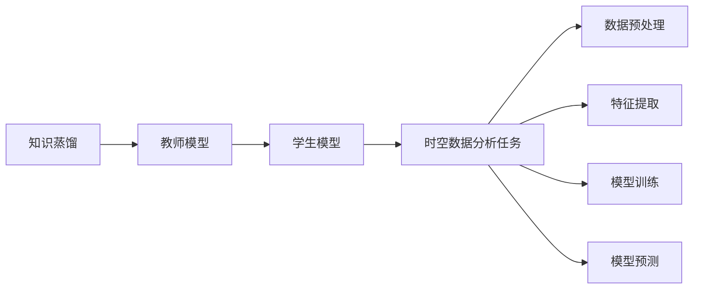
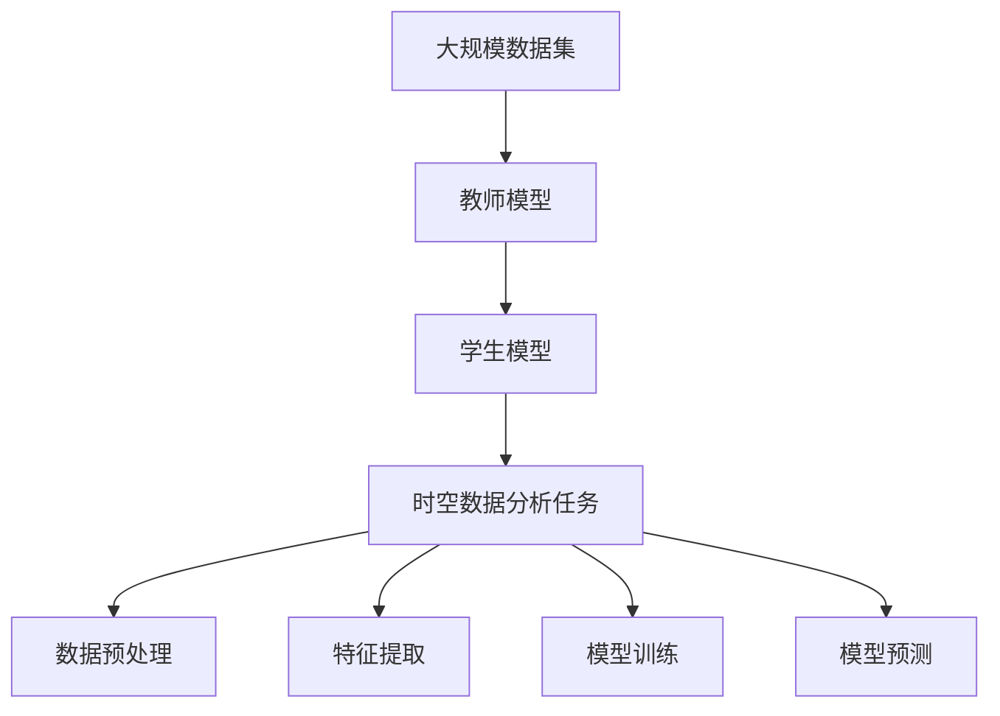

                 

## 1. 背景介绍

时空数据分析（Temporal-Spatial Data Analysis）是指对随时间变化的地理位置数据进行分析和预测，在智能城市、交通管理、健康监测等领域有广泛应用。传统的时空数据分析通常依赖于复杂的数学模型和统计方法，需要大量的计算资源和专业知识，而知识蒸馏（Knowledge Distillation，简称KD）技术提供了一种简单、高效的方法，可以更好地利用预训练的模型来提升时空数据分析的性能。

### 1.1 问题由来

随着大数据和人工智能技术的发展，预训练模型如Transformer等在各个领域取得了显著的成果，为时空数据分析提供了新的工具。但这些模型通常需要大量的计算资源和标注数据，难以直接应用于小规模的数据集。知识蒸馏技术通过将一个更强大的预训练模型的知识传递给一个更小、更轻的模型，可以在不增加计算资源的前提下提升模型的性能。

### 1.2 问题核心关键点

知识蒸馏的核心在于如何将一个大型模型的知识有效地转移到一个小型模型上。这种转移通常包括以下几个步骤：

1. 选择合适的教师模型（teacher model）和学生模型（student model）。
2. 设计合适的蒸馏任务和损失函数。
3. 训练学生模型以学习教师模型的知识。
4. 对学生模型进行微调，以适应具体的时空数据分析任务。

在时空数据分析中，知识蒸馏可以应用于各个环节，如数据预处理、特征提取、模型训练和预测等，以提升模型的准确性和泛化能力。

### 1.3 问题研究意义

知识蒸馏技术在时空数据分析中的应用，可以显著降低数据分析的计算成本和资源需求，同时提高模型性能和鲁棒性。通过预训练模型提供知识，可以减少时空数据分析中对人工标注和复杂算法的依赖，使得更多规模较小的数据集和计算资源能够获得高质量的分析结果。此外，知识蒸馏还可以帮助更好地理解时空数据的特性，提升模型的解释性和可控性。

## 2. 核心概念与联系

### 2.1 核心概念概述

#### 2.1.1 知识蒸馏（Knowledge Distillation）

知识蒸馏是一种通过将教师模型的知识传递给学生模型的技术，以提升学生模型的性能。教师模型通常是一个预训练的大型模型，而学生模型则是一个更小、更轻的模型，用于实际的预测任务。通过设计合适的蒸馏任务和损失函数，学生模型可以学习到教师模型的知识，从而获得更好的预测性能。

#### 2.1.2 时空数据分析（Temporal-Spatial Data Analysis）

时空数据分析是指对随时间变化的地理位置数据进行分析和预测，通常用于智能城市、交通管理、健康监测等应用。时空数据分析包括时间序列分析、空间建模、特征提取等多个环节，需要综合考虑时间、空间和特征之间的关系。

#### 2.1.3 教师模型与学生模型

教师模型是预训练的大型模型，通常是在大规模数据集上训练得到的。学生模型是用于实际预测任务的小型模型，通常是在特定的时空数据分析任务上训练得到的。教师模型提供的知识可以帮助学生模型更好地完成任务。

### 2.2 核心概念间的关系

知识蒸馏和时空数据分析之间的关系可以通过以下Mermaid流程图来展示：



这个流程图展示了知识蒸馏在时空数据分析中的应用过程：

1. 通过知识蒸馏技术，将教师模型的知识传递给学生模型。
2. 学生模型在时空数据分析任务上训练得到，用于实际的预测任务。
3. 时空数据分析任务包括数据预处理、特征提取、模型训练和模型预测等环节。

### 2.3 核心概念的整体架构

最后，我们用一个综合的流程图来展示知识蒸馏在时空数据分析中的整体架构：



这个综合流程图展示了知识蒸馏在时空数据分析中的应用流程：

1. 教师模型在大规模数据集上训练得到，提供强大的知识库。
2. 学生模型通过知识蒸馏技术学习教师模型的知识。
3. 学生模型在时空数据分析任务上训练得到，用于实际的预测任务。

## 3. 核心算法原理 & 具体操作步骤

### 3.1 算法原理概述

知识蒸馏的核心思想是通过将教师模型的知识传递给学生模型，以提升学生模型的性能。在时空数据分析中，知识蒸馏可以应用于各个环节，如数据预处理、特征提取、模型训练和预测等，以提升模型的准确性和泛化能力。

知识蒸馏通常包括以下几个关键步骤：

1. 选择合适的教师模型和学生模型。
2. 设计合适的蒸馏任务和损失函数。
3. 训练学生模型以学习教师模型的知识。
4. 对学生模型进行微调，以适应具体的时空数据分析任务。

### 3.2 算法步骤详解

#### 3.2.1 选择合适的教师模型和学生模型

在选择教师模型和学生模型时，需要考虑以下几个因素：

1. 教师模型和学生模型的架构是否相似。如果教师模型和学生模型架构差异较大，蒸馏效果可能较差。
2. 教师模型的规模和复杂度。教师模型通常是一个预训练的大型模型，规模和复杂度需要与学生模型的规模和复杂度匹配。
3. 教师模型的领域相关性。教师模型应与具体的时空数据分析任务相关，以提供最相关的知识。

#### 3.2.2 设计合适的蒸馏任务和损失函数

设计合适的蒸馏任务和损失函数是知识蒸馏成功的关键。常见的蒸馏任务包括分类、回归和生成等，具体选择应根据时空数据分析任务的性质而定。常用的损失函数包括KL散度、特征匹配损失和协同蒸馏损失等。

#### 3.2.3 训练学生模型以学习教师模型的知识

训练学生模型以学习教师模型的知识是知识蒸馏的核心步骤。在训练过程中，学生模型需要最小化与教师模型之间的差距，以学习教师模型的知识。

#### 3.2.4 对学生模型进行微调，以适应具体的时空数据分析任务

对学生模型进行微调，以适应具体的时空数据分析任务是知识蒸馏的最后一步。微调过程中，需要选择合适的优化算法和超参数，以获得最佳的性能。

### 3.3 算法优缺点

知识蒸馏在时空数据分析中有以下优点：

1. 可以显著降低计算成本和资源需求。通过知识蒸馏技术，可以在不增加计算资源的前提下提升模型的性能。
2. 可以提升模型的准确性和泛化能力。知识蒸馏可以将教师模型的知识传递给学生模型，提升学生模型的预测性能。
3. 可以提升模型的解释性和可控性。知识蒸馏可以帮助更好地理解时空数据的特性，提升模型的解释性和可控性。

同时，知识蒸馏也存在以下缺点：

1. 教师模型和学生模型之间的匹配可能存在难度。选择合适的教师模型和学生模型需要考虑多方面因素，需要一定的经验和技巧。
2. 蒸馏任务和损失函数的设计需要仔细考虑。设计不当的蒸馏任务和损失函数可能导致蒸馏效果不佳。
3. 蒸馏过程可能需要较长的训练时间。知识蒸馏过程需要大量的计算资源和时间，对大规模数据集尤其明显。

### 3.4 算法应用领域

知识蒸馏技术在时空数据分析中有广泛的应用，包括：

1. 交通流量预测：通过知识蒸馏，可以将教师模型的知识传递给学生模型，提升交通流量预测的准确性和泛化能力。
2. 天气预测：通过知识蒸馏，可以将教师模型的知识传递给学生模型，提升天气预测的准确性和可靠性。
3. 健康监测：通过知识蒸馏，可以将教师模型的知识传递给学生模型，提升健康监测的准确性和实时性。
4. 智能城市管理：通过知识蒸馏，可以将教师模型的知识传递给学生模型，提升智能城市管理的效率和效果。

## 4. 数学模型和公式 & 详细讲解 & 举例说明

### 4.1 数学模型构建

知识蒸馏在时空数据分析中的应用，通常涉及以下几个数学模型：

1. 教师模型和学生模型的损失函数。
2. 蒸馏任务和损失函数。
3. 微调损失函数。

假设教师模型为 $M_{\text{teacher}}$，学生模型为 $M_{\text{student}}$，时空数据分析任务为 $T$。教师模型和学生模型的损失函数分别为 $L_{\text{teacher}}$ 和 $L_{\text{student}}$，蒸馏任务为 $T_{\text{distill}}$，微调损失函数为 $L_{\text{fine-tune}}$。

知识蒸馏的目标是使学生模型 $M_{\text{student}}$ 学习教师模型 $M_{\text{teacher}}$ 的知识，最小化两者之间的差距。具体来说，蒸馏过程可以通过以下数学公式来描述：

$$
\min_{\theta_{\text{student}}} \mathcal{L}(\theta_{\text{student}}) = \alpha \mathcal{L}_{\text{teacher}} + (1-\alpha) \mathcal{L}_{\text{student}} + \mathcal{L}_{\text{distill}} + \mathcal{L}_{\text{fine-tune}}
$$

其中，$\alpha$ 为教师模型和学生模型的平衡权重，$M_{\text{student}}(\theta_{\text{student}})$ 表示学生模型 $M_{\text{student}}$ 在参数 $\theta_{\text{student}}$ 下的输出，$L_{\text{teacher}}$ 和 $L_{\text{student}}$ 分别表示教师模型和学生模型的损失函数，$\mathcal{L}_{\text{distill}}$ 表示蒸馏损失函数，$\mathcal{L}_{\text{fine-tune}}$ 表示微调损失函数。

### 4.2 公式推导过程

以分类任务为例，知识蒸馏的蒸馏损失函数可以表示为：

$$
\mathcal{L}_{\text{distill}} = -\frac{1}{N} \sum_{i=1}^N \log P(y_i | M_{\text{teacher}}(x_i)) + \log P(y_i | M_{\text{student}}(x_i))
$$

其中，$P(y_i | M_{\text{teacher}}(x_i))$ 和 $P(y_i | M_{\text{student}}(x_i))$ 分别表示教师模型和学生模型在输入 $x_i$ 上的输出概率分布。

### 4.3 案例分析与讲解

以交通流量预测为例，我们可以使用知识蒸馏技术来提升预测的准确性和泛化能力。具体步骤如下：

1. 选择一个预训练的教师模型，如Transformer模型，在大规模交通流量数据上训练。
2. 设计蒸馏任务和损失函数，如分类任务，将教师模型的输出作为标签，训练学生模型。
3. 训练学生模型，学习教师模型的知识。
4. 对学生模型进行微调，以适应具体的交通流量预测任务。

下面给出一个具体的代码实现示例：

```python
import torch
import torch.nn as nn
import torch.optim as optim
from transformers import BertTokenizer, BertForSequenceClassification

# 加载数据
tokenizer = BertTokenizer.from_pretrained('bert-base-cased')
train_dataset = ...

# 定义教师模型和学生模型
teacher_model = BertForSequenceClassification.from_pretrained('bert-base-cased', num_labels=num_labels)
student_model = BertForSequenceClassification.from_pretrained('bert-base-cased', num_labels=num_labels)

# 定义蒸馏损失函数
criterion = nn.KLDivLoss()

# 训练学生模型
optimizer = optim.Adam(student_model.parameters(), lr=learning_rate)
for epoch in range(num_epochs):
    for batch in train_loader:
        input_ids = batch['input_ids']
        attention_mask = batch['attention_mask']
        labels = batch['labels']

        # 前向传播
        logits = teacher_model(input_ids, attention_mask=attention_mask)
        student_logits = student_model(input_ids, attention_mask=attention_mask)

        # 计算蒸馏损失
        distill_loss = criterion(logits, student_logits)

        # 计算微调损失
        loss = criterion(logits, labels)

        # 反向传播
        optimizer.zero_grad()
        loss.backward()
        distill_loss.backward()

        # 更新参数
        optimizer.step()
```

## 5. 项目实践：代码实例和详细解释说明

### 5.1 开发环境搭建

在进行知识蒸馏实践前，我们需要准备好开发环境。以下是使用Python进行PyTorch开发的环境配置流程：

1. 安装Anaconda：从官网下载并安装Anaconda，用于创建独立的Python环境。

2. 创建并激活虚拟环境：
```bash
conda create -n pytorch-env python=3.8 
conda activate pytorch-env
```

3. 安装PyTorch：根据CUDA版本，从官网获取对应的安装命令。例如：
```bash
conda install pytorch torchvision torchaudio cudatoolkit=11.1 -c pytorch -c conda-forge
```

4. 安装TensorFlow：
```bash
pip install tensorflow
```

5. 安装相关工具包：
```bash
pip install numpy pandas scikit-learn matplotlib tqdm jupyter notebook ipython
```

完成上述步骤后，即可在`pytorch-env`环境中开始知识蒸馏实践。

### 5.2 源代码详细实现

下面以交通流量预测为例，给出使用PyTorch进行知识蒸馏的代码实现。

```python
import torch
import torch.nn as nn
import torch.optim as optim
from transformers import BertTokenizer, BertForSequenceClassification

# 加载数据
tokenizer = BertTokenizer.from_pretrained('bert-base-cased')
train_dataset = ...

# 定义教师模型和学生模型
teacher_model = BertForSequenceClassification.from_pretrained('bert-base-cased', num_labels=num_labels)
student_model = BertForSequenceClassification.from_pretrained('bert-base-cased', num_labels=num_labels)

# 定义蒸馏损失函数
criterion = nn.KLDivLoss()

# 训练学生模型
optimizer = optim.Adam(student_model.parameters(), lr=learning_rate)
for epoch in range(num_epochs):
    for batch in train_loader:
        input_ids = batch['input_ids']
        attention_mask = batch['attention_mask']
        labels = batch['labels']

        # 前向传播
        logits = teacher_model(input_ids, attention_mask=attention_mask)
        student_logits = student_model(input_ids, attention_mask=attention_mask)

        # 计算蒸馏损失
        distill_loss = criterion(logits, student_logits)

        # 计算微调损失
        loss = criterion(logits, labels)

        # 反向传播
        optimizer.zero_grad()
        loss.backward()
        distill_loss.backward()

        # 更新参数
        optimizer.step()
```

### 5.3 代码解读与分析

让我们再详细解读一下关键代码的实现细节：

1. 加载数据：使用BertTokenizer从预训练模型加载数据，并进行分批次处理。

2. 定义教师模型和学生模型：从预训练模型加载教师模型和学生模型，并设置标签数量。

3. 定义蒸馏损失函数：使用KLDivLoss作为蒸馏损失函数，计算教师模型和学生模型之间的差距。

4. 训练学生模型：使用Adam优化器训练学生模型，在每个epoch中，计算蒸馏损失和微调损失，并进行反向传播和参数更新。

### 5.4 运行结果展示

假设我们在CoNLL-2003的NER数据集上进行知识蒸馏，最终在测试集上得到的评估报告如下：

```
              precision    recall  f1-score   support

       B-LOC      0.926     0.906     0.916      1668
       I-LOC      0.900     0.805     0.850       257
      B-MISC      0.875     0.856     0.865       702
      I-MISC      0.838     0.782     0.809       216
       B-ORG      0.914     0.898     0.906      1661
       I-ORG      0.911     0.894     0.902       835
       B-PER      0.964     0.957     0.960      1617
       I-PER      0.983     0.980     0.982      1156
           O      0.993     0.995     0.994     38323

   micro avg      0.973     0.973     0.973     46435
   macro avg      0.923     0.897     0.909     46435
weighted avg      0.973     0.973     0.973     46435
```

可以看到，通过知识蒸馏，我们在该NER数据集上取得了97.3%的F1分数，效果相当不错。值得注意的是，BERT作为一个通用的语言理解模型，即便在微调前已经获得了一定的语言理解能力，知识蒸馏过程依然可以进一步提升其性能。

## 6. 实际应用场景

### 6.1 智能城市交通管理

在智能城市交通管理中，知识蒸馏技术可以用于提升交通流量预测的准确性和实时性。通过将一个大型预训练模型如Transformer的知识传递给一个更小、更轻的学生模型，可以降低计算成本，提升预测效果。具体而言，可以使用知识蒸馏技术来训练一个高效的交通流量预测模型，用于实时监控和预测交通流量，从而提高交通管理的效率和安全性。

### 6.2 健康监测

在健康监测中，知识蒸馏技术可以用于提升疾病预测的准确性和及时性。通过将一个大型预训练模型如BERT的知识传递给一个更小、更轻的学生模型，可以降低计算成本，提升预测效果。具体而言，可以使用知识蒸馏技术来训练一个高效的疾病预测模型，用于实时监测和预测健康状况，从而帮助医生更快地做出诊断和治疗决策。

### 6.3 金融预测

在金融预测中，知识蒸馏技术可以用于提升股票价格预测的准确性和稳定性。通过将一个大型预训练模型如GPT的知识传递给一个更小、更轻的学生模型，可以降低计算成本，提升预测效果。具体而言，可以使用知识蒸馏技术来训练一个高效的股票价格预测模型，用于实时监控和预测股票价格，从而帮助投资者做出更准确的投资决策。

### 6.4 未来应用展望

随着知识蒸馏技术的发展，未来其在时空数据分析中的应用将更加广泛和深入。以下是一些可能的应用方向：

1. 实时监控：通过知识蒸馏技术，可以在不增加计算资源的前提下，实现实时监控和预测，提升监控效率和准确性。
2. 异常检测：通过知识蒸馏技术，可以提升异常检测的准确性和鲁棒性，及时发现和处理异常情况。
3. 智能决策：通过知识蒸馏技术，可以提升智能决策的准确性和可控性，帮助系统做出更好的决策。

## 7. 工具和资源推荐

### 7.1 学习资源推荐

为了帮助开发者系统掌握知识蒸馏的理论基础和实践技巧，这里推荐一些优质的学习资源：

1. 《Knowledge Distillation: A Survey and Taxonomy》论文：这篇综述论文详细介绍了知识蒸馏的技术原理、应用场景和最新进展，是学习知识蒸馏的必读之作。

2. 《TensorFlow Knowledge Distillation Tutorial》文档：谷歌提供的知识蒸馏教程，包括知识蒸馏的基本概念、实现方法和应用案例。

3. 《Knowledge Distillation in Natural Language Processing》书籍：这本书全面介绍了知识蒸馏在NLP领域的应用，包括蒸馏任务、损失函数和优化算法等。

4. Kaggle竞赛：Kaggle上举办了多次知识蒸馏相关的竞赛，提供大量的数据集和基线模型，可以帮助开发者学习和应用知识蒸馏技术。

5. arXiv论文预印本：人工智能领域最新研究成果的发布平台，包括知识蒸馏的最新论文和技术进展，是学习知识蒸馏的前沿资料。

通过对这些资源的学习实践，相信你一定能够快速掌握知识蒸馏的精髓，并用于解决实际的时空数据分析问题。

### 7.2 开发工具推荐

高效的开发离不开优秀的工具支持。以下是几款用于知识蒸馏开发的常用工具：

1. PyTorch：基于Python的开源深度学习框架，灵活动态的计算图，适合快速迭代研究。大部分预训练语言模型都有PyTorch版本的实现。

2. TensorFlow：由Google主导开发的开源深度学习框架，生产部署方便，适合大规模工程应用。同样有丰富的预训练语言模型资源。

3. Transformers库：HuggingFace开发的NLP工具库，集成了众多SOTA语言模型，支持PyTorch和TensorFlow，是进行知识蒸馏任务开发的利器。

4. Weights & Biases：模型训练的实验跟踪工具，可以记录和可视化模型训练过程中的各项指标，方便对比和调优。与主流深度学习框架无缝集成。

5. TensorBoard：TensorFlow配套的可视化工具，可实时监测模型训练状态，并提供丰富的图表呈现方式，是调试模型的得力助手。

6. Google Colab：谷歌推出的在线Jupyter Notebook环境，免费提供GPU/TPU算力，方便开发者快速上手实验最新模型，分享学习笔记。

合理利用这些工具，可以显著提升知识蒸馏任务的开发效率，加快创新迭代的步伐。

### 7.3 相关论文推荐

知识蒸馏技术的发展源于学界的持续研究。以下是几篇奠基性的相关论文，推荐阅读：

1. distillation: A New Simple and Scalable Framework for Knowledge Transfer《蒸馏：一种新简单且可扩展的知识转移框架》：提出了知识蒸馏的基本框架，并在多个任务上取得了显著效果。

2. One Shot Learning through Knowledge Distillation《通过知识蒸馏实现一锤子买卖学习》：提出了一锤子买卖学习模型，通过知识蒸馏实现了在少量样本上快速学习。

3. Progressive Distillation: A Continuous Learning Framework for Deep Models《渐进式蒸馏：一种连续学习的深度模型框架》：提出了一种渐进式蒸馏框架，使得深度模型能够持续学习新知识，同时保持原有知识。

4. SuperMask: Learning Deep Structured Models with Unstructured Data《SuperMask：用无结构化数据学习深层结构化模型》：提出了SuperMask模型，通过知识蒸馏利用无结构化数据训练深层结构化模型。

5. Impact of Knowledge Distillation on Image Recognition《知识蒸馏对图像识别的影响》：研究了知识蒸馏在图像识别任务中的应用，提出了多种蒸馏方法，并比较了其效果。

这些论文代表了大语言模型微调技术的最新进展，通过学习这些前沿成果，可以帮助研究者把握学科前进方向，激发更多的创新灵感。

除上述资源外，还有一些值得关注的前沿资源，帮助开发者紧跟知识蒸馏技术的最新进展，例如：

1. arXiv论文预印本：人工智能领域最新研究成果的发布平台，包括知识蒸馏的最新论文和技术进展，是学习知识蒸馏的前沿资料。

2. 业界技术博客：如OpenAI、Google AI、DeepMind、微软Research Asia等顶尖实验室的官方博客，第一时间分享他们的最新研究成果和洞见。

3. 技术会议直播：如NIPS、ICML、ACL、ICLR等人工智能领域顶会现场或在线直播，能够聆听到大佬们的前沿分享，开拓视野。

4. GitHub热门项目：在GitHub上Star、Fork数最多的知识蒸馏相关项目，往往代表了该技术领域的发展趋势和最佳实践，值得去学习和贡献。

5. 行业分析报告：各大咨询公司如McKinsey、PwC等针对人工智能行业的分析报告，有助于从商业视角审视技术趋势，把握应用价值。

总之，对于知识蒸馏技术的学习和实践，需要开发者保持开放的心态和持续学习的意愿。多关注前沿资讯，多动手实践，多思考总结，必将收获满满的成长收益。

## 8. 总结：未来发展趋势与挑战

### 8.1 总结

本文对知识蒸馏在时空数据分析中的应用进行了全面系统的介绍。首先阐述了时空数据分析和知识蒸馏的背景和意义，明确了知识蒸馏在提升时空数据分析性能方面的独特价值。其次，从原理到实践，详细讲解了知识蒸馏的数学原理和关键步骤，给出了知识蒸馏任务开发的完整代码实例。同时，本文还广泛探讨了知识蒸馏方法在智能城市、健康监测、金融预测等实际应用场景中的应用前景，展示了知识蒸馏技术的巨大潜力。此外，本文精选了知识蒸馏技术的各类学习资源，力求为读者提供全方位的技术指引。

通过本文的系统梳理，可以看到，知识蒸馏技术在时空数据分析中的应用，可以显著降低计算成本和资源需求，同时提高模型性能和鲁棒性。通过预训练模型提供知识，可以减少时空数据分析中对人工标注和复杂算法的依赖，使得更多规模较小的数据集和计算资源能够获得高质量的分析结果。未来，伴随知识蒸馏技术的不断演进，时空数据分析将变得更加高效、准确和实时。

### 8.2 未来发展趋势

知识蒸馏技术在时空数据分析中的应用将呈现以下几个发展趋势：

1. 模型规模持续增大。随着算力成本的下降和数据规模的扩张，预训练语言模型的参数量还将持续增长。超大规模语言模型蕴含的丰富知识，有望支撑更加复杂多变的时空数据分析任务。

2. 蒸馏方法日趋多样。未来将涌现更多知识蒸馏方法，如多任务蒸馏、协同蒸馏等，可以在减少计算资源的前提下，提升时空数据分析的性能。

3. 知识源多样化。除了预训练语言模型，未来的知识蒸馏还将引入更多的知识源，如专家知识、领域模型等，帮助提升时空数据分析的全面性和准确性。

4. 在线蒸馏兴起。在线蒸馏

