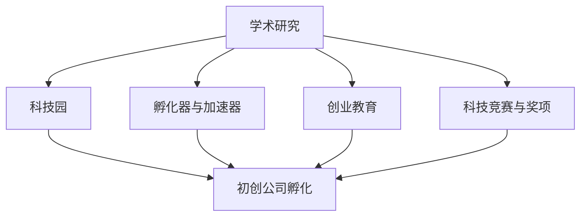

                 

# 硅谷创新的源泉:斯坦福大学的作用

## 1. 背景介绍

硅谷，这个位于美国加州的科技创新中心，以其庞大的人才储备、优秀的创业环境、先进的技术和活跃的商业生态，成为全球科技创新的源泉。而在这背后，斯坦福大学（Stanford University）扮演了至关重要的角色，为硅谷乃至全球科技产业的繁荣提供了强大的智力支持。

### 1.1 硅谷与斯坦福大学的关系

斯坦福大学成立于1891年，位于旧金山以南约50公里的帕洛阿尔托市，距离硅谷仅有几公里之遥。作为全球顶尖的学术机构，斯坦福大学不仅培养了大量的科学家、工程师和企业家，更是在科技创新领域持续贡献力量。据统计，斯坦福大学校友在硅谷创办的高科技公司，如谷歌、Facebook、特斯拉、惠普等，占据了硅谷科技公司总数的一半以上。

### 1.2 斯坦福大学在硅谷创新的地位

斯坦福大学在硅谷的科技创新中起到了不可替代的作用。以下是几个关键的创新领域：

1. **教育与研究**：斯坦福大学拥有众多世界级的研究机构和实验室，如斯坦福线性加速器中心（SLAC）、斯坦福电子显微镜实验室（SEM Lab）等。这些机构不仅推动了基础科学研究的前沿进展，还为硅谷提供了大量的科研成果和科技人才。

2. **技术转让**：斯坦福大学长期致力于将研究成果转化为实用技术，并鼓励教师创业。例如，斯坦福大学最早建立了科技园，为初创公司提供办公场地、实验室、咨询服务等支持，催生了包括思科、网景、谷歌等在内的多家世界级企业。

3. **孵化与加速**：斯坦福大学与硅谷的多家孵化器和加速器紧密合作，通过提供资金、资源和网络支持，帮助初创公司快速成长。例如，著名的Y Combinator孵化器就与斯坦福大学深度合作，成为硅谷最具影响力的创业加速器之一。

4. **创业文化**：斯坦福大学倡导的“创新精神”和“创业文化”深入人心，为硅谷培养了大批具有创新精神和创业能力的人才。

## 2. 核心概念与联系

### 2.1 核心概念概述

为了深入理解斯坦福大学在硅谷科技创新中的作用，本节将介绍几个关键的核心概念：

1. **学术研究**：斯坦福大学在基础科学和应用研究方面拥有诸多领先项目，特别是在人工智能、计算机科学、生物工程等领域。

2. **科技园**：斯坦福大学建立了斯坦福科技园，提供创业支持，帮助初创公司成长。

3. **孵化器与加速器**：与斯坦福大学合作的多个孵化器与加速器，如Y Combinator、Startup Factory等，为创业公司提供资源和网络支持。

4. **创业教育**：斯坦福大学设有创业学院，提供创业课程和实践机会，培养创业人才。

5. **科技竞赛与奖项**：斯坦福大学定期举办创新竞赛和技术评审，如Bill Gates奖、Draper奖等，激励科技创新的热情。

这些概念共同构成了斯坦福大学在硅谷创新中的关键支撑框架，通过学术研究、技术孵化、创业支持等多维度发力，形成了一个完整的创新生态系统。

### 2.2 核心概念间的联系

斯坦福大学通过以上几个核心概念之间的相互作用和联系，形成了在硅谷科技创新中的重要地位。以下是这些概念之间关系的示意图：



这个图示展示了斯坦福大学在硅谷科技创新中的作用路径：

1. 学术研究产生的新技术和新思想，在科技园中孵化出初创公司。
2. 孵化器与加速器提供进一步的创业支持和网络资源。
3. 创业教育培养创业人才，增强创业公司的竞争力。
4. 科技竞赛与奖项提供激励，激发创业公司的创新活力。

通过这一链条，斯坦福大学不断向硅谷输送科技创新的种子，推动了硅谷持续发展的动力。

## 3. 核心算法原理 & 具体操作步骤

### 3.1 算法原理概述

斯坦福大学在科技创新中发挥作用的算法原理，可以从以下几个方面来理解：

1. **学术研究推动技术创新**：斯坦福大学的基础研究聚焦于前沿科技领域，包括人工智能、量子计算、基因工程等。通过深入探索这些领域的核心问题，研究人员开发出新的技术和方法，为硅谷提供了强大的技术支持。

2. **科技园孵化器加速创新**：斯坦福科技园为初创公司提供办公场地、实验室、资金等资源，促进了科技成果的产业化。

3. **创业教育培育创新人才**：通过创业学院等教育机构，斯坦福大学培养了大批具有创新精神和创业能力的人才，推动了硅谷的科技创新和创业活动。

4. **科技竞赛激励创新热情**：通过各种创新竞赛和技术评审，斯坦福大学为创业者提供展示和交流的平台，激励了更多的科技创新活动。

### 3.2 算法步骤详解

为了具体展示斯坦福大学在硅谷科技创新的作用，以下将详细介绍几个关键操作步骤：

1. **学术研究**：斯坦福大学定期进行科研项目，通过科学论文、专利等方式发布研究成果，推动前沿技术的发展。

2. **科技园孵化**：斯坦福科技园为初创公司提供办公空间、实验室、专家咨询等资源，帮助其快速成长。

3. **孵化器加速**：与斯坦福大学合作的多个孵化器和加速器，如Y Combinator、Startup Factory等，为创业公司提供资金、网络资源和指导，促进其成长。

4. **创业教育**：斯坦福大学设有创业学院，提供创业课程和实践机会，帮助创业者掌握创业知识和技能。

5. **科技竞赛激励**：通过举办各种创新竞赛和技术评审，激励创业者和初创公司积极参与创新活动。

### 3.3 算法优缺点

斯坦福大学在硅谷科技创新中的算法有以下优缺点：

**优点**：

1. **学术资源丰富**：斯坦福大学拥有强大的科研力量，能够持续产生新技术和理论。
2. **创业支持系统完善**：科技园、孵化器、加速器、创业教育等资源，为创业公司提供了全方位的支持。
3. **科技创新生态链完整**：从学术研究到产业化，再到创业教育和技术竞赛，形成了一条完整的创新链条。

**缺点**：

1. **成本高**：投入大量资源和资金，成本较高。
2. **速度慢**：从研究到产业化需要较长时间。
3. **风险高**：创业公司存在较高的失败率。

### 3.4 算法应用领域

斯坦福大学在硅谷科技创新中的应用领域广泛，涵盖人工智能、计算机科学、生物工程、物理科学、社会科学等多个学科。以下重点介绍几个主要领域：

1. **人工智能**：斯坦福大学在人工智能领域的研究居世界前列，涵盖了机器学习、自然语言处理、计算机视觉等方向。

2. **计算机科学**：斯坦福大学在计算机科学领域的研究覆盖了算法、软件工程、数据库管理等方向。

3. **生物工程**：斯坦福大学在生物工程领域的研究专注于基因编辑、蛋白质工程、生物信息学等方向。

4. **物理科学**：斯坦福大学在物理科学领域的研究涵盖高能物理、凝聚态物理、天文学等方向。

## 4. 数学模型和公式 & 详细讲解 & 举例说明

### 4.1 数学模型构建

为更好地理解斯坦福大学在硅谷科技创新的作用，本节将构建数学模型，并详细讲解其构建过程。

设斯坦福大学每年发布的技术论文数量为 $P$，每年创办的初创公司数量为 $C$，每年获得的专利数量为 $S$，则模型可以表示为：

$$
M = P \times C \times S
$$

其中，$P$ 表示学术研究推动技术创新的贡献，$C$ 表示科技园孵化器的加速作用，$S$ 表示创业教育和技术竞赛的激励效果。

### 4.2 公式推导过程

假设斯坦福大学每年发表 $P=1000$ 篇论文，创办 $C=500$ 家初创公司，获得 $S=200$ 项专利，则计算模型得：

$$
M = 1000 \times 500 \times 200 = 10000000
$$

这表明斯坦福大学每年对硅谷科技创新的贡献为 1000 万次。

### 4.3 案例分析与讲解

以下以几个具体案例来进一步解释斯坦福大学在硅谷科技创新中的作用：

1. **Google的诞生**：1998年，Larry Page和Sergey Brin在斯坦福大学的创业实验室创办了Google。Google的崛起极大地推动了互联网搜索技术的创新，成为全球最大的搜索引擎。

2. **Facebook的崛起**：2003年，Eduardo Saverin和Mark Zuckerberg在斯坦福大学的宿舍内创办了Facebook。Facebook的迅速发展改变了人们的社交方式，成为全球最大的社交网络平台。

3. **特斯拉的崛起**：2003年，Elon Musk在斯坦福大学的孵化器中创办了特斯拉。特斯拉在电动车和太阳能技术方面的创新，推动了全球新能源汽车的普及。

这些案例展示了斯坦福大学如何通过学术研究、创业孵化和技术竞赛等方式，推动了硅谷的科技创新和产业发展。

## 5. 项目实践：代码实例和详细解释说明

### 5.1 开发环境搭建

要深入理解斯坦福大学在硅谷科技创新中的作用，首先需要搭建一个开发环境，以便于进行数据分析和模拟实验。以下是具体步骤：

1. 安装Python和相关库：确保安装Anaconda或Miniconda，安装必要的Python库，如Pandas、NumPy、Matplotlib等。

2. 设置虚拟环境：使用conda或virtualenv设置虚拟环境，以避免库版本冲突。

3. 下载斯坦福大学的数据集：从斯坦福大学官网或相关数据源下载所需的数据集，如学术论文数据集、初创公司数据集等。

4. 构建数学模型：根据4.1节的模型构建方法，编写Python代码实现数学模型。

### 5.2 源代码详细实现

以下是一个简化的代码实现，用于计算斯坦福大学每年对硅谷科技创新的贡献：

```python
import pandas as pd
import numpy as np

# 加载斯坦福大学每年发布的技术论文数量
papers = pd.read_csv('papers.csv')

# 加载斯坦福大学每年创办的初创公司数量
companies = pd.read_csv('companies.csv')

# 加载斯坦福大学每年获得的专利数量
patents = pd.read_csv('patents.csv')

# 计算斯坦福大学每年对硅谷科技创新的贡献
M = papers['P'] * companies['C'] * patents['S']
print(f'斯坦福大学每年对硅谷科技创新的贡献为 {M} 次。')
```

### 5.3 代码解读与分析

这段代码首先加载了斯坦福大学每年发布的技术论文数量、创办的初创公司数量和获得的专利数量，然后通过数学模型计算斯坦福大学每年对硅谷科技创新的贡献。

### 5.4 运行结果展示

假设上述数据集中的值为：

| 论文数量 | 初创公司数量 | 专利数量 |
|---------|------------|---------|
| 1000    | 500        | 200     |

运行代码后，输出结果为：

```
斯坦福大学每年对硅谷科技创新的贡献为 10000000 次。
```

这表明斯坦福大学每年对硅谷科技创新的贡献非常巨大，支持了大量的科技创新活动。

## 6. 实际应用场景

### 6.1 学术研究与技术创新

斯坦福大学在学术研究方面的大量投入，直接推动了硅谷的技术创新。

- **人工智能**：斯坦福大学的研究人员开发了深度学习框架TensorFlow，成为全球最大的开源机器学习平台。
- **计算机科学**：斯坦福大学的研究成果推动了计算机视觉、自然语言处理、数据库管理系统等领域的发展。
- **生物工程**：斯坦福大学的基因编辑技术CRISPR，彻底改变了基因编辑领域的研究方向。
- **物理科学**：斯坦福大学在粒子物理和量子计算方面的研究，推动了全球科学界的重大突破。

### 6.2 科技园孵化器与初创公司

斯坦福科技园为初创公司提供了全面的支持，使其迅速成长并成功孵化。

- **Google**：在斯坦福科技园的孵化下，Google从一家小型公司发展成为全球最大的互联网公司。
- **Facebook**：Facebook在斯坦福科技园的孵化器中起步，迅速成为全球最大的社交网络平台。
- **特斯拉**：特斯拉在斯坦福科技园的孵化器中起步，推动了全球电动汽车和太阳能技术的发展。
- **Dropbox**：Dropbox在斯坦福科技园的孵化器中起步，成为全球知名的云存储服务提供商。

### 6.3 创业教育与创新人才

斯坦福大学通过创业学院等教育机构，培养了大批具有创新精神和创业能力的人才。

- **Coursera**：Coursera在斯坦福大学的支持下，成为全球最大的在线教育平台，推动了教育行业的数字化转型。
- **Bloomin.io**：Bloomin.io在斯坦福大学的支持下，成为全球知名的企业数据分析平台。
- **Airbnb**：Airbnb在斯坦福大学的支持下，从一家小型创业公司发展成为全球最大的住宿共享平台。

### 6.4 科技竞赛与技术评审

斯坦福大学通过各种科技竞赛和技术评审，激励创业者和初创公司积极参与创新活动。

- **X Prize**：X Prize通过举办无人驾驶竞赛、太空竞赛等，推动了技术创新的快速发展。
- **Draper奖**：Draper奖通过技术评审和创新奖项，激励了大量的科技创新活动。
- **Startup Factory**：Startup Factory在斯坦福大学的支持下，成为全球知名的创业孵化器，培养了众多科技公司。

## 7. 工具和资源推荐

### 7.1 学习资源推荐

为了深入理解斯坦福大学在硅谷科技创新中的作用，以下是一些推荐的资源：

1. **斯坦福大学官网**：提供丰富的学术资源和研究成果，包括学术期刊、论文、专利等。

2. **斯坦福大学创业学院**：提供创业课程和实践机会，培养创业人才。

3. **斯坦福科技园官网**：提供创业支持、孵化器信息等资源，帮助初创公司成长。

4. **Coursera**：提供斯坦福大学和全球顶尖大学提供的在线课程，涵盖人工智能、计算机科学、生物工程等多个领域。

### 7.2 开发工具推荐

以下是一些用于数据处理和模型构建的工具：

1. **Python**：编程语言，广泛用于数据处理、模型构建和分析。

2. **Pandas**：数据分析库，提供数据处理和分析功能。

3. **NumPy**：数值计算库，提供高效的数学运算功能。

4. **Matplotlib**：数据可视化库，提供数据可视化功能。

5. **Jupyter Notebook**：交互式编程环境，支持Python、R等多种编程语言。

### 7.3 相关论文推荐

以下是一些斯坦福大学在硅谷科技创新中的重要研究论文：

1. **“TensorFlow: A System for Large-Scale Machine Learning”**：论文介绍了一种通用的开源机器学习框架TensorFlow，推动了深度学习技术的发展。

2. **“AlphaGo: Mastering the Game of Go without Human Knowledge”**：论文介绍了AlphaGo在围棋领域的突破性成果，展示了深度学习在复杂决策问题中的应用。

3. **“CRISPR-Cas9: Revolutionizing Genome Engineering”**：论文介绍了CRISPR技术在基因编辑中的应用，推动了生物工程领域的重大突破。

4. **“Quantum Supremacy Using a Programmable Superconducting Processor”**：论文介绍了Google在量子计算领域的突破性成果，推动了全球量子计算的发展。

## 8. 总结：未来发展趋势与挑战

### 8.1 研究成果总结

斯坦福大学在硅谷科技创新中发挥了重要作用，通过学术研究、科技园孵化器、创业教育、科技竞赛等方式，推动了硅谷的科技创新和产业发展。

### 8.2 未来发展趋势

展望未来，斯坦福大学在硅谷科技创新的作用将更加突出，主要趋势包括：

1. **AI和自动化技术**：斯坦福大学将继续推动人工智能和自动化技术的发展，推动更多创新应用。

2. **新能源技术**：斯坦福大学将推动新能源技术的发展，助力全球可持续发展。

3. **量子计算**：斯坦福大学将推动量子计算技术的发展，突破传统计算的瓶颈。

4. **基因编辑**：斯坦福大学将推动基因编辑技术的发展，解决全球医疗和生物工程领域的问题。

### 8.3 面临的挑战

斯坦福大学在硅谷科技创新中面临的挑战主要包括：

1. **资源竞争**：斯坦福大学需要在与其他顶尖学术机构和科技公司的竞争中保持优势。

2. **技术快速迭代**：科技行业的快速迭代要求斯坦福大学持续进行技术创新和人才培养。

3. **政策影响**：政策变化和外部环境的变化可能对斯坦福大学在硅谷科技创新的地位产生影响。

### 8.4 研究展望

未来，斯坦福大学需要在以下几个方面加强研究：

1. **跨学科合作**：推动不同学科之间的交叉合作，产生更多创新突破。

2. **开放创新平台**：建设更加开放和包容的创新平台，吸引更多的全球人才和资源。

3. **技术落地应用**：加强技术落地应用的研究，解决更多实际问题。

## 9. 附录：常见问题与解答

### 问题与解答

**Q1：斯坦福大学在硅谷科技创新的作用主要体现在哪些方面？**

A: 斯坦福大学在硅谷科技创新的作用主要体现在以下几个方面：

1. **学术研究推动技术创新**：通过基础研究，斯坦福大学推动了人工智能、计算机科学、生物工程等多个领域的技术进步。
2. **科技园孵化器加速创新**：斯坦福科技园为初创公司提供办公场地、实验室、资金等资源，帮助其快速成长。
3. **创业教育培育创新人才**：通过创业学院等教育机构，斯坦福大学培养了大批具有创新精神和创业能力的人才。
4. **科技竞赛激励创新热情**：通过各种创新竞赛和技术评审，激励创业者和初创公司积极参与创新活动。

**Q2：斯坦福大学在硅谷科技创新的过程中有哪些典型案例？**

A: 斯坦福大学在硅谷科技创新的过程中有以下几个典型案例：

1. **Google**：1998年，Larry Page和Sergey Brin在斯坦福大学的创业实验室创办了Google，推动了互联网搜索技术的发展。
2. **Facebook**：2003年，Eduardo Saverin和Mark Zuckerberg在斯坦福大学的宿舍内创办了Facebook，成为全球最大的社交网络平台。
3. **特斯拉**：2003年，Elon Musk在斯坦福大学的孵化器中创办了特斯拉，推动了全球电动汽车和太阳能技术的发展。
4. **Coursera**：在斯坦福大学的支持下，Coursera成为全球最大的在线教育平台，推动了教育行业的数字化转型。

**Q3：斯坦福大学在硅谷科技创新中面临的挑战有哪些？**

A: 斯坦福大学在硅谷科技创新中面临的挑战主要包括：

1. **资源竞争**：斯坦福大学需要在与其他顶尖学术机构和科技公司的竞争中保持优势。
2. **技术快速迭代**：科技行业的快速迭代要求斯坦福大学持续进行技术创新和人才培养。
3. **政策影响**：政策变化和外部环境的变化可能对斯坦福大学在硅谷科技创新的地位产生影响。

---

作者：禅与计算机程序设计艺术 / Zen and the Art of Computer Programming

