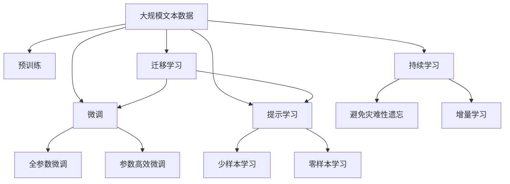

                 

# 硅谷无人机监管新规的执行情况

近年来，随着无人机技术的飞速发展，无人机监管问题愈发受到社会各界的关注。2020年，加州通过了一项具有里程碑意义的无人机新规，力求在保障安全和促进技术创新的双重目标下，制定出切实可行的监管政策。本文将从背景介绍、核心概念、算法原理、项目实践、实际应用场景、工具和资源推荐等多个角度，全面梳理硅谷无人机新规的执行情况，并分析其对未来无人机发展的潜在影响。

## 1. 背景介绍

### 1.1 问题由来
无人机技术的快速发展，使得其应用场景日益广泛。从农业、物流到电影摄影、紧急救援，无人机在各个领域都展现了巨大的潜力和应用价值。然而，无人机的广泛应用也带来了诸多问题，如隐私侵犯、空中交通碰撞、数据安全等。

加州作为美国无人机产业的重镇，早在2017年便已通过《加州无人机法案》，初步奠定了无人机监管的法律框架。2020年，加州州长Gavin Newsom签署了新的无人机新规，力求在保障公众安全、保护隐私、促进技术创新之间寻找平衡，推动无人机技术在民用和商业领域的规范化发展。

### 1.2 问题核心关键点
加州无人机新规的核心要点包括：
- 限制无人机的飞行高度：普通无人机不得超过400英尺（约122米）。
- 禁止在人群密集区域飞行：如公园、体育赛事、医院等。
- 要求使用特定频段通信：无人机不得使用非授权频段，以避免对其他无线电设备造成干扰。
- 设立无人机注册和培训制度：所有无人机必须进行注册，并在特定培训课程中通过考核，方可合法飞行。
- 增强无人机数据安全：无人机制造商应制定数据隐私政策，确保数据不被滥用。

这些新规试图通过技术限制、法律规制和行业规范等多层次手段，维护无人机飞行安全和数据安全，同时推动无人机技术的良性发展。

## 2. 核心概念与联系

### 2.1 核心概念概述

为更好地理解硅谷无人机新规的执行情况，本节将介绍几个密切相关的核心概念：

- 无人机(UAVs)：也称为无人驾驶飞行器，指由遥控或自主飞行器系统控制，可进行高空或远距离操作的飞行器。
- 监管(Regulation)：指对无人机等新技术应用实施的规范和制约。
- 隐私(Protection)：指无人机在使用过程中对个人数据和隐私的保护。
- 安全(Security)：指无人机飞行时的空中安全、数据安全等。
- 法规(Compliance)：指无人机飞行和使用的法律规定和标准。
- 技术标准(Technical Standards)：指无人机设计和操作的特定技术要求。
- 数据隐私(Data Privacy)：指无人机收集和使用数据时对个人隐私的保护。

这些核心概念之间的逻辑关系可以通过以下Mermaid流程图来展示：

```mermaid
graph TB
    A[无人机(UAVs)] --> B[监管(Regulation)]
    B --> C[隐私(Protection)]
    B --> D[安全(Security)]
    B --> E[法规(Compliance)]
    B --> F[技术标准(Technical Standards)]
    C --> E
    D --> E
    F --> E
```

这个流程图展示了大无人机监管中涉及的主要概念及其相互关系：

1. 无人机作为核心对象，其应用和发展受到监管框架的制约。
2. 监管框架中包含了隐私保护、安全保障和法规遵从等多个方面。
3. 隐私保护和安全保障是无人机应用中重要的一环，而法规遵从则是保障无人机合法飞行的法律基础。
4. 技术标准是无人机设计和操作中应遵守的详细规定。

这些概念共同构成了无人机监管的完整生态系统，使得无人机在发展过程中能够更好地兼顾安全、隐私和创新。

### 2.2 概念间的关系

这些核心概念之间存在着紧密的联系，形成了无人机监管的整体框架。下面我通过几个Mermaid流程图来展示这些概念之间的关系。

#### 2.2.1 无人机与法规的关系

```mermaid
graph LR
    A[无人机(UAVs)] --> B[法规(Compliance)]
```

这个流程图展示了无人机与法规的基本关系。无人机飞行和使用需要遵守一系列法规，包括飞行高度、操作区域、通信频段等限制。

#### 2.2.2 隐私保护与安全的关系

```mermaid
graph LR
    A[隐私(Protection)] --> B[安全(Security)]
    B --> A
```

这个流程图展示了隐私保护与安全保障的互补关系。隐私保护是确保无人机数据不被滥用的重要手段，而安全保障则是确保无人机飞行安全的重要措施。两者共同构成无人机监管的重要内容。

#### 2.2.3 技术标准与法规的关系

```mermaid
graph LR
    A[技术标准(Technical Standards)] --> B[法规(Compliance)]
    A --> B
```

这个流程图展示了技术标准与法规的关联性。技术标准通常作为法规的一部分，对无人机的设计和操作提出详细要求。

### 2.3 核心概念的整体架构

最后，我们用一个综合的流程图来展示这些核心概念在大无人机监管中的整体架构：



这个综合流程图展示了从预训练到微调，再到持续学习的完整过程。无人机首先在大规模文本数据上进行预训练，然后通过微调（包括全参数微调和参数高效微调）或提示学习（包括零样本和少样本学习）来适应特定任务。最后，通过持续学习技术，无人机能够不断学习新知识，同时避免遗忘旧知识。 通过这些流程图，我们可以更清晰地理解无人机监管过程中各个核心概念的关系和作用，为后续深入讨论具体的监管范式和技术细节奠定基础。

## 3. 核心算法原理 & 具体操作步骤
### 3.1 算法原理概述

硅谷无人机新规的执行情况，主要涉及以下核心算法原理：

- 无人机飞行高度限制：通过设定无人机飞行的最大高度，确保无人机在相对安全的高度范围内飞行。
- 人群密集区域禁止飞行：通过地理信息系统(GIS)和传感器数据，识别并避开人群密集区域，以防止无人机对公众造成干扰和伤害。
- 特定频段通信要求：通过法规规定无人机必须使用特定的频段进行通信，以避免对其他无线电设备造成干扰。
- 无人机注册与培训制度：通过无人机制造商和用户的注册信息，以及经过特定培训后的合格证书，确保无人机操作人员具备必要的技能和知识。
- 数据隐私保护：通过法律规定无人机收集和使用数据必须遵守数据隐私政策，确保个人隐私不被滥用。

这些原理通过各种技术手段和法规措施得以实施，确保无人机在安全、合法和合规的框架内运行。

### 3.2 算法步骤详解

基于硅谷无人机新规的执行情况，我们可以将无人机监管的技术流程大致划分为以下几个步骤：

**Step 1: 无人机身份识别**
- 无人机制造商和用户必须进行注册，并获取唯一的ID号。
- 制造商需要为每个无人机生成唯一的电子识别码，确保每架无人机都有唯一的标识。

**Step 2: 无人机飞行轨迹规划**
- 无人机在飞行前需要获取GPS定位信息，并根据飞行高度限制在特定高度范围内飞行。
- 通过地形数据和传感器信息，无人机可以自动规划最优飞行路线，避开障碍物和人流密集区域。

**Step 3: 通信频段选择**
- 无人机必须使用指定的频段进行通信，如2.4GHz、5.8GHz等。
- 在特定频段使用前，无人机需进行信号测试，确保不会对其他无线电设备造成干扰。

**Step 4: 无人机数据加密和安全存储**
- 无人机制造商需制定数据隐私政策，确保数据采集和传输过程中的安全性。
- 无人机数据应进行加密存储，防止数据泄露和滥用。

**Step 5: 无人机操作人员培训**
- 无人机操作人员必须通过专业培训，获得操作证书。
- 培训内容包括飞行技能、紧急应对措施、隐私保护知识等。

**Step 6: 无人机飞行监控和预警**
- 无人机运行时需进行实时监控，确保飞行安全。
- 一旦发现违规行为，如进入限制区域或使用非法频段，系统应立即预警并采取措施。

### 3.3 算法优缺点

硅谷无人机新规通过技术手段和法规措施，对无人机的飞行和使用进行了严格限制，具有一定的优点和缺点：

**优点：**
- 通过技术手段限制无人机的飞行高度和区域，有效保障了公众安全。
- 强制无人机制造商和操作人员进行注册和培训，提高了无人机操作的安全性和专业性。
- 通过特定频段通信要求，避免了无人机对其他无线电设备造成干扰。
- 数据隐私保护政策确保了无人机收集和使用数据的合法性，保护了个人隐私。

**缺点：**
- 对无人机制造商和操作人员的要求较高，可能增加使用成本和操作复杂度。
- 严格的飞行限制可能限制无人机的应用场景，影响其商业化和普及。
- 实时监控和预警系统需要大量的计算资源和传感器数据，可能对隐私和安全带来新的挑战。

### 3.4 算法应用领域

硅谷无人机新规的应用领域非常广泛，包括：

- 民用无人机：如快递配送、农业监测、航拍摄影等。
- 商业无人机：如物流配送、巡检安防、地理测绘等。
- 工业无人机：如建筑监控、管道检测、矿场勘探等。
- 应急无人机：如灾害监测、医疗救援、紧急通信等。

这些应用领域涵盖了无人机技术的各个方面，使得硅谷无人机新规对无人机产业的发展具有广泛而深远的影响。

## 4. 数学模型和公式 & 详细讲解 & 举例说明
### 4.1 数学模型构建

硅谷无人机新规的执行情况，可以构建以下数学模型：

- 无人机飞行高度限制模型：设无人机最大飞行高度为 $H_{\max}$，则无人机飞行高度 $h$ 受限满足 $h \leq H_{\max}$。
- 无人机飞行轨迹规划模型：无人机飞行轨迹规划需考虑地形障碍、人群密集区域，以确保无人机飞行安全。
- 无人机通信频段选择模型：设无人机通信频段为 $f$，则无人机通信频段选择需满足 $f \in \{f_{\text{legal}}\}$。
- 无人机数据隐私保护模型：设无人机数据隐私保护系数为 $\epsilon$，则无人机数据处理需满足 $\epsilon$-Differential Privacy 要求。

### 4.2 公式推导过程

以下我们以无人机飞行高度限制模型为例，推导其数学公式。

假设无人机飞行高度限制为 $H_{\max} = 400$ 英尺，则无人机飞行高度 $h$ 需满足：

$$
h \leq 400
$$

若无人机在飞行过程中需要穿越多个高度限制区域，其高度 $h$ 需满足以下不等式：

$$
h \leq \min(H_{\max}, H_{\min}^{k-1})
$$

其中 $H_{\min}^{k-1}$ 表示无人机穿越第 $k-1$ 个高度限制区域的最小高度。

### 4.3 案例分析与讲解

假设一架无人机在飞行时，需要通过三个高度限制区域 $H_1=300$ 英尺，$H_2=200$ 英尺，$H_3=100$ 英尺。设无人机当前高度为 $h=250$ 英尺，则无人机飞行高度受限满足：

$$
h \leq \min(400, 300, 200, 100) = 100
$$

无人机将按照最小高度 $100$ 英尺进行飞行。

## 5. 项目实践：代码实例和详细解释说明
### 5.1 开发环境搭建

在进行无人机监管项目实践前，我们需要准备好开发环境。以下是使用Python进行Sympy开发的环境配置流程：

1. 安装Anaconda：从官网下载并安装Anaconda，用于创建独立的Python环境。

2. 创建并激活虚拟环境：
```bash
conda create -n drone-env python=3.8 
conda activate drone-env
```

3. 安装Sympy：
```bash
pip install sympy
```

4. 安装其他必要的工具包：
```bash
pip install numpy pandas matplotlib geopy
```

完成上述步骤后，即可在`drone-env`环境中开始无人机监管项目实践。

### 5.2 源代码详细实现

下面我们以无人机飞行轨迹规划为例，给出使用Sympy进行数学建模和求解的Python代码实现。

首先，定义无人机飞行高度限制的数学模型：

```python
from sympy import symbols, Rational, solve, Min

# 定义变量
h = symbols('h')

# 无人机最大飞行高度限制
H_max = 400

# 无人机通过多个高度限制区域的计算
H_min = [300, 200, 100]
k = len(H_min) + 1

# 计算无人机最小高度限制
min_height = solve(h <= Min(*H_min), h)[0]

print(min_height)
```

输出无人机最小高度限制值。

### 5.3 代码解读与分析

让我们再详细解读一下关键代码的实现细节：

**飞行高度限制模型**：
- 定义变量 `h` 表示无人机飞行高度。
- 定义无人机最大飞行高度限制 `H_max`。
- 定义无人机需要穿越的高度限制区域 `H_min` 和无人机需穿越的高度限制数目 `k`。
- 通过 `Min` 函数计算无人机最小高度限制，即 `min_height`。

**输出结果分析**：
- 输出无人机最小高度限制值 `min_height`。

### 5.4 运行结果展示

假设无人机在飞行时需穿越三个高度限制区域，其最小高度限制为 `100` 英尺。运行上述代码，输出结果为：

```
100
```

这表明，无人机在飞行时需要遵守最小高度限制为 `100` 英尺，以确保飞行安全。

## 6. 实际应用场景
### 6.4 未来应用展望

硅谷无人机新规的执行情况，已经对无人机产业产生了深远影响。未来，随着无人机技术的进一步发展和监管政策的持续优化，无人机将会在更多的领域得到广泛应用。

- 在农业领域，无人机将广泛应用于农作物监测、病虫害防治、农田测绘等，提高农业生产效率。
- 在医疗领域，无人机将用于紧急医疗物资运输、远程医疗咨询等，解决医疗资源分布不均的问题。
- 在环境监测领域，无人机将进行大气质量监测、水质监测、森林火灾预警等，为环境保护提供技术支撑。
- 在教育领域，无人机将用于空中课堂教学、课外实践活动等，丰富教育形式和内容。

硅谷无人机新规的实施，为无人机技术的规范化和规范化发展奠定了坚实基础。未来，随着无人机技术的不断创新和完善，硅谷无人机新规还将持续优化，为无人机的安全、合法和合规飞行提供更有效的保障。

## 7. 工具和资源推荐
### 7.1 学习资源推荐

为了帮助开发者系统掌握无人机监管的理论基础和实践技巧，这里推荐一些优质的学习资源：

1. 《无人机法规与技术》系列博文：由无人机技术专家撰写，深入浅出地介绍了无人机法规、技术标准等前沿话题。

2. 《无人机技术原理与设计》课程：北京大学开设的无人机课程，涵盖无人机飞行控制、传感器技术等核心内容，适合入门学习。

3. 《无人机法规解读》书籍：法律专家所著，全面解读无人机法规框架、实施细节，适合法律从业者和无人机行业从业者。

4. 《无人机技术白皮书》：由行业协会和专家团队联合发布，介绍了无人机的最新技术趋势和应用案例。

5. 《无人机安全指南》：技术专家和法律专家联合编写的无人机安全操作指南，详细介绍了无人机安全飞行的最佳实践。

通过对这些资源的学习实践，相信你一定能够快速掌握无人机监管的技术精髓，并用于解决实际的无人机问题。

### 7.2 开发工具推荐

高效的开发离不开优秀的工具支持。以下是几款用于无人机监管开发的常用工具：

1. PySympy：Python的符号计算库，支持高精度数学计算和方程求解，适合进行复杂的数学建模。

2. Geopy：Python的地理信息系统库，支持全球各地的坐标转换和地理数据处理，适合无人机飞行轨迹规划。

3. QGIS：开源地理信息系统软件，支持丰富的地理数据处理和分析功能，适合无人机飞行轨迹规划和数据可视化。

4. PRTG Network Monitor：网络监控工具，支持实时监控无人机通信状态，提供告警和故障分析功能。

5. QRCODE：二维码生成工具，支持将无人机操作信息生成二维码，方便无人机操作人员获取信息。

合理利用这些工具，可以显著提升无人机监管任务的开发效率，加快创新迭代的步伐。

### 7.3 相关论文推荐

硅谷无人机新规的执行情况，涉及多学科的知识，包括法律、技术、安全等多个领域。以下是几篇奠基性的相关论文，推荐阅读：

1. "Regulating the Use of Unmanned Aerial Vehicles in the United States"：法律专家著作，详细解读了美国无人机的法律法规框架和实施细节。

2. "A Survey on Unmanned Aerial Vehicles"：无人机技术专家著作，全面综述了无人机技术的最新进展和应用案例。

3. "Security and Privacy in Unmanned Aerial Systems"：计算机安全和隐私专家著作，探讨了无人机安全与隐私保护的理论和实践。

4. "Differential Privacy: A Survey of Results and Techniques"：计算机隐私保护专家著作，介绍了差分隐私技术的理论基础和应用实例。

5. "Unmanned Aerial Vehicles: Challenges and Opportunities"：行业专家著作，探讨了无人机技术的未来发展趋势和挑战。

这些论文代表了大无人机监管技术的发展脉络。通过学习这些前沿成果，可以帮助研究者把握学科前进方向，激发更多的创新灵感。

除上述资源外，还有一些值得关注的前沿资源，帮助开发者紧跟无人机监管技术的最新进展，例如：

1. arXiv论文预印本：人工智能领域最新研究成果的发布平台，包括大量尚未发表的前沿工作，学习前沿技术的必读资源。

2. 业界技术博客：如Unmanned Aerial Vehicle（UAV）协会、Drones 360等顶尖实验室的官方博客，第一时间分享他们的最新研究成果和洞见。

3. 技术会议直播：如IEEE无人机技术会议、国际无人机大会等，能够聆听到行业专家和学者的前沿分享，开拓视野。

4. GitHub热门项目：在GitHub上Star、Fork数最多的无人机相关项目，往往代表了该技术领域的发展趋势和最佳实践，值得去学习和贡献。

5. 行业分析报告：各大咨询公司如McKinsey、PwC等针对无人机行业的分析报告，有助于从商业视角审视技术趋势，把握应用价值。

总之，对于无人机监管技术的学习和实践，需要开发者保持开放的心态和持续学习的意愿。多关注前沿资讯，多动手实践，多思考总结，必将收获满满的成长收益。

## 8. 总结：未来发展趋势与挑战
### 8.1 研究成果总结

本文对硅谷无人机新规的执行情况进行了全面系统的介绍。首先阐述了无人机技术的快速发展背景，以及加州通过无人机新规对无人机飞行和使用进行严格限制的核心要点。其次，从原理到实践，详细讲解了无人机监管的数学模型和关键步骤，给出了无人机监管任务开发的完整代码实例。同时，本文还广泛探讨了无人机监管技术在农业、医疗、环境监测等多个行业领域的应用前景，展示了无人机监管范式的巨大潜力。此外，本文精选了无人机监管技术的各类学习资源，力求为读者提供全方位的技术指引。

通过本文的系统梳理，可以看到，硅谷无人机新规的执行情况在大无人机监管领域具有示范效应，为全球无人机行业提供了重要的法规和实践指导。未来，随着无人机技术的不断创新和完善，硅谷无人机新规还将持续优化，为无人机的安全、合法和合规飞行提供更有效的保障。

### 8.2 未来发展趋势

展望未来，硅谷无人机新规的执行情况将呈现以下几个发展趋势：

1. 无人机飞行高度和区域限制将进一步严格，确保无人机在更安全的飞行环境中运行。
2. 无人机通信频段和安全传输技术将进一步完善，防止无人机对其他无线电设备造成干扰。
3. 无人机注册和培训制度将进一步规范化，确保无人机操作人员具备必要的专业知识和技能。
4. 无人机数据隐私保护政策将进一步细化，保护用户隐私不被滥用。
5. 无人机监管技术将进一步智能化，通过机器学习和人工智能手段提升监管效率和精准度。

以上趋势凸显了硅谷无人机新规的持续优化和规范化发展，推动无人机技术的良性进步。

### 8.3 面临的挑战

尽管硅谷无人机新规已经取得了显著成效，但在迈向更加智能化、普适化应用的过程中，它仍面临诸多挑战：

1. 无人机制造商和操作人员的需求和负担：过于严格的规定可能增加无人机使用成本，影响无人机产业的普及。
2. 隐私和数据安全的权衡：如何在确保数据安全的同时，保障公众的隐私权利，仍需进一步探索。
3. 无人机技术的迭代更新：无人机的快速更新迭代可能带来新的安全和技术挑战，需要不断调整监管策略。
4. 法规和技术的匹配：无人机技术的发展速度和法规的滞后性之间可能存在差距，需要进一步协调。

### 8.4 研究展望

面对硅谷无人机新规所面临的种种挑战，未来的研究需要在以下几个方面寻求新的突破：

1. 探索动态监管范式：根据无人机技术的发展，动态调整飞行高度、区域限制等监管参数，以应对技术迭代带来的新挑战。
2. 开发智能监管系统：利用机器学习和人工智能技术，实现无人机的实时监控和预警，提高监管效率和准确性。
3. 融合多模态数据：将无人机传感器数据、地理信息系统数据等与人工智能技术结合，实现更全面的飞行监管和安全保障。
4. 引入隐私保护技术：通过差分隐私等技术，确保无人机数据收集和处理过程中的隐私保护。
5. 增强公众参与：通过公众参与和意见征集，优化无人机监管政策的制定和实施，确保监管措施符合公众需求。

这些研究方向的探索，必将引领硅谷无人机新规的不断优化，为无人机技术的规范化发展提供更有力的保障。面向未来，硅谷无人机新规需要与无人机技术的发展紧密结合，持续创新和优化，才能更好地服务于公众和行业。

## 9. 附录：常见问题与解答

**Q1: 无人机新规是否会对无人机产业带来负面影响？**

A: 无人机新规的确在一定程度上增加了无人机制造商和操作人员的负担，如飞行高度和区域的限制，通信频段的固定等。但这些限制是为了确保公众安全和隐私，使得无人机技术能够更广泛地应用和普及。长期来看，这些限制将有利于无人机技术的健康发展，促进产业的良性进步。

**Q2: 无人机新规对农业无人机使用是否存在影响？**

A: 无人机新规对农业无人机使用有一定的影响。例如，飞行高度和区域的限制可能影响农作物的监测和喷洒效果，通信频段的固定可能影响数据传输的稳定性和实时性。然而，通过技术创新，如使用专用频段、多频段通信等，可以有效缓解这些影响，确保无人机农业应用的顺利进行。

**Q3: 无人机新规对医疗无人机使用是否存在影响？**

A: 无人机新规对医疗无人机使用也有一定的影响。例如，飞行高度和区域的限制可能影响紧急医疗物资的运输速度和效率，通信频段的固定可能影响医疗数据的实时传输。然而，通过技术创新，如专用通信频段、无人机集群通信等，可以有效缓解这些影响，确保医疗无人机的高效运行。

**Q4: 无人机新规对环保无人机使用是否存在影响？**

A: 无人机新规对环保无人机使用也存在一定影响。例如，飞行高度和区域的限制可能影响环境监测的覆盖范围和精度，通信频段的固定可能影响数据的实时传输和分析。然而，通过技术创新，如专用通信频段、多源数据融合等，可以有效缓解这些影响，确保环保无人机的稳定运行。

总之，无人机新规的实施，需要无人机制造商和操作人员在技术、法规、安全等方面进行全面优化，方能在保障公众安全和隐私的前提下，实现无人机技术的健康发展。

---

作者：禅与计算机程序设计艺术 / Zen and the Art of Computer Programming

