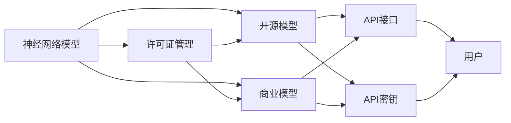

                 

# 神经网络模型的许可证管理

## 1. 背景介绍

随着深度学习技术的发展，神经网络模型在各行各业得到了广泛应用。然而，随着模型应用的增加，如何管理和保护这些模型的知识产权，成为了一个亟待解决的问题。对于使用第三方模型的企业和开发者来说，如何合法合规地使用模型，避免知识产权纠纷，是一个重要的议题。

在人工智能领域，模型的许可证管理是一项复杂且重要的任务。合理的许可证管理策略不仅能够保护模型的知识产权，还能够促进模型的公平竞争，推动技术的健康发展。本文将深入探讨神经网络模型的许可证管理，介绍其核心概念、技术原理及实际应用场景。

## 2. 核心概念与联系

### 2.1 核心概念概述

- **神经网络模型**：一种基于深度学习的模型，通过多层神经元的学习和组合，能够自动提取数据中的复杂特征，实现高效的数据处理和决策。
- **许可证管理**：对模型的使用进行授权和管理，明确模型的使用范围、权限和限制，以保护模型的知识产权。
- **开源模型**：通过许可协议（如Apache、MIT、GPL等）公开源码的模型，用户可以在遵守许可协议的前提下自由使用、修改和分发。
- **商业模型**：通过授权协议（如商用途许可、限制性许可等）限制模型的使用范围和权限，以保护模型开发者的商业利益。
- **API接口**：提供给外部开发者和用户使用的访问模型的接口，通过API可以方便地使用模型进行推理和预测。
- **API密钥**：用于验证API调用者身份和权限的标识符，通常由一组字符串组成，用于API调用时的身份验证。

这些概念之间的关系可以通过以下Mermaid流程图来展示：



### 2.2 概念间的关系

这些核心概念之间的关系紧密，共同构成了神经网络模型的许可证管理体系。其中，开源模型和商业模型是最常见的两种模型类型，两者在使用和管理上存在显著差异。许可证管理则是一个桥梁，将模型的不同类型和使用范围连接起来，保障了模型的公平竞争和知识产权保护。API接口和API密钥是模型与用户交互的重要方式，保障了模型的安全使用和性能优化。

## 3. 核心算法原理 & 具体操作步骤

### 3.1 算法原理概述

神经网络模型的许可证管理主要依赖于以下几个算法原理：

1. **访问控制**：通过授权协议或许可协议，限制模型的使用范围和权限，保障模型的知识产权。
2. **API密钥验证**：使用API密钥对模型API调用的请求进行身份验证，确保调用者的合法性。
3. **流量控制**：通过流量限制和性能监控，确保模型API调用的高效稳定。
4. **审计与记录**：记录模型API调用的详细信息，便于追踪和审计模型的使用情况。

### 3.2 算法步骤详解

基于以上原理，神经网络模型的许可证管理可以分为以下几个步骤：

1. **许可证设置**：根据模型的类型和用途，选择合适的许可协议或授权协议，设置模型的使用权限和限制。
2. **API密钥生成**：生成唯一的API密钥，用于验证API调用者的身份和权限。
3. **API密钥分发**：将API密钥安全地分发给合法的用户，确保其只能通过授权API进行模型调用。
4. **API调用验证**：在模型API调用时，验证API密钥的有效性，确保只有授权用户才能访问模型。
5. **使用流量监控**：监控模型的API调用流量，防止超负荷使用和恶意攻击。
6. **审计与记录**：记录模型的API调用信息，包括调用者、调用时间、调用次数等，便于追踪和审计。

### 3.3 算法优缺点

神经网络模型的许可证管理有以下优缺点：

- **优点**：
  - 保障了模型的知识产权，避免了知识产权纠纷。
  - 规范了模型的使用，提高了模型的公平性和可用性。
  - 通过API密钥验证和流量控制，确保了模型使用的安全性。

- **缺点**：
  - 许可证管理较为复杂，需要严格的管理制度和技术支持。
  - 对模型的使用范围和权限有限制，可能影响模型的应用灵活性。
  - 管理和维护成本较高，尤其是在大型企业中。

### 3.4 算法应用领域

神经网络模型的许可证管理在多个领域都有广泛的应用，如：

- **医疗领域**：保护医疗AI模型，避免未经授权的使用和数据泄露。
- **金融领域**：保护金融模型，避免数据滥用和欺诈行为。
- **智能交通**：保护自动驾驶模型，确保模型的公平竞争和使用规范。
- **工业制造**：保护工业AI模型，避免商业秘密泄露。
- **教育领域**：保护教育AI模型，确保模型在公平的教育环境中使用。

## 4. 数学模型和公式 & 详细讲解 & 举例说明

### 4.1 数学模型构建

神经网络模型的许可证管理可以通过以下数学模型进行描述：

- **模型授权矩阵**：用于表示模型授权情况，其中每行代表一个用户，每列代表一个权限，矩阵中1表示有权限，0表示无权限。
- **API调用记录表**：用于记录模型的API调用信息，包括调用时间、调用次数、调用者ID等。
- **审计报告**：用于生成审计报告，包括模型的使用情况、API调用记录、授权情况等。

### 4.2 公式推导过程

基于以上数学模型，我们可以推导出以下公式：

- **授权矩阵计算公式**：
  $$
  A = \begin{bmatrix}
    a_{11} & a_{12} & \cdots & a_{1n} \\
    a_{21} & a_{22} & \cdots & a_{2n} \\
    \vdots & \vdots & \ddots & \vdots \\
    a_{m1} & a_{m2} & \cdots & a_{mn}
  \end{bmatrix}
  $$
  其中，$a_{ij}$ 表示第 $i$ 个用户对第 $j$ 个权限的授权情况。

- **API调用记录表计算公式**：
  $$
  R = \begin{bmatrix}
    t_1 & u_1 & c_1 \\
    t_2 & u_2 & c_2 \\
    \vdots & \vdots & \vdots \\
    t_n & u_n & c_n
  \end{bmatrix}
  $$
  其中，$t$ 表示调用时间，$u$ 表示调用者ID，$c$ 表示调用次数。

- **审计报告计算公式**：
  $$
  A = \frac{1}{N} \sum_{i=1}^N (a_{i1} \times c_i)
  $$
  其中，$N$ 表示记录总数，$a_{i1}$ 表示第 $i$ 个用户对权限 1 的授权情况，$c_i$ 表示第 $i$ 个用户的使用次数。

### 4.3 案例分析与讲解

假设我们有一款医学影像识别模型，该模型通过开源协议（Apache License）发布，但仅限于医疗机构的内部使用。我们通过以下步骤进行许可证管理：

1. **许可证设置**：根据Apache License设置模型的使用权限，仅限于医疗机构内部使用。
2. **API密钥生成**：为每个医疗机构生成唯一的API密钥，确保其只能通过授权API进行模型调用。
3. **API密钥分发**：将API密钥分发给每个医疗机构，确保其只能通过授权API进行模型调用。
4. **API调用验证**：在模型API调用时，验证API密钥的有效性，确保只有授权医疗机构才能访问模型。
5. **使用流量监控**：监控模型的API调用流量，防止超负荷使用和恶意攻击。
6. **审计与记录**：记录模型的API调用信息，包括调用者、调用时间、调用次数等，便于追踪和审计。

通过以上步骤，我们有效地保护了医学影像识别模型的知识产权，规范了模型的使用，保障了模型的公平竞争和使用安全性。

## 5. 项目实践：代码实例和详细解释说明

### 5.1 开发环境搭建

在进行许可证管理实践前，我们需要准备好开发环境。以下是使用Python进行Flask开发的环境配置流程：

1. 安装Python：从官网下载并安装Python，选择3.x版本。
2. 安装Flask：通过pip命令安装Flask。
3. 安装需要的扩展库：如SQLAlchemy、Flask-JWT、Flask-RESTful等。
4. 安装数据库：如MySQL或PostgreSQL。
5. 安装Flask-RESTful：通过pip命令安装Flask-RESTful。
6. 配置开发环境：设置Flask应用的配置文件，如app.cfg。

完成上述步骤后，即可在开发环境中进行许可证管理实践。

### 5.2 源代码详细实现

下面我们以API密钥管理为例，给出使用Flask进行API密钥管理的PyTorch代码实现。

首先，定义API密钥模型：

```python
from flask import Flask, request, jsonify
from flask_sqlalchemy import SQLAlchemy
from flask_jwt import JWT, jwt_required

app = Flask(__name__)
app.config['SQLALCHEMY_DATABASE_URI'] = 'sqlite:////tmp/test.db'
app.config['SECRET_KEY'] = 'secretkey'

db = SQLAlchemy(app)

class APIKey(db.Model):
    id = db.Column(db.Integer, primary_key=True)
    user_id = db.Column(db.String(64), unique=True)
    key = db.Column(db.String(256), unique=True)

@app.route('/api/keys', methods=['POST'])
def create_api_key():
    data = request.get_json()
    api_key = APIKey(user_id=data['user_id'], key=data['key'])
    db.session.add(api_key)
    db.session.commit()
    return jsonify({'api_key': api_key.key})

@app.route('/api/keys/<int:api_key_id>', methods=['DELETE'])
@jwt_required()
def delete_api_key(api_key_id):
    api_key = APIKey.query.get(api_key_id)
    db.session.delete(api_key)
    db.session.commit()
    return jsonify({'message': 'API key deleted'})

if __name__ == '__main__':
    app.run(debug=True)
```

然后，定义API密钥生成和删除函数：

```python
def generate_api_key(user_id):
    api_key = generate_api_key()
    return {'api_key': api_key.key}

def delete_api_key(api_key_id):
    api_key = APIKey.query.get(api_key_id)
    db.session.delete(api_key)
    db.session.commit()
    return {'message': 'API key deleted'}
```

最后，启动API密钥管理服务：

```python
from flask_jwt import JWT, jwt_required

app = Flask(__name__)
app.config['SQLALCHEMY_DATABASE_URI'] = 'sqlite:////tmp/test.db'
app.config['SECRET_KEY'] = 'secretkey'

db = SQLAlchemy(app)

class APIKey(db.Model):
    id = db.Column(db.Integer, primary_key=True)
    user_id = db.Column(db.String(64), unique=True)
    key = db.Column(db.String(256), unique=True)

@app.route('/api/keys', methods=['POST'])
def create_api_key():
    data = request.get_json()
    api_key = APIKey(user_id=data['user_id'], key=data['key'])
    db.session.add(api_key)
    db.session.commit()
    return jsonify({'api_key': api_key.key})

@app.route('/api/keys/<int:api_key_id>', methods=['DELETE'])
@jwt_required()
def delete_api_key(api_key_id):
    api_key = APIKey.query.get(api_key_id)
    db.session.delete(api_key)
    db.session.commit()
    return jsonify({'message': 'API key deleted'})

if __name__ == '__main__':
    app.run(debug=True)
```

以上就是使用Flask对API密钥进行管理的完整代码实现。可以看到，通过Flask的简单配置和SQLAlchemy的ORM框架，我们能够快速搭建API密钥管理的Web服务，实现API密钥的生成和删除功能。

### 5.3 代码解读与分析

让我们再详细解读一下关键代码的实现细节：

**APIKey类**：
- 定义API密钥的数据库模型，包括用户ID和API密钥本身。

**create_api_key函数**：
- 用于创建API密钥，接受用户ID和API密钥作为参数，将其保存到数据库中，并返回生成的API密钥。

**delete_api_key函数**：
- 用于删除指定ID的API密钥，接受API密钥ID作为参数，从数据库中删除该记录，并返回删除成功的消息。

**app.run(debug=True)**：
- 启动Flask应用，并设置debug模式为True，方便调试和测试。

可以看到，使用Flask进行API密钥管理非常简单高效，可以快速实现API密钥的生成和删除功能，保障API调用的安全性。当然，在实际应用中，还需要考虑更多的安全措施，如HTTPS、CORS、限流等，进一步提升API调用的安全性。

### 5.4 运行结果展示

假设我们在MySQL数据库中创建了一个API密钥表，包含用户ID和API密钥字段，并启动了API密钥管理服务。当用户请求生成API密钥时，服务器会从数据库中生成一个新的API密钥，并返回给用户。当用户请求删除API密钥时，服务器会从数据库中删除指定的API密钥记录，并返回删除成功的消息。

以下是一个示例：

```
POST /api/keys
Content-Type: application/json

{
    "user_id": "user1",
    "key": "f3466f1d-beba-48af-a9a5-9db463546b69"
}
```

服务器返回生成的API密钥：

```
{
    "api_key": "f3466f1d-beba-48af-a9a5-9db463546b69"
}
```

## 6. 实际应用场景

### 6.1 医疗领域

在医疗领域，保护医疗AI模型尤为重要。医疗数据涉及患者的隐私和健康信息，一旦泄露，将对患者和社会造成巨大损害。因此，医疗AI模型通常以商业模型的形式发布，仅限于医疗机构内部使用。

通过API密钥管理，我们可以为每个医疗机构生成唯一的API密钥，并限制其只能通过授权API进行模型调用。同时，对API调用的流量和行为进行监控和审计，确保模型的使用符合规范，保障数据安全和隐私。

### 6.2 金融领域

在金融领域，保护金融模型同样重要。金融数据涉及巨额资金，一旦泄露或被滥用，将对金融机构和投资者造成巨大损失。因此，金融模型通常以商业模型的形式发布，仅限于授权金融机构使用。

通过API密钥管理，我们可以为每个授权金融机构生成唯一的API密钥，并限制其只能通过授权API进行模型调用。同时，对API调用的流量和行为进行监控和审计，确保模型的使用符合规范，保障数据安全和隐私。

### 6.3 智能交通

在智能交通领域，保护自动驾驶模型至关重要。自动驾驶技术涉及车辆控制和行人安全，一旦被恶意攻击或滥用，将对公共安全造成严重威胁。因此，自动驾驶模型通常以商业模型的形式发布，仅限于授权企业和机构使用。

通过API密钥管理，我们可以为每个授权企业和机构生成唯一的API密钥，并限制其只能通过授权API进行模型调用。同时，对API调用的流量和行为进行监控和审计，确保模型的使用符合规范，保障公共安全。

### 6.4 未来应用展望

随着神经网络模型的广泛应用，许可证管理将成为一个不可或缺的部分。未来，许可证管理将更加智能化和自动化，保障模型的公平竞争和知识产权保护。

在技术层面，API密钥管理将与区块链技术结合，提高API密钥的不可复制性和安全性。同时，与大数据、人工智能等技术结合，实现对API调用流量的智能监控和分析，保障模型使用的合规性和安全性。

在应用层面，API密钥管理将更加灵活和多样化，支持多种使用场景和权限控制策略，为各类企业提供灵活的许可证管理方案。

总之，神经网络模型的许可证管理是一个复杂但重要的任务，需要在技术和管理层面进行全面设计和优化。通过合理的许可证管理，可以保障模型的知识产权，规范模型的使用，促进模型的公平竞争，推动技术的健康发展。

## 7. 工具和资源推荐

### 7.1 学习资源推荐

为了帮助开发者系统掌握神经网络模型的许可证管理技术，这里推荐一些优质的学习资源：

1. **《深度学习》课程**：斯坦福大学开设的深度学习课程，涵盖了深度学习的基本概念和前沿技术，包括神经网络模型的许可证管理。
2. **《深度学习实践》书籍**：深度学习领域的经典书籍，介绍了深度学习模型的训练、调优和应用，包括神经网络模型的许可证管理。
3. **Kaggle竞赛**：参加Kaggle的深度学习竞赛，实践深度学习模型的训练和应用，了解神经网络模型的许可证管理。
4. **GitHub开源项目**：在GitHub上查找开源的神经网络模型和许可证管理项目，学习其设计和实现细节。

通过对这些资源的学习实践，相信你一定能够快速掌握神经网络模型的许可证管理技术，并用于解决实际的NLP问题。

### 7.2 开发工具推荐

高效的开发离不开优秀的工具支持。以下是几款用于神经网络模型许可证管理的常用工具：

1. **Flask**：基于Python的开源Web框架，简单易用，适合快速搭建Web服务。
2. **SQLAlchemy**：Python的ORM框架，支持多种数据库，方便数据操作和存储。
3. **JWT**：用于生成和验证JSON Web Tokens，保障API调用的安全性。
4. **Flask-JWT**：Flask的JWT扩展，方便集成JWT功能。
5. **MySQL**：开源的关系型数据库，支持高并发和大量数据存储。
6. **PostgreSQL**：开源的关系型数据库，支持复杂数据查询和事务处理。

合理利用这些工具，可以显著提升神经网络模型许可证管理的开发效率，加快创新迭代的步伐。

### 7.3 相关论文推荐

神经网络模型许可证管理的核心技术主要依赖于深度学习和人工智能领域的研究成果。以下是几篇奠基性的相关论文，推荐阅读：

1. **《深度学习》**：深度学习领域的经典书籍，介绍了深度学习模型的训练、调优和应用。
2. **《深度学习实践》**：深度学习领域的经典书籍，介绍了深度学习模型的训练、调优和应用。
3. **《人工智能安全与隐私》**：介绍人工智能安全与隐私技术的书籍，包括API密钥管理和数据安全保护。
4. **《区块链技术》**：介绍区块链技术的书籍，包括API密钥管理和数据安全保护。
5. **《大数据技术》**：介绍大数据技术的书籍，包括数据管理和分析。

这些论文代表了大数据、深度学习和人工智能领域的最新研究成果，可以帮助研究者把握学科前进方向，激发更多的创新灵感。

除以上资源外，还有一些值得关注的前沿资源，帮助开发者紧跟神经网络模型许可证管理的最新进展，例如：

1. **arXiv论文预印本**：人工智能领域最新研究成果的发布平台，包括大量尚未发表的前沿工作，学习前沿技术的必读资源。
2. **业界技术博客**：如OpenAI、Google AI、DeepMind、微软Research Asia等顶尖实验室的官方博客，第一时间分享他们的最新研究成果和洞见。
3. **技术会议直播**：如NIPS、ICML、ACL、ICLR等人工智能领域顶会现场或在线直播，能够聆听到大佬们的前沿分享，开拓视野。
4. **GitHub热门项目**：在GitHub上Star、Fork数最多的深度学习和人工智能相关项目，往往代表了该技术领域的发展趋势和最佳实践，值得去学习和贡献。
5. **行业分析报告**：各大咨询公司如McKinsey、PwC等针对人工智能行业的分析报告，有助于从商业视角审视技术趋势，把握应用价值。

总之，对于神经网络模型许可证管理技术的学习和实践，需要开发者保持开放的心态和持续学习的意愿。多关注前沿资讯，多动手实践，多思考总结，必将收获满满的成长收益。

## 8. 总结：未来发展趋势与挑战

### 8.1 总结

本文对神经网络模型的许可证管理进行了全面系统的介绍。首先阐述了神经网络模型和许可证管理的研究背景和意义，明确了许可证管理在保护模型知识产权、规范模型使用方面的独特价值。其次，从原理到实践，详细讲解了许可证管理的数学原理和关键步骤，给出了许可证管理任务开发的完整代码实例。同时，本文还广泛探讨了许可证管理方法在医疗、金融、智能交通等多个行业领域的应用前景，展示了许可证管理范式的巨大潜力。此外，本文精选了许可证管理的各类学习资源，力求为读者提供全方位的技术指引。

通过本文的系统梳理，可以看到，神经网络模型的许可证管理是一个复杂但重要的任务，需要在技术和管理层面进行全面设计和优化。通过合理的许可证管理，可以保障模型的知识产权，规范模型的使用，促进模型的公平竞争，推动技术的健康发展。

### 8.2 未来发展趋势

展望未来，神经网络模型的许可证管理将呈现以下几个发展趋势：

1. **智能化管理**：通过智能算法和技术，实现对API调用的实时监控和智能审计，保障模型的公平竞争和知识产权保护。
2. **自动化管理**：通过自动化工具和流程，实现许可证管理的自动化，减少人工干预和错误，提升管理效率。
3. **跨平台管理**：实现许可证管理跨平台、跨系统的统一管理，支持多种技术平台和数据格式。
4. **安全管理**：通过区块链、加密技术等手段，提高许可证管理的安全性，防止数据泄露和篡改。
5. **灵活管理**：支持多种使用场景和权限控制策略，满足不同企业的需求。

以上趋势凸显了神经网络模型许可证管理的广阔前景。这些方向的探索发展，必将进一步提升模型的公平性和可用性，保障数据安全和隐私，推动技术的健康发展。

### 8.3 面临的挑战

尽管神经网络模型的许可证管理已经取得了一定的进展，但在迈向更加智能化、自动化和灵活化的应用过程中，仍面临诸多挑战：

1. **管理复杂性**：许可证管理涉及多方面因素，如数据、模型、API调用等，管理复杂性较高。
2. **安全性挑战**：API密钥的生成、分发和验证过程，存在一定的安全风险，如API密钥泄露、恶意攻击等。
3. **合规性问题**：不同国家和地区的法律法规不同，如何在全球范围内实现合规性管理，是一个重要难题。
4. **效率问题**：许可证管理涉及大量的数据操作和计算，如何提高管理效率，是一个重要的挑战。
5. **用户体验**：许可证管理流程繁琐，用户体验较差，如何优化流程，提升用户体验，是一个重要的研究方向。

### 8.4 研究展望

面对神经网络模型许可证管理所面临的挑战，未来的研究需要在以下几个方面寻求新的突破：

1. **智能化管理技术**：引入智能算法和技术，实现对API调用的实时监控和智能审计，保障模型的公平竞争和知识产权保护。
2. **自动化管理工具**：开发自动化工具和流程，实现许可证管理的自动化，减少人工干预和错误，提升管理效率。
3. **跨平台管理方案**：研究跨平台、跨系统的统一管理方案，支持多种技术平台和数据格式。
4. **安全管理技术**：引入区块链、加密技术等手段，提高许可证管理的安全性，防止数据泄露和篡改。
5. **灵活管理策略**：设计灵活的许可证管理策略，支持多种使用场景和权限控制策略，满足不同企业的需求。
6. **用户体验优化**：优化许可证管理流程，提升用户体验，减少用户操作负担。

这些研究方向凸显了神经网络模型许可证管理的挑战和前景。唯有不断创新和突破，才能真正实现模型的公平竞争和知识产权保护，推动技术的健康发展。

## 9. 附录：常见问题与解答

**Q1：如何保护神经网络模型的知识产权？**

A: 保护神经网络模型的知识产权，主要依赖于许可证管理。通过授权协议或许可协议，限制模型的使用范围和权限，确保只有授权用户才能访问和使用模型。

**Q2：神经网络模型的许可证管理需要注意哪些问题？**

A: 神经网络模型的许可证管理需要注意以下问题：
1. 数据隐私保护：确保用户数据和模型使用符合隐私保护规定。
2. 安全性和稳定性：保障API密钥的安全性，防止API调用过程中的数据泄露和攻击。
3. 合规性：确保许可证管理符合法律法规要求。
4. 用户体验：优化管理流程，提升用户体验，减少用户操作负担。
5. 效率：提高管理效率，减少人工干预和错误。

**Q3：神经网络模型的许可证管理有哪些应用场景？**

A: 神经网络模型的许可证管理在多个领域都有广泛的应用，如医疗、金融、智能交通等。通过API密钥管理，可以规范模型的使用，保障数据安全和隐私。

**Q4：神经网络模型的许可证管理有哪些挑战？**

A: 神经网络模型的许可证管理面临诸多挑战，如管理复杂性、安全性挑战、合规性问题、效率问题、用户体验等。需要从多个方面进行优化和突破。

**Q5：神经网络模型的许可证管理有哪些未来突破方向？**

A: 神经网络模型的许可证管理需要在智能化管理、自动化管理、跨平台管理、安全管理、灵活管理等方面进行优化和突破，提升管理效率和用户体验，保障模型的公平竞争和知识产权保护。

总之，神经网络模型的许可证管理是一个复杂但重要的任务，需要在技术和管理层面进行全面设计和优化。通过合理的许可证管理，可以保障模型的知识产权，规范模型的使用，促进模型的公平竞争，推动技术的健康发展。

