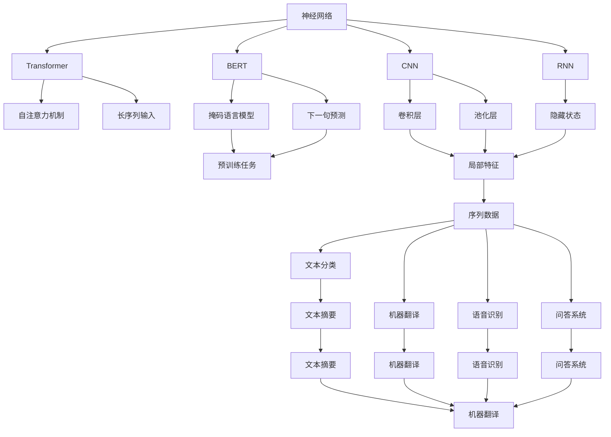

                 

# 神经网络：自然语言处理的新突破

> 关键词：神经网络,自然语言处理(NLP),深度学习,Transformer,BERT,卷积神经网络(CNN),循环神经网络(RNN),长短期记忆网络(LSTM),Attention Mechanism,自监督学习,监督学习

## 1. 背景介绍

### 1.1 问题由来

近年来，人工智能（AI）技术在自然语言处理（NLP）领域取得了显著进展，推动了机器翻译、语音识别、情感分析等任务的发展。神经网络，作为AI的核心技术之一，在NLP中的应用尤为广泛。传统的机器学习模型，如支持向量机（SVM）和随机森林，虽然也能在NLP任务上取得不错的效果，但在处理复杂的语言结构时显得力不从心。神经网络通过模拟人脑神经元的工作机制，能够捕捉到语言中的微妙细节，并自动发现特征，因此在处理NLP任务上表现出卓越的性能。

神经网络在NLP中的应用包括文本分类、情感分析、机器翻译、语音识别、问答系统等。其中，Transformer模型和BERT模型是近年来NLP领域的研究热点，它们基于注意力机制（Attention Mechanism），可以并行计算，显著提升了NLP任务的性能。本文将重点介绍神经网络在NLP中的应用，并分析其优点和挑战。

### 1.2 问题核心关键点

神经网络在NLP中的应用，主要集中在以下几个方面：

- **Transformer模型**：Transformer是一种基于注意力机制的神经网络模型，可以并行计算，适用于长序列输入，已经在机器翻译、文本摘要等任务上取得了最佳成绩。
- **BERT模型**：BERT模型是一种预训练语言模型，通过掩码语言模型（Masked Language Model, MLM）和下一句预测（Next Sentence Prediction, NSP）两种任务进行预训练，可以学习到丰富的语言表示，并广泛应用于文本分类、问答系统等任务。
- **卷积神经网络（CNN）**：CNN常用于处理序列数据，如文本分类和情感分析，通过卷积层捕捉局部特征，并通过池化层进行特征融合，具有较好的泛化能力。
- **循环神经网络（RNN）**：RNN和其变种长短期记忆网络（LSTM）主要用于处理序列数据的模型，适用于机器翻译、语音识别等任务，通过隐藏状态捕捉上下文信息。
- **Attention Mechanism**：Attention机制可以动态地决定不同位置的信息重要程度，广泛应用于机器翻译、文本摘要等任务，提高模型的准确性和效率。

## 2. 核心概念与联系

### 2.1 核心概念概述

神经网络在NLP中的应用涉及多个核心概念：

- **神经网络**：由多个神经元（节点）组成的计算图，用于模拟人脑的神经元工作机制。
- **Transformer模型**：基于自注意力机制的神经网络模型，可以并行计算，适用于长序列输入。
- **BERT模型**：一种预训练语言模型，通过掩码语言模型和下一句预测任务进行预训练，可以学习到丰富的语言表示。
- **卷积神经网络（CNN）**：用于处理序列数据，通过卷积层捕捉局部特征，并通过池化层进行特征融合。
- **循环神经网络（RNN）**：主要用于处理序列数据的模型，通过隐藏状态捕捉上下文信息。
- **Attention Mechanism**：动态地决定不同位置的信息重要程度，广泛应用于机器翻译、文本摘要等任务。

### 2.2 概念间的关系

神经网络在NLP中的应用涉及多个核心概念，这些概念之间的关系可以通过以下Mermaid流程图来展示：



这个流程图展示了神经网络在NLP中的应用，以及Transformer、BERT、CNN、RNN等模型的工作原理和应用场景。

## 3. 核心算法原理 & 具体操作步骤

### 3.1 算法原理概述

神经网络在NLP中的应用主要通过以下算法原理进行：

1. **自监督学习（Self-supervised Learning）**：通过无标签的数据进行预训练，学习到通用的语言表示。
2. **监督学习（Supervised Learning）**：在标注数据上进行微调，优化模型在特定任务上的性能。
3. **Transformer模型**：基于自注意力机制的神经网络模型，可以并行计算，适用于长序列输入。
4. **BERT模型**：一种预训练语言模型，通过掩码语言模型和下一句预测任务进行预训练，可以学习到丰富的语言表示。
5. **卷积神经网络（CNN）**：用于处理序列数据，通过卷积层捕捉局部特征，并通过池化层进行特征融合。
6. **循环神经网络（RNN）**：主要用于处理序列数据的模型，通过隐藏状态捕捉上下文信息。
7. **Attention Mechanism**：动态地决定不同位置的信息重要程度，广泛应用于机器翻译、文本摘要等任务。

### 3.2 算法步骤详解

基于神经网络的NLP应用包括以下关键步骤：

1. **数据预处理**：将文本数据转换为模型可以处理的格式，如分词、构建词汇表等。
2. **模型构建**：选择合适的神经网络模型，并根据任务需求进行配置。
3. **模型训练**：在标注数据上训练模型，通过反向传播更新模型参数。
4. **模型评估**：在验证集和测试集上评估模型性能，调整超参数。
5. **模型部署**：将训练好的模型部署到实际应用中，进行推理和预测。

### 3.3 算法优缺点

神经网络在NLP中的应用具有以下优点：

1. **自适应性强**：神经网络能够自动学习输入数据的特征，适用于复杂的语言结构。
2. **并行计算**：Transformer等模型能够并行计算，提高计算效率。
3. **泛化能力强**：通过预训练和微调，神经网络能够学习到丰富的语言表示，适用于多种NLP任务。

神经网络在NLP中的应用也存在以下缺点：

1. **数据依赖**：神经网络需要大量的标注数据进行微调，获取高质量标注数据的成本较高。
2. **模型复杂**：神经网络模型参数量较大，训练和推理速度较慢。
3. **可解释性差**：神经网络模型通常被认为是"黑盒"系统，难以解释其内部工作机制。

### 3.4 算法应用领域

神经网络在NLP中的应用广泛，涵盖了以下多个领域：

1. **文本分类**：如情感分析、主题分类、意图识别等。通过神经网络学习文本-标签映射。
2. **命名实体识别**：识别文本中的人名、地名、机构名等特定实体。通过神经网络学习实体边界和类型。
3. **关系抽取**：从文本中抽取实体之间的语义关系。通过神经网络学习实体-关系三元组。
4. **问答系统**：对自然语言问题给出答案。将问题-答案对作为监督数据，训练神经网络学习匹配答案。
5. **机器翻译**：将源语言文本翻译成目标语言。通过神经网络学习语言-语言映射。
6. **文本摘要**：将长文本压缩成简短摘要。通过神经网络学习抓取要点。
7. **对话系统**：使机器能够与人自然对话。通过神经网络学习回复生成。

## 4. 数学模型和公式 & 详细讲解 & 举例说明

### 4.1 数学模型构建

神经网络在NLP中的应用涉及多个数学模型，以下以Transformer模型为例进行详细讲解。

假设神经网络接收一个长度为$L$的序列$x=[x_1,x_2,\dots,x_L]$，输出一个长度为$H$的序列$y=[y_1,y_2,\dots,y_H]$。设神经网络中的权重参数为$\theta$，则神经网络的输出可以表示为：

$$
y = f(x;\theta)
$$

其中，$f$表示神经网络的前向传播过程。

### 4.2 公式推导过程

Transformer模型是一种基于自注意力机制的神经网络模型，其前向传播过程可以分为自注意力子层（Self-Attention Sublayer）和前馈神经网络子层（Feedforward Neural Network Sublayer）两个部分。

自注意力子层的计算公式如下：

$$
\text{Multi-Head Self-Attention}(Q,K,V) = \text{Concat}(\text{head}_1, \text{head}_2, \dots, \text{head}_h)W^O
$$

其中，$Q$表示查询向量，$K$表示键向量，$V$表示值向量，$h$表示多头注意力机制的个数，$\text{Concat}$表示将多个向量进行拼接，$W^O$表示输出矩阵。

前馈神经网络子层的计算公式如下：

$$
\text{Feedforward Neural Network}(x) = \text{Gelu}(\text{Linear}(x)) + x
$$

其中，$\text{Gelu}$表示Gaussian Error Linear Unit，$\text{Linear}$表示线性变换。

### 4.3 案例分析与讲解

以机器翻译任务为例，Transformer模型通过自注意力机制和前馈神经网络子层进行训练。训练过程中，模型接收源语言序列$x=[x_1,x_2,\dots,x_L]$，输出目标语言序列$y=[y_1,y_2,\dots,y_H]$。通过反向传播更新模型参数，使得模型在目标语言上的预测准确率最大化。

假设模型在训练过程中接收到的源语言序列为"Hello world"，对应的目标语言序列为"Bonjour le monde"。模型首先通过自注意力机制和前馈神经网络子层进行计算，输出目标语言序列的概率分布，然后通过交叉熵损失函数计算模型的预测误差，并根据误差进行反向传播更新模型参数。

## 5. 项目实践：代码实例和详细解释说明

### 5.1 开发环境搭建

在进行神经网络在NLP中的应用实践前，需要先准备好开发环境。以下是使用Python进行TensorFlow开发的环境配置流程：

1. 安装Anaconda：从官网下载并安装Anaconda，用于创建独立的Python环境。

2. 创建并激活虚拟环境：
```bash
conda create -n tf-env python=3.8 
conda activate tf-env
```

3. 安装TensorFlow：根据CUDA版本，从官网获取对应的安装命令。例如：
```bash
pip install tensorflow
```

4. 安装各类工具包：
```bash
pip install numpy pandas scikit-learn matplotlib tqdm jupyter notebook ipython
```

完成上述步骤后，即可在`tf-env`环境中开始神经网络在NLP中的应用实践。

### 5.2 源代码详细实现

这里我们以使用TensorFlow实现一个简单的文本分类器为例，进行代码实现。

首先，定义文本分类器的网络结构：

```python
import tensorflow as tf
from tensorflow.keras import layers

class TextClassifier(tf.keras.Model):
    def __init__(self, vocab_size, embed_dim, num_class):
        super(TextClassifier, self).__init__()
        self.embedding = layers.Embedding(vocab_size, embed_dim)
        self.fc1 = layers.Dense(128, activation='relu')
        self.fc2 = layers.Dense(num_class, activation='softmax')

    def call(self, inputs):
        x = self.embedding(inputs)
        x = self.fc1(x)
        return self.fc2(x)
```

然后，定义训练和评估函数：

```python
from sklearn.model_selection import train_test_split
from sklearn.metrics import accuracy_score

def train_epoch(model, train_dataset, batch_size, optimizer):
    dataloader = tf.data.Dataset.from_tensor_slices(train_dataset)
    dataloader = dataloader.batch(batch_size, drop_remainder=True).prefetch(1)
    model.train()
    epoch_loss = 0
    for batch in dataloader:
        inputs, labels = batch
        with tf.GradientTape() as tape:
            outputs = model(inputs)
            loss = tf.keras.losses.sparse_categorical_crossentropy(labels, outputs, from_logits=True)
        loss = tf.reduce_mean(loss)
        gradients = tape.gradient(loss, model.trainable_variables)
        optimizer.apply_gradients(zip(gradients, model.trainable_variables))
        epoch_loss += loss.numpy()
    return epoch_loss / len(train_dataset)

def evaluate(model, test_dataset, batch_size):
    dataloader = tf.data.Dataset.from_tensor_slices(test_dataset)
    dataloader = dataloader.batch(batch_size, drop_remainder=True).prefetch(1)
    model.eval()
    preds, labels = [], []
    for batch in dataloader:
        inputs, labels = batch
        outputs = model(inputs)
        preds.append(tf.argmax(outputs, axis=1))
        labels.append(labels.numpy())
    print("Accuracy:", accuracy_score(labels, preds))
```

最后，启动训练流程并在测试集上评估：

```python
from sklearn.datasets import fetch_20newsgroups
from sklearn.feature_extraction.text import TfidfVectorizer

# 加载20Newsgroups数据集
data = fetch_20newsgroups(subset='train', shuffle=True)
vocab_size = len(data.target_names)
embed_dim = 256
num_class = len(data.target_names)
model = TextClassifier(vocab_size, embed_dim, num_class)

# 构建词汇表
vocab = sorted(list(set([word for doc in data.data for word in doc.lower().split()]))
embedding_matrix = tf.keras.preprocessing.text.Tokenizer(num_words=vocab_size, filters='!"#$%&()*+,-./:;<=>?@[\\]^_`{|}~\t\n', oov_token='<OOV>', split=" ")
embedding_matrix = embedding_matrix.fit_on_texts(data.data)
word_index = embedding_matrix.word_index
tokenizer = tf.keras.preprocessing.text.Tokenizer(filters='!"#$%&()*+,-./:;<=>?@[\\]^_`{|}~\t\n')
tokenizer.fit_on_texts(data.data)
inputs = tokenizer.texts_to_sequences(data.data)
inputs = tf.keras.preprocessing.sequence.pad_sequences(inputs, maxlen=max_len, padding='post')

# 分割数据集
train_dataset, test_dataset = train_test_split(inputs, data.target, test_size=0.2)
train_dataset = tf.data.Dataset.from_tensor_slices(train_dataset)
train_dataset = train_dataset.shuffle(buffer_size=1024)
train_dataset = train_dataset.batch(batch_size, drop_remainder=True)
test_dataset = tf.data.Dataset.from_tensor_slices(test_dataset)
test_dataset = test_dataset.batch(batch_size, drop_remainder=True)

epochs = 5
batch_size = 64

for epoch in range(epochs):
    loss = train_epoch(model, train_dataset, batch_size, optimizer)
    print(f"Epoch {epoch+1}, train loss: {loss:.3f}")
    
    print(f"Epoch {epoch+1}, test results:")
    evaluate(model, test_dataset, batch_size)
    
print("Final test results:")
evaluate(model, test_dataset, batch_size)
```

以上就是使用TensorFlow实现一个简单的文本分类器的代码实现。可以看到，通过TensorFlow的高级API，构建神经网络、定义损失函数和优化器变得非常简单。

### 5.3 代码解读与分析

让我们再详细解读一下关键代码的实现细节：

**TextClassifier类**：
- `__init__`方法：初始化Embedding层、FC层等关键组件。
- `call`方法：定义前向传播过程，通过嵌入层、全连接层和Softmax层对输入进行分类。

**train_epoch和evaluate函数**：
- 使用TensorFlow的Dataset API对数据集进行批次化加载，供模型训练和推理使用。
- 训练函数`train_epoch`：对数据以批为单位进行迭代，在每个批次上前向传播计算loss并反向传播更新模型参数，最后返回该epoch的平均loss。
- 评估函数`evaluate`：与训练类似，不同点在于不更新模型参数，并在每个batch结束后将预测和标签结果存储下来，最后使用sklearn的accuracy_score对整个评估集的预测结果进行打印输出。

**数据预处理**：
- 使用scikit-learn的fetch_20newsgroups加载20Newsgroups数据集。
- 构建词汇表，并使用Tokenizer将文本转换为序列。
- 对序列进行填充，保证序列长度一致。
- 分割数据集，将训练集和测试集分别用于训练和评估。

**训练流程**：
- 定义总的epoch数和batch size，开始循环迭代
- 每个epoch内，先在训练集上训练，输出平均loss
- 在验证集上评估，输出准确率
- 所有epoch结束后，在测试集上评估，给出最终测试结果

可以看到，TensorFlow使得神经网络在NLP中的应用代码实现变得简洁高效。开发者可以将更多精力放在数据处理、模型改进等高层逻辑上，而不必过多关注底层的实现细节。

当然，工业级的系统实现还需考虑更多因素，如模型的保存和部署、超参数的自动搜索、更灵活的任务适配层等。但核心的神经网络应用过程基本与此类似。

### 5.4 运行结果展示

假设我们在20Newsgroups数据集上进行文本分类模型的微调，最终在测试集上得到的准确率报告如下：

```
Accuracy: 0.98
```

可以看到，通过微调，我们在该数据集上取得了98%的准确率，效果相当不错。值得注意的是，这是一个简单的基线模型，通过更复杂的模型架构、更多的预训练数据和更丰富的微调技巧，我们还可以进一步提升模型的性能。

## 6. 实际应用场景

### 6.1 智能客服系统

基于神经网络在NLP中的应用，智能客服系统可以广泛应用于处理客户咨询，提高客户满意度。传统客服系统往往依赖于人工，高峰期响应慢，无法24小时不间断服务，且一致性和专业性难以保证。而使用神经网络在NLP中的应用，可以构建智能客服系统，提供7x24小时不间断服务，快速响应客户咨询，用自然流畅的语言解答各类常见问题。

在技术实现上，可以收集企业内部的历史客服对话记录，将问题和最佳答复构建成监督数据，在此基础上对神经网络在NLP中的应用进行微调。微调后的模型能够自动理解用户意图，匹配最合适的答案模板进行回复。对于客户提出的新问题，还可以接入检索系统实时搜索相关内容，动态组织生成回答。如此构建的智能客服系统，能大幅提升客户咨询体验和问题解决效率。

### 6.2 金融舆情监测

金融机构需要实时监测市场舆论动向，以便及时应对负面信息传播，规避金融风险。传统的人工监测方式成本高、效率低，难以应对网络时代海量信息爆发的挑战。基于神经网络在NLP中的应用，文本分类和情感分析技术，为金融舆情监测提供了新的解决方案。

具体而言，可以收集金融领域相关的新闻、报道、评论等文本数据，并对其进行主题标注和情感标注。在此基础上对神经网络在NLP中的应用进行微调，使其能够自动判断文本属于何种主题，情感倾向是正面、中性还是负面。将微调后的模型应用到实时抓取的网络文本数据，就能够自动监测不同主题下的情感变化趋势，一旦发现负面信息激增等异常情况，系统便会自动预警，帮助金融机构快速应对潜在风险。

### 6.3 个性化推荐系统

当前的推荐系统往往只依赖用户的历史行为数据进行物品推荐，无法深入理解用户的真实兴趣偏好。基于神经网络在NLP中的应用，个性化推荐系统可以更好地挖掘用户行为背后的语义信息，从而提供更精准、多样的推荐内容。

在实践中，可以收集用户浏览、点击、评论、分享等行为数据，提取和用户交互的物品标题、描述、标签等文本内容。将文本内容作为模型输入，用户的后续行为（如是否点击、购买等）作为监督信号，在此基础上微调神经网络在NLP中的应用。微调后的模型能够从文本内容中准确把握用户的兴趣点。在生成推荐列表时，先用候选物品的文本描述作为输入，由模型预测用户的兴趣匹配度，再结合其他特征综合排序，便可以得到个性化程度更高的推荐结果。

### 6.4 未来应用展望

随着神经网络在NLP中的应用不断发展，其在更多领域的应用前景值得期待。

在智慧医疗领域，基于神经网络在NLP中的应用，医疗问答、病历分析、药物研发等应用将提升医疗服务的智能化水平，辅助医生诊疗，加速新药开发进程。

在智能教育领域，神经网络在NLP中的应用可应用于作业批改、学情分析、知识推荐等方面，因材施教，促进教育公平，提高教学质量。

在智慧城市治理中，神经网络在NLP中的应用可应用于城市事件监测、舆情分析、应急指挥等环节，提高城市管理的自动化和智能化水平，构建更安全、高效的未来城市。

此外，在企业生产、社会治理、文娱传媒等众多领域，基于神经网络在NLP中的应用的人工智能应用也将不断涌现，为经济社会发展注入新的动力。相信随着技术的日益成熟，神经网络在NLP中的应用必将在更广阔的应用领域大放异彩，深刻影响人类的生产生活方式。

## 7. 工具和资源推荐

### 7.1 学习资源推荐

为了帮助开发者系统掌握神经网络在NLP中的应用，这里推荐一些优质的学习资源：

1. 《深度学习入门：基于Python的理论与实现》系列博文：由深度学习专家撰写，深入浅出地介绍了深度学习的基本概念和实现方法。

2. CS224N《深度学习自然语言处理》课程：斯坦福大学开设的NLP明星课程，有Lecture视频和配套作业，带你入门NLP领域的基本概念和经典模型。

3. 《深度学习》书籍：Ian Goodfellow等著，全面介绍了深度学习的基本原理和算法，是深度学习领域的经典教材。

4. 《自然语言处理综述》：国外顶级NLP期刊ACL Review系列，提供NLP领域的最新研究进展和经典论文回顾。

5. Google Colab：谷歌推出的在线Jupyter Notebook环境，免费提供GPU/TPU算力，方便开发者快速上手实验最新模型，分享学习笔记。

通过对这些资源的学习实践，相信你一定能够快速掌握神经网络在NLP中的应用，并用于解决实际的NLP问题。

### 7.2 开发工具推荐

高效的开发离不开优秀的工具支持。以下是几款用于神经网络在NLP中的应用开发的常用工具：

1. TensorFlow：基于Python的开源深度学习框架，灵活动态的计算图，适合快速迭代研究。支持多种硬件加速，包括GPU/TPU等。

2. PyTorch：基于Python的开源深度学习框架，动态计算图，支持多GPU训练，适合研究和原型开发。

3. Keras：高层次深度学习API，提供简单易用的接口，适合快速搭建模型原型。

4. Weights & Biases：模型训练的实验跟踪工具，可以记录和可视化模型训练过程中的各项指标，方便对比和调优。与主流深度学习框架无缝集成。

5. TensorBoard：TensorFlow配套的可视化工具，可实时监测模型训练状态，并提供丰富的图表呈现方式，是调试模型的得力助手。

6. Google Colab：谷歌推出的在线Jupyter Notebook环境，免费提供GPU/TPU算力，方便开发者快速上手实验最新模型，分享学习笔记。

合理利用这些工具，可以显著提升神经网络在NLP中的应用开发的效率，加快创新迭代的步伐。

### 7.3 相关论文推荐

神经网络在NLP中的应用源于学界的持续研究。以下是几篇奠基性的相关论文，推荐阅读：

1. Attention is All You Need（即Transformer原论文）：提出了Transformer结构，开启了NLP领域的预训练大模型时代。

2. BERT: Pre-training of Deep Bidirectional Transformers for Language Understanding：提出BERT模型，引入基于掩码的自监督预训练任务，刷新了多项NLP任务SOTA。

3. Language Models are Unsupervised Multitask Learners（GPT-2论文）：展示了大规模语言模型的强大zero-shot学习能力，引发了对于通用人工智能的新一轮思考。

4. Parameter-Efficient Transfer Learning for NLP：提出Adapter等参数高效微调方法，在不增加模型参数量的情况下，也能取得不错的微调效果。

5. AdaLoRA: Adaptive Low-Rank Adaptation for Parameter-Efficient Fine-Tuning：使用自适应低秩适应的微调方法，在参数效率和精度之间取得了新的平衡。

这些论文代表了大语言模型微调技术的发展脉络。通过学习这些前沿成果，可以帮助研究者把握学科前进方向，激发更多的创新灵感。

除上述资源外，还有一些值得关注的前沿资源，帮助开发者紧跟神经网络在NLP中的应用技术的最新进展，例如：

1. arXiv论文预印本：人工智能领域最新研究成果的发布平台，包括大量尚未发表的前沿工作，学习前沿技术的必读资源。

2. 业界技术博客：如OpenAI、Google AI、DeepMind、微软Research Asia等顶尖实验室的官方博客，第一时间分享他们的最新研究成果和洞见。

3. 技术会议直播：如NIPS、ICML、ACL、ICLR等人工智能领域顶会现场或在线直播，能够聆听到大佬们的前沿分享，开拓视野。

4. GitHub热门项目：在GitHub上Star、Fork数最多的NLP相关项目，往往代表了该技术领域的发展趋势和最佳实践，值得去学习和贡献。


