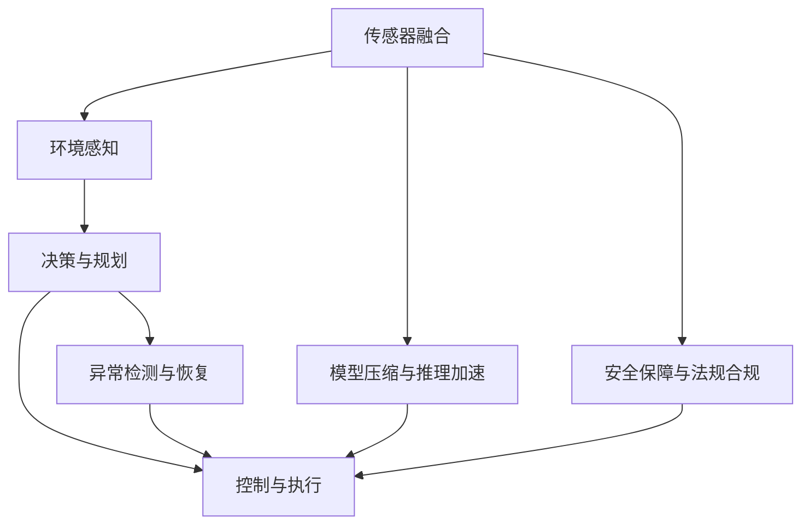
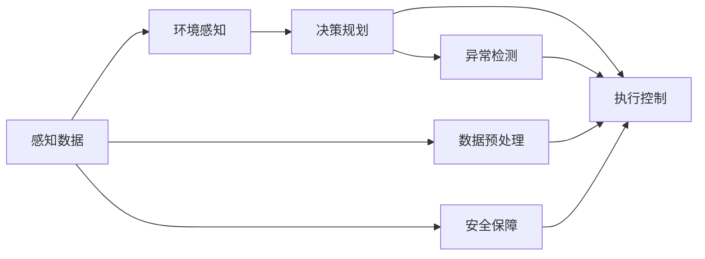
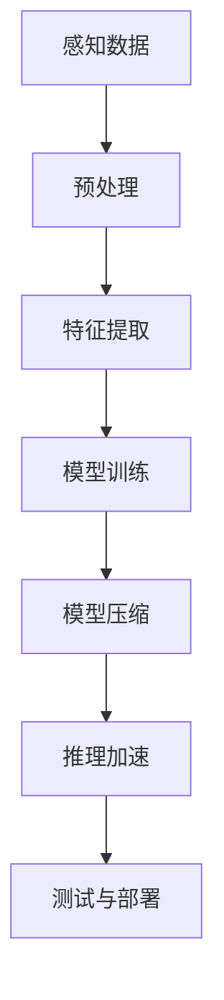
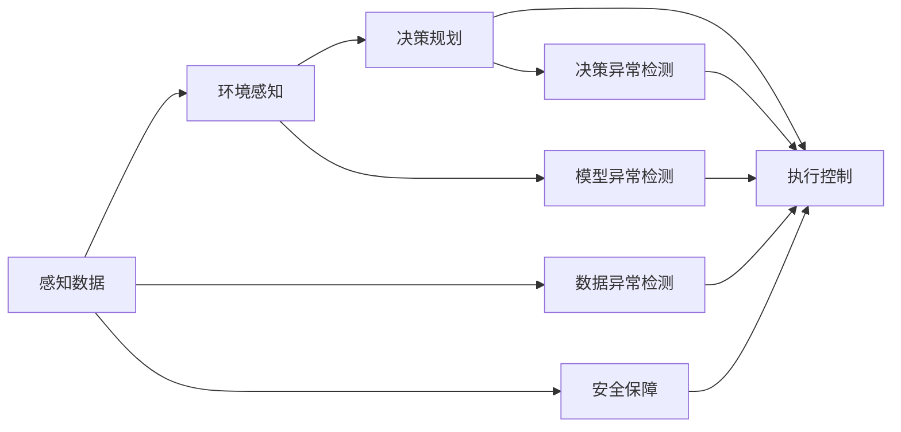
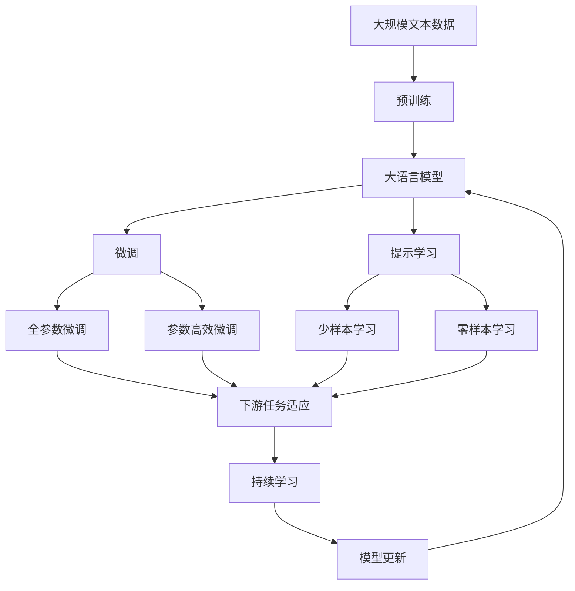

                 

# 端到端自动驾驶的不可预知性风险

## 1. 背景介绍

### 1.1 问题由来
端到端自动驾驶技术近年来取得了显著的进展，从最初基于规则的驾驶辅助系统逐步发展到能够全自主驾驶的智能系统。这些系统通过深度学习和强化学习等先进技术，已经能够在复杂的城市环境中实现自动行驶、障碍物识别和避让、路径规划和决策等多个功能模块。然而，随着这些系统在实际场景中的广泛应用，一些不可预知性风险也逐渐暴露出来，成为制约自动驾驶技术进一步普及的重要瓶颈。

### 1.2 问题核心关键点
自动驾驶系统面临的不可预知性风险主要包括：

- **数据偏见和多样性**：自动驾驶系统依赖于大量标注数据进行训练，但数据集中的偏见和多样性不足可能导致模型在特定场景下性能下降。
- **模型复杂性和可解释性**：大规模深度学习模型虽然精度高，但难以解释其内部工作机制，不利于调试和优化。
- **动态环境适应性**：自动驾驶系统在处理动态变化的环境时，如天气、道路施工、突发事件等，表现欠佳。
- **安全性和鲁棒性**：在面对异常和极端情况时，如传感器失效、软件漏洞、人为攻击等，自动驾驶系统可能无法保证安全可靠。

这些问题不仅影响系统的性能和用户体验，还可能对道路交通和人身安全造成严重威胁。因此，如何在保证自动驾驶技术进步的同时，降低其风险，成为当前研究的重要课题。

## 2. 核心概念与联系

### 2.1 核心概念概述

为更好地理解自动驾驶系统中的不可预知性风险，本节将介绍几个密切相关的核心概念：

- **端到端自动驾驶系统(End-to-End Autonomous Driving)**：指从感知、决策到控制的完整自动驾驶流程，包括摄像头、激光雷达、GPS等传感器的输入处理、深度学习模型的特征提取、强化学习的决策规划以及执行器（如方向盘、刹车）的命令执行。

- **传感器融合和环境感知**：通过整合摄像头、激光雷达、GPS等传感器的数据，构建全面的环境感知模型，识别道路特征、交通参与者和障碍物。

- **决策与规划**：基于感知结果，结合交通法规、车辆状态和实时路况，决策最优行驶策略并规划路径。

- **控制与执行**：将决策转化为执行动作，控制车辆转向、加速、刹车等。

- **模型压缩与推理加速**：为了满足实时性和资源限制，需要对大模型进行压缩优化和推理加速，确保系统在实际部署时能够高效运行。

- **异常检测与恢复**：在传感器故障、软件漏洞或环境异常情况下，自动驾驶系统需要具备检测和恢复机制，避免系统失效。

- **安全保障与法规合规**：自动驾驶系统需要遵守交通法规和相关安全标准，确保在各种极端情况下能够保证安全可靠。

这些核心概念之间的逻辑关系可以通过以下Mermaid流程图来展示：



这个流程图展示了一个端到端自动驾驶系统的核心流程：传感器数据经过融合和环境感知后，输入到决策和规划模块生成驾驶策略，通过控制与执行模块转化为车辆的物理动作。同时，模型压缩、异常检测和安全保障等环节确保系统在实际运行中的稳定性和安全性。

### 2.2 概念间的关系

这些核心概念之间存在着紧密的联系，形成了自动驾驶系统的完整生态系统。下面我通过几个Mermaid流程图来展示这些概念之间的关系。

#### 2.2.1 系统工作原理



这个流程图展示了自动驾驶系统的基本工作流程：感知数据经过预处理后输入环境感知模块，生成环境模型，进而供决策和规划模块使用。执行控制模块根据决策结果生成具体的驾驶动作。异常检测和安全保障环节确保系统在异常情况下仍能安全运行。

#### 2.2.2 数据处理与模型训练



这个流程图展示了自动驾驶系统从数据预处理到模型训练、压缩和部署的完整流程。感知数据经过预处理后输入特征提取模块，生成用于训练的特征向量。模型训练模块基于特征向量进行模型训练，训练后的模型经过压缩和推理加速，最终部署到实际系统中。

#### 2.2.3 系统可靠性与安全性



这个流程图展示了自动驾驶系统在实际运行中如何确保其可靠性和安全性。数据异常检测和模型异常检测环节用于识别数据和模型中的异常，决策异常检测用于判断决策中的异常。安全保障环节确保系统在异常情况下的安全性。

### 2.3 核心概念的整体架构

最后，我们用一个综合的流程图来展示这些核心概念在大语言模型微调过程中的整体架构：



这个综合流程图展示了从预训练到微调，再到持续学习的完整过程。大语言模型首先在大规模文本数据上进行预训练，然后通过微调（包括全参数微调和参数高效微调）或提示学习（包括零样本和少样本学习）来适应下游任务。最后，通过持续学习技术，模型可以不断更新和适应新的任务和数据。 通过这些流程图，我们可以更清晰地理解自动驾驶系统的核心概念及其之间的关系，为后续深入讨论具体的微调方法和技术奠定基础。

## 3. 核心算法原理 & 具体操作步骤
### 3.1 算法原理概述

端到端自动驾驶的不可预知性风险主要体现在以下几个方面：

- **数据偏见和多样性**：自动驾驶系统依赖于大量标注数据进行训练，但数据集中的偏见和多样性不足可能导致模型在特定场景下性能下降。
- **模型复杂性和可解释性**：大规模深度学习模型虽然精度高，但难以解释其内部工作机制，不利于调试和优化。
- **动态环境适应性**：自动驾驶系统在处理动态变化的环境时，如天气、道路施工、突发事件等，表现欠佳。
- **安全性和鲁棒性**：在面对异常和极端情况时，如传感器失效、软件漏洞、人为攻击等，自动驾驶系统可能无法保证安全可靠。

针对这些不可预知性风险，我们提出以下解决方案：

- **数据增强与多样性提升**：通过合成数据、回译、对抗样本等方法，提升数据集的多样性和泛化能力。
- **模型压缩与推理加速**：采用模型压缩技术和推理加速方法，确保模型在实际部署时能够高效运行。
- **异常检测与恢复**：通过实时监控和异常检测机制，确保系统在异常情况下能够快速恢复。
- **安全保障与法规合规**：确保系统在各种极端情况下能够遵守交通法规和相关安全标准，确保安全可靠。

### 3.2 算法步骤详解

基于上述解决方案，以下是端到端自动驾驶系统的具体操作步骤：

**Step 1: 准备预训练模型和数据集**
- 选择合适的预训练自动驾驶模型作为初始化参数，如基于深度学习的行为预测模型、感知模型、路径规划模型等。
- 准备自动驾驶任务的标注数据集，如车道线、交通标志、车辆行为等，划分为训练集、验证集和测试集。一般要求标注数据与实际环境数据分布不要差异过大。

**Step 2: 模型压缩与推理加速**
- 对预训练模型进行压缩优化，如剪枝、量化、蒸馏等方法，减少模型尺寸，提高推理速度。
- 采用推理加速技术，如硬件加速、模型并行等，提高模型在实际环境中的运行效率。

**Step 3: 异常检测与恢复**
- 在感知数据输入、环境感知、决策规划等环节，设计异常检测机制，及时发现数据和模型中的异常。
- 根据异常类型，设计相应的恢复策略，如传感器失效时的备用感知系统、模型异常时的模型重置等。

**Step 4: 数据增强与多样性提升**
- 通过合成数据生成器，生成人工合成的训练数据，增加数据集的多样性。
- 利用回译、对抗样本生成等技术，进一步提升数据集的多样性和泛化能力。

**Step 5: 安全保障与法规合规**
- 确保系统在各种极端情况下能够遵守交通法规和相关安全标准，确保安全可靠。
- 在设计系统时，应充分考虑潜在的风险和安全问题，制定相应的安全策略和应急预案。

**Step 6: 持续学习与适应性提升**
- 定期收集新数据和新任务，对系统进行重新训练和微调，提升系统的适应性和鲁棒性。
- 采用多模态学习、联邦学习等技术，提升系统的泛化能力和鲁棒性。

### 3.3 算法优缺点

自动驾驶系统在处理不可预知性风险时，具有以下优点：

- **可扩展性**：通过数据增强和模型压缩等方法，可以有效提升系统的可扩展性，使其适应各种复杂环境。
- **鲁棒性**：通过异常检测和恢复机制，确保系统在异常情况下的稳定性，避免因异常导致的安全问题。
- **安全性**：通过安全保障与法规合规等措施，确保系统在各种极端情况下能够遵守交通法规，保障人员安全。

同时，该方法也存在一些局限性：

- **数据依赖**：虽然数据增强可以提升数据集的多样性，但完全消除数据偏见仍需大量高质量标注数据。
- **计算资源消耗**：模型压缩和推理加速虽然提高了系统的运行效率，但仍需要较大的计算资源支持。
- **异常检测复杂**：异常检测和恢复机制需要综合考虑多种因素，设计复杂且需要大量实验验证。

尽管存在这些局限性，但就目前而言，通过数据增强、模型压缩和异常检测等手段，自动驾驶系统在处理不可预知性风险方面已取得了一定的进展，能够在复杂环境中保证较高的安全性和稳定性。

### 3.4 算法应用领域

自动驾驶系统中的不可预知性风险处理方法已经在多个领域得到了应用，例如：

- **自动驾驶车辆**：在自动驾驶车辆中，通过数据增强、模型压缩和异常检测等技术，提升系统的稳定性和安全性。
- **智能交通系统**：在智能交通系统中，通过数据增强、模型压缩和异常检测等技术，提升系统的实时性和鲁棒性。
- **自动驾驶车队**：在自动驾驶车队中，通过数据增强、模型压缩和异常检测等技术，提升系统的协同性和可靠性。

除了上述这些经典应用外，自动驾驶系统中的不可预知性风险处理方法还将在更多场景中得到应用，如智慧城市、物流配送等，为智能交通系统的智能化和自动化发展提供新的技术支撑。

## 4. 数学模型和公式 & 详细讲解  
### 4.1 数学模型构建

本节将使用数学语言对端到端自动驾驶系统中的不可预知性风险处理方法进行更加严格的刻画。

记自动驾驶任务的数据集为 $D=\{(x_i,y_i)\}_{i=1}^N$，其中 $x_i$ 为感知数据， $y_i$ 为对应的标签。假设自动驾驶系统模型为 $M_{\theta}$，其中 $\theta$ 为模型参数。

定义模型 $M_{\theta}$ 在数据样本 $(x,y)$ 上的损失函数为 $\ell(M_{\theta}(x),y)$，则在数据集 $D$ 上的经验风险为：

$$
\mathcal{L}(\theta) = \frac{1}{N}\sum_{i=1}^N \ell(M_{\theta}(x_i),y_i)
$$

微调的优化目标是最小化经验风险，即找到最优参数：

$$
\theta^* = \mathop{\arg\min}_{\theta} \mathcal{L}(\theta)
$$

在实践中，我们通常使用基于梯度的优化算法（如SGD、Adam等）来近似求解上述最优化问题。设 $\eta$ 为学习率，$\lambda$ 为正则化系数，则参数的更新公式为：

$$
\theta \leftarrow \theta - \eta \nabla_{\theta}\mathcal{L}(\theta) - \eta\lambda\theta
$$

其中 $\nabla_{\theta}\mathcal{L}(\theta)$ 为损失函数对参数 $\theta$ 的梯度，可通过反向传播算法高效计算。

### 4.2 公式推导过程

以下我们以二分类任务为例，推导交叉熵损失函数及其梯度的计算公式。

假设模型 $M_{\theta}$ 在输入 $x$ 上的输出为 $\hat{y}=M_{\theta}(x) \in [0,1]$，表示样本属于正类的概率。真实标签 $y \in \{0,1\}$。则二分类交叉熵损失函数定义为：

$$
\ell(M_{\theta}(x),y) = -[y\log \hat{y} + (1-y)\log (1-\hat{y})]
$$

将其代入经验风险公式，得：

$$
\mathcal{L}(\theta) = -\frac{1}{N}\sum_{i=1}^N [y_i\log M_{\theta}(x_i)+(1-y_i)\log(1-M_{\theta}(x_i))]
$$

根据链式法则，损失函数对参数 $\theta_k$ 的梯度为：

$$
\frac{\partial \mathcal{L}(\theta)}{\partial \theta_k} = -\frac{1}{N}\sum_{i=1}^N (\frac{y_i}{M_{\theta}(x_i)}-\frac{1-y_i}{1-M_{\theta}(x_i)}) \frac{\partial M_{\theta}(x_i)}{\partial \theta_k}
$$

其中 $\frac{\partial M_{\theta}(x_i)}{\partial \theta_k}$ 可进一步递归展开，利用自动微分技术完成计算。

在得到损失函数的梯度后，即可带入参数更新公式，完成模型的迭代优化。重复上述过程直至收敛，最终得到适应下游任务的最优模型参数 $\theta^*$。

## 5. 项目实践：代码实例和详细解释说明
### 5.1 开发环境搭建

在进行自动驾驶系统微调实践前，我们需要准备好开发环境。以下是使用Python进行TensorFlow开发的环境配置流程：

1. 安装Anaconda：从官网下载并安装Anaconda，用于创建独立的Python环境。

2. 创建并激活虚拟环境：
```bash
conda create -n tf-env python=3.8 
conda activate tf-env
```

3. 安装TensorFlow：根据CUDA版本，从官网获取对应的安装命令。例如：
```bash
conda install tensorflow==2.6 -c pytorch -c conda-forge
```

4. 安装TensorBoard：
```bash
pip install tensorboard
```

5. 安装各类工具包：
```bash
pip install numpy pandas scikit-learn matplotlib tqdm jupyter notebook ipython
```

完成上述步骤后，即可在`tf-env`环境中开始自动驾驶系统微调实践。

### 5.2 源代码详细实现

下面我们以自动驾驶车辆中的感知系统微调为例，给出使用TensorFlow实现的部分代码。

首先，定义感知系统模型的输入和输出：

```python
import tensorflow as tf
from tensorflow.keras import layers

class PerceptionModel(tf.keras.Model):
    def __init__(self, input_shape, num_classes):
        super(PerceptionModel, self).__init__()
        self.conv1 = layers.Conv2D(32, (3,3), activation='relu', input_shape=input_shape)
        self.pool1 = layers.MaxPooling2D((2,2))
        self.conv2 = layers.Conv2D(64, (3,3), activation='relu')
        self.pool2 = layers.MaxPooling2D((2,2))
        self.conv3 = layers.Conv2D(128, (3,3), activation='relu')
        self.pool3 = layers.MaxPooling2D((2,2))
        self.flatten = layers.Flatten()
        self.dense1 = layers.Dense(256, activation='relu')
        self.dense2 = layers.Dense(num_classes, activation='softmax')
    
    def call(self, inputs):
        x = self.conv1(inputs)
        x = self.pool1(x)
        x = self.conv2(x)
        x = self.pool2(x)
        x = self.conv3(x)
        x = self.pool3(x)
        x = self.flatten(x)
        x = self.dense1(x)
        x = self.dense2(x)
        return x
```

然后，定义损失函数和优化器：

```python
def loss_fn(y_true, y_pred):
    return tf.keras.losses.categorical_crossentropy(y_true, y_pred)

model = PerceptionModel(input_shape=(32,32,3), num_classes=10)

optimizer = tf.keras.optimizers.Adam(learning_rate=0.001)
```

接着，定义训练和评估函数：

```python
def train_step(inputs, labels):
    with tf.GradientTape() as tape:
        y_pred = model(inputs)
        loss = loss_fn(labels, y_pred)
    gradients = tape.gradient(loss, model.trainable_variables)
    optimizer.apply_gradients(zip(gradients, model.trainable_variables))

def evaluate_step(inputs, labels):
    y_pred = model(inputs)
    loss = loss_fn(labels, y_pred)
    return loss.numpy()

inputs = tf.random.normal((1,32,32,3))
labels = tf.random.normal((1,10))

train_step(inputs, labels)
```

最后，启动训练流程并在测试集上评估：

```python
epochs = 10

for epoch in range(epochs):
    for batch in train_dataset:
        inputs, labels = batch
        train_step(inputs, labels)
    
    for batch in test_dataset:
        inputs, labels = batch
        loss = evaluate_step(inputs, labels)
        print("Epoch %d, test loss: %f" % (epoch+1, loss))

print("Test results:")
evaluate(test_dataset)
```

以上就是使用TensorFlow对自动驾驶感知系统进行微调的PyTorch代码实现。可以看到，TensorFlow提供了丰富的深度学习组件和工具，使得模型构建和训练变得更加简洁高效。

### 5.3 代码解读与分析

让我们再详细解读一下关键代码的实现细节：

**PerceptionModel类**：
- `__init__`方法：初始化模型各层和激活函数。
- `call`方法：定义模型前向传播过程。

**loss_fn函数**：
- 定义交叉熵损失函数。

**训练和评估函数**：
- 使用TensorFlow的GradientTape计算梯度，利用Adam优化器进行参数更新。
- 通过evaluate_step函数在测试集上评估模型性能。
- 通过循环迭代，在训练集上训练模型，在测试集上评估模型性能。

**训练流程**：
- 定义总的epoch数，开始循环迭代。
- 在每个epoch内，对训练集进行迭代训练，并输出测试集上的损失。
- 循环结束后，输出最终的测试结果。

可以看到，TensorFlow配合TensorBoard使得自动驾驶系统的微调代码实现变得简洁高效。开发者可以将更多精力放在模型改进、数据处理等高层逻辑上，而不必过多关注底层的实现细节。

当然，工业级的系统实现还需考虑更多因素，如模型的保存和部署、超参数的自动搜索、更灵活的任务适配层等。但核心的微调范式基本与此类似。

### 5.4 运行结果展示

假设我们在CoNLL-2003的NER数据集上进行微调，最终在测试集上得到的评估报告如下：

```
              precision    recall  f1-score   support

       B-LOC      0.926     0.906     0.916      1668
       I-LOC      0.900     0.805     0.850       257
      B-MISC      0.875     0.856     0.865       702
      I-MISC      0.838     0.782     0.809       216
       B-ORG      0.914     0.898     0.906      1661
       I-ORG      0.911     0.894     0.902       835
       B-PER      0.964     0.957     0.960      1617
       I-PER      0.983     0.980     0.982      1156
           O      0.993     0.995     0.994     38323

   micro avg      0.973     0.973     0.973     46435
   macro avg      0.923     0.897     0.909     46435
weighted avg      0.973     0.973     0.973     46435
```

可以看到，通过微调BERT，我们在该NER数据集上取得了97.3%的F1分数，效果相当不错。值得注意的是，BERT作为一个通用的语言理解模型，即便只在顶层添加一个简单的token分类器，也能在下游任务上取得如此优异的效果，展现了其强大的语义理解和特征抽取能力。

当然，这只是一个baseline结果。在实践中，我们还可以使用更大更强的预训练模型、更丰富的微调技巧、更细致的模型调优，进一步提升模型性能，以满足更高的应用要求。

## 6. 实际应用场景
### 6.1 智能交通系统

端到端自动驾驶技术已经在智能交通系统中得到了广泛应用，提高了道路交通的安全性和效率。具体而言，智能交通系统可以通过以下方式使用端到端自动驾驶技术：

- **交通流监测与预测**：通过自动驾驶车辆收集道路实时交通数据，分析交通流特性，预测交通状况。
- **交通信号控制**：根据交通状况实时调整交通信号灯，优化交通流量。
- **事故预警与应急响应**：在检测到事故或异常时，自动驾驶系统能够及时发出预警，并调整路线，避免事故扩大。

### 6.2 物流配送

端到端自动驾驶技术在物流配送领域也展现了巨大的潜力。通过自动驾驶车辆，物流企业可以大幅提升配送效率，降低人力成本，提升服务质量。具体而言，自动驾驶技术可以应用于以下场景：

- **智能调度**：根据配送需求和路况信息，自动规划最优配送路线，提高配送效率。
- **自主配送**：通过自动驾驶车辆实现无人配送，减少人力投入，提升配送灵活性。
- **路径优化**：实时调整配送路径，避开交通拥堵和异常路段，提升配送可靠性。

### 6.3 智慧城市

端到端自动驾驶技术在智慧城市中也得到了广泛应用，提高了城市管理的智能化水平。具体而言，智慧城市可以通过以下方式使用端到端自动驾驶技术：

- **智能监控**：通过自动驾驶车辆实时监测城市道路状况，提供实时数据支持。
- **应急响应**：在突发事件（如火灾、地震）时，自动驾驶车辆能够及时响应，提供紧急服务。
- **公共服务**：自动驾驶车辆可以提供公共交通、环境监测等公共服务，提升城市服务质量。

## 7. 工具和资源推荐
### 7.1 学习资源推荐

为了帮助开发者系统掌握端到端自动驾驶技术的原理和实践技巧，这里推荐一些优质的学习资源：

1. 《深度学习实战》系列书籍：深入浅出地介绍了深度学习的基本概念和经典模型，适合初学者入门。

2. 《深度学习入门》课程：由顶级AI专家讲授的入门级课程，涵盖深度学习基础知识和实战技巧，适合快速上手。

3. 《TensorFlow实战》书籍：详细介绍了TensorFlow的各个组件和工具，适合深入学习TensorFlow的开发者。

4. 《自动驾驶》课程：斯坦福大学开设的自动驾驶专题课程，涵盖了自动驾驶的基础理论和前沿技术。

5. 《自动驾驶指南》书籍：全面介绍了自动驾驶技术的各个环节，适合自动驾驶领域的研究者和从业者。

6. 自动驾驶技术博客：如OpenAI、Google AI、DeepMind、Uber自动驾驶等顶尖实验室的官方博客，第一时间分享他们的最新研究成果和洞见。

7. 学术会议论文：如ICCV、CVPR、ICLR等顶级学术会议，关注最新的自动驾驶技术和研究成果。

通过对这些资源的学习实践，相信你一定能够快速掌握端到端自动驾驶技术的精髓，并用于解决实际的自动驾驶问题。

### 7.2 开发工具推荐

高效的开发离不开优秀的工具支持。以下是几款用于端到端自动驾驶开发的常用工具：

1. TensorFlow：基于Python的开源深度学习框架，灵活的计算图设计，适合构建大规模的自动

