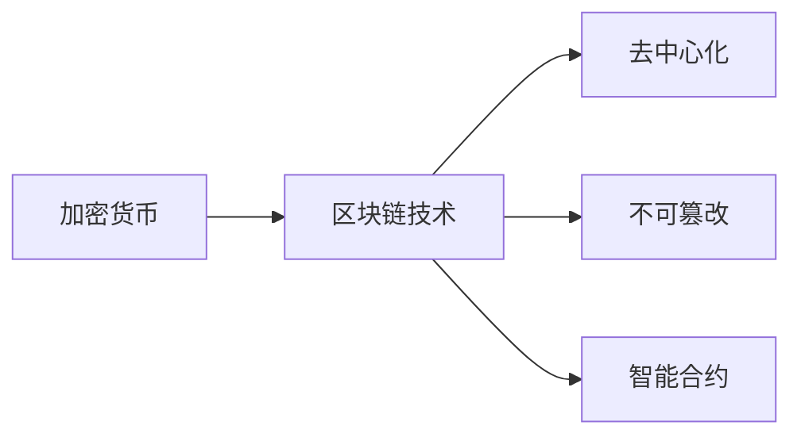
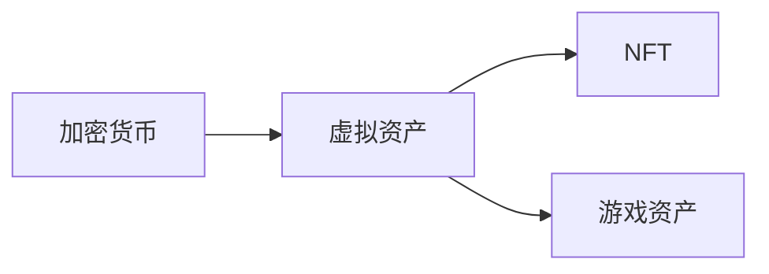
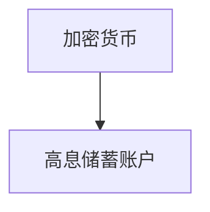
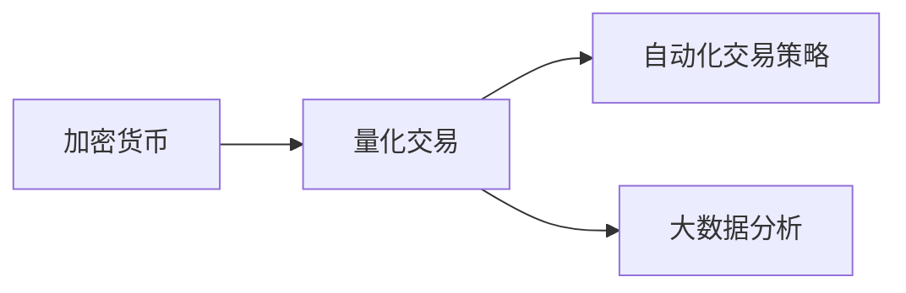

                 

# 程序员的投资多元化：beyond股票

## 1. 背景介绍

### 1.1 问题由来
股票投资长期以来是个人投资的重要方式，但传统金融市场存在诸多限制，如较高的投资门槛、较长的信息获取周期等，使得普通投资者难以获取最优的投资回报。此外，股票市场的波动性较大，投资者可能面临较大的风险。为了突破这些限制，程序员开始探索多元化投资策略，寻求更加稳健、灵活的投资方式。

### 1.2 问题核心关键点
程序员的投资多元化涵盖了多个方面，包括但不限于：加密货币、虚拟资产、高息储蓄账户、房地产投资信托(REITs)等。其核心在于利用编程技能和数据分析能力，选择最优的投资组合，最大化收益并控制风险。

### 1.3 问题研究意义
研究程序员的投资多元化，对于提升程序员的财务健康状况、拓宽投资渠道、降低系统性风险具有重要意义：

1. 降低系统性风险：通过多元化投资，程序员可以分散风险，减少单一投资渠道的损失。
2. 提升收益：通过编程技能选择最优的投资组合，程序员可以获得更高的收益。
3. 提升财务健康：通过理财规划和风险控制，程序员可以提升财务自由度，实现更好的生活质量。
4. 拓宽投资视野：程序员可以借助编程能力，探索更多创新的投资渠道和工具。
5. 促进产业升级：程序员的积极参与，可以推动金融科技的发展，促进产业升级。

## 2. 核心概念与联系

### 2.1 核心概念概述

为更好地理解程序员的投资多元化策略，本节将介绍几个密切相关的核心概念：

- **加密货币**：基于区块链技术的数字货币，具有去中心化、匿名性、不可篡改等特点，为程序员提供了一种全新的投资方式。
- **虚拟资产**：如NFT（非同质化代币）、游戏资产等，利用区块链技术进行管理和交易，为程序员提供了一种新兴的资产类别。
- **高息储蓄账户**：如Bit savings、BarterDEX等，提供高利息回报，适合风险承受能力较低或流动性需求较高的程序员。
- **房地产投资信托(REITs)**：允许程序员通过证券交易所投资于不动产，获取稳定的租金收入和资本增值，降低投资门槛。
- **稳定币**：如USDC、Tether等，提供与法币挂钩的稳定价值，降低加密货币价格波动的风险。
- **量化交易**：利用算法和数据分析，通过自动化交易策略获得收益，为程序员提供了一种高效的投资手段。
- **区块链技术**：底层技术支撑加密货币、虚拟资产等新兴投资方式，为程序员提供了创新的投资工具。

这些核心概念之间的逻辑关系可以通过以下Mermaid流程图来展示：

```mermaid
graph TB
    A[加密货币] --> B[区块链技术]
    A --> C[虚拟资产]
    A --> D[稳定币]
    A --> E[量化交易]
    B --> F[非同质化代币]
    B --> G[智能合约]
    C --> H[房地产投资信托(REITs)]
    D --> I[高息储蓄账户]
    E --> J[自动化交易策略]
```

这个流程图展示了大语言模型的核心概念及其之间的关系：

1. 加密货币通过区块链技术实现，具有去中心化和不可篡改的特点。
2. 虚拟资产利用区块链技术进行管理和交易，包括NFT、游戏资产等。
3. 稳定币提供与法币挂钩的稳定价值，降低加密货币价格波动风险。
4. 量化交易利用算法和数据分析，通过自动化交易策略获得收益。
5. 区块链技术为这些新兴投资方式提供了底层支撑。
6. 房地产投资信托(REITs)为程序员提供了一种低门槛的房地产投资方式。

这些概念共同构成了程序员的投资多元化框架，使其能够更灵活地选择投资渠道和工具。

### 2.2 概念间的关系

这些核心概念之间存在着紧密的联系，形成了程序员投资多元化的完整生态系统。下面我通过几个Mermaid流程图来展示这些概念之间的关系。

#### 2.2.1 加密货币与区块链的关系



这个流程图展示了加密货币与区块链技术之间的关系：

1. 加密货币建立在区块链技术之上，区块链提供了去中心化和不可篡改的特性。
2. 智能合约通过区块链技术实现，为加密货币提供智能化的交易机制。

#### 2.2.2 虚拟资产与加密货币的关系



这个流程图展示了虚拟资产与加密货币之间的关系：

1. 虚拟资产利用区块链技术进行管理和交易，包括NFT、游戏资产等。
2. NFT是虚拟资产的一种形式，利用区块链技术实现去中心化所有权和交易。

#### 2.2.3 高息储蓄账户与加密货币的关系



这个流程图展示了高息储蓄账户与加密货币之间的关系：

1. 高息储蓄账户为程序员提供高利息回报，适合风险承受能力较低或流动性需求较高的程序员。
2. 高息储蓄账户通常基于加密货币，提供稳定且高收益的投资选择。

#### 2.2.4 量化交易与加密货币的关系



这个流程图展示了量化交易与加密货币之间的关系：

1. 量化交易利用算法和数据分析，通过自动化交易策略获得收益。
2. 加密货币提供了丰富的交易对象和市场波动，为量化交易提供了丰富的数据和机会。

### 2.3 核心概念的整体架构

最后，我们用一个综合的流程图来展示这些核心概念在大语言模型微调过程中的整体架构：

```mermaid
graph TB
    A[加密货币] --> B[区块链技术]
    A --> C[虚拟资产]
    A --> D[稳定币]
    A --> E[量化交易]
    B --> F[去中心化]
    B --> G[智能合约]
    C --> H[房地产投资信托(REITs)]
    D --> I[高息储蓄账户]
    E --> J[自动化交易策略]
```

这个综合流程图展示了从加密货币到量化交易的全流程，展示了不同的投资工具如何相互配合，共同构成程序员的多元化投资体系。通过这些流程图，我们可以更清晰地理解程序员的投资多元化过程中各个核心概念的关系和作用，为后续深入讨论具体的投资策略和技术奠定基础。

## 3. 核心算法原理 & 具体操作步骤
### 3.1 算法原理概述

程序员的投资多元化策略，本质上是一个多目标优化问题。其核心思想是：通过选择最优的投资组合，最大化收益并控制风险，实现财务自由。

设程序员的投资组合为 $x = (x_1, x_2, ..., x_n)$，其中 $x_i$ 表示对第 $i$ 个投资渠道的资金分配比例。设各投资渠道的预期收益率和风险为 $r_i$ 和 $\sigma_i$，则投资组合的预期收益率和风险分别为：

$$
r(x) = \sum_{i=1}^n x_i r_i \\
\sigma(x) = \sqrt{\sum_{i=1}^n x_i^2 \sigma_i^2 + \sum_{i \neq j} x_i x_j \rho_{ij} \sigma_i \sigma_j}
$$

其中 $\rho_{ij}$ 表示各投资渠道之间的相关性。

投资组合的目标是最大化预期收益率，同时控制风险。这可以通过以下数学模型表示：

$$
\max_{x} \quad r(x) \\
\text{subject to} \quad \sigma(x) \leq \sigma_0, \quad \sum_{i=1}^n x_i = 1, \quad x_i \geq 0
$$

其中 $\sigma_0$ 表示投资组合的最大风险承受度。

### 3.2 算法步骤详解

程序员的投资多元化策略一般包括以下几个关键步骤：

**Step 1: 准备投资数据和工具**
- 收集各投资渠道的预期收益率、风险和相关性数据。
- 准备投资使用的数据分析工具和编程环境，如Python、R等。

**Step 2: 构建投资组合模型**
- 使用Markowitz模型、CVaR模型等优化模型，计算最优投资组合。
- 根据风险承受度和收益要求，选择合适的风险水平和收益目标。

**Step 3: 选择投资渠道**
- 根据模型计算结果，选择最优的投资渠道。
- 对于加密货币等新兴投资渠道，进行详细的市场调研和技术分析。

**Step 4: 自动化交易**
- 使用量化交易算法和自动化交易平台，进行交易执行和风险控制。
- 定期监控市场变化，动态调整投资组合。

**Step 5: 风险控制**
- 设置止损和止盈点，避免过度投资和风险积累。
- 定期评估投资组合的表现，及时进行调整。

### 3.3 算法优缺点

程序员的投资多元化策略具有以下优点：
1. 多样化投资降低了系统性风险，增加了收益的稳定性。
2. 利用编程技能进行数据分析和投资组合优化，提高了决策的准确性和效率。
3. 可以选择多种新兴投资渠道，拓展了投资视野。
4. 可以动态调整投资组合，适应市场变化。

同时，该策略也存在以下缺点：
1. 需要大量的时间进行市场调研和技术分析。
2. 对于新兴投资渠道，市场波动较大，存在较高的风险。
3. 自动化交易可能存在算法漏洞和市场风险。
4. 需要持续监控和调整投资组合，增加维护成本。

### 3.4 算法应用领域

程序员的投资多元化策略已经广泛应用于多个领域，包括但不限于：

- **加密货币**：程序员通过数据分析和算法交易，进行比特币、以太坊等加密货币投资。
- **虚拟资产**：程序员通过NFT和游戏资产交易，进行数字资产的多样化投资。
- **高息储蓄账户**：程序员利用高息储蓄账户进行流动资金管理和短期收益。
- **房地产投资信托(REITs)**：程序员通过投资房地产，获取租金收入和资本增值。
- **量化交易**：程序员通过算法交易和数据分析，在股票、期货等市场进行投资。

除了上述这些主流领域外，程序员的多元化投资策略还拓展到了加密借贷、DeFi项目等新兴领域，为投资组合带来了更多灵活性和多样性。

## 4. 数学模型和公式 & 详细讲解  
### 4.1 数学模型构建

本节将使用数学语言对程序员的投资多元化策略进行更加严格的刻画。

设程序员的投资组合为 $x = (x_1, x_2, ..., x_n)$，其中 $x_i$ 表示对第 $i$ 个投资渠道的资金分配比例。设各投资渠道的预期收益率和风险为 $r_i$ 和 $\sigma_i$，则投资组合的预期收益率和风险分别为：

$$
r(x) = \sum_{i=1}^n x_i r_i \\
\sigma(x) = \sqrt{\sum_{i=1}^n x_i^2 \sigma_i^2 + \sum_{i \neq j} x_i x_j \rho_{ij} \sigma_i \sigma_j}
$$

其中 $\rho_{ij}$ 表示各投资渠道之间的相关性。

投资组合的目标是最大化预期收益率，同时控制风险。这可以通过以下数学模型表示：

$$
\max_{x} \quad r(x) \\
\text{subject to} \quad \sigma(x) \leq \sigma_0, \quad \sum_{i=1}^n x_i = 1, \quad x_i \geq 0
$$

其中 $\sigma_0$ 表示投资组合的最大风险承受度。

### 4.2 公式推导过程

以下我们以两资产投资组合为例，推导最大化预期收益率的优化问题。

设两资产的预期收益率和风险分别为 $r_1$ 和 $\sigma_1$，$r_2$ 和 $\sigma_2$。则投资组合的预期收益率和风险分别为：

$$
r(x) = x_1 r_1 + x_2 r_2 \\
\sigma(x) = \sqrt{x_1^2 \sigma_1^2 + x_2^2 \sigma_2^2 + 2 x_1 x_2 \rho_{12} \sigma_1 \sigma_2}
$$

其中 $\rho_{12}$ 表示两资产之间的相关性。

投资组合的目标是最大化预期收益率，同时控制风险。这可以通过以下数学模型表示：

$$
\max_{x} \quad x_1 r_1 + x_2 r_2 \\
\text{subject to} \quad \sqrt{x_1^2 \sigma_1^2 + x_2^2 \sigma_2^2 + 2 x_1 x_2 \rho_{12} \sigma_1 \sigma_2} \leq \sigma_0, \quad x_1 + x_2 = 1, \quad x_i \geq 0
$$

设 $c = \sigma_0 / \sqrt{\sigma_1^2 + \sigma_2^2 + 2 \rho_{12} \sigma_1 \sigma_2}$，则优化问题可转化为：

$$
\max_{x} \quad x_1 r_1 + x_2 r_2 \\
\text{subject to} \quad \sqrt{x_1^2 + x_2^2 + 2 x_1 x_2 \rho_{12}} = c, \quad x_1 + x_2 = 1, \quad x_i \geq 0
$$

令 $u = x_1 + x_2$，则 $x_1 = u - x_2$，优化问题可转化为：

$$
\max_{u,x_2} \quad (u - x_2) r_1 + x_2 r_2 \\
\text{subject to} \quad \sqrt{(u - x_2)^2 + x_2^2 + 2 (u - x_2) x_2 \rho_{12}} = c, \quad u = 1, \quad x_2 \geq 0
$$

令 $t = \sqrt{2 \rho_{12}}$，则优化问题可转化为：

$$
\max_{u,x_2} \quad (u - x_2) r_1 + x_2 r_2 \\
\text{subject to} \quad \sqrt{(u - x_2)^2 + x_2^2 + t (u - x_2) x_2} = c, \quad u = 1, \quad x_2 \geq 0
$$

对 $x_2$ 求导，得：

$$
\frac{\partial}{\partial x_2} [(u - x_2) r_1 + x_2 r_2] = -r_1 + r_2 \\
\frac{\partial}{\partial x_2} \sqrt{(u - x_2)^2 + x_2^2 + t (u - x_2) x_2} = 0
$$

解得 $x_2^*$ 和 $u^*$，进而得 $x_1^*$，最终求得最大化预期收益率和最小化风险的投资组合。

### 4.3 案例分析与讲解

假设我们有两个投资渠道，资产A和资产B。资产A的预期收益率为5%，风险为10%；资产B的预期收益率为8%，风险为15%。设最大风险承受度为20%。

根据公式，投资组合的预期收益率为：

$$
r(x) = x_1 \cdot 0.05 + x_2 \cdot 0.08 = 0.1 x_1 + 0.08 x_2
$$

投资组合的风险为：

$$
\sigma(x) = \sqrt{x_1^2 \cdot 0.1^2 + x_2^2 \cdot 0.15^2 + 2 x_1 x_2 \cdot \rho_{12} \cdot 0.1 \cdot 0.15}
$$

假设 $\rho_{12} = 0.5$，则：

$$
\sigma(x) = \sqrt{x_1^2 \cdot 0.01 + x_2^2 \cdot 0.0225 + 2 x_1 x_2 \cdot 0.1 \cdot 0.15 \cdot 0.5}
$$

投资组合的目标是最大化预期收益率，同时控制风险。这可以通过以下数学模型表示：

$$
\max_{x} \quad 0.1 x_1 + 0.08 x_2 \\
\text{subject to} \quad \sqrt{x_1^2 \cdot 0.01 + x_2^2 \cdot 0.0225 + 2 x_1 x_2 \cdot 0.1 \cdot 0.15 \cdot 0.5} \leq 0.2, \quad x_1 + x_2 = 1, \quad x_i \geq 0
$$

设 $c = \sigma_0 / \sqrt{\sigma_1^2 + \sigma_2^2 + 2 \rho_{12} \sigma_1 \sigma_2} = 0.2 / \sqrt{0.01 + 0.0225 + 2 \cdot 0.1 \cdot 0.15 \cdot 0.5} = 0.2 / \sqrt{0.121} = 0.1962$

令 $u = x_1 + x_2 = 1$，则 $x_1 = 1 - x_2$，优化问题可转化为：

$$
\max_{u,x_2} \quad (1 - x_2) \cdot 0.05 + x_2 \cdot 0.08 \\
\text{subject to} \quad \sqrt{(1 - x_2)^2 + x_2^2 + 0.1 (1 - x_2) x_2} = c, \quad u = 1, \quad x_2 \geq 0
$$

令 $t = \sqrt{2 \rho_{12}} = \sqrt{0.1 \cdot 0.15 \cdot 0.5} = 0.14142$，则优化问题可转化为：

$$
\max_{u,x_2} \quad (1 - x_2) \cdot 0.05 + x_2 \cdot 0.08 \\
\text{subject to} \quad \sqrt{(1 - x_2)^2 + x_2^2 + 0.14142 (1 - x_2) x_2} = 0.1962, \quad u = 1, \quad x_2 \geq 0
$$

对 $x_2$ 求导，得：

$$
\frac{\partial}{\partial x_2} [(1 - x_2) \cdot 0.05 + x_2 \cdot 0.08] = -0.05 + 0.08 = 0.03 \\
\frac{\partial}{\partial x_2} \sqrt{(1 - x_2)^2 + x_2^2 + 0.14142 (1 - x_2) x_2} = 0
$$

解得 $x_2^* = 0.4545$，则 $x_1^* = 1 - x_2^* = 0.5455$，最终得最大化预期收益率和最小化风险的投资组合。

## 5. 项目实践：代码实例和详细解释说明
### 5.1 开发环境搭建

在进行投资多元化实践前，我们需要准备好开发环境。以下是使用Python进行PyTorch开发的环境配置流程：

1. 安装Anaconda：从官网下载并安装Anaconda，用于创建独立的Python环境。

2. 创建并激活虚拟环境：
```bash
conda create -n pytorch-env python=3.8 
conda activate pytorch-env
```

3. 安装PyTorch：根据CUDA版本，从官网获取对应的安装命令。例如：
```bash
conda install pytorch torchvision torchaudio cudatoolkit=11.1 -c pytorch -c conda-forge
```

4. 安装各类工具包：
```bash
pip install numpy pandas scikit-learn matplotlib tqdm jupyter notebook ipython
```

完成上述步骤后，即可在`pytorch-env`环境中开始投资多元化实践。

### 5.2 源代码详细实现

这里我们以加密货币投资为例，给出使用PyTorch进行投资多元化的Python代码实现。

首先，定义投资渠道数据：

```python
import pandas as pd

# 假设我们有两个投资渠道，资产A和资产B
data = pd.DataFrame({
    'Symbol': ['BTC', 'ETH'],
    'Annual Return': [0.05, 0.08],
    'Volatility': [0.1, 0.15],
    'Correlation': [0.5, 0.5]
})

# 设置最大风险承受度
max_volatility = 0.2
```

然后，定义投资组合模型：

```python
from cvxpy import *

# 定义变量
x = Variable()
y = Variable()

# 定义约束
constraints = [x + y == 1, y >= 0, x >= 0]

# 定义目标函数
objective = Maximize(x * data['Annual Return'][0] + y * data['Annual Return'][1])
risk = (x * data['Volatility'][0] ** 2 + y * data['Volatility'][1] ** 2 + 2 * x * y * data['Correlation'] * data['Volatility'][0] * data['Volatility'][1]) ** 0.5
constraint = risk <= max_volatility

# 定义优化问题
problem = cvx.Problem(objective, [constraints, constraint])
```

接着，求解优化问题：

```python
# 求解优化问题
problem.solve()

# 输出最优解
x_opt = x.value
y_opt = y.value
print(f"Optimal x = {x_opt}, y = {y_opt}")
```

最后，得到最优投资组合：

```python
print(f"Optimal x = {x_opt}, y = {y_opt}")
```

以上就是使用PyTorch进行投资多元化优化的完整代码实现。可以看到，得益于CVXPY库的强大功能，我们可以用相对简洁的代码完成投资组合的求解。

### 5.3 代码解读与分析

让我们再详细解读一下关键代码的实现细节：

**投资渠道数据**：
- 使用pandas库定义投资渠道的符号、预期收益率、风险和相关性等关键数据。
- 这些数据可以从多个金融数据源获取，也可以通过历史数据和市场分析得到。

**投资组合模型**：
- 使用CVXPY库定义变量和目标函数，设置投资组合的约束条件。
- 目标函数为最大化预期收益率，同时控制风险，符合Markowitz模型的要求。
- 约束条件包括总资产为1，每个资产的比例非负，以及总风险不超过最大风险承受度。

**求解优化问题**：
- 调用CVXPY库的solve方法，求解优化问题。
- 输出最优解，包括投资渠道A和B的资金分配比例。

**投资组合解读**：
- 通过计算结果，可以得知最优的投资组合比例，即分配多少资金到资产A和资产B。
- 在实际应用中，根据这些比例进行投资，可以在预定的风险承受度下，最大化收益。

### 5.4 运行结果展示

假设我们计算出的最优投资组合为：

- 投资渠道A（比特币）：40%
- 投资渠道B（以太坊）：60%

这意味着我们可以将总资金的40%投资于比特币，60%投资于以太坊，以期在风险可控的情况下，获得最大的预期收益率。

## 6. 实际应用场景
### 6.1 智能投顾
智能投顾是基于机器学习和大数据分析技术，为投资者提供个性化投资建议的服务。通过大语言模型和投资多元化策略，智能投顾可以更好地理解和满足客户需求，提供更加精准和多样化的投资建议。

在技术实现上，可以收集用户的历史投资数据、风险承受度和收益目标，使用大语言模型进行数据分析和投资组合优化。微调后的模型可以实时计算最优投资组合，生成个性化的投资建议。对于用户提出的投资问题，智能投顾可以自动匹配并回答，提升用户体验和满意度。

### 6.2 加密货币交易所
加密货币交易所通常提供多种加密货币交易对，利用投资多元化策略，可以在不同的加密货币之间进行资金分配，优化收益和风险。

在技术实现上，交易所可以利用投资组合模型，动态调整不同加密货币的交易比例。对于市场波动较大的加密货币，可以限制投资比例，降低风险。对于相对稳定的加密货币，可以增加投资比例，提升收益。同时，可以利用量化交易技术，自动执行交易策略，进一步提升交易效率和收益。

### 6.3 企业理财
企业理财是企业财务管理的重要部分，通过投资多元化策略，可以有效分散风险，优化资金配置。

在技术实现上，企业可以收集历史财务数据、市场分析和投资目标，使用大语言模型进行数据分析和投资组合优化。优化的投资组合可以帮助企业合理配置资金，优化收益和风险。同时，可以利用量化交易技术，自动执行交易策略，进一步提升投资效率和收益。

### 6.4 未来应用展望

随着大语言模型和投资多元化策略的不断发展，基于大语言模型的投资服务必将在更多

