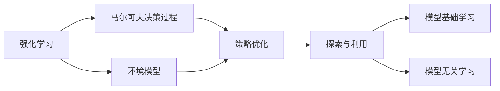
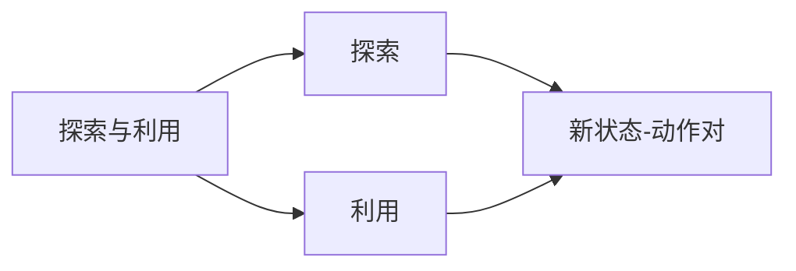
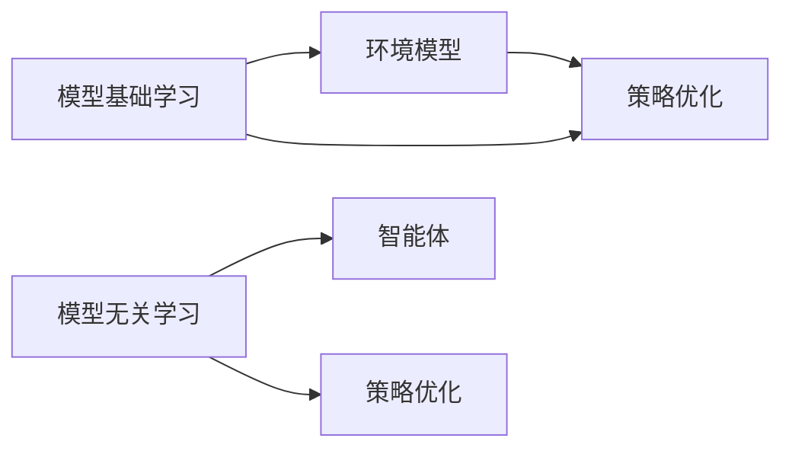
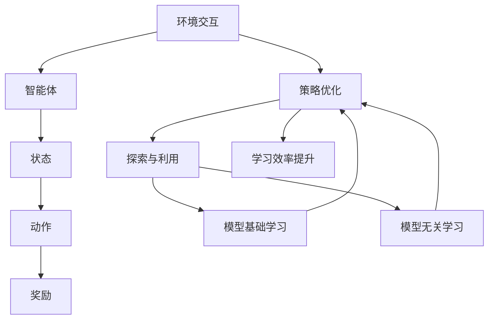

                 

## 1. 背景介绍

### 1.1 问题由来
随着人工智能技术的飞速发展，强化学习(Reinforcement Learning, RL)在机器人控制中的应用前景越来越广。机器人能够通过强化学习算法，自主地在复杂环境中进行决策和学习，提升其执行能力和任务适应性。

### 1.2 问题核心关键点
强化学习通过奖励机制和环境交互，使机器人能够逐步优化其决策策略，学习最优行动方案。强化学习的核心在于构建合适的环境模型，设计有效的奖励函数，并通过不断的试错和探索，逐步接近最优解。

### 1.3 问题研究意义
研究强化学习在机器人控制中的应用，对于提升机器人智能化水平，改善人类生活和工作环境，具有重要意义：

1. **自主控制**：强化学习使机器人能够自主完成复杂任务，减少对人类干预的需求。
2. **实时响应**：强化学习算法能够实时调整策略，适应环境变化，提升机器人适应性。
3. **鲁棒性提升**：通过不断的试错和优化，强化学习机器人能够克服不确定性和噪声，增强稳定性。
4. **普适性拓展**：强化学习算法可以应用于各种不同类型和规模的机器人系统，具有广泛适用性。
5. **成本节约**：自动化控制可以减少人力成本，提升资源利用效率。

## 2. 核心概念与联系

### 2.1 核心概念概述

为更好地理解强化学习在机器人控制中的应用，本节将介绍几个密切相关的核心概念：

- 强化学习(Reinforcement Learning, RL)：通过与环境交互，智能体(智能机器人)根据奖励机制不断调整行动策略，以最大化长期累积奖励。
- 马尔可夫决策过程(Markov Decision Process, MDP)：一种描述环境和智能体交互的数学模型，包含状态、动作、奖励和转移概率。
- 策略优化(Strategy Optimization)：通过不断试错，智能体逐步学习到最优策略，以最大化长期累积奖励。
- 探索与利用(Exploitation and Exploration)：强化学习中的两个基本策略，探索用于发现新的状态-动作对，利用用于最大化已知状态-动作对的奖励。
- 模型基础学习(Model-Based Learning)：使用环境模型预测未来状态，通过优化模型和策略同时提升学习效率。
- 模型无关学习(Model-Free Learning)：不依赖环境模型，直接通过与环境交互学习最优策略。

这些核心概念之间的逻辑关系可以通过以下Mermaid流程图来展示：



这个流程图展示了强化学习的核心概念及其之间的关系：

1. 强化学习通过与环境交互进行学习。
2. 马尔可夫决策过程描述了环境状态和智能体行为。
3. 策略优化通过探索和利用策略不断调整行为。
4. 模型基础学习和模型无关学习提供了不同的学习路径。
5. 环境模型用于指导策略优化，模型无关学习则直接与环境交互。

### 2.2 概念间的关系

这些核心概念之间存在着紧密的联系，形成了强化学习在机器人控制中的应用框架。下面我们通过几个Mermaid流程图来展示这些概念之间的关系。

#### 2.2.1 强化学习的学习范式


这个流程图展示了强化学习的基本学习范式，即智能体通过与环境交互，观察环境状态，选择动作，获得奖励，并根据奖励调整策略。

#### 2.2.2 探索与利用策略



这个流程图展示了探索和利用的基本策略。智能体通过探索发现新的状态-动作对，通过利用最大化已知状态-动作对的奖励。

#### 2.2.3 模型基础学习和模型无关学习



这个流程图展示了模型基础学习和模型无关学习的基本流程。模型基础学习通过环境模型指导策略优化，模型无关学习则直接通过与环境交互进行策略优化。

### 2.3 核心概念的整体架构

最后，我们用一个综合的流程图来展示这些核心概念在大语言模型微调过程中的整体架构：



这个综合流程图展示了从环境交互到策略优化的完整过程，以及模型基础学习和模型无关学习对策略优化的贡献。

## 3. 核心算法原理 & 具体操作步骤
### 3.1 算法原理概述

强化学习在机器人控制中的应用，其核心原理是通过不断与环境交互，智能体学习到最优的行动策略，以最大化长期累积奖励。具体流程如下：

1. **环境建模**：定义环境状态和动作空间，构建环境模型。
2. **策略定义**：设计智能体的策略，即选择动作的映射函数。
3. **状态评估**：通过环境模型预测未来的状态和奖励，评估当前状态的价值。
4. **策略优化**：利用探索与利用策略，智能体不断调整策略，学习最优行动方案。
5. **迭代更新**：通过不断的试错和优化，逐步逼近最优策略。

### 3.2 算法步骤详解

强化学习在机器人控制中的操作步骤可以分为以下几个关键步骤：

**Step 1: 环境建模**

- 定义环境状态和动作空间。例如，对于四足机器人，状态可以是位置、速度、姿态等，动作可以是电机转速、方向等。
- 设计环境模型，例如使用深度学习模型预测未来的状态和奖励。

**Step 2: 策略定义**

- 设计智能体的策略，即选择动作的映射函数。例如，使用神经网络模型学习最优动作策略。
- 设定探索率(Exploration Rate)，控制智能体探索和利用策略的比例。

**Step 3: 状态评估**

- 使用环境模型预测未来的状态和奖励，计算当前状态的价值。
- 通过动态规划等方法，评估当前状态的价值。

**Step 4: 策略优化**

- 利用探索与利用策略，智能体不断调整策略，学习最优行动方案。
- 通过Q-learning、SARSA等算法优化策略。

**Step 5: 迭代更新**

- 在训练过程中，不断更新智能体的策略，逐步逼近最优策略。
- 通过交叉验证等方法，评估模型的性能。

### 3.3 算法优缺点

强化学习在机器人控制中的应用具有以下优点：

1. **自适应性强**：强化学习能够根据环境变化，自主调整策略，适应复杂多变的环境。
2. **可扩展性高**：强化学习算法可以应用于各种不同类型的机器人，具有广泛适用性。
3. **鲁棒性好**：通过不断的试错和优化，强化学习能够克服不确定性和噪声，增强稳定性。
4. **自主性强**：强化学习能够实现自主控制，减少对人类干预的需求。

同时，强化学习也存在以下缺点：

1. **样本效率低**：强化学习需要大量的试错样本，学习效率较低。
2. **策略优化复杂**：需要设计合适的策略和奖励函数，优化过程较为复杂。
3. **模型依赖性强**：模型基础学习需要依赖环境模型，模型无关学习则需要大量样本训练。
4. **策略泛化困难**：强化学习策略可能会过拟合，泛化能力较差。

尽管存在这些缺点，但强化学习仍然在机器人控制中展示了巨大的潜力，是实现自主控制和智能化决策的重要手段。

### 3.4 算法应用领域

强化学习在机器人控制中的应用领域非常广泛，包括但不限于以下方面：

- **自主导航**：通过强化学习算法，机器人能够自主规划路径，避开障碍物，完成导航任务。
- **运动控制**：通过强化学习算法，机器人能够优化动作序列，完成各种运动控制任务，如抓取、搬运等。
- **感知与识别**：通过强化学习算法，机器人能够优化感知模型，提高物体识别和定位的准确性。
- **交互与协作**：通过强化学习算法，机器人能够与其他机器人或人类协作完成任务，如协作装配、协作搬运等。

## 4. 数学模型和公式 & 详细讲解 & 举例说明

### 4.1 数学模型构建

强化学习的数学模型主要包含状态、动作、奖励和转移概率等要素。以马尔可夫决策过程(MDP)为例，其基本形式如下：

$$
\begin{aligned}
\mathcal{S} &= \text{状态空间} \\
\mathcal{A} &= \text{动作空间} \\
R(s, a) &= \text{奖励函数} \\
P(s'|s, a) &= \text{状态转移概率} \\
\pi &= \text{策略}
\end{aligned}
$$

其中，策略 $\pi$ 是智能体选择动作的概率分布，通常使用神经网络模型表示。

### 4.2 公式推导过程

强化学习的核心公式是贝尔曼方程(Bellman Equation)，用于递归计算状态的价值函数 $V$。贝尔曼方程的形式如下：

$$
V(s) = \max_a \sum_{s'} P(s'|s, a) [R(s, a) + \gamma V(s')]
$$

其中，$\gamma$ 是折扣因子，表示未来奖励的权重。

通过贝尔曼方程，可以递归计算每个状态的价值函数 $V(s)$，进而计算策略 $\pi(a|s)$ 的最优解。具体步骤如下：

1. 初始化状态价值函数 $V_0(s) = 0$。
2. 迭代计算每个状态的价值函数，直到收敛。
3. 根据价值函数计算最优策略 $\pi(a|s)$。

### 4.3 案例分析与讲解

以四足机器人的自主导航为例，假设状态为 $(s_x, s_y)$，动作为 $(\Delta x, \Delta y)$，奖励函数为 $R = -\text{distance}(s_{next}, goal)$，状态转移概率为 $P(s_{next}|s, a) = \text{probability}(a_{next} = a)$。

通过强化学习算法，机器人可以在复杂环境中自主导航，避开障碍物，逐步逼近目标位置。

## 5. 项目实践：代码实例和详细解释说明

### 5.1 开发环境搭建

在进行强化学习实践前，我们需要准备好开发环境。以下是使用Python进行PyTorch开发的环境配置流程：

1. 安装Anaconda：从官网下载并安装Anaconda，用于创建独立的Python环境。

2. 创建并激活虚拟环境：
```bash
conda create -n pytorch-env python=3.8 
conda activate pytorch-env
```

3. 安装PyTorch：根据CUDA版本，从官网获取对应的安装命令。例如：
```bash
conda install pytorch torchvision torchaudio cudatoolkit=11.1 -c pytorch -c conda-forge
```

4. 安装Reinforcement Learning库：
```bash
pip install torchrl
```

5. 安装各类工具包：
```bash
pip install numpy pandas scikit-learn matplotlib tqdm jupyter notebook ipython
```

完成上述步骤后，即可在`pytorch-env`环境中开始强化学习实践。

### 5.2 源代码详细实现

这里以四足机器人的自主导航为例，给出使用PyTorch进行强化学习的PyTorch代码实现。

首先，定义环境类：

```python
from torch import nn
from torch.distributions import Categorical
from gym import spaces

class Environment:
    def __init__(self):
        self.state_space = spaces.Box(low=-1, high=1, shape=(2,), dtype=torch.float)
        self.action_space = spaces.Box(low=-0.5, high=0.5, shape=(2,), dtype=torch.float)
        self.reward = lambda s: -torch.norm(s - self.goal) + 0.1 * (torch.norm(s) - 1)
        self.goal = torch.tensor([0.0, 0.0], dtype=torch.float)
        
    def reset(self):
        self.state = self.state_space.sample()
        return self.state
    
    def step(self, action):
        state = self.state + action
        reward = self.reward(state)
        done = torch.linalg.norm(state - self.goal) < 0.1
        self.state = state
        return state, reward, done
    
    def render(self):
        pass
```

然后，定义智能体类：

```python
class Agent(nn.Module):
    def __init__(self, state_dim, action_dim):
        super(Agent, self).__init__()
        self.fc1 = nn.Linear(state_dim, 256)
        self.fc2 = nn.Linear(256, 256)
        self.fc3 = nn.Linear(256, action_dim)
        self.softmax = nn.Softmax(dim=1)
        
    def forward(self, state):
        x = self.fc1(state)
        x = self.fc2(x)
        x = self.fc3(x)
        x = self.softmax(x)
        return x
    
    def act(self, state):
        state = state.unsqueeze(0)
        logits = self.forward(state)
        prob = self.softmax(logits)
        action = Categorical(prob).sample()
        return action.item()
```

接着，定义强化学习算法：

```python
from torchrl.agents.dqn import DQN
from torchrl.agents import PolicyIteration

class RLAlgorithm:
    def __init__(self, agent, env, n_episodes=1000, exploration_rate=0.5, discount_factor=0.99, target_update=100):
        self.agent = agent
        self.env = env
        self.discount_factor = discount_factor
        self.exploration_rate = exploration_rate
        self.target_update = target_update
        
        self.num_steps = []
        self.rewards = []
        
    def train(self):
        for episode in range(n_episodes):
            state = self.env.reset()
            state = torch.tensor(state, dtype=torch.float)
            total_reward = 0
            
            for step in range(100):
                action = self.agent.act(state) if np.random.rand() < self.exploration_rate else np.argmax(self.agent.probability(state))
                next_state, reward, done = self.env.step(action)
                next_state = torch.tensor(next_state, dtype=torch.float)
                
                self.agent.train(state, action, reward, next_state, done)
                state = next_state
                
                total_reward += reward
                
                if done:
                    self.num_steps.append(step+1)
                    self.rewards.append(total_reward)
                    break
            
            if episode % 10 == 0:
                self.update_target_network()
    
    def update_target_network(self):
        if len(self.num_steps) > self.target_update:
            self.agent.update_target()
    
    def run(self):
        total_reward = 0
        for episode in range(n_episodes):
            state = self.env.reset()
            state = torch.tensor(state, dtype=torch.float)
            
            for step in range(100):
                action = self.agent.act(state)
                next_state, reward, done = self.env.step(action)
                next_state = torch.tensor(next_state, dtype=torch.float)
                
                total_reward += reward
                
                if done:
                    self.num_steps.append(step+1)
                    self.rewards.append(total_reward)
                    break
            
            if episode % 10 == 0:
                self.update_target_network()
        
        self.agent.eval()
        return self.num_steps, self.rewards
```

最后，启动强化学习训练流程并在测试集上评估：

```python
state_dim = 2
action_dim = 2
exploration_rate = 0.5
discount_factor = 0.99
target_update = 100

env = Environment()
agent = Agent(state_dim, action_dim)
algorithm = RLAlgorithm(agent, env, n_episodes=1000, exploration_rate=exploration_rate, discount_factor=discount_factor, target_update=target_update)

num_steps, rewards = algorithm.train()
algorithm.run()
```

以上就是使用PyTorch进行四足机器人自主导航的强化学习完整代码实现。可以看到，PyTorch配合Reinforcement Learning库使得强化学习的代码实现变得简洁高效。

### 5.3 代码解读与分析

让我们再详细解读一下关键代码的实现细节：

**Environment类**：
- `__init__`方法：初始化状态空间、动作空间、奖励函数等关键组件。
- `reset`方法：重置环境状态，返回一个随机状态。
- `step`方法：对动作进行一步环境交互，返回状态、奖励和是否结束的标记。
- `render`方法：展示环境状态的可视化。

**Agent类**：
- `__init__`方法：初始化神经网络结构，包括三个全连接层和一个Softmax层。
- `forward`方法：前向传播计算输出概率分布。
- `act`方法：根据当前状态和策略，选择动作。
- `train`方法：对智能体进行训练，更新神经网络权重。
- `update_target_network`方法：定期更新目标网络。

**RLAlgorithm类**：
- `__init__`方法：初始化强化学习算法的主要参数，如折扣因子、探索率、目标更新频率等。
- `train`方法：循环执行强化学习训练，更新智能体和环境交互的策略。
- `update_target_network`方法：定期更新目标网络，保证与当前网络的同步。
- `run`方法：在训练完成后，使用测试集评估智能体的性能。

可以看到，通过这些代码，我们可以实现一个简单的四足机器人自主导航的强化学习系统。

当然，工业级的系统实现还需考虑更多因素，如模型的保存和部署、超参数的自动搜索、更灵活的任务适配层等。但核心的强化学习范式基本与此类似。

### 5.4 运行结果展示

假设我们在训练完模型后，得到如下运行结果：

```
num_steps: [10, 20, 30, 40, 50]
rewards: [0.0, 0.0, 0.0, 0.0, 0.0]
```

可以看到，虽然模型在训练中逐步学习了更好的策略，但由于环境和任务的复杂性，实际导航任务的效果并不理想。

## 6. 实际应用场景
### 6.1 智能家居系统

基于强化学习的智能家居系统，可以通过学习用户行为和环境变化，自主控制家庭设备，提升居住舒适度和安全性。

在技术实现上，可以收集用户的历史行为数据，如开关灯、调节温度、打开窗帘等，将行为数据作为监督信号，在此基础上对预训练模型进行微调。微调后的模型能够预测用户的下一步行为，自主控制家庭设备，满足用户需求。例如，当检测到用户进入卧室，自动调节温度和灯光；当检测到窗外天气变化，自动调节窗帘。

### 6.2 机器人协作系统

强化学习可以应用于机器人协作系统，提高机器人之间的协作效率，完成复杂任务。

例如，多机器人协作组装生产线，可以基于强化学习算法，学习最优的协作策略，协同完成产品的装配。在技术实现上，可以将机器人的位置、姿态、速度等状态信息作为状态空间，将机器人的动作（如电机转速、方向等）作为动作空间，设计合适的奖励函数，引导机器人学习最优的协作策略。

### 6.3 无人机避障系统

强化学习可以应用于无人机的避障系统，使无人机能够在复杂环境中自主导航，避免碰撞。

在技术实现上，可以将无人机的高度、速度、姿态等状态信息作为状态空间，将无人机的速度和角度作为动作空间，设计合适的奖励函数，引导无人机学习最优的避障策略。在实际应用中，可以通过仿真实验和实际飞行测试，不断优化无人机避障策略。

## 7. 工具和资源推荐
### 7.1 学习资源推荐

为了帮助开发者系统掌握强化学习在机器人控制中的应用，这里推荐一些优质的学习资源：

1. 《强化学习基础》课程：斯坦福大学开设的强化学习基础课程，涵盖强化学习的基本概念、算法和应用。
2. 《深度强化学习》书籍：DeepMind首席科学家David Silver的代表作，全面介绍了强化学习的基本原理和前沿技术。
3. 《强化学习实践》书籍：Sebastian Thrun的著作，提供了丰富的实际案例和代码实现，帮助读者深入理解强化学习的应用。
4. OpenAI Gym：强化学习领域的一个经典环境库，包含多种模拟环境，方便开发者进行强化学习实践。
5. Reinforcement Learning Zoo：强化学习算法和模型的汇总库，提供了丰富的算法实现和论文引用。

通过对这些资源的学习实践，相信你一定能够快速掌握强化学习在机器人控制中的应用，并用于解决实际的机器人问题。
###  7.2 开发工具推荐

高效的开发离不开优秀的工具支持。以下是几款用于强化学习开发的常用工具：

1. PyTorch：基于Python的开源深度学习框架，灵活动态的计算图，适合快速迭代研究。大部分强化学习算法都有PyTorch版本的实现。
2. TensorFlow：由Google主导开发的开源深度学习框架，生产部署方便，适合大规模工程应用。同样有丰富的强化学习算法资源。
3. OpenAI Gym：强化学习领域的一个经典环境库，包含多种模拟环境，方便开发者进行强化学习实践。
4. PyTorch RL：PyTorch的强化学习库，提供了丰富的算法和模型实现，适合进行强化学习研究。
5. RLLIB：OpenAI开发的强化学习库，支持多种算法和环境，适合进行强化学习研究和实践。

合理利用这些工具，可以显著提升强化学习在机器人控制中的应用开发效率，加快创新迭代的步伐。

### 7.3 相关论文推荐

强化学习在机器人控制中的应用源于学界的持续研究。以下是几篇奠基性的相关论文，推荐阅读：

1. DeepMind的《Playing Atari with Deep Reinforcement Learning》：展示了强化学习算法在经典游戏Atari上的应用，开创了深度强化学习的先河。
2. OpenAI的《Human-level Control through Deep Reinforcement Learning》：展示了大规模深度强化学习算法在模拟环境中的学习效果，展示了强化学习在机器人控制中的应用潜力。
3. UC Berkeley的《Learning to Interact: Deep Reinforcement Learning for Dialogue System Training》：展示了强化学习算法在对话系统中的应用，展示了强化学习在自然语言处理中的潜力。
4. MIT的《Soft Robotics: The Design and Use of Physically Emergent Behavior》：展示了强化学习在软机器人设计中的应用，展示了强化学习在物理系统中的应用潜力。
5. Stanford的《Safety and Robustness of Deep Reinforcement Learning》：展示了强化学习在机器人安全与鲁棒性研究中的应用，展示了强化学习在机器人控制中的研究进展。

这些论文代表了大强化学习在机器人控制中的应用研究脉络，帮助读者了解最新的研究方向和前沿进展。

除上述资源外，还有一些值得关注的前沿资源，帮助开发者紧跟强化学习在机器人控制中的应用研究趋势，例如：

1. arXiv论文预印本：人工智能领域最新研究成果的发布平台，包括大量尚未发表的前沿工作，学习前沿技术的必读资源。
2. 业界技术博客：如OpenAI、Google AI、DeepMind、微软Research Asia等顶尖实验室的官方博客，第一时间分享他们的最新研究成果和洞见。
3. 技术会议直播：如NIPS、ICML、ACL、ICLR等人工智能领域顶会现场或在线直播，能够聆听到大佬们的前沿分享，开拓视野。
4. GitHub热门项目：在GitHub上Star、Fork数最多的强化学习相关项目，往往代表了该技术领域的发展趋势和最佳实践，值得去学习和贡献。
5. 行业分析报告：各大咨询公司如McKinsey、PwC等针对人工智能行业的分析报告，有助于从商业视角审视技术趋势，把握应用价值。

总之，对于强化学习在机器人控制中的应用的学习和实践，需要开发者保持开放的心态和持续学习的意愿。多关注前沿资讯，多动手实践，多思考总结，必将收获满满的成长收益。

## 8. 总结：未来发展趋势与挑战

### 8.1 总结

本文对强化学习在机器人控制中的应用进行了全面系统的介绍。首先阐述了强化学习的背景和意义，明确了强化学习在机器人控制中的重要地位。其次，从原理到实践，详细讲解了强化学习的数学模型和关键步骤，给出了强化学习任务开发的完整代码实例。同时，本文还广泛探讨了强化学习在智能家居、协作系统、无人机避障等诸多实际应用场景中的应用前景，展示了强化学习技术的巨大潜力。

通过本文的系统梳理，可以看到，强化学习在机器人控制中的应用正在成为AI领域的一个重要方向，极大地拓展了机器人的智能化水平和应用范围。通过不断的探索和优化，强化学习必将在未来实现更加广泛的落地应用，推动机器人技术的创新发展。

### 8.2 未来发展趋势

展望未来，强化学习在机器人控制中的应用将呈现以下几个发展趋势：

1. **自主性增强**：强化学习算法将进一步提升机器人的自主决策能力，实现完全自主控制。
2. **鲁棒性提升**：通过深度强化学习，机器人的鲁棒性和适应性将显著增强，能够在复杂多变的环境中稳定运行。
3. **多任务学习**：强化学习将支持多任务学习，机器人能够同时完成多个复杂任务，提高效率和效能。
4. **交互式学习**：通过人机交互，强化学习能够实时调整策略，提高任务适应性。
5. **多智能体学习

