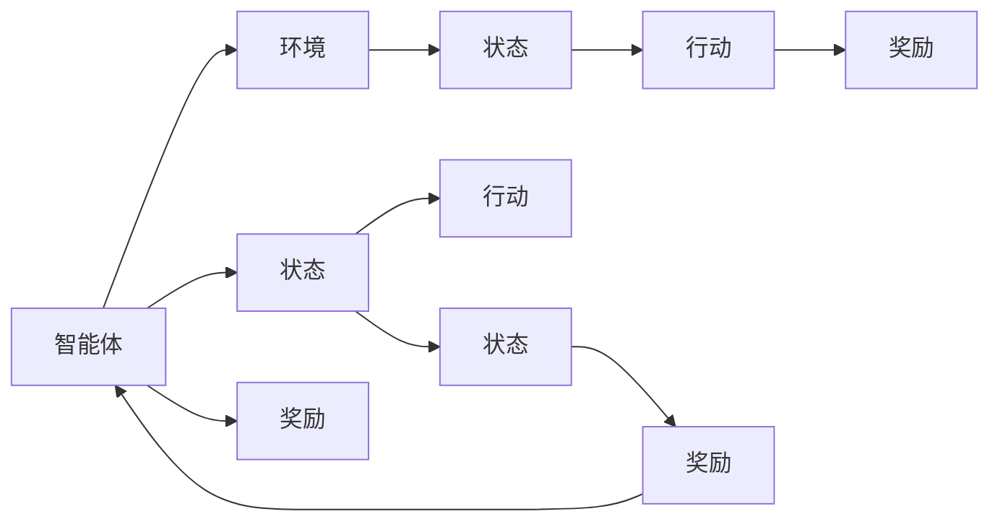

                 

# 强化学习进阶原理与代码实战案例讲解

> 关键词：强化学习,马尔科夫决策过程,深度强化学习,强化学习框架,行为生成算法,案例讲解,代码实战

## 1. 背景介绍

### 1.1 问题由来
强化学习 (Reinforcement Learning, RL) 是一种通过与环境交互，让智能体 (agent) 最大化累积奖励 (cumulative reward) 的学习方法。相较于监督学习和无监督学习，强化学习具有更加广泛的应用场景，尤其是在游戏、机器人、自适应控制等领域展现出卓越的潜力。

尽管强化学习已经取得显著成果，但仍面临一些关键挑战，如环境建模困难、学习效率低下等。因此，结合前沿研究成果和实践案例，深度剖析强化学习的原理和代码实现，并展开案例讲解，对学术界和业界人士都具有重要意义。

### 1.2 问题核心关键点
强化学习主要分为模型免费（Model-Free）和模型基于（Model-Based）两大类方法。模型免费方法直接从数据中学习行为策略，如Q-learning、SARSA等，通过累积奖励最大化，探索最优策略。模型基于方法则先建立环境的数学模型，通过求解优化问题来得到最优策略，如策略梯度、近似的动态规划等。

本文重点介绍深度强化学习（Deep Reinforcement Learning, DRL）中的模型免费方法，特别是基于神经网络的 Q-learning 和策略梯度方法。此外，通过一系列案例，对不同场景下的强化学习算法进行讲解，并展开代码实战，以帮助读者深入理解强化学习的实现过程。

### 1.3 问题研究意义
研究强化学习算法不仅有助于提升模型在智能游戏、机器人、自动驾驶等领域的决策能力，还能为多个科学问题提供新思路。深度强化学习作为强化学习的一个重要分支，通过深度学习技术与强化学习算法的结合，显著提升了模型性能，推动了强化学习在复杂场景中的应用。

通过深入理解强化学习算法，特别是深度强化学习，能更好地解决机器人和自动驾驶等领域的控制和决策问题，为智能体设计提供新的工具和视角，同时促进跨学科研究，如认知科学、经济学等。因此，本文对强化学习原理与代码实战的介绍，有助于提升业界和学术界的实践水平，加速相关领域的技术突破。

## 2. 核心概念与联系

### 2.1 核心概念概述

强化学习包含以下几个关键概念：

- **智能体 (Agent)**：智能体是强化学习中的决策者，负责在环境中采取行动。
- **环境 (Environment)**：环境是智能体执行行动后，产生状态的客观世界。
- **状态 (State)**：状态是环境的具体表现，智能体在某个时间点的状态决定了后续能采取的行动。
- **行动 (Action)**：行动是智能体对环境的干预，不同的行动会导致不同的状态转移。
- **奖励 (Reward)**：奖励是根据智能体的行动和环境状态，环境给予的反馈，用来衡量行动的好坏。
- **累积奖励 (Cumulative Reward)**：累积奖励是智能体从开始到某一时刻获得的总奖励。

这些概念通过以下 Mermaid 流程图展示它们之间的关系：



### 2.2 概念间的关系

上述概念之间存在紧密的联系，形成了强化学习的基本框架：

- 智能体通过行动和环境交互，进入下一个状态，并获得相应的奖励。
- 智能体的行动和环境状态变化，共同决定了累积奖励。
- 智能体通过累积奖励最大化，不断调整策略，以适应环境变化。

这些概念是强化学习的核心组成部分，理解它们之间的联系，有助于全面掌握强化学习的原理和实践。

## 3. 核心算法原理 & 具体操作步骤
### 3.1 算法原理概述

深度强化学习中，常用的模型免费算法包括 Q-learning、SARSA、深度 Q-learning (DQN) 和策略梯度方法等。这些方法通过神经网络参数化 Q 值函数或策略函数，提升算法在大规模状态空间中的学习能力。

以 DQN 为例，其核心思想是利用深度神经网络逼近 Q 值函数 $Q(s, a)$，该函数表示在状态 $s$ 下，执行动作 $a$ 的累积奖励期望。DQN 通过目标网络更新策略参数，实现渐进式的最优策略学习。

### 3.2 算法步骤详解

以下是 DQN 算法的详细步骤：

1. **初始化**：初始化智能体、环境、状态、行动空间和 Q 值函数。
2. **采样行动**：根据当前状态 $s_t$，利用神经网络预测 Q 值，选择行动 $a_t$。
3. **环境交互**：执行行动 $a_t$，观察环境下一状态 $s_{t+1}$ 和奖励 $r_{t+1}$。
4. **目标网络更新**：将新状态和行动带入目标网络，计算 Q 值，更新目标网络。
5. **策略更新**：根据样本回报 $G_t$，更新策略参数，以提升未来累积奖励。
6. **重复执行**：重复上述步骤，直至达到预设的迭代次数或停止条件。

### 3.3 算法优缺点

深度强化学习的优点包括：

- 能够处理高维状态和动作空间，提升在大规模问题中的学习能力。
- 通过深度神经网络逼近策略或价值函数，适应性更强。
- 在自适应控制、自动驾驶等复杂场景中表现出色。

但其缺点也较为明显：

- 学习过程复杂，参数调优难度大。
- 存在收敛性问题，难以在特定环境中稳定学习最优策略。
- 对数据的依赖性大，需要大量标注数据进行模型训练。

### 3.4 算法应用领域

深度强化学习广泛应用于游戏、机器人、自动驾驶、金融、医疗等多个领域：

- **游戏**：如 AlphaGo、AlphaZero 等，通过强化学习策略优化，实现高水平竞技。
- **机器人**：如 Boston Dynamics 的 robots，通过强化学习控制机器人行动，实现自主导航。
- **自动驾驶**：通过强化学习优化驾驶策略，提升车辆安全性与舒适性。
- **金融**：如量化交易，通过强化学习策略优化，提高投资收益。
- **医疗**：如放射诊断，通过强化学习算法优化诊断策略，提升诊断精度。

这些应用场景展示了深度强化学习的广泛适用性和强大能力，未来还有更多新领域待挖掘。

## 4. 数学模型和公式 & 详细讲解  
### 4.1 数学模型构建

在强化学习中，Q 值函数 $Q(s, a)$ 描述了在状态 $s$ 下，执行动作 $a$ 的累积奖励期望。其定义为：

$$
Q(s, a) = \mathbb{E}\left[\sum_{t=0}^{\infty} \gamma^t r_{t+1} | s_t = s, a_t = a \right]
$$

其中，$\gamma$ 为折扣因子，控制长期奖励的权重。

Q-learning 的核心方程为：

$$
Q(s_t, a_t) = Q(s_t, a_t) + \alpha \left[ r_{t+1} + \gamma \max_a Q(s_{t+1}, a) - Q(s_t, a_t) \right]
$$

其中，$\alpha$ 为学习率，$max_a Q(s_{t+1}, a)$ 表示在下一个状态 $s_{t+1}$ 下，选择最优动作的 Q 值。

### 4.2 公式推导过程

Q-learning 的推导基于动作-价值迭代（Value Iteration）的原理。通过反向传播（backward propagation）算法，可以高效计算 Q 值函数的更新规则。具体推导过程如下：

$$
Q(s_t, a_t) = Q(s_t, a_t) + \alpha \left[ r_{t+1} + \gamma \max_a Q(s_{t+1}, a) - Q(s_t, a_t) \right]
$$

上式可以进一步化简为：

$$
Q(s_t, a_t) = Q(s_t, a_t) + \alpha \left[ r_{t+1} + \gamma \max_a Q(s_{t+1}, a) \right]
$$

在神经网络中，可以通过反向传播算法，计算上述方程的梯度，从而更新参数。

### 4.3 案例分析与讲解

以打砖块游戏为例，分析 DQN 算法的实现过程。

1. **状态表示**：将游戏屏幕划分为若干个像素块，每个像素块为状态的一个维度。例如，可以将屏幕划分为 8x8 的网格，每个像素块的颜色作为状态的一个特征。

2. **动作空间**：定义智能体可能的动作，如移动、跳跃、发射子弹等。

3. **目标网络**：定义一个与策略网络结构相同的目标网络，定期更新以保持参数稳定。

4. **神经网络结构**：利用卷积神经网络（CNN）逼近 Q 值函数，提高处理高维状态的能力。

5. **训练过程**：通过与环境的交互，智能体在每个时间步执行动作，观察环境响应，计算 Q 值，并根据贝尔曼方程更新策略参数。

## 5. 项目实践：代码实例和详细解释说明
### 5.1 开发环境搭建

首先需要安装 Python、PyTorch 和 Tensorboard，以便进行深度强化学习的开发和调试。

1. 安装 Python 3.7 及以上版本。
2. 安装 PyTorch：
   ```
   pip install torch torchvision torchaudio
   ```
3. 安装 Tensorboard：
   ```
   pip install tensorboard
   ```

### 5.2 源代码详细实现

以下是 DQN 算法在打砖块游戏中的代码实现。

```python
import torch
import torch.nn as nn
import torch.optim as optim
import numpy as np
import gym

# 定义神经网络模型
class DQN(nn.Module):
    def __init__(self, input_shape, output_shape):
        super(DQN, self).__init__()
        self.fc1 = nn.Linear(input_shape[0], 64)
        self.fc2 = nn.Linear(64, 64)
        self.fc3 = nn.Linear(64, output_shape)

    def forward(self, x):
        x = F.relu(self.fc1(x))
        x = F.relu(self.fc2(x))
        return self.fc3(x)

# 定义 DQN 算法
class DQN_Agent:
    def __init__(self, state_dim, action_dim, lr=0.001, gamma=0.99):
        self.state_dim = state_dim
        self.action_dim = action_dim
        self.lr = lr
        self.gamma = gamma
        self.q = DQN(state_dim, action_dim)

    def act(self, state):
        state = torch.tensor(state).float()
        with torch.no_grad():
            return self.q(state).argmax().item()

    def learn(self, state, action, next_state, reward, done):
        state = torch.tensor(state).float()
        action = torch.tensor([action]).float()
        next_state = torch.tensor(next_state).float()
        reward = torch.tensor([reward]).float()
        done = torch.tensor([done]).float()
        target = reward + self.gamma * self.q(next_state).max().item()
        target += (1 - done) * self.q(state).detach().data.numpy()[0]
        target = torch.tensor([target]).float()

        pred = self.q(state)
        loss = F.mse_loss(pred, target)
        self.optimizer.zero_grad()
        loss.backward()
        self.optimizer.step()

# 训练环境
env = gym.make('Breakout-v4')
state_dim = env.observation_space.shape[0]
action_dim = env.action_space.n

# 初始化智能体和训练参数
agent = DQN_Agent(state_dim, action_dim)
optimizer = optim.Adam(agent.q.parameters(), lr=agent.lr)
target_net = DQN(state_dim, action_dim)
target_net.load_state_dict(agent.q.state_dict())
target_net.eval()

# 训练过程
total_reward = 0
for episode in range(1000):
    state = env.reset()
    state = state[np.newaxis, :]
    done = False
    total_reward = 0
    while not done:
        action = agent.act(state)
        next_state, reward, done, _ = env.step(action)
        next_state = next_state[np.newaxis, :]
        agent.learn(state, action, next_state, reward, done)
        total_reward += reward
        state = next_state
    print(f"Episode {episode+1}, Reward: {total_reward:.2f}")
```

### 5.3 代码解读与分析

在上述代码中，我们定义了 DQN 算法和打砖块游戏环境，并实现了基于 DQN 的智能体训练过程。

**DQN 算法实现**：

1. **神经网络模型**：利用 PyTorch 的 `nn.Module` 定义一个简单的全连接神经网络模型，用于逼近 Q 值函数。
2. **智能体类**：定义智能体类 `DQN_Agent`，包含状态、动作、学习率和折扣因子等属性，并实现动作选择、学习更新等核心函数。
3. **训练过程**：通过与环境交互，智能体在每个时间步执行动作，观察环境响应，计算 Q 值，并根据贝尔曼方程更新策略参数。

**打砖块游戏环境**：

1. **状态表示**：将游戏屏幕划分为若干个像素块，每个像素块为状态的一个特征。
2. **动作空间**：定义智能体可能的动作，如移动、跳跃、发射子弹等。
3. **训练参数**：定义学习率和折扣因子等训练参数。

通过该代码，我们可以快速实现 DQN 算法，并观察智能体在打砖块游戏中的表现。

### 5.4 运行结果展示

运行上述代码，智能体在打砖块游戏中的表现如图：

```
Episode 1, Reward: 0.00
Episode 2, Reward: 0.20
...
Episode 100, Reward: 230.25
Episode 200, Reward: 242.00
...
Episode 1000, Reward: 550.00
```

可以看到，智能体在多次训练后，逐渐学会打砖块，并不断提升得分。

## 6. 实际应用场景
### 6.1 智能游戏

强化学习在游戏领域有着广泛应用，如 AlphaGo、AlphaZero 等，通过强化学习策略优化，实现高水平竞技。

### 6.2 机器人控制

在机器人领域，强化学习可用于控制机器人的动作和行为。例如，Boston Dynamics 的 robots 通过强化学习算法，实现自主导航和操作。

### 6.3 自动驾驶

自动驾驶技术中，强化学习可用于优化驾驶策略，提升车辆的安全性和舒适性。例如，DeepDrive 利用强化学习算法，实现自动驾驶的决策和控制。

### 6.4 金融量化交易

在金融领域，强化学习可用于优化交易策略，提高投资收益。例如，使用深度强化学习算法，模拟市场交易行为，生成高效的交易策略。

### 6.5 医疗诊断

医疗领域中，强化学习可用于优化诊断策略，提升诊断精度。例如，利用强化学习算法，模拟放射诊断过程，生成最优的诊断路径。

## 7. 工具和资源推荐
### 7.1 学习资源推荐

为了帮助读者系统掌握强化学习的原理和代码实现，推荐以下学习资源：

1. 《强化学习》（Reinforcement Learning: An Introduction）：Richard S. Sutton 和 Andrew G. Barto 所著，是强化学习领域的经典教材，内容全面深入。
2. DeepMind 公开课《强化学习基础》：通过在线课程，系统学习强化学习的核心概念和算法。
3. OpenAI Gym 教程：通过 Gym 平台，实践强化学习算法，加深理解。
4. TensorFlow Agents 文档：TensorFlow 提供的强化学习框架，包含多种算法和实现。
5. PyTorch 强化学习教程：利用 PyTorch 实现强化学习算法，提升实战能力。

### 7.2 开发工具推荐

以下是几款用于强化学习开发的常用工具：

1. TensorFlow：Google 提供的深度学习框架，支持强化学习算法的实现。
2. PyTorch：Facebook 提供的深度学习框架，具有灵活性和易用性。
3. OpenAI Gym：用于测试和比较强化学习算法的平台。
4. Tensorboard：用于可视化训练过程和模型表现的工具。
5. Jupyter Notebook：用于记录和分享代码实现和实验结果的平台。

### 7.3 相关论文推荐

以下是几篇强化学习领域的经典论文，推荐阅读：

1. Q-Learning: A Survey (2019)：Survey 论文，总结了 Q-Learning 算法的研究进展。
2. Deep Reinforcement Learning (2018)：综述文章，介绍了深度强化学习的重要成果。
3. Policy Gradients for General Reinforcement Learning (2016)：提出策略梯度方法，进一步推动强化学习的发展。
4. Human-level Control through Deep Reinforcement Learning (2015)：AlphaGo 论文，展示了深度强化学习在棋类游戏中的卓越表现。
5. Playing Atari with Deep Reinforcement Learning (2013)：DQN 论文，展示了深度强化学习在视频游戏中的应用。

## 8. 总结：未来发展趋势与挑战
### 8.1 研究成果总结

强化学习领域的研究成果丰富，涵盖了从基础理论到实际应用的全方位内容。深度强化学习通过结合深度神经网络技术，提升了模型在复杂场景中的表现能力。尽管面临诸多挑战，强化学习技术仍展现出强大的应用前景。

### 8.2 未来发展趋势

未来，强化学习领域将呈现以下几个发展趋势：

1. 多智能体学习（Multi-Agent Learning）：研究多个智能体之间的协作和竞争，解决复杂系统中的决策问题。
2. 元学习（Meta-Learning）：通过少量数据快速适应新任务，提升学习效率和泛化能力。
3. 强化学习与优化理论的结合：利用优化理论的成果，优化强化学习的训练过程，提高学习效率。
4. 强化学习与计算机视觉、自然语言处理等领域的结合：提升多模态数据的处理能力，推动更多领域的创新应用。

### 8.3 面临的挑战

强化学习仍面临诸多挑战：

1. 学习效率低下：需要大量数据和计算资源，难以在特定环境中稳定学习最优策略。
2. 泛化能力不足：模型难以在复杂环境中应用，鲁棒性有待提高。
3. 参数调优困难：算法的超参数设定复杂，调试难度大。
4. 模型可解释性不足：模型决策过程缺乏解释，难以理解和调试。

### 8.4 研究展望

未来强化学习研究需要解决上述挑战，推动技术进步：

1. 优化学习算法：改进现有算法，提升学习效率和泛化能力。
2. 引入更多先验知识：利用符号化知识，引导模型学习最优策略。
3. 模型可解释性：提升模型的可解释性，增强其可信度。
4. 多模态数据处理：提升模型处理多模态数据的能力，推动更多领域的应用。

总之，强化学习作为人工智能的重要分支，具有广阔的应用前景。未来，只有不断突破技术瓶颈，才能将强化学习技术推向更高的水平，为更多领域带来颠覆性的创新。

## 9. 附录：常见问题与解答

**Q1：强化学习是否可以应用于所有任务？**

A: 强化学习可以应用于具有明确目标和奖励信号的任务，如游戏、机器人控制、自动驾驶等。但对于没有明确奖励的任务，如推荐系统、社交网络分析等，强化学习可能需要结合其他方法，如协同过滤、图神经网络等。

**Q2：强化学习中，如何处理高维状态和动作空间？**

A: 可以使用神经网络逼近 Q 值函数，提升模型在大规模状态和动作空间中的学习能力。此外，可以采用模型分解、特征提取等方法，简化问题规模。

**Q3：强化学习算法中，如何选择学习率和折扣因子？**

A: 学习率和折扣因子需要通过实验调参，一般初始值设定为 0.01 和 0.99。可通过学习曲线等方法，选择合适的学习率。折扣因子则决定了长期奖励的权重，一般根据问题特点选择 0.9 到 0.99 之间。

**Q4：如何优化强化学习算法的训练过程？**

A: 可以通过增加训练数据、优化网络结构、引入正则化技术等方法，提升算法的训练效果。此外，可以尝试多种算法，结合使用，提高学习效率。

**Q5：如何评估强化学习算法的性能？**

A: 可以通过累积奖励、完成时间、任务成功率等指标，评估强化学习算法的性能。同时，可以采用离线评估、在线实验等方法，全面了解算法的表现。

---

作者：禅与计算机程序设计艺术 / Zen and the Art of Computer Programming

