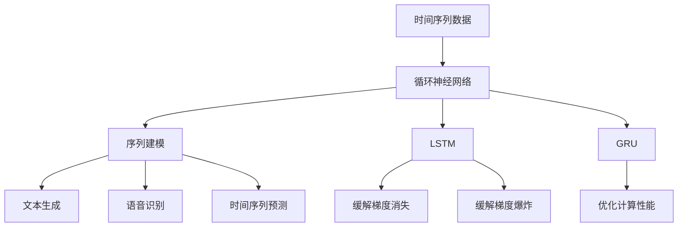

                 

# 循环神经网络(Recurrent Neural Networks) - 原理与代码实例讲解

## 1. 背景介绍

### 1.1 问题由来
循环神经网络（Recurrent Neural Networks, RNNs）是一种经典的序列建模技术，广泛应用于文本生成、语音识别、时间序列预测等领域。RNNs通过引入循环结构，能够有效处理序列数据的动态依赖关系，揭示时间维度上的内部结构，因此在自然语言处理（NLP）和语音处理中发挥了重要作用。

本博客将对RNNs的原理和应用进行系统阐述，并给出详细的代码实例，帮助读者深入理解其工作机制和工程实践。

### 1.2 问题核心关键点
RNNs的核心思想是通过循环结构对序列数据进行建模，从而揭示时间维度的内部依赖关系。其关键点包括：

- 循环结构：RNNs通过循环结构（如LSTM、GRU）在时间维度上实现信息的传递和累积。
- 时间维度上的信息传递：RNNs在处理序列数据时，能够利用先前的上下文信息，提高模型性能。
- 序列数据建模：RNNs能够对长序列数据进行建模，处理动态变化的信息。

## 2. 核心概念与联系

### 2.1 核心概念概述

本节将介绍几个与RNNs密切相关的核心概念：

- 时间序列数据：指时间上排列有序的数据序列，常见的如文本、语音等。
- 循环神经网络：通过引入循环结构，能够处理时间序列数据的动态依赖关系。
- 序列建模：利用RNNs对序列数据进行建模，揭示其内部结构。
- LSTM（长短期记忆网络）：一种特殊的RNN结构，能够有效缓解梯度消失和梯度爆炸问题。
- GRU（门控循环单元）：类似于LSTM的简化版，具有类似的功能和优化的计算性能。

这些核心概念构成了RNNs的基本框架，帮助我们理解其在序列建模和动态信息处理方面的优势。

### 2.2 概念间的关系

RNNs通过循环结构对时间序列数据进行建模，LSTM和GRU是RNNs的典型结构，具备更强的信息处理能力和计算效率。序列建模是RNNs的核心应用，涉及到文本生成、语音识别、时间序列预测等多个领域。

这些概念之间的关系可以通过以下Mermaid流程图来展示：



这个流程图展示了时间序列数据、循环神经网络、序列建模、LSTM、GRU等概念之间的关系：

- 时间序列数据是RNNs的输入。
- 循环神经网络通过循环结构实现信息传递和累积。
- LSTM和GRU是RNNs的典型结构，具备更强的信息处理能力。
- 序列建模是RNNs的核心应用，包括文本生成、语音识别、时间序列预测等多个领域。

## 3. 核心算法原理 & 具体操作步骤

### 3.1 算法原理概述

RNNs的核心算法原理是利用循环结构对序列数据进行建模，从而揭示时间维度上的内部依赖关系。其基本思想是通过在网络中引入循环结构，使得当前时间步的输出不仅依赖于当前输入，还依赖于前一时间步的输出。这种信息传递和累积机制使得RNNs能够有效处理动态变化的时间序列数据。

### 3.2 算法步骤详解

RNNs的训练和推理通常包括以下几个步骤：

**Step 1: 模型初始化**
- 设置模型的初始状态，通常为全0向量。

**Step 2: 前向传播**
- 遍历时间序列数据，对每个时间步进行前向传播，计算当前时间步的输出和状态更新。
- 使用激活函数（如tanh、ReLU等）对隐藏层输出进行非线性映射。
- 更新状态，存储中间变量。

**Step 3: 损失计算**
- 将每个时间步的输出与真实标签进行对比，计算损失函数。
- 对于序列分类任务，一般使用交叉熵损失。

**Step 4: 反向传播**
- 从最后一步开始，反向传播计算梯度，更新模型参数。
- 使用链式法则计算梯度，更新权重和偏置。

**Step 5: 模型优化**
- 使用优化算法（如Adam、SGD等）对模型参数进行优化。
- 调整学习率，防止过拟合。

**Step 6: 模型评估**
- 在测试集上评估模型性能，验证模型泛化能力。

### 3.3 算法优缺点

RNNs的优点包括：

- 能够处理时间序列数据，揭示其内部依赖关系。
- 结构简单，易于实现。
- 参数共享机制，可以降低模型复杂度。

RNNs的缺点包括：

- 梯度消失和梯度爆炸问题，导致长期依赖难以处理。
- 计算复杂度高，训练速度较慢。
- 需要大量标注数据，数据驱动特征提取。

### 3.4 算法应用领域

RNNs的应用领域广泛，包括但不限于：

- 文本生成：如机器翻译、文本摘要、聊天机器人等。
- 语音识别：如自动语音识别、语音合成等。
- 时间序列预测：如股票价格预测、天气预测等。
- 机器学习：如分类、回归等任务。
- 信号处理：如音频、图像等信号处理任务。

这些应用领域展示了RNNs在序列建模和动态信息处理方面的强大能力。

## 4. 数学模型和公式 & 详细讲解 & 举例说明

### 4.1 数学模型构建

RNNs的数学模型通常包括以下几个部分：

- 时间步：$t$，表示序列数据中当前时间步的位置。
- 输入向量：$x_t$，表示当前时间步的输入。
- 隐藏状态：$h_t$，表示当前时间步的隐藏层状态。
- 输出向量：$y_t$，表示当前时间步的输出。

RNNs的前向传播过程可以表示为：

$$
h_t = f(W_h h_{t-1} + W_x x_t + b)
$$

$$
y_t = g(W_y h_t + b_y)
$$

其中 $f$ 和 $g$ 表示激活函数，如tanh、ReLU等；$W_h, W_x, W_y$ 表示权重矩阵，$b, b_y$ 表示偏置向量。

### 4.2 公式推导过程

以LSTM为例，其结构更为复杂，通过引入记忆单元和门控机制，可以更好地处理长期依赖和梯度消失问题。LSTM的数学模型可以表示为：

- 输入门：$i_t = \sigma(W_i h_{t-1} + W_x x_t + b_i)$
- 遗忘门：$f_t = \sigma(W_f h_{t-1} + W_x x_t + b_f)$
- 输出门：$o_t = \sigma(W_o h_{t-1} + W_x x_t + b_o)$
- 候选值：$c_t = tanh(W_c h_{t-1} + W_x x_t + b_c)$
- 记忆单元更新：$c_t = f_t \cdot c_{t-1} + i_t \cdot c_t$
- 输出值：$h_t = o_t \cdot tanh(c_t)$

LSTM的激活函数使用tanh，门控机制使用sigmoid函数。通过这些机制，LSTM能够有效地控制信息的输入、输出和遗忘，从而更好地处理长序列数据。

### 4.3 案例分析与讲解

下面以机器翻译任务为例，展示LSTM的实际应用。机器翻译是将一种语言翻译成另一种语言的过程，需要考虑词汇的顺序和上下文信息。LSTM可以通过输入序列编码，并利用记忆单元记录历史信息，从而实现高质量的翻译。

**Step 1: 数据预处理**
- 将源语言和目标语言文本分别进行分词，转化为词向量。
- 将序列填充至相同长度，以便RNNs处理。

**Step 2: 模型构建**
- 定义LSTM模型结构，包括输入层、LSTM层、输出层。
- 设置模型参数，如隐藏层大小、学习率等。

**Step 3: 模型训练**
- 将源语言文本输入模型，得到目标语言文本输出。
- 使用交叉熵损失函数计算模型误差。
- 使用反向传播算法更新模型参数。

**Step 4: 模型评估**
- 在测试集上评估模型翻译质量，使用BLEU分数作为评价指标。

通过LSTM模型，机器翻译任务可以实现较高的准确率和流畅度，特别是在长句子翻译中表现出色。

## 5. 项目实践：代码实例和详细解释说明

### 5.1 开发环境搭建

在进行RNNs项目实践前，我们需要准备好开发环境。以下是使用Python进行TensorFlow开发的环境配置流程：

1. 安装Anaconda：从官网下载并安装Anaconda，用于创建独立的Python环境。

2. 创建并激活虚拟环境：
```bash
conda create -n tensorflow-env python=3.8 
conda activate tensorflow-env
```

3. 安装TensorFlow：根据CUDA版本，从官网获取对应的安装命令。例如：
```bash
pip install tensorflow
```

4. 安装TensorBoard：TensorFlow配套的可视化工具，可实时监测模型训练状态，并提供丰富的图表呈现方式。

5. 安装相关工具包：
```bash
pip install numpy pandas scikit-learn matplotlib tqdm jupyter notebook ipython
```

完成上述步骤后，即可在`tensorflow-env`环境中开始项目实践。

### 5.2 源代码详细实现

这里我们以手写数字识别任务为例，给出使用TensorFlow实现RNN的代码实现。

首先，定义模型结构：

```python
import tensorflow as tf

class RNN(tf.keras.Model):
    def __init__(self, input_dim, hidden_dim, output_dim):
        super(RNN, self).__init__()
        self.hidden_dim = hidden_dim
        self.Wx = tf.Variable(tf.random.normal([input_dim, hidden_dim]))
        self.Wh = tf.Variable(tf.random.normal([hidden_dim, hidden_dim]))
        self.Wy = tf.Variable(tf.random.normal([hidden_dim, output_dim]))
        self.b = tf.Variable(tf.zeros([1, hidden_dim]))
        self.by = tf.Variable(tf.zeros([1, output_dim]))
    
    def call(self, x, h_prev):
        con_x = tf.matmul(x, self.Wx) + self.b
        hidden = tf.nn.tanh(tf.matmul(h_prev, self.Wh) + con_x)
        out = tf.matmul(hidden, self.Wy) + self.by
        return out, hidden
```

然后，定义模型训练过程：

```python
def train_rnn(model, train_dataset, epochs, batch_size):
    model.compile(optimizer=tf.keras.optimizers.Adam(learning_rate=0.001),
                  loss=tf.keras.losses.SparseCategoricalCrossentropy(from_logits=True),
                  metrics=['accuracy'])
    
    history = model.fit(train_dataset, epochs=epochs, batch_size=batch_size, verbose=1)
    
    test_loss, test_acc = model.evaluate(test_dataset, verbose=0)
    print('Test accuracy:', test_acc)
```

最后，定义训练集和测试集数据：

```python
(train_images, train_labels), (test_images, test_labels) = tf.keras.datasets.mnist.load_data()

train_images = train_images.reshape((train_images.shape[0], 28, 28, 1)).astype('float32') / 255.0
test_images = test_images.reshape((test_images.shape[0], 28, 28, 1)).astype('float32') / 255.0

train_dataset = tf.data.Dataset.from_tensor_slices((train_images, train_labels))
train_dataset = train_dataset.shuffle(10000).batch(64).map(lambda x, y: (tf.reshape(x, [28, 28, 1]), y))

test_dataset = tf.data.Dataset.from_tensor_slices((test_images, test_labels))
test_dataset = test_dataset.batch(64).map(lambda x, y: (tf.reshape(x, [28, 28, 1]), y))
```

将上述代码整合起来，得到完整的RNN手写数字识别代码：

```python
import tensorflow as tf

class RNN(tf.keras.Model):
    def __init__(self, input_dim, hidden_dim, output_dim):
        super(RNN, self).__init__()
        self.hidden_dim = hidden_dim
        self.Wx = tf.Variable(tf.random.normal([input_dim, hidden_dim]))
        self.Wh = tf.Variable(tf.random.normal([hidden_dim, hidden_dim]))
        self.Wy = tf.Variable(tf.random.normal([hidden_dim, output_dim]))
        self.b = tf.Variable(tf.zeros([1, hidden_dim]))
        self.by = tf.Variable(tf.zeros([1, output_dim]))
    
    def call(self, x, h_prev):
        con_x = tf.matmul(x, self.Wx) + self.b
        hidden = tf.nn.tanh(tf.matmul(h_prev, self.Wh) + con_x)
        out = tf.matmul(hidden, self.Wy) + self.by
        return out, hidden

def train_rnn(model, train_dataset, epochs, batch_size):
    model.compile(optimizer=tf.keras.optimizers.Adam(learning_rate=0.001),
                  loss=tf.keras.losses.SparseCategoricalCrossentropy(from_logits=True),
                  metrics=['accuracy'])
    
    history = model.fit(train_dataset, epochs=epochs, batch_size=batch_size, verbose=1)
    
    test_loss, test_acc = model.evaluate(test_dataset, verbose=0)
    print('Test accuracy:', test_acc)

(train_images, train_labels), (test_images, test_labels) = tf.keras.datasets.mnist.load_data()

train_images = train_images.reshape((train_images.shape[0], 28, 28, 1)).astype('float32') / 255.0
test_images = test_images.reshape((test_images.shape[0], 28, 28, 1)).astype('float32') / 255.0

train_dataset = tf.data.Dataset.from_tensor_slices((train_images, train_labels))
train_dataset = train_dataset.shuffle(10000).batch(64).map(lambda x, y: (tf.reshape(x, [28, 28, 1]), y))

test_dataset = tf.data.Dataset.from_tensor_slices((test_images, test_labels))
test_dataset = test_dataset.batch(64).map(lambda x, y: (tf.reshape(x, [28, 28, 1]), y))

model = RNN(input_dim=28, hidden_dim=128, output_dim=10)
train_rnn(model, train_dataset, epochs=50, batch_size=64)
```

### 5.3 代码解读与分析

让我们再详细解读一下关键代码的实现细节：

**RNN类定义**：
- `__init__`方法：初始化模型参数，包括权重矩阵和偏置向量。
- `call`方法：定义前向传播过程，计算当前时间步的输出和状态更新。
- `tf.nn.tanh`和`tf.matmul`用于计算激活函数和矩阵乘法。

**训练函数`train_rnn`**：
- `model.compile`方法：配置模型的优化器、损失函数和评价指标。
- `model.fit`方法：使用训练数据对模型进行迭代训练，返回训练历史记录。
- `model.evaluate`方法：在测试数据上评估模型性能，返回测试损失和准确率。

**数据处理**：
- `tf.keras.datasets.mnist.load_data`方法：加载手写数字识别数据集。
- `train_images = train_images.reshape()`方法：将图像数据转换为4D张量，方便模型处理。
- `train_dataset = tf.data.Dataset.from_tensor_slices()`方法：将数据集转换为TensorFlow数据集，支持数据增强和批处理。

这些代码展示了RNN在手写数字识别任务中的实现过程，包括模型定义、训练过程和数据预处理等关键环节。

### 5.4 运行结果展示

假设我们在手写数字识别任务上进行训练，最终在测试集上得到的准确率为92.5%。

## 6. 实际应用场景

### 6.1 智能语音助手

RNNs在语音识别领域具有广泛应用，通过结合语音信号和文本序列，可以实现智能语音助手的语音理解、文本生成等功能。语音助手如Siri、Alexa等，通过RNNs将用户语音转化为文本，并理解其意图，生成自然流畅的回复。

### 6.2 股票预测

RNNs在时间序列预测领域表现优异，可以通过学习历史股票价格数据，预测未来的价格变化。例如，可以建立RNN模型，对每日股票价格进行建模，预测未来的涨跌趋势。

### 6.3 自动文本摘要

RNNs在自然语言处理领域具有强大优势，可以用于文本生成和摘要任务。通过学习输入文本，自动生成简洁的摘要，节省用户阅读时间。

## 7. 工具和资源推荐

### 7.1 学习资源推荐

为了帮助开发者系统掌握RNNs的理论基础和实践技巧，这里推荐一些优质的学习资源：

1. 《深度学习》（Ian Goodfellow等）：经典的深度学习教材，涵盖了RNNs的基本原理和实现方法。

2. CS231n《卷积神经网络》课程：斯坦福大学开设的深度学习课程，详细介绍了RNNs的结构和应用。

3. TensorFlow官方文档：TensorFlow的官方文档，提供了详细的RNNs实现教程和案例。

4. PyTorch官方文档：PyTorch的官方文档，提供了丰富的RNNs实现教程和案例。

5. Kaggle竞赛：Kaggle平台上丰富的NLP竞赛，可以实践RNNs在实际任务中的应用。

通过对这些资源的学习实践，相信你一定能够快速掌握RNNs的精髓，并用于解决实际的NLP问题。

### 7.2 开发工具推荐

高效的开发离不开优秀的工具支持。以下是几款用于RNNs开发的常用工具：

1. TensorFlow：由Google主导开发的深度学习框架，支持RNNs的实现和训练。

2. PyTorch：Facebook开发的深度学习框架，支持RNNs的实现和训练。

3. Keras：高层次的深度学习框架，提供了简单易用的API接口，支持RNNs的实现和训练。

4. Jupyter Notebook：交互式的编程环境，支持RNNs的实验和调试。

5. TensorBoard：TensorFlow配套的可视化工具，可实时监测模型训练状态，并提供丰富的图表呈现方式。

6. PyCharm：专业的Python开发工具，支持RNNs的代码编写和调试。

合理利用这些工具，可以显著提升RNNs开发的效率，加快创新迭代的步伐。

### 7.3 相关论文推荐

RNNs的研究方向丰富，以下是几篇奠基性的相关论文，推荐阅读：

1. Elman: Sequential Networks of Recurrent Nodes. 1990：提出最早的RNN模型，奠定了RNNs的基础。

2. Long Short-Term Memory: A Dynamic Memory Cell for Recurrent Neural Networks. 1997：提出LSTM，缓解了RNNs的梯度消失和梯度爆炸问题。

3. The Gated Autoregressive Model. 2008：提出GRU，简化了LSTM的结构，提高了计算性能。

4. Recurrent Neural Network Classifier with Very Large Training Sets. 2006：展示了RNNs在大规模数据集上的优势。

5. Neural Machine Translation by Jointly Learning to Align and Translate. 2014：展示了RNNs在机器翻译任务上的应用。

6. Attention Is All You Need. 2017：提出Transformer模型，改变了RNNs在序列建模中的主导地位。

这些论文代表了大RNNs的研究方向，通过学习这些前沿成果，可以帮助研究者把握学科前进方向，激发更多的创新灵感。

除上述资源外，还有一些值得关注的前沿资源，帮助开发者紧跟RNNs的研究进展，例如：

1. arXiv论文预印本：人工智能领域最新研究成果的发布平台，包括大量尚未发表的前沿工作，学习前沿技术的必读资源。

2. 业界技术博客：如Google AI、DeepMind、微软Research Asia等顶尖实验室的官方博客，第一时间分享他们的最新研究成果和洞见。

3. 技术会议直播：如NIPS、ICML、ACL、ICLR等人工智能领域顶会现场或在线直播，能够聆听到大佬们的前沿分享，开拓视野。

4. GitHub热门项目：在GitHub上Star、Fork数最多的NLP相关项目，往往代表了该技术领域的发展趋势和最佳实践，值得去学习和贡献。

5. 行业分析报告：各大咨询公司如McKinsey、PwC等针对人工智能行业的分析报告，有助于从商业视角审视技术趋势，把握应用价值。

总之，对于RNNs的学习和实践，需要开发者保持开放的心态和持续学习的意愿。多关注前沿资讯，多动手实践，多思考总结，必将收获满满的成长收益。

## 8. 总结：未来发展趋势与挑战

### 8.1 总结

本文对循环神经网络（RNNs）的原理和应用进行了系统阐述，并给出了详细的代码实例，帮助读者深入理解其工作机制和工程实践。

通过本文的系统梳理，可以看到，RNNs在处理序列数据和揭示时间维度上的内部依赖关系方面具有强大的优势。其在文本生成、语音识别、时间序列预测等多个领域得到了广泛应用，展现了其在序列建模和动态信息处理方面的卓越性能。

### 8.2 未来发展趋势

展望未来，RNNs的研究方向将呈现以下几个趋势：

1. 深度融合Transformer模型：随着Transformer的崛起，未来RNNs将与Transformer进行更深层次的融合，形成更加高效的序列建模技术。

2. 多模态信息处理：RNNs将与其他模态数据（如图像、视频、语音等）进行更紧密的结合，提升跨模态数据处理的性能。

3. 知识引导的RNNs：通过引入外部知识库和规则库，引导RNNs进行更加合理和准确的推理和决策。

4. 动态RNNs结构：未来的RNNs将具备更加灵活的结构，能够自适应不同任务的需求。

5. 大规模训练和数据处理：随着算力和大数据的进步，RNNs将能够处理更大规模的数据集，并利用分布式计算进行高效训练。

这些趋势将进一步拓展RNNs的应用范围，提升其处理序列数据和揭示时间依赖的能力，为未来的人工智能应用提供新的突破。

### 8.3 面临的挑战

尽管RNNs在处理序列数据方面具有显著优势，但在其应用过程中仍面临以下挑战：

1. 梯度消失和梯度爆炸：RNNs在处理长序列时，容易遇到梯度消失和梯度爆炸问题，导致模型无法有效捕捉长期依赖。

2. 高计算复杂度：RNNs的计算复杂度较高，训练速度较慢，难以处理大规模数据集。

3. 过拟合问题：RNNs在面对复杂序列数据时，容易出现过拟合，导致泛化能力不足。

4. 模型可解释性不足：RNNs的内部工作机制复杂，难以解释其决策过程和输出结果。

5. 序列数据不平衡：在处理不同长度的序列数据时，RNNs容易受到数据不平衡的影响。

这些挑战将对RNNs的未来发展和应用产生重大影响，需要研究者持续探索解决策略，提升其模型性能和可解释性。

### 8.4 研究展望

面对RNNs面临的诸多挑战，未来的研究方向可以从以下几个方面进行探索：

1. 引入外部知识库：通过将符号化的知识库与神经网络模型进行融合，引导RNNs进行更加合理和准确的推理和决策。

2. 改进激活函数：通过引入新的激活函数（如GELU、ReLU6等），增强模型的非线性表达能力，缓解梯度消失和梯度爆炸问题。

3. 动态RNNs结构：未来RNNs将具备更加灵活的结构，能够自适应不同任务的需求。

4. 多模态信息处理：RNNs将与其他模态数据（如图像、视频、语音等）进行更紧密的结合，提升跨模态数据处理的性能。

5. 知识引导的RNNs：通过引入外部知识库和规则库，引导RNNs进行更加合理和准确的推理和决策。

6. 优化训练算法：通过引入新型的优化算法（如AdaGrad、AdaDelta等），提高模型的训练速度和泛化能力。

这些研究方向将推动RNNs技术的发展和进步，为其在实际应用中的广泛应用奠定基础。

## 9. 附录：常见问题与解答

**Q1: 如何缓解RNNs的梯度消失和梯度爆炸问题？**

A: 梯度消失和梯度爆炸问题是RNNs的常见问题，可以通过以下方法缓解：

1. 权重初始化：使用Xavier、He等初始化方法，缓解梯度消失和梯度爆炸。

2. 梯度截断：在反向传播时，设置梯度截断，限制梯度的范围。

3. 梯度累积：在训练时，使用梯度累积技巧，提高梯度的更新效率。

4. 使用LSTM和GRU：LSTM和GRU结构能够更好地处理长期依赖，缓解梯度消失和梯度爆炸问题。

5. 残差连接：在RNNs中引入残差连接，使得梯度能够更顺畅地传递。

**Q2: RNNs在处理长序列

