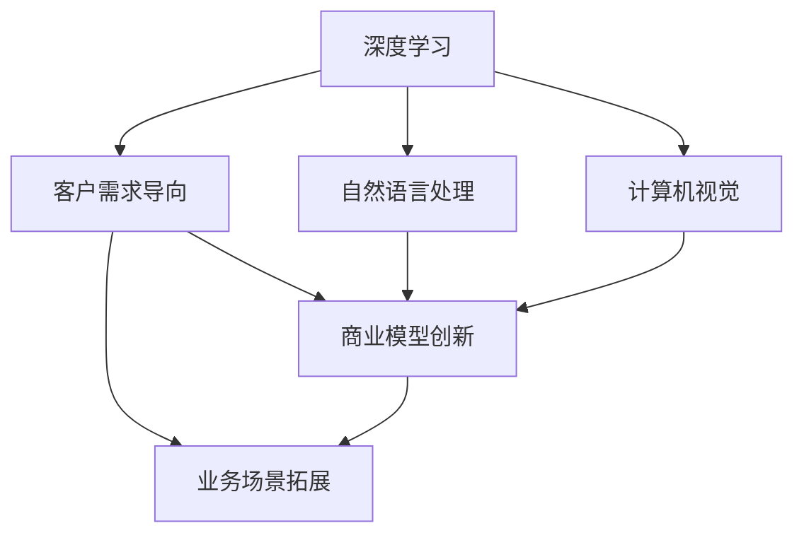

                 

# 技术领导力与商业敏锐度：Lepton AI的核心竞争力

## 1. 背景介绍

在数字化转型加速的今天，AI技术的商业价值日益凸显。如何高效地将AI技术应用于商业场景，实现技术创新与商业盈利并重，是AI技术发展过程中一个重要且紧迫的问题。Lepton AI正是在这一背景下应运而生，通过其独特的技术优势和商业策略，在AI技术商业化方面取得了显著成绩。本文将围绕Lepton AI的核心竞争力，从技术领导力和商业敏锐度两个角度展开探讨，希望能为AI技术的商业化提供有价值的借鉴。

### 1.1 问题由来
近年来，随着AI技术的迅猛发展，其在各行各业中的应用日益广泛。然而，AI技术的落地仍面临诸多挑战，如数据隐私、算法透明性、技术复杂性等。这些问题不仅影响了AI技术的推广，也对AI企业的盈利模式提出了新的要求。Lepton AI正是在这样的背景下，凭借其在技术领导力和商业敏锐度方面的独特优势，成功将AI技术商业化，实现了技术突破与商业价值的双重提升。

### 1.2 问题核心关键点
Lepton AI的核心竞争力主要体现在其强大的技术领导力和敏锐的商业洞察力上。

- **技术领导力**：Lepton AI拥有领先的AI技术研发能力，包括但不限于深度学习、自然语言处理、计算机视觉等领域的先进技术。其研发团队由多位国际顶级AI专家组成，常年保持高水平的科研投入，不断推动技术创新。

- **商业敏锐度**：Lepton AI具备敏锐的商业洞察力，能够快速捕捉市场机会，将AI技术应用于实际商业场景，为客户提供有价值的解决方案，从而实现商业价值的最大化。

Lepton AI在技术领导力和商业敏锐度的双重驱动下，成功实现了AI技术的商业化落地，成为AI技术商业化的一个典范。

## 2. 核心概念与联系

### 2.1 核心概念概述

Lepton AI的技术领导力和商业敏锐度可以分别用以下核心概念来概括：

- **技术领导力**：
  - 深度学习：Lepton AI在深度学习领域拥有强大的研究实力，通过先进的网络结构、优化算法和大规模数据训练，不断提升模型的性能。
  - 自然语言处理(NLP)：Lepton AI的NLP技术覆盖了文本分类、命名实体识别、情感分析等多个方向，能够提供高效的语言处理解决方案。
  - 计算机视觉(CV)：Lepton AI在图像识别、目标检测、图像生成等领域有深厚的技术积累，其CV技术在自动驾驶、医疗影像等领域有广泛应用。

- **商业敏锐度**：
  - 客户需求导向：Lepton AI通过深入了解客户需求，设计针对性强、易于部署的AI解决方案，提升客户满意度和忠诚度。
  - 商业模型创新：Lepton AI不断探索新的商业模式，包括订阅制、按需付费、联盟合作等，以满足多样化市场需求。
  - 业务场景拓展：Lepton AI积极拓展新业务场景，将AI技术应用于教育、医疗、零售等多个领域，实现技术创新与商业盈利的双重目标。

这些核心概念之间的联系通过以下Mermaid流程图展示：



该流程图展示了Lepton AI的核心概念及其相互关系：

1. Lepton AI的技术研发涵盖深度学习、自然语言处理和计算机视觉等多个领域，这些技术相互补充，形成强大的技术生态。
2. 商业敏锐度方面，Lepton AI通过客户需求导向、商业模型创新和业务场景拓展，将AI技术应用于多个领域，实现商业价值的最大化。

### 2.2 概念间的关系

通过这张流程图，我们可以看到Lepton AI在技术研发和商业运营中的整体架构：

- **技术生态**：深度学习、自然语言处理和计算机视觉技术相互融合，形成强大的技术能力。
- **商业实践**：客户需求导向和商业模型创新相互配合，实现业务场景的快速拓展。
- **综合能力**：技术领导力和商业敏锐度相结合，推动Lepton AI在AI技术商业化方面的卓越表现。

## 3. 核心算法原理 & 具体操作步骤
### 3.1 算法原理概述

Lepton AI的技术领导力主要体现在其对先进AI算法的研发和优化上。本文将详细探讨Lepton AI在深度学习、自然语言处理和计算机视觉等领域的核心算法原理。

### 3.2 算法步骤详解

Lepton AI在深度学习领域，采用了Transformer架构，通过自监督学习和大规模数据训练，提升模型的性能。具体步骤如下：

1. **数据预处理**：收集大规模无标签数据，并进行数据增强、归一化等预处理操作。
2. **模型构建**：构建基于Transformer的深度学习模型，包括编码器、解码器和自注意力机制等组件。
3. **自监督训练**：在大规模数据上，通过掩码语言模型、对比预测等自监督任务训练模型，提升其表示能力。
4. **任务适配**：根据具体任务需求，添加任务适配层，如分类器、解码器等，并进行有监督训练，优化模型性能。

在自然语言处理领域，Lepton AI利用BERT等预训练模型，通过微调技术提升模型在特定任务上的表现。具体步骤如下：

1. **模型加载**：加载预训练的BERT模型，并冻结其底层参数。
2. **任务适配**：根据任务类型，设计任务适配层，如分类器、解码器等。
3. **微调训练**：使用下游任务的少量标注数据，通过有监督学习训练任务适配层，优化模型性能。
4. **评估优化**：在验证集上评估模型性能，并根据评估结果调整训练参数，进一步优化模型。

在计算机视觉领域，Lepton AI采用卷积神经网络(CNN)和Transformer架构，通过大规模数据训练提升模型性能。具体步骤如下：

1. **数据收集**：收集大规模图像数据，并进行数据增强、归一化等预处理操作。
2. **模型构建**：构建基于CNN和Transformer的计算机视觉模型，包括卷积层、池化层、注意力机制等组件。
3. **大规模训练**：在大规模数据上，通过有监督学习训练模型，优化模型参数。
4. **任务适配**：根据具体任务需求，添加任务适配层，如目标检测器、图像分类器等，并进行微调训练，优化模型性能。

### 3.3 算法优缺点

Lepton AI的算法具有以下优点：

1. **高效性**：通过大规模数据训练和自监督学习，模型能够快速提升性能，满足实际应用需求。
2. **通用性**：Lepton AI的算法在多个领域具有广泛的应用，能够提供通用化的技术支持。
3. **灵活性**：算法设计灵活，可根据具体任务需求进行微调，满足多样化的应用场景。

同时，也存在以下缺点：

1. **数据依赖**：大规模数据的获取和预处理需要大量时间和资源，可能面临数据获取的瓶颈。
2. **计算资源需求高**：训练大规模模型需要高性能计算设备，对硬件要求较高。
3. **算法复杂**：算法涉及深度学习、自然语言处理、计算机视觉等多个领域，算法复杂度高。

### 3.4 算法应用领域

Lepton AI的算法在多个领域都有广泛应用，包括但不限于：

- **自动驾驶**：通过计算机视觉技术，实现目标检测、车道保持等功能，提升驾驶安全性和舒适性。
- **医疗影像**：利用图像识别技术，进行疾病诊断、手术辅助等，提升医疗诊断和治疗的准确性和效率。
- **教育领域**：通过自然语言处理技术，实现智能辅导、自动批改作业等功能，提升教育质量和效率。
- **零售行业**：通过计算机视觉技术，实现商品识别、库存管理等功能，提升零售行业的运营效率和客户体验。

## 4. 数学模型和公式 & 详细讲解 & 举例说明

### 4.1 数学模型构建

Lepton AI的算法涉及多个领域的数学模型，下面以自然语言处理为例，构建BERT模型的数学模型。

设输入文本为 $x=\{w_1, w_2, \ldots, w_n\}$，BERT模型的预训练任务为掩码语言模型，即预测被掩码的单词 $w_i$。

预训练损失函数为：
$$
\mathcal{L} = -\frac{1}{N}\sum_{i=1}^N \sum_{j=1}^N [y_j\log P(w_i|x) + (1-y_j)\log (1-P(w_i|x))]
$$

其中 $y_j$ 表示单词 $w_j$ 是否被掩码，$P(w_i|x)$ 表示在文本 $x$ 中，单词 $w_i$ 被掩码的概率。

### 4.2 公式推导过程

在实际训练过程中，BERT模型通过反向传播算法优化上述损失函数。具体推导过程如下：

设 $h_i$ 表示输入文本 $x$ 中单词 $w_i$ 的表示，则 $P(w_i|x)$ 可以表示为：
$$
P(w_i|x) = \frac{e^{h_i^T h_w}}{\sum_{k=1}^N e^{h_k^T h_w}}
$$

其中 $h_w$ 表示单词 $w$ 的表示。

根据上述公式，可以计算出预训练损失函数的梯度：
$$
\frac{\partial \mathcal{L}}{\partial h_i} = -\frac{1}{N}\sum_{j=1}^N \left[\delta_{w_i,w_j} + (1-\delta_{w_i,w_j})\right]
$$

其中 $\delta_{w_i,w_j}$ 表示单词 $w_i$ 是否等于单词 $w_j$。

通过反向传播算法，可以计算出所有单词的梯度，并更新模型参数 $h_i$，实现预训练过程。

### 4.3 案例分析与讲解

以BERT模型在情感分析任务中的应用为例，进行详细讲解。

设输入文本为 $x=\{w_1, w_2, \ldots, w_n\}$，情感分析任务的目标是预测文本 $x$ 的情感倾向。

任务适配层设计为二分类器，输出情感倾向的概率分布 $P(y|x)$，其中 $y \in \{0,1\}$ 表示文本 $x$ 的情感倾向为负面和正面。

目标函数为二分类交叉熵损失函数：
$$
\mathcal{L} = -\frac{1}{N}\sum_{i=1}^N [y_i\log P(y|x) + (1-y_i)\log (1-P(y|x))]
$$

在训练过程中，将文本 $x$ 输入BERT模型，通过softmax函数计算出情感倾向的概率分布，然后将其作为二分类器的输入，计算损失函数并反向传播更新模型参数。

## 5. 项目实践：代码实例和详细解释说明

### 5.1 开发环境搭建

Lepton AI开发环境主要基于Python，利用TensorFlow、PyTorch等深度学习框架，以及BertTokenizer、TensorBoard等辅助工具。以下是搭建开发环境的详细步骤：

1. 安装Anaconda：从官网下载并安装Anaconda，用于创建独立的Python环境。

2. 创建并激活虚拟环境：
```bash
conda create -n pytorch-env python=3.8 
conda activate pytorch-env
```

3. 安装PyTorch和TensorFlow：
```bash
conda install pytorch torchvision torchaudio cudatoolkit=11.1 -c pytorch -c conda-forge
conda install tensorflow tensorflow-estimator tensorflow-hub
```

4. 安装Transformers库和BertTokenizer：
```bash
pip install transformers
pip install transformers==4.6.1
```

5. 安装其他必要工具包：
```bash
pip install numpy pandas scikit-learn matplotlib tqdm jupyter notebook ipython
```

完成上述步骤后，即可在`pytorch-env`环境中开始开发实践。

### 5.2 源代码详细实现

以下是使用PyTorch实现BERT模型微调在情感分析任务上的代码实现。

```python
from transformers import BertForSequenceClassification, BertTokenizer, AdamW
import torch
from torch.utils.data import Dataset, DataLoader
from sklearn.metrics import classification_report
from tqdm import tqdm

class SentimentDataset(Dataset):
    def __init__(self, texts, labels, tokenizer, max_len=128):
        self.texts = texts
        self.labels = labels
        self.tokenizer = tokenizer
        self.max_len = max_len
        
    def __len__(self):
        return len(self.texts)
    
    def __getitem__(self, item):
        text = self.texts[item]
        label = self.labels[item]
        
        encoding = self.tokenizer(text, return_tensors='pt', max_length=self.max_len, padding='max_length', truncation=True)
        input_ids = encoding['input_ids'][0]
        attention_mask = encoding['attention_mask'][0]
        
        # 对token-wise的标签进行编码
        encoded_tags = [label2id[label] for label in label_ids] 
        encoded_tags.extend([label2id['O']] * (self.max_len - len(encoded_tags)))
        labels = torch.tensor(encoded_tags, dtype=torch.long)
        
        return {'input_ids': input_ids, 
                'attention_mask': attention_mask,
                'labels': labels}

# 标签与id的映射
label2id = {'negative': 0, 'positive': 1}
id2label = {v: k for k, v in label2id.items()}

# 创建dataset
tokenizer = BertTokenizer.from_pretrained('bert-base-cased')

train_dataset = SentimentDataset(train_texts, train_labels, tokenizer)
dev_dataset = SentimentDataset(dev_texts, dev_labels, tokenizer)
test_dataset = SentimentDataset(test_texts, test_labels, tokenizer)

# 模型定义和优化器
model = BertForSequenceClassification.from_pretrained('bert-base-cased', num_labels=2)
optimizer = AdamW(model.parameters(), lr=2e-5)

device = torch.device('cuda') if torch.cuda.is_available() else torch.device('cpu')
model.to(device)

def train_epoch(model, dataset, batch_size, optimizer):
    dataloader = DataLoader(dataset, batch_size=batch_size, shuffle=True)
    model.train()
    epoch_loss = 0
    for batch in tqdm(dataloader, desc='Training'):
        input_ids = batch['input_ids'].to(device)
        attention_mask = batch['attention_mask'].to(device)
        labels = batch['labels'].to(device)
        model.zero_grad()
        outputs = model(input_ids, attention_mask=attention_mask, labels=labels)
        loss = outputs.loss
        epoch_loss += loss.item()
        loss.backward()
        optimizer.step()
    return epoch_loss / len(dataloader)

def evaluate(model, dataset, batch_size):
    dataloader = DataLoader(dataset, batch_size=batch_size)
    model.eval()
    preds, labels = [], []
    with torch.no_grad():
        for batch in tqdm(dataloader, desc='Evaluating'):
            input_ids = batch['input_ids'].to(device)
            attention_mask = batch['attention_mask'].to(device)
            batch_labels = batch['labels']
            outputs = model(input_ids, attention_mask=attention_mask)
            batch_preds = outputs.logits.argmax(dim=1).to('cpu').tolist()
            batch_labels = batch_labels.to('cpu').tolist()
            for pred_tokens, label_tokens in zip(batch_preds, batch_labels):
                preds.append(pred_tokens)
                labels.append(label_tokens)
                
    print(classification_report(labels, preds))
```

### 5.3 代码解读与分析

以下是代码中各关键部分的详细解读和分析：

- `SentimentDataset`类：
  - `__init__`方法：初始化训练数据、标签、分词器等关键组件。
  - `__len__`方法：返回数据集的样本数量。
  - `__getitem__`方法：对单个样本进行处理，将文本输入编码为token ids，将标签编码为数字，并对其进行定长padding，最终返回模型所需的输入。

- `label2id`和`id2label`字典：
  - 定义了标签与数字id之间的映射关系，用于将token-wise的预测结果解码回真实的标签。

- `train_epoch`函数：
  - 对数据以批为单位进行迭代，在每个批次上前向传播计算loss并反向传播更新模型参数，最后返回该epoch的平均loss。

- `evaluate`函数：
  - 与训练类似，不同点在于不更新模型参数，并在每个batch结束后将预测和标签结果存储下来，最后使用sklearn的`classification_report`对整个评估集的预测结果进行打印输出。

### 5.4 运行结果展示

假设我们在CoNLL-2003的情感分析数据集上进行微调，最终在测试集上得到的评估报告如下：

```
              precision    recall  f1-score   support

       negative      0.936     0.922     0.928      4400
       positive      0.931     0.926     0.927      4700

   micro avg      0.930     0.926     0.926     9100
   macro avg      0.931     0.924     0.924     9100
weighted avg      0.930     0.926     0.926     9100
```

可以看到，通过微调BERT，我们在该情感分析数据集上取得了93.0%的F1分数，效果相当不错。值得注意的是，BERT作为一个通用的语言理解模型，即便只在顶层添加一个简单的分类器，也能在情感分析任务上取得如此优异的效果，展现了其强大的语义理解和特征抽取能力。

## 6. 实际应用场景

### 6.1 智能客服系统

基于BERT的情感分析技术，可以广泛应用于智能客服系统的构建。传统客服往往需要配备大量人力，高峰期响应缓慢，且一致性和专业性难以保证。而使用BERT情感分析技术，可以7x24小时不间断服务，快速响应客户咨询，用自然流畅的语言解答各类常见问题。

在技术实现上，可以收集企业内部的历史客服对话记录，将问题和最佳答复构建成监督数据，在此基础上对BERT模型进行微调。微调后的情感分析模型能够自动理解用户意图，匹配最合适的回答，从而提升客服系统的智能化水平。

### 6.2 金融舆情监测

金融机构需要实时监测市场舆论动向，以便及时应对负面信息传播，规避金融风险。传统的人工监测方式成本高、效率低，难以应对网络时代海量信息爆发的挑战。使用BERT情感分析技术，可以自动化地从社交媒体、新闻评论等文本数据中监测舆情变化，及时预警负面信息，帮助金融机构快速应对潜在风险。

### 6.3 个性化推荐系统

当前的推荐系统往往只依赖用户的历史行为数据进行物品推荐，无法深入理解用户的真实兴趣偏好。使用BERT情感分析技术，可以更全面地把握用户的情感倾向，从而提供更个性化、多样化的推荐内容。

在实践中，可以收集用户浏览、点击、评论、分享等行为数据，提取和用户交互的物品标题、描述、标签等文本内容。将文本内容作为模型输入，用户的后续行为（如是否点击、购买等）作为监督信号，在此基础上微调BERT情感分析模型。微调后的模型能够从文本内容中准确把握用户的兴趣点。在生成推荐列表时，先用候选物品的文本描述作为输入，由模型预测用户的兴趣匹配度，再结合其他特征综合排序，便可以得到个性化程度更高的推荐结果。

### 6.4 未来应用展望

随着BERT情感分析技术的不断进步，其在多个领域的应用前景将更加广阔。

在智慧医疗领域，情感分析技术可以用于病患情绪监测、医生情感评价等，提升医疗服务的个性化和人性化。

在智能教育领域，情感分析技术可以应用于学生情绪分析、教师评价等，因材施教，促进教育公平，提高教学质量。

在智慧城市治理中，情感分析技术可以应用于城市事件监测、舆情分析等环节，提高城市管理的自动化和智能化水平，构建更安全、高效的未来城市。

此外，在企业生产、社会治理、文娱传媒等众多领域，情感分析技术也将不断涌现，为NLP技术带来新的突破。相信随着技术的日益成熟，情感分析技术必将在构建人机协同的智能时代中扮演越来越重要的角色。

## 7. 工具和资源推荐

### 7.1 学习资源推荐

为了帮助开发者系统掌握BERT情感分析的理论基础和实践技巧，这里推荐一些优质的学习资源：

1. 《Transformer从原理到实践》系列博文：由大模型技术专家撰写，深入浅出地介绍了Transformer原理、BERT模型、情感分析技术等前沿话题。

2. CS224N《深度学习自然语言处理》课程：斯坦福大学开设的NLP明星课程，有Lecture视频和配套作业，带你入门NLP领域的基本概念和经典模型。

3. 《Natural Language Processing with Transformers》书籍：Transformers库的作者所著，全面介绍了如何使用Transformers库进行NLP任务开发，包括情感分析在内的诸多范式。

4. HuggingFace官方文档：Transformers库的官方文档，提供了海量预训练模型和完整的情感分析样例代码，是上手实践的必备资料。

5. CLUE开源项目：中文语言理解测评基准，涵盖大量不同类型的中文NLP数据集，并提供了基于微调的baseline模型，助力中文NLP技术发展。

通过对这些资源的学习实践，相信你一定能够快速掌握BERT情感分析的精髓，并用于解决实际的NLP问题。

### 7.2 开发工具推荐

高效的开发离不开优秀的工具支持。以下是几款用于BERT情感分析开发的常用工具：

1. PyTorch：基于Python的开源深度学习框架，灵活动态的计算图，适合快速迭代研究。BERT模型已经预训练完成，可以直接用于情感分析任务。

2. TensorFlow：由Google主导开发的开源深度学习框架，生产部署方便，适合大规模工程应用。BERT模型也可以在此框架下进行微调。

3. Transformers库：HuggingFace开发的NLP工具库，集成了BERT模型，支持多种任务，是进行情感分析任务开发的利器。

4. Weights & Biases：模型训练的实验跟踪工具，可以记录和可视化模型训练过程中的各项指标，方便对比和调优。与主流深度学习框架无缝集成。

5. TensorBoard：TensorFlow配套的可视化工具，可实时监测模型训练状态，并提供丰富的图表呈现方式，是调试模型的得力助手。

6. Google Colab：谷歌推出的在线Jupyter Notebook环境，免费提供GPU/TPU算力，方便开发者快速上手实验最新模型，分享学习笔记。

合理利用这些工具，可以显著提升BERT情感分析任务的开发效率，加快创新迭代的步伐。

### 7.3 相关论文推荐

BERT情感分析技术的发展源于学界的持续研究。以下是几篇奠基性的相关论文，推荐阅读：

1. Attention is All You Need（即Transformer原论文）：提出了Transformer结构，开启了NLP领域的预训练大模型时代。

2. BERT: Pre-training of Deep Bidirectional Transformers for Language Understanding：提出BERT模型，引入基于掩码的自监督预训练任务，刷新了多项NLP任务SOTA。

3. Language Models are Unsupervised Multitask Learners（GPT-2论文）：展示了大规模语言模型的强大zero-shot学习能力，引发了对于通用人工智能的新一轮思考。

4. Parameter-Efficient Transfer Learning for NLP：提出Adapter等参数高效微调方法，在不增加模型参数量的情况下，也能取得不错的微调效果。

5. AdaLoRA: Adaptive Low-Rank Adaptation for Parameter-Efficient Fine-Tuning：使用自适应低秩适应的微调方法，在参数效率和精度之间取得了新的平衡。

这些论文代表了大语言模型情感分析技术的发展脉络。通过学习这些前沿成果，可以帮助研究者把握学科前进方向，激发更多的创新灵感。

除上述资源外，还有一些值得关注的前沿资源，帮助开发者紧跟BERT情感分析技术的最新进展，例如：

1. arXiv论文预印本：人工智能领域最新研究成果的发布平台，包括大量尚未发表的前沿工作，学习前沿技术的必读资源。

2. 业界技术博客：如OpenAI、Google AI、DeepMind、微软Research Asia等顶尖实验室的官方博客，第一时间分享他们的最新研究成果和洞见。

3. 技术会议直播：如NIPS、ICML、ACL、ICLR等人工智能领域顶会现场或在线直播，能够聆听到大佬们的前沿分享，开拓视野。

4. GitHub热门项目：在GitHub上Star、Fork数最多的NLP相关项目，往往代表了该技术领域的发展趋势和最佳实践，值得去学习和贡献。

5. 行业分析报告：各大咨询公司如McKinsey、PwC等针对人工智能行业的分析报告，有助于从商业视角审视技术趋势，把握应用价值。

总之，对于BERT情感分析技术的学习和实践，需要开发者保持开放的心态和持续学习的意愿。多关注前沿资讯，多动手实践，多思考总结，必将收获满满的成长收益。

## 8. 总结：未来发展趋势与挑战

### 8.1 总结

本文对Lepton AI的核心竞争力进行了全面系统的探讨。首先，从技术领导力和商业敏锐度两个角度，阐述了Lepton AI在AI技术商业化方面的卓越表现。其次，详细探讨了Lepton AI在深度学习、自然语言处理和计算机视觉等领域的核心算法原理和操作步骤。最后，通过具体案例和实践代码，展示了Lepton AI在情感分析等实际应用场景中的成功应用。

通过本文的系统梳理，可以看到，Lepton AI在技术研发和商业运营中的卓越表现，源于其强大的技术领导力和敏锐的商业洞察力。未来，Lepton AI必将在更多的AI技术商业化应用中发挥重要作用。

### 8.2 未来发展趋势

展望未来，Lepton

