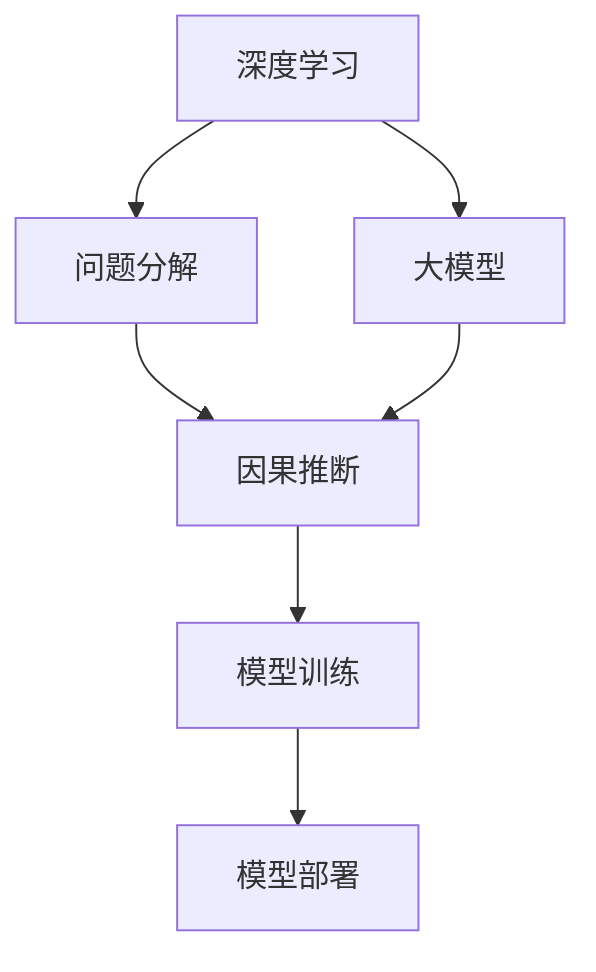
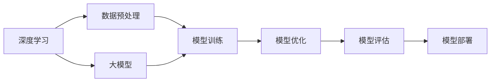
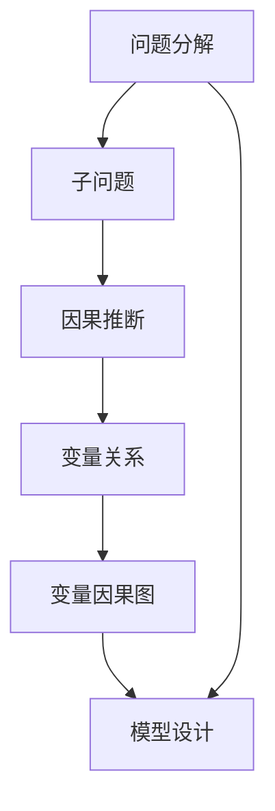
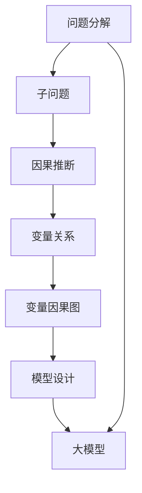
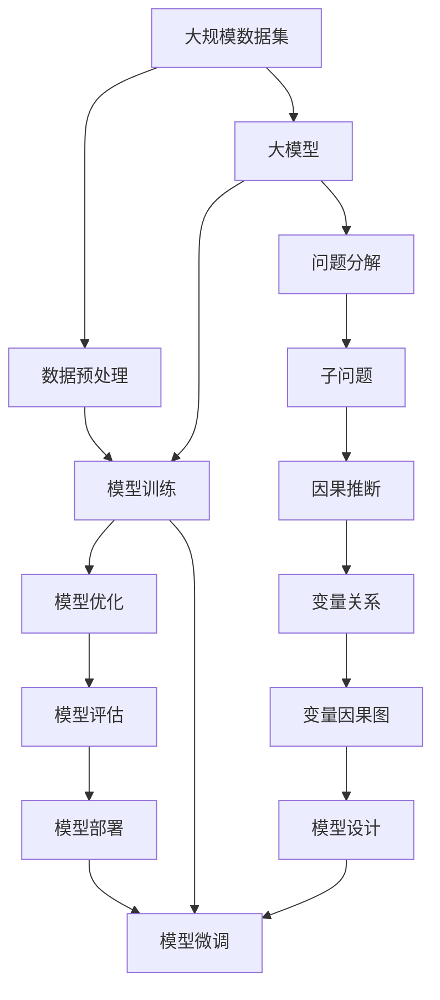

                 

# 抓住复杂问题本质的能力

> 关键词：复杂问题,深度学习,大模型,AI伦理,问题分解,因果推断

## 1. 背景介绍

### 1.1 问题由来

在人工智能(AI)领域，尤其是在深度学习(Deep Learning)和大模型(Big Model)的推动下，近年来，AI技术在处理复杂问题的能力上取得了显著突破。从自动驾驶、自然语言处理、医疗诊断到金融预测，AI应用场景不断扩展，解决的问题日益多样化。然而，复杂问题的本质和处理方式与传统问题有显著不同。如何抓住复杂问题的本质，并用高效、合理的方法进行求解，成为当前AI研究与开发的热点话题。

### 1.2 问题核心关键点

复杂问题的处理，不同于传统问题的求解，主要体现在以下几个方面：

1. **数据量巨大**：复杂问题往往涉及多维度、多模态的数据，数据量庞大，数据处理和特征工程成为难题。
2. **多因素影响**：复杂问题的求解通常涉及多个因素，每个因素对结果的影响不同，因素间相互作用复杂。
3. **非线性关系**：复杂问题常常存在非线性关系，模型训练和调参变得困难。
4. **动态环境**：复杂问题往往处于动态变化的环境中，模型需要实时适应新数据。
5. **结果不可解释**：复杂问题的求解过程往往使用黑盒模型，模型输出难以解释。

针对这些挑战，AI领域提出了诸多解决方法，包括使用大模型进行预训练、问题分解、因果推断等。

### 1.3 问题研究意义

掌握抓住复杂问题本质的能力，对于AI技术的发展和应用具有重要意义：

1. **提升模型性能**：通过理解和分解复杂问题，可以有效降低数据处理和特征工程的难度，提升模型的性能和泛化能力。
2. **提高问题求解效率**：通过合理的模型选择和参数设置，可以大幅缩短模型训练和调参的时间，提高问题求解的效率。
3. **增强模型可解释性**：通过因果推断等方法，可以使模型的决策过程更加透明，提升模型的可解释性和可靠性。
4. **保障数据和模型伦理**：通过模型输出解释和监控，可以避免模型在决策过程中产生偏见，确保数据和模型的伦理安全性。

本文将从深度学习、大模型、问题分解和因果推断等方面，深入探讨如何抓住复杂问题的本质，并提出有效的处理和求解策略。

## 2. 核心概念与联系

### 2.1 核心概念概述

为更好地理解如何抓住复杂问题的本质，本节将介绍几个密切相关的核心概念：

- **深度学习**：利用多层次的神经网络模型，从数据中提取抽象特征，进行复杂模式识别和预测。
- **大模型**：包含亿计参数的深度神经网络模型，通过预训练在大规模无标签数据上学习丰富的语言知识，提升模型处理复杂问题的能力。
- **问题分解**：将复杂问题拆解为多个子问题，分别进行求解，最后组合成整体解。
- **因果推断**：通过因果关系，理解变量间的相互作用，推理变量之间的因果关系，指导模型训练和决策过程。

这些核心概念之间的逻辑关系可以通过以下Mermaid流程图来展示：



这个流程图展示了大模型在深度学习中的应用过程，从问题分解和因果推断两个方面指导模型训练和部署。

### 2.2 概念间的关系

这些核心概念之间存在着紧密的联系，形成了AI处理复杂问题的完整生态系统。下面我通过几个Mermaid流程图来展示这些概念之间的关系。

#### 2.2.1 大模型在深度学习中的应用



这个流程图展示了大模型在深度学习中的基本应用流程，从数据预处理到模型评估和部署。

#### 2.2.2 问题分解与因果推断的关系



这个流程图展示了问题分解与因果推断的关系，通过分解问题成子问题，再利用因果推断理解变量间的关系，指导模型设计。

#### 2.2.3 问题分解与因果推断在大模型中的应用



这个流程图展示了问题分解与因果推断在大模型中的应用，通过分解问题成子问题，利用因果推断设计大模型。

### 2.3 核心概念的整体架构

最后，我们用一个综合的流程图来展示这些核心概念在大模型处理复杂问题的过程中，整体架构：



这个综合流程图展示了从数据预处理到模型部署的完整过程，通过问题分解和因果推断，设计并微调大模型，处理复杂问题。

## 3. 核心算法原理 & 具体操作步骤
### 3.1 算法原理概述

抓住复杂问题的本质，实质上是通过深度学习和因果推断，理解问题的本质结构和变量间的相互作用，从而设计出合理的模型和参数设置，进行有效求解。

大模型作为深度学习的一种形式，通过在大规模无标签数据上进行预训练，学习丰富的语言知识，能够有效处理复杂问题。而在问题求解过程中，通过问题分解和因果推断，可以将复杂问题拆解为多个子问题，逐一解决，最后组合成整体解。

### 3.2 算法步骤详解

1. **数据预处理**：收集并处理复杂问题的原始数据，包括数据清洗、特征工程、数据划分等。

2. **问题分解**：将复杂问题拆解成多个子问题，设计子问题的求解模型。

3. **因果推断**：通过因果推断，理解变量间的关系和因果关系，指导模型设计和调参。

4. **模型训练**：使用大模型在预训练基础上进行微调，训练子问题的求解模型。

5. **模型组合**：将子问题的求解模型组合成整体解的模型。

6. **模型评估与部署**：对整体解的模型进行评估和部署，实时适应新数据和环境。

### 3.3 算法优缺点

大模型和因果推断在处理复杂问题中具有以下优点：

1. **高效处理**：大模型能够高效处理复杂问题的特征提取，提高问题求解效率。
2. **泛化能力强**：大模型具有较强的泛化能力，能够适应不同的数据分布和环境变化。
3. **因果可解释**：因果推断能够解释模型决策的因果关系，提高模型的可解释性和可信度。

但这些方法也存在一定的局限性：

1. **计算资源需求高**：大模型和因果推断需要大量的计算资源，尤其是大模型的预训练和微调。
2. **模型复杂度高**：大模型和因果推断模型结构复杂，调参困难。
3. **数据隐私和安全问题**：复杂问题涉及敏感数据，模型训练和部署可能带来数据隐私和安全问题。

### 3.4 算法应用领域

基于大模型和因果推断的复杂问题处理方法，在多个领域得到广泛应用：

1. **自然语言处理**：通过问题分解和因果推断，设计大模型进行情感分析、机器翻译、文本生成等任务。
2. **医疗诊断**：通过问题分解和因果推断，设计大模型进行疾病诊断、治疗方案推荐等任务。
3. **金融预测**：通过问题分解和因果推断，设计大模型进行股票预测、信用风险评估等任务。
4. **智能交通**：通过问题分解和因果推断，设计大模型进行交通流量预测、自动驾驶决策等任务。
5. **智能制造**：通过问题分解和因果推断，设计大模型进行设备维护、生产调度等任务。

这些领域的应用展示了大模型和因果推断在处理复杂问题中的强大能力。

## 4. 数学模型和公式 & 详细讲解 & 举例说明
### 4.1 数学模型构建

在复杂问题处理中，数学模型的构建是关键。以下是几个常见的数学模型及其构建方法：

- **回归模型**：用于预测连续变量，公式为：
  $$
  y = f(x; \theta) = \theta^T x
  $$
  其中，$x$为输入特征向量，$y$为输出变量，$\theta$为模型参数。

- **分类模型**：用于预测离散变量，公式为：
  $$
  P(y=k|x;\theta) = \frac{\exp(z_k(x;\theta))}{\sum_{k=1}^K \exp(z_k(x;\theta))}
  $$
  其中，$k$为类别，$z_k(x;\theta)$为线性判别函数，$\theta$为模型参数。

- **神经网络模型**：用于处理复杂的非线性关系，公式为：
  $$
  h^{[l]} = g(\mathbf{W}^{[l]} h^{[l-1]} + \mathbf{b}^{[l]})
  $$
  其中，$h^{[l]}$为第$l$层隐藏层输出，$g$为激活函数，$\mathbf{W}^{[l]}$和$\mathbf{b}^{[l]}$为权重和偏置。

### 4.2 公式推导过程

以下以回归模型和神经网络模型为例，详细推导其公式：

1. **回归模型推导**：
  - 假设模型为线性回归模型，$y = f(x; \theta) = \theta^T x$。
  - 目标是最小化均方误差：
    $$
    \min_{\theta} \frac{1}{n}\sum_{i=1}^n (y_i - \theta^T x_i)^2
    $$
  - 根据梯度下降优化算法，更新参数$\theta$：
    $$
    \theta \leftarrow \theta - \eta \frac{1}{n}\sum_{i=1}^n 2(x_i - \theta^T x_i) x_i
    $$

2. **神经网络模型推导**：
  - 假设网络为多层感知机，$h^{[l]} = g(\mathbf{W}^{[l]} h^{[l-1]} + \mathbf{b}^{[l]})$。
  - 目标是最小化交叉熵损失：
    $$
    \min_{\theta} \frac{1}{n}\sum_{i=1}^n -y_i \log f(x_i; \theta) - (1-y_i) \log (1-f(x_i; \theta))
    $$
  - 根据梯度下降优化算法，更新参数$\theta$：
    $$
    \theta \leftarrow \theta - \eta \frac{1}{n}\sum_{i=1}^n [-y_i f(x_i; \theta) + (1-y_i) (1-f(x_i; \theta))] h^{[l-1]}
    $$

### 4.3 案例分析与讲解

以医疗诊断为例，展示如何构建和应用回归模型和神经网络模型：

1. **数据准备**：收集患者的历史病历、生化指标、影像数据等，标注患者是否患有某种疾病。
2. **问题分解**：将诊断问题分解为症状-疾病映射、生化指标-疾病映射、影像特征-疾病映射等子问题。
3. **模型设计**：设计回归模型和神经网络模型，分别用于处理不同的子问题。
4. **训练与调参**：使用大模型在预训练基础上进行微调，训练子问题的求解模型。
5. **模型组合**：将各个子问题的求解模型组合成整体诊断模型，进行患者诊断。

## 5. 项目实践：代码实例和详细解释说明
### 5.1 开发环境搭建

在进行复杂问题处理的项目实践中，开发环境搭建是第一步：

1. **安装Python**：
  ```bash
  sudo apt-get update
  sudo apt-get install python3
  ```

2. **安装TensorFlow和Keras**：
  ```bash
  pip install tensorflow keras
  ```

3. **安装PyTorch**：
  ```bash
  pip install torch torchvision
  ```

4. **安装MXNet**：
  ```bash
  pip install mxnet
  ```

### 5.2 源代码详细实现

以回归模型为例，展示如何使用TensorFlow实现复杂问题的求解：

```python
import tensorflow as tf
import numpy as np

# 准备数据
x = np.array([1, 2, 3, 4, 5, 6])
y = np.array([2, 4, 6, 8, 10, 12])

# 定义模型
model = tf.keras.Sequential([
    tf.keras.layers.Dense(units=1, input_shape=(1,))
])

# 编译模型
model.compile(optimizer=tf.keras.optimizers.Adam(learning_rate=0.01), loss='mse')

# 训练模型
model.fit(x, y, epochs=100, verbose=0)

# 预测
x_new = np.array([7])
y_pred = model.predict(x_new)
print(y_pred)
```

### 5.3 代码解读与分析

上述代码展示了如何使用TensorFlow实现一个简单的回归模型。关键步骤包括：

- **数据准备**：构建输入和输出变量，准备训练数据。
- **模型定义**：使用`Sequential`模型定义一层全连接层，用于线性回归。
- **模型编译**：使用Adam优化器和均方误差损失函数，编译模型。
- **模型训练**：使用训练数据，进行模型训练，设置迭代次数。
- **模型预测**：使用训练好的模型，对新数据进行预测。

## 6. 实际应用场景
### 6.1 智能客服系统

在智能客服系统中，通过问题分解和因果推断，可以设计出大模型进行智能问答和情感分析。具体流程如下：

1. **问题分解**：将客服咨询分解为常见问题解答、情感分析、意图识别等子问题。
2. **模型设计**：设计大模型分别处理各子问题。
3. **模型训练**：使用历史客服数据，对模型进行微调。
4. **模型部署**：将模型部署到客服系统中，实时响应客户咨询。

### 6.2 金融舆情监测

在金融舆情监测中，通过问题分解和因果推断，可以设计出大模型进行情感分析和预测。具体流程如下：

1. **问题分解**：将舆情分析分解为文本情感分析、舆情趋势预测等子问题。
2. **模型设计**：设计大模型分别处理各子问题。
3. **模型训练**：使用历史舆情数据，对模型进行微调。
4. **模型部署**：将模型部署到舆情监测系统中，实时监测金融舆情。

### 6.3 个性化推荐系统

在个性化推荐系统中，通过问题分解和因果推断，可以设计出大模型进行用户行为分析和推荐。具体流程如下：

1. **问题分解**：将推荐问题分解为用户行为分析、物品特征提取、推荐算法等子问题。
2. **模型设计**：设计大模型分别处理各子问题。
3. **模型训练**：使用用户行为数据和物品特征数据，对模型进行微调。
4. **模型部署**：将模型部署到推荐系统中，实时生成个性化推荐。

### 6.4 未来应用展望

未来，大模型和因果推断在处理复杂问题中的应用将更加广泛，技术将进一步成熟。以下是几个未来的应用方向：

1. **多模态融合**：通过结合视觉、语音等多模态信息，提升复杂问题处理的全面性。
2. **实时处理**：通过优化模型结构和算法，实现实时问题处理和决策。
3. **个性化定制**：通过深度学习模型，实现个性化定制的复杂问题处理。
4. **跨领域应用**：将大模型和因果推断应用于更多领域，提升问题的处理能力。

## 7. 工具和资源推荐
### 7.1 学习资源推荐

为了帮助开发者系统掌握大模型和因果推断的理论基础和实践技巧，这里推荐一些优质的学习资源：

1. **深度学习书籍**：
  - 《深度学习》（Ian Goodfellow, Yoshua Bengio, Aaron Courville著）
  - 《动手学深度学习》（李沐、陈云著）

2. **在线课程**：
  - Coursera上的《深度学习专项课程》
  - Udacity上的《深度学习纳米学位》

3. **开源项目**：
  - TensorFlow官方GitHub仓库
  - Keras官方GitHub仓库

### 7.2 开发工具推荐

高效的大模型和因果推断开发离不开优秀的工具支持。以下是几款常用的工具：

1. **PyTorch**：
  - 开源深度学习框架，动态计算图，适合研究。

2. **TensorFlow**：
  - 开源深度学习框架，支持静态图和动态图，适合工程应用。

3. **MXNet**：
  - 开源深度学习框架，支持分布式计算，适合大规模工程。

4. **MXNet Gluon**：
  - 基于MXNet的高级API，使用方便。

### 7.3 相关论文推荐

大模型和因果推断的研究源于学界的持续探索，以下是几篇奠基性的相关论文，推荐阅读：

1. **深度学习理论**：
  - 《深度学习》（Goodfellow et al.）

2. **大模型应用**：
  - 《Language Models are Unsupervised Multitask Learners》（Li et al.）

3. **因果推断**：
  - 《On the Shoulders of Giants: The Challenge of AI in the Information Age》（Bengio et al.）

这些论文代表了大模型和因果推断的发展脉络，通过学习这些前沿成果，可以帮助研究者把握学科前进方向，激发更多的创新灵感。

## 8. 总结：未来发展趋势与挑战
### 8.1 研究成果总结

本文对如何抓住复杂问题的本质进行了系统性介绍，并提出了有效的处理和求解策略。通过深度学习和大模型，结合问题分解和因果推断，可以高效处理复杂问题，提升模型性能和泛化能力。

### 8.2 未来发展趋势

未来，大模型和因果推断在处理复杂问题中的应用将更加广泛，技术将进一步成熟。以下是几个未来的发展趋势：

1. **多模态融合**：通过结合视觉、语音等多模态信息，提升复杂问题处理的全面性。
2. **实时处理**：通过优化模型结构和算法，实现实时问题处理和决策。
3. **个性化定制**：通过深度学习模型，实现个性化定制的复杂问题处理。
4. **跨领域应用**：将大模型和因果推断应用于更多领域，提升问题的处理能力。

### 8.3 面临的挑战

虽然大模型和因果推断在处理复杂问题中具有显著优势，但也面临以下挑战：

1. **计算资源需求高**：大模型和因果推断需要大量的计算资源，尤其是在大模型的预训练和微调过程中。
2. **模型复杂度高**：大模型和因果推断模型结构复杂，调参困难。
3. **数据隐私和安全问题**：复杂问题涉及敏感数据，模型训练和部署可能带来数据隐私和安全问题。

### 8.4 研究展望

为了应对上述挑战，未来研究需要从以下几个方向进行探索：

1. **优化计算资源**：通过分布式训练、模型压缩等技术，降低计算资源需求。
2. **简化模型结构**：通过结构化、模块化设计，降低模型复杂度，提高调参效率。
3. **增强数据隐私和安全**：通过差分隐私、联邦学习等技术，保护数据隐私，确保数据安全。

## 9. 附录：常见问题与解答

**Q1: 如何选择合适的模型？**

A: 选择合适的模型需要考虑问题的复杂度、数据量大小、资源限制等因素。一般来说，对于小规模数据，可以选择简单的线性模型；对于大规模数据，可以选择深度神经网络模型；对于资源受限的情况，可以选择轻量级模型或分布式训练。

**Q2: 如何理解模型的因果关系？**

A: 理解模型的因果关系可以通过因果推断方法，如因果图模型、因果回归模型等。通过绘制因果图，可以直观地理解变量间的因果关系，指导模型设计和调参。

**Q3: 如何处理多模态数据？**

A: 处理多模态数据可以通过模型融合、数据融合等方法。例如，可以使用注意力机制，将不同模态的信息整合到同一模型中进行处理。

**Q4: 如何提高模型的泛化能力？**

A: 提高模型的泛化能力可以通过正则化、早停等方法。此外，使用大模型进行预训练，可以提高模型对新数据的泛化能力。

**Q5: 如何降低计算资源需求？**

A: 降低计算资源需求可以通过模型压缩、分布式训练等方法。例如，可以使用低精度训练、剪枝等技术，减少模型参数量，提高计算效率。

通过回答这些问题，读者可以更好地理解大模型和因果推断在处理复杂问题中的原理和应用，为实际应用提供指导和参考。

---

作者：禅与计算机程序设计艺术 / Zen and the Art of Computer Programming

