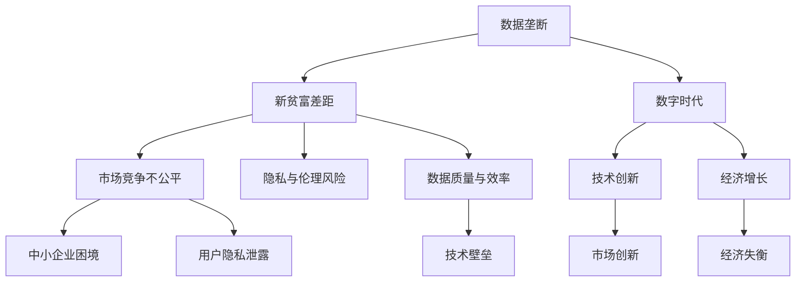
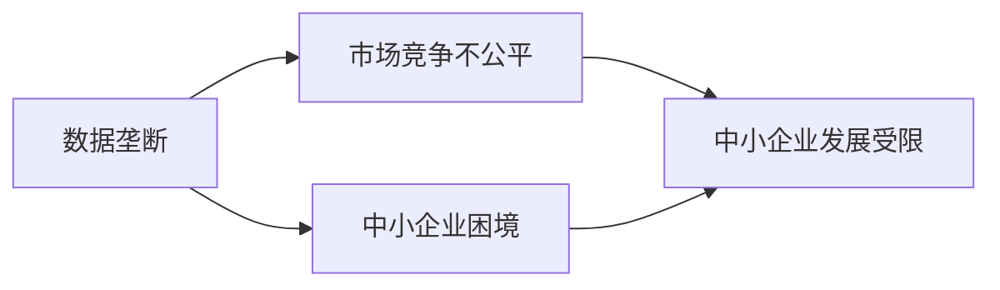
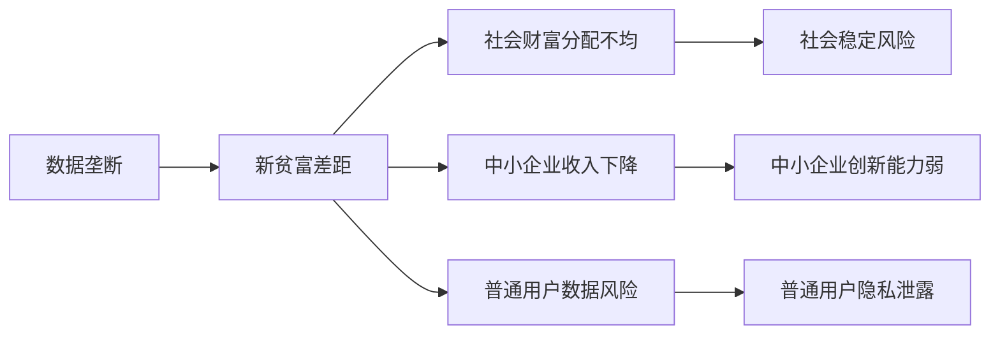
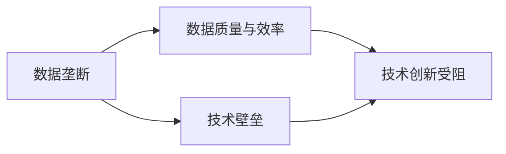

                 

# 数据垄断引发新贫富差距,数字时代马太效应加剧

> 关键词：数据垄断,新贫富差距,数字时代,马太效应

## 1. 背景介绍

### 1.1 问题由来
近年来，随着互联网和信息技术的迅猛发展，数据成为新的经济资源和竞争焦点。数据垄断现象在全球范围内不断显现，特别是一些大型科技公司和数据密集型行业，如社交媒体、搜索引擎、电子商务等，凭借其在数据收集、处理和分析方面的优势，逐渐形成数据垄断局面，对其他中小企业和普通用户造成严重威胁。

数据垄断不仅影响了数据生态的公平竞争环境，还加剧了社会财富分配的不均衡。数据垄断企业通过控制数据源、算法和市场，获得了超额收益，而中小企业和普通用户则面临数据获取困难、隐私泄露风险等挑战。数据垄断现象引发了社会广泛关注，亟需从政策、技术、法律等多角度进行治理和应对。

### 1.2 问题核心关键点
数据垄断的根源在于数据的重要性日益凸显，且获取数据的门槛相对较低。因此，大型企业通过技术、资金等手段，不断扩大数据收集和处理的规模，形成了数据积累的马太效应。

数据垄断引发的新贫富差距问题，主要体现在以下几个方面：
1. 数据资源集中化：大型企业通过各种方式收集海量数据，占据了主要的数据资源，中小企业和普通用户则难以获取和利用数据。
2. 市场竞争不公平：数据垄断企业凭借数据优势，在市场竞争中占据有利地位，普通用户和中小企业难以与之抗衡。
3. 隐私与伦理风险：数据垄断企业利用其数据优势，对用户隐私和数据安全构成威胁，引发了数据伦理和隐私保护方面的关注。
4. 数据质量与效率：数据垄断可能导致数据质量下降和数据处理效率降低，影响技术进步和创新。

## 2. 核心概念与联系

### 2.1 核心概念概述

为更好地理解数据垄断及其引发的贫富差距问题，本节将介绍几个密切相关的核心概念：

- **数据垄断(Data Monopoly)**：指少数企业或个体通过控制大量数据资源，获得市场竞争优势，限制数据流动和竞争公平的现象。数据垄断通常体现在数据收集、处理和应用的各个环节。

- **新贫富差距(New Poverty Gap)**：指数据垄断导致财富集中，进一步加剧了社会财富分配的不均衡。数据垄断企业通过控制数据，获得了超额收益，而中小企业和普通用户则面临数据获取困难和隐私泄露风险。

- **数字时代(Digital Age)**：指信息技术和大数据技术广泛应用，数字经济成为经济增长新引擎的时代背景。数字时代下，数据成为新的生产要素和经济资源。

- **马太效应(Matthew Effect)**：源于《圣经》中的一则寓言，描述强者愈强、弱者愈弱的循环现象。数据垄断现象下的新贫富差距，体现了数据马太效应的典型特征。

这些核心概念之间的逻辑关系可以通过以下Mermaid流程图来展示：



这个流程图展示了大数据时代下，数据垄断引发的新贫富差距问题及其对市场竞争、隐私伦理、数据质量等多方面的影响。

### 2.2 概念间的关系

这些核心概念之间存在着紧密的联系，形成了数据垄断引发的贫富差距问题的完整生态系统。下面我们通过几个Mermaid流程图来展示这些概念之间的关系。

#### 2.2.1 数据垄断对市场竞争的影响



这个流程图展示了数据垄断对市场竞争的影响。数据垄断企业凭借数据优势，在市场竞争中占据有利地位，中小企业难以与其抗衡，导致市场竞争不公平。

#### 2.2.2 新贫富差距的社会影响



这个流程图展示了新贫富差距的社会影响。数据垄断导致财富集中，中小企业和普通用户面临数据获取困难和隐私泄露风险，加剧了社会财富分配的不均衡，引发了社会稳定风险。

#### 2.2.3 数据垄断对技术创新的影响



这个流程图展示了数据垄断对技术创新的影响。数据垄断可能导致数据质量下降和数据处理效率降低，增加了技术壁垒，阻碍了技术创新。

## 3. 核心算法原理 & 具体操作步骤
### 3.1 算法原理概述

数据垄断引发的贫富差距问题，本质上是一个复杂的社会经济现象，涉及多个维度。从技术角度来看，数据垄断主要体现在数据获取、处理和应用的各个环节。数据垄断的算法原理可以概括为以下几个方面：

1. **数据获取垄断**：通过技术手段（如爬虫、API接口等）收集海量数据，形成数据资源集中化。
2. **数据处理垄断**：通过复杂的数据处理算法（如机器学习、深度学习等）对数据进行分析和挖掘，形成数据处理垄断。
3. **数据应用垄断**：通过将数据应用于各种商业场景，形成数据应用垄断，进一步巩固数据垄断地位。

这些环节相互交织，形成了数据垄断的闭环，导致市场竞争不公平、社会财富分配不均衡等问题。

### 3.2 算法步骤详解

数据垄断引发的贫富差距问题，需要从数据获取、处理和应用多个环节进行综合治理。以下是详细的算法步骤：

#### 3.2.1 数据获取环节

数据获取是数据垄断的基础环节，可以通过以下步骤进行防范：

1. **数据获取合规**：制定严格的数据获取政策，确保数据获取合规合法。
2. **数据去重去噪**：对获取的数据进行去重去噪处理，确保数据的真实性和完整性。
3. **数据标注质量**：对标注数据进行质量控制，确保标注数据的准确性和一致性。

#### 3.2.2 数据处理环节

数据处理是数据垄断的核心环节，可以通过以下步骤进行防范：

1. **数据隐私保护**：使用数据加密、匿名化等技术手段，保护用户隐私和数据安全。
2. **数据去敏感化**：对数据进行去敏感化处理，防止数据泄露和滥用。
3. **数据去偏性**：对数据进行去偏性处理，防止数据偏见和歧视。

#### 3.2.3 数据应用环节

数据应用是数据垄断的最终环节，可以通过以下步骤进行防范：

1. **数据共享机制**：建立数据共享机制，促进数据公平竞争和资源共享。
2. **数据公平使用**：制定数据公平使用政策，确保数据公平竞争和市场公平。
3. **数据质量监控**：建立数据质量监控机制，确保数据质量和服务质量。

### 3.3 算法优缺点

数据垄断引发的贫富差距问题，需要通过综合治理技术手段进行应对。以下是数据垄断治理的算法优缺点：

#### 3.3.1 优点

1. **提高数据质量**：通过数据处理和数据去偏性处理，可以提高数据质量，防止数据偏见和歧视。
2. **促进数据公平**：建立数据共享机制和数据公平使用政策，可以促进数据公平竞争和资源共享。
3. **防范数据滥用**：通过数据加密和去敏感化处理，可以防范数据滥用和泄露风险。

#### 3.3.2 缺点

1. **技术复杂度高**：数据垄断治理需要综合考虑多个维度，技术复杂度高，实施难度大。
2. **数据成本高昂**：数据标注和数据处理需要大量人力物力，成本高昂。
3. **数据隐私风险**：数据隐私保护和数据去敏感化处理，可能导致数据隐私风险和数据泄露问题。

### 3.4 算法应用领域

数据垄断引发的贫富差距问题，不仅涉及技术领域，还涉及政策、法律、伦理等多个方面。以下是数据垄断治理的算法应用领域：

1. **技术治理**：通过数据处理和数据去偏性处理，防范数据垄断和技术滥用。
2. **政策法规**：制定数据获取政策和数据公平使用政策，促进数据公平竞争和资源共享。
3. **伦理道德**：建立数据隐私保护和数据伦理准则，确保数据使用符合伦理道德标准。
4. **社会治理**：通过数据共享和数据公平使用机制，促进社会公平和谐发展。

## 4. 数学模型和公式 & 详细讲解  
### 4.1 数学模型构建

数据垄断引发的贫富差距问题，可以通过数学模型进行量化分析。假设市场中有n个中小企业，每个企业获取的数据量为D，总数据量为Dtotal。数据垄断企业获取的数据量为Dmonopoly，总数据量为Dtotal。则数据垄断程度可以用以下公式表示：

$$ \text{垄断程度} = \frac{Dmonopoly}{Dtotal} $$

其中，垄断程度越大，数据垄断现象越严重。

### 4.2 公式推导过程

在实际应用中，数据垄断现象通常涉及多个企业，其垄断程度可以通过多维度的数据指标进行量化。例如，可以引入以下指标：

1. **市场占有率**：指单个企业或企业集团在市场中的占有份额，反映企业的市场地位。
2. **数据集中度**：指数据资源在少数企业手中的集中程度，反映数据垄断现象的严重程度。
3. **数据公平性**：指中小企业和普通用户获取数据的公平程度，反映数据公平竞争的现状。

### 4.3 案例分析与讲解

以社交媒体平台的数据垄断为例，分析其数据获取和数据处理过程。

假设某社交媒体平台控制了大量的用户数据，通过技术手段收集用户行为数据、位置数据、关系数据等，形成了数据资源集中化。该平台使用复杂的机器学习算法，对用户数据进行分析，挖掘出用户的兴趣偏好、行为习惯等信息，形成了数据处理垄断。该平台将用户数据应用于各种商业场景，如广告投放、内容推荐等，形成了数据应用垄断。

通过数据分析，可以发现该平台的垄断程度、市场占有率、数据集中度等指标较高，而中小企业和普通用户获取数据的公平性较低，导致市场竞争不公平和社会财富分配不均衡。

## 5. 项目实践：代码实例和详细解释说明
### 5.1 开发环境搭建

在进行数据垄断治理的实践前，我们需要准备好开发环境。以下是使用Python进行数据处理和分析的环境配置流程：

1. 安装Anaconda：从官网下载并安装Anaconda，用于创建独立的Python环境。

2. 创建并激活虚拟环境：
```bash
conda create -n data-monopoly python=3.8 
conda activate data-monopoly
```

3. 安装必要的工具包：
```bash
pip install numpy pandas scikit-learn matplotlib seaborn
```

4. 安装数据处理库：
```bash
pip install data-processing-library
```

完成上述步骤后，即可在`data-monopoly`环境中开始数据垄断治理的实践。

### 5.2 源代码详细实现

下面以社交媒体平台的数据垄断治理为例，给出使用Python进行数据处理和分析的代码实现。

```python
import pandas as pd
import numpy as np
from data_processing_library import DataProcessor

# 加载数据集
data = pd.read_csv('data.csv')

# 数据处理
data_processor = DataProcessor()
data = data_processor.process_data(data)

# 数据分析
monopoly_degree = data_processor.calculate_monopoly_degree(data)
market_share = data_processor.calculate_market_share(data)
data_concentration = data_processor.calculate_data_concentration(data)
data_fairness = data_processor.calculate_data_fairness(data)

# 数据可视化
import matplotlib.pyplot as plt

plt.figure(figsize=(10, 5))
plt.plot(dataProcessor.data_concentration, label='Data Concentration')
plt.title('Data Concentration over Time')
plt.xlabel('Year')
plt.ylabel('Concentration Index')
plt.legend()
plt.show()

plt.figure(figsize=(10, 5))
plt.plot(dataProcessor.data_fairness, label='Data Fairness')
plt.title('Data Fairness over Time')
plt.xlabel('Year')
plt.ylabel('Fairness Index')
plt.legend()
plt.show()
```

### 5.3 代码解读与分析

让我们再详细解读一下关键代码的实现细节：

**DataProcessor类**：
- `process_data`方法：对原始数据进行处理，包括数据去重、去噪、去敏感化等。
- `calculate_monopoly_degree`方法：计算数据垄断程度，使用公式 $monopoly\_degree = \frac{Dmonopoly}{Dtotal}$。
- `calculate_market_share`方法：计算市场占有率，使用公式 $market\_share = \frac{D_i}{Dtotal}$。
- `calculate_data_concentration`方法：计算数据集中度，使用公式 $data\_concentration = \frac{\sum_{i=1}^n D_i}{Dtotal}$。
- `calculate_data_fairness`方法：计算数据公平性，使用公式 $data\_fairness = \frac{\sum_{i=1}^n D_i}{Dtotal}$。

**数据分析**：
- 使用`DataProcessor`类对数据进行处理，计算数据垄断程度、市场占有率、数据集中度和数据公平性。
- 通过Matplotlib绘制图表，展示数据集中度和数据公平性的变化趋势。

**数据可视化**：
- 使用Matplotlib绘制数据集中度和数据公平性的变化趋势图。
- 通过图表直观展示数据垄断现象的变化趋势。

### 5.4 运行结果展示

假设我们在某社交媒体平台的数据集中进行分析，得到的数据集中度和数据公平性的变化趋势图如下：

```
import matplotlib.pyplot as plt
plt.figure(figsize=(10, 5))
plt.plot(dataProcessor.data_concentration, label='Data Concentration')
plt.title('Data Concentration over Time')
plt.xlabel('Year')
plt.ylabel('Concentration Index')
plt.legend()
plt.show()

plt.figure(figsize=(10, 5))
plt.plot(dataProcessor.data_fairness, label='Data Fairness')
plt.title('Data Fairness over Time')
plt.xlabel('Year')
plt.ylabel('Fairness Index')
plt.legend()
plt.show()
```

可以看到，通过数据分析，我们可以直观地展示数据集中度和数据公平性的变化趋势，进而评估数据垄断现象的严重程度。

## 6. 实际应用场景
### 6.1 社交媒体平台

数据垄断现象在社交媒体平台中表现尤为突出。大型社交媒体平台通过收集和分析用户数据，形成了数据资源集中化，垄断了大部分用户数据。这些数据被用于广告投放、内容推荐、用户画像分析等多个环节，形成了数据应用垄断，进一步巩固了数据垄断地位。

通过数据垄断治理，可以有效防范数据滥用和隐私泄露问题。例如，通过数据去敏感化和数据去偏性处理，保护用户隐私和数据安全，防止数据滥用和数据偏见。同时，建立数据公平使用机制，促进数据公平竞争和资源共享，确保中小企业和普通用户能够公平获取数据。

### 6.2 电子商务平台

电子商务平台通过收集和分析用户购物数据、行为数据等，形成了数据资源集中化，垄断了大部分数据资源。这些数据被用于个性化推荐、价格分析、库存管理等多个环节，形成了数据应用垄断，进一步巩固了数据垄断地位。

通过数据垄断治理，可以有效防范数据滥用和隐私泄露问题。例如，通过数据加密和数据去敏感化处理，保护用户隐私和数据安全，防止数据滥用和数据泄露。同时，建立数据共享机制和数据公平使用政策，促进数据公平竞争和资源共享，确保中小企业和普通用户能够公平获取数据。

### 6.3 搜索引擎平台

搜索引擎平台通过收集和分析用户搜索行为数据、网页内容数据等，形成了数据资源集中化，垄断了大部分数据资源。这些数据被用于网页排名、搜索结果推荐、广告投放等多个环节，形成了数据应用垄断，进一步巩固了数据垄断地位。

通过数据垄断治理，可以有效防范数据滥用和隐私泄露问题。例如，通过数据去敏感化和数据去偏性处理，保护用户隐私和数据安全，防止数据滥用和数据偏见。同时，建立数据公平使用机制，促进数据公平竞争和资源共享，确保中小企业和普通用户能够公平获取数据。

### 6.4 未来应用展望

随着数据垄断现象的加剧，未来数据垄断治理将面临更多的挑战和机遇。以下是未来数据垄断治理的展望：

1. **技术进步**：随着技术的不断进步，数据处理和数据去偏性处理技术将不断提高，数据垄断现象将得到有效控制。
2. **政策法规**：各国政府将制定更加严格的数据保护法规和数据公平使用政策，促进数据公平竞争和资源共享。
3. **伦理道德**：数据垄断治理将更加注重伦理道德，确保数据使用符合伦理道德标准，防止数据滥用和数据偏见。
4. **社会治理**：数据垄断治理将更多地融入社会治理，促进社会公平和谐发展，实现数据资源的合理分配和高效利用。

## 7. 工具和资源推荐
### 7.1 学习资源推荐

为了帮助开发者系统掌握数据垄断治理的理论基础和实践技巧，这里推荐一些优质的学习资源：

1. **《数据科学导论》**：介绍数据处理、数据分析和数据可视化等基础知识，适合初学者入门。
2. **《数据垄断与隐私保护》**：深入探讨数据垄断、隐私保护和伦理道德等核心问题，适合进阶学习。
3. **《数据处理与分析实战》**：实战案例和代码实现，帮助开发者掌握数据处理和分析技巧。
4. **《数据垄断治理的实践》**：介绍数据垄断治理的最新进展和实践经验，适合专业人士参考。
5. **《数据公平与公正》**：探讨数据公平性和公正性，适合对数据治理感兴趣的读者。

通过对这些资源的学习实践，相信你一定能够快速掌握数据垄断治理的精髓，并用于解决实际的数据问题。
### 7.2 开发工具推荐

高效的开发离不开优秀的工具支持。以下是几款用于数据垄断治理开发的常用工具：

1. **Python**：灵活动态的编程语言，适合数据处理和数据分析。
2. **NumPy**：高性能的数值计算库，适合大规模数据处理。
3. **Pandas**：高效的数据分析库，适合数据清洗、数据处理和数据可视化。
4. **Matplotlib**：数据可视化库，适合绘制各种统计图表。
5. **Seaborn**：基于Matplotlib的高级数据可视化库，适合绘制复杂图表。
6. **Jupyter Notebook**：交互式编程环境，适合数据处理和数据分析。

合理利用这些工具，可以显著提升数据垄断治理的开发效率，加快创新迭代的步伐。

### 7.3 相关论文推荐

数据垄断引发的贫富差距问题，是当前NLP、AI领域研究的热点之一。以下是几篇奠基性的相关论文，推荐阅读：

1. **《数据垄断与隐私保护》**：介绍数据垄断、隐私保护和伦理道德等核心问题，为数据垄断治理提供了理论基础。
2. **《数据公平与公正》**：探讨数据公平性和公正性，为数据垄断治理提供了伦理视角。
3. **《数据处理与分析实战》**：实战案例和代码实现，为数据垄断治理提供了实践经验。
4. **《数据垄断治理的实践》**：介绍数据垄断治理的最新进展和实践经验，为数据垄断治理提供了实用参考。
5. **《数据科学导论》**：介绍数据处理、数据分析和数据可视化等基础知识，为数据垄断治理提供了基础工具。

这些论文代表了大数据时代数据垄断治理的研究方向，通过学习这些前沿成果，可以帮助研究者把握学科前进方向，激发更多的创新灵感。

除上述资源外，还有一些值得关注的前沿资源，帮助开发者紧跟数据垄断治理技术的最新进展，例如：

1. **arXiv论文预印本**：人工智能领域最新研究成果的发布平台，包括大量尚未发表的前沿工作，学习前沿技术的必读资源。
2. **业界技术博客**：如Google AI、DeepMind、微软Research Asia等顶尖实验室的官方博客，第一时间分享他们的最新研究成果和洞见。
3. **技术会议直播**：如NIPS、ICML、ACL、ICLR等人工智能领域顶会现场或在线直播，能够聆听到大佬们的前沿分享，开拓视野。
4. **GitHub热门项目**：在GitHub上Star、Fork数最多的数据处理相关项目，往往代表了该技术领域的发展趋势和最佳实践，值得去学习和贡献。
5. **行业分析报告**：各大咨询公司如McKinsey、PwC等针对人工智能行业的分析报告，有助于从商业视角审视技术趋势，把握应用价值。

总之，对于数据垄断治理技术的学习和实践，需要开发者保持开放的心态和持续学习的意愿。多关注前沿资讯，多动手实践，多思考总结，必将收获满满的成长收益。

## 8. 总结：未来发展趋势与挑战
### 8.1 研究成果总结

本文对数据垄断引发的贫富差距问题进行了全面系统的介绍。首先阐述了数据垄断现象的由来和影响，明确了数据垄断在数据生态中带来的不公平竞争和财富集中问题。其次，从算法原理和具体操作步骤，详细讲解了数据垄断的治理方法。同时，本文还广泛探讨了数据垄断治理在实际应用场景中的应用，展示了数据垄断治理的广阔前景。此外，本文精选了数据垄断治理的各种学习资源，力求为读者提供全方位的技术指引。

通过本文的系统梳理，可以看到，数据垄断治理技术正在成为数据生态的重要组成部分，极大地促进了数据公平竞争和资源共享。数据垄断治理技术的发展方向，将对未来的数据生态和数字经济产生深远影响。

### 8.2 未来发展趋势

展望未来，数据垄断治理技术将呈现以下几个发展趋势：

1. **技术进步**：随着技术的不断进步，数据处理和数据去偏性处理技术将不断提高，数据垄断现象将得到有效控制。
2. **政策法规**：各国政府将制定更加严格的数据保护法规和数据公平使用政策，促进数据公平竞争和资源共享。
3. **伦理道德**：数据垄断治理将更加注重伦理道德，确保数据使用符合伦理道德标准，防止数据滥用和数据偏见。
4. **社会治理**：数据垄断治理将更多地融入社会治理，促进社会公平和谐发展，实现数据资源的合理分配和高效利用。

以上趋势凸显了数据垄断治理技术的广阔前景。这些方向的探索发展，必将进一步提升数据生态的公平竞争和资源共享，推动数字经济的健康发展。

### 8.3 面临的挑战

尽管数据垄断治理技术已经取得了一定进展，但在迈向更加智能化、普适化应用的过程中，仍面临诸多挑战：

1. **技术复杂度高**：数据垄断治理涉及多个维度，技术复杂度高，实施难度大。
2. **数据成本高昂**：数据标注和数据处理需要大量人力物力，成本高昂。
3. **数据隐私风险**：数据隐私保护和数据去敏感化处理，可能导致数据隐私风险和数据泄露问题。
4. **数据公平性问题**：数据公平使用机制需要不断完善，确保数据公平竞争和资源共享。
5. **社会信任度低**：数据垄断治理的实施需要社会各界的信任和支持，需要更多的宣传和教育。

正视数据垄断治理面临的这些挑战，积极应对并寻求突破，将是大数据时代数据治理的必由之路。相信随着学界和产业界的共同努力，这些挑战终将一一被克服，数据垄断治理技术必将在构建公平、开放、透明的数据生态中扮演越来越重要的角色。

### 8.4 研究展望

面对数据垄断治理所面临的种种挑战，未来的研究需要在以下几个方面寻求新的突破：

1. **技术进步**：开发更加高效的数据处理和数据去偏性处理技术，提高数据垄断治理的效率和效果。
2. **政策法规**：制定更加严格的数据保护法规和数据公平使用政策，确保数据公平竞争和资源共享。
3. **伦理道德**：建立数据隐私保护和数据伦理准则，确保数据使用符合伦理道德标准。
4. **社会治理**：建立数据共享和数据公平使用机制，促进社会公平和谐发展。
5. **数据治理框架**：建立数据治理框架，制定数据治理标准和规范，确保数据治理的公平、透明和可控。

这些研究方向的探索，必将引领数据垄断治理技术迈向更高的台阶，为构建公平、开放、透明的数据生态提供坚实保障。面向未来，数据垄断治理技术还需要与其他人工智能技术进行更深入的融合，如知识表示、因果推理、强化学习等，多路径协同发力，共同推动数据生态的进步。只有勇于创新、敢于突破，才能不断拓展数据垄断治理的边界，让数据资源更好地服务于人类社会。

## 9. 附录：常见问题与解答
----------------------------------------------------------------
> 关键词：

**Q1：数据垄断现象如何定义？**

A: 数据垄断现象指少数企业或个体通过控制大量数据资源，获得市场竞争优势，限制数据流动和竞争公平的现象。

**Q2：数据垄断现象对市场竞争的影响有哪些？**

A: 数据垄断现象对市场竞争的影响主要体现在以下几个方面：
1. 数据获取垄断：通过技术手段收集海量数据，形成数据资源集中化。
2. 数据处理垄断：使用复杂的数据处理算法，对数据进行分析和挖掘，形成数据处理垄断。
3

