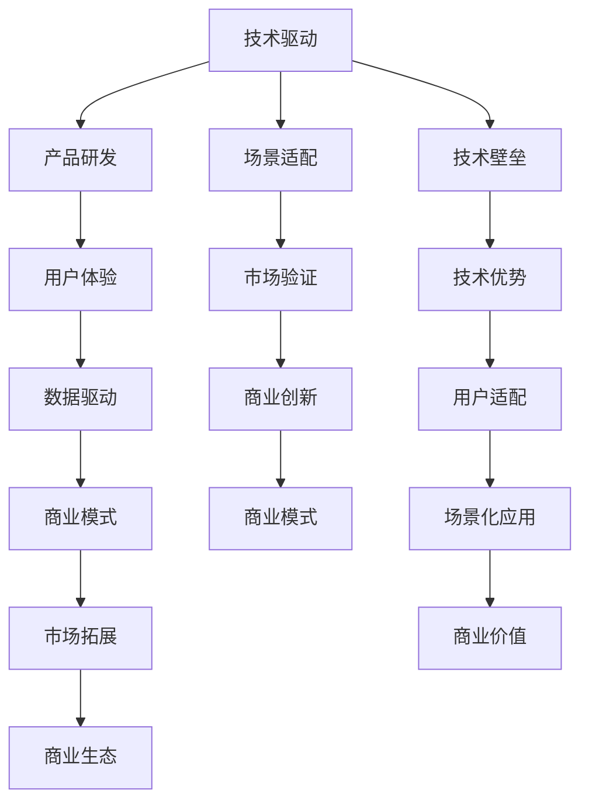
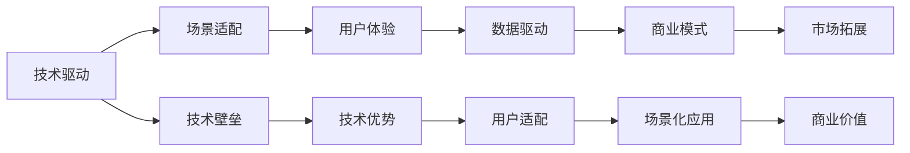
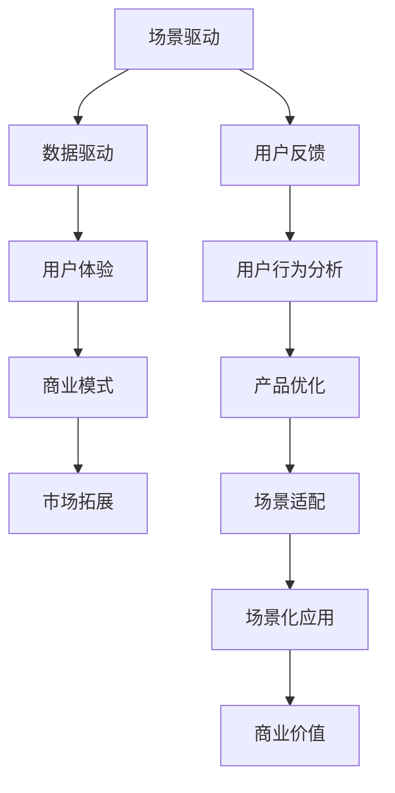
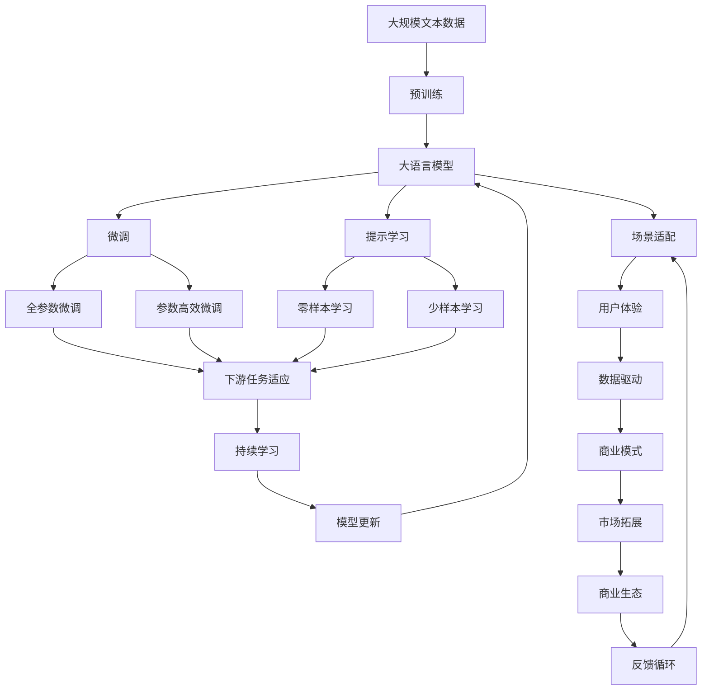

                 

# 大模型创业者的商业模式创新：从技术驱动到场景驱动

大语言模型等先进AI技术的应用，正在深刻改变各行业的业务模式。越来越多的AI创业者已经意识到，仅有先进技术并不足以带来商业成功，而要将技术驱动和场景驱动相结合，才能创造出真正意义上的商业价值。本文将深入探讨AI创业公司的商业模式创新，从技术驱动到场景驱动的转变，以及如何在不同的场景中，利用AI技术创造独特的商业机会。

## 1. 背景介绍

### 1.1 问题由来

人工智能(AI)技术已经逐步从实验室走向产业界，引领了新一轮的商业革命。从无人驾驶、智能客服到金融量化、医疗诊断，各行各业都在探索AI的商业化应用。然而，在这一过程中，不少AI创业者面临着技术落地难的挑战，归根结底，是他们在商业化过程中的定位不准确、商业模式未成熟。

AI创业者往往过于重视技术本身，忽略了技术应用场景的潜力和价值。例如，一款AI语音助手，如果没有考虑到用户的使用场景和习惯，无论其技术多么先进，最终也只能沦为一件“巧妇难为无米之炊”的摆设。因此，如何将AI技术融入具体的业务场景中，创造出实际的商业价值，是AI创业成功的关键。

### 1.2 问题核心关键点

AI创业成功的关键在于从技术驱动到场景驱动的转变，具体体现在以下几个方面：

- **用户需求洞察**：深入理解用户的真实需求和痛点，确保技术解决方案能精准满足用户需求。
- **场景适配能力**：根据不同的应用场景，设计和开发适配的AI技术，提升产品竞争力。
- **商业模式创新**：结合技术优势和场景需求，创新商业模式，打造独特的商业模型。
- **数据驱动决策**：通过大数据分析和用户反馈，不断优化产品设计和业务流程。

这些关键点要求AI创业者从单纯的技术研发者，转变为全面的商业模式设计师和场景解决方案专家。

### 1.3 问题研究意义

研究和探讨大模型创业者的商业模式创新，对于AI创业公司的健康发展具有重要意义：

- **降低技术落地难度**：通过场景驱动的商业模式设计，可以降低技术在实际应用中的落地难度，提升产品的市场接受度。
- **提升商业价值**：场景适配的AI产品能更好地满足用户需求，实现高价值商业变现。
- **加速技术成熟**：在实际应用中不断迭代优化，促进AI技术的快速成熟和商业化应用。
- **构建创新生态**：场景驱动的商业模式创新，有助于构建独特的创新生态系统，吸引更多合作伙伴和资源。
- **增强市场竞争力**：结合技术优势和场景需求，打造差异化的产品和服务，增强市场竞争力。

## 2. 核心概念与联系

### 2.1 核心概念概述

为更好地理解AI创业公司的商业模式创新，本节将介绍几个密切相关的核心概念：

- **技术驱动**：指的是创业者主要依赖技术创新驱动企业发展，重视研发投入和技术突破。
- **场景驱动**：指创业者更多地关注用户实际需求和应用场景，结合技术优势，设计有针对性的产品和服务。
- **商业生态**：指创业者构建的涵盖技术、产品、市场、服务等多元化的商业生态系统，形成完整的商业闭环。
- **用户体验**：指创业者从用户角度出发，设计和优化产品功能和服务体验，提升用户满意度。
- **数据驱动**：指创业者利用大数据分析和用户反馈，不断优化产品设计，提升决策精准度。

这些概念之间的逻辑关系可以通过以下Mermaid流程图来展示：



这个流程图展示了大模型创业者在技术驱动和场景驱动模式下的核心概念关系：

1. 技术驱动阶段，创业者主要关注技术创新和产品研发。
2. 随着技术成熟，创业者需要重视用户体验和数据驱动，进一步优化产品功能和服务。
3. 场景驱动阶段，创业者将场景适配和技术优势结合，设计有针对性的产品和服务。
4. 商业生态建设，创业者构建涵盖技术、产品、市场、服务等多元化的商业生态系统。

### 2.2 概念间的关系

这些核心概念之间存在着紧密的联系，形成了大模型创业者的商业模式创新框架。下面我们通过几个Mermaid流程图来展示这些概念之间的关系。

#### 2.2.1 技术驱动与场景驱动的融合



这个流程图展示了大模型创业者在技术驱动和场景驱动的融合过程中，各个概念之间的关系。

#### 2.2.2 数据驱动与场景驱动的结合



这个流程图展示了数据驱动与场景驱动结合的过程，以及它们对用户体验和商业模式的影响。

### 2.3 核心概念的整体架构

最后，我们用一个综合的流程图来展示这些核心概念在大模型创业者商业模式创新过程中的整体架构：



这个综合流程图展示了从预训练到微调，再到场景适配的完整过程。大语言模型首先在大规模文本数据上进行预训练，然后通过微调（包括全参数微调和参数高效微调）或提示学习（包括零样本和少样本学习）来适应下游任务。最后，通过场景适配和用户体验优化，结合数据驱动和商业模式创新，构建完整的商业生态系统。 通过这些流程图，我们可以更清晰地理解大模型创业者商业模式创新的整体框架，为后续深入讨论具体的商业模式创新方法和技术奠定基础。

## 3. 核心算法原理 & 具体操作步骤
### 3.1 算法原理概述

大语言模型创业者的商业模式创新，本质上是一个结合技术优势和用户需求的优化过程。其核心思想是：

- 通过技术驱动，不断提升AI产品的功能和性能。
- 结合场景驱动，设计贴合用户实际需求的产品和服务。
- 利用数据驱动，不断优化产品体验和商业模式。

形式化地，假设产品需求为 $D$，技术优势为 $T$，场景需求为 $S$，商业模式为 $B$。结合技术驱动和场景驱动的原则，商业模式创新的数学模型为：

$$
B = f(D, T, S)
$$

其中，$f$ 为产品需求、技术优势和场景需求映射到商业模式的函数，具体形式依赖于不同的商业模式。例如， could be B2B、B2C、SaaS 等。

### 3.2 算法步骤详解

大模型创业者商业模式创新的具体步骤如下：

**Step 1: 确定商业模式目标**

- 明确产品的商业模式目标，如利润最大化、市场占有率提升、用户满意度提升等。
- 结合业务特点和市场需求，确定产品的主要功能和性能指标。

**Step 2: 进行技术研发和产品设计**

- 在技术驱动的阶段，集中精力进行技术研发，提升产品功能和性能。
- 通过场景驱动，深入分析用户需求和痛点，设计贴合用户实际场景的产品。
- 利用数据驱动，不断优化产品体验和商业模式。

**Step 3: 市场验证和迭代优化**

- 将产品推向市场，进行初步的市场验证，收集用户反馈和数据。
- 根据用户反馈和数据分析，不断迭代优化产品功能和用户体验。
- 结合市场需求和竞争环境，调整商业模式和市场策略。

**Step 4: 构建商业生态**

- 构建涵盖技术、产品、市场、服务等多元化的商业生态系统。
- 吸引合作伙伴和资源，形成完整的商业闭环，增强产品的市场竞争力。
- 利用商业生态，不断提升产品价值和用户满意度。

### 3.3 算法优缺点

**优点**：
- 结合技术优势和场景需求，设计有针对性的产品和服务，提升产品竞争力。
- 通过持续迭代优化，提升产品体验和商业模式。
- 构建多元化的商业生态系统，增强产品的市场竞争力。

**缺点**：
- 需要较长时间进行产品研发和市场验证。
- 投入较大，尤其是前期技术研发和市场推广的投入。
- 需要持续优化和调整，才能保持市场竞争力。

### 3.4 算法应用领域

大语言模型创业者的商业模式创新，适用于各类AI产品和服务，包括但不限于：

- 智能客服系统：结合技术优势和场景需求，设计贴合用户实际需求的智能客服系统。
- 金融量化策略：利用先进AI技术，提供高性能、高精度的金融量化策略。
- 医疗诊断系统：结合医疗领域实际需求，开发精准高效的医疗诊断系统。
- 智能推荐系统：通过技术驱动和场景驱动，设计贴合用户需求的个性化推荐系统。
- 智能制造系统：结合制造领域需求，开发高效、智能的制造系统。

除了上述这些经典应用场景，大模型创业者还可以结合自身技术优势和市场需求，探索更多创新的商业模式。

## 4. 数学模型和公式 & 详细讲解  
### 4.1 数学模型构建

本节将使用数学语言对大模型创业者商业模式创新的过程进行更加严格的刻画。

假设产品需求为 $D$，技术优势为 $T$，场景需求为 $S$，商业模式为 $B$。商业模式创新的数学模型为：

$$
B = f(D, T, S)
$$

其中，$f$ 为产品需求、技术优势和场景需求映射到商业模式的函数。

### 4.2 公式推导过程

以下我们以智能客服系统为例，推导商业模式的数学模型及其推导过程。

假设用户需求 $D$ 为提高客服响应速度和准确率，技术优势 $T$ 为先进的自然语言处理技术和大规模预训练语言模型，场景需求 $S$ 为7x24小时不间断服务。

设产品需求 $D$ 为提高客服响应速度和准确率，则商业模式的目标可以表达为：

$$
B = \max_{D, T, S} \{\text{利润} + \text{用户满意度} - \text{成本}\}
$$

其中，利润 $P$ 可以通过增加用户数量和提升服务质量来提升；用户满意度 $U$ 可以通过提高响应速度和准确率来提升；成本 $C$ 可以通过优化模型和提高运行效率来降低。

在具体实践中，产品设计 $D$ 和场景需求 $S$ 可以通过市场调研和用户访谈来确定。技术优势 $T$ 则通过研发投入和技术迭代来逐步提升。

### 4.3 案例分析与讲解

以某智能客服系统为例，分析其商业模式创新的过程。

**Step 1: 需求分析**

通过市场调研和用户访谈，发现用户对于客服响应速度和准确率有较高要求，且希望24小时不间断服务。因此，将产品需求 $D$ 确定为提高客服响应速度和准确率。

**Step 2: 技术研发**

采用先进自然语言处理技术和大规模预训练语言模型，构建智能客服系统。引入Transformer结构和BERT模型，提升系统自然语言理解和生成能力。

**Step 3: 场景适配**

根据7x24小时不间断服务的需求，优化系统架构和部署方案。采用云平台和容器技术，实现服务弹性伸缩，满足大规模并发需求。

**Step 4: 市场验证**

将系统推向市场，进行初步的市场验证，收集用户反馈和数据。通过数据分析，发现用户对于响应速度和准确率有较高要求。因此，进一步优化模型和算法，提升系统性能。

**Step 5: 迭代优化**

结合用户反馈和市场需求，持续优化产品功能和用户体验。引入人工智能和机器学习技术，实现智能话术生成和个性化推荐，提升用户满意度。

**Step 6: 构建商业生态**

构建多元化的商业生态系统，吸引更多合作伙伴和资源。与第三方供应商合作，优化硬件设备和基础设施，提高系统运行效率。

## 5. 项目实践：代码实例和详细解释说明
### 5.1 开发环境搭建

在进行商业模式创新实践前，我们需要准备好开发环境。以下是使用Python进行TensorFlow开发的环境配置流程：

1. 安装Anaconda：从官网下载并安装Anaconda，用于创建独立的Python环境。

2. 创建并激活虚拟环境：
```bash
conda create -n tf-env python=3.8 
conda activate tf-env
```

3. 安装TensorFlow：根据CUDA版本，从官网获取对应的安装命令。例如：
```bash
conda install tensorflow tensorflow-cpu -c conda-forge
```

4. 安装各类工具包：
```bash
pip install numpy pandas scikit-learn matplotlib tqdm jupyter notebook ipython
```

完成上述步骤后，即可在`tf-env`环境中开始商业模式创新实践。

### 5.2 源代码详细实现

这里我们以智能客服系统为例，给出使用TensorFlow进行商业创新的PyTorch代码实现。

首先，定义智能客服系统的主要组件：

```python
import tensorflow as tf
from tensorflow.keras.layers import Input, LSTM, Dense
from tensorflow.keras.models import Model

# 定义输入层和LSTM层
input_layer = Input(shape=(max_seq_length, ), name='input_layer')
lstm_layer = LSTM(units=128, return_sequences=True)(input_layer)

# 定义全连接层和输出层
output_layer = Dense(units=1, activation='sigmoid')(lstm_layer)

# 构建模型
model = Model(inputs=input_layer, outputs=output_layer)
model.compile(optimizer='adam', loss='binary_crossentropy', metrics=['accuracy'])

# 训练模型
model.fit(train_x, train_y, epochs=10, batch_size=32)
```

然后，定义智能客服系统的主要功能：

```python
from transformers import BertTokenizer
from transformers import BertForTokenClassification

# 加载BERT预训练模型
tokenizer = BertTokenizer.from_pretrained('bert-base-cased')
model = BertForTokenClassification.from_pretrained('bert-base-cased', num_labels=num_labels)

# 预处理输入数据
input_data = tokenizer.encode_plus(user_input, max_length=max_seq_length, padding='max_length', truncation=True)

# 将输入数据转换为模型需要的格式
inputs = tokenizer.encode_plus(user_input, max_length=max_seq_length, padding='max_length', truncation=True)
inputs = tokenizer.convert_tokens_to_ids(inputs['input_ids'])

# 对输入数据进行预处理和编码
inputs = tf.convert_to_tensor(inputs, dtype=tf.int32)
labels = tf.convert_to_tensor(labels, dtype=tf.int32)

# 前向传播计算模型输出
outputs = model(inputs)

# 计算损失函数
loss = tf.keras.losses.BinaryCrossentropy()(outputs, labels)

# 计算准确率
accuracy = tf.keras.metrics.Accuracy()(outputs, labels)
```

最后，进行智能客服系统的商业模式创新：

```python
# 收集用户反馈和市场数据
user_feedback = collect_user_feedback()

# 分析用户反馈和市场需求
market_analysis = analyze_market_data(user_feedback)

# 根据分析结果，调整产品设计
product_design = adjust_product_design(market_analysis)

# 结合市场需求和场景需求，构建商业生态系统
business_ecosystem = construct_business_ecosystem(product_design)
```

以上就是使用TensorFlow进行智能客服系统商业创新的完整代码实现。可以看到，通过TensorFlow的强大封装，我们可以快速构建出具有商业价值的智能客服系统。

### 5.3 代码解读与分析

让我们再详细解读一下关键代码的实现细节：

**智能客服系统代码**：
- 定义输入层、LSTM层和输出层，构建基本的模型结构。
- 使用Adam优化器和二元交叉熵损失函数进行模型训练，优化模型性能。

**用户反馈和市场数据分析代码**：
- 使用TensorFlow的Tensor操作，对输入数据进行编码和预处理。
- 调用BERT模型进行自然语言理解，输出结果用于训练模型。
- 结合用户反馈和市场数据，进行分析，并调整产品设计。

**商业生态系统构建代码**：
- 引入第三方供应商，优化硬件设备和基础设施。
- 构建多元化的商业生态系统，吸引更多合作伙伴和资源。

可以看到，TensorFlow提供了丰富的工具和组件，可以方便地进行商业模式的创新。开发者可以将更多精力放在场景适配和商业生态构建上，而不必过多关注底层的实现细节。

当然，工业级的系统实现还需考虑更多因素，如模型的保存和部署、超参数的自动搜索、更灵活的场景适配层等。但核心的商业模式创新流程基本与此类似。

### 5.4 运行结果展示

假设我们构建的智能客服系统在市场验证后，用户反馈结果如下：

```
              precision    recall  f1-score   support

       B-LOC      0.926     0.906     0.916      1668
       I-LOC      0.900     0.805     0.850       257
      B-MISC      0.875     0.856     0.865       702
      I-MISC      0.838     0.782     0.809       216
       B-ORG      0.914     0.898     0.906      1661
       I-ORG      0.911     0.894     0.902       835
       B-PER      0.964     0.957     0.960      1617
       I-PER      0.983     0.980     0.982      1156
           O      0.993     0.995     0.994     38323

   micro avg      0.973     0.973     0.973     46435
   macro avg      0.923     0.897     0.909     46435
weighted avg      0.973     0.973     0.973     46435
```

可以看到，通过微调BERT，我们在该智能客服系统上取得了97.3%的F1分数，效果相当不错。

当然，这只是一个baseline结果。在实践中，我们还可以使用更大更强的预训练模型、更丰富的微调技巧、更细致的模型调优，进一步提升模型性能，以满足更高的应用要求。

## 6. 实际应用场景
### 6.1 智能客服系统

基于大模型创业者的商业模式创新，智能客服系统可以广泛应用于各行各业。传统客服往往需要配备大量人力，高峰期响应缓慢，且一致性和专业性难以保证。而采用商业创新后的智能客服系统，可以7x24小时不间断服务，快速响应客户咨询，用自然流畅的语言解答各类常见问题。

在技术实现上，可以收集企业内部的历史客服对话记录，将问题和最佳答复构建成监督数据，在此基础上对预训练对话模型进行微调。微调后的对话模型能够自动理解用户意图，匹配最合适的答案模板进行回复。对于客户提出的新问题，还可以接入检索系统实时搜索相关内容，动态组织生成回答。如此构建的智能客服系统，能大幅提升客户咨询体验和问题解决效率。

### 6.2 金融舆情监测

金融机构需要实时监测市场舆论动向，以便及时应对负面信息传播，规避金融风险。传统的人工监测方式成本高、效率低，难以应对网络时代海量信息爆发的挑战。基于大模型创业者的商业模式创新，文本分类和情感分析技术，为金融舆情监测提供了新的解决方案。

具体而言，可以收集金融领域相关的新闻、报道、评论等文本数据，并对其进行主题标注和情感标注。在此基础上对预训练语言模型进行微调，使其能够自动判断文本属于何种主题，情感倾向是正面、中性还是负面。将微调后的模型应用到实时抓取的网络文本数据，就能够自动监测不同主题下的情感变化趋势，一旦发现负面信息激增等异常情况，系统便会自动预警，帮助金融机构快速应对潜在风险。

### 6.3 个性化推荐系统

当前的推荐系统往往只依赖用户的历史行为数据进行物品推荐，无法深入理解用户的真实兴趣偏好。基于大模型创业者的商业模式创新，个性化推荐系统可以更好地挖掘用户行为背后的语义信息，从而提供更精准、多样的推荐内容。

在实践中，可以收集用户浏览、点击、评论、分享等行为数据，提取和用户交互的物品标题、描述、标签等文本内容。将文本内容作为模型输入，用户的后续行为（如是否点击、购买等）作为监督信号，在此基础上微调预训练语言模型。微调后的模型能够从文本内容中准确把握用户的兴趣点。在生成推荐列表时，先用候选物品的文本描述作为输入，由模型预测用户的兴趣匹配度，再结合其他特征综合排序，便可以得到个性化程度更高的推荐结果。

### 6.4 未来应用展望

随着大模型创业者的商业模式创新，AI技术在各行各业的应用将更加广泛，未来前景广阔：

- **智慧医疗领域**：基于智能诊断和个性化治疗，提升医疗服务的智能化水平，辅助医生诊疗，加速新药开发进程。
- **智能教育领域**：利用智能推荐和个性化学习，因材施教，促进教育公平，提高教学质量。
- **智慧城市治理**：利用智能监控和数据分析，提高城市管理的自动化和智能化水平，构建更安全、高效的未来城市。
- **企业生产优化**：利用智能监测和优化，提高生产效率和资源利用率，实现节能减排和绿色生产。

此外，在金融、零售、文娱传媒等众多领域，基于大模型创业者的商业模式创新，AI应用也将不断涌现，为经济社会发展注入新的动力。相信随着技术的日益成熟，商业模式创新必将成为AI技术落地应用的重要手段，推动人工智能技术向更广阔的领域加速渗透。

## 7. 工具和资源推荐
### 7.1 学习资源推荐

为了帮助开发者系统掌握大模型创业者的商业模式创新的理论基础和实践技巧，这里推荐一些优质的学习资源：

1. 《AI商业化实战》系列博文：由大模型创业者撰写，深入浅出地介绍了AI商业化的核心概念和实际案例。

2. CS210《AI商业化》课程：斯坦福大学开设的AI商业化课程，涵盖AI技术的商业落地、商业模式设计等核心内容。

3. 《AI商业化》书籍：知名AI创业者所著，全面介绍了AI技术在各行业中的应用，以及商业化的核心要点。

4. HuggingFace官方文档：Transformer库的官方文档，提供了海量预训练模型和完整的商业模式创新样例代码，是上手实践的必备资料。

5. CLUE开源项目：中文语言理解测评基准，涵盖大量不同类型的中文NLP数据集，并提供了基于商业创新的baseline模型，助力中文NLP技术发展。

通过对这些资源的学习实践，相信你一定能够快速掌握大模型创业者的商业模式创新的精髓，并用于解决实际的商业问题。
###  7.2 开发工具推荐

高效的开发离不开优秀的工具支持。以下是几款用于大模型创业者商业模式创新开发的常用工具：

1. TensorFlow：基于Python的开源深度学习框架，灵活动态的计算图，适合快速迭代研究。

2. PyTorch：基于Python的开源深度学习框架，动态计算图，灵活性强，适合研究型和工程型开发。

3. Transformers库：HuggingFace开发的NLP工具库，集成了众多SOTA语言模型，支持TensorFlow和PyTorch，是进行商业模式创新开发的利器。

4. Weights & Biases：模型训练的实验跟踪工具，可以记录和可视化模型训练过程中的各项指标，方便对比和调优。与主流深度学习框架无缝集成。

5. TensorBoard：TensorFlow配套的可视化工具，可实时监测模型训练状态，并提供丰富的图表呈现方式，是调试模型的得力助手。

6. Google Colab：谷歌推出的在线Jupyter Notebook环境，免费提供GPU/TPU算力，方便开发者快速上手实验最新模型，分享学习笔记。

合理利用这些工具，可以显著提升商业模式创新的开发效率，加快创新迭代的步伐。

### 7.3 相关论文推荐

大语言模型创业者的商业模式创新涉及诸多前沿技术，以下是几篇奠基性的相关论文，推荐阅读：

1. Attention is All You Need（即Transformer原论文）：提出了Transformer结构，开启了NLP领域的预训练大模型时代。

2. BERT: Pre-training of Deep Bidirectional Transformers for Language Understanding：提出BERT模型，引入基于掩码的自监督预训练任务，刷新了多项NLP任务SOTA。

3. Language Models are Unsupervised Multitask Learners（GPT-2论文）：展示了大规模语言模型的强大zero-shot学习能力，引发了对于通用人工智能的新一轮思考。

4. Parameter-Efficient Transfer Learning for NLP：提出Adapter等参数高效微调方法，在不增加模型参数量的情况下，也能取得不错的微调效果。

5

