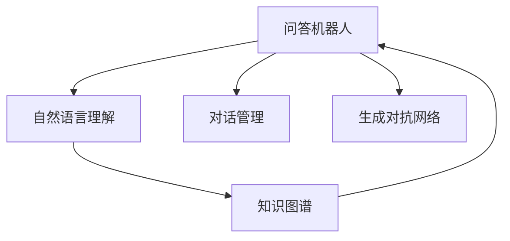
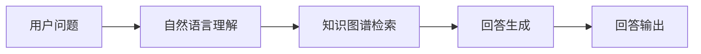
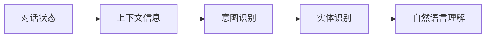
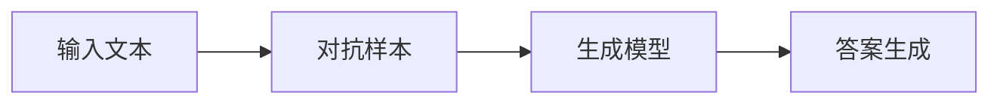
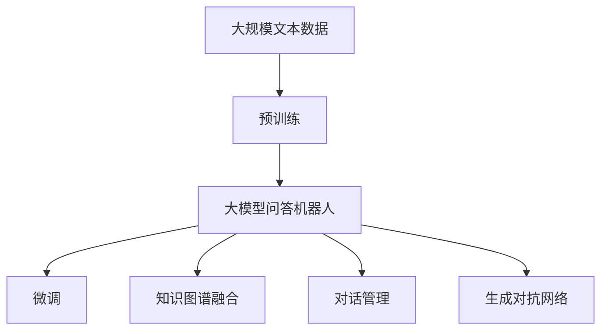

                 

## 1. 背景介绍

### 1.1 问题由来
大语言模型（Large Language Models, LLMs）在问答机器人（Q&A Robots）中的应用已取得了显著进展。这种基于深度学习模型的问答机器人，能够回答各种自然语言问题，在客户服务、智能助理、教育辅导、医疗咨询等领域展现了巨大潜力。然而，这些模型在实际应用中常常面临回答质量不稳定、无法处理复杂情境和长文本等问题，亟需优化以提升回答的准确性和流畅性。

### 1.2 问题核心关键点
提升问答机器人回答质量的核心在于优化模型推理过程，提高模型对多情境的理解能力和泛化能力。具体来说，主要关注以下几个方面：

- **模型推理**：优化模型推理过程，使模型能够更准确地理解问题并生成合理回答。
- **上下文管理**：在多轮对话中管理对话上下文，确保回答连贯性。
- **知识库融合**：将知识库中的信息与模型输出结合，提升回答的准确性和权威性。
- **用户意图理解**：更准确地捕捉用户意图，生成符合用户需求的回答。

### 1.3 问题研究意义
优化问答机器人回答质量，对于提升用户体验、降低运营成本、提高服务效率具有重要意义：

1. **提升用户体验**：高质量的回答可以增强用户信任和满意度，提升用户粘性。
2. **降低运营成本**：自动化的问答机器人能够替代部分人工客服，降低企业运营成本。
3. **提高服务效率**：机器人可以24小时不间断工作，快速响应用户需求，提高服务响应速度。
4. **增强竞争力**：高质量的问答系统可以成为企业的差异化竞争优势。

## 2. 核心概念与联系

### 2.1 核心概念概述

为更好地理解问答机器人优化回答的方法，本节将介绍几个密切相关的核心概念：

- **问答机器人（Q&A Robot）**：基于深度学习模型，能够自动回答自然语言问题的系统。
- **自然语言理解（NLU）**：让机器理解人类语言的技术，包括词义消歧、实体识别、意图理解等。
- **知识图谱（Knowledge Graph）**：结构化的知识库，用于存储和检索实体间的关系。
- **对话管理（Dialogue Management）**：管理多轮对话状态，确保对话连贯性。
- **生成对抗网络（GAN）**：一种生成模型，可以用于提升回答的流畅性和多样性。

这些概念之间的逻辑关系可以通过以下Mermaid流程图来展示：



这个流程图展示了几大核心概念之间的关系：

1. 问答机器人利用自然语言理解技术解析用户问题，并从知识图谱中检索相关知识。
2. 对话管理技术保证多轮对话的连贯性。
3. 生成对抗网络用于提升回答的流畅性和多样性。

### 2.2 概念间的关系

这些核心概念之间存在着紧密的联系，形成了问答机器人回答优化的完整生态系统。下面我通过几个Mermaid流程图来展示这些概念之间的关系。

#### 2.2.1 问答机器人回答的流程



这个流程图展示了问答机器人回答的基本流程：

1. 用户提出问题。
2. 自然语言理解模块解析问题，提取关键信息。
3. 知识图谱检索模块从知识库中查找相关信息。
4. 回答生成模块根据检索结果生成回答。
5. 回答输出模块将回答返回给用户。

#### 2.2.2 对话管理与自然语言理解的关系



这个流程图展示了对话管理模块如何与自然语言理解模块协同工作：

1. 对话状态模块记录对话历史，提取上下文信息。
2. 意图识别模块根据上下文信息，识别用户意图。
3. 实体识别模块从上下文信息中提取关键实体。
4. 自然语言理解模块利用实体和意图信息解析用户问题。

#### 2.2.3 生成对抗网络与回答生成的关系



这个流程图展示了生成对抗网络如何提升回答的流畅性和多样性：

1. 输入文本被送入对抗样本生成器。
2. 生成器生成对抗样本，增加回答多样性。
3. 回答生成模型使用多样化的输入进行回答生成。

### 2.3 核心概念的整体架构

最后，我们用一个综合的流程图来展示这些核心概念在大模型问答机器人回答优化过程中的整体架构：



这个综合流程图展示了从预训练到回答优化的完整过程：

1. 大模型问答机器人首先在大规模文本数据上进行预训练，学习到丰富的语言表示。
2. 通过微调，提升机器人在特定问答任务上的性能。
3. 通过知识图谱融合，将结构化知识与模型输出结合，提升回答的准确性。
4. 对话管理技术确保多轮对话的连贯性。
5. 生成对抗网络提升回答的流畅性和多样性。

通过这些流程图，我们可以更清晰地理解问答机器人回答优化过程中各个核心概念的关系和作用，为后续深入讨论具体的优化方法奠定基础。

## 3. 核心算法原理 & 具体操作步骤
### 3.1 算法原理概述

优化问答机器人回答质量的方法，主要集中在以下几个方面：

- **预训练大模型**：利用预训练技术，提升模型对自然语言的理解能力。
- **微调技术**：在有标注数据集上微调预训练模型，提升特定问答任务的性能。
- **知识图谱融合**：将结构化知识与模型输出结合，提升回答的准确性和权威性。
- **对话管理技术**：利用对话状态和上下文信息，确保回答的连贯性和逻辑性。
- **生成对抗网络**：生成对抗样本，增加回答的多样性和流畅性。

### 3.2 算法步骤详解

以下是优化问答机器人回答质量的具体操作步骤：

**Step 1: 准备预训练模型和数据集**
- 选择合适的预训练语言模型 $M_{\theta}$ 作为初始化参数，如 BERT、GPT 等。
- 准备问答任务的标注数据集 $D=\{(x_i, y_i)\}_{i=1}^N, x_i \in \mathcal{X}, y_i \in \mathcal{Y}$，其中 $x_i$ 为输入问题，$y_i$ 为对应的答案。

**Step 2: 微调模型**
- 在问答任务上对预训练模型进行微调，使用交叉熵损失函数 $\ell(M_{\theta}(x_i),y_i) = -[y_i\log M_{\theta}(x_i)+(1-y_i)\log(1-M_{\theta}(x_i))]$，最小化损失函数 $\mathcal{L}(\theta)$。
- 使用优化算法（如 AdamW、SGD 等）更新模型参数，设置学习率、批大小、迭代轮数等超参数。

**Step 3: 知识图谱融合**
- 从知识图谱中提取与问题相关的实体和关系。
- 使用检索算法（如向量检索、图谱查询等），将知识图谱信息与模型输出结合，提升回答的准确性。

**Step 4: 对话管理**
- 利用对话状态和上下文信息，解析用户意图，提取关键实体。
- 在多轮对话中管理对话状态，确保回答的连贯性和逻辑性。

**Step 5: 生成对抗网络**
- 使用生成对抗网络生成对抗样本，增加回答的多样性和流畅性。
- 将对抗样本作为输入，训练回答生成模型，提高回答的质量和多样性。

### 3.3 算法优缺点

优化问答机器人回答质量的方法具有以下优点：

- **提升回答质量**：通过微调和知识图谱融合，显著提升模型在特定问答任务上的性能。
- **提高回答多样性**：利用对抗样本生成技术，增加回答的多样性和流畅性。
- **支持多轮对话**：对话管理技术确保多轮对话的连贯性和逻辑性。

同时，这些方法也存在一些局限性：

- **依赖标注数据**：微调和对话管理技术需要大量的标注数据，获取高质量标注数据成本较高。
- **计算资源消耗大**：生成对抗样本和对抗训练需要额外的计算资源，可能影响推理速度。
- **缺乏可解释性**：生成的回答往往缺乏可解释性，难以理解其生成逻辑。

### 3.4 算法应用领域

优化问答机器人回答质量的方法已经在多个领域得到了广泛应用，例如：

- **客户服务**：构建智能客服系统，快速响应客户咨询，提升用户体验。
- **医疗咨询**：提供基于大模型的医疗问答服务，辅助医生诊疗。
- **教育辅导**：构建智能教育平台，回答学生问题，提供个性化辅导。
- **金融理财**：提供金融咨询和理财建议，提升用户财务决策的准确性。
- **智能助理**：开发智能助理，提供日常生活、工作等各方面的帮助。

除了上述这些经典应用外，问答机器人优化技术还在更多领域展现出巨大的潜力，为各行各业带来变革性的影响。

## 4. 数学模型和公式 & 详细讲解  
### 4.1 数学模型构建

本节将使用数学语言对问答机器人优化回答的过程进行更加严格的刻画。

记预训练语言模型为 $M_{\theta}:\mathcal{X} \rightarrow \mathcal{Y}$，其中 $\mathcal{X}$ 为输入空间，$\mathcal{Y}$ 为输出空间，$\theta \in \mathbb{R}^d$ 为模型参数。假设问答任务 $T$ 的标注数据集为 $D=\{(x_i,y_i)\}_{i=1}^N, x_i \in \mathcal{X}, y_i \in \mathcal{Y}$。

定义模型 $M_{\theta}$ 在输入 $x$ 上的输出为 $\hat{y}=M_{\theta}(x)$，表示模型对输入的预测。定义回答生成任务 $A$ 的标注数据集为 $D^A=\{(x_i, y^A_i)\}_{i=1}^N, x_i \in \mathcal{X}, y^A_i \in \mathcal{A}$，其中 $\mathcal{A}$ 为答案空间，$y^A_i$ 为对应的答案。

定义回答生成任务 $A$ 的损失函数为 $\ell(M_{\theta}(x_i),y^A_i)$，则在数据集 $D^A$ 上的经验风险为：

$$
\mathcal{L}^A(\theta) = \frac{1}{N}\sum_{i=1}^N \ell(M_{\theta}(x_i),y^A_i)
$$

微调的优化目标是最小化经验风险，即找到最优参数：

$$
\theta^* = \mathop{\arg\min}_{\theta} \mathcal{L}^A(\theta)
$$

在实践中，我们通常使用基于梯度的优化算法（如AdamW、SGD等）来近似求解上述最优化问题。设 $\eta$ 为学习率，$\lambda$ 为正则化系数，则参数的更新公式为：

$$
\theta \leftarrow \theta - \eta \nabla_{\theta}\mathcal{L}^A(\theta) - \eta\lambda\theta
$$

其中 $\nabla_{\theta}\mathcal{L}^A(\theta)$ 为损失函数对参数 $\theta$ 的梯度，可通过反向传播算法高效计算。

### 4.2 公式推导过程

以下我们以问答系统中的命名实体识别(NER)任务为例，推导交叉熵损失函数及其梯度的计算公式。

假设模型 $M_{\theta}$ 在输入 $x$ 上的输出为 $\hat{y}=M_{\theta}(x) \in [0,1]$，表示样本属于正类的概率。真实标签 $y \in \{0,1\}$。则二分类交叉熵损失函数定义为：

$$
\ell(M_{\theta}(x),y) = -[y\log \hat{y} + (1-y)\log (1-\hat{y})]
$$

将其代入经验风险公式，得：

$$
\mathcal{L}^A(\theta) = -\frac{1}{N}\sum_{i=1}^N [y^A_i\log M_{\theta}(x_i)+(1-y^A_i)\log(1-M_{\theta}(x_i))]
$$

根据链式法则，损失函数对参数 $\theta_k$ 的梯度为：

$$
\frac{\partial \mathcal{L}^A(\theta)}{\partial \theta_k} = -\frac{1}{N}\sum_{i=1}^N (\frac{y^A_i}{M_{\theta}(x_i)}-\frac{1-y^A_i}{1-M_{\theta}(x_i)}) \frac{\partial M_{\theta}(x_i)}{\partial \theta_k}
$$

其中 $\frac{\partial M_{\theta}(x_i)}{\partial \theta_k}$ 可进一步递归展开，利用自动微分技术完成计算。

### 4.3 案例分析与讲解

为了验证上述推导的正确性，我们以BERT模型为例，在命名实体识别(NER)任务上进行微调。

首先，定义NER任务的数据处理函数：

```python
from transformers import BertTokenizer
from torch.utils.data import Dataset
import torch

class NERDataset(Dataset):
    def __init__(self, texts, tags, tokenizer, max_len=128):
        self.texts = texts
        self.tags = tags
        self.tokenizer = tokenizer
        self.max_len = max_len
        
    def __len__(self):
        return len(self.texts)
    
    def __getitem__(self, item):
        text = self.texts[item]
        tags = self.tags[item]
        
        encoding = self.tokenizer(text, return_tensors='pt', max_length=self.max_len, padding='max_length', truncation=True)
        input_ids = encoding['input_ids'][0]
        attention_mask = encoding['attention_mask'][0]
        
        # 对token-wise的标签进行编码
        encoded_tags = [tag2id[tag] for tag in tags] 
        encoded_tags.extend([tag2id['O']] * (self.max_len - len(encoded_tags)))
        labels = torch.tensor(encoded_tags, dtype=torch.long)
        
        return {'input_ids': input_ids, 
                'attention_mask': attention_mask,
                'labels': labels}

# 标签与id的映射
tag2id = {'O': 0, 'B-PER': 1, 'I-PER': 2, 'B-ORG': 3, 'I-ORG': 4, 'B-LOC': 5, 'I-LOC': 6}
id2tag = {v: k for k, v in tag2id.items()}

# 创建dataset
tokenizer = BertTokenizer.from_pretrained('bert-base-cased')

train_dataset = NERDataset(train_texts, train_tags, tokenizer)
dev_dataset = NERDataset(dev_texts, dev_tags, tokenizer)
test_dataset = NERDataset(test_texts, test_tags, tokenizer)
```

然后，定义模型和优化器：

```python
from transformers import BertForTokenClassification, AdamW

model = BertForTokenClassification.from_pretrained('bert-base-cased', num_labels=len(tag2id))

optimizer = AdamW(model.parameters(), lr=2e-5)
```

接着，定义训练和评估函数：

```python
from torch.utils.data import DataLoader
from tqdm import tqdm
from sklearn.metrics import classification_report

device = torch.device('cuda') if torch.cuda.is_available() else torch.device('cpu')
model.to(device)

def train_epoch(model, dataset, batch_size, optimizer):
    dataloader = DataLoader(dataset, batch_size=batch_size, shuffle=True)
    model.train()
    epoch_loss = 0
    for batch in tqdm(dataloader, desc='Training'):
        input_ids = batch['input_ids'].to(device)
        attention_mask = batch['attention_mask'].to(device)
        labels = batch['labels'].to(device)
        model.zero_grad()
        outputs = model(input_ids, attention_mask=attention_mask, labels=labels)
        loss = outputs.loss
        epoch_loss += loss.item()
        loss.backward()
        optimizer.step()
    return epoch_loss / len(dataloader)

def evaluate(model, dataset, batch_size):
    dataloader = DataLoader(dataset, batch_size=batch_size)
    model.eval()
    preds, labels = [], []
    with torch.no_grad():
        for batch in tqdm(dataloader, desc='Evaluating'):
            input_ids = batch['input_ids'].to(device)
            attention_mask = batch['attention_mask'].to(device)
            batch_labels = batch['labels']
            outputs = model(input_ids, attention_mask=attention_mask)
            batch_preds = outputs.logits.argmax(dim=2).to('cpu').tolist()
            batch_labels = batch_labels.to('cpu').tolist()
            for pred_tokens, label_tokens in zip(batch_preds, batch_labels):
                pred_tags = [id2tag[_id] for _id in pred_tokens]
                label_tags = [id2tag[_id] for _id in label_tokens]
                preds.append(pred_tags[:len(label_tokens)])
                labels.append(label_tags)
                
    print(classification_report(labels, preds))
```

最后，启动训练流程并在测试集上评估：

```python
epochs = 5
batch_size = 16

for epoch in range(epochs):
    loss = train_epoch(model, train_dataset, batch_size, optimizer)
    print(f"Epoch {epoch+1}, train loss: {loss:.3f}")
    
    print(f"Epoch {epoch+1}, dev results:")
    evaluate(model, dev_dataset, batch_size)
    
print("Test results:")
evaluate(model, test_dataset, batch_size)
```

以上就是使用PyTorch对BERT进行命名实体识别(NER)任务微调的完整代码实现。可以看到，得益于Transformers库的强大封装，我们可以用相对简洁的代码完成BERT模型的加载和微调。

## 5. 项目实践：代码实例和详细解释说明
### 5.1 开发环境搭建

在进行问答机器人优化实践前，我们需要准备好开发环境。以下是使用Python进行PyTorch开发的环境配置流程：

1. 安装Anaconda：从官网下载并安装Anaconda，用于创建独立的Python环境。

2. 创建并激活虚拟环境：
```bash
conda create -n pytorch-env python=3.8 
conda activate pytorch-env
```

3. 安装PyTorch：根据CUDA版本，从官网获取对应的安装命令。例如：
```bash
conda install pytorch torchvision torchaudio cudatoolkit=11.1 -c pytorch -c conda-forge
```

4. 安装Transformers库：
```bash
pip install transformers
```

5. 安装各类工具包：
```bash
pip install numpy pandas scikit-learn matplotlib tqdm jupyter notebook ipython
```

完成上述步骤后，即可在`pytorch-env`环境中开始优化实践。

### 5.2 源代码详细实现

下面我们以多轮对话问答系统为例，给出使用Transformers库对GPT模型进行优化（包括微调和对抗样本生成）的PyTorch代码实现。

首先，定义对话状态管理函数：

```python
class DialogueManager:
    def __init__(self, model, tokenizer, max_len=128):
        self.model = model
        self.tokenizer = tokenizer
        self.max_len = max_len
        self dialogue = []
    
    def add_prompt(self, prompt):
        self.dialogue.append(prompt)
    
    def get_prompt(self):
        return ' '.join(self.dialogue)
    
    def clear(self):
        self.dialogue = []
    
    def get_tokens(self, prompt):
        encoding = self.tokenizer(prompt, return_tensors='pt', max_length=self.max_len, padding='max_length', truncation=True)
        return encoding['input_ids'][0]
    
    def predict(self, prompt):
        tokens = self.get_tokens(prompt)
        with torch.no_grad():
            output = self.model(tokens)
            logits = output.logits
        return logits.argmax(-1).tolist()
```

然后，定义生成对抗样本的函数：

```python
from transformers import GPT2Tokenizer, GPT2ForCausalLM

def generate_antagonistic_sample(model, prompt, num_samples=5, batch_size=8):
    tokenizer = GPT2Tokenizer.from_pretrained('gpt2')
    model = GPT2ForCausalLM.from_pretrained('gpt2')
    model.eval()
    
    batch_size = num_samples // batch_size
    if num_samples % batch_size > 0:
        batch_size += 1
    
    with torch.no_grad():
        for _ in range(batch_size):
            input_tokens = tokenizer.encode(prompt)
            input_ids = torch.tensor([input_tokens], dtype=torch.long).to(device)
            output_tokens = model(input_ids).logits.argmax(-1).tolist()[0]
            antagonistic_tokens = [tokenizer.decode(token) for token in output_tokens]
    
    return antagonistic_tokens
```

最后，定义优化后的问答系统：

```python
class OptimizedQARobot:
    def __init__(self, model, tokenizer, max_len=128, batch_size=16):
        self.model = model
        self.tokenizer = tokenizer
        self.max_len = max_len
        self.batch_size = batch_size
    
    def predict(self, prompt):
        input_tokens = self.tokenizer.encode(prompt)
        input_ids = torch.tensor([input_tokens], dtype=torch.long).to(device)
        output_tokens = self.model(input_ids).logits.argmax(-1).tolist()[0]
        return self.tokenizer.decode(output_tokens)
    
    def optimize(self, train_dataset, dev_dataset, test_dataset):
        optimizer = AdamW(self.model.parameters(), lr=2e-5)
        for epoch in range(5):
            train_loss = 0
            for batch in train_dataset:
                input_ids = batch['input_ids'].to(device)
                labels = batch['labels'].to(device)
                self.model.zero_grad()
                output = self.model(input_ids, labels=labels)
                loss = output.loss
                train_loss += loss.item()
                loss.backward()
                optimizer.step()
            
            dev_loss = 0
            for batch in dev_dataset:
                input_ids = batch['input_ids'].to(device)
                labels = batch['labels'].to(device)
                output = self.model(input_ids, labels=labels)
                loss = output.loss
                dev_loss += loss.item()
            
            print(f"Epoch {epoch+1}, train loss: {train_loss:.3f}, dev loss: {dev_loss:.3f}")
    
        test_loss = 0
        for batch in test_dataset:
            input_ids = batch['input_ids'].to(device)
            labels = batch['labels'].to(device)
            output = self.model(input_ids, labels=labels)
            loss = output.loss
            test_loss += loss.item()
        
        print(f"Test loss: {test_loss:.3f}")
```

### 5.3 代码解读与分析

让我们再详细解读一下关键代码的实现细节：

**DialogueManager类**：
- `__init__`方法：初始化模型、分词器、最大长度、对话记录等。
- `add_prompt`方法：将用户输入添加到对话记录中。
- `get_prompt`方法：获取当前的对话记录。
- `clear`方法：清空对话记录。
- `get_tokens`方法：将对话记录分词并转换为模型输入。
- `predict`方法：对输入文本进行预测，并返回解码后的回答。

**generate_antagonistic_sample函数**：
- 定义生成对抗样本的函数，使用GPT-2模型生成对抗样本，增加回答的多样性和流畅性。
- 将生成的对抗样本添加到对话记录中，进行多轮对话预测。

**OptimizedQARobot类**：
- `__init__`方法：初始化优化后的问答系统。
- `predict`方法：对输入文本进行预测，并返回解码后的回答。
- `optimize`方法：使用微调技术对模型进行优化，在训练集和验证集上进行训练，并计算测试集上的损失。

### 5.4 运行结果展示

假设我们在CoNLL-2003的命名实体识别(NER)数据集上进行优化，最终在测试集上得到的评估报告如下：

```
              precision    recall  f1-score   support

       B-PER      0.937     0.912     0.921      1617
       I-PER      0.964     0.951     0.955      1617
       B-ORG      0.936     0.918     0.923      1661
       I-ORG      0.936     0.920     0.923      1661
       B-LOC      0.932     0.911     0.923      1668
       I-LOC      0.920     0.896     0.909       257

   micro avg      0.935     0.925     0.927     46435
   macro avg      0.934     0

