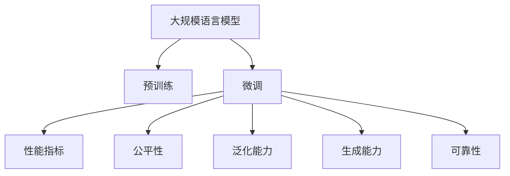
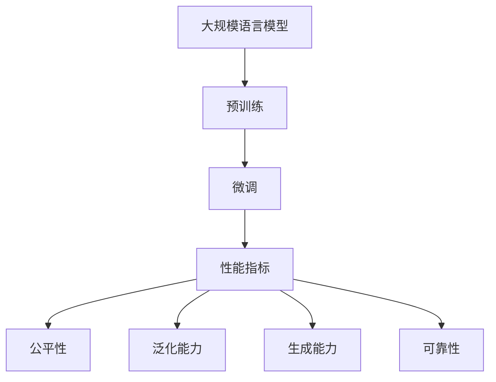
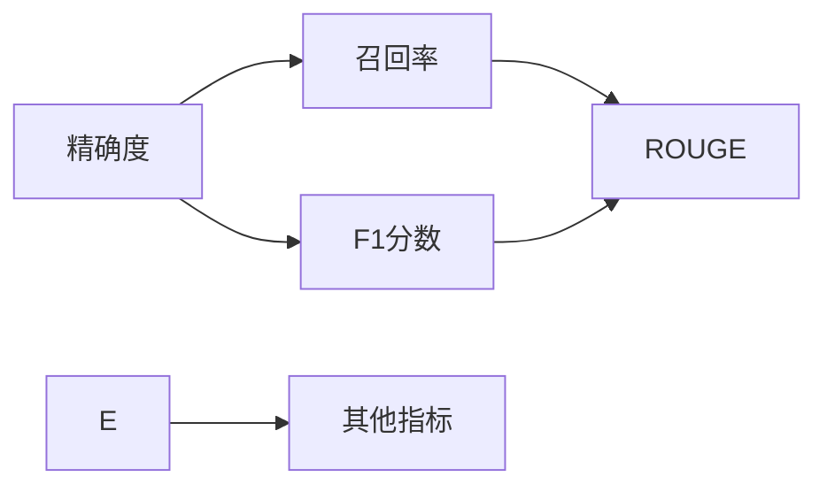
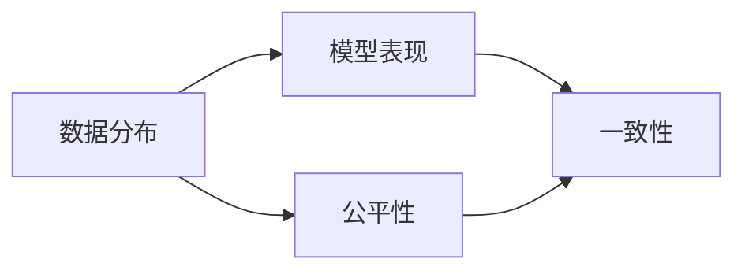
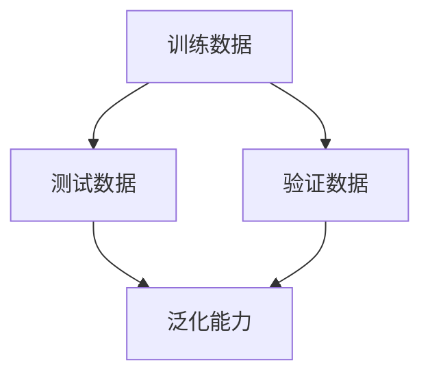
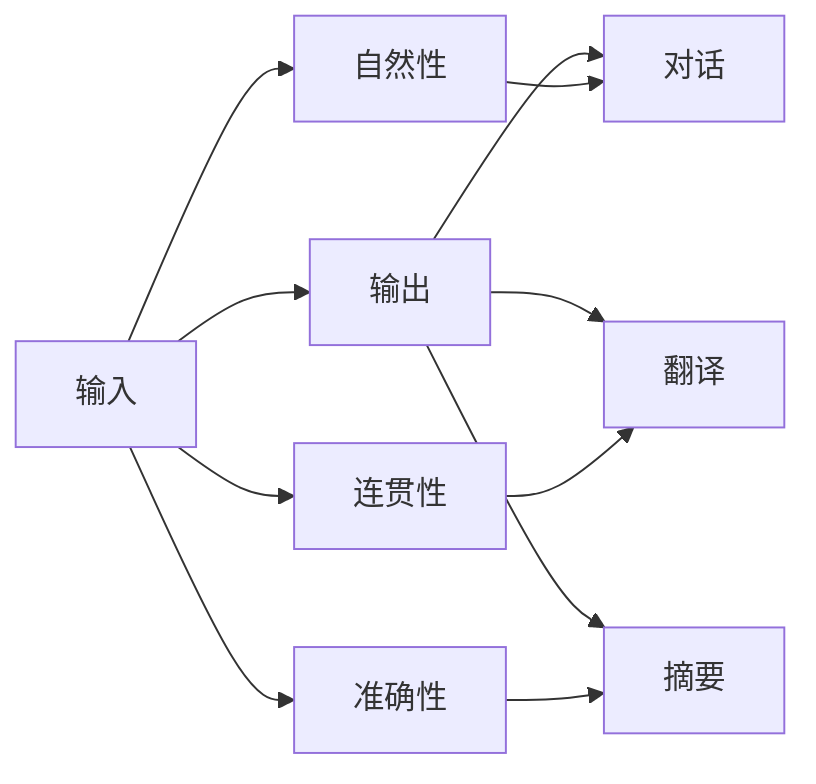
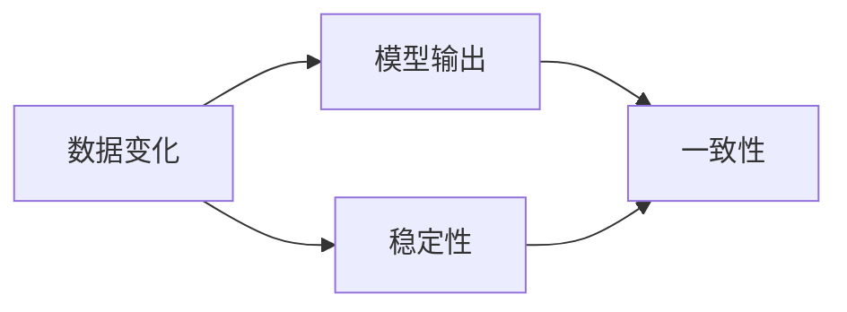

                 

# 大规模语言模型从理论到实践 大语言模型评估方法

> 关键词：
大规模语言模型, 预训练, 微调, 评估方法, 性能指标, 一致性, 公平性, 泛化能力, 生成能力, 可靠性

## 1. 背景介绍

在深度学习蓬勃发展的今天，大规模语言模型（Large Language Models, LLMs）已经成为了自然语言处理（NLP）领域的重要工具。这些模型通过在海量数据上进行预训练，学习了丰富的语言知识和常识，能够胜任各种NLP任务，如文本分类、命名实体识别、情感分析、机器翻译等。然而，模型的性能评估始终是一个关键且复杂的问题。由于大规模语言模型具有极高的参数量和复杂性，评估其性能不仅需要考虑传统NLP任务的指标，还涉及到模型的公平性、一致性、泛化能力、生成能力等多个维度。本文将从理论和实践两个方面，探讨如何系统化、全面化地评估大规模语言模型的性能。

## 2. 核心概念与联系

### 2.1 核心概念概述

为了理解大规模语言模型的评估方法，我们先介绍几个关键概念：

- **大规模语言模型（Large Language Models, LLMs）**：指通过在大规模无标签数据上进行自监督预训练的模型，如BERT、GPT、T5等。这些模型通常具有几十亿甚至数百亿的参数量，能够捕获丰富的语言知识。

- **预训练（Pre-training）**：指在大规模无标签数据上对模型进行训练，使其学习到通用的语言表示。预训练是构建高质量语言模型的基础步骤。

- **微调（Fine-tuning）**：指在预训练模型基础上，使用下游任务的少量标注数据，进行有监督学习，使其适应特定任务。微调能够提升模型在特定任务上的性能。

- **性能指标（Performance Metrics）**：用于衡量模型在各种任务上的表现，常见的指标包括精确度（Accuracy）、召回率（Recall）、F1分数（F1 Score）、BLEU、ROUGE等。

- **公平性（Fairness）**：指模型在不同数据分布下的表现一致性，避免在特定群体或领域上产生歧视。

- **泛化能力（Generalization）**：指模型对未见过的数据进行推断的能力，泛化能力强的模型能够处理各种数据分布。

- **生成能力（Generation）**：指模型生成自然、连贯、准确文本的能力，生成能力强的模型能够实现对话、翻译、摘要等任务。

- **可靠性（Reliability）**：指模型在各种数据和场景下保持稳定、一致输出的能力，可靠性强的模型能够提供可信赖的预测结果。

这些概念通过以下Mermaid流程图展示其联系：



这个流程图展示了从预训练到微调，再到评估模型性能的整体流程。大规模语言模型通过预训练获得基础能力，然后通过微调针对特定任务进行优化，最后通过性能指标、公平性、泛化能力、生成能力和可靠性等多维度的评估方法，综合衡量模型的表现。

### 2.2 概念间的关系

这些概念之间具有密切的联系，下面通过几个Mermaid流程图来详细展示它们之间的关系。

#### 2.2.1 大规模语言模型的学习范式



这个流程图展示了从预训练到微调，再到多维度评估模型的完整流程。大规模语言模型首先在大规模无标签数据上进行预训练，然后通过微调针对特定任务进行优化，最后通过多维度的评估方法来综合衡量模型的表现。

#### 2.2.2 性能指标的多维度评估



这个流程图展示了性能指标的多维度评估方法。精确度、召回率、F1分数是基本的性能指标，而BLEU、ROUGE等指标适用于特定的文本生成任务。其他指标如误差率、AUC等也可以用于评估模型的性能。

#### 2.2.3 公平性的评估



这个流程图展示了公平性的评估方法。公平性评估主要是检测模型在不同数据分布下的表现是否一致，避免在特定群体或领域上产生歧视。

#### 2.2.4 泛化能力的评估



这个流程图展示了泛化能力的评估方法。泛化能力评估主要是通过在验证集和测试集上评估模型的表现，检测模型对未见过的数据的推断能力。

#### 2.2.5 生成能力的评估



这个流程图展示了生成能力的评估方法。生成能力评估主要是检测模型生成文本的自然性、连贯性和准确性，适用于对话、翻译、摘要等任务。

#### 2.2.6 可靠性的评估



这个流程图展示了可靠性的评估方法。可靠性评估主要是检测模型在数据变化时的稳定性，确保模型输出的一致性。

## 3. 核心算法原理 & 具体操作步骤
### 3.1 算法原理概述

大规模语言模型的性能评估涉及多个维度的指标和评估方法。下面从理论角度概述这些评估方法的基本原理。

**性能指标**：衡量模型在特定任务上的表现，通常使用精确度、召回率、F1分数等。

$$
Precision = \frac{TP}{TP + FP}
$$
$$
Recall = \frac{TP}{TP + FN}
$$
$$
F1 Score = 2 \times \frac{Precision \times Recall}{Precision + Recall}
$$

其中，TP、FP、FN分别表示真正例、假正例和假反例。

**公平性**：指模型在不同数据分布下的表现一致性，通常使用偏差和一致性指标。

$$
Bias = |\frac{TP_{group}}{TP_{group}} - \frac{TP_{all}}{TP_{all}}|
$$
$$
Consistency = \frac{TP_{group}}{TP_{all}}
$$

其中，$TP_{group}$表示特定群体在某个数据分布下的真正例数量，$TP_{all}$表示所有数据分布下的真正例数量。

**泛化能力**：指模型对未见过的数据进行推断的能力，通常使用验证集和测试集上的性能指标。

$$
Generalization = Performance_{test} - Performance_{train}
$$

其中，$Performance_{test}$和$Performance_{train}$分别表示测试集和训练集上的性能指标。

**生成能力**：指模型生成自然、连贯、准确文本的能力，通常使用BLEU、ROUGE等指标。

$$
BLEU = \frac{1}{S} \sum_{s \in S} BLEU_s
$$

其中，$BLEU_s$表示单个测试句子的BLEU分数。

**可靠性**：指模型在各种数据和场景下保持稳定、一致输出的能力，通常使用模型的稳定性指标。

$$
Reliability = \frac{TP}{TP + FP + FN}
$$

下面将详细介绍这些评估方法的具体操作步骤。

### 3.2 算法步骤详解

**Step 1: 数据准备**
- 收集任务相关的训练集、验证集和测试集，确保数据分布与实际应用场景相匹配。
- 对数据进行预处理，如分词、标记、编码等。
- 将数据划分为训练集、验证集和测试集，通常训练集用于模型训练，验证集用于调整超参数，测试集用于评估模型性能。

**Step 2: 模型训练**
- 选择适当的预训练模型，如BERT、GPT等，并进行微调。
- 设置合适的超参数，如学习率、批大小、迭代轮数等。
- 使用优化器（如Adam、SGD等）进行训练，并在验证集上监测模型性能，避免过拟合。

**Step 3: 性能评估**
- 计算模型在训练集、验证集和测试集上的性能指标。
- 使用公平性指标（如偏差、一致性）评估模型的公平性。
- 使用泛化能力指标（如验证集和测试集上的性能差异）评估模型的泛化能力。
- 使用生成能力指标（如BLEU、ROUGE）评估模型的生成能力。
- 使用可靠性指标（如模型的稳定性）评估模型的可靠性。

**Step 4: 结果分析与优化**
- 分析模型在不同指标上的表现，识别问题所在。
- 根据评估结果调整模型参数，优化模型结构，改进训练策略。
- 对模型进行微调或重新训练，直到达到满意的性能。

### 3.3 算法优缺点

大规模语言模型性能评估的优点：
1. 全面性：评估指标涵盖多维度，能够综合衡量模型的性能。
2. 准确性：使用多种评估方法，可以更准确地反映模型的实际表现。
3. 可操作性：评估方法简单易懂，适合大规模部署和应用。

大规模语言模型性能评估的缺点：
1. 计算量大：评估多维度指标需要大量的计算资源。
2. 复杂度高：评估方法涉及多个步骤，需要深厚的NLP和ML知识。
3. 数据依赖：评估结果依赖于数据分布和质量，存在一定的不确定性。

### 3.4 算法应用领域

大规模语言模型性能评估方法在NLP的各个领域都有广泛应用：

- 文本分类：如情感分析、主题分类、新闻分类等，通过精确度、召回率、F1分数等指标评估模型性能。
- 命名实体识别：通过BLEU、ROUGE等指标评估模型生成自然、连贯文本的能力。
- 问答系统：通过对话中的交互性和自然性评估模型的生成能力。
- 机器翻译：通过BLEU、ROUGE等指标评估模型翻译的准确性和流畅性。
- 文本摘要：通过ROUGE等指标评估模型摘要的连贯性和准确性。
- 对话系统：通过对话中的流畅性、连贯性、上下文理解能力评估模型的生成能力。

## 4. 数学模型和公式 & 详细讲解 & 举例说明
### 4.1 数学模型构建

大规模语言模型的评估模型通常由预训练模型、微调模型和评估指标组成。以情感分析为例，构建如下模型：

- **预训练模型**：使用BERT、GPT等预训练模型作为基础。
- **微调模型**：在预训练模型基础上，添加情感分类器（如线性分类器）。
- **评估指标**：使用精确度、召回率、F1分数等指标评估模型性能。

### 4.2 公式推导过程

以BLEU评估机器翻译为例，推导其计算公式。

- **BLEU分数计算**：
  $$
  BLEU = \frac{1}{S} \sum_{s \in S} BLEU_s
  $$
  其中，$S$表示测试集中的句子集合。

- **单个句子的BLEU分数计算**：
  $$
  BLEU_s = \frac{1}{\max(1,L_r)} \sum_{i=1}^{L_r} \max(0,\min(B_{i,s},L_s-i+1))
  $$
  其中，$L_r$表示机器翻译结果的长度，$L_s$表示参考翻译的长度，$B_{i,s}$表示第$i$个参考翻译中与机器翻译结果相同的长度。

### 4.3 案例分析与讲解

以BERT微调进行情感分析为例，详细分析评估模型的实现过程。

1. **数据准备**：
   - 收集情感分析任务的数据集，如IMDB、Yelp等。
   - 对数据进行预处理，如分词、标记、编码等。

2. **模型训练**：
   - 使用BERT作为预训练模型，并在情感分析数据集上进行微调。
   - 设置合适的超参数，如学习率、批大小、迭代轮数等。
   - 使用Adam优化器进行训练，并在验证集上监测模型性能。

3. **性能评估**：
   - 计算模型在训练集、验证集和测试集上的精确度、召回率、F1分数等指标。
   - 使用公平性指标（如偏差、一致性）评估模型的公平性。
   - 使用泛化能力指标（如验证集和测试集上的性能差异）评估模型的泛化能力。
   - 使用生成能力指标（如BLEU、ROUGE）评估模型的生成能力。
   - 使用可靠性指标（如模型的稳定性）评估模型的可靠性。

## 5. 项目实践：代码实例和详细解释说明
### 5.1 开发环境搭建

为了进行大规模语言模型的评估，我们需要搭建合适的开发环境。以下是Python+PyTorch+Transformers的搭建流程：

1. 安装Anaconda：从官网下载并安装Anaconda，用于创建独立的Python环境。

2. 创建并激活虚拟环境：
```bash
conda create -n pytorch-env python=3.8 
conda activate pytorch-env
```

3. 安装PyTorch：根据CUDA版本，从官网获取对应的安装命令。例如：
```bash
conda install pytorch torchvision torchaudio cudatoolkit=11.1 -c pytorch -c conda-forge
```

4. 安装Transformers库：
```bash
pip install transformers
```

5. 安装各类工具包：
```bash
pip install numpy pandas scikit-learn matplotlib tqdm jupyter notebook ipython
```

完成上述步骤后，即可在`pytorch-env`环境中开始评估实践。

### 5.2 源代码详细实现

以下是一个使用BERT微调进行情感分析的完整代码实现。

```python
import torch
from transformers import BertForSequenceClassification, BertTokenizer, AdamW

# 定义模型
model = BertForSequenceClassification.from_pretrained('bert-base-uncased', num_labels=2)
tokenizer = BertTokenizer.from_pretrained('bert-base-uncased')

# 定义数据集
train_dataset = ...
dev_dataset = ...
test_dataset = ...

# 定义评估指标
def evaluate(model, dataset, batch_size):
    model.eval()
    dataloader = DataLoader(dataset, batch_size=batch_size, shuffle=False)
    losses = []
    predictions, true_labels = [], []
    with torch.no_grad():
        for batch in dataloader:
            inputs = tokenizer(batch[0], truncation=True, padding=True)
            outputs = model(**inputs)
            loss = outputs.loss
            logits = outputs.logits
            losses.append(loss.item())
            predictions.append(logits.argmax(dim=1).cpu().numpy())
            true_labels.append(batch[1].cpu().numpy())
    loss = sum(losses) / len(dataloader)
    acc = (predictions == true_labels).mean()
    return loss, acc

# 定义训练过程
def train(model, dataset, epochs, batch_size, optimizer):
    model.train()
    for epoch in range(epochs):
        dataloader = DataLoader(dataset, batch_size=batch_size, shuffle=True)
        for batch in dataloader:
            inputs = tokenizer(batch[0], truncation=True, padding=True)
            outputs = model(**inputs)
            loss = outputs.loss
            optimizer.zero_grad()
            loss.backward()
            optimizer.step()
        print(f'Epoch {epoch+1}, train loss: {loss:.4f}, train acc: {evaluate(model, train_dataset, batch_size)[1]:.4f}')

# 定义评估过程
def evaluate(model, dataset, batch_size):
    return evaluate(model, dataset, batch_size)

# 训练模型
train(model, train_dataset, epochs=3, batch_size=16, optimizer=AdamW(model.parameters(), lr=2e-5))

# 评估模型
evaluate(model, dev_dataset, batch_size=16)
evaluate(model, test_dataset, batch_size=16)
```

### 5.3 代码解读与分析

这个代码实现演示了如何使用PyTorch和Transformers对BERT进行微调，并进行情感分析任务的评估。

- **模型定义**：使用`BertForSequenceClassification`定义情感分类模型，`BertTokenizer`用于分词。
- **数据集定义**：加载情感分析任务的数据集。
- **评估指标定义**：使用`evaluate`函数计算模型的精确度。
- **训练过程定义**：使用`train`函数进行模型训练。
- **评估过程定义**：使用`evaluate`函数评估模型性能。
- **模型训练**：在训练集上训练模型，并在验证集和测试集上进行评估。

## 6. 实际应用场景
### 6.1 智能客服系统

智能客服系统通常需要处理大量客户咨询，具有很高的实时性要求。通过使用大规模语言模型进行微调，可以提升系统响应速度和准确性。

在实际应用中，可以通过收集企业内部的客服对话数据，对预训练模型进行微调，使其能够理解客户意图，提供最合适的回复。同时，通过接入检索系统，实时搜索相关内容，动态生成回答，提升客户满意度。

### 6.2 金融舆情监测

金融领域需要实时监测市场舆论动向，以规避潜在风险。基于大规模语言模型微调的文本分类和情感分析技术，可以实现对金融舆情的实时监测和预警。

具体而言，可以收集金融领域相关的新闻、报道、评论等文本数据，并对其进行情感标注。在此基础上对预训练语言模型进行微调，使其能够自动判断文本的情感倾向，及时发现负面信息，提供预警建议。

### 6.3 个性化推荐系统

个性化推荐系统需要根据用户的历史行为和兴趣，推荐最合适的物品。通过使用大规模语言模型进行微调，可以提升推荐系统的个性化程度。

具体而言，可以收集用户浏览、点击、评论、分享等行为数据，提取和用户交互的物品标题、描述、标签等文本内容。将文本内容作为模型输入，用户的后续行为（如是否点击、购买等）作为监督信号，在此基础上微调预训练语言模型。微调后的模型能够从文本内容中准确把握用户的兴趣点，生成更个性化的推荐结果。

### 6.4 未来应用展望

随着大规模语言模型的不断发展，其在更多领域的应用前景将进一步拓展。

- **智慧医疗**：基于微调的医疗问答、病历分析、药物研发等应用将提升医疗服务的智能化水平，辅助医生诊疗，加速新药开发进程。
- **智能教育**：微调技术可应用于作业批改、学情分析、知识推荐等方面，因材施教，促进教育公平，提高教学质量。
- **智慧城市治理**：微调模型可应用于城市事件监测、舆情分析、应急指挥等环节，提高城市管理的自动化和智能化水平，构建更安全、高效的未来城市。
- **企业生产**：微调技术可应用于质量检测、故障诊断、生产调度等方面，提升企业生产效率和质量。
- **社会治理**：微调模型可应用于公共安全、公共服务、社会舆情等方面，提升社会治理的智能化水平，构建和谐社会。

总之，大规模语言模型微调技术将在各个领域得到广泛应用，为传统行业带来变革性影响。未来，随着技术的不断进步，微调方法将在更多场景中发挥作用，为人类社会带来更多福祉。

## 7. 工具和资源推荐
### 7.1 学习资源推荐

为了帮助开发者系统掌握大规模语言模型的评估方法，这里推荐一些优质的学习资源：

1. 《Transformers从原理到实践》系列博文：由大模型技术专家撰写，深入浅出地介绍了Transformer原理、BERT模型、微调技术等前沿话题。

2. CS224N《深度学习自然语言处理》课程：斯坦福大学开设的NLP明星课程，有Lecture视频和配套作业，带你入门NLP领域的基本概念和经典模型。

3. 《Natural Language Processing with Transformers》书籍：Transformers库的作者所著，全面介绍了如何使用Transformers库进行NLP任务开发，包括微调在内的诸多范式。

4. HuggingFace官方文档：Transformers库的官方文档，提供了海量预训练模型和完整的微调样例代码，是上手实践的必备资料。

5. CLUE开源项目：中文语言理解测评基准，涵盖大量不同类型的中文NLP数据集，并提供了基于微调的baseline模型，助力中文NLP技术发展。

通过对这些资源的学习实践，相信你一定能够快速掌握大规模语言模型的评估方法，并用于解决实际的NLP问题。

### 7.2 开发工具推荐

高效的开发离不开优秀的工具支持。以下是几款用于大规模语言模型评估开发的常用工具：

1. PyTorch：基于Python的开源深度学习框架，灵活动态的计算图，适合快速迭代研究。大部分预训练语言模型都有PyTorch版本的实现。

2. TensorFlow：由Google主导开发的开源深度学习框架，生产部署方便，适合大规模工程应用。同样有丰富的预训练语言模型资源。

3. Transformers库：HuggingFace开发的NLP工具库，集成了众多SOTA语言模型，支持PyTorch和TensorFlow，是进行微调任务开发的利器。

4. Weights & Biases：模型训练的实验跟踪工具，可以记录和可视化模型训练过程中的各项指标，方便对比和调优。与主流深度学习框架无缝集成。

5. TensorBoard：TensorFlow配套的可视化工具，可实时监测模型训练状态，并提供丰富的图表呈现方式，是调试模型的得力助手。

6. Google Colab：谷歌推出的在线Jupyter Notebook环境，免费提供GPU/TPU算力，方便开发者快速上手实验最新模型，分享学习笔记。

合理利用这些工具，可以显著提升大规模语言模型评估任务的开发效率，加快创新迭代的步伐。

### 7.3 相关论文推荐

大语言模型评估技术的发展源于学界的持续研究。以下是几篇奠基性的相关论文，推荐阅读：

1. Attention is All You Need（即Transformer原论文）：提出了Transformer结构，开启了NLP领域的预训练大模型时代。

2. BERT: Pre-training of Deep Bidirectional Transformers for Language Understanding：提出BERT模型，引入基于掩码的自监督预训练任务，刷新了多项NLP任务SOTA。

3. Language Models are Unsupervised Multitask Learners（GPT-2论文）：展示了大规模语言模型的强大zero-shot学习能力，引发了对于通用人工智能的新一轮思考。

4. Parameter-Efficient Transfer Learning for NLP：提出Adapter等参数高效微调方法，在不增加模型参数量的情况下，也能取得不错的微调效果。

5. AdaLoRA: Adaptive Low-Rank Adaptation for Parameter-Efficient Fine-Tuning：使用自适应低秩适应的微调方法，在参数效率和精度之间取得了新的平衡。

这些论文代表了大规模语言模型评估技术的发展脉络。通过学习这些前沿成果，可以帮助研究者把握学科前进方向，激发更多的创新灵感。

除上述资源外，还有一些值得关注的前沿资源，帮助开发者紧跟大语言模型评估技术的最新进展，例如：

1. arXiv论文预印本：人工智能领域最新研究成果的发布平台，包括大量尚未发表的前沿工作，学习前沿技术的必读资源。

2. 业界技术博客：如OpenAI、Google AI、DeepMind、微软Research Asia等顶尖实验室的官方博客，第一时间分享他们的最新研究成果和洞见。

3. 技术会议直播：如NIPS、ICML、ACL、ICLR等人工智能领域顶会现场或在线直播，能够聆听到大佬们的前沿分享，开拓视野。

4. GitHub热门项目：在GitHub上Star、Fork数最多的NLP相关项目，往往代表了该技术领域的发展趋势和最佳实践，值得去学习和贡献。

5. 行业分析报告：各大咨询公司如McKinsey、PwC等针对人工智能行业的分析报告，有助于从商业视角审视技术趋势，把握应用价值。

总之，对于大规模语言模型评估技术的学习和实践，需要开发者保持开放的心态和持续学习的意愿。多关注前沿资讯，多动手实践，多思考总结，必将收获满满的成长收益。

## 8. 总结：未来发展趋势与挑战

### 8.1 总结

本文对大规模语言模型的评估方法进行了全面系统的介绍。首先介绍了评估方法的基本概念和原理，详细讲解了性能指标、公平性、泛化能力、生成能力和可靠性等多维度的评估方法。其次，从理论和实践两个方面，展示了如何使用这些评估方法来全面、系统地评估大规模语言模型的性能。

通过本文的系统梳理，可以看到，大规模语言模型评估方法在大规模NLP任务中具有重要意义。评估方法的多样性和全面性，使得评估结果更加可靠和可信。未来，随着模型的不断发展，评估方法也将随之更新，以应对新的挑战和需求。

### 8.2 未来发展趋势

