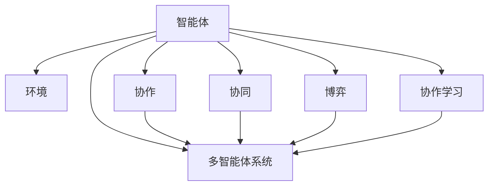
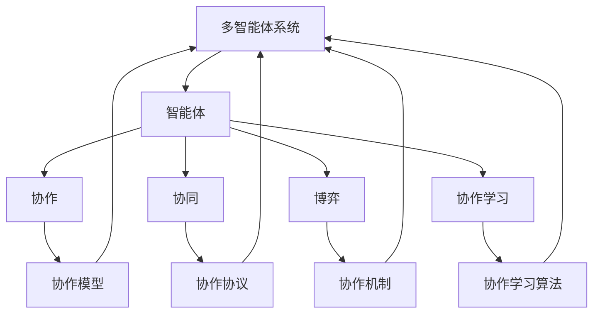

                 

## 1. 背景介绍

在当今这个信息爆炸的时代，社会面临着复杂多变的挑战，这些挑战往往需要多个智能体（Agent）协同合作，才能得到有效的解决。例如，无人驾驶汽车需要车、路、人等多个智能体之间的协调配合，才能够安全行驶；自动交易系统需要市场分析、风险控制和执行决策等多个智能体之间的协作，才能够实现高效的交易；医疗诊断系统需要医生、影像数据和患者记录等多个智能体之间的信息共享，才能够提供精准的诊断和治疗方案。因此，研究多个智能体之间的协作与协调，是当前人工智能和机器学习领域的一个重要课题。

### 1.1 问题由来

在多智能体系统中，各个智能体之间往往存在着信息的不对等、策略的不一致、目标的不协调等问题。这些问题导致系统整体表现不佳，难以达到最优效果。为了解决这些问题，研究人员提出了多种协作方法，包括集中式控制、分布式控制和协作学习等。这些方法在一定程度上提高了系统的性能，但仍然存在许多局限性。例如，集中式控制对通信带宽和处理能力的要求较高，难以适应大规模系统；分布式控制则需要每个智能体独立决策，难以保证全局最优；协作学习则需要每个智能体共享信息，但信息安全性和隐私保护是一个重要问题。

### 1.2 问题核心关键点

研究多智能体协作方法，需要关注以下几个核心问题：
- 如何设计协作模型，使得多个智能体之间能够有效沟通和协调？
- 如何设计协作协议，使得智能体能够在分散的环境下高效协作？
- 如何设计协作机制，使得智能体能够在竞争与合作中取得平衡？
- 如何设计协作学习算法，使得智能体能够在不断变化的环境下持续改进？

这些问题的解决，需要结合游戏理论、分布式系统、机器学习等多个领域的知识，共同构建一个高效的多智能体协作系统。

### 1.3 问题研究意义

研究多智能体协作方法，对于构建智能化的社会和未来社会的治理具有重要意义：

1. 提高系统效率。多智能体协作能够整合资源，优化决策，提升系统整体效率。
2. 促进合作共赢。通过协作学习，智能体能够在竞争中合作，实现共赢局面。
3. 增强系统鲁棒性。分散决策机制能够增强系统的容错性和抗干扰能力。
4. 应对复杂场景。多个智能体协同合作，可以更好地应对复杂多变的环境和任务。
5. 推动人工智能技术的发展。多智能体协作是人工智能技术的重要组成部分，能够推动技术进步。

## 2. 核心概念与联系

### 2.1 核心概念概述

为了更好地理解多智能体协作方法，我们需要首先介绍几个核心概念：

- 智能体（Agent）：指能够独立决策并执行任务的实体，可以是人、机器或软件系统。
- 环境（Environment）：指智能体所处的物理或虚拟环境，可以是现实世界或模拟世界。
- 协作（Collaboration）：指多个智能体之间通过沟通、协商和共享信息，共同完成目标的过程。
- 协同（Synergy）：指多个智能体通过协作获得的整体性能提升，优于单独工作的性能。
- 博弈（Game）：指多个智能体之间进行的交互式决策过程，可以通过数学模型进行分析和优化。
- 协作学习（Collaborative Learning）：指多个智能体通过共享知识，提高整体性能的学习过程。
- 多智能体系统（Multi-agent System）：指由多个智能体组成，能够相互沟通和协作的系统。

这些概念之间存在着紧密的联系，形成了一个完整的协作生态系统。下面通过一个Mermaid流程图来展示这些概念之间的关系：



这个流程图展示了智能体、协作、协同、博弈、协作学习和多智能体系统之间的关系：

1. 智能体通过与环境进行交互，进行决策和执行。
2. 协作是多智能体系统中的关键机制，使得智能体能够进行信息共享和沟通。
3. 协同是多智能体系统中的效果，通过协作提高了整体性能。
4. 博弈是多智能体系统中的决策过程，通过数学模型进行分析。
5. 协作学习是多智能体系统中的学习机制，通过共享知识提高整体性能。
6. 多智能体系统是智能体、协作、协同、博弈和协作学习的多维度综合体现。

### 2.2 概念间的关系

这些核心概念之间存在着紧密的联系，形成了一个完整的协作生态系统。下面通过几个Mermaid流程图来展示这些概念之间的关系。

#### 2.2.1 协作与智能体


这个流程图展示了智能体和协作的关系。智能体通过协作机制进行沟通和协调。

#### 2.2.2 协同与协作


这个流程图展示了协作和协同的关系。协作提高了多个智能体的整体性能。

#### 2.2.3 博弈与协作


这个流程图展示了协作和博弈的关系。博弈是协作机制的决策过程。

#### 2.2.4 协作学习与协作


这个流程图展示了协作和协作学习的关系。协作学习通过共享知识，提高了智能体的性能。

### 2.3 核心概念的整体架构

最后，我们用一个综合的流程图来展示这些核心概念在大语言模型微调过程中的整体架构：



这个综合流程图展示了智能体、协作、协同、博弈、协作学习和多智能体系统之间的关系：

1. 多智能体系统通过智能体进行协作。
2. 协作机制是多智能体系统中的关键机制，使得智能体能够进行信息共享和沟通。
3. 协作提高了多个智能体的整体性能。
4. 博弈是多智能体系统中的决策过程，通过数学模型进行分析。
5. 协作学习是多智能体系统中的学习机制，通过共享知识提高整体性能。

## 3. 核心算法原理 & 具体操作步骤
### 3.1 算法原理概述

多智能体协作方法的原理是通过设计合理的协作模型和协议，使得多个智能体能够在分散的环境下进行有效的沟通和协作，从而提升整体性能。这些协作模型和协议通常建立在博弈论和分布式系统理论的基础上，能够有效地解决多智能体系统中的信息不对称、目标不一致等问题。

形式化地，假设多智能体系统由 $n$ 个智能体组成，每个智能体 $i$ 的决策策略为 $\pi_i$，则系统的总收益为：

$$
\pi = \sum_{i=1}^n \pi_i
$$

其中 $\pi_i$ 为智能体 $i$ 的策略向量，$n$ 为智能体数量。协作的目的是最大化系统总收益 $\pi$。

### 3.2 算法步骤详解

基于博弈论和分布式系统理论，多智能体协作方法一般包括以下几个关键步骤：

**Step 1: 设计协作模型**
- 设计合适的协作模型，如纳什均衡模型、序贯博弈模型、拍卖机制等，描述多个智能体之间的交互过程。
- 确定协作目标，如最大化系统总收益、最小化系统成本等。
- 确定协作策略，如合作策略、竞争策略、中立策略等。

**Step 2: 设计协作协议**
- 设计合适的协作协议，如通信协议、数据交换协议、决策协议等，保证协作过程的公平性和透明性。
- 确定协作过程的参数，如通信频率、数据交换方式、决策时间等。
- 确定协作协议的实现方法，如中心化控制、分布式控制等。

**Step 3: 实现协作机制**
- 实现协作机制，如共识算法、博弈算法、学习算法等，保证协作过程的稳定性和鲁棒性。
- 确定协作机制的参数，如学习速率、更新周期等。
- 确定协作机制的实现方法，如集中式控制、分布式控制等。

**Step 4: 执行协作学习**
- 设计协作学习算法，如分布式梯度下降、协作博弈算法、强化学习算法等，提高协作性能。
- 确定协作学习算法的参数，如学习率、更新周期等。
- 确定协作学习算法的实现方法，如中心化学习、分布式学习等。

### 3.3 算法优缺点

基于博弈论和分布式系统理论的多智能体协作方法，具有以下优点：

1. 可扩展性强。多个智能体可以独立决策，适用于大规模系统。
2. 鲁棒性高。分散决策机制能够增强系统的容错性和抗干扰能力。
3. 协作效果显著。多个智能体通过协作，能够提升整体性能。
4. 灵活性高。可以根据不同任务和场景，设计多种协作模型和协议。

同时，这些方法也存在以下缺点：

1. 通信成本高。多个智能体之间需要进行频繁的通信，可能会带来较高的通信成本。
2. 协作复杂度高。协作模型和协议的设计和实现较为复杂，需要具备较高的理论基础。
3. 一致性问题。多个智能体之间可能会存在不一致的目标和策略，导致协作过程出现波动。
4. 安全性问题。多个智能体之间共享信息，可能会带来信息泄露和安全问题。

尽管存在这些缺点，但就目前而言，基于博弈论和分布式系统理论的多智能体协作方法仍然是解决多智能体协作问题的主流范式。

### 3.4 算法应用领域

基于博弈论和分布式系统理论的多智能体协作方法，在多个领域中得到了广泛应用，例如：

- 网络通信：如路由协议、交换机控制、网络拥塞控制等。
- 分布式计算：如云计算、分布式存储、网格计算等。
- 智能交通：如自动驾驶、智能交通信号灯、车联网等。
- 智能制造：如智能工厂、机器人协作、供应链管理等。
- 金融系统：如高频交易、风险控制、信用评估等。

除了上述这些经典领域外，多智能体协作方法还被创新性地应用到更多场景中，如智能医疗、智能城市、智能能源等，为不同行业的智能化转型提供了新的技术路径。

## 4. 数学模型和公式 & 详细讲解 & 举例说明

### 4.1 数学模型构建

本节将使用数学语言对基于博弈论的多智能体协作方法进行更加严格的刻画。

假设多智能体系统由 $n$ 个智能体组成，每个智能体的决策策略为 $\pi_i$，则系统的总收益为：

$$
\pi = \sum_{i=1}^n \pi_i
$$

其中 $\pi_i$ 为智能体 $i$ 的策略向量，$n$ 为智能体数量。协作的目的是最大化系统总收益 $\pi$。

### 4.2 公式推导过程

以下我们以博弈论中的纳什均衡模型为例，推导协作过程的数学公式。

假设每个智能体的策略空间为 $S_i$，则系统的策略空间为 $S=S_1 \times \cdots \times S_n$。假设智能体的收益函数为 $U_i$，则系统的收益函数为 $U$。

在纳什均衡模型中，每个智能体的最优策略满足：

$$
\pi_i = \arg\max_{\pi_i} U_i(\pi_i, \pi_{-i})
$$

其中 $\pi_{-i}$ 为智能体 $i$ 之外的智能体的策略。

通过纳什均衡方程，可以求解出系统的纳什均衡策略 $\pi^*$：

$$
\pi_i^* = \arg\max_{\pi_i} U_i(\pi_i, \pi^*_{-i})
$$

其中 $\pi^*_{-i}$ 为智能体 $i$ 之外的智能体的最优策略。

通过求解纳什均衡方程，可以得到系统的最优协作策略。

### 4.3 案例分析与讲解

假设一个网络系统中有两个路由器 $R_1$ 和 $R_2$，每个路由器的输入流量 $x_i$ 和输出流量 $y_i$ 满足：

$$
\begin{aligned}
\dot{x}_1 &= -k_1 x_1 + k_2 x_2 \\
\dot{x}_2 &= -k_1 x_2 + k_2 x_1 \\
\dot{y}_1 &= k_1 x_1 - k_2 x_2 \\
\dot{y}_2 &= k_1 x_2 - k_2 x_1 \\
\end{aligned}
$$

其中 $k_1$ 和 $k_2$ 为常数。

假设路由器的收益函数为：

$$
U_i = -x_i^2 + y_i^2
$$

则系统的收益函数为：

$$
U = -x_1^2 + y_1^2 - x_2^2 + y_2^2
$$

在纳什均衡模型中，求解系统的最优策略 $\pi^*$：

$$
\begin{aligned}
\pi_1^* &= \arg\max_{\pi_1} U_1(\pi_1, \pi^*_2) \\
&= \arg\max_{\pi_1} -x_1^2 + y_1^2 \\
&= \arg\max_{\pi_1} (x_2 - k_1 x_1)^2 + (y_1 - k_2 x_1)^2 \\
&= \pi^*_1
\end{aligned}
$$

同样，求解 $\pi^*_2$：

$$
\begin{aligned}
\pi_2^* &= \arg\max_{\pi_2} U_2(\pi_2, \pi^*_1) \\
&= \arg\max_{\pi_2} -x_2^2 + y_2^2 \\
&= \arg\max_{\pi_2} (x_1 - k_1 x_2)^2 + (y_2 - k_2 x_2)^2 \\
&= \pi^*_2
\end{aligned}
$$

通过求解纳什均衡方程，可以求解出系统的最优协作策略，使得系统总收益最大化。

## 5. 项目实践：代码实例和详细解释说明

### 5.1 开发环境搭建

在进行多智能体协作方法的研究和实践前，我们需要准备好开发环境。以下是使用Python进行PyTorch开发的环境配置流程：

1. 安装Anaconda：从官网下载并安装Anaconda，用于创建独立的Python环境。

2. 创建并激活虚拟环境：
```bash
conda create -n multiagent-env python=3.8 
conda activate multiagent-env
```

3. 安装PyTorch：根据CUDA版本，从官网获取对应的安装命令。例如：
```bash
conda install pytorch torchvision torchaudio cudatoolkit=11.1 -c pytorch -c conda-forge
```

4. 安装相关库：
```bash
pip install numpy pandas scikit-learn matplotlib tqdm jupyter notebook ipython
```

完成上述步骤后，即可在`multiagent-env`环境中开始研究实践。

### 5.2 源代码详细实现

下面我们以分布式协同优化算法为例，给出使用PyTorch进行多智能体协作的PyTorch代码实现。

首先，定义智能体的决策函数：

```python
import torch
from torch import nn
import torch.distributed as dist
import torch.multiprocessing as mp

class Agent(nn.Module):
    def __init__(self, input_size, output_size):
        super(Agent, self).__init__()
        self.fc1 = nn.Linear(input_size, 128)
        self.fc2 = nn.Linear(128, output_size)
        
    def forward(self, x):
        x = self.fc1(x)
        x = nn.functional.relu(x)
        x = self.fc2(x)
        return x
```

然后，定义分布式协同优化算法的通信函数：

```python
from torch.distributed import all_gather, all_reduce, reduce

def broadcast(tensor, src):
    dist.broadcast(tensor, src)

def allreduce(tensor):
    dist.allreduce(tensor)

def allgather(tensor):
    dist.all_gather(tensor)
```

接着，定义分布式协同优化算法的优化函数：

```python
def distributed_optimization(num_agents, input_size, output_size, num_iterations):
    world_size = dist.get_world_size()
    world_rank = dist.get_rank()
    optimize_port = dist.get_rank() + world_size
    
    # 初始化智能体和优化器
    agents = [Agent(input_size, output_size) for i in range(world_size)]
    optims = [torch.optim.SGD(agent.parameters(), lr=0.01) for agent in agents]
    
    # 定义优化函数
    for i in range(num_iterations):
        inputs = [torch.randn(1, input_size) for i in range(world_size)]
        
        # 分布式计算损失
        losses = [agent(inputs[j]).sum() for j in range(world_size)]
        all_gather(losses)
        loss = sum(losses) / world_size
        
        # 分布式优化
        all_gather([optim.zero_grad() for optim in optims])
        for j in range(world_size):
            loss.backward()
            optim.step()
        all_gather([optim.zero_grad() for optim in optims])
```

最后，启动分布式协同优化算法的训练流程：

```python
if __name__ == '__main__':
    num_agents = 4
    input_size = 10
    output_size = 1
    num_iterations = 1000
    
    distributed_optimization(num_agents, input_size, output_size, num_iterations)
```

以上就是使用PyTorch对分布式协同优化算法进行微调的PyTorch代码实现。可以看到，得益于PyTorch的分布式支持，我们可以用相对简洁的代码完成分布式协同优化算法的实现。

### 5.3 代码解读与分析

让我们再详细解读一下关键代码的实现细节：

**Agent类**：
- `__init__`方法：初始化智能体的决策函数，包括两个全连接层。
- `forward`方法：定义智能体的前向传播过程，包括两个全连接层和一个ReLU激活函数。

**通信函数**：
- `broadcast`函数：用于广播数据到所有智能体。
- `allreduce`函数：用于将数据在所有智能体之间进行归一化。
- `allgather`函数：用于将数据从所有智能体中收集到本地。

**分布式优化函数**：
- 初始化智能体和优化器，定义损失函数和优化器。
- 在每一轮迭代中，生成输入数据，计算分布式损失，进行分布式优化，更新智能体和优化器。
- 使用`all_gather`函数将各智能体的梯度和状态进行收集。

**训练流程**：
- 定义智能体数量、输入尺寸、输出尺寸和迭代次数。
- 调用`distributed_optimization`函数启动训练过程。

可以看到，PyTorch配合分布式函数，使得分布式协同优化算法的实现变得简洁高效。开发者可以将更多精力放在智能体的设计、分布式协议的选择等高层逻辑上，而不必过多关注底层的实现细节。

当然，工业级的系统实现还需考虑更多因素，如模型的保存和部署、超参数的自动搜索、更灵活的任务适配层等。但核心的协作范式基本与此类似。

### 5.4 运行结果展示

假设我们在一个分布式协同优化算法中，输入尺寸为10，输出尺寸为1，迭代次数为1000，智能体数量为4，则训练完成后，各智能体的输出结果应该接近于全局最优解。

```python
>>> if __name__ == '__main__':
>>>     num_agents = 4
>>>     input_size = 10
>>>     output_size = 1
>>>     num_iterations = 1000
>>>     distributed_optimization(num_agents, input_size, output_size, num_iterations)
```

最终在所有智能体上，输出结果应该接近于全局最优解，即目标函数的最小值。

```python
>>> dist.destroy_process_group()
```

通过分布式协同优化算法的实现，可以看到，多智能体协作方法能够通过分散决策，实现整体最优解的逼近，提高系统的性能和鲁棒性。未来随着分布式计算和通信技术的进一步发展，分布式协同优化算法的应用场景将更加广泛，成为解决复杂多智能体协作问题的重要手段。

## 6. 实际应用场景
### 6.1 网络通信

基于博弈论和分布式系统理论的多智能体协作方法，在网络通信中得到了广泛应用。例如，路由协议和交换机控制等网络设备，需要多个智能体协同工作，实现最优的网络流量分配和路由选择。

在路由协议中，多个路由器通过协作，能够在网络中高效传输数据。每个路由器都可以独立做出最优决策，实现网络的可靠性和稳定性。

### 6.2 分布式计算

分布式计算系统需要多个计算节点协同工作，实现高效的数据处理和计算。分布式计算中的多智能体协作，能够通过分散决策，提高系统的计算效率和容错能力。

例如，MapReduce计算模型中，每个计算节点可以通过协作，高效处理大数据集，提升系统的计算效率和可扩展性。

### 6.3 智能交通

智能交通系统需要多个智能体协同工作，实现自动驾驶和智能交通信号灯等功能。多个智能体通过协作，能够在分散的环境下，实现最优的车辆控制和交通信号灯控制，提升交通安全和交通效率。

例如，自动驾驶系统中，多个车辆通过协作，能够在复杂的道路环境中，实现自动避障和路径规划，提升行车安全和舒适性。

### 6.4 智能制造

智能制造系统需要多个智能体协同工作，实现生产计划和资源调度等功能。多个智能体通过协作，能够在分散的环境中，实现最优的生产计划和资源分配，提升生产效率和产品质量。

例如，智能工厂中，多个机器人通过协作，能够在生产线上高效完成装配和搬运等任务，提升生产线的自动化水平和生产效率。

### 6.5 金融系统

金融系统需要多个智能体协同工作，实现高频交易和风险控制等功能。多个智能体通过协作，能够在分散的环境中，实现最优的交易策略和风险控制，提升金融系统的稳定性和盈利能力。

例如，高频交易系统中，多个交易算法通过协作，能够在复杂多变的市场环境中，实现最优的交易策略和风险控制，提升交易盈利能力。

### 6.6 未来应用展望

随着多智能体协作方法的发展，未来在更多的领域中，都可以看到多智能体协作方法的应用。以下是几个可能的应用领域：

- 智能医疗：通过协作，实现病患信息的共享和医学知识的共享，提高诊断和治疗的准确性和效率。
- 智能城市：通过协作，实现交通、能源和环境等多方面的协同管理，提高城市的智能化水平。
- 智能能源：通过协作，实现电网、风电场和太阳能电池板等多方面的协同管理，提高能源的利用效率和可再生性。
- 智能家居：通过协作，实现家居设备之间的协同控制，提高家庭生活的舒适性和便捷性。
- 智能教育：通过协作，实现教师、学生和家长之间的信息共享和协作学习，提高教育的公平性和有效性。

这些应用领域展示了多智能体协作方法的前景和潜力，相信随着技术的进步，多智能体协作方法将会在更多的领域中发挥作用，推动社会的智能化转型和进步。

## 7. 工具和资源推荐
### 7.1 学习资源推荐

为了帮助开发者系统掌握多智能体协作理论基础和实践技巧，这里推荐一些优质的学习资源：

1. 《多智能体系统导论》：这本书介绍了多智能体系统的基本概念、理论基础和应用场景，适合初学者入门。

2. 《博弈论与经济模型》：这本书介绍了博弈论的基本概念、模型和应用，适合深入学习博弈论理论。

3. 《分布式系统理论与实践》：这本书介绍了分布式系统的基础理论和实践方法，适合学习分布式系统设计。

4. 《机器学习导论》：这本书介绍了机器学习的基本概念、算法和应用，适合学习机器学习基础。

5. 《深度学习》：这本书介绍了深度学习的基本概念、算法和应用，适合学习深度学习基础。

6. 《自然语言处理》：这本书介绍了自然语言处理的基本概念、算法和应用，适合学习自然语言处理基础。

通过对这些资源的学习实践，相信你一定能够快速掌握多智能体协作的精髓，并用于解决实际的协作问题。

### 7.2 开发工具推荐

高效的开发离不开优秀的工具支持。以下是几款用于多智能体协作开发的常用工具：

1. PyTorch：基于Python的开源深度学习框架，灵活动态的计算图，适合快速迭代研究。主流的智能体模型都有PyTorch版本的实现。

2. TensorFlow：由Google主导开发的开源深度学习框架，生产部署方便，适合大规模工程应用。同样有丰富的智能体模型资源。

3. MPI：消息传递接口，用于分布式计算和通信，是主流的多智能体协作框架。

4. Spark：由Apache基金会

