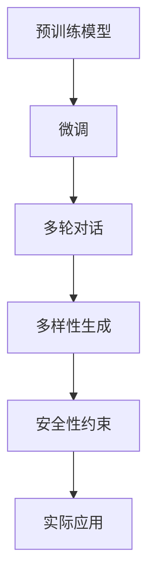

                 

# OpenAI Chat Completions API

> 关键词：OpenAI, Chatbot, Completion, Natural Language Processing, Machine Learning, AI-API

## 1. 背景介绍

随着人工智能技术的发展，自然语言处理（NLP）领域出现了许多创新的应用，其中聊天机器人（Chatbot）是一个重要的方向。OpenAI开发的Chat Completions API为开发者提供了一种快速构建智能聊天机器人的方式，能够在短时间内搭建出具备复杂对话能力、自然语言理解和生成能力的应用。

### 1.1 问题由来

聊天机器人旨在模拟人类对话，能够处理用户输入的自然语言，并根据上下文做出合理的响应。然而，传统的聊天机器人多依赖于规则或模板，缺乏足够的语义理解和生成能力，难以实现真正意义上的人机交互。随着深度学习和大语言模型的出现，基于模型驱动的聊天机器人成为了新趋势。这些模型通过大规模无监督学习获取丰富的语言知识，并通过微调适配特定对话任务，具备了强大的语言理解和生成能力。

### 1.2 问题核心关键点

OpenAI的Chat Completions API是近年来NLP领域的重大突破之一，通过接入GPT-3等先进的语言模型，实现了自动对话生成、问题回答、情感分析等多种应用。其核心关键点包括：

1. **预训练模型**：使用大规模无监督数据预训练的通用语言模型，具备强大的语言理解能力。
2. **微调适配**：通过少数有标签对话数据进行微调，使模型具备特定的对话能力。
3. **多轮对话支持**：支持多轮对话，能够记忆并理解上下文信息，生成连贯的对话内容。
4. **多样性生成**：能够生成多种可能的对话回答，增强对话的趣味性和多样性。
5. **安全性约束**：通过输入过滤和输出限制，保证对话内容的无害性和适宜性。

### 1.3 问题研究意义

OpenAI的Chat Completions API为开发者提供了一种高效构建对话系统的方式，具有以下重要意义：

1. **简化开发**：通过API快速接入预训练模型，降低了对话系统开发的复杂度和成本。
2. **提升性能**：接入先进的语言模型，使聊天机器人具备更强的对话理解和生成能力。
3. **支持多轮对话**：支持多轮对话，提升交互的流畅性和自然性。
4. **增强多样性**：生成多种可能的对话回答，增强对话的趣味性和多样性。
5. **确保安全**：通过输入过滤和输出限制，保证对话内容的无害性和适宜性。

## 2. 核心概念与联系

### 2.1 核心概念概述

OpenAI的Chat Completions API以自然语言处理（NLP）和深度学习为基础，通过预训练模型和微调技术实现自动对话生成。其核心概念包括：

1. **预训练模型**：如GPT-3等大语言模型，在大规模无监督数据上进行预训练，学习丰富的语言知识和常识。
2. **微调**：通过少量标注对话数据进行微调，使模型具备特定的对话能力，适应特定的对话场景。
3. **多轮对话**：能够记忆并理解上下文信息，生成连贯的对话内容。
4. **多样性生成**：生成多种可能的对话回答，增强对话的趣味性和多样性。
5. **安全性约束**：通过输入过滤和输出限制，保证对话内容的无害性和适宜性。

这些概念之间的关系可以通过以下Mermaid流程图来展示：



### 2.2 概念间的关系

上述概念之间存在紧密的联系，构成了OpenAI Chat Completions API的核心技术框架：

1. **预训练模型与微调**：预训练模型提供丰富的语言知识和常识，通过微调适配特定的对话场景，提升对话效果。
2. **微调与多轮对话**：微调过程中，模型学习如何根据上下文信息生成连贯的对话内容。
3. **多轮对话与多样性生成**：多轮对话使得模型能够保持对话连贯性，多样性生成则提升对话趣味性和交互性。
4. **多样性生成与安全性约束**：通过多样性生成，增加对话的趣味性和丰富性，但同时需要保证对话内容的安全性。

这些概念共同构成了OpenAI Chat Completions API的技术生态系统，使其能够在各种对话场景中发挥强大的语言理解和生成能力。通过理解这些核心概念，我们可以更好地把握OpenAI Chat Completions API的工作原理和优化方向。

## 3. 核心算法原理 & 具体操作步骤
### 3.1 算法原理概述

OpenAI的Chat Completions API基于Transformer模型架构，使用深度学习技术实现对话生成。其核心原理包括：

1. **自监督学习**：在大规模无监督数据上进行预训练，学习通用的语言表示和常识。
2. **有监督微调**：在标注对话数据上进行调整，使模型具备特定的对话能力。
3. **多轮对话机制**：通过模型记忆上下文信息，生成连贯的对话内容。
4. **多样性生成**：使用技术手段生成多种可能的对话回答，增加交互的趣味性和多样性。
5. **安全性约束**：通过输入过滤和输出限制，确保对话内容的无害性和适宜性。

### 3.2 算法步骤详解

OpenAI Chat Completions API的实现过程包括以下几个关键步骤：

1. **数据准备**：准备对话数据集，包括对话历史记录和对应的话语。
2. **模型加载**：从OpenAI服务器加载预训练的GPT-3模型。
3. **模型微调**：在标注对话数据上微调模型，调整模型参数，使其具备特定的对话能力。
4. **多轮对话生成**：使用微调后的模型生成连贯的对话内容，支持多轮对话。
5. **输出限制**：设置输出限制，保证对话内容的无害性和适宜性。

### 3.3 算法优缺点

OpenAI的Chat Completions API具有以下优点：

1. **高效构建**：通过API快速接入预训练模型，降低了开发复杂度和成本。
2. **强大能力**：接入先进的语言模型，使聊天机器人具备更强的对话理解和生成能力。
3. **连贯对话**：支持多轮对话，提升交互的流畅性和自然性。
4. **丰富多样**：生成多种可能的对话回答，增强对话的趣味性和多样性。
5. **安全性保障**：通过输入过滤和输出限制，保证对话内容的无害性和适宜性。

同时，该方法也存在以下局限性：

1. **依赖网络**：需要互联网接入才能使用，在网络不稳定或无网络环境下无法使用。
2. **计算资源需求高**：预训练模型和微调过程需要大量计算资源，成本较高。
3. **伦理和隐私问题**：处理用户对话内容可能涉及隐私问题，需要遵守数据隐私法规。
4. **泛化能力不足**：对于特定领域的对话，可能需要重新预训练和微调模型。

### 3.4 算法应用领域

OpenAI的Chat Completions API已经在多种应用场景中得到了广泛应用，例如：

1. **客户服务**：搭建智能客服系统，提供7x24小时客户支持。
2. **医疗咨询**：提供健康咨询和疾病诊断服务，辅助医生诊疗。
3. **教育辅导**：提供在线教育辅导，回答学生疑问，提供个性化学习建议。
4. **情感分析**：分析用户对话内容，了解用户情绪和需求，提升用户体验。
5. **娱乐互动**：提供游戏互动、娱乐聊天等功能，增加用户粘性。

除了上述这些经典应用外，OpenAI Chat Completions API还被创新性地应用到更多场景中，如知识问答、智能写作、虚拟助手等，为NLP技术带来了新的突破。

## 4. 数学模型和公式 & 详细讲解 & 举例说明

### 4.1 数学模型构建

OpenAI的Chat Completions API基于Transformer模型架构，其数学模型构建包括以下几个关键步骤：

1. **输入表示**：将对话历史记录表示为向量形式，用于模型输入。
2. **自注意力机制**：通过自注意力机制，模型学习对话历史记录中的关键信息。
3. **多头注意力**：使用多头注意力机制，提升模型的并行处理能力。
4. **编码解码**：通过编码器-解码器结构，模型将输入转化为输出。
5. **语言模型**：在输出层加入语言模型，提升生成的自然语言质量。

### 4.2 公式推导过程

下面以GPT-3模型为例，展示其数学模型构建和公式推导过程。

假设输入为 $x=(x_1, x_2, ..., x_n)$，输出为 $y=(y_1, y_2, ..., y_n)$，其中 $x_i, y_i$ 分别表示第 $i$ 个词的输入和输出。

设 $f(x_i)$ 为输入 $x_i$ 的嵌入表示，则模型的输入表示为 $F(x)=[f(x_1), f(x_2), ..., f(x_n)]$。

Transformer模型中的自注意力机制通过查询-键-值机制，计算每个词在上下文中的重要性权重。设 $K_i$ 为第 $i$ 个词的键向量，则自注意力计算公式为：

$$
\alpha_i = \frac{\exp\left(\frac{Q_i^T K_i}{\sqrt{d_k}}\right)}{\sum_{j=1}^n \exp\left(\frac{Q_i^T K_j}{\sqrt{d_k}}\right)}
$$

其中 $Q_i = W_Q f(x_i)$，$K_i = W_K f(x_i)$，$d_k$ 为键向量的维度。

多头注意力机制通过将多个自注意力层并行计算，提升模型的并行处理能力。设 $H_i$ 为第 $i$ 个词的隐藏表示，则多头注意力计算公式为：

$$
H_i = \text{Concat}(O_1, O_2, ..., O_h)W_O
$$

其中 $O_j$ 为第 $j$ 个自注意力层的输出，$h$ 为多头注意力层的数量。

编码器-解码器结构通过多层自注意力和全连接层，将输入转化为输出。设 $H_{enc}$ 为编码器输出，$H_{dec}$ 为解码器输出，则编码器解码器的计算公式为：

$$
H_{enc} = f^{(n)}(H_{enc-1})
$$

$$
H_{dec} = f^{(n)}(H_{dec-1})
$$

其中 $f^{(n)}$ 为多层全连接层的激活函数。

语言模型通过softmax函数计算输出概率分布，设 $P(y_i | x_i)$ 为输入 $x_i$ 生成输出 $y_i$ 的概率分布，则语言模型计算公式为：

$$
P(y_i | x_i) = \frac{\exp\left(\log\frac{e^{W_O^T [H_{enc}]}_y}{\sum_k e^{W_O^T [H_{enc}]}_k}\right)}{\sum_k e^{W_O^T [H_{enc}]}_k}
$$

### 4.3 案例分析与讲解

以GPT-3模型为例，假设输入为 "你好吗？"，模型需要生成合适的回应。输入表示 $F(x)=[f(x_1), f(x_2)]$，通过自注意力机制计算权重 $\alpha_1$ 和 $\alpha_2$，得到隐藏表示 $H_1$ 和 $H_2$。将 $H_1$ 和 $H_2$ 送入多层全连接层和激活函数，得到输出 $H_{enc}$。最后通过softmax函数计算输出概率分布，得到可能的回应 "我很好，谢谢"。

## 5. 项目实践：代码实例和详细解释说明

### 5.1 开发环境搭建

为了使用OpenAI的Chat Completions API，需要准备以下开发环境：

1. **安装Python**：安装Python 3.x，建议使用Anaconda或Miniconda。
2. **安装OpenAI SDK**：从OpenAI官方网站下载并安装OpenAI SDK。
3. **设置API Key**：在OpenAI网站上申请API Key，并将其添加到代码中。
4. **安装PyTorch**：安装PyTorch 1.7.1，建议使用Anaconda安装。
5. **安装其他库**：安装其他必要的Python库，如numpy、pandas等。

完成上述步骤后，即可在开发环境中搭建好OpenAI Chat Completions API的开发环境。

### 5.2 源代码详细实现

下面以Python为例，展示如何使用OpenAI Chat Completions API生成对话内容。

首先，导入必要的库和API：

```python
import openai
openai.api_key = 'YOUR_API_KEY'
```

然后，使用API生成对话内容：

```python
response = openai.Completion.create(
    engine="davinci-codex",
    prompt="你好，有什么可以帮助你的？",
    max_tokens=200,
    n=1,
    temperature=0.8,
    stop=["你好，有什么可以帮助你的？"],
    temperature=0.8,
    echo=True,
    n_best=1,
)
```

以上代码中，`engine`参数指定使用的模型，`prompt`参数指定输入提示，`max_tokens`参数指定生成的文本长度，`n`参数指定生成的对话数量，`temperature`参数指定温度调节，`stop`参数指定停止生成对话的条件，`echo`参数指定是否重复输入提示，`n_best`参数指定返回结果的数量。

### 5.3 代码解读与分析

我们可以进一步解读代码的实现细节：

1. **API导入**：导入OpenAI SDK的API模块，设置API Key。
2. **生成对话**：使用API的`Completion.create`方法生成对话内容。其中，`engine`指定使用的模型，`prompt`指定输入提示，`max_tokens`指定生成的文本长度，`n`指定生成的对话数量，`temperature`指定温度调节，`stop`指定停止生成对话的条件，`echo`指定是否重复输入提示，`n_best`指定返回结果的数量。
3. **结果处理**：API返回的`response`中包含了生成的对话内容，可以进一步处理和展示。

### 5.4 运行结果展示

假设生成的对话内容为 "你好，我是一个智能聊天机器人。有什么可以帮助你的？"，可以进一步处理和展示。

## 6. 实际应用场景

### 6.1 客户服务

OpenAI Chat Completions API可以用于构建智能客服系统，提供7x24小时客户支持。在实际应用中，可以将客服历史对话数据作为微调数据，训练模型能够理解用户问题并生成合适的回答。通过多轮对话机制，模型可以记住上下文信息，生成连贯的对话内容。

### 6.2 医疗咨询

OpenAI Chat Completions API可以用于提供健康咨询和疾病诊断服务。在实际应用中，可以将医疗领域相关的问答数据作为微调数据，训练模型能够理解医生的提问并生成合理的回答。通过多轮对话机制，模型可以记忆并理解医生的提问历史，生成连贯的对话内容。

### 6.3 教育辅导

OpenAI Chat Completions API可以用于提供在线教育辅导，回答学生疑问，提供个性化学习建议。在实际应用中，可以将教育领域的问答数据作为微调数据，训练模型能够理解学生的提问并生成合适的回答。通过多轮对话机制，模型可以记住学生的提问历史，生成连贯的对话内容。

### 6.4 未来应用展望

随着OpenAI Chat Completions API的不断演进，未来的应用场景将更加广阔，例如：

1. **情感分析**：分析用户对话内容，了解用户情绪和需求，提升用户体验。
2. **知识问答**：提供知识问答服务，帮助用户解答疑惑。
3. **智能写作**：帮助用户生成文章、撰写报告等。
4. **虚拟助手**：提供虚拟助手服务，帮助用户完成日常任务。

## 7. 工具和资源推荐

### 7.1 学习资源推荐

为了帮助开发者系统掌握OpenAI Chat Completions API的理论基础和实践技巧，这里推荐一些优质的学习资源：

1. OpenAI官方网站：提供API的使用文档、代码示例、常见问题解答等，是学习OpenAI Chat Completions API的最佳入口。
2. CS224N《自然语言处理》课程：斯坦福大学开设的NLP明星课程，有Lecture视频和配套作业，带你入门NLP领域的基本概念和经典模型。
3. 《Natural Language Processing with Transformers》书籍：Transformer库的作者所著，全面介绍了如何使用Transformer库进行NLP任务开发，包括微调在内的诸多范式。
4. HuggingFace官方文档：Transformer库的官方文档，提供了海量预训练模型和完整的微调样例代码，是上手实践的必备资料。
5. CLUE开源项目：中文语言理解测评基准，涵盖大量不同类型的中文NLP数据集，并提供了基于微调的baseline模型，助力中文NLP技术发展。

通过对这些资源的学习实践，相信你一定能够快速掌握OpenAI Chat Completions API的精髓，并用于解决实际的NLP问题。

### 7.2 开发工具推荐

高效的开发离不开优秀的工具支持。以下是几款用于OpenAI Chat Completions API开发的常用工具：

1. Python：Python是最常用的AI开发语言，简单易用，支持丰富的第三方库。
2. PyTorch：基于Python的开源深度学习框架，灵活动态的计算图，适合快速迭代研究。
3. TensorFlow：由Google主导开发的开源深度学习框架，生产部署方便，适合大规模工程应用。
4. Weights & Biases：模型训练的实验跟踪工具，可以记录和可视化模型训练过程中的各项指标，方便对比和调优。与主流深度学习框架无缝集成。
5. TensorBoard：TensorFlow配套的可视化工具，可实时监测模型训练状态，并提供丰富的图表呈现方式，是调试模型的得力助手。
6. Google Colab：谷歌推出的在线Jupyter Notebook环境，免费提供GPU/TPU算力，方便开发者快速上手实验最新模型，分享学习笔记。

合理利用这些工具，可以显著提升OpenAI Chat Completions API的开发效率，加快创新迭代的步伐。

### 7.3 相关论文推荐

OpenAI Chat Completions API的研究源于学界的持续研究。以下是几篇奠基性的相关论文，推荐阅读：

1. Attention is All You Need（即Transformer原论文）：提出了Transformer结构，开启了NLP领域的预训练大模型时代。
2. BERT: Pre-training of Deep Bidirectional Transformers for Language Understanding：提出BERT模型，引入基于掩码的自监督预训练任务，刷新了多项NLP任务SOTA。
3. Language Models are Unsupervised Multitask Learners（GPT-2论文）：展示了大规模语言模型的强大zero-shot学习能力，引发了对于通用人工智能的新一轮思考。
4. Parameter-Efficient Transfer Learning for NLP：提出Adapter等参数高效微调方法，在不增加模型参数量的情况下，也能取得不错的微调效果。
5. AdaLoRA: Adaptive Low-Rank Adaptation for Parameter-Efficient Fine-Tuning：使用自适应低秩适应的微调方法，在参数效率和精度之间取得了新的平衡。
6. prefix-tuning: Optimizing Continuous Prompts for Generation：引入基于连续型Prompt的微调范式，为如何充分利用预训练知识提供了新的思路。

这些论文代表了大语言模型微调技术的发展脉络。通过学习这些前沿成果，可以帮助研究者把握学科前进方向，激发更多的创新灵感。

除上述资源外，还有一些值得关注的前沿资源，帮助开发者紧跟大语言模型微调技术的最新进展，例如：

1. arXiv论文预印本：人工智能领域最新研究成果的发布平台，包括大量尚未发表的前沿工作，学习前沿技术的必读资源。
2. 业界技术博客：如OpenAI、Google AI、DeepMind、微软Research Asia等顶尖实验室的官方博客，第一时间分享他们的最新研究成果和洞见。
3. 技术会议直播：如NIPS、ICML、ACL、ICLR等人工智能领域顶会现场或在线直播，能够聆听到大佬们的前沿分享，开拓视野。
4. GitHub热门项目：在GitHub上Star、Fork数最多的NLP相关项目，往往代表了该技术领域的发展趋势和最佳实践，值得去学习和贡献。
5. 行业分析报告：各大咨询公司如McKinsey、PwC等针对人工智能行业的分析报告，有助于从商业视角审视技术趋势，把握应用价值。

总之，对于OpenAI Chat Completions API的学习和实践，需要开发者保持开放的心态和持续学习的意愿。多关注前沿资讯，多动手实践，多思考总结，必将收获满满的成长收益。

## 8. 总结：未来发展趋势与挑战

### 8.1 总结

本文对OpenAI的Chat Completions API进行了全面系统的介绍。首先阐述了OpenAI Chat Completions API的背景和意义，明确了其在NLP领域的创新价值。其次，从原理到实践，详细讲解了Chat Completions API的数学模型和实现细节，提供了微调过程的完整代码实例。同时，本文还广泛探讨了Chat Completions API在多个行业领域的应用前景，展示了其强大的语言理解和生成能力。此外，本文精选了Chat Completions API的学习资源，力求为读者提供全方位的技术指引。

通过本文的系统梳理，可以看到，OpenAI的Chat Completions API是近年来NLP领域的重大突破之一，极大地提升了自然语言处理技术的应用水平。它通过接入先进的大语言模型，提供了高效、自然的对话生成能力，为开发者提供了强大的工具支持。未来，随着OpenAI Chat Completions API的持续演进，其应用范围将进一步扩大，为更多领域带来新的突破。

### 8.2 未来发展趋势

展望未来，OpenAI的Chat Completions API将呈现以下几个发展趋势：

1. **模型规模持续增大**：随着算力成本的下降和数据规模的扩张，预训练语言模型的参数量还将持续增长。超大规模语言模型蕴含的丰富语言知识，有望支撑更加复杂多变的下游任务微调。
2. **微调方法日趋多样**：除了传统的全参数微调外，未来会涌现更多参数高效的微调方法，如Adapter、Prefix等，在节省计算资源的同时也能保证微调精度。
3. **持续学习成为常态**：随着数据分布的不断变化，微调模型也需要持续学习新知识以保持性能。如何在不遗忘原有知识的同时，高效吸收新样本信息，将成为重要的研究课题。
4. **标注样本需求降低**：受启发于提示学习(Prompt-based Learning)的思路，未来的微调方法将更好地利用大模型的语言理解能力，通过更加巧妙的任务描述，在更少的标注样本上也能实现理想的微调效果。
5. **多模态微调崛起**：当前的微调主要聚焦于纯文本数据，未来会进一步拓展到图像、视频、语音等多模态数据微调。多模态信息的融合，将显著提升语言模型对现实世界的理解和建模能力。
6. **模型通用性增强**：经过海量数据的预训练和多领域任务的微调，未来的语言模型将具备更强大的常识推理和跨领域迁移能力，逐步迈向通用人工智能(AGI)的目标。

以上趋势凸显了OpenAI Chat Completions API的广阔前景。这些方向的探索发展，必将进一步提升OpenAI Chat Completions API的性能和应用范围，为人类认知智能的进化带来深远影响。

### 8.3 面临的挑战

尽管OpenAI Chat Completions API已经取得了瞩目成就，但在迈向更加智能化、普适化应用的过程中，它仍面临着诸多挑战：

1. **依赖网络**：需要互联网接入才能使用，在网络不稳定或无网络环境下无法使用。
2. **计算资源需求高**：预训练模型和微调过程需要大量计算资源，成本较高。
3. **伦理和隐私问题**：处理用户对话内容可能涉及隐私问题，需要遵守数据隐私法规。
4. **泛化能力不足**：对于特定领域的对话，可能需要重新预训练和微调模型。

### 8.4 未来突破

面对OpenAI Chat Completions API所面临的种种挑战，未来的研究需要在以下几个方面寻求新的突破：

1. **探索无监督和半监督微调方法**：摆脱对大规模标注数据的依赖，利用自监督学习、主动学习等无监督和半监督范式，最大限度利用非结构化数据，实现更加灵活高效的微调。
2. **研究参数高效和计算高效的微调范式**：开发更加参数高效的微调方法，在固定大部分预训练参数的同时，只更新极少量的任务相关参数。同时优化微调模型的计算图，减少前向传播和反向传播的资源消耗，实现更加轻量级、实时性的部署。
3. **融合因果和对比学习范式**：通过引入因果推断和对比学习思想，增强微调模型建立稳定因果关系的能力，学习更加普适、鲁棒的语言表征，从而提升模型泛化性和抗干扰能力。
4. **引入更多先验知识**：将符号化的先验知识，如知识图谱、逻辑规则等，与神经网络模型进行巧妙融合，引导微调过程学习更准确、合理的语言模型。同时加强不同模态数据的整合，实现视觉、语音等多模态信息与文本信息的协同建模。
5. **结合因果分析和博弈论工具**：将因果分析方法引入微调模型，识别出模型决策的关键特征，增强输出解释的因果性和逻辑性。借助博弈论工具刻画人机交互过程，主动探索并规避模型的脆弱点，提高系统稳定性。
6. **纳入伦理道德约束**：在模型训练目标中引入伦理导向的评估指标，过滤和惩罚有偏见、有害的输出倾向。同时加强人工干预和审核，建立模型行为的监管机制，确保输出符合人类价值观和伦理道德

