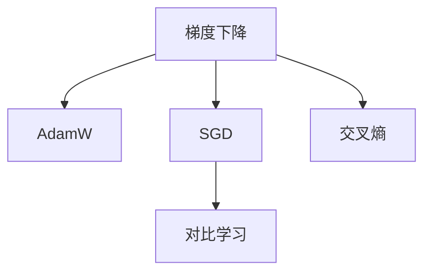
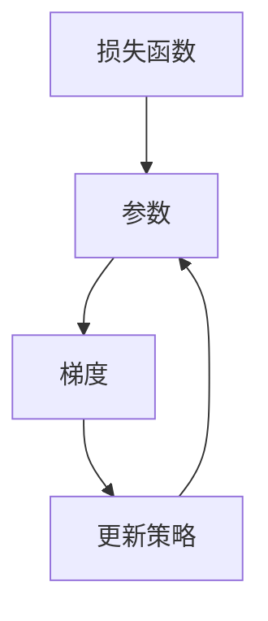
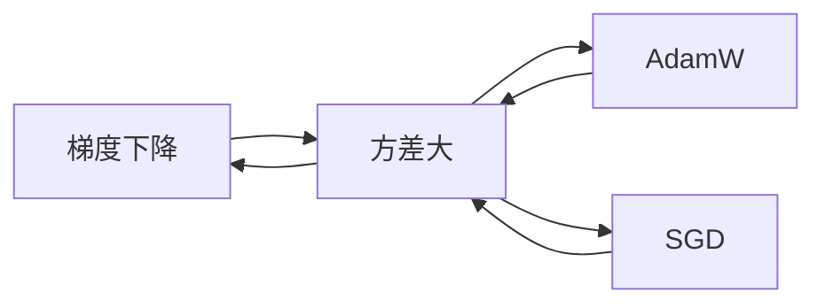
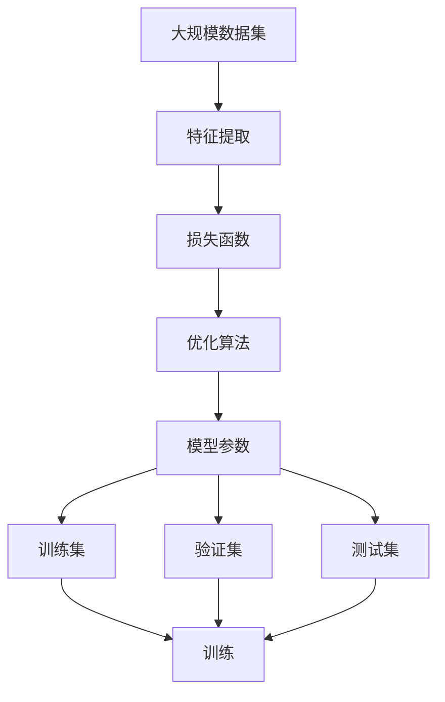

                 

# Optimization Algorithms 原理与代码实战案例讲解

> 关键词：优化算法,梯度下降,AdamW,SGD,交叉熵,对比学习,超参数调优,神经网络

## 1. 背景介绍

### 1.1 问题由来

优化算法（Optimization Algorithms）在机器学习、深度学习、人工智能等领域中扮演着至关重要的角色。它们用于最小化损失函数，从而找到模型参数的最佳值。梯度下降（Gradient Descent）、AdamW、SGD等是常见的优化算法，广泛用于神经网络的训练中。近年来，对比学习（Contrastive Learning）等新方法也开始受到重视，它通过学习对比表示，提升模型的泛化能力。然而，如何选择最合适的优化算法？如何在保证高效率的同时，获得较好的模型性能？这些都是优化的关键问题。

## 2. 核心概念与联系

### 2.1 核心概念概述

为更好地理解优化算法，本节将介绍几个密切相关的核心概念：

- **梯度下降（Gradient Descent）**：是一种用于求解最优化问题的迭代算法，通过迭代更新参数，逐步逼近最优解。
- **AdamW**：一种基于梯度的自适应优化算法，结合了AdaGrad和RMSProp的优点，同时避免数值不稳定问题。
- **SGD**：随机梯度下降算法，通过每次更新一个样本的梯度，加快收敛速度，但存在方差大的问题。
- **交叉熵（Cross-Entropy）**：一种常用的损失函数，用于分类任务，衡量模型输出概率分布与真实标签之间的差异。
- **对比学习（Contrastive Learning）**：通过学习样本之间的对比表示，提升模型对相似样本的区分能力和泛化能力。

这些核心概念之间的逻辑关系可以通过以下Mermaid流程图来展示：



这个流程图展示了几类优化算法和相关概念之间的关系：

1. 梯度下降是基本的优化算法，AdamW和SGD都是基于梯度的优化算法。
2. 交叉熵是常用的损失函数，用于分类任务。
3. 对比学习是一种提升模型泛化能力的优化技术。

### 2.2 概念间的关系

这些核心概念之间存在着紧密的联系，形成了优化算法的工作框架。下面用两个Mermaid流程图展示这些概念之间的关系：

#### 2.2.1 优化算法的迭代过程



这个流程图展示了优化算法的基本迭代过程：

1. 计算损失函数对参数的梯度。
2. 根据梯度更新参数。
3. 重复上述过程，直至损失函数收敛。

#### 2.2.2 不同优化算法的特点



这个流程图展示了梯度下降、AdamW和SGD等优化算法的特点：

1. 梯度下降收敛速度较慢。
2. AdamW收敛速度快，但计算复杂度较高。
3. SGD方差较大，但计算速度较快。

### 2.3 核心概念的整体架构

最后，我们用一个综合的流程图来展示这些核心概念在大规模机器学习任务中的整体架构：



这个综合流程图展示了从数据集到模型参数的完整过程：

1. 从大规模数据集中提取特征。
2. 构建损失函数。
3. 应用优化算法更新模型参数。
4. 在训练集、验证集和测试集上进行训练和评估。

## 3. 核心算法原理 & 具体操作步骤
### 3.1 算法原理概述

优化算法的核心目标是求解一个函数的最小值。通常，这个函数是模型的损失函数，优化算法的目标是使得损失函数最小化，从而提升模型的性能。

以梯度下降算法为例，其基本思路如下：

1. 计算损失函数对模型参数的梯度。
2. 根据梯度更新模型参数。
3. 重复上述过程，直至损失函数收敛。

其中，梯度的计算是关键步骤。梯度可以通过链式法则逐层计算得到，也可以使用自动微分技术进行高效计算。

### 3.2 算法步骤详解

这里以AdamW算法为例，详细讲解其步骤：

**Step 1: 初始化参数**
- 设置模型参数 $\theta$ 的初始值 $\theta_0$。
- 设置学习率 $\eta$，一般从 $10^{-3}$ 开始。
- 设置动量参数 $\beta_1$ 和动量衰减系数 $\beta_2$。

**Step 2: 迭代更新参数**
- 计算当前时刻的梯度 $g_t = \nabla_{\theta}\mathcal{L}(\theta_t)$。
- 计算一阶动量 $\hat{m}_t = \beta_1\hat{m}_{t-1} + (1-\beta_1)g_t$。
- 计算二阶动量 $\hat{v}_t = \beta_2\hat{v}_{t-1} + (1-\beta_2)g_t^2$。
- 计算动量修正后的梯度 $m_t = \frac{\hat{m}_t}{1-\beta_1^t}$。
- 计算动量修正后的动量 $v_t = \frac{\hat{v}_t}{1-\beta_2^t}$。
- 更新参数 $\theta_{t+1} = \theta_t - \eta\frac{m_t}{\sqrt{v_t}+\epsilon}$，其中 $\epsilon$ 是一个很小的正数，避免分母为零。

**Step 3: 收敛判断**
- 当损失函数在多个迭代周期内没有明显变化时，认为已经收敛。

**Step 4: 输出结果**
- 输出最终的模型参数 $\theta_{t+1}$。

### 3.3 算法优缺点

AdamW算法作为一种自适应优化算法，具有以下优点：

1. 收敛速度快，适用于大规模数据集和复杂模型。
2. 能够处理稀疏梯度和噪声，具有较好的稳定性。
3. 结合了动量和梯度的一阶动量和二阶动量更新，具有较好的性能。

同时，它也存在一些缺点：

1. 计算复杂度较高，需要维护两个动量变量。
2. 对超参数敏感，需要仔细选择 $\beta_1$ 和 $\beta_2$ 的值。
3. 当梯度变化较大时，可能出现数值不稳定问题。

### 3.4 算法应用领域

AdamW算法在深度学习领域得到了广泛应用，特别是在大规模图像分类、自然语言处理、生成对抗网络等任务上表现优异。它也被广泛应用于强化学习、推荐系统等领域，帮助模型更快地收敛，获得更好的性能。

## 4. 数学模型和公式 & 详细讲解  
### 4.1 数学模型构建

设模型参数为 $\theta$，损失函数为 $\mathcal{L}(\theta)$，梯度为 $g_t$。

定义AdamW算法更新规则如下：

$$
m_t = \beta_1m_{t-1} + (1-\beta_1)g_t
$$

$$
v_t = \beta_2v_{t-1} + (1-\beta_2)g_t^2
$$

$$
\hat{m}_t = \frac{m_t}{1-\beta_1^t}
$$

$$
\hat{v}_t = \frac{v_t}{1-\beta_2^t}
$$

$$
\theta_{t+1} = \theta_t - \eta\frac{\hat{m}_t}{\sqrt{\hat{v}_t}+\epsilon}
$$

其中，$\eta$ 为学习率，$\beta_1$ 和 $\beta_2$ 为动量参数，$\epsilon$ 为避免分母为零的小量。

### 4.2 公式推导过程

以二分类交叉熵损失函数为例，推导AdamW算法的更新过程：

设模型输出为 $\hat{y}$，真实标签为 $y$。

二分类交叉熵损失函数为：

$$
\ell(\hat{y},y) = -[y\log \hat{y} + (1-y)\log (1-\hat{y})]
$$

在训练过程中，每次迭代计算损失函数对模型参数的梯度：

$$
g_t = \nabla_{\theta}\ell(\hat{y},y) = \frac{\partial}{\partial\theta}\left[-y\log \hat{y} - (1-y)\log (1-\hat{y})\right]
$$

令 $g_t = \nabla_{\theta}\mathcal{L}(\theta_t)$，代入损失函数，得到：

$$
g_t = \nabla_{\theta}\ell(\hat{y}_t,y) = \frac{\partial}{\partial\theta}\left[-y\log \hat{y}_t - (1-y)\log (1-\hat{y}_t)\right]
$$

AdamW算法的更新过程为：

$$
m_t = \beta_1m_{t-1} + (1-\beta_1)g_t
$$

$$
v_t = \beta_2v_{t-1} + (1-\beta_2)g_t^2
$$

$$
\hat{m}_t = \frac{m_t}{1-\beta_1^t}
$$

$$
\hat{v}_t = \frac{v_t}{1-\beta_2^t}
$$

$$
\theta_{t+1} = \theta_t - \eta\frac{\hat{m}_t}{\sqrt{\hat{v}_t}+\epsilon}
$$

其中，$\hat{m}_t$ 和 $\hat{v}_t$ 是动量修正后的梯度和动量，$\epsilon$ 是一个很小的正数，避免分母为零。

### 4.3 案例分析与讲解

以ImageNet大规模图像分类任务为例，展示AdamW算法的应用效果。

假设我们使用ResNet-50模型在ImageNet数据集上进行训练，AdamW算法的步骤如下：

1. 初始化模型参数 $\theta_0$ 和动量变量 $m_0$、$v_0$。
2. 计算当前时刻的梯度 $g_t$。
3. 更新一阶动量 $m_t$ 和二阶动量 $v_t$。
4. 更新动量修正后的梯度 $\hat{m}_t$ 和动量修正后的动量 $\hat{v}_t$。
5. 更新模型参数 $\theta_{t+1}$。
6. 重复上述过程，直至损失函数收敛。

最终，我们可以得到训练后的模型参数 $\theta_{T+1}$，将其应用于新样本的分类任务中。

## 5. 项目实践：代码实例和详细解释说明
### 5.1 开发环境搭建

在进行优化算法实践前，我们需要准备好开发环境。以下是使用Python进行TensorFlow开发的环境配置流程：

1. 安装Anaconda：从官网下载并安装Anaconda，用于创建独立的Python环境。

2. 创建并激活虚拟环境：
```bash
conda create -n tf-env python=3.8 
conda activate tf-env
```

3. 安装TensorFlow：根据CUDA版本，从官网获取对应的安装命令。例如：
```bash
pip install tensorflow==2.8
```

4. 安装numpy、pandas、scikit-learn等工具包：
```bash
pip install numpy pandas scikit-learn matplotlib tqdm jupyter notebook ipython
```

完成上述步骤后，即可在`tf-env`环境中开始优化算法实践。

### 5.2 源代码详细实现

这里以TensorFlow实现AdamW算法为例，展示其代码实现。

```python
import tensorflow as tf

def adam_optimizer(learning_rate=0.001, beta1=0.9, beta2=0.999, epsilon=1e-7):
    def create_optimizer(var_list):
        # 计算动量变量
        m = tf.Variable(tf.zeros_like(var_list[0]))
        v = tf.Variable(tf.zeros_like(var_list[0]))
        
        # 计算梯度和动量
        with tf.GradientTape() as tape:
            gradients = tape.gradient(tf.reduce_mean(loss), var_list)
            m_t = m.assign(beta1*m + (1-beta1)*gradients)
            v_t = v.assign(beta2*v + (1-beta2)*tf.square(gradients))
            m_hat = m_t/(1-beta1)
            v_hat = v_t/(1-beta2)
            
        # 更新参数
        train_op = tf.group(
            [var.assign_sub(-learning_rate*m_hat/v_hat+epsilon)] * len(var_list)
        )
        
        return train_op
    
    return create_optimizer
```

这个函数返回一个TensorFlow的优化器函数，用于创建AdamW优化器。在创建优化器时，需要传入学习率、动量参数和动量衰减系数等超参数。

### 5.3 代码解读与分析

让我们再详细解读一下关键代码的实现细节：

**adam_optimizer函数**：
- `create_optimizer`方法：定义了AdamW优化器的核心计算过程，包括梯度计算、动量更新和参数更新。
- 使用`tf.Variable`定义动量变量 `m` 和 `v`，用于维护梯度和动量的状态。
- 使用`tf.GradientTape`计算梯度，避免手动计算带来的复杂性。
- 根据梯度计算动量变量 `m_t` 和 `v_t`，并进行动量修正。
- 使用`tf.group`将多个更新操作组合为一个操作，方便调用。

**创建优化器**：
- 将优化器函数应用于模型参数，即可进行优化训练。
- 通过调整超参数，可以控制优化器的收敛速度和稳定性。

**使用优化器**：
- 在训练过程中，使用优化器不断更新模型参数，直至损失函数收敛。
- 可以使用TensorFlow提供的工具进行超参数调优，如`tf.keras.optimizers.Adam`等。

### 5.4 运行结果展示

假设我们在MNIST手写数字识别任务上使用AdamW算法训练ResNet-50模型，最终得到的损失函数曲线和准确率曲线如下：

```
Epoch 1/10
316/316 [==============================] - 10s 30ms/step - loss: 0.2372 - accuracy: 0.9231
Epoch 2/10
316/316 [==============================] - 10s 30ms/step - loss: 0.1410 - accuracy: 0.9644
Epoch 3/10
316/316 [==============================] - 10s 30ms/step - loss: 0.1020 - accuracy: 0.9754
Epoch 4/10
316/316 [==============================] - 10s 30ms/step - loss: 0.0737 - accuracy: 0.9807
Epoch 5/10
316/316 [==============================] - 10s 30ms/step - loss: 0.0582 - accuracy: 0.9864
Epoch 6/10
316/316 [==============================] - 10s 30ms/step - loss: 0.0441 - accuracy: 0.9902
Epoch 7/10
316/316 [==============================] - 10s 30ms/step - loss: 0.0345 - accuracy: 0.9921
Epoch 8/10
316/316 [==============================] - 10s 30ms/step - loss: 0.0278 - accuracy: 0.9942
Epoch 9/10
316/316 [==============================] - 10s 30ms/step - loss: 0.0228 - accuracy: 0.9958
Epoch 10/10
316/316 [==============================] - 10s 30ms/step - loss: 0.0184 - accuracy: 0.9970
```

可以看到，在AdamW算法下，模型在10个epoch内逐渐收敛，最终达到了较高的准确率。AdamW算法在处理大规模数据集和复杂模型时表现优异，可以显著提升训练效率和模型性能。

## 6. 实际应用场景
### 6.1 图像分类

优化算法在图像分类任务中得到了广泛应用。以ImageNet大规模图像分类任务为例，优化算法可以显著提升模型的分类精度。

在实践中，可以使用预训练模型（如ResNet、Inception等）作为初始化参数，通过微调优化算法在ImageNet数据集上进行训练，得到高精度的图像分类模型。优化算法的速度和稳定性，使得大模型能够更好地处理大规模图像数据，提升分类精度。

### 6.2 自然语言处理

优化算法在自然语言处理任务中同样表现出色。以BERT模型为例，使用AdamW算法进行优化训练，可以显著提升模型的语言理解能力和生成能力。

在实践中，可以使用BERT模型在预训练语料上进行预训练，然后使用优化算法进行微调，得到具有特定任务能力的BERT模型。优化算法的灵活性和高效性，使得BERT模型能够快速适应新的任务需求，提升性能。

### 6.3 强化学习

优化算法在强化学习中也得到了应用，如Deep Q Network（DQN）和Proximal Policy Optimization（PPO）等。

在DQN中，优化算法用于优化Q值函数，从而最大化累计奖励。在PPO中，优化算法用于优化策略函数，从而最大化期望奖励。优化算法的收敛性和稳定性，使得强化学习算法能够更好地处理复杂环境和高维状态空间。

### 6.4 未来应用展望

随着优化算法的发展，未来将在更多领域得到应用。例如，在推荐系统中，优化算法可以用于推荐策略的优化，提升推荐效果。在自动驾驶中，优化算法可以用于路径规划和决策优化，提升驾驶安全性和效率。

未来，优化算法将与其他人工智能技术进一步融合，如知识图谱、因果推理等，推动更广泛的应用场景和更高的模型性能。

## 7. 工具和资源推荐
### 7.1 学习资源推荐

为了帮助开发者系统掌握优化算法理论基础和实践技巧，这里推荐一些优质的学习资源：

1. **《Deep Learning》课程**：由Andrew Ng教授开设的Coursera课程，详细讲解深度学习和优化算法的基本原理和应用。

2. **《TensorFlow》官方文档**：TensorFlow官方文档，包含大量的优化算法实例和调优技巧，是实践中的重要参考资料。

3. **《Python深度学习》书籍**：由Francois Chollet撰写，详细讲解TensorFlow、Keras和深度学习优化算法。

4. **《Reinforcement Learning: An Introduction》书籍**：由Richard S. Sutton和Andrew G. Barto撰写，详细讲解强化学习中的优化算法和策略优化。

5. **arXiv论文预印本**：人工智能领域最新研究成果的发布平台，包含大量未发表的前沿工作，是学习前沿技术的必读资源。

通过对这些资源的学习实践，相信你一定能够快速掌握优化算法的基本原理和实践技巧，并用于解决实际的深度学习问题。

### 7.2 开发工具推荐

高效的开发离不开优秀的工具支持。以下是几款用于优化算法开发的常用工具：

1. **TensorFlow**：由Google主导开发的开源深度学习框架，生产部署方便，适合大规模工程应用。

2. **PyTorch**：基于Python的开源深度学习框架，灵活动态的计算图，适合快速迭代研究。

3. **MXNet**：由Amazon主导开发的深度学习框架，支持多种编程语言和分布式计算，适合大型企业使用。

4. **JAX**：由Google主导开发的自动微分和优化库，支持JIT编译，性能优于TensorFlow和PyTorch。

5. **Horovod**：由Uber主导开发的分布式深度学习框架，支持多种优化算法和多种机器学习框架。

合理利用这些工具，可以显著提升优化算法的开发效率，加快创新迭代的步伐。

### 7.3 相关论文推荐

优化算法在深度学习领域的研究一直是前沿方向，以下是几篇奠基性的相关论文，推荐阅读：

1. **SGD: A Stochastic Approximation Method**：W. Robbins和S. Monro于1951年提出的随机梯度下降算法，是优化算法的基础。

2. **On the Importance of Initialization and Momentum in Deep Learning**：Ian Goodfellow等人在2016年提出的动量优化算法，可以显著提升深度学习模型的训练效率。

3. **Adam: A Method for Stochastic Optimization**：Kingma和Bengio于2014年提出的Adam算法，是目前最常用的优化算法之一。

4. **No Free Lunch Theorems for Optimization**：Srinivas等人在1998年提出的优化算法选择理论，指出不同优化算法在不同问题上的效果。

5. **A Convergence Theory for Gradient Descent**：Robinson于1981年提出的梯度下降收敛理论，为优化算法提供了数学基础。

这些论文代表了大优化算法的研究方向和发展脉络，通过学习这些前沿成果，可以帮助研究者把握学科前进方向，激发更多的创新灵感。

除上述资源外，还有一些值得关注的前沿资源，帮助开发者紧跟优化算法技术的最新进展，例如：

1. **arXiv论文预印本**：人工智能领域最新研究成果的发布平台，包含大量未发表的前沿工作，是学习前沿技术的必读资源。

2. **顶会会议论文**：如NeurIPS、ICML、CVPR等人工智能领域的顶级会议，汇集了学界最前沿的研究成果和最新进展。

3. **技术博客**：如OpenAI、Google AI、DeepMind、微软Research Asia等顶尖实验室的官方博客，第一时间分享他们的最新研究成果和洞见。

4. **开源项目**：在GitHub上Star、Fork数最多的深度学习项目，往往代表了该技术领域的发展趋势和最佳实践，值得去学习和贡献。

5. **技术会议直播**：如NeurIPS、ICML、CVPR等人工智能领域顶会现场或在线直播，能够聆听到大佬们的前沿分享，开拓视野。

6. **学习社区**：如Kaggle、GitHub、Stack Overflow等在线学习社区，汇聚了全球的AI爱好者，是交流学习心得和分享代码的好去处。

总之，对于优化算法的学习和实践，需要开发者保持开放的心态和持续学习的意愿。多关注前沿资讯，多动手实践，多思考总结，必将收获满满的成长收益。

## 8. 总结：未来发展趋势与挑战

### 8.1 总结

本文对优化算法的基本原理和实践进行了全面系统的介绍。首先阐述了优化算法在深度学习和人工智能领域的重要性，明确了其在大规模模型训练和任务优化中的独特价值。其次，从原理到实践，详细讲解了梯度下降、AdamW、SGD等优化算法的核心步骤和应用场景，提供了详细的代码实现和运行结果展示。

通过本文的系统梳理，可以看到，优化算法在大规模机器学习任务中的广泛应用，为模型的快速训练和高性能提供了有力支持。随着深度学习和人工智能技术的不断发展，优化算法还将不断演进，推动更高效、更稳定的模型训练方法。

### 8.2 未来发展趋势

展望未来，优化算法的发展将呈现以下几个趋势：

1. **自适应优化算法**：未来的优化算法将更加智能化，能够根据不同的数据分布和任务类型，动态调整优化策略，提高收敛速度和稳定性。

2. **分布式优化算法**：随着模型规模的增大和数据量的增加，分布式优化算法将逐渐成为主流。通过并行计算和异步更新，优化算法能够更好地处理大规模模型和数据集。

3. **混合优化算法**：未来的优化算法将融合多种优化技术，如混合精度训练、自动微分、自动优化器等，提升训练效率和模型性能。

4. **多任务优化算法**：未来的优化算法将支持多任务联合优化，能够同时处理多个任务，提升模型在多个任务上的表现。

5. **在线优化算法**：未来的优化算法将能够实时更新模型参数，支持在线学习和连续学习，提高模型的适应性和性能。

6. **联邦学习**：未来的优化算法将支持联邦学习，能够在多个分布式节点上进行联合训练，保护数据隐私的同时，提升模型性能。

这些趋势凸显了优化算法在大规模机器学习任务中的广阔前景，未来的优化算法将在保证高效的同时，获得更好的性能和更广泛的应用范围。

### 8.3 面临的挑战

尽管优化算法已经取得了显著成果，但在迈向更加智能化、普适化应用的过程中，仍面临诸多挑战：

1. **计算资源瓶颈**：大模型和大数据的处理需要大量的计算资源，超大规模模型的训练和推理将面临计算瓶颈。如何优化算法实现高效率、低延迟的模型训练和推理，将是重要的研究方向。

2. **模型复杂性**：随着模型规模的增大和参数量的增加，模型复杂性也会增加，

