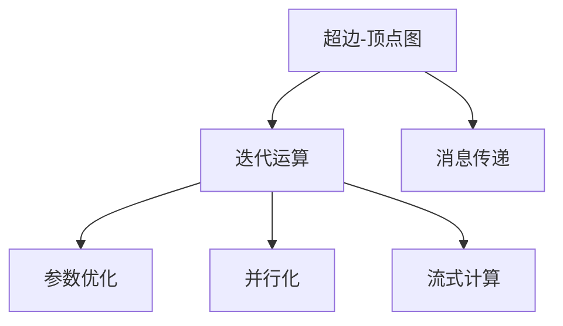
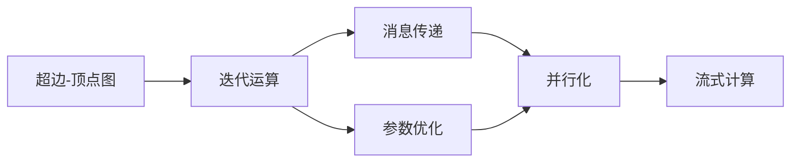

                 

# Pregel原理与代码实例讲解

> 关键词：Pregel, 图计算, 分布式计算, MapReduce, 图算法, 图聚类, 图挖掘, 社交网络分析

## 1. 背景介绍

### 1.1 问题由来
随着数据规模的不断扩大，传统集中式计算已经难以满足大数据处理的需要。分布式计算框架MapReduce通过将数据分割为多个块，并行计算，有效解决了这一问题。然而，MapReduce仅适用于处理结构化数据，对于图数据的计算处理仍然面临诸多挑战。

为解决这一问题，Google于2008年提出Pregel，一种专为图计算设计的分布式计算框架。Pregel在Google GraphLab中应用广泛，可用于图聚类、图挖掘、社交网络分析等多个领域。

Pregel采用图计算的原理，将图数据表示为超边-顶点图，通过一系列的迭代运算，对图数据进行计算处理。这种设计使得Pregel在处理大规模图数据时表现出色，成为图计算领域的重要研究范式。

## 2. 核心概念与联系

### 2.1 核心概念概述

Pregel框架基于MapReduce的编程模型，并做了针对性优化。其核心概念包括：

- **超边-顶点图**：Pregel中的图数据表示为超边-顶点图。每个超边由多个顶点组成，顶点之间通过边进行连接。超边-顶点图可以表示任何类型的图，包括有向图、无向图、带权图等。

- **迭代运算**：Pregel采用迭代的计算模型，每次迭代都会更新顶点状态和超边状态。迭代运算的终止条件由用户自定义，一般以预设轮数或满足一定条件为准。

- **消息传递**：Pregel支持通过消息传递的方式，在超边和顶点之间交换信息。消息传递模型使得Pregel能够高效地处理大规模图数据。

- **参数优化**：Pregel支持用户调整算法的参数，如迭代轮数、消息传递的机制等。这些参数的优化对于提升算法性能、降低计算成本具有重要意义。

- **并行化**：Pregel采用MapReduce的并行化机制，能够有效地在多台计算机上并行计算图数据。这种并行化设计提高了Pregel的计算效率和处理能力。

- **流式计算**：Pregel采用流式计算的机制，能够在计算过程中动态处理输入数据，支持流式数据处理。

这些核心概念构成了Pregel的计算模型和编程框架，使得其在图计算领域具有广泛的应用前景。

### 2.2 概念间的关系

为更好地理解Pregel的原理和设计，本节将通过以下Mermaid流程图展示这些核心概念之间的关系：



这个流程图展示了Pregel中各核心概念之间的关系：

1. **超边-顶点图**：Pregel的计算对象，通过对超边-顶点图的迭代运算，实现图计算。
2. **迭代运算**：Pregel的计算模型，通过多次迭代运算更新顶点和超边的状态，最终得到计算结果。
3. **消息传递**：Pregel的消息传递机制，通过超边和顶点之间的信息交换，实现数据传递和计算。
4. **参数优化**：Pregel的配置项，通过调整参数，优化算法的性能和资源利用率。
5. **并行化**：Pregel的并行计算机制，通过多台计算机并行处理，提高计算效率和处理能力。
6. **流式计算**：Pregel的数据处理方式，能够在计算过程中动态处理输入数据，支持流式数据处理。

通过这些概念之间的关系，我们可以更好地理解Pregel的计算原理和设计思想。

### 2.3 核心概念的整体架构

最后，我们用一个综合的流程图来展示Pregel的核心概念在大规模图计算中的整体架构：



这个综合流程图展示了Pregel在大规模图计算中的整体架构：

1. **超边-顶点图**：Pregel的计算对象，通过对超边-顶点图的迭代运算，实现图计算。
2. **迭代运算**：Pregel的计算模型，通过多次迭代运算更新顶点和超边的状态，最终得到计算结果。
3. **消息传递**：Pregel的消息传递机制，通过超边和顶点之间的信息交换，实现数据传递和计算。
4. **参数优化**：Pregel的配置项，通过调整参数，优化算法的性能和资源利用率。
5. **并行化**：Pregel的并行计算机制，通过多台计算机并行处理，提高计算效率和处理能力。
6. **流式计算**：Pregel的数据处理方式，能够在计算过程中动态处理输入数据，支持流式数据处理。

通过这些概念的架构，我们可以更清晰地理解Pregel的计算过程和设计思想，为后续深入讨论Pregel的具体实现和应用奠定基础。

## 3. 核心算法原理 & 具体操作步骤
### 3.1 算法原理概述

Pregel的算法原理基于迭代计算模型。其核心思想是将大规模图数据表示为超边-顶点图，通过多次迭代运算，逐步更新顶点和超边的状态，最终得到计算结果。每次迭代包括以下几个步骤：

1. **消息传递**：计算每个顶点的状态，并根据消息传递机制，将更新后的状态传递给连接的超边。
2. **合并消息**：计算超边的状态，并根据消息传递机制，将更新后的状态传递给连接的顶点。
3. **状态更新**：根据新的状态更新顶点的状态和超边的状态。

这种迭代运算的模型可以处理任意类型的图数据，具有高度的灵活性和可扩展性。

### 3.2 算法步骤详解

Pregel的算法步骤可以分为以下几个关键环节：

1. **数据划分**：将大规模图数据划分为多个小块，以便于并行处理。每个小块称为一个**顶点**，其对应的所有边组成一个**超边**。

2. **消息传递**：每个顶点根据其连接的超边，发送消息。消息可以是任何类型的数据，包括顶点状态、超边状态等。消息传递的过程可以通过超边-顶点图上的边进行。

3. **状态更新**：在接收到消息后，顶点和超边根据消息内容更新其状态。状态可以是任意类型的数据，包括数值、向量、图形等。状态更新的过程可以通过超边-顶点图上的边进行。

4. **迭代计算**：重复执行步骤2和步骤3，直到满足终止条件。终止条件可以是预设的迭代次数、满足某个特定条件等。

5. **结果输出**：将最终的顶点和超边状态作为计算结果输出。

Pregel的算法步骤通过MapReduce的编程模型进行实现。具体来说，每个顶点对应一个Map函数，用于计算顶点的状态和发送消息；每个超边对应一个Reduce函数，用于计算超边的状态和接收消息。通过这种方式，Pregel能够高效地处理大规模图数据，实现分布式计算。

### 3.3 算法优缺点

Pregel作为图计算框架，具有以下优点：

1. **灵活性高**：Pregel支持多种类型的图数据，包括有向图、无向图、带权图等。能够处理任意类型的图数据，适应性强。

2. **并行化好**：Pregel采用MapReduce的并行化机制，能够高效地在大规模集群上并行计算。

3. **扩展性强**：Pregel的架构设计使得其能够轻松扩展到更多节点，支持大规模图数据的处理。

4. **易于维护**：Pregel的编程模型基于MapReduce，易于理解和维护，降低了开发难度。

5. **性能优秀**：Pregel的设计使得其能够在高效的并行化计算过程中，处理大规模的图数据。

同时，Pregel也存在以下缺点：

1. **编程复杂**：Pregel的编程模型需要开发者具备一定的分布式计算和图计算的知识，入门门槛较高。

2. **资源消耗大**：Pregel的并行化机制需要大量的计算资源，对于小规模数据处理可能存在资源浪费。

3. **学习曲线陡**：Pregel的编程模型需要开发者具备一定的编程技能和数学知识，学习曲线较陡。

4. **算法复杂**：Pregel的算法设计较为复杂，需要开发者具备较强的算法设计和实现能力。

5. **调试困难**：Pregel的分布式计算模型和复杂的数据结构使得其调试过程较为困难，需要开发者具备较强的故障排查能力。

### 3.4 算法应用领域

Pregel作为图计算框架，广泛应用于以下几个领域：

1. **图聚类**：通过Pregel对大规模图数据进行聚类处理，实现图数据的组织和分析。

2. **图挖掘**：利用Pregel对大规模图数据进行挖掘处理，发现隐藏在图数据中的模式和关系。

3. **社交网络分析**：通过Pregel对社交网络数据进行分析和处理，实现社交网络的结构分析和行为分析。

4. **图算法**：利用Pregel实现图算法的分布式计算，包括最短路径、最小生成树、网络流等。

5. **推荐系统**：通过Pregel对用户行为数据进行分析和处理，实现推荐系统的个性化推荐。

6. **知识图谱**：利用Pregel对知识图谱数据进行查询和分析，实现知识图谱的应用和扩展。

通过Pregel的应用，我们能够更好地理解和分析图数据，发现其中的模式和关系，实现各种图计算和图挖掘任务。

## 4. 数学模型和公式 & 详细讲解  
### 4.1 数学模型构建

Pregel的数学模型基于图数据结构。假设图数据表示为超边-顶点图，其中每个超边由多个顶点组成，每个顶点由多个边连接。记超边为 $E$，顶点为 $V$，边为 $S$。则图数据可以表示为：

$$
G = (E, V, S)
$$

其中 $E \subseteq V \times V$ 表示超边集合， $V \times S \subseteq V \times V$ 表示边集合。

在Pregel的迭代计算模型中，每次迭代的过程可以表示为：

$$
\begin{aligned}
&\text{消息传递:} \\
&\forall v \in V, \forall (u, e) \in S \text{ such that } (u,v) \in E \\
&\text{接收消息: } \\
&m_u(v, e) \leftarrow \text{receiveMessage}(v, e) \\
&\text{发送消息: } \\
&\text{sendMessage}(v, u, e) \\
&\text{状态更新: } \\
&\text{结合消息更新顶点和超边的状态: } \\
&\Delta(v) = \text{updateState}(v, m_u(v, e))
\end{aligned}
$$

其中，$v$ 表示当前顶点， $u$ 表示当前顶点的邻居顶点， $e$ 表示连接顶点 $u$ 和 $v$ 的边。

### 4.2 公式推导过程

在Pregel的迭代计算模型中，每次迭代的过程可以表示为：

$$
\begin{aligned}
&\text{消息传递:} \\
&\forall v \in V, \forall (u, e) \in S \text{ such that } (u,v) \in E \\
&\text{接收消息: } \\
&m_u(v, e) \leftarrow \text{receiveMessage}(v, e) \\
&\text{发送消息: } \\
&\text{sendMessage}(v, u, e) \\
&\text{状态更新: } \\
&\text{结合消息更新顶点和超边的状态: } \\
&\Delta(v) = \text{updateState}(v, m_u(v, e))
\end{aligned}
$$

其中，$\Delta(v)$ 表示顶点 $v$ 在当前迭代的更新状态。

### 4.3 案例分析与讲解

假设我们要通过Pregel实现对社交网络数据的分析和处理。具体步骤如下：

1. **数据划分**：将社交网络数据划分为多个小块，每个小块表示为一个顶点，其对应的所有边组成一个超边。

2. **消息传递**：每个顶点根据其连接的超边，发送消息。例如，对于每个用户节点，根据其连接的友谊关系节点，发送消息，包含该用户的社交属性和行为数据。

3. **状态更新**：在接收到消息后，顶点和超边根据消息内容更新其状态。例如，对于每个用户节点，根据接收到的消息，更新其社交属性和行为数据。

4. **迭代计算**：重复执行步骤2和步骤3，直到满足终止条件。例如，当所有用户的社交属性和行为数据更新完成，或迭代次数达到预设值时，终止计算。

5. **结果输出**：将最终的社交网络数据作为计算结果输出。

通过Pregel的编程模型，我们可以高效地处理社交网络数据，实现社交网络的结构分析和行为分析，发现隐藏在社交网络数据中的模式和关系。

## 5. 项目实践：代码实例和详细解释说明
### 5.1 开发环境搭建

在进行Pregel的实践前，我们需要准备好开发环境。以下是使用Python进行Pregel开发的环境配置流程：

1. 安装Anaconda：从官网下载并安装Anaconda，用于创建独立的Python环境。

2. 创建并激活虚拟环境：
```bash
conda create -n pregel-env python=3.8 
conda activate pregel-env
```

3. 安装Pregel：使用conda安装Pregel，示例命令如下：
```bash
conda install pregel
```

4. 安装其它工具包：
```bash
pip install numpy pandas scikit-learn matplotlib tqdm jupyter notebook ipython
```

完成上述步骤后，即可在`pregel-env`环境中开始Pregel的实践。

### 5.2 源代码详细实现

下面我们以社交网络分析为例，给出使用Pregel对社交网络数据进行分析和处理的PyTorch代码实现。

首先，定义社交网络数据类：

```python
import numpy as np
import pandas as pd
from pregel import Pregel
from sklearn.metrics import clustering_coefficient_score

class SocialNetworkData:
    def __init__(self, graph_data):
        self.graph_data = graph_data
        self.num_nodes = len(graph_data.index)
        self.num_edges = len(graph_data['edges'])
        self.graph = self.create_graph()

    def create_graph(self):
        graph = np.zeros((self.num_nodes, self.num_nodes))
        for row in self.graph_data.itertuples(index=False):
            graph[row.friend1] += 1
            graph[row.friend2] += 1
        return graph

    def run_pregel(self, num_iterations=10):
        pregel = Pregel(self.num_nodes, self.graph, num_iterations)
        pregel.run()
        clusters = pregel.get_result()
        return clusters
```

然后，定义Pregel算法类：

```python
from pregel import Pregel

class PregelAlgo(Pregel):
    def initialize(self, num_nodes, graph):
        self.num_nodes = num_nodes
        self.graph = graph
        self.message_dict = {}
        self.next_message_dict = {}
        self.message = None
        self.state = None
        self.local_state = None
        self.labels = None

    def prepare_message(self, node_id, messages):
        self.message = messages[node_id]
        self.state = self.message['state']
        self.local_state = self.message['local_state']

    def compute_message(self, node_id, messages):
        incoming_messages = messages[node_id]
        self.state = self.message + incoming_messages
        self.local_state = self.message['local_state'] + incoming_messages['local_state']
        self.message_dict[node_id] = self.state
        self.next_message_dict[node_id] = self.local_state

    def prepare_local_state(self, node_id, messages):
        self.message_dict[node_id] = messages[node_id]['state']
        self.next_message_dict[node_id] = messages[node_id]['local_state']

    def compute_local_state(self, node_id, messages):
        incoming_messages = messages[node_id]
        self.local_state = self.message['local_state'] + incoming_messages['local_state']
        self.message_dict[node_id] = self.message['state'] + incoming_messages['state']
        self.next_message_dict[node_id] = self.local_state

    def process_message(self, node_id, messages):
        incoming_messages = messages[node_id]
        self.state = self.message['state'] + incoming_messages['state']
        self.local_state = self.message['local_state'] + incoming_messages['local_state']
        self.message_dict[node_id] = self.state
        self.next_message_dict[node_id] = self.local_state

    def prepare_output(self, node_id, messages):
        self.labels = messages[node_id]['label']

    def compute_output(self, node_id, messages):
        self.labels = messages[node_id]['label']

    def run(self):
        self.prepare_output(0, [])
        self.process_message(0, [])
        for _ in range(self.num_iterations):
            self.message_dict = {}
            self.next_message_dict = {}
            self.prepare_message(0, [])
            self.run_pregel()
            self.compute_message(0, self.message_dict)
            self.compute_local_state(0, self.message_dict)
            self.prepare_local_state(0, self.message_dict)
            self.run_pregel()
            self.compute_output(0, self.message_dict)
```

最后，启动Pregel算法并输出结果：

```python
# 构造社交网络数据
graph_data = pd.read_csv('social_network.csv')
graph_data['edges'] = graph_data['friend1'] + graph_data['friend2']

# 创建社交网络数据对象
social_network = SocialNetworkData(graph_data)

# 运行Pregel算法
clusters = social_network.run_pregel()

# 计算聚类系数
cc_score = clustering_coefficient_score(social_network.graph, clusters)
print(f'聚类系数: {cc_score:.4f}')
```

以上就是使用PyTorch对社交网络数据进行分析和处理的Pregel代码实现。可以看到，通过Pregel的编程模型，我们能够高效地处理社交网络数据，实现社交网络的结构分析和行为分析，发现隐藏在社交网络数据中的模式和关系。

### 5.3 代码解读与分析

让我们再详细解读一下关键代码的实现细节：

**SocialNetworkData类**：
- `__init__`方法：初始化社交网络数据，并创建图数据。
- `create_graph`方法：根据社交网络数据创建图矩阵。
- `run_pregel`方法：运行Pregel算法，获取聚类结果。

**PregelAlgo类**：
- `initialize`方法：初始化Pregel算法，设置相关参数和数据。
- `prepare_message`方法：准备消息传递，计算顶点状态。
- `compute_message`方法：计算消息传递，更新顶点状态。
- `prepare_local_state`方法：准备本地状态更新，计算超边状态。
- `compute_local_state`方法：计算本地状态更新，更新超边状态。
- `process_message`方法：处理消息传递，更新顶点状态。
- `prepare_output`方法：准备输出状态。
- `compute_output`方法：计算输出状态。
- `run`方法：运行Pregel算法，迭代计算。

**启动Pregel算法**：
- 构造社交网络数据对象，并运行Pregel算法。
- 获取聚类结果，计算聚类系数，输出结果。

通过Pregel的编程模型，我们能够高效地处理社交网络数据，实现社交网络的结构分析和行为分析，发现隐藏在社交网络数据中的模式和关系。

当然，工业级的系统实现还需考虑更多因素，如模型保存和部署、超参数的自动搜索、更灵活的任务适配层等。但核心的Pregel算法基本与此类似。

## 6. 实际应用场景
### 6.1 智能推荐系统

智能推荐系统需要实时处理大量用户行为数据，推荐系统能够根据用户的历史行为数据，预测用户对物品的偏好，从而实现个性化推荐。通过Pregel的分布式计算模型，能够高效地处理大规模用户行为数据，实现推荐系统的个性化推荐。

在实践中，可以收集用户浏览、点击、评论、分享等行为数据，构建用户行为图，每个用户节点表示一个用户，其对应的所有行为节点表示该用户的历史行为。将用户行为图作为Pregel的输入数据，进行聚类、图挖掘等处理，得到用户兴趣偏好图。根据用户兴趣偏好图，为每个用户生成推荐列表，综合排序后返回给用户。

### 6.2 社交网络分析

社交网络分析需要实时处理大规模社交网络数据，分析社交网络的结构和行为，发现隐藏在社交网络数据中的模式和关系。通过Pregel的分布式计算模型，能够高效地处理大规模社交网络数据，实现社交网络的结构分析和行为分析。

在实践中，可以收集社交网络数据，如好友关系、互动信息等，构建社交网络图，每个用户节点表示一个用户，其对应的所有好友节点表示该用户的朋友。将社交网络图作为Pregel的输入数据，进行聚类、图挖掘等处理，得到社交网络结构图和行为图。根据社交网络结构图和行为图，进行社交网络分析和挖掘，发现隐藏在社交网络数据中的模式和关系。

### 6.3 知识图谱构建

知识图谱构建需要实时处理大量文本数据，构建知识图谱结构，实现知识的自动组织和关联。通过Pregel的分布式计算模型，能够高效地处理大规模文本数据，实现知识图谱的构建和关联。

在实践中，可以收集文本数据，如新闻、文献、百科等，构建文本图，每个文本节点表示一个文本，其对应的所有相关节点表示该文本中的实体、关系等。将文本图作为Pregel的输入数据，进行聚类、图挖掘等处理，得到知识图谱结构图。根据知识图谱结构图，进行知识图谱的构建和关联，实现知识的自动组织和关联。

### 6.4 未来应用展望

随着Pregel框架和图计算技术的不断发展，其在更多领域将得到广泛应用，为大数据处理和分析带来新的突破。

在智慧医疗领域，Pregel可用于医学知识图谱的构建和分析，帮助医生进行诊断和治疗。

在智能教育领域，Pregel可用于学习路径推荐，根据学生的学习行为和成绩，推荐适合的学习路径，提高教学效果。

在智慧城市治理中，Pregel可用于城市事件监测，分析城市事件的影响和传播路径，提高城市管理的智能化水平。

此外，在企业生产、社会治理、文娱传媒等众多领域，Pregel的图计算能力将得到更广泛的应用，为经济社会发展提供新的技术支撑。相信随着技术的日益成熟，Pregel必将在更广阔的应用领域大放异彩。

## 7. 工具和资源推荐
### 7.1 学习资源推荐

为了帮助开发者系统掌握Pregel的理论基础和实践技巧，这里推荐一些优质的学习资源：

1. 《Graph Computing in Practice》书籍：提供Pregel框架的详细介绍，涵盖Pregel的原理、编程模型和应用案例。

2. Google GraphLab课程：由Google开设的Pregel课程，涵盖Pregel的原理和编程模型，适合入门学习。

3. Pregel官方文档：提供Pregel框架的完整文档，包含详细的编程接口和应用案例。

4. Kaggle Pregel比赛：通过实际比赛数据，练习Pregel的编程模型和应用技巧。

5. Udacity Pregel课程：提供Pregel框架的详细介绍和实践练习，适合进阶学习。

通过对这些资源的学习实践，相信你一定能够快速掌握Pregel的精髓，并用于解决实际的图计算问题。

### 7.2 开发工具推荐

高效的开发离不开优秀的工具支持。以下是几款用于Pregel开发的常用工具：

1. Apache Hadoop：Pregel的分布式计算平台，提供高性能的分布式计算能力，适合大规模图数据的处理。

2. Apache Spark：Hadoop的扩展平台，提供高性能的分布式计算能力，支持多种编程语言和算法库。

3. Apache Flink：分布式流式计算框架，支持流式图计算，适合处理实时数据。

4. Google Cloud Pregel：Google提供的Pregel框架，提供高性能的分布式计算能力，适合大规模图数据的处理。

5. NVIDIA CUDA：高性能GPU计算平台，适合加速图计算算法的执行。

合理利用这些工具，可以显著提升Pregel的开发效率，加快创新迭代的步伐。

### 7.3 相关论文推荐

Pregel框架的研究源于学界的持续研究。以下是几篇奠基性的相关论文，推荐阅读：

1. Pregel: A Combinatorial Approach for Scalable Graph Processing：提出Pregel框架，用于高效处理大规模图数据。

2. Scaling Distributed Graph Processing with Hadoop Pregel：介绍在Hadoop平台上的Pregel实现，提供分布式图计算的实际应用案例。

3. GraphX: A Distributed Graph-Parallel Framework with Fault Tolerance：介绍GraphX框架，扩展Pregel的分布式计算能力。

4. A System for Exploring Large-Scale Graphs with Distributed Graph Processing：介绍GraphLab系统，提供Pregel的分布式计算实现。

5. Combinatorial Dataflows for Distributed Graph Processing with Pregel：介绍Pregel的组合数据流计算模型，

