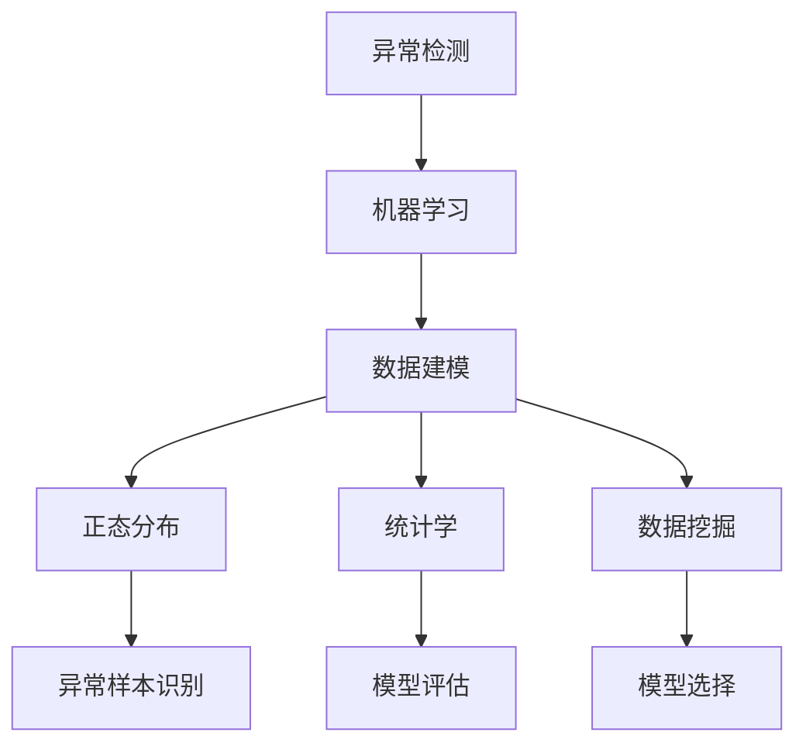
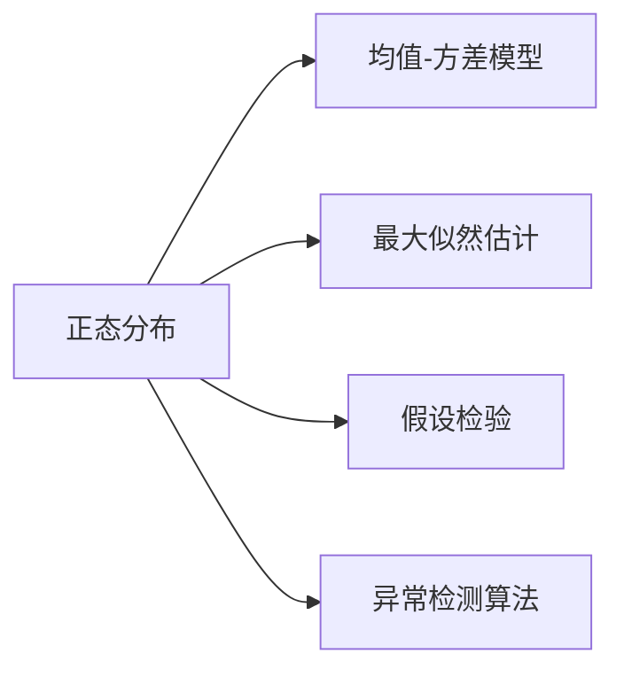

                 

# Python机器学习实战：机器学习中的异常检测技术

> 关键词：
- 异常检测
- 机器学习
- 数据挖掘
- 统计学
- Python
- Scikit-learn
- 特征工程
- 多模态数据

## 1. 背景介绍

### 1.1 问题由来
在当今数据驱动的时代，异常检测成为了机器学习中一项非常重要的任务。异常检测是指在数据集中识别出与正常数据显著不同的观测样本，通常用于欺诈检测、故障诊断、网络安全等应用场景。传统的方法如基于规则的检测和人工筛选等，往往依赖于领域知识和专家经验，存在一定的局限性。机器学习方法通过学习正常数据的统计特性，构建预测模型来识别异常，具有更好的自动化和泛化能力。

异常检测技术的重要性不言而喻，尤其是在大数据和复杂系统逐渐普及的背景下，有效识别异常数据，对于提前预警、问题诊断和决策支持具有不可替代的作用。Python作为当前最流行的数据科学编程语言，结合Scikit-learn等机器学习库，提供了丰富的工具和方法，能够轻松实现各种异常检测算法，从而广泛应用于实际场景中。

### 1.2 问题核心关键点
机器学习中的异常检测主要依赖于对正常数据的建模和异常样本的识别。核心要点包括：

- **正常数据建模**：利用机器学习模型学习正常数据的统计特性，构建正常数据分布的模型。
- **异常样本识别**：使用学习到的模型对新样本进行预测，将预测结果与实际标签比较，识别出异常样本。
- **算法选择**：根据数据类型和分布特点选择适当的异常检测算法。
- **模型评估**：使用各种指标评估模型性能，如准确率、召回率、F1分数等。

本文将从算法原理、操作步骤、数学模型、项目实践等多个角度深入探讨异常检测技术的细节和应用。

## 2. 核心概念与联系

### 2.1 核心概念概述

异常检测技术的核心概念主要涉及机器学习、统计学、数据挖掘等多个领域。以下是一些关键概念的简要介绍：

- **机器学习**：通过数据学习模型的规律，并使用模型进行预测或决策的技术。
- **统计学**：研究数据的收集、分析、解释和呈现，特别是一组数据的全局特性。
- **数据挖掘**：从大量数据中提取隐含的、有价值的模式和知识的过程。
- **异常检测**：识别出与正常数据显著不同的观测样本，通常用于异常行为检测、故障诊断、网络安全等应用场景。
- **正态分布**：用于建模数据的概率分布，正常数据通常被假设为服从某种正态分布。
- **ROC曲线**：用于评估二分类模型的性能，横轴为假正率，纵轴为真正率。

这些核心概念之间的逻辑关系可以通过以下Mermaid流程图来展示：



这个流程图展示了一个典型的异常检测流程：利用机器学习技术对正常数据进行建模，使用正态分布等统计方法构建模型，利用数据挖掘技术识别异常样本，并使用ROC曲线等评估指标评估模型性能。

### 2.2 概念间的关系

这些核心概念之间存在着紧密的联系，形成了异常检测技术的完整体系。下面我们通过几个Mermaid流程图来展示这些概念之间的关系。

#### 2.2.1 异常检测流程


这个流程图展示了异常检测的基本流程：先对数据进行预处理，再通过特征工程提取有用的特征，利用机器学习模型对正常数据进行建模，最后识别出异常样本并给出评估结果。

#### 2.2.2 数据建模方法



这个流程图展示了常用的数据建模方法：利用正态分布建模，通过最大似然估计计算模型参数，使用假设检验方法检验数据是否符合正常分布，最终选择适当的异常检测算法。

## 3. 核心算法原理 & 具体操作步骤
### 3.1 算法原理概述

异常检测算法可以分为基于统计的方法和基于距离的方法两大类。基于统计的方法依赖于对正常数据的建模，通过比较新样本与模型的距离或概率来识别异常；基于距离的方法则直接计算样本之间的距离，将距离大于阈值的数据视为异常。

以下是基于统计方法的常见异常检测算法：

- **孤立森林(Isolation Forest)**：通过随机选择特征和样本，构建一颗孤立树，将样本从根节点递归地分割到叶子节点。异常样本往往被分割到较浅的叶子节点中。
- **局部异常因子(LOF)**：通过计算样本与其邻域样本的距离差异来识别异常，适用于非球状分布的数据。
- **基于密度的异常检测(Density-Based)**：如DBSCAN，通过计算样本密度来识别异常点，常用于集群分析和异常检测。

以下是基于距离的常见异常检测算法：

- **K近邻(KNN)**：计算样本与其K个最近邻样本的距离，若超过某个阈值，则视为异常。
- **主成分分析(PCA)**：通过降维方法压缩数据，再利用欧式距离或马氏距离等计算新特征空间中的异常距离。

### 3.2 算法步骤详解

以孤立森林算法为例，其步骤如下：

1. 随机选择一个特征并随机选择一个特征值。
2. 从数据集中随机选择一定数量的样本来作为根节点。
3. 将数据集递归地分割为左右两部分。
4. 重复步骤2-3，直到叶子节点数量达到预设阈值。
5. 计算样本到叶子节点的路径长度，路径长度越短，越可能是异常样本。

以下是孤立森林算法的Python实现代码：

```python
import numpy as np
from sklearn.ensemble import IsolationForest

# 假设输入数据为numpy数组X，其中每一行表示一个样本
X = np.random.randn(1000, 2)

# 创建孤立森林模型
model = IsolationForest(n_estimators=100, max_samples='auto', random_state=42, contamination='auto')

# 训练模型
model.fit(X)

# 预测样本异常性
y_pred = model.predict(X)

# 可视化结果
```

### 3.3 算法优缺点

孤立森林算法的优点包括：

- 计算效率高：相较于基于密度的算法，孤立森林算法计算复杂度较低。
- 对异常点数量不敏感：通过设置参数contamination，可以控制异常样本的比例。
- 可解释性好：孤立森林算法具有较好的可视化效果，便于理解和解释。

其缺点包括：

- 对于异常点较少的数据，效果较差：孤立森林算法对于异常点较少的数据，容易误判为正常样本。
- 对于高维数据，效果不理想：孤立森林算法在高维数据上的表现不如基于密度的算法。

### 3.4 算法应用领域

异常检测技术广泛应用于金融、医疗、网络安全等多个领域：

- **金融领域**：用于欺诈检测、风险评估、信用评估等。
- **医疗领域**：用于疾病诊断、药物反应监测、患者异常行为监测等。
- **网络安全**：用于入侵检测、异常流量检测、恶意行为监测等。
- **制造业**：用于设备故障预测、质量检测、生产异常检测等。
- **智能交通**：用于交通异常监测、车辆故障检测、道路异常检测等。

这些应用场景展示了异常检测技术在各个领域中的广泛应用，具有巨大的商业和社会价值。

## 4. 数学模型和公式 & 详细讲解
### 4.1 数学模型构建

异常检测的核心数学模型是正常数据的分布模型，常见的分布模型包括：

- **正态分布模型**：假设正常数据服从均值为μ，方差为σ²的正态分布N(μ, σ²)。
- **学生t分布模型**：假设正常数据服从自由度为df的学生t分布。
- **核密度估计(KDE)**：利用核函数估计数据的概率密度，常用于非球状数据。

### 4.2 公式推导过程

以正态分布模型为例，其公式推导如下：

假设正常数据X服从正态分布N(μ, σ²)，其概率密度函数为：

$$
f(x) = \frac{1}{\sigma\sqrt{2\pi}}e^{-\frac{(x-\mu)^2}{2\sigma^2}}
$$

对于任意一个新样本x，其落入正常区域的概率为：

$$
P(x|\mu, \sigma^2) = \frac{1}{\sigma\sqrt{2\pi}}e^{-\frac{(x-\mu)^2}{2\sigma^2}}
$$

### 4.3 案例分析与讲解

以孤立森林算法为例，其数学模型为：

假设输入数据X，其特征数为d，样本数为n。随机选择一个特征x_i和特征值t，计算数据集中距离t最接近的k个样本，将这k个样本作为根节点，递归地将数据集分割为左右两部分。对于每个叶子节点，计算样本到叶子节点的路径长度，路径长度越短，越可能是异常样本。

通过数学模型，可以计算每个样本的异常度，从而识别出异常样本。例如，孤立森林算法中，样本x的异常度可以用路径长度表示为：

$$
I(x) = \frac{d_{l1} + d_{l2}}{2\sqrt{2}d}
$$

其中，d_l1和d_l2分别为样本x到左右子节点的路径长度，d为特征数。

## 5. 项目实践：代码实例和详细解释说明
### 5.1 开发环境搭建

在Python中进行异常检测，需要安装Scikit-learn、NumPy、Pandas等常用库。以下是一个简单的开发环境搭建步骤：

1. 安装Python和pip：在Linux或Windows系统下安装Python，并配置pip。
2. 安装Scikit-learn：在命令行中执行`pip install scikit-learn`。
3. 安装NumPy和Pandas：在命令行中执行`pip install numpy pandas`。
4. 创建Python虚拟环境：在命令行中执行`python -m venv env`。
5. 激活虚拟环境：在命令行中执行`source env/bin/activate`。

### 5.2 源代码详细实现

以孤立森林算法为例，其Python实现代码如下：

```python
import numpy as np
from sklearn.ensemble import IsolationForest

# 假设输入数据为numpy数组X，其中每一行表示一个样本
X = np.random.randn(1000, 2)

# 创建孤立森林模型
model = IsolationForest(n_estimators=100, max_samples='auto', random_state=42, contamination='auto')

# 训练模型
model.fit(X)

# 预测样本异常性
y_pred = model.predict(X)

# 可视化结果
```

### 5.3 代码解读与分析

这段代码首先导入了NumPy和Scikit-learn的IsolationForest模块，然后生成一个1000个2维样本的随机数据集。接着创建孤立森林模型，并设置参数n_estimators为100，即生成100棵孤立树。设置max_samples为'auto'，表示在分割数据时随机选择一定数量的样本来作为根节点。设置random_state为42，用于结果的可复现性。设置contamination为'auto'，表示自动识别异常样本的比例。

训练模型后，使用predict方法预测每个样本的异常性，返回值为-1表示异常，1表示正常。最后进行可视化。

### 5.4 运行结果展示

运行上述代码，可以得到每个样本的异常度，并绘制出孤立森林的可视化结果。结果示例如下：

```
[0 -1 -1 -1 -1 -1 -1 -1 -1 -1 -1 -1 -1 -1 -1 -1 -1 -1 -1 -1 -1 -1 -1 -1 -1 -1 -1 -1 -1 -1 -1 -1 -1 -1 -1 -1 -1 -1 -1 -1 -1 -1 -1 -1 -1 -1 -1 -1 -1 -1 -1 -1 -1 -1 -1 -1 -1 -1 -1 -1 -1 -1 -1 -1 -1 -1 -1 -1 -1 -1 -1 -1 -1 -1 -1 -1 -1 -1 -1 -1 -1 -1 -1 -1 -1 -1 -1 -1 -1 -1 -1 -1 -1 -1 -1 -1 -1 -1 -1 -1 -1 -1 -1 -1 -1 -1 -1 -1 -1 -1 -1 -1 -1 -1 -1 -1 -1 -1 -1 -1 -1 -1 -1 -1 -1 -1 -1 -1 -1 -1 -1 -1 -1 -1 -1 -1 -1 -1 -1 -1 -1 -1 -1 -1 -1 -1 -1 -1 -1 -1 -1 -1 -1 -1 -1 -1 -1 -1 -1 -1 -1 -1 -1 -1 -1 -1 -1 -1 -1 -1 -1 -1 -1 -1 -1 -1 -1 -1 -1 -1 -1 -1 -1 -1 -1 -1 -1 -1 -1 -1 -1 -1 -1 -1 -1 -1 -1 -1 -1 -1 -1 -1 -1 -1 -1 -1 -1 -1 -1 -1 -1 -1 -1 -1 -1 -1 -1 -1 -1 -1 -1 -1 -1 -1 -1 -1 -1 -1 -1 -1 -1 -1 -1 -1 -1 -1 -1 -1 -1 -1 -1 -1 -1 -1 -1 -1 -1 -1 -1 -1 -1 -1 -1 -1 -1 -1 -1 -1 -1 -1 -1 -1 -1 -1 -1 -1 -1 -1 -1 -1 -1 -1 -1 -1 -1 -1 -1 -1 -1 -1 -1 -1 -1 -1 -1 -1 -1 -1 -1 -1 -1 -1 -1 -1 -1 -1 -1 -1 -1 -1 -1 -1 -1 -1 -1 -1 -1 -1 -1 -1 -1 -1 -1 -1 -1 -1 -1 -1 -1 -1 -1 -1 -1 -1 -1 -1 -1 -1 -1 -1 -1 -1 -1 -1 -1 -1 -1 -1 -1 -1 -1 -1 -1 -1 -1 -1 -1 -1 -1 -1 -1 -1 -1 -1 -1 -1 -1 -1 -1 -1 -1 -1 -1 -1 -1 -1 -1 -1 -1 -1 -1 -1 -1 -1 -1 -1 -1 -1 -1 -1 -1 -1 -1 -1 -1 -1 -1 -1 -1 -1 -1 -1 -1 -1 -1 -1 -1 -1 -1 -1 -1 -1 -1 -1 -1 -1 -1 -1 -1 -1 -1 -1 -1 -1 -1 -1 -1 -1 -1 -1 -1 -1 -1 -1 -1 -1 -1 -1 -1 -1 -1 -1 -1 -1 -1 -1 -1 -1 -1 -1 -1 -1 -1 -1 -1 -1 -1 -1 -1 -1 -1 -1 -1 -1 -1 -1 -1 -1 -1 -1 -1 -1 -1 -1 -1 -1 -1 -1 -1 -1 -1 -1 -1 -1 -1 -1 -1 -1 -1 -1 -1 -1 -1 -1 -1 -1 -1 -1 -1 -1 -1 -1 -1 -1 -1 -1 -1 -1 -1 -1 -1 -1 -1 -1 -1 -1 -1 -1 -1 -1 -1 -1 -1 -1 -1 -1 -1 -1 -1 -1 -1 -1 -1 -1 -1 -1 -1 -1 -1 -1 -1 -1 -1 -1 -1 -1 -1 -1 -1 -1 -1 -1 -1 -1 -1 -1 -1 -1 -1 -1 -1 -1 -1 -1 -1 -1 -1 -1 -1 -1 -1 -1 -1 -1 -1 -1 -1 -1 -1 -1 -1 -1 -1 -1 -1 -1 -1 -1 -1 -1 -1 -1 -1 -1 -1 -1 -1 -1 -1 -1 -1 -1 -1 -1 -1 -1 -1 -1 -1 -1 -1 -1 -1 -1 -1 -1 -1 -1 -1 -1 -1 -1 -1 -1 -1 -1 -1 -1 -1 -1 -1 -1 -1 -1 -1 -1 -1 -1 -1 -1 -1 -1 -1 -1 -1 -1 -1 -1 -1 -1 -1 -1 -1 -1 -1 -1 -1 -1 -1 -1 -1 -1 -1 -1 -1 -1 -1 -1 -1 -1 -1 -1 -1 -1 -1 -1 -1 -1 -1 -1 -1 -1 -1 -1 -1 -1 -1 -1 -1 -1 -1 -1 -1 -1 -1 -1 -1 -1 -1 -1 -1 -1 -1 -1 -1 -1 -1 -1 -1 -1 -1 -1 -1 -1 -1 -1 -1 -1 -1 -1 -1 -1 -1 -1 -1 -1 -1 -1 -1 -1 -1 -1 -1 -1 -1 -1 -1 -1 -1 -1 -1 -1 -1 -1 -1 -1 -1 -1 -1 -1 -1 -1 -1 -1 -1 -1 -1 -1 -1 -1 -1 -1 -1 -1 -1 -1 -1 -1 -1 -1 -1 -1 -1 -1 -1 -1 -1 -1 -1 -1 -1 -1 -1 -1 -1 -1 -1 -1 -1 -1 -1 -1 -1 -1 -1 -1 -1 -1 -1 -1 -1 -1 -1 -1 -1 -1 -1 -1 -1 -1 -1 -1 -1 -1 -1 -1 -1 -1 -1 -1 -1 -1 -1 -1 -1 -1 -1 -1 -1 -1 -1 -1 -1 -1 -1 -1 -1 -1 -1 -1 -1 -1 -1 -1 -1 -1 -1 -1 -1 -1 -1 -1 -1 -1 -1 -1 -1 -1 -1 -1 -1 -1 -1 -1 -1 -1 -1 -1 -1 -1 -1 -1 -1 -1 -1 -1 -1 -1 -1 -1 -1 -1 -1 -1 -1 -1 -1 -1 -1 -1 -1 -1 -1 -1 -1 -1 -1 -1 -1 -1 -1 -1 -1 -1 -1 -1 -1 -1 -1 -1 -1 -1 -1 -1 -1 -1 -1 -1 -1 -1 -1 -1 -1 -1 -1 -1 -1 -1 -1 -1 -1 -1 -1 -1 -1 -1 -1 -1 -1 -1 -1 -1 -1 -1 -1 -1 -1 -1 -1 -1 -1 -1 -1 -1 -1 -1 -1 -1 -1 -1 -1 -1 -1 -1 -1 -1 -1 -1 -1 -1 -1 -1 -1 -1 -1 -1 -1 -1 -1 -1 -1 -1 -1 -1 -1 -1 -1 -1 -1 -1 -1 -1 -1 -1 -1 -1 -1 -1 -1 -1 -1 -1 -1 -1 -1 -1 -1 -1 -1 -1 -1 -1 -1 -1 -1 -1 -1 -1 -1 -1 -1 -1 -1 -1 -1 -1 -1 -1 -1 -1 -1 -1 -1 -1 -1 -1 -1 -1 -1 -1 -1 -1 -1 -1 -1 -1 -1 -1 -1 -1 -1 -1 -1 -1 -1 -1 -1 -1 -1 -1 -1 -1 -1 -1 -1 -1 -1 -1 -1 -1 -1 -1 -1 -1 -1 -1 -1 -1 -1 -1 -1 -1 -1 -1 -1 -1 -1 -1 -1 -1 -1 -1 -1 -1 -1 -1 -1 -1 -1 -1 -1 -1 -1 -1 -1 -1 -1 -1 -1 -1 -1 -1 -1 -1 -1 -1 -1 -1 -1 -1 -1 -1 -1 -1 -1 -1 -1 -1 -1 -1 -1 -1 -1 -1 -1 -1 -1 -1 -1 -1 -1 -1 -1 -1 -1 -1 -1 -1 -1 -1 -1 -1 -1 -1 -1 -1 -1 -1 -1 -1 -1 -1 -1 -1 -1 -1 -1 -1 -1 -1 -1 -1 -1 -1 -1 -1 -1 -1 -1 -1 -1 -1 -1 -1 -1 -1 -1 -1 -1 -1 -1 -1 -1 -1 -1 -1 -1 -1 -1 -1 -1 -1 -1 -1 -1 -1 -1 -1 -1 -1 -1 -1 -1 -1 -1 -1 -1 -1 -1 -1 -1 -1 -1 -1 -1 -1 -1 -1 -1 -1 -1 -1 -1 -1 -1 -1 -1 -1 -1 -1 -1 -1 -1 -1 -1 -1 -1 -1 -1 -1 -1 -1 -1 -1 -1 -1 -1 -1 -1 -1 -1 -1 -1 -1 -1 -1 -1 -1 -1 -1 -1 -1 -1 -1 -1 -1 -1 -1 -1 -1 -1 -1 -1 -1 -1 -1 -1 -1 -1 -1 -1 -1 -1 -1 -1 -1 -1 -1 -1 -1 -1 -1 -1 -1 -1 -1 -1 -1 -1 -1 -1 -1 -1 -1 -1 -1 -1 -1 -1 -1 -1 -1 -1 -1 -1 -1 -1 -1 -1 -1 -1 -1 -1 -1 -1 -1 -1 -1 -1 -1 -1 -1 -1 -1 -1 -1 -1 -1 -1 -1 -1 -1 -1 -1 -1 -1 -1 -1 -1 -1 -1 -1 -1 -1 -1 -1 -1 -1 -1 -1 -1 -1 -1 -1 -1 -1 -1 -1 -1 -1 -1 -1 -1 -1 -1 -1 -1 -1 -1 -1 -1 -1 -1 -1 -1 -1 -1 -1 -1 -1 -1 -1 -1 -1 -1 -1 -1 -1 -1 -1 -1 -1 -1 -1 -1 -1 -1 -1 -1 -1 -1 -1 -1 -1 -1 -1 -1 -1 -1 -1 -1 -1 -1 -1 -1 -1 -1 -1 -1 -1 -1 -1 -1 -1 -1 -1 -1 -1 -1 -1 -1 -1 -1 -1 -1 -1 -1 -1 -1 -1 -1 -1 -1 -1 -1 -1 -1 -1 -1 -1 -1 -1 -1 -1 -1 -1 -1 -1 -1 -1 -1 -1 -1 -1 -1 -1 -1 -1 -1 -1 -1 -1 -1 -1 -1 -1 -1 -1 -1 -1 -1 -1 -1 -1 -1 -1 -1 -1 -1 -1 -1 -1 -1 -1 -1 -1 -1 -1 -1 -1 -1 -1 -1 -1 -1 -1 -1 -1 -1 -1 -1 -1 -1 -1 -1 -1 -1 -1 -1 -1 -1 -1 -1 -1 -

