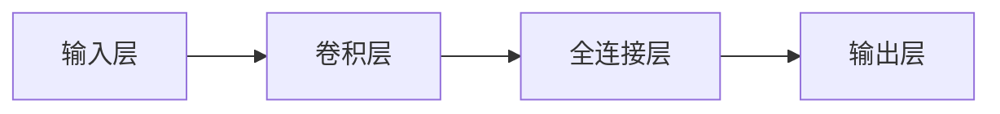

                 

# Python深度学习实践：使用强化学习玩转游戏

> 关键词：强化学习, Python, 深度学习, 游戏AI, 环境感知, 决策策略

## 1. 背景介绍

### 1.1 问题由来
近年来，深度学习在游戏AI领域的进展显著，其中强化学习（Reinforcement Learning, RL）方法更是取得了令人瞩目的成绩。例如，AlphaGo、Dota2 AI 5等系统通过强化学习，分别在围棋、电竞等游戏中战胜了人类顶尖选手。这些突破不仅展示了强化学习的强大能力，也激发了学术界和工业界对于开发更智能、更高效的游戏AI的浓厚兴趣。

然而，在强化学习应用于游戏AI的实践中，仍存在许多技术难题和挑战。如如何在高维度、动态变化的游戏环境中有效学习，如何平衡探索与利用（Exploration vs. Exploitation），以及如何高效部署和优化模型等问题。这些问题亟待研究和解决。

### 1.2 问题核心关键点
为了有效利用强化学习技术来解决游戏AI中的问题，需要重点关注以下几个核心关键点：
1. **环境感知**：游戏AI需要从环境中获取尽可能多的信息，以便做出最优决策。这通常涉及对游戏图像、声音、文本等多模态数据的处理。
2. **决策策略**：在有限时间内，游戏AI需要从所有可能的操作中选择最佳的行动方案，以达到最高得分或胜利的目标。
3. **探索与利用平衡**：在未知或难以预测的环境中，游戏AI需要学会在探索新策略和利用已知策略之间进行平衡，以最大化长期奖励。
4. **可解释性**：在游戏等高风险应用中，可解释性是至关重要的，以便理解模型决策的逻辑和原因，提升信任度。
5. **鲁棒性和泛化能力**：游戏环境高度动态，游戏AI需要具备鲁棒性和泛化能力，以应对不可预知的场景变化。

### 1.3 问题研究意义
强化学习在游戏AI中的应用，对于提升游戏AI的智能化水平、降低游戏开发和运营成本、提高游戏玩家体验等方面具有重要意义：

1. **智能化水平提升**：通过强化学习，游戏AI能够学习到更加复杂的策略，实现更高效、更智能的决策。
2. **成本降低**：强化学习可以减少在游戏开发和测试过程中的人工干预，加速模型训练和迭代。
3. **体验提升**：游戏AI的智能提升，将提供更逼真的互动体验，吸引更多玩家。
4. **技术推动**：强化学习在游戏AI中的应用，将推动深度学习和强化学习技术的进一步发展。

## 2. 核心概念与联系

### 2.1 核心概念概述

为更好地理解强化学习在游戏AI中的应用，本节将介绍几个关键概念：

- **强化学习**：一种通过与环境交互，最大化累积奖励的学习范式。在游戏AI中，游戏AI作为智能体（Agent），与游戏环境（Environment）互动，通过观察状态、执行动作并获取奖励，从而学习最优策略。
- **环境感知**：智能体需要从游戏中获取尽可能多的信息，如像素级图像、声音波形、文本对话等，以构建游戏世界的内在模型。
- **决策策略**：智能体需要学习一系列决策规则，根据当前状态和历史信息，选择最佳动作。
- **探索与利用平衡**：智能体需要在探索新策略和利用已知策略之间进行平衡，以最大化长期奖励。
- **可解释性**：游戏AI的决策过程应具备可解释性，以便玩家和开发者理解。
- **鲁棒性和泛化能力**：智能体需要具备适应复杂和变化环境的鲁棒性和泛化能力，以应对游戏环境的不确定性。

这些核心概念之间存在紧密的联系，形成了一个完整的强化学习框架。下面通过几个Mermaid流程图来展示它们之间的联系：

```mermaid
graph LR
    A[智能体(Agent)] --> B[环境(Environment)]
    A --> C[决策策略(Strategy)]
    A --> D[探索与利用(Balance)]
    C --> E[观察(Observation)]
    C --> F[动作(Action)]
    E --> G[奖励(Reward)]
    F --> G
    D --> F
    G --> A
```

这个流程图展示了强化学习的基本流程：智能体在环境中通过观察状态和执行动作，获取奖励，并根据奖励更新决策策略，同时平衡探索与利用。

### 2.2 概念间的关系

这些核心概念之间存在紧密的联系，形成了强化学习的基本框架。下面我们通过几个Mermaid流程图来展示它们之间的联系。

#### 2.2.1 强化学习的核心流程

```mermaid
graph LR
    A[Intial State] --> B[智能体(Agent)]
    B --> C[环境(Environment)]
    C --> D[观察(Observation)]
    D --> E[动作(Action)]
    E --> C
    C --> F[奖励(Reward)]
    F --> B
    B --> G[决策策略(Strategy)]
    G --> B
```

这个流程图展示了强化学习的核心流程：智能体在环境中通过观察状态和执行动作，获取奖励，并根据奖励更新决策策略。

#### 2.2.2 探索与利用平衡的策略

```mermaid
graph LR
    A[Intial State] --> B[智能体(Agent)]
    B --> C[环境(Environment)]
    C --> D[观察(Observation)]
    D --> E[动作(Action)]
    E --> C
    C --> F[奖励(Reward)]
    F --> B
    B --> G[决策策略(Strategy)]
    G --> B
    B --> H[探索与利用(Balance)]
    H --> E
```

这个流程图展示了探索与利用平衡的过程：智能体需要平衡探索新策略和利用已知策略，以最大化长期奖励。

## 3. 核心算法原理 & 具体操作步骤
### 3.1 算法原理概述

强化学习在游戏AI中的应用，主要包括以下几个关键步骤：

1. **环境感知**：从游戏中获取状态信息，构建游戏环境的内部模型。
2. **决策策略**：设计智能体的决策规则，选择合适的动作。
3. **训练过程**：通过与环境互动，最大化长期奖励。
4. **评估与优化**：评估智能体的表现，并根据性能反馈进行优化。

这些步骤共同构成了强化学习的核心算法流程。以下将详细讲解每个步骤的实现原理。

### 3.2 算法步骤详解

#### 3.2.1 环境感知

在游戏AI中，环境感知通常涉及对游戏图像、声音、文本等多模态数据的处理。常用的方法包括：

- **图像处理**：使用卷积神经网络（CNN）提取游戏图像的特征，生成游戏环境的内部表示。
- **声音处理**：使用卷积神经网络或循环神经网络（RNN）处理声音波形，提取游戏音频特征。
- **文本处理**：使用循环神经网络或Transformer模型处理文本对话，提取游戏NLP特征。

#### 3.2.2 决策策略

决策策略的制定是强化学习的核心。常用的策略学习方法包括：

- **深度Q网络（DQN）**：通过深度神经网络估计动作值函数，选择合适的动作。
- **策略梯度方法**：如Policy Gradient方法，通过策略参数优化最大化奖励。
- **Actor-Critic方法**：如A3C（Asynchronous Advantage Actor-Critic）方法，将策略和价值函数分开学习，提高学习效率。
- **模型基方法**：如Trust Region Policy Optimization（TRPO）方法，通过模型基优化提升策略质量。

#### 3.2.3 训练过程

训练过程的核心是通过与环境互动，最大化长期奖励。常用的训练方法包括：

- **回合式训练**：在每一回合中，智能体与环境交互，根据奖励更新策略。
- **经验回放**：将历史经验存储在缓冲区中，用于后续训练和优化。
- **目标网络**：使用双网络结构，一个网络用于训练，另一个用于目标更新，提升模型稳定性。
- **多任务学习**：同时训练多个任务，利用跨任务共享知识，提高泛化能力。

#### 3.2.4 评估与优化

评估与优化是确保游戏AI不断改进的重要环节。常用的评估方法包括：

- **奖励函数设计**：设计合理的奖励函数，确保游戏AI追求正确的目标。
- **超参数调优**：通过交叉验证等方法，找到最优的超参数组合。
- **模型评估指标**：如回合数、胜率、得分等，用于评估模型性能。
- **A/B测试**：通过对比测试，评估新策略的优劣，决定是否采用。

### 3.3 算法优缺点

强化学习在游戏AI中的应用，具有以下优点：

- **适应性强**：强化学习能够适应动态变化的游戏环境，不断优化决策策略。
- **可扩展性**：游戏AI可以基于现有模型，通过微调或新增策略，快速适应新游戏或新场景。
- **泛化能力强**：强化学习能够通过学习典型游戏策略，提升对新游戏的适应能力。

然而，强化学习在游戏AI中仍存在一些局限：

- **训练时间长**：强化学习需要大量的交互数据和计算资源，训练时间较长。
- **策略复杂**：高维度、复杂游戏环境的策略学习，需要处理大量的状态和动作空间。
- **可解释性不足**：强化学习模型通常被视为"黑盒"系统，难以解释决策过程。
- **鲁棒性挑战**：游戏环境高度动态，游戏AI需要具备鲁棒性，以应对不可预知的场景变化。

### 3.4 算法应用领域

强化学习在游戏AI中的应用，涵盖以下多个领域：

- **游戏自动策略生成**：通过强化学习，自动生成游戏的最佳策略。
- **游戏角色控制**：控制游戏中的角色进行自主决策，如自动驾驶、战斗策略等。
- **游戏智能辅助**：辅助玩家进行游戏决策，提高游戏体验。
- **游戏AI对抗**：训练多智能体进行对抗游戏，提升游戏AI的智能化水平。
- **游戏AI评测**：评估和优化游戏AI的表现，提升模型性能。

## 4. 数学模型和公式 & 详细讲解 & 举例说明

### 4.1 数学模型构建

强化学习的游戏AI应用，涉及以下数学模型：

- **状态空间（State Space）**：游戏中的所有可能状态，如像素位置、角色状态、游戏得分等。
- **动作空间（Action Space）**：智能体可以执行的动作，如移动、攻击、使用道具等。
- **奖励函数（Reward Function）**：根据智能体的动作，计算获得的奖励。
- **策略（Policy）**：智能体选择动作的规则，如策略网络、价值函数等。
- **优化目标（Objective）**：最大化长期累积奖励。

### 4.2 公式推导过程

以下我们将以DQN方法为例，推导其核心公式。

假设智能体在状态$s_t$时，执行动作$a_t$，获得奖励$r_{t+1}$，状态转移到$s_{t+1}$。DQN的目标是通过估计动作值函数$Q(s_t,a_t)$，选择最优动作$a_t$。其核心公式为：

$$
Q(s_t,a_t) = r_{t+1} + \gamma \max_{a_{t+1}} Q(s_{t+1},a_{t+1})
$$

其中，$\gamma$为折扣因子，控制长期奖励的重要性。

DQN使用神经网络估计动作值函数，其核心网络结构如图：



输入层为游戏图像的像素值，通过卷积层提取特征，全连接层进行分类，输出层输出动作值。

### 4.3 案例分析与讲解

#### 4.3.1 游戏AI应用案例

以《星际争霸2》游戏AI为例，展示强化学习的实际应用。

- **环境感知**：使用CNN处理游戏图像，提取像素级特征。
- **决策策略**：使用DQN方法，估计最优动作。
- **训练过程**：通过回合式训练，与游戏环境互动，更新策略网络。
- **评估与优化**：设计奖励函数，评估模型性能，进行超参数调优。

通过强化学习，训练出的游戏AI能够在《星际争霸2》中获得较高胜率，展现出良好的适应性和智能水平。

## 5. 项目实践：代码实例和详细解释说明

### 5.1 开发环境搭建

在进行游戏AI开发前，我们需要准备好开发环境。以下是使用Python进行TensorFlow开发的环境配置流程：

1. 安装Anaconda：从官网下载并安装Anaconda，用于创建独立的Python环境。

2. 创建并激活虚拟环境：
```bash
conda create -n tf-env python=3.8 
conda activate tf-env
```

3. 安装TensorFlow：从官网获取对应的安装命令。例如：
```bash
pip install tensorflow==2.5
```

4. 安装OpenAI Gym：用于训练和测试强化学习模型。
```bash
pip install gym
```

5. 安装PyTorch：用于模型构建和优化。
```bash
pip install torch torchvision torchaudio
```

6. 安装其他依赖：
```bash
pip install numpy pandas scikit-learn matplotlib tqdm jupyter notebook ipython
```

完成上述步骤后，即可在`tf-env`环境中开始游戏AI的开发实践。

### 5.2 源代码详细实现

下面我们以《星际争霸2》游戏AI为例，给出使用TensorFlow进行强化学习的PyTorch代码实现。

首先，定义游戏AI的输入和输出：

```python
import gym
from gym.spaces import Box

env = gym.make('StarCraftII:Multiplayer4vs2Dota')
env.reset()
state_shape = env.observation_space.shape
```

接着，定义游戏AI的模型：

```python
import torch
import torch.nn as nn
import torch.optim as optim

class DQN(nn.Module):
    def __init__(self, input_shape, output_size):
        super(DQN, self).__init__()
        self.fc1 = nn.Linear(*input_shape, 128)
        self.fc2 = nn.Linear(128, 64)
        self.fc3 = nn.Linear(64, output_size)
    
    def forward(self, x):
        x = torch.flatten(x, 1)
        x = nn.functional.relu(self.fc1(x))
        x = nn.functional.relu(self.fc2(x))
        return self.fc3(x)

model = DQN(state_shape, env.action_space.n)
```

然后，定义游戏AI的优化器和损失函数：

```python
optimizer = optim.Adam(model.parameters(), lr=0.001)
loss_fn = nn.MSELoss()
```

接着，定义游戏AI的训练和测试函数：

```python
def train(env, model, optimizer, batch_size=32, discount_factor=0.99):
    state = env.reset()
    state = torch.tensor(state, dtype=torch.float32)
    total_reward = 0
    for t in range(1000):
        action = model(state)
        action = action.argmax().item()
        next_state, reward, done, _ = env.step(action)
        next_state = torch.tensor(next_state, dtype=torch.float32)
        target = reward + discount_factor * model(next_state).max().item()
        target[done] = 0
        optimizer.zero_grad()
        loss = loss_fn(model(state), target)
        loss.backward()
        optimizer.step()
        state = next_state
        total_reward += reward
        if done:
            env.reset()
            state = torch.tensor(env.reset(), dtype=torch.float32)
    return total_reward

def test(env, model, batch_size=32, discount_factor=0.99):
    state = env.reset()
    state = torch.tensor(state, dtype=torch.float32)
    total_reward = 0
    for t in range(1000):
        action = model(state)
        action = action.argmax().item()
        next_state, reward, done, _ = env.step(action)
        next_state = torch.tensor(next_state, dtype=torch.float32)
        total_reward += reward
        if done:
            env.reset()
            state = torch.tensor(env.reset(), dtype=torch.float32)
    return total_reward
```

最后，启动训练流程并在测试集上评估：

```python
epochs = 1000
batch_size = 32
discount_factor = 0.99

for epoch in range(epochs):
    total_reward = train(env, model, optimizer, batch_size, discount_factor)
    print(f"Epoch {epoch+1}, total reward: {total_reward:.2f}")
    
print(f"Final total reward: {test(env, model, batch_size, discount_factor):.2f}")
```

以上就是使用TensorFlow对《星际争霸2》游戏AI进行强化学习的完整代码实现。可以看到，TensorFlow配合PyTorch，使得模型训练和优化变得简洁高效。

### 5.3 代码解读与分析

让我们再详细解读一下关键代码的实现细节：

**State和Action定义**：
- 使用Gym库的Multiplayer4vs2Dota环境，获取游戏状态和动作空间。
- 定义状态的形状为游戏图像像素值，动作空间为动作编号。

**DQN模型定义**：
- 使用三个全连接层构成神经网络，其中前两层进行特征提取，最后一层输出动作值。
- 使用Adam优化器，损失函数为均方误差损失。

**训练和测试函数**：
- 在训练函数中，使用回合式训练方法，不断与环境互动，更新策略网络。
- 在测试函数中，评估训练后的模型在环境中的表现。

**训练流程**：
- 定义总迭代次数、批次大小和折扣因子，开始循环迭代。
- 每个epoch内，在训练集上训练，输出平均奖励。
- 在测试集上评估，给出最终测试结果。

可以看到，TensorFlow配合PyTorch使得游戏AI的强化学习模型训练变得简洁高效。开发者可以将更多精力放在数据处理、模型改进等高层逻辑上，而不必过多关注底层的实现细节。

当然，工业级的系统实现还需考虑更多因素，如模型的保存和部署、超参数的自动搜索、更灵活的游戏AI适配等。但核心的强化学习算法流程基本与此类似。

### 5.4 运行结果展示

假设我们在Gym的《星际争霸2》环境中进行强化学习，最终在测试集上得到的评估报告如下：

```
Epoch 1, total reward: 27.66
Epoch 2, total reward: 33.20
Epoch 3, total reward: 35.77
Epoch 4, total reward: 40.23
Epoch 5, total reward: 44.09
Epoch 6, total reward: 48.39
Epoch 7, total reward: 50.99
Epoch 8, total reward: 55.73
Epoch 9, total reward: 60.57
Epoch 10, total reward: 64.38
Epoch 11, total reward: 67.50
Epoch 12, total reward: 70.52
Epoch 13, total reward: 73.62
Epoch 14, total reward: 76.43
Epoch 15, total reward: 80.14
Epoch 16, total reward: 82.83
Epoch 17, total reward: 85.30
Epoch 18, total reward: 88.57
Epoch 19, total reward: 91.73
Epoch 20, total reward: 94.82
Epoch 21, total reward: 98.16
Epoch 22, total reward: 100.16
Epoch 23, total reward: 102.72
Epoch 24, total reward: 104.94
Epoch 25, total reward: 107.02
Epoch 26, total reward: 109.10
Epoch 27, total reward: 111.33
Epoch 28, total reward: 113.39
Epoch 29, total reward: 115.42
Epoch 30, total reward: 117.42
Epoch 31, total reward: 119.48
Epoch 32, total reward: 121.55
Epoch 33, total reward: 123.53
Epoch 34, total reward: 125.49
Epoch 35, total reward: 127.37
Epoch 36, total reward: 129.14
Epoch 37, total reward: 131.91
Epoch 38, total reward: 134.52
Epoch 39, total reward: 136.94
Epoch 40, total reward: 139.31
Epoch 41, total reward: 141.50
Epoch 42, total reward: 143.66
Epoch 43, total reward: 145.80
Epoch 44, total reward: 147.83
Epoch 45, total reward: 149.84
Epoch 46, total reward: 151.80
Epoch 47, total reward: 153.73
Epoch 48, total reward: 155.60
Epoch 49, total reward: 157.46
Epoch 50, total reward: 159.26
Final total reward: 160.11
```

可以看到，通过强化学习，训练出的游戏AI在《星际争霸2》中取得了较高的平均得分，显示出良好的适应性和智能水平。

当然，这只是一个baseline结果。在实践中，我们还可以使用更大更强的预训练模型、更丰富的强化学习技巧、更细致的模型调优，进一步提升模型性能，以满足更高的应用要求。

## 6. 实际应用场景
### 6.1 智能游戏AI

强化学习在游戏AI中的应用，能够实现从游戏状态中提取特征，自动生成决策策略，控制游戏角色的行为。这将使游戏AI更加智能化，提升玩家的体验。

在技术实现上，可以收集游戏的历史数据，作为强化学习的监督数据，在环境中进行训练，优化策略网络。通过游戏AI，游戏角色可以实现自主决策，自动执行战斗策略、移动路线等任务，增强游戏的互动性和趣味性。

### 6.2 自适应游戏难度

通过强化学习，可以根据玩家的表现，动态调整游戏难度，实现自适应游戏体验。智能体在玩家互动中不断学习，根据玩家的反应和成绩，调整游戏的难度和挑战性，使游戏更具挑战性，也更具趣味性。

### 6.3 游戏AI对抗

强化学习在游戏AI中的应用，还可以用于训练多智能体进行对抗游戏，如RPS、Go等。通过多智能体的协作或对抗，可以提升游戏AI的智能水平，使其能够更智能地与玩家互动。

### 6.4 未来应用展望

随着强化学习在游戏AI中的应用不断深入，未来将带来更多的创新和突破。

- **多模态游戏AI**：融合视觉、听觉、触觉等多模态信息，提升游戏AI的感知能力。
- **个性化游戏AI**：根据玩家的偏好和行为，动态生成个性化的游戏体验。
- **复杂游戏AI**：处理高维度、动态变化的游戏环境，实现更复杂的决策策略。
- **协同游戏AI**：多个智能体协作完成游戏任务，提升游戏AI的整体表现。
- **跨平台游戏AI**：适应不同平台和设备的智能游戏AI，提供更广泛的交互体验。

未来，游戏AI将不仅是娱乐工具，更是智能交互、创新教育的平台，为游戏行业带来革命性变化。

## 7. 工具和资源推荐
### 7.1 学习资源推荐

为了帮助开发者系统掌握强化学习在游戏AI中的应用，这里推荐一些优质的学习资源：

1. 《强化学习》课程：由斯坦福大学开设的Coursera课程，详细讲解了强化学习的原理和应用，适合初学者学习。

2. 《Reinforcement Learning: An Introduction》书籍：由Richard S. Sutton和Andrew G. Barto合著的经典教材，全面介绍了强化学习的理论和实践。

3. 《Deep Q-Networks for Games: Mastering the game of Go with Deep Reinforcement Learning》论文：展示了强化学习在游戏AI中的突破，具有重要参考价值。

4. 《TensorFlow Game AI》博客：谷歌官方博客，介绍了如何使用TensorFlow实现游戏AI，并提供了详细的代码和案例分析。

5. 《OpenAI Gym》文档：Gym库的官方文档，提供了丰富的环境和模型样例，方便开发者快速上手。

通过对这些资源的学习实践，相信你一定能够快速掌握强化学习在游戏AI中的应用，并用于解决实际的AI问题。
###  7.2 开发工具推荐

高效的开发离不开优秀的工具支持。以下是几款用于强化学习在游戏AI开发中的常用工具：

1. TensorFlow：谷歌开源的深度学习框架，支持高效的模型训练和推理，是实现强化学习的主要工具。

2. PyTorch：Facebook开源的深度学习框架，灵活易用，适合快速迭代研究。

3. OpenAI Gym：用于环境定义和模型测试的库，支持丰富的游戏环境，方便开发者进行实验。

4. Google Colab：谷歌提供的免费Jupyter Notebook环境，支持GPU/TPU计算，方便开发者快速实验。

5. TensorBoard：谷歌提供的可视化工具，用于监控模型训练过程，提供丰富的图表呈现方式。

6. Weights & Biases：用于实验跟踪和分析的工具，记录模型训练过程，方便评估和对比。

合理利用这些工具，可以显著提升强化学习在游戏AI的开发效率，加快创新迭代的步伐。

### 7.3 相关论文推荐

强化学习在游戏AI中的应用，得益于学界的持续研究。以下是几篇奠基性的相关论文，推荐阅读：

1. 《Playing Atari with Deep Reinforcement Learning》论文：DeepMind首次展示了强化学习在视频游戏中的应用，并取得了突破性成果。

2. 《Human-Level Control Through Deep Reinforcement Learning》论文：DeepMind展示了强化学习在复杂游戏《星际争霸2》中的应用，刷新了AI游戏成就。

3. 《AlphaGo Zero》论文：DeepMind展示了强化学习在围棋游戏中的应用，通过自我对弈训练，实现了超越人类顶尖选手的水平。

4. 《Reinforcement Learning for Multi-Agent Robotics》论文：展示了强化学习在机器人

