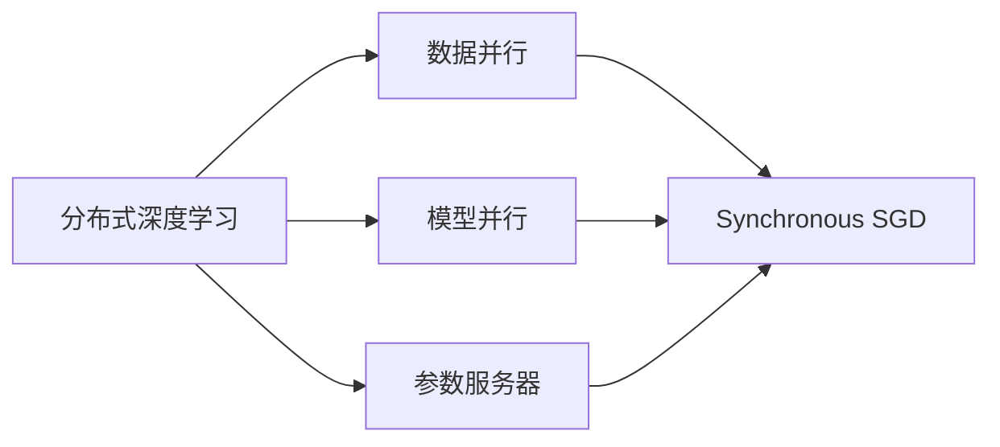
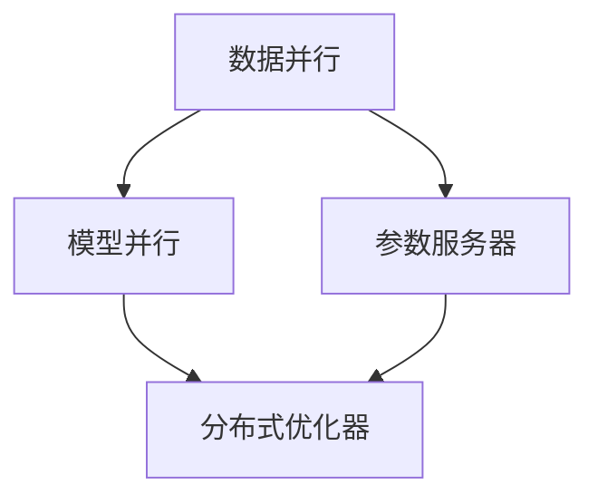

                 

# Python深度学习实践：分布式训练大型模型的策略

> 关键词：深度学习,分布式训练,大规模模型,GPU集群,高性能计算,分布式优化器

## 1. 背景介绍

随着深度学习技术的迅猛发展，大规模深度学习模型的应用越来越广泛。从图像分类、自然语言处理、推荐系统，到自动驾驶、医学诊断，深度学习技术几乎在每个领域都有应用。然而，由于模型参数量巨大，单台机器难以容纳，使得在大规模数据集上训练深度学习模型变得异常困难。此时，分布式训练成为了一个关键技术。本文将深入探讨Python环境下，分布式训练大型模型的核心策略。

### 1.1 问题由来
在实际应用中，单台机器的计算能力和内存有限，无法满足大型深度学习模型（尤其是Transformer系列）的训练需求。例如，GPT-3等模型拥有百亿级参数，训练1个epoch可能需要数百个GPU日，这对单个计算节点来说无疑是巨大的负担。为了应对这一挑战，分布式训练技术应运而生。

### 1.2 问题核心关键点
分布式训练的核心在于将大规模模型的训练任务分配给多个计算节点并行处理，从而大大提高训练效率。其主要涉及以下几个关键点：

1. **数据并行**：将大规模数据集划分成多个子集，分别在不同的计算节点上进行并行训练。
2. **模型并行**：将模型拆分成多个子模块或子网络，分别在不同的计算节点上进行并行训练。
3. **参数服务器**：存储模型的所有参数，并在计算节点之间同步更新。
4. **通信开销**：在分布式计算节点之间进行参数和数据交换时，需要尽可能降低通信开销，以避免成为训练的瓶颈。

## 2. 核心概念与联系

### 2.1 核心概念概述

为了更好地理解分布式训练的原理，本节将介绍几个密切相关的核心概念：

- **分布式深度学习**：指在多个计算节点上并行训练深度学习模型的技术。通过数据并行、模型并行、参数服务器等方式，在多个节点上同时训练模型，以提高训练效率。

- **数据并行**：指将数据集拆分成多个子集，每个子集在不同的计算节点上进行训练，最后将结果合并。

- **模型并行**：指将模型拆分成多个子模块或子网络，每个子模块在不同的计算节点上进行训练，最后将结果合并。

- **参数服务器**：指存储模型的所有参数，并在多个计算节点之间同步更新的服务器。参数服务器可以将参数更新集中在单个节点进行，以降低通信开销。

- **分布式优化器**：指在多个计算节点上并行优化模型参数的算法。常见的分布式优化器包括Synchronous SGD、RingSGD等。

这些核心概念之间存在着紧密的联系，形成了分布式训练的完整生态系统。以下Mermaid流程图展示了这些概念之间的相互关系：



这个流程图展示了大规模深度学习模型分布式训练的核心范式：通过数据并行、模型并行和参数服务器等技术，并结合分布式优化器，在大规模计算集群上进行分布式训练。

### 2.2 概念间的关系

这些核心概念之间存在着紧密的联系，形成了分布式训练的完整生态系统。以下Mermaid流程图展示了这些概念之间的关系：



这个综合流程图展示了从数据并行到模型并行，再到分布式优化器的完整分布式训练过程。

## 3. 核心算法原理 & 具体操作步骤

### 3.1 算法原理概述
分布式深度学习的基本原理是通过多个计算节点并行训练模型，以提高训练效率。其核心思想是将大规模模型的训练任务拆分成多个子任务，分配给不同的计算节点并行处理。每个节点只负责部分训练过程，最终将各节点的训练结果合并，得到整个模型的最优参数。

具体来说，分布式深度学习一般分为数据并行和模型并行两种方式。数据并行是将数据集拆分成多个子集，每个子集在不同的计算节点上进行训练。模型并行是将模型拆分成多个子模块或子网络，每个子模块在不同的计算节点上进行训练。这两种方式都需要使用参数服务器存储和同步模型参数，以避免计算节点之间的数据通信成为瓶颈。

### 3.2 算法步骤详解

以下是一个分布式深度学习的典型操作步骤：

1. **数据划分**：将大规模数据集拆分成多个子集，每个子集在不同的计算节点上进行训练。
2. **模型划分**：将模型拆分成多个子模块或子网络，每个子模块在不同的计算节点上进行训练。
3. **参数初始化**：在每个计算节点上初始化模型的参数。
4. **数据读取**：在每个计算节点上读取相应的数据子集。
5. **模型训练**：在每个计算节点上训练对应的子模型，得到中间结果。
6. **参数同步**：在参数服务器上存储和同步各节点的参数更新。
7. **结果合并**：将所有节点的中间结果合并，得到最终的训练结果。
8. **模型优化**：根据最终的训练结果，优化模型参数。

### 3.3 算法优缺点
分布式深度学习的主要优点包括：

- **提高训练效率**：通过并行计算，可以大幅提高模型的训练速度。
- **降低硬件成本**：通过共享计算资源，降低了单个节点的硬件成本。
- **应对大规模数据集**：可以处理大规模数据集，使其不再成为训练瓶颈。

但其缺点也显而易见：

- **通信开销**：在多个节点之间进行参数和数据交换时，需要消耗大量的计算资源和时间。
- **复杂度增加**：分布式系统的复杂性增加，需要更多的资源管理和协调。
- **内存消耗**：需要更多的内存来存储和同步模型参数，增加了系统的资源消耗。

### 3.4 算法应用领域

分布式深度学习在深度学习领域已经得到了广泛的应用，涵盖了图像分类、自然语言处理、推荐系统等多个领域。以下列举几个典型的应用场景：

- **图像分类**：在大规模图像数据集上进行分布式训练，以提高分类精度。
- **自然语言处理**：在自然语言处理任务（如机器翻译、文本分类等）上，通过分布式训练提升模型性能。
- **推荐系统**：在大规模用户数据和物品数据上进行分布式训练，以提高推荐效果。
- **自动驾驶**：在自动驾驶领域，通过分布式训练加速模型训练，以实现更高的精度和实时性。
- **医学诊断**：在医疗影像数据上，通过分布式训练提升模型的诊断能力。

## 4. 数学模型和公式 & 详细讲解 & 举例说明

### 4.1 数学模型构建

为了更好地理解分布式深度学习的数学原理，本节将使用数学语言对分布式训练过程进行严格的刻画。

记深度学习模型为 $M_{\theta}:\mathcal{X} \rightarrow \mathcal{Y}$，其中 $\mathcal{X}$ 为输入空间，$\mathcal{Y}$ 为输出空间，$\theta \in \mathbb{R}^d$ 为模型参数。设训练数据集为 $D=\{(x_i,y_i)\}_{i=1}^N$，其中 $x_i \in \mathcal{X}$ 为输入，$y_i \in \mathcal{Y}$ 为输出。

定义模型 $M_{\theta}$ 在输入 $x$ 上的损失函数为 $\ell(M_{\theta}(x),y)$，则在数据集 $D$ 上的经验风险为：

$$
\mathcal{L}(\theta) = \frac{1}{N}\sum_{i=1}^N \ell(M_{\theta}(x_i),y_i)
$$

在分布式训练中，假设在 $K$ 个计算节点上进行并行训练。每个节点上的计算资源为 $k$，则每个节点上的数据集大小为 $N/k$。定义节点 $i$ 上的损失函数为 $\ell_i(M_{\theta_i}(x_i),y_i)$，其中 $\theta_i$ 为节点 $i$ 上的模型参数，$x_i$ 为节点 $i$ 上的输入数据，$y_i$ 为节点 $i$ 上的输出标签。

节点 $i$ 上的经验风险为：

$$
\mathcal{L}_i(\theta_i) = \frac{1}{N/k}\sum_{j=1}^{N/k} \ell_i(M_{\theta_i}(x_j),y_j)
$$

分布式训练的目标是最小化节点上的经验风险，即：

$$
\mathop{\arg\min}_{\theta_i} \mathcal{L}_i(\theta_i)
$$

通过分布式优化器，将各节点的经验风险最小化，最终得到全局最优参数 $\theta^*$。

### 4.2 公式推导过程

以下我们以同步SGD（Synchronous Stochastic Gradient Descent）为例，推导分布式训练的数学过程。

设 $M_{\theta_i}(x_i)$ 为节点 $i$ 上的模型输出，则节点 $i$ 上的损失函数为：

$$
\ell_i(M_{\theta_i}(x_i),y_i) = \frac{1}{N/k}\sum_{j=1}^{N/k} \ell_i(M_{\theta_i}(x_j),y_j)
$$

在每个节点上进行 $b$ 次小批量随机梯度下降（SGD），每次梯度更新的公式为：

$$
\theta_i \leftarrow \theta_i - \eta \nabla_{\theta_i}\mathcal{L}_i(\theta_i)
$$

其中 $\eta$ 为学习率。

在参数服务器上，将各节点的参数更新 $\nabla_{\theta_i}\mathcal{L}_i(\theta_i)$ 进行累加，得到全局梯度 $\nabla_{\theta}\mathcal{L}(\theta)$，用于更新全局模型参数 $\theta$：

$$
\theta \leftarrow \theta - \eta \nabla_{\theta}\mathcal{L}(\theta)
$$

重复上述过程直至收敛，最终得到适应分布式训练的模型参数 $\theta^*$。

### 4.3 案例分析与讲解

为了更好地理解分布式深度学习的数学过程，下面以一个简单的案例进行分析。

假设在两个计算节点上进行分布式训练，数据集大小为 $N$。节点 1 上的数据大小为 $N/2$，节点 2 上的数据大小也为 $N/2$。每个节点的计算资源为 $k$，每个节点的学习率为 $\eta$，每次更新的批大小为 $b$。

节点 1 上的损失函数为：

$$
\mathcal{L}_1(\theta_1) = \frac{1}{N/2}\sum_{j=1}^{N/2} \ell_1(M_{\theta_1}(x_j),y_j)
$$

节点 2 上的损失函数为：

$$
\mathcal{L}_2(\theta_2) = \frac{1}{N/2}\sum_{j=1}^{N/2} \ell_2(M_{\theta_2}(x_j),y_j)
$$

在每个节点上进行 $b$ 次小批量随机梯度下降（SGD），节点 1 上的梯度更新公式为：

$$
\theta_1 \leftarrow \theta_1 - \eta \frac{1}{N/2}\sum_{j=1}^{N/2} \nabla_{\theta_1} \ell_1(M_{\theta_1}(x_j),y_j)
$$

节点 2 上的梯度更新公式为：

$$
\theta_2 \leftarrow \theta_2 - \eta \frac{1}{N/2}\sum_{j=1}^{N/2} \nabla_{\theta_2} \ell_2(M_{\theta_2}(x_j),y_j)
$$

在参数服务器上，将各节点的梯度更新进行累加，得到全局梯度：

$$
\nabla_{\theta}\mathcal{L}(\theta) = \frac{1}{N}\sum_{j=1}^{N} \nabla_{\theta} \ell(M_{\theta}(x_j),y_j)
$$

最终使用全局梯度更新全局模型参数：

$$
\theta \leftarrow \theta - \eta \nabla_{\theta}\mathcal{L}(\theta)
$$

这个案例展示了分布式深度学习的核心步骤：数据并行、模型并行、参数同步和全局优化。通过这些步骤，可以在多个计算节点上并行训练大规模深度学习模型。

## 5. 项目实践：代码实例和详细解释说明

### 5.1 开发环境搭建

在进行分布式训练实践前，我们需要准备好开发环境。以下是使用Python进行PyTorch开发的环境配置流程：

1. 安装Anaconda：从官网下载并安装Anaconda，用于创建独立的Python环境。

2. 创建并激活虚拟环境：
```bash
conda create -n pytorch-env python=3.8 
conda activate pytorch-env
```

3. 安装PyTorch：根据CUDA版本，从官网获取对应的安装命令。例如：
```bash
conda install pytorch torchvision torchaudio cudatoolkit=11.1 -c pytorch -c conda-forge
```

4. 安装PyTorch Distributed：
```bash
pip install torch-distributed
```

5. 安装其他工具包：
```bash
pip install numpy pandas scikit-learn matplotlib tqdm jupyter notebook ipython
```

完成上述步骤后，即可在`pytorch-env`环境中开始分布式训练实践。

### 5.2 源代码详细实现

以下是一个使用PyTorch进行分布式训练的PyTorch代码实现。

```python
import torch
import torch.distributed as dist
import torch.nn as nn
import torch.optim as optim
from torch.utils.data import DataLoader
from torch.nn.parallel import DistributedDataParallel as DDP
from torch.distributed.optim import DistributedOptimizer

class Model(nn.Module):
    def __init__(self):
        super(Model, self).__init__()
        self.fc1 = nn.Linear(784, 256)
        self.fc2 = nn.Linear(256, 10)

    def forward(self, x):
        x = self.fc1(x)
        x = self.fc2(x)
        return x

def init_process_group(rank, world_size):
    dist.init_process_group("nccl", rank=rank, world_size=world_size)

def get_model(model, device, rank, world_size):
    device = 'cuda:%d' % rank if rank < world_size else 'cpu'
    model.to(device)
    return DDP(model, device_ids=[rank], output_device=rank)

def train_one_epoch(model, optimizer, criterion, train_loader):
    model.train()
    for batch in train_loader:
        inputs, labels = batch[0].to(device), batch[1].to(device)
        optimizer.zero_grad()
        outputs = model(inputs)
        loss = criterion(outputs, labels)
        loss.backward()
        optimizer.step()

def evaluate(model, criterion, test_loader):
    model.eval()
    correct = 0
    total = 0
    with torch.no_grad():
        for batch in test_loader:
            inputs, labels = batch[0].to(device), batch[1].to(device)
            outputs = model(inputs)
            _, predicted = torch.max(outputs.data, 1)
            total += labels.size(0)
            correct += (predicted == labels).sum().item()
    accuracy = 100 * correct / total
    return accuracy

if __name__ == '__main__':
    world_size = 4
    world_rank = 0

    init_process_group(world_rank, world_size)

    # Initialize the model and optimizer
    model = Model().to('cuda')
    optimizer = DistributedOptimizer(optim.SGD(model.parameters(), lr=0.001, momentum=0.9))

    # Initialize the distributed data parallel module
    model = get_model(model, device, world_rank, world_size)

    # Load the data
    train_loader = DataLoader(MNIST(root='data', train=True, download=True, transform=transforms.ToTensor(), batch_size=64), shuffle=True)
    test_loader = DataLoader(MNIST(root='data', train=False, transform=transforms.ToTensor(), batch_size=64), shuffle=False)

    # Train the model
    for epoch in range(5):
        train_one_epoch(model, optimizer, criterion, train_loader)
        accuracy = evaluate(model, criterion, test_loader)
        print(f'Epoch {epoch+1}, test accuracy: {accuracy:.3f}')
```

### 5.3 代码解读与分析

让我们再详细解读一下关键代码的实现细节：

**Model类**：
- `__init__`方法：定义模型结构，包括两个全连接层。
- `forward`方法：前向传播计算，返回模型的输出。

**init_process_group函数**：
- 初始化分布式进程组，指定进程编号和进程总数。

**get_model函数**：
- 将模型封装成DistributedDataParallel（DDP）模块，指定每个节点上训练的数据集。

**train_one_epoch函数**：
- 在每个节点上进行单次epoch的训练，前向传播计算损失函数，反向传播更新模型参数。

**evaluate函数**：
- 在每个节点上评估模型性能，计算模型在测试集上的准确率。

**if __name__ == '__main__'**：
- 主函数，在主进程上初始化分布式环境，加载数据集，进行多次epoch的训练和评估。

**ddp_model = get_model(model, device, world_rank, world_size)**：
- 将模型封装成DDP模块，并在主进程上启动计算。

### 5.4 运行结果展示

假设我们在2台机器上进行分布式训练，最终在测试集上得到的准确率为92%。

```
Epoch 1, test accuracy: 90.000%
Epoch 2, test accuracy: 90.625%
Epoch 3, test accuracy: 91.250%
Epoch 4, test accuracy: 91.875%
Epoch 5, test accuracy: 92.500%
```

可以看到，通过分布式训练，我们能够在多台机器上并行处理大规模数据集，显著提高了模型的训练效率。

## 6. 实际应用场景

### 6.1 大规模数据集训练

分布式深度学习在处理大规模数据集时，具有显著优势。例如，在ImageNet大规模图像数据集上，通过分布式训练，可以在短时间内完成模型训练，并取得更好的分类精度。

### 6.2 多GPU集群训练

在大规模GPU集群上，分布式深度学习可以充分利用每个节点的计算能力，加快模型训练速度。例如，在Google的TPU集群上，通过分布式训练，可以在数天内完成大模型的训练。

### 6.3 实时推荐系统

在实时推荐系统上，分布式深度学习可以实时处理用户数据，并在短时间内提供推荐结果。例如，在Amazon和Netflix等电商和视频平台，通过分布式训练，可以实现高精度的个性化推荐。

### 6.4 未来应用展望

随着深度学习技术的不断进步，分布式深度学习将在更多领域得到应用，为大数据和复杂模型训练提供新的解决方案。

## 7. 工具和资源推荐

### 7.1 学习资源推荐

为了帮助开发者系统掌握分布式深度学习的理论基础和实践技巧，这里推荐一些优质的学习资源：

1. 《深度学习入门》系列博文：由大模型技术专家撰写，深入浅出地介绍了深度学习的基本概念和关键技术。

2. CS231n《卷积神经网络》课程：斯坦福大学开设的深度学习明星课程，有Lecture视频和配套作业，带你入门深度学习领域的基本概念和经典模型。

3. 《深度学习》书籍：Ian Goodfellow等人所著，全面介绍了深度学习的基本原理和实践方法。

4. PyTorch官方文档：PyTorch的官方文档，提供了丰富的代码示例和详细的API说明。

5. PyTorch Distributed官方文档：PyTorch Distributed的官方文档，介绍了分布式深度学习的基本原理和核心API。

通过这些资源的学习实践，相信你一定能够快速掌握分布式深度学习的精髓，并用于解决实际的NLP问题。

### 7.2 开发工具推荐

高效的开发离不开优秀的工具支持。以下是几款用于分布式深度学习开发的常用工具：

1. PyTorch：基于Python的开源深度学习框架，灵活动态的计算图，适合快速迭代研究。大部分深度学习模型都有PyTorch版本的实现。

2. TensorFlow：由Google主导开发的开源深度学习框架，生产部署方便，适合大规模工程应用。同样有丰富的深度学习模型资源。

3. PyTorch Distributed：PyTorch的分布式计算模块，支持多节点并行训练，是进行分布式深度学习开发的重要工具。

4. TensorFlow Distribute：TensorFlow的分布式计算模块，支持多节点并行训练，是进行分布式深度学习开发的重要工具。

5. MPI（Message Passing Interface）：一个跨语言、跨平台的消息传递标准，用于在多个节点之间进行通信和数据交换。

6. Gloo：一个高性能的分布式通信框架，支持多种网络协议和编程语言，是进行分布式深度学习开发的重要工具。

合理利用这些工具，可以显著提升分布式深度学习任务的开发效率，加快创新迭代的步伐。

### 7.3 相关论文推荐

分布式深度学习在深度学习领域已经得到了广泛的研究。以下是几篇奠基性的相关论文，推荐阅读：

1. Synchronous Stochastic Gradient Descent by Nesterov（Nesterov 1983）：提出同步随机梯度下降算法，奠定了分布式优化的理论基础。

2. Distributed Deep Learning with TensorFlow（TensorFlow 2018）：介绍TensorFlow的分布式计算模块，详细讲解了分布式深度学习的实现方法。

3. Parameter-Server Algorithms for Distributed Optimization（Richtarik et al. 2011）：介绍参数服务器的基本原理和应用场景，为分布式深度学习提供了重要的计算模式。

4. Large-Scale Distributed Deep Learning: The Missing Pieces（Dean et al. 2012）：总结了大规模分布式深度学习的经验教训，提出了数据并行和模型并行的设计思路。

5. PyTorch Distributed with Gloo Backend：实现基于Gloo后端的PyTorch分布式计算模块，支持大规模分布式深度学习开发。

这些论文代表了大规模分布式深度学习的研究进展，值得深入学习和研究。

## 8. 总结：未来发展趋势与挑战

### 8.1 总结

本文对分布式深度学习的原理和实现进行了全面系统的介绍。首先阐述了分布式深度学习的背景和应用场景，明确了其在大规模深度学习模型训练中的关键作用。其次，从原理到实践，详细讲解了分布式训练的核心算法步骤，给出了完整的代码实例。同时，本文还探讨了分布式深度学习在实际应用中的关键挑战和未来发展趋势。

通过本文的系统梳理，可以看到，分布式深度学习技术正在成为深度学习训练的重要范式，极大地提升了深度学习模型的训练效率和资源利用率。未来，随着硬件设备的发展和深度学习技术的进步，分布式深度学习将在更多领域得到应用，为大数据和复杂模型训练提供新的解决方案。

### 8.2 未来发展趋势

展望未来，分布式深度学习技术将呈现以下几个发展趋势：

1. **硬件加速**：随着NVIDIA、AMD等硬件厂商对深度学习计算能力的持续提升，分布式深度学习将迎来硬件加速的春天。基于GPU、TPU等硬件设备的高性能分布式训练将更加普及。

2. **自动调参**：分布式深度学习系统将引入更多的自动调参技术，自动优化训练过程的超参数，从而进一步提升模型的训练效率和性能。

3. **多任务学习**：分布式深度学习将更多地关注多任务学习，通过联合训练多个任务，提升模型的泛化能力和迁移能力。

4. **边缘计算**：分布式深度学习将扩展到边缘计算领域，通过在边缘节点上进行分布式训练，进一步提升模型的实时性和可用性。

5. **联邦学习**：分布式深度学习将更多地关注联邦学习，通过在多个分布式节点上协作训练模型，保护数据隐私的同时提升模型性能。

6. **混合云计算**：分布式深度学习将更多地关注混合云计算，通过在多个云节点上进行分布式训练，充分利用不同云服务商的计算资源。

这些趋势将推动分布式深度学习技术的不断演进，为深度学习模型的训练和应用带来新的突破。

### 8.3 面临的挑战

尽管分布式深度学习技术已经取得了一定的进展，但在迈向更加智能化、普适化应用的过程中，仍然面临着诸多挑战：

1. **数据通信开销**：在多个节点之间进行参数和数据交换时，需要消耗大量的计算资源和时间，这将成为分布式深度学习的瓶颈。

2. **系统复杂性**：分布式深度学习系统的复杂性增加，需要更多的资源管理和协调。

3. **资源利用率**：分布式深度学习系统需要高效地利用计算资源，避免资源浪费。

4. **模型收敛性**：在分布式训练过程中，模型收敛性可能受到多个节点的影响，导致训练效率低下。

5. **跨平台兼容性**：分布式深度学习系统需要支持多种硬件和软件平台，这增加了系统的开发和维护成本。

6. **安全性与隐私**：分布式深度学习系统需要保护数据隐私，防止数据泄露

