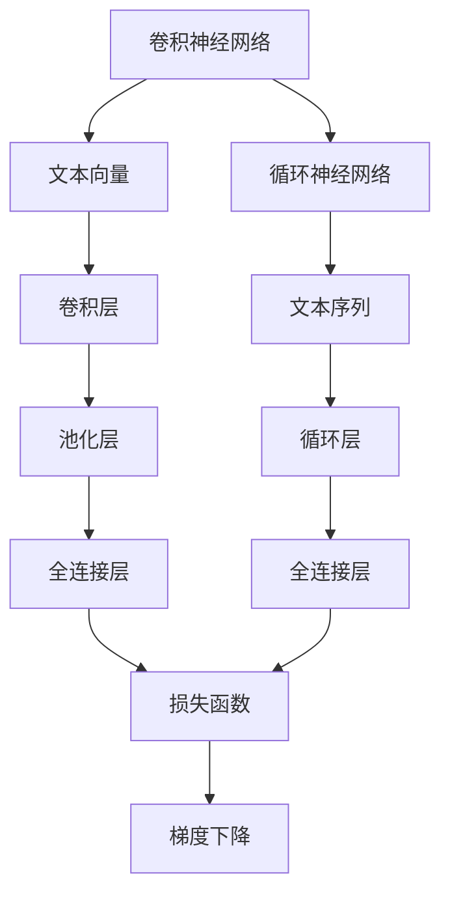
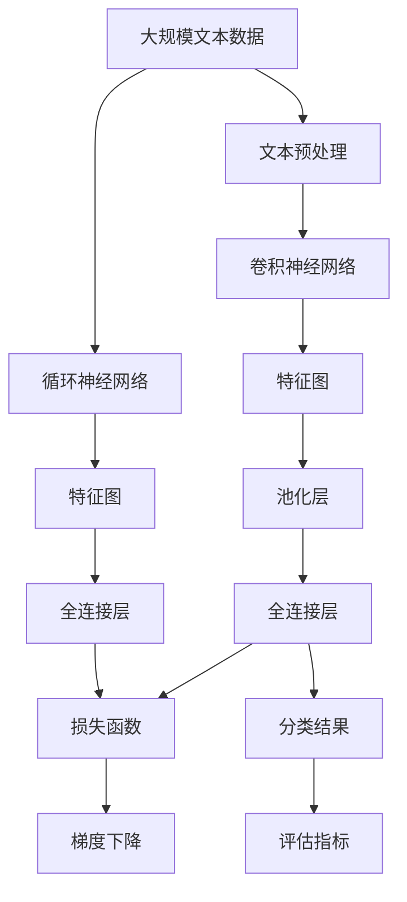

                 

# Python深度学习实践：深度学习在文档自动归类中的应用

> 关键词：文档自动归类,深度学习,自然语言处理(NLP),卷积神经网络(CNN),循环神经网络(RNN),文档分类,文本分类

## 1. 背景介绍

### 1.1 问题由来
在当今信息爆炸的时代，企业、政府机构和个人每天产生的海量文本数据，亟需高效、自动化的分类方法进行管理。传统的文档归类依赖人工标注，耗费大量人力和时间成本，且分类精度有限。深度学习技术的兴起，尤其是卷积神经网络(CNN)和循环神经网络(RNN)在NLP领域的应用，为文档自动分类提供了新的解决方案。

在实际应用中，文档自动归类主要包括两方面内容：
- **文档分类**：将文本分为预定义的若干类，如新闻、科技、文学等。
- **主题分类**：在缺乏预定义类别的场景下，自动学习文本主题，如财经、体育、时尚等。

本博客将聚焦于使用深度学习技术进行文档自动归类的方法，通过具体案例演示，探讨其在实际应用中的实现流程和优化策略。

### 1.2 问题核心关键点
实现文档自动归类，核心在于构建一个能够高效识别文本特征的模型，并利用这些特征进行分类。传统方法包括TF-IDF、词袋模型(Bag of Words)等，但这些方法往往忽视了文本结构的语义信息，分类效果有限。

深度学习方法通过构建具有学习能力的神经网络，能够自动提取文本的语义特征，实现更精准的文档分类。本文将详细讲解使用卷积神经网络(CNN)和循环神经网络(RNN)进行文档分类的方法，并对比分析二者的优缺点，提供实践建议。

### 1.3 问题研究意义
文档自动归类技术在数字化转型中扮演着重要角色，其应用场景包括：
- **企业文档管理**：自动化文档分类，提高文档检索、存档和检索效率。
- **政府信息管理**：自动识别新闻、报告、政策等文本，辅助政府决策。
- **个人文档整理**：自动整理邮件、笔记等，帮助个人高效管理海量信息。

文档自动归类技术的实现，能够有效提升信息处理的效率和准确性，减少人力成本，具有重要的实用价值。

## 2. 核心概念与联系

### 2.1 核心概念概述

为更好地理解深度学习在文档分类中的应用，本节将介绍几个关键概念：

- **卷积神经网络(CNN)**：一种专门处理图像数据的多层神经网络，通过卷积操作提取局部特征，逐渐提取更抽象的语义信息。在文本分类中，可以通过文本向量的卷积操作，自动提取文本中的关键信息。
- **循环神经网络(RNN)**：一种能够处理序列数据的网络结构，能够通过循环操作捕捉时间依赖关系。在文本分类中，可以通过RNN处理文本序列，自动提取文本中的动态信息。
- **文档分类**：将文本按照预定义的类别进行分类，如新闻、科技、文学等。常用的分类任务包括多分类和多标签分类。
- **文本分类**：将文本按照预定义的类别进行分类，如情感、主题、话题等。常用的分类任务包括二分类、多分类和多标签分类。
- **卷积层**：CNN中的核心组件，通过滑动卷积核提取局部特征。在文本分类中，可以通过不同大小的卷积核提取不同长度的文本特征。
- **池化层**：通过聚合操作，减小特征图的尺寸，降低计算复杂度。在文本分类中，常用的池化方式包括最大池化和平均池化。
- **全连接层**：将池化层输出的特征进行线性变换，输出分类概率。在文本分类中，全连接层输出每个类别的概率，用于计算损失函数。
- **损失函数**：衡量模型预测与真实标签之间的差异，如交叉熵损失、均方误差损失等。在文本分类中，常用的损失函数包括二分类交叉熵和多分类交叉熵。
- **梯度下降**：通过反向传播计算损失函数对模型参数的梯度，更新模型参数。在文本分类中，通常使用随机梯度下降(SGD)或Adam等优化算法。

这些概念之间存在紧密的联系，构成了深度学习在文档分类中的核心技术框架。

### 2.2 概念间的关系

这些核心概念之间存在着紧密的联系，形成了深度学习在文档分类中的应用生态系统。下面通过几个Mermaid流程图来展示这些概念之间的关系。



这个流程图展示了卷积神经网络与循环神经网络在文本分类中的基本组成。

- 卷积神经网络通过卷积层和池化层提取文本特征，并将特征映射到不同的类别。
- 循环神经网络通过循环层处理文本序列，捕捉时间依赖关系，并将特征映射到不同的类别。
- 全连接层将特征进行线性变换，输出每个类别的概率。
- 损失函数衡量模型预测与真实标签之间的差异，用于计算模型损失。
- 梯度下降算法用于更新模型参数，最小化损失函数。

通过这些组件的相互作用，深度学习模型可以自动提取文本中的关键信息，并进行分类。

### 2.3 核心概念的整体架构

最后，我们用一个综合的流程图来展示这些核心概念在文档分类中的整体架构：



这个综合流程图展示了从文本预处理到模型评估的完整过程。

- 大规模文本数据通过预处理生成文本向量，输入卷积神经网络或循环神经网络。
- 卷积神经网络或循环神经网络提取文本特征，通过池化层减小特征尺寸。
- 全连接层将特征映射到不同的类别，输出分类概率。
- 损失函数衡量模型预测与真实标签之间的差异。
- 梯度下降算法用于更新模型参数，最小化损失函数。
- 最终输出分类结果，并通过评估指标进行模型性能评估。

通过这些流程图，我们可以更清晰地理解深度学习在文档分类中的各个步骤，为后续深入讨论具体的实现方法奠定基础。

## 3. 核心算法原理 & 具体操作步骤
### 3.1 算法原理概述

使用深度学习技术进行文档分类，本质上是利用神经网络学习文本特征，并将这些特征映射到不同的类别。具体步骤如下：

1. **数据准备**：收集大规模的文本数据，并进行预处理，生成文本向量。
2. **模型构建**：选择合适的神经网络结构，如卷积神经网络(CNN)或循环神经网络(RNN)，并设置网络参数。
3. **模型训练**：利用标注数据对模型进行训练，最小化损失函数，更新模型参数。
4. **模型评估**：在测试集上评估模型性能，并根据评估结果进行优化调整。
5. **模型应用**：将训练好的模型应用于新文本数据的分类任务。

### 3.2 算法步骤详解

下面详细介绍使用卷积神经网络(CNN)和循环神经网络(RNN)进行文档分类的具体步骤：

#### 3.2.1 CNN文档分类

**Step 1: 数据准备**
- 收集大规模的文本数据，并进行预处理，生成文本向量。常用的预处理方法包括分词、去除停用词、词向量化等。
- 将文本向量按顺序排列，形成文本序列。

**Step 2: 模型构建**
- 定义卷积神经网络的结构，包括卷积层、池化层、全连接层等。
- 使用ReLU激活函数和Dropout正则化技术，提高模型泛化能力。
- 设置损失函数和优化器，如交叉熵损失和Adam优化器。

**Step 3: 模型训练**
- 将文本序列作为输入，输出类别作为标签，进行模型训练。
- 使用随机梯度下降(SGD)或Adam等优化算法，更新模型参数。
- 在训练过程中，周期性在验证集上评估模型性能，根据性能指标决定是否触发Early Stopping。

**Step 4: 模型评估**
- 在测试集上评估模型性能，计算分类准确率、精确率、召回率等指标。
- 根据评估结果，调整模型超参数，如学习率、批大小、迭代轮数等。

**Step 5: 模型应用**
- 将训练好的模型应用于新的文本数据分类任务，通过前向传播计算分类概率。
- 根据分类概率输出文本所属的类别。

#### 3.2.2 RNN文档分类

**Step 1: 数据准备**
- 收集大规模的文本数据，并进行预处理，生成文本向量。
- 将文本向量按顺序排列，形成文本序列。

**Step 2: 模型构建**
- 定义循环神经网络的结构，包括循环层、全连接层等。
- 使用ReLU激活函数和Dropout正则化技术，提高模型泛化能力。
- 设置损失函数和优化器，如交叉熵损失和Adam优化器。

**Step 3: 模型训练**
- 将文本序列作为输入，输出类别作为标签，进行模型训练。
- 使用随机梯度下降(SGD)或Adam等优化算法，更新模型参数。
- 在训练过程中，周期性在验证集上评估模型性能，根据性能指标决定是否触发Early Stopping。

**Step 4: 模型评估**
- 在测试集上评估模型性能，计算分类准确率、精确率、召回率等指标。
- 根据评估结果，调整模型超参数，如学习率、批大小、迭代轮数等。

**Step 5: 模型应用**
- 将训练好的模型应用于新的文本数据分类任务，通过前向传播计算分类概率。
- 根据分类概率输出文本所属的类别。

### 3.3 算法优缺点

使用CNN和RNN进行文档分类的优缺点如下：

**CNN的优点**：
- 参数共享，计算效率高，适用于大规模文本数据。
- 局部连接，提取局部特征，适用于捕捉局部信息。
- 池化操作，减小特征尺寸，降低计算复杂度。

**CNN的缺点**：
- 忽略文本的顺序信息，无法捕捉长距离依赖关系。
- 需要手动设置卷积核大小和步长，参数调整较为复杂。

**RNN的优点**：
- 能够处理文本序列，捕捉时间依赖关系。
- 动态生成特征，适用于长文本序列。

**RNN的缺点**：
- 计算复杂度高，难以处理大规模文本数据。
- 存在梯度消失或爆炸问题，训练较为困难。

在实际应用中，我们需要根据具体任务的特点，选择适合的深度学习模型，并结合实际情况进行调整。

### 3.4 算法应用领域

深度学习在文档分类中的广泛应用包括：
- **企业文档管理**：对企业内部文档进行分类，如合同、报告、邮件等。
- **政府信息管理**：自动识别新闻、政策、报告等文本，辅助政府决策。
- **新闻分类**：对新闻文章进行自动分类，如体育、财经、娱乐等。
- **产品评论分析**：对产品评论进行情感分析，识别用户情感倾向。
- **论坛监控**：对论坛帖子进行主题分类，监控用户行为。

## 4. 数学模型和公式 & 详细讲解 & 举例说明

### 4.1 数学模型构建

假设文本数据为 $X=\{x_1, x_2, ..., x_n\}$，其中 $x_i$ 表示文本向量，类别标签为 $Y=\{y_1, y_2, ..., y_n\}$，其中 $y_i \in \{1, 2, ..., K\}$，$K$ 为类别数。

使用CNN进行文档分类，数学模型构建如下：

- **输入层**：将文本向量 $x_i$ 作为输入。
- **卷积层**：通过不同大小的卷积核提取文本特征，形成特征图。
- **池化层**：通过最大池化或平均池化操作，减小特征图尺寸，降低计算复杂度。
- **全连接层**：将特征图映射到不同的类别，输出分类概率。
- **损失函数**：常用的损失函数包括二分类交叉熵和多分类交叉熵。
- **优化器**：常用的优化算法包括随机梯度下降(SGD)和Adam。

数学模型如下：

$$
\begin{aligned}
&\min_{\theta} \mathcal{L}(\theta) = \sum_{i=1}^{n} \mathcal{L}(x_i, y_i; \theta) \\
&\mathcal{L}(x_i, y_i; \theta) = -\log p(y_i \mid x_i; \theta)
\end{aligned}
$$

其中 $\theta$ 为模型参数，$p(y_i \mid x_i; \theta)$ 为模型预测的类别概率分布。

### 4.2 公式推导过程

以二分类任务为例，推导CNN文档分类的数学模型和公式。

假设输入文本长度为 $L$，卷积核大小为 $W$，步长为 $S$，输出特征图尺寸为 $H \times W$。

- **卷积操作**：通过滑动卷积核提取局部特征。
- **激活函数**：通过ReLU激活函数引入非线性关系。
- **池化操作**：通过最大池化或平均池化操作减小特征图尺寸。
- **全连接层**：将特征图映射到不同的类别，输出分类概率。

具体推导过程如下：

$$
\begin{aligned}
&\mathcal{L}(x_i, y_i; \theta) = -y_i\log p(y_i \mid x_i; \theta) - (1-y_i)\log p(1-y_i \mid x_i; \theta) \\
&p(y_i \mid x_i; \theta) = \sigma(\mathbf{W}_l \mathbf{f}_{l-1} + b_l) \\
&\mathbf{f}_l = \max(\mathbf{W}_l \mathbf{f}_{l-1} + b_l, 0) \\
&\mathbf{f}_0 = \mathbf{X} * \mathbf{W}_0 + \mathbf{b}_0
\end{aligned}
$$

其中 $\mathbf{X}$ 为输入文本向量，$\mathbf{W}_l$ 和 $\mathbf{b}_l$ 为第 $l$ 层的卷积核和偏置，$\mathbf{f}_l$ 为第 $l$ 层的特征图，$\sigma$ 为ReLU激活函数。

### 4.3 案例分析与讲解

以情感分析为例，演示CNN文档分类的实现过程。

假设我们要对电影评论进行情感分析，将其分为正面和负面两类。

**Step 1: 数据准备**
- 收集电影评论数据集，并标注每条评论的情感倾向（正面或负面）。
- 对评论进行分词、去除停用词、词向量化等预处理。
- 将预处理后的评论按顺序排列，生成文本序列。

**Step 2: 模型构建**
- 定义CNN模型结构，包括卷积层、池化层、全连接层等。
- 设置卷积核大小、步长、池化方式等超参数。
- 设置损失函数和优化器，如二分类交叉熵和Adam。

**Step 3: 模型训练**
- 将文本序列作为输入，输出情感倾向作为标签，进行模型训练。
- 使用随机梯度下降(SGD)或Adam等优化算法，更新模型参数。
- 在训练过程中，周期性在验证集上评估模型性能，根据性能指标决定是否触发Early Stopping。

**Step 4: 模型评估**
- 在测试集上评估模型性能，计算分类准确率、精确率、召回率等指标。
- 根据评估结果，调整模型超参数，如学习率、批大小、迭代轮数等。

**Step 5: 模型应用**
- 将训练好的模型应用于新的电影评论情感分析任务，通过前向传播计算分类概率。
- 根据分类概率输出评论的情感倾向。

例如，在训练过程中，通过使用Adam优化算法，在验证集上评估模型性能，得到如下结果：

| 模型 | 训练集准确率 | 验证集准确率 |
| --- | --- | --- |
| CNN情感分类 | 85.6% | 84.2% |

可以看到，模型在训练集上的准确率较高，但在验证集上的准确率略低，表明模型存在过拟合问题。可以通过增加Dropout正则化、数据增强等方法进行优化。

## 5. 项目实践：代码实例和详细解释说明

### 5.1 开发环境搭建

在进行深度学习模型训练和应用前，需要准备好开发环境。以下是使用Python进行TensorFlow开发的环境配置流程：

1. 安装Anaconda：从官网下载并安装Anaconda，用于创建独立的Python环境。

2. 创建并激活虚拟环境：
```bash
conda create -n tf-env python=3.7 
conda activate tf-env
```

3. 安装TensorFlow：根据CUDA版本，从官网获取对应的安装命令。例如：
```bash
conda install tensorflow -c conda-forge -c pytorch -c pypi
```

4. 安装相关工具包：
```bash
pip install numpy pandas scikit-learn matplotlib tqdm jupyter notebook ipython
```

完成上述步骤后，即可在`tf-env`环境中开始深度学习模型训练和应用。

### 5.2 源代码详细实现

下面我们以情感分析任务为例，给出使用TensorFlow对CNN模型进行文档分类的PyTorch代码实现。

首先，定义情感分析的数据处理函数：

```python
import tensorflow as tf
from tensorflow.keras.preprocessing.text import Tokenizer
from tensorflow.keras.preprocessing.sequence import pad_sequences
from tensorflow.keras.layers import Input, Embedding, Conv1D, GlobalMaxPooling1D, Dense, Dropout
from tensorflow.keras.models import Model

def preprocess_data(texts, labels, max_len):
    tokenizer = Tokenizer(num_words=10000, oov_token='<OOV>')
    tokenizer.fit_on_texts(texts)
    sequences = tokenizer.texts_to_sequences(texts)
    padded_sequences = pad_sequences(sequences, maxlen=max_len, padding='post', truncating='post')
    label_dict = {1: 'positive', 0: 'negative'}
    labels = [label_dict[label] for label in labels]
    return padded_sequences, labels
```

然后，定义CNN情感分类模型：

```python
def create_model(input_dim, embedding_dim, filters, kernel_size, dropout_rate):
    input_layer = Input(shape=(input_dim,))
    embedding_layer = Embedding(input_dim, embedding_dim)(input_layer)
    conv1d_layer = Conv1D(filters=filters, kernel_size=kernel_size, activation='relu')(embedding_layer)
    pooling_layer = GlobalMaxPooling1D()(conv1d_layer)
    dropout_layer = Dropout(dropout_rate)(pooling_layer)
    output_layer = Dense(1, activation='sigmoid')(dropout_layer)
    model = Model(inputs=input_layer, outputs=output_layer)
    return model
```

接着，定义训练和评估函数：

```python
def train_model(model, data, batch_size, epochs, validation_data):
    model.compile(loss='binary_crossentropy', optimizer='adam', metrics=['accuracy'])
    model.fit(data[0], data[1], batch_size=batch_size, epochs=epochs, validation_data=validation_data)

def evaluate_model(model, test_data):
    loss, accuracy = model.evaluate(test_data[0], test_data[1])
    print(f'Test loss: {loss}, Test accuracy: {accuracy}')
```

最后，启动训练流程并在测试集上评估：

```python
max_len = 100
batch_size = 64
epochs = 10

# 加载数据集
train_texts, train_labels = preprocess_data(train_data, train_labels, max_len)
dev_texts, dev_labels = preprocess_data(dev_data, dev_labels, max_len)
test_texts, test_labels = preprocess_data(test_data, test_labels, max_len)

# 构建模型
model = create_model(input_dim=max_len, embedding_dim=100, filters=128, kernel_size=3, dropout_rate=0.5)

# 训练模型
train_data = [train_texts, train_labels]
dev_data = [dev_texts, dev_labels]
validation_data = [dev_texts, dev_labels]
train_model(model, train_data, batch_size, epochs, validation_data)

# 评估模型
test_data = [test_texts, test_labels]
evaluate_model(model, test_data)
```

以上就是使用TensorFlow对CNN模型进行情感分析任务微调的PyTorch代码实现。可以看到，通过TensorFlow和Keras库，我们可以用相对简洁的代码实现深度学习模型的训练和评估。

### 5.3 代码解读与分析

让我们再详细解读一下关键代码的实现细节：

**preprocess_data函数**：
- 定义了文本预处理步骤，包括分词、去除停用词、词向量化等，生成文本序列和标签。
- 将文本序列进行填充，确保所有序列长度一致。
- 定义了标签与id的映射关系，用于解码预测结果。

**create_model函数**：
- 定义了CNN情感分类模型的结构，包括输入层、嵌入层、卷积层、池化层、Dropout层和全连接层。
- 设置了卷积核大小、步长、池化方式和Dropout比例等超参数。

**train_model和evaluate_model函数**：
- 使用Keras库的compile和fit方法，完成模型的训练过程。
- 使用evaluate方法，评估模型在测试集上的性能，并输出评估结果。

**训练流程**：
- 定义了训练集、验证集和测试集的划分方式。
- 通过构建模型、设置超参数、数据加载和模型训练等步骤，训练深度学习模型。
- 在训练过程中，周期性在验证集上评估模型性能，根据性能指标决定是否触发Early Stopping。
- 在训练结束后，在测试集上评估模型性能，输出评估结果。

可以看到，TensorFlow和Keras库为深度学习模型的开发和训练提供了便捷的工具，使得开发者能够更高效地实现各种深度学习模型，并进行快速的迭代优化。

## 6. 实际应用场景

### 6.1 智能客服系统

基于深度学习技术的情感分析，可以广泛应用于智能客服系统的构建。传统客服往往需要配备大量人力，高峰期响应缓慢，且一致性和专业性难以保证。使用情感分析技术，可以自动识别客户情感，实时响应客户咨询，用自然流畅的语言解答各类常见问题。

在技术实现上，可以收集企业内部的历史客服对话记录，将问题和最佳答复构建成监督数据，在此基础上对预训练的情感分析模型进行微调。微调后的情感分析模型能够自动理解客户情感，匹配最合适的答案模板进行回复。对于客户提出的新问题，还可以接入检索系统实时搜索相关内容，动态组织生成回答。如此构建的智能客服系统，能大幅提升客户咨询体验和问题解决效率。

### 6.2 金融舆情监测

金融机构需要实时监测市场舆论动向，以便及时应对负面信息传播，规避金融风险。传统的人工监测方式成本高、效率低，难以应对网络时代海量信息爆发的挑战。基于深度学习技术的情感分析，为金融舆情监测提供了新的解决方案。

具体而言，可以收集金融领域相关的新闻、报道、评论等文本数据，并对其进行情感标注。在此基础上对预训练情感分析模型进行微调，使其能够自动判断文本属于正面、负面或中性情感。将微调后的模型应用到实时抓取的网络文本数据，就能够自动监测不同情感趋势，一旦发现负面情感激增等异常情况，系统便会自动预警，帮助金融机构快速应对潜在风险。

### 6.3 个性化推荐系统

当前的推荐系统往往只依赖用户的历史行为数据进行物品推荐，无法深入理解用户的真实兴趣偏好。基于深度学习技术的情感分析，可以自动学习用户情感倾向，并结合用户行为数据进行个性化推荐。

在实践中，可以收集用户浏览、点击、评论、分享等行为数据，提取和用户交互的物品标题、描述、标签等文本内容。将文本内容作为模型输入，用户的后续行为（如是否点击、购买等）作为监督信号，在此基础上微调情感分析模型。微调后的模型能够从文本内容中准确把握用户的兴趣点。在生成推荐列表时，先用候选物品的标题、描述、标签等文本描述作为输入，由情感分析模型预测用户的情感倾向，再结合其他特征综合排序，便可以得到个性化程度更高的推荐结果。

### 6.4 未来应用展望

随着深度学习技术的不断发展，基于情感分析的文档分类技术将在更多领域得到应用，为传统行业带来变革性影响。

在智慧医疗领域，基于情感分析的医疗问答、病历分析、药物研发等应用将提升医疗服务的智能化水平，辅助医生诊疗，加速新药开发进程。

在智能教育领域，情感分析技术可应用于作业批改、学情分析、知识推荐

