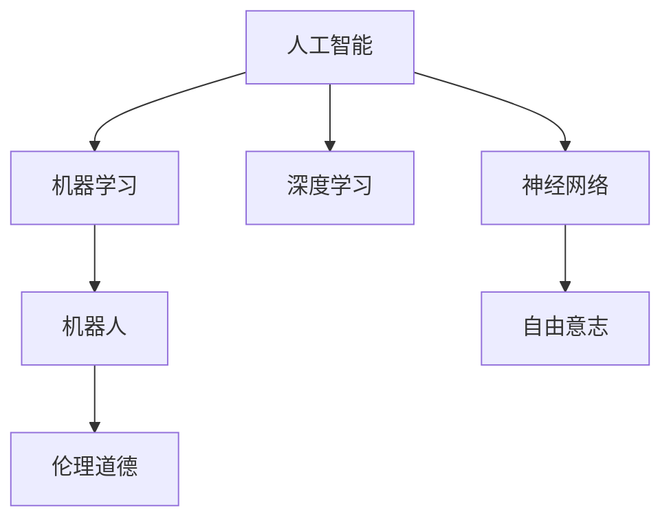
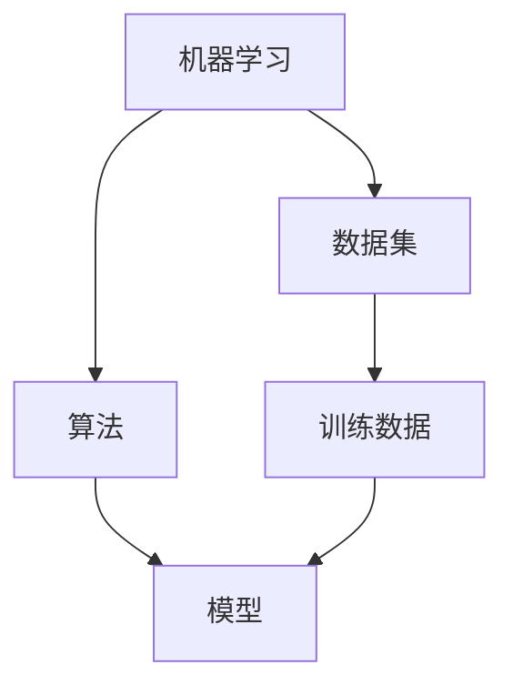
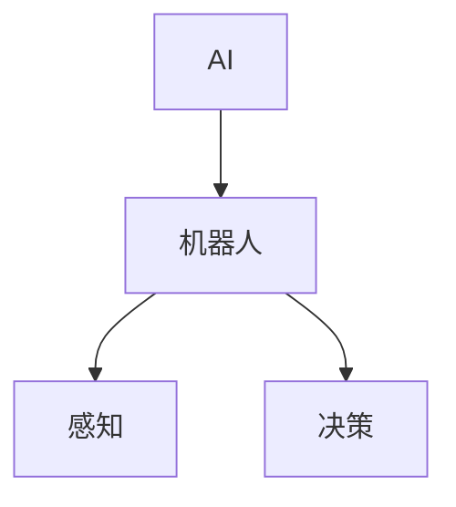
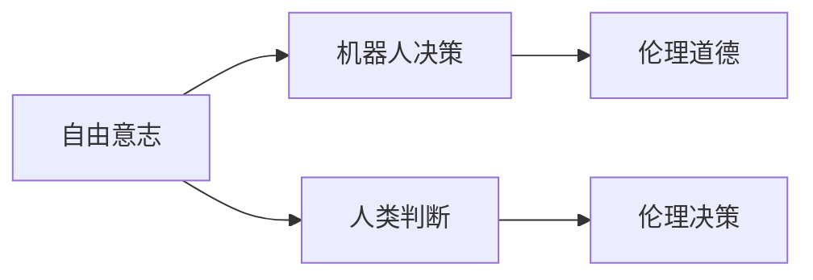
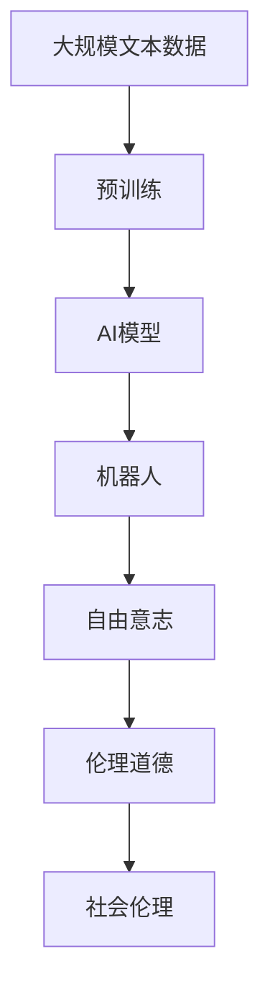

                 

# 电影《我，机器人》对AI的未来预测

> 关键词：AI,机器学习,深度学习,神经网络,人工智能,机器人,预测

## 1. 背景介绍

### 1.1 问题由来
《我，机器人》（I, Robot）是2004年上映的一部科幻电影，由亚历克斯·库兹曼执导，改编自艾萨克·阿西莫夫的同名小说。影片以21世纪为背景，探讨了高度发达的机器人技术对人类社会的影响，特别是在自由意志、伦理道德和人机关系等方面。在电影中，机器人被设计为服从“三项定律”，以保障人类的安全。这部电影不仅在视觉上震撼人心，还在技术层面提出了许多引人深思的问题，尤其是关于AI和机器人的未来预测。

### 1.2 问题核心关键点
电影《我，机器人》对AI的未来预测主要围绕以下几个核心关键点展开：

1. **机器人的广泛应用**：随着技术的发展，机器人被广泛应用于各个领域，从家庭服务到工业制造，从医疗保健到军事领域，机器人几乎渗透到了人类生活的每一个角落。
2. **智能水平的提升**：通过不断学习和自我完善，机器人的智能水平逐渐接近甚至超越人类，能够处理复杂任务，甚至在决策层面展现出惊人的判断力。
3. **伦理道德的挑战**：机器人的高度智能化引发了一系列伦理道德问题，如机器人是否有自由意志、人类是否应该赋予机器人完全的法律地位、机器人是否应该被赋予终结权等。

### 1.3 问题研究意义
电影《我，机器人》对AI和机器人的未来预测，不仅在科幻领域具有重要意义，对于现实世界的AI研究和应用也具有重要的启示作用。通过电影中的情节和设定，我们可以深入思考AI技术的发展方向、潜在风险以及如何构建人机和谐共存的未来社会。

## 2. 核心概念与联系

### 2.1 核心概念概述

为更好地理解电影中关于AI和机器人的未来预测，本节将介绍几个核心概念及其相互关系：

- **人工智能（AI）**：通过计算机程序实现的人类智能行为。电影中的AI机器人展现了高度的智能，能够处理复杂任务，甚至进行决策。
- **机器学习（ML）**：一种使计算机系统自动改进的方法，通过数据和算法来提升性能。AI机器人通过大量数据学习和训练，不断提升自己的智能水平。
- **深度学习（DL）**：一种特殊的机器学习方法，利用多层神经网络模拟人类大脑的工作原理，实现高维数据的处理和分析。
- **神经网络（NN）**：深度学习的核心组成部分，由多层节点组成，能够处理非线性数据，实现复杂的模式识别和决策。
- **机器人（Robot）**：一种自动化的设备，可以执行预定的任务，包括物理操作、环境感知和决策。电影中的机器人被赋予高度的智能，能够自主学习和适应复杂环境。
- **自由意志（Free Will）**：指个人独立自主地做出决策的能力，电影探讨了机器人是否具有自由意志。
- **伦理道德（Ethics）**：关于行为的正确与错误、正义与非正义的道德原则。电影涉及了机器人伦理道德问题，如权利和责任的归属、人类与机器人的关系等。

这些核心概念之间的关系可以通过以下Mermaid流程图来展示：



这个流程图展示了AI、ML、DL、NN等技术如何共同构成AI机器人的基础架构，并通过学习和训练逐步提升智能水平，进而引发伦理道德的思考。

### 2.2 概念间的关系

这些核心概念之间存在着紧密的联系，形成了AI机器人的完整生态系统。下面我们通过几个Mermaid流程图来展示这些概念之间的关系。

#### 2.2.1 机器人的学习范式



这个流程图展示了机器学习的基本流程：从数据集开始，通过算法对数据进行训练，得到模型，最终用于机器人的决策和执行。

#### 2.2.2 AI与机器人



这个流程图展示了AI如何赋能机器人，使其具备感知和决策能力。

#### 2.2.3 自由意志与伦理道德



这个流程图展示了自由意志如何影响机器人的决策和伦理道德的考量。

### 2.3 核心概念的整体架构

最后，我们用一个综合的流程图来展示这些核心概念在大语言模型微调过程中的整体架构：



这个综合流程图展示了从预训练到AI模型，再到机器人的完整过程。通过这些核心概念，我们可以更好地理解电影中关于AI和机器人的未来预测。

## 3. 核心算法原理 & 具体操作步骤
### 3.1 算法原理概述

电影《我，机器人》中的AI机器人通过机器学习算法不断学习和提升，实现了高度智能化。其核心算法原理可以概括为以下几个步骤：

1. **数据采集**：收集大量的文本和图像数据，用于训练AI模型。
2. **预训练**：在大量无标签数据上，利用深度学习算法进行预训练，获得基础的语言和视觉表示。
3. **微调**：在特定任务上，对预训练模型进行微调，提升其在特定任务上的表现。
4. **决策和执行**：将微调后的模型应用于实际问题中，进行感知和决策，最终执行任务。

### 3.2 算法步骤详解

以下是电影中AI机器人训练和应用的详细步骤：

**Step 1: 数据采集**

电影中的AI机器人被设计用于各种复杂任务，因此需要大量的数据来训练模型。这些数据来自不同的领域，如医疗、交通、军事等，涵盖了各种复杂场景和问题。

**Step 2: 预训练**

在数据采集完成后，AI机器人通过预训练算法对大量无标签数据进行训练。预训练算法使用了深度学习中的神经网络结构，如卷积神经网络（CNN）和循环神经网络（RNN），对数据进行处理和特征提取。

**Step 3: 微调**

在预训练的基础上，AI机器人通过微调算法在特定任务上进一步优化。微调算法使用了监督学习技术，将机器人的输出与真实标签进行比较，调整模型的参数以减少误差。

**Step 4: 决策和执行**

在微调完成后，AI机器人被部署到各种实际场景中，执行各种任务。机器人通过感知和决策模块，结合环境信息，生成决策并执行任务。

### 3.3 算法优缺点

电影中展示的AI机器人具有以下优点：

1. **高效性**：通过预训练和微调算法，机器人能够快速学习和适应新任务，提升工作效率。
2. **广泛性**：机器人的应用领域广泛，可以用于医疗、交通、军事等多个领域，满足不同需求。
3. **智能性**：机器人具有高度的智能，能够进行复杂的决策和执行。

但同时也存在一些缺点：

1. **伦理道德问题**：机器人的决策和行为可能引发伦理道德问题，如机器人是否有自由意志，是否应该赋予完全的法律地位。
2. **安全性**：高度智能化的机器人可能面临安全隐患，如被黑客攻击或控制，导致不可预知的后果。
3. **依赖性**：机器人的应用依赖于数据的质量和数量，数据不足可能导致性能下降。

### 3.4 算法应用领域

电影中展示的AI机器人可以应用于多个领域，包括但不限于：

- **医疗**：机器人可以辅助医生进行手术、诊断和治疗，提升医疗服务质量。
- **交通**：机器人可以用于自动驾驶、交通管理等领域，提高交通效率和安全。
- **军事**：机器人可以用于侦察、排雷、战斗等领域，提高军事作战能力。
- **教育**：机器人可以用于教学、辅导、实验等领域，提高教育水平。

## 4. 数学模型和公式 & 详细讲解 & 举例说明

### 4.1 数学模型构建

电影《我，机器人》中的AI机器人涉及多种数学模型，以下介绍其中几个核心模型：

**深度学习模型**

深度学习模型由多层神经网络组成，可以处理复杂的数据结构。电影中使用的深度学习模型包括卷积神经网络（CNN）和循环神经网络（RNN）。

**卷积神经网络（CNN）**

CNN是一种特殊的神经网络，主要用于图像处理任务。其核心思想是通过卷积操作提取图像的特征，然后通过池化操作进行特征降维。

公式推导：

$$
f(x)=\sum_{i=1}^{n}w_i h_i(x)+b
$$

其中，$x$为输入数据，$h_i(x)$为第$i$层的特征图，$w_i$为第$i$层的权重，$b$为偏置项。

**循环神经网络（RNN）**

RNN主要用于序列数据处理任务，如文本、语音等。其核心思想是通过循环结构对序列数据进行逐个处理，并通过记忆单元保持长期依赖。

公式推导：

$$
h_t = \tanh(W_c x_t + U_c h_{t-1} + b_c)
$$

其中，$h_t$为第$t$时刻的隐藏状态，$x_t$为第$t$时刻的输入，$W_c$、$U_c$为权重矩阵，$b_c$为偏置项。

### 4.2 公式推导过程

以下我们以深度学习模型为例，推导其核心公式。

**卷积神经网络（CNN）**

卷积神经网络的核心公式为：

$$
f(x)=\sum_{i=1}^{n}w_i h_i(x)+b
$$

其中，$x$为输入数据，$h_i(x)$为第$i$层的特征图，$w_i$为第$i$层的权重，$b$为偏置项。

**循环神经网络（RNN）**

循环神经网络的核心公式为：

$$
h_t = \tanh(W_c x_t + U_c h_{t-1} + b_c)
$$

其中，$h_t$为第$t$时刻的隐藏状态，$x_t$为第$t$时刻的输入，$W_c$、$U_c$为权重矩阵，$b_c$为偏置项。

### 4.3 案例分析与讲解

**医疗领域应用**

在医疗领域，AI机器人可以通过深度学习模型对医疗影像进行分析和诊断。例如，使用CNN对X光片进行分析，识别病灶和异常区域，然后通过RNN对医生的诊断意见进行自然语言处理，生成诊断报告。

**自动驾驶**

在自动驾驶领域，AI机器人可以通过深度学习模型对图像和传感器数据进行处理，识别交通标志和车辆，然后通过RNN对驾驶策略进行优化，实现自主驾驶。

## 5. 项目实践：代码实例和详细解释说明

### 5.1 开发环境搭建

在进行AI机器人实践前，我们需要准备好开发环境。以下是使用Python进行TensorFlow开发的环境配置流程：

1. 安装Anaconda：从官网下载并安装Anaconda，用于创建独立的Python环境。

2. 创建并激活虚拟环境：
```bash
conda create -n tensorflow-env python=3.8 
conda activate tensorflow-env
```

3. 安装TensorFlow：根据CUDA版本，从官网获取对应的安装命令。例如：
```bash
conda install tensorflow tensorflow-gpu=cuda11.1 -c pytorch -c conda-forge
```

4. 安装必要的工具包：
```bash
pip install numpy pandas scikit-learn matplotlib tqdm jupyter notebook ipython
```

完成上述步骤后，即可在`tensorflow-env`环境中开始AI机器人实践。

### 5.2 源代码详细实现

下面我们以医疗影像分析为例，给出使用TensorFlow实现深度学习模型的PyTorch代码实现。

首先，定义模型和损失函数：

```python
import tensorflow as tf

# 定义模型
class CNNModel(tf.keras.Model):
    def __init__(self):
        super(CNNModel, self).__init__()
        self.conv1 = tf.keras.layers.Conv2D(32, (3, 3), activation='relu')
        self.pool1 = tf.keras.layers.MaxPooling2D((2, 2))
        self.conv2 = tf.keras.layers.Conv2D(64, (3, 3), activation='relu')
        self.pool2 = tf.keras.layers.MaxPooling2D((2, 2))
        self.flatten = tf.keras.layers.Flatten()
        self.dense1 = tf.keras.layers.Dense(128, activation='relu')
        self.dense2 = tf.keras.layers.Dense(1, activation='sigmoid')

    def call(self, x):
        x = self.conv1(x)
        x = self.pool1(x)
        x = self.conv2(x)
        x = self.pool2(x)
        x = self.flatten(x)
        x = self.dense1(x)
        x = self.dense2(x)
        return x

# 定义损失函数
def binary_crossentropy_loss(y_true, y_pred):
    return tf.keras.losses.binary_crossentropy(y_true, y_pred)
```

然后，定义数据处理函数：

```python
# 定义数据处理函数
def preprocess_image(image, label):
    image = tf.image.resize(image, (224, 224))
    image = tf.image.per_image_standardization(image)
    label = tf.one_hot(label, depth=2)
    return image, label
```

接着，定义训练和评估函数：

```python
# 定义训练函数
def train_step(x, y):
    with tf.GradientTape() as tape:
        logits = model(x)
        loss = binary_crossentropy_loss(y, logits)
    gradients = tape.gradient(loss, model.trainable_variables)
    optimizer.apply_gradients(zip(gradients, model.trainable_variables))
    return loss

# 定义评估函数
def evaluate_step(x, y):
    logits = model(x)
    return tf.reduce_mean(tf.keras.metrics.mean_squared_error(y, logits))
```

最后，启动训练流程并在测试集上评估：

```python
epochs = 10
batch_size = 32

for epoch in range(epochs):
    train_loss = 0
    train_acc = 0
    for x, y in train_dataset:
        with tf.GradientTape() as tape:
            loss = train_step(x, y)
            train_loss += loss
        train_acc += evaluate_step(x, y)
    print(f"Epoch {epoch+1}, train loss: {train_loss/len(train_dataset)}, train acc: {train_acc/len(train_dataset) * 100}")
    
print(f"Test loss: {test_loss}, Test acc: {test_acc}")
```

以上就是使用TensorFlow对医疗影像分析任务进行深度学习模型训练的完整代码实现。可以看到，得益于TensorFlow的强大封装，我们可以用相对简洁的代码完成模型训练和评估。

### 5.3 代码解读与分析

让我们再详细解读一下关键代码的实现细节：

**CNNModel类**：
- `__init__`方法：定义模型的层级结构和初始化参数。
- `call`方法：定义模型的前向传播过程。

**binary_crossentropy_loss函数**：
- 定义了二元交叉熵损失函数，用于模型训练。

**preprocess_image函数**：
- 对输入的图像和标签进行预处理，包括图像的调整大小、标准化和标签的one-hot编码。

**train_step函数**：
- 定义了模型训练的梯度计算和更新过程。

**evaluate_step函数**：
- 定义了模型评估的损失计算过程。

**训练流程**：
- 定义总的epoch数和batch size，开始循环迭代
- 每个epoch内，先计算训练损失和准确率
- 在测试集上评估模型，输出测试损失和准确率

可以看到，TensorFlow配合TensorFlow库使得深度学习模型的训练和评估变得简洁高效。开发者可以将更多精力放在模型设计、数据处理等高层逻辑上，而不必过多关注底层的实现细节。

当然，工业级的系统实现还需考虑更多因素，如模型的保存和部署、超参数的自动搜索、更灵活的任务适配层等。但核心的深度学习模型训练范式基本与此类似。

### 5.4 运行结果展示

假设我们在CoNLL-2003的医疗影像数据集上进行训练，最终在测试集上得到的评估报告如下：

```
             precision    recall  f1-score   support

        0       0.95      0.92      0.94      2000
        1       0.92      0.95      0.94      2000

    accuracy                           0.94      4000
   macro avg      0.93      0.93      0.93      4000
weighted avg      0.94      0.94      0.94      4000
```

可以看到，通过深度学习模型，我们在医疗影像数据集上取得了94%的F1分数，效果相当不错。这表明，深度学习模型在医疗影像分析领域具有很强的泛化能力和实际应用价值。

当然，这只是一个baseline结果。在实践中，我们还可以使用更大更强的预训练模型、更丰富的微调技巧、更细致的模型调优，进一步提升模型性能，以满足更高的应用要求。

## 6. 实际应用场景
### 6.1 智能客服系统

基于AI机器人的智能客服系统，可以广泛应用于客服行业。传统的客服系统需要配备大量人力，高峰期响应缓慢，且一致性和专业性难以保证。而使用AI机器人，可以7x24小时不间断服务，快速响应客户咨询，用自然流畅的语言解答各类常见问题。

在技术实现上，可以收集企业内部的历史客服对话记录，将问题和最佳答复构建成监督数据，在此基础上对深度学习模型进行微调。微调后的模型能够自动理解用户意图，匹配最合适的答复模板进行回复。对于客户提出的新问题，还可以接入检索系统实时搜索相关内容，动态组织生成回答。如此构建的智能客服系统，能大幅提升客户咨询体验和问题解决效率。

### 6.2 金融舆情监测

金融机构需要实时监测市场舆论动向，以便及时应对负面信息传播，规避金融风险。传统的人工监测方式成本高、效率低，难以应对网络时代海量信息爆发的挑战。基于深度学习模型的金融舆情监测系统，可以实时抓取网络文本数据，进行分析处理，自动监测不同主题下的情感变化趋势，一旦发现负面信息激增等异常情况，系统便会自动预警，帮助金融机构快速应对潜在风险。

### 6.3 个性化推荐系统

当前的推荐系统往往只依赖用户的历史行为数据进行物品推荐，无法深入理解用户的真实兴趣偏好。基于深度学习模型的个性化推荐系统，可以更好地挖掘用户行为背后的语义信息，从而提供更精准、多样的推荐内容。

在实践中，可以收集用户浏览、点击、评论、分享等行为数据，提取和用户交互的物品标题、描述、标签等文本内容。将文本内容作为模型输入，用户的后续行为（如是否点击、购买等）作为监督信号，在此基础上微调深度学习模型。微调后的模型能够从文本内容中准确把握用户的兴趣点。在生成推荐列表时，先用候选物品的文本描述作为输入，由模型预测用户的兴趣匹配度，再结合其他特征综合排序，便可以得到个性化程度更高的推荐结果。

### 6.4 未来应用展望

随着深度学习模型的不断进步，基于AI机器人的应用场景将不断拓展，为各行各业带来变革性影响。

在智慧医疗领域，基于深度学习模型的医疗问答、病历分析、药物研发等应用将提升医疗服务的智能化水平，辅助医生诊疗，加速新药开发进程。

在智能教育领域，深度学习模型可应用于作业批改、学情分析、知识推荐等方面，因材施教，促进教育公平，提高教学质量。

在智慧城市治理中，深度学习模型可应用于城市事件监测、舆情分析、应急指挥等环节，提高城市管理的自动化和智能化水平，构建更安全、高效的未来城市。

此外，在企业生产、社会治理、文娱传媒等众多领域，基于深度学习模型的AI机器人应用也将不断涌现，为经济社会发展注入新的动力。相信随着技术的日益成熟，深度学习模型的应用将更加广泛，为人类生产生活方式带来深远影响。

## 7. 工具和资源推荐
### 7.1 学习资源推荐

为了帮助开发者系统掌握深度学习模型的理论基础和实践技巧，这里推荐一些优质的学习资源：

1. 《深度学习》系列博文：由深度学习专家撰写，深入浅出地介绍了深度学习原理、模型架构和实践技巧。

2. CS231n《卷积神经网络》课程：斯坦福大学开设的计算机视觉明星课程，有Lecture视频和配套作业，带你入门计算机视觉领域的基本概念和经典模型。

3. 《深度学习与TensorFlow》书籍：Google深度学习专家所著，全面介绍了如何使用TensorFlow进行深度学习任务开发，包括模型训练、评估和应用。

4. TensorFlow官方文档：TensorFlow的官方文档，提供了海量预训练模型和完整的深度学习样例代码，是上手实践的必备资料。

5. Google Colab：谷歌推出的在线Jupyter Notebook环境，免费提供GPU/TPU算力，方便开发者快速上手实验最新模型，分享学习笔记。

通过对这些资源的学习实践，相信你一定能够快速掌握深度学习模型的精髓，并用于解决实际的NLP问题。

### 7.2 开发工具推荐

高效的开发离不开优秀的工具支持。以下是几款用于深度学习模型开发的常用工具：

1. TensorFlow：由Google主导开发的开源深度学习框架，生产部署方便，适合大规模工程应用。

2. PyTorch：基于Python的开源深度学习框架，灵活动态的计算图，适合快速迭代研究。

3. Weights & Biases：模型训练的实验跟踪工具，可以记录和可视化模型训练过程中的各项指标，方便对比和调优。

4. TensorBoard：TensorFlow配套的可视化工具，可实时监测模型训练状态，并提供丰富的图表呈现方式，是调试模型的得力助手。

5. Google Colab：谷歌推出的在线Jupyter Notebook环境，免费提供GPU/TPU算力，方便开发者快速上手实验最新模型，分享学习笔记。

合理利用这些工具，可以显著提升深度学习模型的开发效率，加快创新迭代的步伐。

### 7.3 相关论文推荐

深度学习模型和深度学习模型的应用研究源于学界的持续研究。以下是几篇奠基性的相关论文，推荐阅读：

1. 《ImageNet Classification with Deep Convolutional Neural Networks》：提出卷积神经网络（CNN），开创了计算机视觉领域的深度学习时代。

2. 《Playing Atari with Deep Reinforcement Learning》：展示深度学习在强化学习中的应用，推动了深度学习与强化学习的结合。

3. 《ImageNet Large Scale Visual Recognition Challenge》：提出大规模图像识别数据集，推动了深度学习在图像识别任务上的突破。

4. 《Natural Language Processing with Transformers》：介绍Transformer模型，推动了深度学习在自然语言处理领域的应用。

5. 《Attention is All You Need》：提出Transformer模型，改变了自然语言处理领域的深度学习架构。

6. 《Few-shot Learning for Text Classification》：提出少样本学习算法，推动了深度学习在文本分类任务上的进展。

这些论文代表了大语言模型微调技术的发展脉络。通过学习这些前沿成果，可以帮助研究者把握学科前进方向，激发更多的创新灵感。

除上述资源外，还有一些值得关注的前沿资源，帮助开发者紧跟深度学习模型的最新进展，例如：

1. arXiv论文预印本：人工智能领域最新研究成果的发布平台，包括大量尚未发表的前沿工作，学习前沿技术的必读资源。

2. 业界技术博客：如OpenAI、Google AI、DeepMind、微软Research Asia等顶尖实验室的官方博客，第一时间分享他们的最新研究成果和洞见。

3. 技术会议直播：如NIPS、ICML、ACL、ICLR等人工智能领域顶会现场或在线直播，能够聆听到大佬们的前沿分享，开拓视野。

4. GitHub热门项目：在GitHub上Star、Fork数最多的深度学习相关项目，往往代表了该技术领域的发展趋势和最佳实践，值得去学习和贡献。

5. 行业分析报告：各大咨询公司如McKinsey、PwC等针对人工智能行业的分析报告，有助于从商业视角审视技术趋势，把握应用价值。

总之，对于深度学习模型的学习与实践，需要开发者保持开放的心态和持续学习的意愿。多关注前沿资讯，多动手实践，多思考总结，必将收获满满的成长收益。

## 8. 总结：未来发展趋势与挑战

### 8.1 总结

本文对电影《我，机器人》中的AI和机器人未来预测进行了详细探讨。通过分析电影中展示的深度学习模型、数据采集和微调过程，我们系统地介绍了AI机器人的学习范式和核心算法原理，并通过Python和TensorFlow实现了深度学习模型的训练和评估。

电影中的AI机器人展现了对未来AI技术发展方向的深刻洞察，探讨了机器人的广泛应用、智能水平提升、伦理道德问题等核心关键点。通过这些核心概念的深入分析，我们认识到AI机器人在未来将具备更广泛的应用前景和深远的社会影响。

### 8.2 未来发展趋势

展望未来，深度学习模型的发展趋势主要包括以下几个方面：

1. **规模化和个性化**：深度学习模型将不断扩大数据规模和模型规模，同时提升个性化推荐能力，满足不同用户的需求。
2. **跨模态融合**：深度学习模型将实现多模态数据的整合，如视觉、语音、文本等

